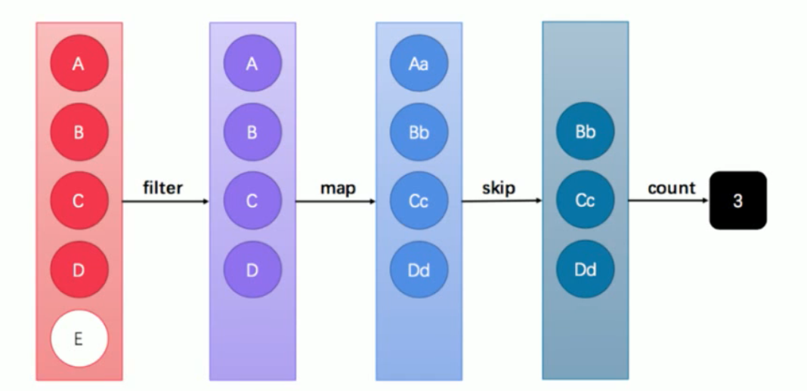
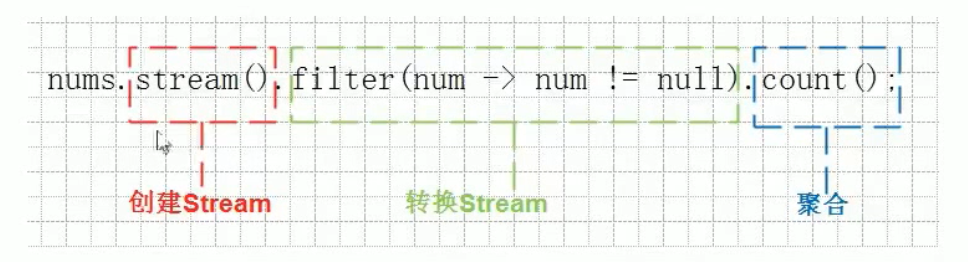
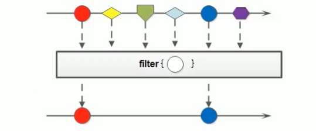
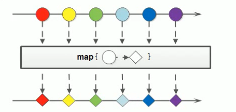
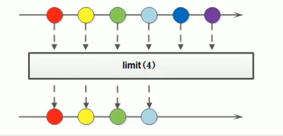
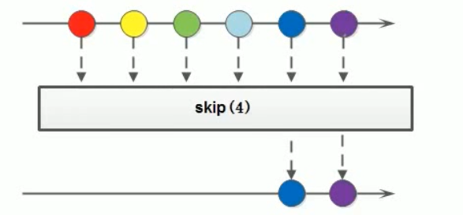

# Java8新特性

## 函数式接口与Lambda表达式

### 概念

函数式接口在Java中是指：有且仅有一个抽象方法的接口。

函数式接口，即适用于函数式变成场景的接口。而Java中函数式变成体现就是`Lambda`,所以函数式接口就是适用于`Lambda`使用的接口。只有确保接口中有且仅有一个抽象方法，`Java`中的Lambda才能被顺利的进行推导。

> `语法糖`是指使用更加方便，但是原理不变的代码语法。例如在遍历集合时使用的forEach语法，其实底层实现原理仍然是迭代器。从应用层面来讲，`Java`中的`Lambda`也可以被当作是匿名内部类的`语法糖`,但是二者在原理上是不相同的。

### 格式

只要确保接口中有且仅有一个抽象方法即可：

```java
修饰符 interface 接口名称 {
	public abstract 返回值类型 方法名称(可选参数);
    // 其他非抽象方法内容
}
```

Java中接口的特性：

- 接口是隐式抽象的，当声明一个接口的时候，不必使用**abstract**关键字。
- 接口中每一个方法也是隐式抽象的，声明时同样不需要**abstract**关键字。
- 接口中的方法都是公有的。

所以我们可以省略`public abstract`的修饰，所以定义一个函数式接口就变得很简单：

```java
public interface MyFunctionalInterface {
    void hello();
}
```

### `@FunctionalInterface`注解

`Java8`中专门为函数式接口引入了一个新的注解：`@FunctionalInterface`。该注解可用于一个接口的定义上

```java
@FunctionalInterface
public interface MyFunctionalInterface {
    abstract void hello();
}
```

添加这个注解之后，如果接口中存在多个方法或者没有方法，就会报错，它的作用就是检测接口是否是一个函数式接口。（接口方法都是隐式抽象所以为了简化直接称为方法，而不再加抽象修饰）

### 函数式接口的使用

```java

public class Demo1 {
    // 定义一个方法，参数使用函数式接口
    public static void show (MyFunctionalInterface myInterface) {
        myInterface.hello();
    }

    public static void main(String[] args) {
        // 调用show方法，方法的参数是一个接口，所以可以传递接口的实现类对象
        show(new MyFunctionalInterface() {
            // 使用匿名内部类重写方法
            @Override
            public void hello() {
                System.out.println("我是函数式接口中的方法hello...");
            }
        });

        // 调用show方法，方法的参数一个函数时接口，所以可以使用Lambda表达式
        show(()->{
            System.out.println("使用Lambda表达式重写接口中的抽象方法。。。。");
        });
        
        // 简化Lambda表达式
        show(()-> System.out.println("这是简化后的Lambda表达式写法。。"));
    }
}
```

### 函数式编程

#### Lambda的延迟执行

有些场景的代码执行后，结果不一定会被使用，从而造成性能浪费。而`Lambda`表达式是延迟执行的，这正好可以作为解决方案，提升性能。

#### 性能浪费的日志案例

注：日志可以帮助我们快速的定位问题，记录程序运行过程中的情况，以便项目的监控和优化。
一种典型的场景就是对参数进行有条件使用，例如对日志消息进行拼接后，在满足条件的情况下进行打印输出：

```java
public class Demo01Logger {
    // 定义一个根据日志级别显示日志信息的方法
    public static void showLog(int level, String message) {
        // 对日志的等级进行判断，如果级别是1那么输出日志信息
        if (level == 1) {
            System.out.println(message);
        }
    }

    public static void main(String[] args) {
        // 定义三个日志信息
        String msg1 = "hello";
        String msg2 = "world";
        String msg3 = "Java";

        //调用showLog方法，传递日志级别和日志信息
        showLog(1, msg1 + msg2 + msg3);
        showLog(2, msg1 + msg2 + msg3);
        showLog(3, msg1 + msg2 + msg3);

        // 以上代码存在性能浪费问题，我们是拼接字符串再调用showLog
        // 如果level不是1，那么就不会输出拼接后的字符串，白拼接了字符串
    }
}
```

#### 体验Lambda的延迟

```java
@FunctionalInterface
public interface MessageBuilder {
    // 定义一个拼接消息的抽象方法，返回拼接消息
    String joinMessage();
}
```

```java

/**
 * 使用Lambda优化日志案例
 * Lambda的特点1：延迟加载
 * Lambda的使用前提，必须存在函数式接口
 */
public class Demo2Lambda {
    // 定义一个写日志的方法
    public static void showLog(int level, MessageBuilder messageBuilder) {
        // 对日志的等级进行判断，如果是1，调用joinMessage方法
        if (level == 1) {
            System.out.println(messageBuilder.joinMessage());
        }
    }

    public static void main(String[] args) {
        // 定义三个日志信息
        String msg1 = "hello";
        String msg2 = "world";
        String msg3 = "Java";

        //调用showLog方法，参数MessageBuilder是函数式接口
        showLog(1, ()->{
            //返回拼接的字符串
            return msg1 + msg2 + msg1;
        });

        // 使用Lambda表达式作为参数传递，仅仅是把参数传到showLog方法中
        // 只有满足条件，才会调用joinMessage方法，而只有调用时才会拼接字符串
        // 所以拼接字符串的代码得到了延迟加载的功能，不会造成性能浪费
    }
}
```

#### 使用Lambda作为参数和返回值

如果抛开实现原理不说，`Java`中的`Lambda`表达式可以被当作是匿名

内部类的替代品。如果方法的参数是一个函数式接口类型，那么就可

以使用`Lambda`表达式进行替代。使用`Lambda`表达式作为方法参数，

其实就是使用函数式接口作为方法参数。

例如`java.lang.Runnable`接口就是一个函数式接口，假设有一个

`startThread`方法使用该接口作为参数，那么就可以使用`Lambda`

进行传参。这种情况其实和`Thread`类的构造方法参数为`Runnable`没

有本质区别。

### 常用函数式接口

#### Supplier接口

`java.util.function.Supplier<T>`接口仅包含一个无参的方法：T `get()`。用来获取一个泛型参数指定类型的对象数据。由于这是一个函数式接口，这也就意味着对应的`Lambda`表达式需要“**对外提供**“一个符合泛型类型的对象数据。

```java
/**
 * 常用函数式接口
 * java.util.function.Supplier<T>接口仅包含一个无参方法
 * T get()。用于获取一个泛型参数指定类型的对象数据
 * Supplier<T>接口被称之为生产型接口
 */
public class SupplierDemo {
    // 定义一个方法，方法参数传递Supplier<T>接口
    public static String getString(Supplier<String> supplier) {
        return supplier.get();
    }

    public static void main(String[] args) {
        // 调用getString
        String result = getString(()->{
            return "Hello World";
        });

        System.out.println(result);
    }
}
```

#### Consumer接口

j`ava.util.function.consumer<T>`接口则正好与`Supplier`接口相反，它不是生产一个数据，而是消费一个数据，其数据类型由泛型决定。

##### accept

```java
/**
 * Consumer是一个消费型接口泛型是什么类型
 * 就可以使用accept方法消费什么类型的数据
 */
public class ConsumerDemo {
    public static void hello(String name, Consumer<String> consumer) {
        consumer.accept(name);
    }

    public static void main(String[] args) {
        // 调用hello方法，传递需要消费的字符串和Consumer函数式接口
        hello("张三", (String name)->{
            // 消费name
            System.out.println("Hello "+name);
        });

    }
}
```

##### 默认方法：andThen

如果一个方法的参数和返回值全都是`consumer`类型，那么就可以实现效果：消费数据的时候，首先做一个操作，然后再做一个操作，实现组合。而这个方法就是`consumer` 接口中的`default`方法andThen。下面是`JDK`的源代码：

```java
default Consumer<T> andThen(Consumer<? super T> after){
    Objects. requireNonNu11(after);
    return(T t)->{
        accept(t);
        after.accept(t);
   	};
}
```

> 备注：`java.util.objects`的`requireNonNull`静态方法将会在参数为`null`时主动抛出`NullPointerException`异常。这省去了重复编写if语句和抛出空指针异常的麻烦。

要想实现组合，需要两个或多个`Lambda`表达式即可，而`andThen`的语义正是“一步接一步”操作。例如两个步骤组合的情况：

```java
/**
 * Consumer接口的默认方法andThen
 * 作用:需要两个Consumer接口,可以把两个Consumer接口组合到一起再进行消费
 */
public class AndThenDemo {
    public static void hello(String name, Consumer<String> consumer1, Consumer<String> consumer2) {
        // consumer1.accept(name);
        // consumer2.accept(name);

        // 等同上面使用andThen方法连接两个Consumer再进行消费
        consumer1.andThen(consumer2).accept(name);
    }

    public static void main(String[] args) {
        hello("张三",(name)->{
            System.out.println(name+"消费了一只鸡");
        },(name)->{
            System.out.println(name+"消费100元");
        });
    }
}
```

#### Predicate接口

有时候我们需要对某种类型的数据进行判断，从而得到一个`boolean`值结果。这时可以使用`java.util.function.predicate<T>`接口。

##### 抽象方法：test

`Predicate` 接口中包含一个抽象方法：`boolean test(T t)`。用于条件判断的场景：

```java
/**
 * Predicate接口中包含一个抽象方法：
 * boolean test(T t):用来对指定数据进行判断的方法，符合返回true
 */
public class PredicateDemo {
    /**
     * 定义一个方法，参数传递一个String类型的字符串
     * 传递一个Predicate接口，使用Predicate的test
     * 方法对字符串进行判断，返回判断结果
     */
    public static boolean checkString(String s, Predicate<String> predicate) {
        return predicate.test(s);
    }

    public static void main(String[] args) {
        String s= "abcde";

        boolean flag = checkString(s, (String str)->{
            //对参数传递的字符串进行判断
            return str.length() > 5;
        });
        System.out.println(false);
    }
}
```

##### 默认方法：and

既然是条件判断，就会存在与、或、非三种常见的逻辑关系。其中将两个`Predicate`条件使用“与”逻辑连接起来实现“**并且**”的效果时，可以使用`default`方法and。其`JDK`源码为：

```java
default Predicate<T> and(Predicate<? super T> other) {
    objects.requireNonNull(other);
    return(t)->test(t) && other. test(t);
}
```

如果要判断一个字符围既要包含大写`H`，又要包含大写`W`，那么：

```java

/**
 * 逻辑表达式&&： 可以连接多个判断的条件
 */
public class PredicateAndDemo {
    public static void hello(Predicate<String> predicate1, Predicate<String> predicate2){
        boolean isValid = predicate1.and(predicate2).test("Hello World");
        System.out.println("字符串是否符合要求："+isValid);
    }

    public static void main(String[] args) {
        hello(s->s.contains("H"), s->s.contains("W"));
    }
}
```

如果希望实现逻辑字符串包含大写`H`**或者**包含大写`W`，那么代码只需要将`and`修改为`or`名称即可，其他都不

```java
public class PredicateOrDemo {
    public static void hello(Predicate<String> predicate1, Predicate<String> predicate2){
        // 使用or
        boolean isValid = predicate1.or(predicate2).test("Hello World");
        System.out.println("字符串是否符合要求："+isValid);
    }

    public static void main(String[] args) {
        hello(s->s.contains("H"), s->s.contains("W"));
    }
}
```

##### 默认方法：negate

表示逻辑非（取反），默认方法`negate`的`JDK`源代码为：

```java
default Predicate<T> negate(){
    return (t) -> !test(t);
}
```

从实现中很容易看出，它是执行了`test`方法之后，对结果`boolean`值进行"”取反而已。一定要在`test `方法调用之前调用`negate`方法，正如`and`和`or`方法一样：

```java
public class PredicateNegateDemo {
    public static void hello(Predicate<String> predicate) {
        // 使用negate
        boolean isValid = predicate.negate().test("Hello World");
        System.out.println("字符串是否符合要求："+isValid);
    }

    public static void main(String[] args) {
        hello(s->s.contains("H"));
    }
}
```

#### Function接口

`java.util.function.Function<T,R>`接口用来根据一个类型的数据得到另一个类型的数据，前者称为前置条件，后者称为后置条件。

##### 抽象方法:apply

`Function `接口中最主要的抽象方法为：`R apply(T t)`，根据类型`T`的参数获取类型R的结果。
使用的场景例如：将`String` 类型转换为`Integer` 类型。

```java
public class FunctionDemo {
    // String转Integer
    public static void convertType(String s, Function<String, Integer> fun) {
        Integer number = fun.apply(s);
        System.out.println(number);
    }

    public static void main(String[] args) {
        String s = "12313";
        convertType(s, (str)->{
            // String转Integer
            return Integer.parseInt(str);
        });
    }
}
```

##### 默认方法：andThen

`Function` 接口中有一个默认的`andThen`方法，用来进行组合操作。`JDK`源代码如：

```java
default <V> Function<T,V> andThen(Function<? super R,? extends V) after){
    objects.requireNonNu11(after);
    return(T t)->after.apply(apply(t));
}
```

该方法同样用于“先做什么，再做什么”的场景，和`consumer`中的`andThen`差不多：

```java
public class FunctionAndThenDemo {
    // 将String转为Integer在转为Long型
    public static void convertType(String s, Function<String,Integer> fun1, Function<Integer, Long> fun2) {
        Long number = fun1.andThen(fun2).apply(s);
        System.out.println(number.getClass()+",值：" + number);
    }

    public static void main(String[] args) {
        String s = "12313";
        convertType(s, str->{
            return Integer.parseInt(str);
        }, num->{
            return num.longValue();
        });
    }
}
```

## Stream流

说到`Stream`便容易想到`I/O Stream`，而实际上，谁规定”流”就一定是”IO流“呢？在`Java8`中，得益于`Lambda`所带来的函数式编程，引入了一个全新的`Stream`概念，用于解决已有集合类库既有的弊端。

### 循环遍历的弊端

Java8的Lambda让我们可以更加专注于做什么（What），而不是怎么做（How），这点此前已经结合内部类进行了对比说明。现在，我们仔细体会一下上例代码，可以发现：

- for循环的语法就是“怎么做”
- for循环的循环体才是“做什么”

为什么使用循环？因为要进行遍历。但循环是遍历的唯一方式吗？遍历是指每一个元素逐一进行处理，而并不是从第一个到最后一个顺次处理的循环。前者是目的，后者是方式。
试想一下，如果希望对集合中的元素进行筛选过滤：

1. 将集合A根据条件一过滤为子集B
2. 然后再根据条件二过滤为子集C

传统方式遍历：

```java
public class TraditionalIterator {
	public static void main(String[] args) {
		List<String> list = new ArrayList<>();
		list.add("张无忌");
		list.add("张三丰");
		list.add("周芷若");
		list.add("赵敏");
		list.add("张三");

		List<String> zhangList = new ArrayList<>();
		for (String name : list) {
			if (name.startsWith("张")) {
				zhangList.add(name);
			}
		}

		List<String> shortList = new ArrayList<>();
		for (String name : zhangList) {
			if (name.length() == 3) {
				shortList.add(name);
			}
		}

		for (String name : shortList) {
			System.out.println(name);
		}
	}
}
```

这段代码中含有三个循环，每一个作用不同：

1. 首先筛选所有姓张的人；

2. 然后筛选名字有三个字的人；

3. 最后进行对结果进行打印输出。

每当我们需要对集合中的元素进行操作的时候，总是需要进行循环

循环、再循环。这是理所当然的么？不是。循环是做事情的方式，而

不是目的。另一方面，使用线性循环就意味着只能遍历一次。如果希

望再次遍历，只能再使用另一个循环从头开始。

那，Lambda的衍生物Stream能给我们带来怎样更加优雅的写法呢？

### Stream的写法

下面来看一下借助`Java 8`的`StreamAPl`，什么才叫优雅：

```java
public class StreamIteratorDemo {
	public static void main(String[] args) {
		List<String> list = new ArrayList<>();
		list.add("张无忌");
		list.add("张三丰");
		list.add("周芷若");
		list.add("赵敏");
		list.add("张三");

		list.stream()
				.filter(name->name.startsWith("张"))
				.filter(name->name.length() == 3)
				.forEach(name-> System.out.println(name));
	}
}
```

### 流式思想概述

注意：请暂时忘记对传统`IO`流的固有印象！

整体来看，流式思想类似于工厂车间的“生产流水线”

当需要对多个元素进行操作（特别是多步操作）的时候，考虑到性能

及便利性，我们应该首先拼好一个“模型”步骤方案，然后再按照方案去

执行它。



这张图中展示了过滤、映射、跳过、计数等多步操作，这是一种集合元素的处理方案，而方案就是一种“函数模型”。图中的每一个方框都是一个“流”，调用指定的方法，可以从一个流模型转换为另一个流模型。而最右侧的数字3是最终结果。

这里的filter、map、skip都是在对函数模型进行操作，集合元素并没有真正被处理。只有当终结方法count执行的时候，整个模型才会按照指定策略执行操作。而这得益于Lambda的延迟执行特性。

> 备注：`Stream流`其实是一个集合元素的函数模型，它并不是集合，也不是数据结构，其本身并不存储任何元素（或其地址值）。

`Stream`（流）是一个来自数据源的元素队列

- 元素是特定类型的对象，形成一个队列。Java中的Stream并不会存储元素，而是按需计算。
- 数据源流的来源。可以是集合，数组等。

和以前的`Collection`操作不同，`Stream`操作还有两个基础的特征：

- `Pipelining`：中间操作都会返回流对象本身。这样多个操作可以串联成一个管道，如同流式风格（`fluent style`）。这样做可以对操作进行优化，比如延迟执行（`laziness`）和短路（`short-circuiting`）。

- 内部迭代：以前对集合遍历都是通过`Iterator`或者增强`for`的方式，显式的在集合外部进行迭代，这叫做外部迭代。`Stream`提供了内部迭代的方式，流可以直接调用遍历方法。

当使用一个流的时候，通常包括三个基本步骤：获取一个数据源（`source`）→数据转换一执行操作获取想要的结果，每次转换原有Stream对象不改变，返回一个新的Stream对象（可以有多次转换），这就允许对其操作可以像链条一样排列，变成一个管道。

### 获取流

`java.uti1.stream.stream<T>`是`Java8`新加入的最常用的流接口。（这并不是一个函数式接口）获取一个流非常简单，有以下几种常用的方式：

- 所有的`Collection `集合都可以通过`stream `默认方法获取流；
- `stream`接口的静态方法`of`可以获取数组对应的流。

#### 根据Collection获取流

首先，`java.util.collection` 接口中加入了`default`方法`stream`用来获取流，所以其所有实现类均可获取流。

```java
public class GetStreamDemo {
	public static void main(String[] args) {
		// 把集合转为Stream流,通过stream方法获取
		List<String> list = new ArrayList<>();
		Stream<String> listStream = list.stream();

		Set<String> set = new HashSet<>();
		Stream<String> setStream = set.stream();
	}
}
```

#### 根据Map获取流

```java
// 间接将map转为stream
Map<String, String> map = new HashMap<>();
Set<String> mapKeySet = map.keySet();
Stream<String> keySetStream = mapKeySet.stream();

Collection<String> mapValues = map.values();
Stream<String> collectionStream = mapValues.stream();

Set<Map.Entry<String, String>> mapEntrySet = map.entrySet();
Stream<Map.Entry<String, String>> entrySetStream = mapEntrySet.stream();
```

#### 根据数组获取`Stream`流

```java
int[] helloInt = {1, 2, 3, 4, 5};
Stream<int[]> helloIntStream = Stream.of(helloInt);

Stream<Integer> integerStream = Stream.of(1, 2, 3, 4, 5, 6);

String[] helloString = {"a", "bb", "cc"};
Stream<String> helloStringStream = Stream.of(helloString);
```

### 常用方法



流模型的操作很丰富，这里介绍一些常用的`APl`。这些方法可以被分成两种：

- 延迟方法：返回值类型仍然是`Stream `接口自身类型的方法，因此支持链式调用。（除了终结方法外，其余方法均为延迟方法。）
- 终结方法：返回值类型不再是`stream `接口自身类型的方法，因此不再支持类似`stringBuilder`那样的链式调用。本小节中，终结方法包括 `count`和`forEach `方法。

> 备注：本小节之外的更多方法，请自行参考API文档。

#### 逐一处理：forEach

```java
public class StreamForEachDemo {
	public static void main(String[] args) {
		List<String> list = new ArrayList<>();
		list.add("张三");
		list.add("李四");
		list.add("王五");
		list.add("赵六");
		list.add("二麻子");

		Stream<String> stream = list.stream();
		// 使用forEach对流进行遍历
		stream.forEach(name -> System.out.println(name));

	}
}
```

#### 过滤：filter

可以通过`filter `方法将一个流转换成另一个子集流。方法签名：

```java
Stream<T> filter(Predicate<? super T> predicate);
```

该接口接收个`Predicate`函数式接口参数（可以是一个`Lambda`或方

法引用）作为筛选条件。



此前已经学习过`java.util.stream.Predicate`函数式接口，其中的方法为：

```java
boolean test(T t)
```

该方法将会产生一个`boolean`值结果，代表指定的条件是否满足。如

果结果为`true`，那么`Stream`流的`filter `方法将会留用元素；如果

结果为`false`，那么`filter`方法将会舍弃元素。

Stream流中的filter方法基本使用的代码如：

```java
public class StreamFilterDemo {
	public static void main(String[] args) {
		List<String> list = new ArrayList<>();
		list.add("张三");
		list.add("张三丰");
		list.add("张二狗");
		list.add("赵六");
		list.add("二麻子");

		// 执行filter后会返回Stream流，可以继续对Stream流进行操作，链式调用
		Stream<String> listStream = list.stream()
				.filter(name->name.startsWith("张"))
				.filter(name->name.length() == 3);

		listStream.forEach(name -> System.out.println(name));
	}
}
```

`Stream`属于管道流，只能被消费一次，第一个`Stream`流被调用完毕，数据就会流转到下一个`Stream`上，而这时第一个`Stream`流已经使用完毕就关闭了，所以第一个`Stream`流不能再调用方法。

```java
// 对上述代码消费两次
listStream.forEach(name -> System.out.println(name));
listStream.forEach(name -> System.out.println(name));
```

执行结果为：

```java
张三丰
张二狗
Exception in thread "main" java.lang.IllegalStateException: stream has already been operated upon or closed
```

#### 映射：map

如果需要将流中的元素映射到另一个流中，可以使用map方法。方法签名：

```java
<R> Stream<R> map(Function<? super T, ? extends R> mapper);
```

该接口需要一个`Function`函数式接口参数，可以将当前流中的`T`类型数据转换为另一种`R`类型的流。



此前我们已经学习过`java.util.stream.Function`函数式接口，其中唯一的抽象方法为：

```java
R apply(T t);
```

这可以将一种`T`类型转换成为`R`类型，而这种转换的动作，就称为“映射”。

`Stream`流中的`map`方法基本使用的代码如：

```java
public class StreamMapDemo {
	public static void main(String[] args) {
		// 获取Stream
		Stream<String> stream = Stream.of("5", "12", "34");
		//将字符串Stream转为Integer类型的Stream
		Stream<Integer> integerStream = stream.map(str -> Integer.parseInt(str));

		integerStream.forEach(num -> System.out.println(num));
	}
}
```

#### 统计个数：count

正如旧集合`Collection `当中的`size`方法一样，流提供`count`方法来数一数其中的元素个数：

```java
long count();
```

该方法返回一个`long`值代表元素个数（不再像旧集合那样是`int`值）。基本使用：

```java
public class StreamCountDemo {
	public static void main(String[] args) {
		List<String> list = new ArrayList<>();
		list.add("A man");
		list.add("needs to");
		list.add("know");
		list.add("when to stand up");
		list.add("for himself");

		long count = list.stream().count();
		System.out.println(count);
	}
}
```

结果为：

```java
5
```

#### 截取：limit

`limit `方法可以对流进行截取，只取用前`n`个。方法签名：

```java
Stream<T> limit(long maxsize);
```

参数是一个`long`型，如果集合当前长度大于参数则进行截取；否则不进行操作。基本使用：



```java
public class StreamLimitDemo {
	public static void main(String[] args) {
		// 获取一个Stream流
		String[] strings = {"万界神主","斗罗大陆","斗破苍穹"};
		Stream<String> stringStream = Stream.of(strings);
		// 使用limit方法对Stream流中的元素截取只要前2个
		stringStream.limit(2).forEach(name-> System.out.println(name));
	}
}
```

运行结果：

```java
万界神主
斗罗大陆
```

#### 跳过：skip

如果希望跳过前几个元素，可以使用skip方法获取一个截取之后的新流：

```java
Stream<T> skip(long n);
```

如果流的当前长度大于n，则跳过前n个；否则将会得到一个长度为0的空流。基本使用：



```java
/**
 * Stream流中的Skip方法：用于跳过元素
 * 如果希望跳过前几个元素，可以使用skip方法获取一个截取后的新流
 * 如果流的当前长度大于n,则跳过前n个，否则会得到一个长度为0的空流
 * @author guqin
 * @date 2019-07-23 20:53
 */
public class StreamSkipDemo {
	public static void main(String[] args) {
		String[] strings = {"万界神主","斗罗大陆","斗破苍穹","天行九歌"};
		Stream<String> stringStream = Stream.of(strings);

		stringStream.skip(2)
				.forEach(name-> System.out.println(name));
	}
}
```

运行结果：

```java
斗破苍穹
天行九歌
```

#### 组合：concat

如果有两个流，希望合并成为一个流，那么可以使用 stream 接口的静态方法`concat`：

```java
static <T> Stream<T> concat(Stream<? extends T) a, Stream<? extends T) b);
```

> 备注：这是一个静态方法，与`java.lang.String`当中的`concat `方法是不同的。

该方法的基本使用代码如：

```java
public class StreamConcatDemo {
	public static void main(String[] args) {
		Stream<String> stringStream1 = Stream.of("万界神主","斗罗大陆");
		Stream<String> stringStream2 = Stream.of("斗破苍穹","天行九歌");

		Stream.concat(stringStream1, stringStream2)
				.forEach(name -> System.out.println(name));
	}
}
```

运行结果：

```
万界神主
斗罗大陆
斗破苍穹
天行九歌
```

## 方法引用

在使用`Lambda`表达式的时候，我们实际上传递进去的代码就是一种解决方案：拿什么参数做什么操作。那么考虑一种情况：如果我们在`Lambda`中所指定的操作方案，已经有地方存在相同方案，那是否还有必要再写重复逻辑？

### 冗余的Lambda场景

来看一个简单的函数式接口以应用Lambda表达式：

```java
public interface Printable {
	void print(String s);
}
```

```java
public class PrintableDemo {
	public static void printString(Printable printable) {
		printable.print("Hello World");
	}

	public static void main(String[] args) {
		printString(str -> System.out.println(str));
	}
}
```

`Lambda`表达式的目的，打印参数传递的字符串把参数`str`，传递给了`System.out`对象，调用`out`对象中的方法`println`对字符串进行了输出

注意：

1. `System.out`对象是已经存在的
2. `println`方法也是已经存在的

所以我们可以使用方法引用来优化`Lambda`表达式可以使用`System.out`方法直接引用（调用）`printin`方法

```java
public class PrintableDemo {
	public static void printString(Printable printable) {
		printable.print("Hello World");
	}

	public static void main(String[] args) {
		//printString(str -> System.out.println(str));
		printString(System.out::println);
	}
}
```

请注意其中的双冒号`::`写法，这被称为“**方法引用**”，而双冒号是一种新的语法。

### 方法引用符

双冒号`::`为引用运算符，而它所在的表达式被称为方法引用。如果`Lambda`要表达的函数方案已经存在于某个方法的实现中，那么则可以通过双冒号来引用该方法作为`Lambda`的替代者。

**语义分析**

例如上例中，`System.out `对象中有一个重载的`println(String)`方法恰好就是我们所需要的。那么对于`printString `方法的函数式接口参数，对比下面两种写法，完全等效：

- Lambda表达式写法：`str->System.out.println(str);`
- 方法引用写法：`System.out::println`

第一种语义是指：拿到参数之后经`Lambda`之手，继而传递给

`System.out.println`方法去处理。

第二种等效写法的语义是指：直接让`System.out`中的`println`方法来取代`Lambda`。两种写法的执行效果完全一样，而第二种方法引用的写法复用了已有方案，更加简洁。

> 注：`Lambda`中传递的参数一定是方法引用中的那个方法可以接收的类型，否则会抛出异常

**推导与省略**

如果使用`Lambda`，那么根据”**可推导就是可省略**”的原则，无需指定参数类型，也无需指定的重载形式——它们都

将被自动推导。而如果使用方法引用，也是同样可以根据上下文进行推导。函数式接口是`Lambda`的基础，而方法

引用是`Lambda`的李生兄弟。

### 通过对象名引用成员方法

这是最常见的一种用法，与上例相同。如果一个类中已经存在了一个成员方法：

```java
public class MethodRefObject{
    public void printUpperCase(String str){
 	   System.out.printin(str.toUppercase());
    }
}
```

函数式接口仍然定义为：

```java
@FunctionalInterface
public interface Printable{
	void print(String str);
}
```

那么当需要使用这个`printUpperCase `成员方法来替代`printable`接口的`Lambda`的时候，已经具有了`MethodRefobject`类的对象实例，则可以通过对象名引用成员方法，代码为：

```java
/**
 * 通过对象名引用成员方法
 * 使用前提是：
 * 1.对象名是已经存在的
 * 2.成员方法也是已经存在的
 * 就可以使用对象名来引用成员方法
 *
 * @author guqin
 * @date 2019-07-23 21:21
 */
public class MethodRefObject {
	public void printUpperCaseString(String str) {
		System.out.println(str.toUpperCase());
	}

	public static void printString(Printable printable) {
		printable.print("Hello World...");
	}

	public static void main(String[] args) {
		// 对已经存在的对象使用对象引用调用成员方法
		MethodRefObject methodRefObject = new MethodRefObject();
		// 使用methodRefObject的方法引用完成输出
		printString(methodRefObject::printUpperCaseString);
	}
}
```

### 通过类名引用静态方法

由于在`java.lang.Math`类中已经存在了静态方法`abs`，所以当我们需要通过`Lambda`来调用该方法时，有两种写法。首先是函数式接口：

```java
@FunctionalInterface
public interface Calcable{
	int calc(int num);
}
```

使用`Lambda`表达式和静态方法引用：

```java
/**
 * 通过类名引用静态成员方法
 * 类已经存在，静态成员方法也已经粗壮乃
 * 就可以通过类名直接引用静态成员方法
 *
 * @author guqin
 * @date 2019-07-23 21:32
 */
public class StaticMethodRefDemo {
	/**
	 * 定义一个方法，参数传递要计算绝对值的整数和函数式接口
	 * @param num
	 * @param calcable
	 */
	public static int absMethod(int num, Calcable calcable) {
		return calcable.calc(num);
	}

	public static void main(String[] args) {
        // Lambda表达式写法
		// int number = absMethod(-10, num->Math.abs(num));
		// System.out.println(number);

		// Math.abs是静态方法，使用静态方法引用
		int absNumber = absMethod(-10, Math::abs);
		System.out.println(absNumber);
	}
}
```

### 通过super引用成员方法

如果存在继承关系，当`Lambda`中需要出现`super`调用时，也可以使用方法引用进行替代。首先是函数式接口：

```java
@FunctionalInterface
public interface Greetable{
	void greet();
}
```

然后是父类`Human`的内容：

```java
public class Human {
	public void sayHi() {
		System.out.println("Hello 大家好我是周杰伦~");
	}
}
```

最后是子类`Man`的内容，其中使用了`Lambda`的写法和`supper`方法引用的方法：

```java
public class Man extends Human {
	public void greet(Greetable greetable) {
		greetable.greet();
	}

	public void showGreet() {
        // Lambda写法
		greet(()->{
			// 创建父类Human对象
			Human human = new Human();
			human.sayHi();
		});

		/**
		 * 因为有字符类关系，所有有supper关键字
		 * 所以可以直接使用supper调用父类的成员变量方法
		 */
		greet(super::sayHi);
	}

	public static void main(String[] args) {
		new Man().showGreet();
	}
}
```

### 通过this引用成员方法

`this`代表当前对象，如果需要引用的方法就是当前类中的成员方法，那么可以使用`this::成员方法`的格式来使用方法引用。首先患简单的函数式接口：

```java
@FunctionalInterface
public interface Richable{
	void buy();
}
```

下面是一个丈夫`Husband`类：

```java
public class Husband{
    private void marry（Richable 1ambda）{
        1ambda.buy();
    }
    
    public void beHappy() {
        marry(()->System.out.println("买套房子”));
    }
}
```

开心方法`beHappy `调用了结婚方法`marry`，后者的参数为函数式接口`Richable`，所以需要一个`Lambda`表达式。
但是如果这个`Lambda`表达式的内容已经在本类当中存在了，则可以对`Husband `丈夫类进行修改：

```java
public class Husband {
	public void buyHouse() {
		System.out.println("北京二环买一套四合院");
	}

	public void marry(Richable richable) {
		richable.buy();
	}

	public void veryHappy() {
		// 调用marry方法,使用this调用本来方法buyHouse
		//marry(()-> this.buyHouse());

		// 使用this引用成员方法
		marry(this::buyHouse);
	}

	public static void main(String[] args) {
		new Husband().veryHappy();
	}
}
```

### 类的构造器引用

由于构造器的名称与类名完全一样，并不固定。所以构造器引用使用`类名称::new`的格式表示。首先是一个简单的`Person`类：

```java
public class Person {
	private String name;

	public Person(String name) {
		this.name = name;
	}

	public String getName() {
		return name;
	}

	public void setName(String name) {
		this.name = name;
	}
}
```

然后是用来创建`person`对象的函数式接口：

```java
/**
 * 定义一个创建Person对象的函数式接口
 * @author guqing
 */
@FunctionalInterface
public interface PersonBuilder {
	/**
	 * 根据名字创建Person对象的方法
	 *
	 * @param name Person中的名称
	 * @return Person
	 */
	Person builderPerson(String name);
}
```

使用Lambda表达式和构造方法引用创建对象

```java
public class PersonDemo {

	public static void createPerson(String name, PersonBuilder personBuilder) {
		System.out.println(personBuilder.builderPerson(name));
	}

	public static void main(String[] args) {
		// 根据name创建一个Person对象
		//createPerson("张三", (name)->new Person(name));

		// 构造方法引用,使用Person引用new创建对象
		createPerson("项羽",Person::new);
	}
}
```

### 数组的构造器引用

数组也是`object`的子类对象，所以同样具有构造器，只是语法稍有不同。如果对应到`Lambda`的使用场景中时，需要一个函数式接口：

```java
/**
 * 定义一个创建数组的函数式接口
 * @author guqing
 */
public interface ArrayBuilder {
	/**
	 * 通过长度构建一个数组
	 * @param length 数组长度
	 * @return 返回构建好的数组
	 */
	public int[] builderArray(int length);
}
```

在应用该接口的时候，可以通过`Lambda`表达式：

```java
public class ArrayBuilderDemo {
	public static int[] createArray(int length, ArrayBuilder arrayBuilder) {
		return arrayBuilder.builderArray(length);
	}

	public static void main(String[] args) {
		int[] arr = createArray(3, length->new int[length]);
		System.out.println(arr.length);
	}
}
```

但是更好的写法是使用数组的构造器引用：

```java
public class ArrayBuilderDemo {
	public static int[] createArray(int length, ArrayBuilder arrayBuilder) {
		return arrayBuilder.builderArray(length);
	}

	public static void main(String[] args) {
		// 使用方法引用
		int[] arr = createArray(4, int[]::new);
		System.out.println(arr.length);
	}
}
```

