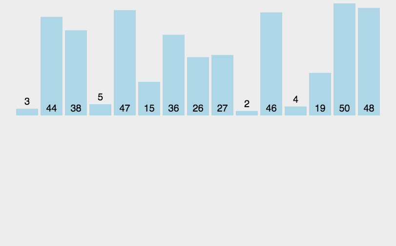
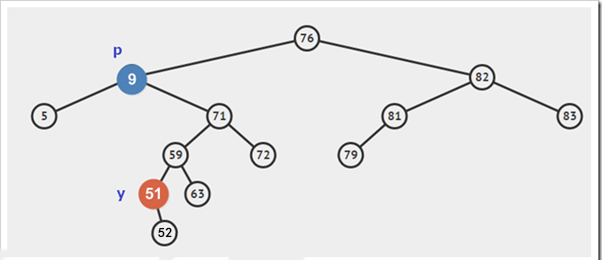
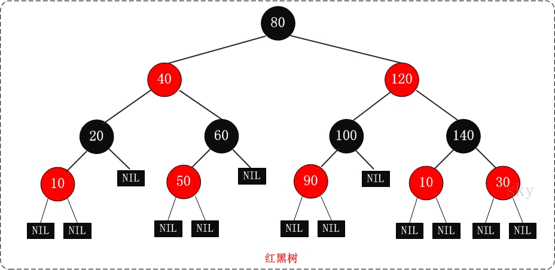
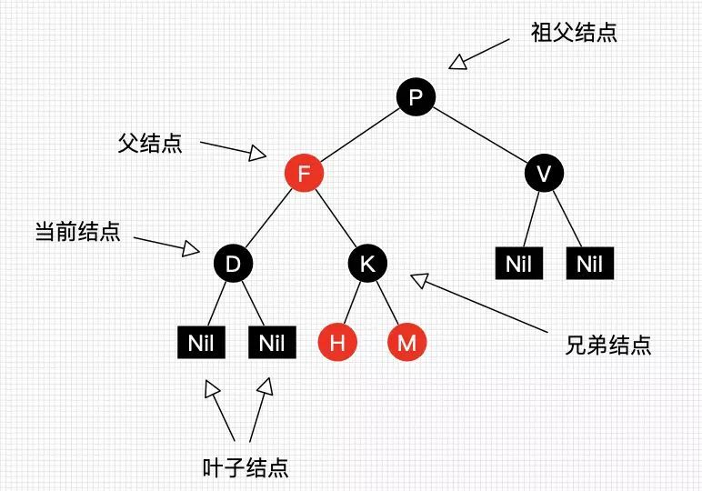
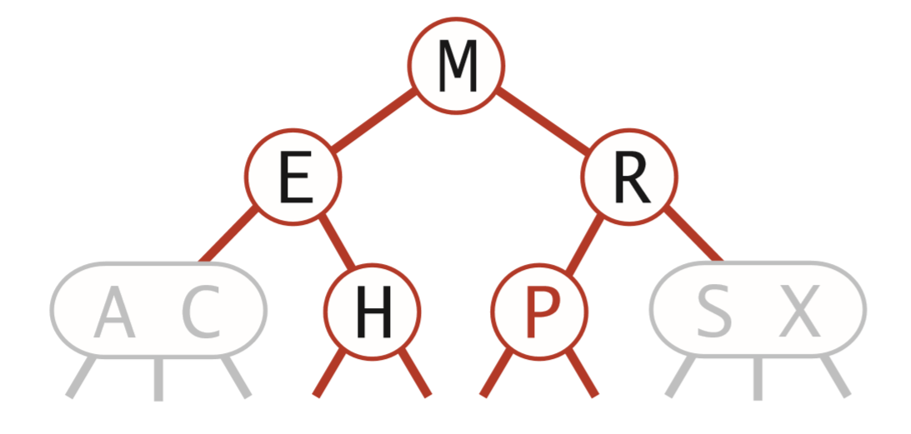

# 数据结构

## 线性结构和非线性结构

数据结构包括：线性结构和非线性结构

### 线性结构：

1. 线性结构作为最常用的数据结构，其特点是数据元素之间存一对一的线性关系
2. 线性结构有两种不同的存储结构，及顺序存储结构和链式存储结构。顺序存储的线性表称为顺序表，顺序表中的存储元素是连续的
3. 链式存储的线性表称为链表，链表中的存储元素不一定是连续的，元素节点中存放数据元素以及相邻元素的地址信息
4. 线性结构常见的有：数组、队列、链表和栈。

### 非线性结构

非线性结构包括：二维数组、多维数组、广义表、树、图。

## 稀疏数组（sparse array）

基本介绍：

当一个数组中大部分元素为0，或者为同一个值的数组时，可以使用稀疏数组来保存该数组。

稀疏数组的处理方法是：

1. 记录数组一共有几行几列，有多少个不同的值
2. 把具有不同值的元素的行列及值记录在一个小规模的数组中，从而缩小程序的规模


二维数组转稀疏数组的思路

1. 遍历原始的二维数组，得到有效数据的个数`sum`

2. 根据`sum`就可以创建稀疏数组`sparseArr= int[sum+1][3]`

3. 将二维数组的有效数据数据存入到稀疏数组

稀疏数组转原始的二维数组的思路

1. 先读取稀疏数组的第一行，根据第一行的数据，创建原始的二维数组，比如上面的 `chessArr2=int[11][11]`
2. 在读取稀疏数组后几行的数据，并赋给原始的二维数组即可。

```java
public class SparseArray {
	public static void main(String[] args) throws IOException {
		/**
		 * 创建一个原始的二维数组 11*11
		 * 0：表示没有棋子，1表示黑子，2表示白子
		 */
		int[][] chessArray = new int[11][11];
		chessArray[1][2] = 1;
		chessArray[2][3] = 2;
		// 输出原始的二维数组
		System.out.println("原始的二维数组:\n");
		toStringArray(chessArray);
		
		/**
		 *  将二维数组转为稀疏数组
		 *  1.先遍历二维数组得到非0数据的个数
		 *  2.创建对应的稀疏数组
		 */
		int effectiveDataCount = 0;
		for(int i = 0; i < 11; i++) {
			for(int j = 0; j<11; j++) {
				if(chessArray[i][j] != 0) {
					effectiveDataCount++;
				}
			}
		}
		/**
		 * 创建对应的稀疏数组,行是有效数据的行数+1
		 * 多出的一行用来存储原二维数组的行和列以及有效数据的个数
		 * 3列是固定值，第一列存储行，第二列存储列，第三列存储实际的值
		 */
		int[][] sparseArray = new int[effectiveDataCount + 1][3];
		// 给稀疏数组赋值，初始化第一行的值
		sparseArray[0][0] = 11;
		sparseArray[0][1] = 11;
		sparseArray[0][2] = effectiveDataCount;
		
		/**
		 * 遍历二维数组，将非0的值存放到稀疏数组中
		 * 再次遍历，如果不进行第一次遍历无法创建稀
		 * 疏数组的大小除非使用集合
		 */
		// 用于记录是第几个非0数据
		int count = 0;
		for(int i = 0; i < 11; i++) {
			for(int j = 0; j<11; j++) {
				if(chessArray[i][j] != 0) {
					count++;
					// 因为count = 0而存值是从第一行开始所以count先++
					sparseArray[count][0] = i;
					sparseArray[count][1] = j;
					sparseArray[count][2] = chessArray[i][j];
				}
			}
		}
		// 输出稀疏数组
		System.out.println("稀疏数组为：\n");
		toStringArray(sparseArray);
		
		/**
		 * 稀疏数组转原始二维数组
		 * 1.先读取稀疏数组的第一行，根据第一行数据创建原始二维数组
		 * 2.读取稀疏数组剩下的行数据，并赋值给原始的二维数组
		 */
		int row = sparseArray[0][0];
		int col = sparseArray[0][1];
		int[][] originalArray = new int[row][col];
		// 遍历稀疏数组剩下的行数据赋值给原始数组,从第二行开始即index=1
		for(int i = 1; i < sparseArray.length; i++) {
			// 获取数据所在原始数组的行号
			int originRow = sparseArray[i][0];
			// 获取数据所在原始数组的列号
			int originCol = sparseArray[i][1];
			// 赋值
			originalArray[originRow][originCol] = sparseArray[i][2];
		}
		System.out.println("稀疏数组恢复原始数组：\n");
		toStringArray(originalArray);
		
		// 将稀疏二维数组写入到文件并读取
		readWriteSparseArray(sparseArray);
	}
	/**
	 * 格式化打印二维数组
	 * @param array
	 */
	private static void toStringArray(int[][] array) {
		for(int[] row : array) {
			for(int data : row) {
				System.out.printf("%d\t", data);
			}
			System.out.println("\n");
		}
	}
	
    /**
	 * 将稀疏矩阵写入到文件并读取出来恢复为稀疏矩阵
	 * @param sparseArray
	 * @throws IOException
	 */
	private static void readWriteSparseArray(int[][] sparseArray) throws IOException {

		// 将稀疏数组保存到文件中在读取出来恢复成稀疏数组
		System.out.println("将稀疏数组写入到map.data");
		BufferedWriter bufferedWriter = new BufferedWriter(new FileWriter("src/map.data"));
		for(int i=0; i < sparseArray.length; i++) {
			for(int j=0; j<3; j++) {
				bufferedWriter.write(sparseArray[i][j]+"\t");
			}
			bufferedWriter.write("\n");
		}
		bufferedWriter.close();
		
		
		BufferedReader bufferedReader = new BufferedReader(new FileReader("src/map.data"));
		String line = bufferedReader.readLine();
		String[] stringArray = line.split("\t");
		int coverRow = Integer.parseInt(stringArray[2]);
		int[][] sparseArray2= new int[coverRow+1][3];
		sparseArray2[0][0] = Integer.parseInt(stringArray[0]);
		sparseArray2[0][1] = Integer.parseInt(stringArray[1]);
		sparseArray2[0][2] = Integer.parseInt(stringArray[2]);
		int readCount = 1;
		String readLine = null;
		while((readLine = bufferedReader.readLine())!= null) {
			String[] temp = readLine.split("\t");
			sparseArray2[readCount][0] = Integer.parseInt(temp[0]);
			sparseArray2[readCount][1] = Integer.parseInt(temp[1]);
			sparseArray2[readCount][2] = Integer.parseInt(temp[2]);
			readCount++;
		}
		System.out.println("恢复后的稀疏数组");
		toStringArray(sparseArray2);
		bufferedReader.close();
	}
}
```

## 队列

1. 队列是一个有序列表，可以用数组或者链表来实现

2. 遵循先进限出的原则，即：先存入对列的数据，要先取出，后存入的元素后取出 


### 数组模拟队列

当我们将数据存入队列时称之为“addQueue”，addQueue的处理需要两个步骤：

1. 将尾指针往后移：rear+1，当front == rear则表示队列为空
2. 若尾指针rear小于队列的最大下标maxSize-1,则将数据存入rear所指的数组元素中，否则无法存入数据，rear == maxSize-1表示队列满了

```java
public class ArrayQueue {
	/**
	 * 数组的最大容量
	 */
	private int maxSize;
	/**
	 * 队头指针
	 */
	private int head;
	/**
	 * 队尾指针
	 */
	private int tail;
	/**
	 * 用于存放数据的容器，模拟队列
	 */
	private int[] element;
	
	// 创建队列的构造器
	public ArrayQueue(int maxSize) {
		this.maxSize = maxSize;
		this.element = new int[maxSize];
		// 初始时element没有元素，head指向队列头部的前一个位置
		this.head = -1;
		// 初始时element没有元素，tail指向队列尾部的后一个位置
		this.tail = -1;
	}
	
	public boolean isFull() {
		return this.tail == this.maxSize -1;
	}
	
	public boolean isEmpty() {
		return this.head == this.tail;
	}
	
	public void add(int elem) {
		if(isFull()) {
			System.out.println("队列满了，无法加入数据");
			return;
		}
		// 后移一位
		tail++;
		this.element[tail] = elem;
	}
	
	public int get() {
		if(isEmpty()) {
			// 通过抛出异常处理
			throw new RuntimeException("队列为空，无法取出数据");
		}
		head++;
		return this.element[head];
	}

	@Override
	public String toString() {
		if(isEmpty()) {
			return "[]";
		}
		return "ArrayQueue [" + Arrays.toString(element) + "]";
	}
	
	/**
	 * 显示队列的头数据，注意不是取数据
	 * @return 返回队头数据
	 */
	public int peek() {
		if(isEmpty()) {
			throw new RuntimeException("队列为空");
		}
		return this.element[head + 1];
	}

	public static void main(String[] args) {
		ArrayQueue queue = new ArrayQueue(3);
		// 测试添加
		queue.add(20);
		queue.add(30);
		
		System.out.println("队列是否满：" + queue.isFull());
		System.out.println("队列是否空：" + queue.isEmpty());
		System.out.println(queue.toString());
	}
}
```

问题分析及优化：

1. 目前数组使用一次就不能在使用了，无法复用
2. 将这个数组使用算法，改进成一个环形队列使用取模方式：%


```java
package xyz.guqing.queue;

import java.util.Arrays;

public class ArrayQueue {
	/**
	 * 数组的最大容量
	 */
	private int maxSize;
	/**
	 * 队头指针
	 */
	private int head;
	/**
	 * 队尾指针
	 */
	private int tail;
	/**
	 * 用于存放数据的容器，模拟队列
	 */
	private int[] element;
	
	// 创建队列的构造器
	public ArrayQueue(int maxSize) {
		this.maxSize = maxSize;
		this.element = new int[maxSize];
		// 初始时element没有元素，head指向队列头部位置也就是第一个元素的位置
		this.head = 0;
		// 初始时element没有元素，tail指向队列尾部的后一个位置，tail = 0
		this.tail = 0;
	}
	
	public boolean isFull() {
		return (tail + 1) % maxSize == head;
	}
	
	public boolean isEmpty() {
		return this.head == this.tail;
	}
	
	public void add(int elem) {
		if(isFull()) {
			System.out.println("队列满了，无法加入数据");
			return;
		}
		// 直接将数据加入即可
		this.element[tail] = elem;
		// 将tail后移一位，这里必须考虑取模
		tail = (tail + 1) % maxSize;
	}
	
	public int get() {
		if(isEmpty()) {
			// 通过抛出异常处理
			throw new RuntimeException("队列为空，无法取出数据");
		}
		// 这里需要分析出head是指向队列的第一个元素
		// 1. 先把head对应的值保存到一个临时的变量
		// 2.将head后移,考虑取模,否则回越界
		// 3.将临时保存的变量返回
		int value = element[head];
		head = (head + 1) % maxSize;
		return value;
	}

	@Override
	public String toString() {
		if(isEmpty()) {
			return "ArrayQueue []";
		}
		// 从head开始遍历，遍历多少个元素,数量是有效数据的个数
		int size = size();
		int count = 0;
		int[] copyArray = new int[size];
		for(int i = head; i < head + size; i++) {
			copyArray[count] = element[i % maxSize];
			count++;
		}
		return "ArrayQueue " + Arrays.toString(copyArray);
	}
	
	public int size() {
		return (tail + maxSize - head) % maxSize;
	}
	
	/**
	 * 显示队列的头数据，注意不是取数据
	 * @return 返回队头数据
	 */
	public int peek() {
		if(isEmpty()) {
			throw new RuntimeException("队列为空");
		}
		return this.element[head];
	}

	public static void main(String[] args) {
		// 传入3，有效数据最大是2，保留了一个
		ArrayQueue queue = new ArrayQueue(3);
		// 测试添加
		queue.add(20);
		queue.add(30);
		
		System.out.println("队列是否满：" + queue.isFull());
		System.out.println("队列是否空：" + queue.isEmpty());
		System.out.println(queue.toString());
		System.out.println("取数据："+queue.peek());
	}
}
```

## 链表

链表是一个有序的列表，但是它在内存中是如下结构的：


1. 链表是以节点的方式来存储的，链式存储
2. 每个节点包含data域和next域，next域指向下一个节点
3. 如图：链表的各个节点不一定是连续存储的
4. 链表分为带头结点的链表和没有头节点的链表，根据实际需求来确定

### 单向链表

#### 代码实现

```java
/**
 * 单链表管理Node
 * @author guqing
 *
 */
public class SingLinkedList<T> {
	// 初始化一个头节点，头节点不能动,不存放具体的数据
	private final Node<T> head = new Node<>(null);
	private transient int size = 0;
	// 添加节点
	public void add(T t) {
		/**
		 * 当不考虑顺序时，找到最后一个节点,让最后一个节点的next指行新节点
		 */
		// 创建数据域节点
		Node<T> node = new Node<>(t);
		// 指针
		Node<T> pointer = head;
		while(pointer.next != null) {
			pointer = pointer.next;
		}
		// 当退出while循环时，pointer就指向了链表的最后
		pointer.next = node;
		size++;
	}
	
	public void remove(T t) {
		// 头节点不能动，需要辅助指针
		// 前驱指针
		Node<T> prevPointer = head;
		// 后继指针
		Node<T> nextPointer = prevPointer.next;
		while(nextPointer != null) {
			if(nextPointer.data == t) {
				// 删除元素
				System.out.println("删除元素");
				prevPointer.next = nextPointer.next;
				nextPointer.next = null;
				size--;
				return;
			}
			prevPointer = nextPointer;
			nextPointer = nextPointer.next;
		}
	}
	
	public T get(int index) {
		if(index > size() - 1) {
			throw new RuntimeException("Array Index Out of Bounds.");
		}
		
		int count = 0;
		Node<T> pointer = head.next;
		while(pointer != null) {
			if(count == index) {
				return pointer.data;
			}
			count++;
			pointer = pointer.next;
		}
		return null;
	}
	
	public int size() {
		return size;
	}

	public void remove(int index) {
		if(index > size() - 1) {
			throw new RuntimeException("Array Index Out of Bounds.");
		}
		
		int count = 0;
		// 前驱指针
		Node<T> prevPointer = head;
		// 后继指针
		Node<T> nextPointer = prevPointer.next;
		while(nextPointer != null) {
			if(count == index) {
				prevPointer.next = nextPointer.next;
				nextPointer.next = null;
				// 更新链表长度
				size--;
				return;
			}
			count++;
			prevPointer = nextPointer;
			nextPointer = nextPointer.next;
		}
	}
	
	public void addAll(SingLinkedList<T> list) {
		Node<T> pointer = head.next;
		while(pointer.next != null) {
			pointer = pointer.next;
		}
		// 追加在链表尾
		pointer.next = list.head.next;
		size = size + list.size();
	}
	
	@Override
	public String toString() {
		// 判断链表是否为空
		if(head.next == null) {
			return "[]";
		}
		// 因为头节点不能动，因为我们需要一个指针来遍历
		Node<T> pointer = head.next;
		StringBuilder sb = new StringBuilder();
		sb.append("[");
		while(pointer != null) {
			// 输出节点信息
			sb.append(pointer.data);
			
			// 指针后移
			pointer = pointer.next;
			
			// 添加一个分割符
			if(pointer != null) {
				sb.append(", ");
			}
		}
		sb.append("]");
		return sb.toString();
	}
	
	/**
	 * Node类用于定义链表的基本结构包括两个域：数据域和指针域
	 * @author guqing
	 * @param <T> 数据类型
	 */
	private static class Node<T> {
		final T data;
		Node<T> next;
		
		public Node(T data) {
			super();
			this.data = data;
		}
	}

	public static void main(String[] args) {
		SingLinkedList<User> userList = new SingLinkedList<>();
		User user1 = new User();
		user1.setId(1);
		user1.setUsername("zhangsan");
		user1.setNickname("张三");
		user1.setGender("男");
		userList.add(user1);
		
		User user2 = new User();
		user2.setId(2);
		user2.setUsername("lisi");
		user2.setNickname("李四");
		user2.setGender("男");
		userList.add(user2);
		
		User user3 = new User();
		user3.setId(3);
		user3.setUsername("cuihua");
		user3.setNickname("翠花");
		user3.setGender("女");
		userList.add(user3);
		System.out.println("size:" + userList.size());
		System.out.println(userList);
	}
}
```

其中用到的User类

```java
public class User {
	private Integer id;
	private String username;
	private String nickname;
	private String gender;
}
```

#### 常见单链表题目

1. 查找单链表的倒数第k个节点使用 `T get(int index)`方法即可,比如获取倒数第`1`个节点：

```java
User user = userList.get(userList.size() - 1);
```

2. 链表反转，这里写两种方式，还有一种递归反转不会

```java
/**
 * 迭代头插法反转链表,遍历一个反转一个
 */
public void reverse() {
    //如果链表为空或只有一个元素直接返回
    if(head.next == null || head.next.next == null){
        return;
    }
    // 新的头节点，让其next指向null
    Node<T> newHead = new Node<T>(null);
    newHead.next = null;

    // 用于临时保存head的next指向
    Node<T> temp = null;
    while(head != null){
        // 临时保存head的next指向
        temp = head.next;

        // 头部插入，先让head.next指向newHead.next,在链接头部和新节点
        head.next = newHead.next;
        newHead.next = head;

        // 让head重新指向temp,达到向后移动遍历的目的
        head = temp;
    }

    // 这里需要将head重新指向新的head处，否则head指向null
    head = newHead;
}


/**
 * 指针的next指向逆向法反转链表
 */
public void reverse1() {
    //如果链表为空或只有一个元素直接返回
    if(head.next == null || head.next.next == null){
        return;
    }
    // 使用一个新head指行原head指向的位置，这样方便修改原head的指向
    Node<T> newHead = head;
    // 指向head第一个有数据的Node
    Node<T> prevPointer = newHead.next;
    // 指向prevPointer的下一个指针，因此如果数据都没有两个是不需要逆序的
    Node<T> nextPointer = prevPointer.next;
    // 临时指针
    Node<T> temp = null;
    while(nextPointer != null){
        temp = nextPointer.next;
        nextPointer.next = prevPointer;
        prevPointer = nextPointer;
        nextPointer = temp;
    }
    //设置链表尾
    newHead.next.next = null;
    //修改链表头
    newHead.next = prevPointer;
    head = newHead;
}
```

3. 逆序打印单链表

方式1：先将单链表进行反转在遍历（破坏了单链表的结构，不建议）

方式2：利用栈，将各个节点压入栈中，在弹栈。利用栈先进后出的特点

（还没有涉及到栈，先不实现，也可以用jdk的Stack）

#### 单向链表的缺点

1. 单向链表，查找方向只能是一个方向
2. 单向链表不能自我删除，需要靠辅助节点

### 双向链表

双向链表的结构包含两个指针，一个指向前一个节点的前驱指针和一个指向下一个节点的后继指针。


双向链表的遍历、添加、删除的操作思路：

1. 遍历方式和单链表一样，但是既可以向前查找也可以向后查找
2. 添加（默认添加到双向链表的最后）
3. 删除：因为是双向链表，因此可以实现自我删除某个节点，直接找到要删除的某个节点，比如指向删除数据的指针为pointer,则

```java
//删除的不是最后一个节点否则回出现空指针
pointer.prev.next = pointer.next
pointer.next.prev = pointer.prev

// 删除的是最后一个节点
pointer.prev.next = pointer.next
```

#### 代码实现

```java
/**
 * 双向链表代码实现:
 * void add(T t)
 * void addAll(DoubleLinkedList list)
 * void remove(T t)
 * void remove(int index)
 * T get(int index)
 * int size()
 * String toString()
 * 
 * @author guqing
 */
public class DoubleLinkedList<T> {
	private Node<T> head = new Node<>(null);
	private int size = 0;
	
	public void add(T t) {
		/**
		 * 当不考虑顺序时，找到最后一个节点,让最后一个节点的next指向新节点
		 */
		// 创建数据域节点
		Node<T> node = new Node<>(t);
		// 指针
		Node<T> pointer = head;
		while(pointer.next != null) {
			pointer = pointer.next;
		}
		// 当退出while循环时，pointer就指向了链表的最后
		pointer.next = node;
		node.prev = pointer;
		size++;
	}
	
	public void addAll(DoubleLinkedList<T> list) {
		Node<T> pointer = head.next;
		while(pointer.next != null) {
			pointer = pointer.next;
		}
		// 追加在链表尾
		pointer.next = list.head.next;
		list.head.next.prev = pointer;
		// 更新链表的长度
		size = size + list.size();
	}
	/**
	 * 双向链表可以自我删除，不需要前驱指针
	 * @param t 需要删除的对象
	 */
	public void remove(T t) {
		// 头节点不能动，需要辅助指针
		Node<T> pointer = head.next;
		while(pointer != null) {
			if(pointer.data == t && pointer.next != null) {
				// 删除元素
				pointer.prev.next = pointer.next;
				pointer.next.prev = pointer.prev;
				size--;
				return;
			} else if(pointer.data == t) {
				// 删除最后一个元素
				pointer.prev.next = pointer.next;
				size--;
				return;
			}
			pointer = pointer.next;
		}
	}
	
	public void remove(int index) {
		if(index > size() - 1) {
			throw new RuntimeException("Array Index Out of Bounds.");
		}
		
		int count = 0;
		// 遍历指针
		Node<T> pointer = head.next;
		while(pointer != null) {
			if(count == index && count < size -1) {
				pointer.prev.next = pointer.next;
				pointer.next.prev = pointer.prev;
				// 更新链表长度
				size--;
				return;
			} else if(count == index){
				// 删除最后一个节点
				pointer.prev.next = pointer.next;
				size--;
				return;
			}
			count++;
			pointer = pointer.next;
		}
	}
	
	public T get(int index) {
		if(index < 0 || index > size() - 1) {
			throw new RuntimeException("Array Index Out of Bounds.");
		}
		
		int count = 0;
		Node<T> pointer = head.next;
		while(pointer != null) {
			if(count == index) {
				return pointer.data;
			}
			count++;
			pointer = pointer.next;
		}
		return null;
	}
	
	public int size() {
		return size;
	}
	
	@Override
	public String toString() {
		// 判断链表是否为空
		if(head.next == null) {
			return "[]";
		}
		// 因为头节点不能动，因为我们需要一个指针来遍历
		Node<T> pointer = head.next;
		StringBuilder sb = new StringBuilder();
		sb.append("[");
		while(pointer != null) {
			// 输出节点信息
			sb.append(pointer.data);
			
			// 指针后移
			pointer = pointer.next;
			
			// 添加一个分割符
			if(pointer != null) {
				sb.append(", ");
			}
		}
		sb.append("]");
		return sb.toString();
	}
	
	/**
	 * Node类用于定义双向链表的基本结构包括三个域：数据域和前驱指针域和后继指针域
	 * @author guqing
	 * @param <T> 数据类型
	 */
	private static class Node<T> {
		final T data;
		Node<T> prev;
		Node<T> next;
		
		public Node(T data) {
			super();
			this.data = data;
		}
	}
	
	public static void main(String[] args) {
		DoubleLinkedList<User> userList = new DoubleLinkedList<>();
		
		User user1 = new User();
		user1.setId(1);
		user1.setUsername("zhangsan");
		user1.setNickname("张三");
		user1.setGender("男");
		userList.add(user1);
		
		User user2 = new User();
		user2.setId(2);
		user2.setUsername("lisi");
		user2.setNickname("李四");
		user2.setGender("男");
		userList.add(user2);
		
		User user3 = new User();
		user3.setId(3);
		user3.setUsername("cuihua");
		user3.setNickname("翠花");
		user3.setGender("女");
		userList.add(user3);
		
		userList.remove(user1);
		System.out.println(userList);
	}
}
```

### 单向循环链表

`Josephu`（约瑟夫、约瑟夫环）问题：

> `Josephu`问题为：设编号为1，2，…n的n个人围坐一圈，约定编号为k（1<=k<=n）的人从1开始报数，数到m的那个人出列，它的下一位又从1开始报数，数到m的那个人又出列，依次类推，直到所有人出列为止，由此产生一个出队编号的序列。
> **提示**：用一个不带头结点的循环链表来处理 `Josephu`问题：先构成一个有n个结点的单循环链表，然后由k结点起从1开始计数，计到m时，对应结点从链表中删除，然后再从被删除结点的下一个结点又从1开始计数，直到最后一个结点从链表中删除算法结束。


构建一个单向循环链表思路：

1. 先创建第一个节点，让head指向该节点，并形成环形。
2. 然后当我们每创建一个新的节点，就把该节点加入到已有的环形链表中即可

遍历环形链表

1. 先让一个辅助指针pointer（变量），指向head节点
2. 然后通过一个while循环遍历该环形链表即可遍历结束的条件`pointer.next == head`

#### 约瑟夫问题代码

使用不带头节点的单向循环链表完成

```java
/**
 * 没有头节点的单向循环链表（解决约瑟夫环问题）
 * @author guqin
 *
 */
public class JosephLinkedList<T> {
	private Node<T> head = null;
	private int size = 0;
	
	public JosephLinkedList() {
	}
	
	public int size() {
		return size;
	}
	
	/**
	 * 添加数据的方法
	 * @param t 数据
	 */
	public void add(T t) {
		Node<T> data = new Node<>(t);
		if(size == 0) {
			head = data;
			data.next = data;
			size++;
			return;
		}
		//辅助指针，用于构建环形链表,注意:这里指向head，判断条件是pointer.next不是head
		Node<T> pointer = head;
		while(pointer.next != head) {
			pointer = pointer.next;
		}
		// 遍历到最后一个节点，添加数据并后成环
		pointer.next = data;
		data.next = head;
		size++;
	}
	
	@Override
	public String toString() {
		// 判断链表是否为空
		if(head == null) {
			return "[]";
		}
		
		// 遍历时需要取数据所以要指向第一个有数据的节点
		Node<T> pointer = head;
		StringBuilder sb = new StringBuilder();
		sb.append("[");
		while(pointer.next != head) {
			sb.append(pointer.data);
			sb.append(", ");
			
			// 移动指针
			pointer = pointer.next;
		}
		// 头节点的数据
		sb.append(pointer.data);
		sb.append("]");
		
		return sb.toString();
	}
	
	
	/**
	 * 约瑟夫问题出队序列方法
	 * 1.需要创建一个辅助指针pointer,事先应该指向环形链表的最后一个节点
	 * 2.从第k个元素开始数，数m次第m个元素被取出
	 * @param k 从第几个节点开始遍历
	 * @param m 遍历几个后取出节点
	 * @return 返回约瑟夫出队序列的字符串
	 */
	public String fetchSequence(int k, int m) {
		// 判断链表是否为空
		if(head.next == head) {
			return "[" + head.data + "]";
		}
		
		if(k < 1 || k > size -1) {
			throw new RuntimeException("Array Index Out of Bounds.");
		}
		int count = 1;
		Node<T> pointer = head.next;
		while(count != size) {
			head = pointer;
			pointer = pointer.next;
			count++;
		}
		// 至此head指向头节点的前一个节点
		while(k != 1){
			head = pointer;
			pointer = pointer.next;
			k--;
		}
		StringBuilder sb = new StringBuilder();
		sb.append("[");
		while(head != pointer) {
			for(int i=1; i<m;i++) {
				head = pointer;
				pointer = pointer.next;
			}
			// 此时pointer指针指向的位置就是需要弹出的节点
			sb.append(pointer.data);
			sb.append(", ");
			// 该节点已经输出将其删除
			// head指针指向的节点的next指向pointer的next
			head.next = pointer.next;
			// pointer指向pointer的next
			pointer = pointer.next;
		}
		sb.append(pointer.data);
		sb.append("]");
		return sb.toString();
	}
	
	/**
	 * 节点对象存储数据和指针
	 * @author guqin
	 * @param <T>
	 */
	private static class Node<T> {
		T data;
		Node<T> next;
		public Node(T data) {
			super();
			this.data = data;
		}
		@Override
		public String toString() {
			return "Node [data=" + data + "]";
		}
		
	}
	
	public static void main(String[] args) {
		JosephLinkedList<Integer> list = new JosephLinkedList<>();
		for(int i=1; i<=10; i++) {
			list.add(i);
		}
		String result = list.fetchSequence(2, 4);
		System.out.println(result);
	}
}
```

## 栈

1. 栈的英文为`stack`
2. 栈时一个先进后出的有序列表(`FILO:First In Last Out`)
3. 栈是限制线性表中元素的插入和删除只能在线性表的同一端进行的一种特殊线性表。允许插入和删除的一端为变化的一端，称为栈顶(Top)，另一端为固定的一端，称栈低(Bottom)
4. 根据栈的定义可知，最先放入栈中元素在栈低，最后放入的元素在栈顶，而删除元素刚好相反，最后放入的元素最先删除，最后放入的元素最后删除
5. 相关术语：压栈（将元素存如栈中）、弹栈（从栈中取出元素）

压栈演示：


出栈演示：


栈的应用场景

1. 子程序的调用：在跳往子程序之前，回先将下一个指令的地址存入栈中，直到子程序编写执行完后再将地址取出。
2. 处理递归调用：和子程序的调用类似，只是除了存储下一个指令的地址外，也将参数、区域变量等数据存入栈中。
3. 表达式的转换与求值
4. 二叉树遍历
5. 图的深度优先搜索(depth first)

###  代码实现

#### 使用数组实现栈

思路分析：

1. 定义一个top变量表示栈顶，初始化为-1
2. 入栈的操作，当有数据加入到栈时，`top++，stack[top] = data;`
3. 出栈操作,保存栈顶元素然后移动栈顶并返回数据

```
int value = stack[top];
top--;
return value;
```

代码实现：

```java
/**
 * 使用数组实现栈
 * @author guqing
 *
 */
public class ArrayStack {
	/**
	 * 栈的大小
	 */
	private int maxSize;
	/**
	 * 数组模拟栈，数据存放到该int数组中
	 */
	private int[] stack;
	/**
	 * top表示栈顶，初始化为-1即栈中没有数据
	 */
	private int top = -1;
	
	public ArrayStack(int maxSize) {
		this.maxSize = maxSize;
		this.stack = new int[maxSize];
	}
	
	/**
	 * 判断栈是否满
	 * @return 栈满返回true，否则返回false
	 */
	public boolean isFull() {
		return top == maxSize;
	}
	
	/**
	 * 判断栈是否为空
	 * @return 栈为空返回true，否则返回false
	 */
	public boolean isEmpty() {
		return top == -1;
	}
	
	/**
	 * 压栈
	 * @param value 需要存入栈顶的数据
	 */
	public void push(int value) {
		if(isFull()) {
			System.out.println("栈已经满了无法再压入数据");
			return;
		}
		// 栈顶先挪一个位置
		top++;
		// 再将数据压入栈顶
		this.stack[top] = value;
	}
	
	/**
	 * 出栈，返回栈顶元素
	 * @return 返回栈顶元素
	 */
	public int pop() {
		if(isEmpty()) {
			throw new RuntimeException("栈为空无法取出数据");
		}
		// 先保存栈顶数据
		int value = this.stack[top];
		// 栈顶-1
		top--;
		return value;
	}
	
	/**
	 * 遍历栈,从栈顶开始遍历
	 */
	@Override
	public String toString() {
		if(isEmpty()) {
			return "[]";
		}
		StringBuilder sb = new StringBuilder();
		sb.append("stack [");
		for(int i = top; i >= 0; i--) {
			sb.append(stack[i]);
			
			if(i != 0) {
				sb.append(", ");
			}
		}
		sb.append("]");
		return sb.toString();
	}
	
	public static void main(String[] args) {
		ArrayStack stack = new ArrayStack(5);
		// 压栈
		stack.push(10);
		stack.push(5);
		stack.push(20);
		stack.push(8);
		stack.push(6);
		
		// 打印栈
		System.out.println(stack);
		
		// 弹栈
		for(int i=4; i>=0; i--) {
			int value = stack.pop();
			System.out.println("栈顶元素：" + value);
		}
	}
}
```

运行结果：

```
stack [6, 8, 20, 5, 10]
栈顶元素：6
栈顶元素：8
栈顶元素：20
栈顶元素：5
栈顶元素：10
```

#### 栈的链表方式实现

```java
/**
 * 使用链表实现栈
 * @author guqing
 */
public class LinkedStack<T> {
	private Node<T> top;
	private int size;
	
	public boolean isEmpty() {
		return top == null;
	}
	
	public int size() {
		return size;
	}
	
	/**
	 * 压栈
	 */
	public void push(T t) {
		Node<T> node = new Node<T>(t);
		if(isEmpty()) {
			node.next = null;
			top = node;
			size++;
			return;
		}
		// 让新节点的next指向栈顶元素，栈顶指针指向新栈顶
		node.next = top;
		top = node;
		size++;
	}
	
	
	public T pop() {
		if(isEmpty()) {
			return null;
		}
		T data = top.data;
		// 临时指针指向栈顶元素
		Node<T> pointer = top;
		// 栈顶指向下一个元素
		top = top.next;
		// 将原栈顶的元素的next指针指向空，即删除栈顶元素，对象没有引用会被垃圾回收
		pointer.next = null;
		size--;
		return data;
	}
	
	@Override
	public String toString() {
		if(isEmpty()) {
			return "[]";
		}
		Node<T> pointer = top;
		StringBuilder sb = new StringBuilder();
		sb.append("[");
		while(pointer != null) {
			sb.append(pointer.data);
			sb.append(",");
			pointer = pointer.next;
		}
		int commaIndex = sb.lastIndexOf(",");
		sb.delete(commaIndex, commaIndex + 2);
		sb.append("]");
		return sb.toString();
	}
	
	private static class Node<T> {
		private T data;
		private Node<T> next;
		public Node(T data) {
			super();
			this.data = data;
		}
	}
	
	public static void main(String[] args) {
		LinkedStack<Integer> stack = new LinkedStack<>();
		stack.push(17);
		stack.push(9);
		stack.push(20);
		stack.push(5);
		System.out.println("size: "+stack.size() + ", 栈结构: " + stack);
		// 弹栈
		Integer value = stack.pop();
		System.out.println("栈顶元素: "+value);
		System.out.println("size: "+stack.size() + ", 栈结构: " + stack);
	}
}
```

当然遍历还可以实现一个`Iterator`迭代器，其他相似方法省略主要方法如下：

```java
// 让LinkedStack实现Iterable方法，并实现里面的iterator方法
public class LinkedStack<T> implements Iterable<T>{
    @Override
	public Iterator<T> iterator() {
		return new ListIterator();
	}
    
    /**
	 * 自定义内部类实现Iterator方法完成栈的迭代器
	 * @author guqing
	 */
	private class ListIterator implements Iterator<T>{
		private Node<T> pointer = top;
		
		@Override
		public boolean hasNext() {
			return pointer != null;
		}

		@Override
		public T next() {
			T data = pointer.data;
			pointer = pointer.next;
			return data;
		}
	}
}
```

测试:

```java
public static void main(String[] args) {
    LinkedStack<Integer> stack = new LinkedStack<>();
    stack.push(17);
    stack.push(9);
    stack.push(20);
    stack.push(5);
    // 使用迭代器遍历
    Iterator<Integer> it = stack.iterator();
    while(it.hasNext()) {
        System.out.println(it.next());
    }
}
```

### 前缀、中缀、后缀表达式

1. 前缀表达式也称为波兰表达式，前缀表达式的运算符
2. 举例说明：``(3+4)X5-6`,对应的前缀表达式就是`- X + 3 4 5 6`

**前缀表达式的计算机求值**

从左至右扫描表达式，遇到数字时，将数字压入堆栈，遇到运算符时，弹出栈顶的两个数，用运算符对他们做相应的计算（栈顶元素和次项元素），并将结果入栈；重复上述过程知道表达式的最左端，最后运算得出的值即为表达式的结果

例如：`(3+4)X5-6`对应的前缀表达式就是`- X + 3 4 5 6`,针对前缀表达式求值步骤如下：

1. 从右至左扫描，6、5、4、3压入堆栈
2. 遇到+运算符，因此弹出的`3`和`4`（3为栈顶元素，4为次项元素），计算出`3+4`的值，得到7再将7入栈
3. 接下来是`X`运算符，因此弹出`7`和`5`，计算出`7X5=35`，将`35`压入栈
4. 最后是运算符，计算出35-6的值，即29，由此得出最终结果

**中缀表达式**

1. 中缀表达式的求职就是最常见的运算表达式，如`(3+4)X5-6`
2. 中缀表达式的求值是我们人最熟悉的，但是对计算机来说却不好操作，因此，再计算结果时，往往会将中缀表达式转换成其他表达式来操作（一般转后缀表达式）。

**后缀表达式**

1. 后缀表达式又称为逆波兰表达式，与前缀表达式相似，知识运算符位于操作数之后。
2. `(3+4)X5-6`对应的后缀表达式就是 `3 4 + 5 X 6 - `

**后缀表达式的计算机求值**

从左至右扫描表达式，遇到数字时，将数字压入堆栈，遇到运算符时，弹出栈顶的两个数，用运算符对他们做相应的计算（次顶元素和栈顶元素），并将结果入栈，重复上述过程知道表达式最右端，最后运算得出的值即为表达式的结果。

例如：`(3+4)X5-6`对应的前缀表达式是`3 4 + 5 X 6 -`,针对后缀表达式求值步骤如下：

1. 从左至右扫描，将3和4压入堆栈
2. 遇到+运算符，因此弹出`4`和`3`(4为栈顶元素，3为次顶元素)，计算出`3+4`的值，得7入栈
3. 将5入栈
4. 接下来是X运算符，因此弹出5和7，计算`7X5=35`入栈
5. 将`6`入栈
6. 最后是运算符，计算出`35-6`得值，即29，由此得出最终结果

#### 逆波兰计算器

完成后缀表达式的计算器

1. 输入一个逆波兰表达式，使用栈(stack)，计算其结果
2. 支持小括号和多位数整数，因为这里我们主要讲的是数据结构，因此计算器进行简化，只支持对整数的计算。

```java
/**
 * 使用栈完成逆波兰计算器
 * @author guqing
 * @date 2019/9/4
 */
public class ReversePolish {
	public static void main(String[] args) {
		/**
		 * 先定义一个逆波兰表达式
		 * (3+4)*5-6 => 3 4 + 5 * 6 - => 29
		 * (30+4)*5-6 => 30 4 + 5 * 6 => 164
		 * 使用空格隔开方便处理
		 */
		String suffixExpression1 = "3 4 + 5 * 6 -";
		String suffixExpression2 = "30 4 + 5 * 6 -";
		
		// 1.先将suffixExpression装入一个ArrayList中
		List<String> rpList = getList(suffixExpression2);
		// 2.使用ArrayList传递给一个方法，遍历配合栈完成计算
		int result = calculate(rpList);
		System.out.println("计算结果：" + result);
	}
	
	/**
	 * 将逆波兰表达式，依次将数据和运算符放入ArrayList
	 */
	public static List<String> getList(String suffixExpression) {
		// 将suffixExpression分割
		String[] splitArray = suffixExpression.split(" ");
		// 转成list，注意这种方式转成的list和真正的List的区别
		return Arrays.asList(splitArray);
	}
	/**
	 * 1.从左至右扫描，将3和4压入堆栈
	 * 2.遇到+运算符，弹出4和3(4是栈顶元素，3是次栈顶元素)，计算出3+4的值得到7，再将7入栈
	 * 3.将5入栈
	 * 4.接下来是*运算符，因此弹出5和7，计算出7*5=35，将35入栈
	 * 5.将6入栈
	 * 6.最后是-运算符，计算出35-6的值即29，由此得出最终结果
	 * @param list 存储着逆波兰表达式每个元素的字符串集合
	 * @return 返回逆波兰计算器的计算结果
	 */
	public static int calculate(List<String> list) {
		// 创建一个栈
		Stack<String> stack = new Stack<String>();
		// 遍历list
		for(String item : list) {
			// 正则匹配数字
			if(item.matches("\\d+")) {
				// 将数字入栈
				stack.push(item);
			} else {
				// 由于当前是else说明item是一个符号
				// pop出两个数，并计算，再入栈
				int num2 = Integer.parseInt(stack.pop());
				int num1 = Integer.parseInt(stack.pop());
				
				// 计算
				int result = switchCalc(item, num1, num2);
				// 入栈
				stack.push(result + "");
			}
		}
		return Integer.parseInt(stack.pop());
	}
	
	public static int switchCalc(String item, int num1, int num2) {
		int result = 0;
		switch (item) {
		case "+":
			result = num1 + num2;
			break;
		case "-":
			result = num1 - num2;
			break;
		case "*":
			result = num1 * num2;
			break;
		case "/":
			result = num1 / num2;
			break;
		case "%":
			result = num1 % num2;
			break;
		default:
			break;
		}
		return result;
	}
}
```

#### 中缀表达式转后缀表达式

通过上面的逆波兰计算器，我们会发现需要认为的将中缀表达式转为后缀表达式才能计算，很不方便，那么现在就来看一下如何将中缀表达式转为后缀表达式？

1. 初始化两个栈:运算符栈`stack1`和存储中间结果的栈`stack2`
2. 从左至右的扫描中缀表达式
3. 遇到操作数时，将其压入`stack2`
4. 遇到运算符时，比较其与`stack1`栈顶运算符的优先级
   - 如果`stack1`为空，或栈顶运算符为左括号“(”,则直接将此运算符入栈
   - 否则，若优先级比栈顶运算符高，也将运算符压入`stack1`
   - 否则，将`stack1`栈顶的运算符弹出并压入到`stac2`中，在粗转到`(4-1)`与`stack1`中新的栈顶运算符相比较
5. 遇到括号时

   1. 如果是左括号“(”，则直接压入stack1
   2. 如果是右括号“)”,则依次弹出stack1栈顶的运算符，并压入stack2，直到遇到左括号为止，此时将这一对括号丢弃
6. 重复步骤2至5，直到表达式的最右边
7. 将stack1中剩余的运算符依次弹出并压入stack2
8. 依次弹出stack2中的元素并输出，结果的逆序即为中缀表达式对应的后缀表达式。

```java
public class ReversePolish {
	/**
	 * 中缀表达式转后缀表达式
	 */
	public static List<String> infixToSuffix(String expression) {
		// 先将中缀表达式转成中缀的List
		List<String> infixList = infixToList(expression);
		
		// 定义存储符号栈和中间结果的栈
		Stack<String> stack1 = new Stack<>();
		// stack2这个栈在整个转换过程中没有pop操作，而且最后还要逆序，所以使用list替换stack2
		List<String> stack2 = new ArrayList<>();
		
		for(String item : infixList) {
			// 如果是一个数就入stack2
			if(item.matches("\\d+\\.?\\d*")) {
				stack2.add(item);
			} else if(item.equals("(")) {
				// 是左括号如stack1
				stack1.push(item);
			} else if(item.equals(")")) {
				// 是右括号，则依次弹出stack1栈顶的运算符并压入stack2，直到遇到左括号为止，此时将这一对括号丢弃
				while(!stack1.peek().equals("(")) {
					stack2.add(stack1.pop());
				}
				// 剔除这一对括号
				stack1.pop();
			} else {
				/**
				 * 当item的优先级小于等于栈顶运算符的优先级
				 * 将stack1栈顶的运算符弹出并加入到stack2中
				 * 在次转到(4,1)与stack1中新的栈顶运算符相比较
				 */
				while(stack1.size() != 0 && Operation.getValue(stack1.peek()) >= Operation.getValue(item)) {
					stack2.add(stack1.pop());
				}
				// 把item运算符压入栈中
				stack1.push(item);
			}
		}
		// 将stack1中剩余的运算发依次弹出加入到stack2中
		while(stack1.size() != 0) {
			stack2.add(stack1.pop());
		}
		
		return stack2;
	}
	/**
	 * @param expression 中缀表达式
	 * @return 返回中缀表达式字符List
	 */
	public static List<String> infixToList(String expression){
		// 去除所有空格
		expression = expression.replace(" ", "");

		// 提取出所有的数学符号，即剔除数字\\d*
		String operator = expression.replaceAll("\\d+\\.?\\d*", "");  

        List<String> list=new ArrayList<String>();  
        int pidx = -1;  
        for(int i=0; i<operator.length(); i++){  
            String p = operator.substring(i, i+1);  
            pidx = expression.indexOf(p);  
            if(expression.substring(0,pidx).trim().length() != 0){  
                list.add(expression.substring(0, pidx));  
            }  
            list.add(expression.substring(pidx, pidx+1));  
            expression = expression.substring(pidx+1);  
        }  
        if(expression.length()>0){  
            list.add(expression);  
        }  
		return list;
	}
	
    // 比较运算符优先级的内部类
	private static class Operation {
		private static final int ADD = 1; 
		private static final int SUB = 1;
		private static final int MUL = 2;
		private static final int DIVSION = 2;
		
		// 返回对应的优先级数字
		public static int getValue(String operation) {
			int result = 0;
			switch (operation) {
			case "+":
				result = ADD;
				break;
			case "-":
				result = SUB;
				break;
			case "*":
				result = MUL;
				break;
			case "/":
				result = DIVSION;
				break;
			default:
				break;
			}
			return result;
		}
	}
    
    public static double calculate(List<String> list) {
		// 创建一个栈
		Stack<String> stack = new Stack<String>();
		// 遍历list
		for(String item : list) {
			// 正则匹配数字
			if(item.matches("\\d+\\.?\\d*")) {
				// 将数字入栈
				stack.push(item);
			} else {
				// 由于当前是else说明item是一个符号
				// pop出两个数，并计算，再入栈
				double num2 = Double.parseDouble(stack.pop());
				double num1 = Double.parseDouble(stack.pop());
				
				// 计算
				double result = switchCalc(item, num1, num2);
				// 入栈
				stack.push(result + "");
			}
		}
		return Double.parseDouble(stack.pop());
	}
    
    public static void main(String[] args) {
		/**
		 * 将中缀表达式转后缀表达式结果测试
		 */
		//String expression = "11 + ((2+3)*4)-5";
		String expression = "(3.2 + 4)*5-6";
		List<String> suffix = infixToSuffix(expression);
		double solution = calculate(suffix);
		System.out.println("中缀转后缀表达式计算结果:" + solution );
	}
}
```

## 递归

递归，就是在程序运行的过程中自己调用自己。

能用递归来解决的问题必须满足两个条件：

1. 可以通过递归调用来缩小问题规模，且新问题与原问题有着相同的形式。
2. 必须有一个明确的结束条件。

递归能解决什么样的问题：

1. 数学问题：8皇后问题，汉诺塔，阶乘问题，迷宫问题，斐波拉契数列等
2. 算法问题：快排、归并排序、二分查找、分治算法等
3. 遍历文件

### 迷宫问题

```java
/**
 * 递归迷宫问题
 * @author guqing
 */
public class Maze {
	public static void main(String[] args) {
		int[][] map = getMap();
		// map是引用类型，寻完路后在输出map即为走过的路
		pathFind(map, 1, 1);
		System.out.println("寻路后的地图：");
		for(int i=0; i<map.length; i++) {
			System.out.println(Arrays.toString(map[i]));
		}
	}
	
	public static int[][] getMap() {
		// 创建二维数组模拟迷宫
		int[][] map = new int[8][7];
		// 使用1表示墙壁
		Random random = new Random();
		int row = map.length;
		int col = map[0].length;
		for(int i=0; i<row; i++) {
			for(int j=0; j<col; j++) {
				int value = random.nextInt(2);
				map[i][j] = value;
			}
		}
		// 将二维数组的四周都设为1，即代表墙，避免寻路时超出数组边界，这一点很关键
		for(int i=0; i<row; i++) {
			map[i][0] = 1;
			map[i][col-1] = 1;
		}
		for(int j=0; j<col; j++) {
			map[0][j] = 1;
			map[row-1][j] = 1;
		}
		
		// 将起点和终点都设置为0，避免随机时生成的是1，墙是不能走的
		map[1][1] = 0;
		map[6][5] = 0;
		return map;
	}
	
	/**
	 * 使用递归回溯来给寻路
	 * i,j表示从地图的那个位置开始出发比如(1,1)
	 * 如果小球能到map[6][5]位置，则说明通路找到
	 * 当map[i][j]为0表示该点还没有走过，如果为2表示为通路可以走
	 * 为3表示该位置已经走过但是不通
	 * 策略：下->右->上->左，如果该点走不通在回溯
	 * @param map 地图
	 * @param i 从哪行开始找
	 * @param j 从哪列开始找
	 * @return 如果找到通路返回true，否则返回false
	 */
	public static boolean pathFind(int[][] map, int i, int j) {
		if(map[6][5] == 2) {
			// 已经找到
			return true;
		} else {
			// 如果当前点还没有走过
			if(map[i][j] == 0) {
				// 按照策略走:下->右->上->左
				//假设该点可以走通设置为2，走不通在置为3
				map[i][j] = 2;
				if(pathFind(map, i+1, j)) {
					// 向下走i+1
					return true;
				} else if(pathFind(map, i, j+1)){
					// 向右走j+1
					return true;
				} else if(pathFind(map, i-1, j)) {
					// 向上走i-1
					return true;
				} else if(pathFind(map, i, j-1)){
					// 向做走j-1
					return true;
				} else {
					// 走不通,置为3
					map[i][j] = 3;
					return false;
				}
			} else {
				// 如果map[i][j] != 0，可能等于1墙，可能是2走过了，可能是3死路
				return false;
			}
		}
	}
}
```

运行结果：

```
寻路后的地图：
[1, 1, 1, 1, 1, 1, 1]
[1, 2, 2, 0, 1, 0, 1]
[1, 1, 2, 2, 0, 0, 1]
[1, 1, 1, 2, 0, 1, 1]
[1, 1, 0, 2, 2, 2, 1]
[1, 0, 0, 1, 1, 2, 1]
[1, 0, 0, 1, 1, 2, 1]
[1, 1, 1, 1, 1, 1, 1]
```

由于地图是随机生成的，所以不一定每一次有从`map[1][1]`到`map[6][5]`的连通路径，有可能是死路。

### 八皇后问题（回溯法）

[在线试玩八皇后游戏](http://www.17yy.com/f/play/141256.html)

八皇后问题，是一个古老而著名的问题，是回溯法的典型案例，该问题是国际西洋象棋手马克思.贝瑟尔于1848年提出的：在8X8格的国际象棋上拜访八个皇后，使其不能相互攻击，即：任意两个皇后都不能处于同一行、同一列或同一斜线上，问有多少中摆法。

思路分析：

1. 第一个皇后先放第一行第一列
2. 第二个皇后放在第二行第一列，然后判断是否可行，如果不可行，继续放在第二列，第三列，依次把所有列都放完，直到找到一个合适的位置
3. 继续放第三个皇后，还是第一列、第二列….直到第8个皇后也能放在一个不冲突的位置，算是找到了一个正确的解
4. 当得到一个正确的解时，在栈回退到上一个栈时，就会开始回溯，即将第一个皇后，放到第一列的所有正确解，全部得到
5. 然后回头继续第一个皇后放第二列，后面继续循环执行1,2,3,4 的步骤

说明：理论上应该创建一个二维数组来表示棋盘，但是实际上可以通过算法，用一个以为数组即可解决问题，arr[8] = {0,4,7,5,2,6,1,1}，arr的下标对应第几行，即第几个皇后，arr[i]=val,val表示第i+1个皇后，放在第i+1行的第val+1列

```java
/**
 * 回溯法的把皇后问题
 * @author guqing
 */
public class EightQueen {
	/**
	 * 表示共有多少个皇后
	 */
	private static final int MAX = 8;
	private static int[] array = new int[MAX];
	private static int count = 0;
	public static void main(String[] args) {
		// 测试
		play(0);
		System.out.println("八皇后问题解法次数:"+count);
	}
	
	/**
	 * 放置第n个皇后
	 * 注意：play时每一次递归，进入到play中都有一个for循环
	 * 因此会有回溯
	 * @param n
	 */
	public static void play(int n) {
		if(n == MAX) {
			// n=8时，8个皇后已经放好了，下标从0开始
			print();
			count++;
			return;
		}
		// 依次放入皇后，并判断是否冲突
		for(int i=0; i<MAX; i++) {
			// 先把当前的皇后n，放到该行的第1列
			array[n] = i;
			// 判断放置n个皇后到i列时是否冲突
			if(!isConflict(n)){
				// 不冲突，接着放n+1个皇后，开始递归
				play(n + 1);
			}
			// 如果冲突就继续执行array[n] = i;即将第n个皇后放置在本行的后一个位置
		}
	}
	
	/**
	 * 检查放置第n个皇后时该皇后是否和前面已经放置的皇后是否冲突
	 */
	public static boolean isConflict(int n) {
		for(int i=0; i<n; i++) {
			// 第n戈皇后是否和前面的n-1个皇后在 同一列 || 同一斜线
			// 没有必要判断是否在同一行，n每次都在递增，不可能在同一行
			if(array[i] == array[n] || Math.abs(n-i) == Math.abs(array[n] - array[i])) {
				return true;
			}
		}
		return false;
	}
	
	/**
	 * 打印皇后的摆放位置
	 */
	public static void print() {
		System.out.println(Arrays.toString(array));
	}
}
```

共有92种解法。

## 算法的时间复杂度

### 时间频度

时间平度：一个算法花费的时间于算法中语句的执行次数成正比，那个算法中语句执行次数多，它花费时间就多，一个算法中的语句执行次数称为语句频度或时间频度，记为`T(n)`

### 时间复杂度

1. 一般情况下，算法中的基本操作语句的重复执行次数，是问题规模n的某个函数，用T(n)表示，若有某个辅助函数f(n),使得当n趋近于无穷大时，T(n)/f(n)的极限值为不等于零的常数，则称f(n)是T(n)的同数量级函数。记作T(n)=O(f(n)),称O(f(n))为算法的渐进时间复杂度，简称时间复杂度。

2. T(n)不同，但时间复杂度可能相同。如：
   $$
   T(n)=n^2+7n+6
   $$
   与
   $$
   T(n)=3n^2+2n+2
   $$
   它们的T(n)不同，但时间复杂度相同，都为:
   $$
   O(n^2)
   $$

3. 计算时间复杂度的方法：

- 用常数1代替运行时间中的所有加法常数(6替换为1)

$$
T(n)=n^2+7n+1
$$

- 修改后的运行次数函数中，只保留最高阶项得：

$$
T(n)=n^2
$$

- 去除最高阶项的系数(系数为1去除还是1)

$$
T(n)=n^2 记为：O(n^2)
$$

如上方法就得到了时间复杂度，其他推算，方法同理。

### 常见的时间复杂度

1. 常数阶O(1)
2. 对数阶O(log<sub>2</sub>n)
3. 线性阶O(n)
4. 线性对数阶O(nlog<sub>2</sub>n)
5. 平方阶O(n<sup>2</sup>)
6. 立方阶O(n<sup>3</sup>)
7. k次方阶O(n<sup>k</sup>)
8. 指数阶O(2<sup>n</sup>)

说明：

常见的算法时间复杂度由小到大依次为：**O(1) < O(log<sub>2</sub>n)<O(n) < O(nlog<sub>2</sub>n)<O(n<sup>2 </sup>) < O(n<sup>3</sup>) < O(n<sup>k</sup>) < O(2<sup>n</sup>)**，随着问题规模n的不断增大，上述时间复杂度不断增大，算法的执行效率越低，应尽量避免使用指数阶算法。

### 举例说明时间复杂度

#### 常数阶O(1)

无论代码执行了多少行，只要是没有循环等复杂结构，那么这个代码的时间复杂度就都是O(1)

```java
int i = 1;
int j = 2;
++1;
j++;
int m = i + j;
```

上述代码在执行的时候，它对资源的消耗并不随着某个变量的增长而增长，那么无论这类代码有长，即使有几万几十万行，都可以用O(1)来表示它的时间复杂度

#### 对数阶O(log<sub>2</sub>n)

```java
int i = 1;
while(i<n) {
    i = i * 2;
}
```

在while循环里面，每次都将`i`乘以2，乘完之后，`i`距离n就越来越近了。假设循环了x次之后，i就大于2了，此时这个循环就退出了，也就是说2的x次方等于n,那么x=log<sub>2</sub>n也就是说当循环了log<sub>2</sub>n次以后，这个代码就结束了，因此这个代码的时间复杂度为：O(log<sub>2</sub>n)。O(log<sub>2</sub>n)的这个2时间上是根据代码变化的，如果循环里是`i=i*3`,则是时间复杂度为O(log<sub>3</sub>n)

#### 线性阶O(n)

```java
for(int i = 1; i <= n; i++) {
    int j = i;
    j++;
}
```

这段代码，for循环里面的代码会执行n遍，因此它消耗的时间是随着n的变化而变化的，因此这类代码都可以用O(n)来表示它的时间复杂度。

#### 线性对数阶O(nlogn)

```java
for(int m = 1; m < n; m++) {
    int i = 1;
    while(i<n) {
        i = i * 2;
    }
}
```

线性对数阶O(nlogN)其实非常容易理解，将时间复杂度为O(logn)的代码循环N遍，那么它的时间复杂度就是n*O(logN),也就是O(nlogN)

#### 平方阶O(n<sub>2</sub>)

```java
for(int x = 1; x <= n; x++) {
    for(int i = 1; i<=n; i++) {
        j = i;
        j++;
    }
}
```

平方阶O(n<sup>2</sup>)就更容易理解了，如果把O(n)的代码在嵌套循环一遍，他的时间复杂度就是O(n<sup>2</sup>),这段代码其实就是嵌套了两层n循环，他的时间复杂度就是`O(n*n)`，即O(n<sup>2</sup>)如果将其中一层循环的n改成m，那么它的时间复杂度编程了`O(m*n)`

### 平均时间复杂度和最坏时间复杂度

1. 平均时间复杂度是指所有可能的输入示例均以等概率出现的情况下该算法的运行时间
2. 最坏情况下的时间复杂度称最坏时间复杂度，一般讨论的时间复杂度均是最坏情况的时间复杂度。这样做的原因是：最坏情况下的时间复杂度是算法在任何输入实力上运行时间的界限；这就保证了算法的运行时间不会比最坏情况更长。
3. 平均时间复杂度和最坏时间复杂度是否一直和算法有关


[图片来源](https://www.cnblogs.com/onepixel/articles/7674659.html)

## 算法的空间复杂度

1. 类似与时间复杂度的讨论，一个算法的空间复杂度定义该算法所消耗的存储空间，他也是一个问题规模n的函数
2. 空间复杂度是对一个算法在运行过程中临时占用存储空间大小的量度。有的算法需要占用临时工作单元数以解决问题的规模n有关，它随着n的增大而增大，当n较大时，将占用较多的存储单元
3. 在做算法分析时，主要讨论的是时间复杂度，从用户使用体验上看，更看重程序的执行速度，一些缓存产品(redis、memcahe)和算法（基数排序）本质就是用空间换时间

## 排序算法

排序是将一组数据，按照指定的顺序进行排列的过程。

排序分类：

1. 内部排序：指将需要处理的所有数据都加载到内部存储器中进行排序。

2. 外部排序法：数据量过大，无法全部加载到内存中，需要借助外部存储进行排序。


   ### 冒泡排序

冒泡排序的基本思想是:通过对待排序序列从前向后（从下标较小的元素开始），依次比较相临元素的值，若发现逆序则交换，使值较大的元素主键从前移向后部，就像水底的气泡一样逐渐向上冒。

因为排序的过程中，各元素不断接近自己的位置，如果一个循环比较下来没有进行交换过，就说明序列有序，因此要在排序的过程中设置一个标志判断元素是否进行过交换，从而减少不必要的比较。


<center><a href="https://www.cnblogs.com/onepixel/articles/7674659.html">图片来源</a></center>
```java
/**
 * 冒泡排序
 * @author guqing
 */
public class BubbleSort {
	public static void main(String[] args) {
		int[] array = {3, 44, 38, 5, 47, 15, 36, 
				26, 27, 2, 46, 4, 19, 50, 48 };
		// 测试排序
		sort(array);
		System.out.println("排序后：" + Arrays.toString(array));
	}
	
	public static void sort(int[] array) {
		int temp = 0;
		// 标识变量，表示是否进行过交换
		boolean flag = false;
		for(int i = 0; i < array.length - 1; i++) {
			for(int j = 0; j < array.length - 1 - i; j++) {
				if(array[j] > array[j + 1]) {
					// 将交换标记置为true
					flag = true;
					// 左边的数大于右边则交换，大的数逐渐往后靠
					temp = array[j];
					array[j] = array[j + 1];
					array[j + 1] = temp;
				}
			}
			if(!flag) {
				/**
				 * 【优化】在一趟排序中一次都没有交换过,
				 * 无需在交换，节省交换次数次数
				 * 以上使用的array数组15个数据使用了标志
				 * 位只需循环95次，而不使用需要循环105次
				 */
				break;
			} else {
				// 下一趟循环比较时重新置为false
				flag = false;
			}
		}
	}
}
```

使用8万数据排序，所需时间为：`9148毫秒`

```java
int[] array = new int[80000];
Random random = new Random();
for(int i=0; i<80000; i++) {
    array[i] = random.nextInt(80000);
}
long start = System.currentTimeMillis();
// 时间复杂度为O(n^2),两层for循环
sort(array);
long end = System.currentTimeMillis();
System.out.println("排序所需时间：" + (end - start));
```

### 选择排序

选择排序(Selection-sort)是一种简单直观的排序算法。它的工作原理：首先在未排序序列中找到最小（大）元素，存放到排序序列的起始位置，然后，再从剩余未排序元素中继续寻找最小（大）元素，然后放到已排序序列的末尾。以此类推，直到所有元素均排序完毕。

算法描述：

n个记录的直接选择排序可经过n-1趟直接选择排序得到有序结果。具体算法描述如下：

- 初始状态：无序区为R[1..n]，有序区为空；
- 第i趟排序(i=1,2,3…n-1)开始时，当前有序区和无序区分别为R[1..i-1]和R(i..n）。该趟排序从当前无序区中-选出关键字最小的记录 R[k]，将它与无序区的第1个记录R交换，使R[1..i]和R[i+1..n)分别变为记录个数增加1个的新有序区和记录个数减少1个的新无序区；
- n-1趟结束，数组有序化了。


<center><a href="https://www.cnblogs.com/onepixel/articles/7674659.html">图片来源</a></center>
```java
/**
 * 选择排序
 * @author guqing
 */
public class SelectionSort {
	public static void main(String[] args) {
		int[] array = {3, 44, 38, 5, 47, 15, 36, 
				26, 27, 2, 46, 4, 19, 50, 48 };
		// 时间复杂度为O(n^2),两层for循环
		sort(array);
		System.out.println(Arrays.toString(array));
	}
	
    /**
	 * 选择排序主要的思想就是:从第一个位置开始，假设它就是从它之后数最小的
	 * 然后遍历开始判断是不是真的是最小的，如果不是那就交换它和真正的最小值的位置
	 * 这样遍历下来每一次遍历就能排序好一个数，下一次循环就从上一次假定的最小值的
	 * 下一个值开始判断找到真正的最小值与之交换
	 * 注意：这里说的最小值都是从假定是最小值的那个位置往后找到所谓的最小值，因为
	 * 假定是最小值的位置之前的数都是排好序的不需要考虑。
	 * @param array
	 */
	public static void sort(int[] array) {
		for(int i = 0; i < array.length - 1; i++) {
			int minIndex = i;
			int min = array[i];
			for(int j = i + 1; j < array.length; j++) {
				if(min > array[j]) {
					// 假设的最小值不是真正的最小
					// 重置min
					min = array[j];
					// 重置minIndex
					minIndex = j;
				}
			}
			
			// 将最小值，放在假定的最小值的位置上，而原假定位置的值放在真正的最小值的位置
			if(minIndex != i) {
				// 即交换假定的最小值所在位置和真正寻找到的最小值位置上的值
				array[minIndex] = array[i];
				array[i] = min;
			}
		}
	}
}
```

使用8万数据排序测试，排序所需时间：`740毫秒`

```java
int[] array = new int[80000];
Random random = new Random();
for(int i=0; i<80000; i++) {
    array[i] = random.nextInt(80000);
}
long start = System.currentTimeMillis();
// 时间复杂度为O(n^2),两层for循环
sort(array);
long end = System.currentTimeMillis();
System.out.println("排序所需时间：" + (end - start));
```

### 插入排序

插入式排序属于内部排序法，是对于与排序的元素以插入的方式找寻该元素的适当位置，以达到排序的目的。

插入排序的基本思想是：把n个待排序的元素看成一个有序表和一个无序表，开始时有序表中只包含一个元素，无序表中包含有n-1个元素，排序过程中每次从有序表中取出第一个元素，把它的排序码依次与有序表元素的排序码进行比较，将它插入到有序表中的适当位置，使之成为新的有序表。


**代码实现：**

```java
public class InsertSort {
	public static void main(String[] args) {
		int[] array = { 3, 44, 38, 5, 47, 15, 36, 26, 27, 2, 46, 4, 19, 50, 48 };
		sort(array);
		System.out.println(Arrays.toString(array));
	}

	public static void sort(int[] array) {
		// 下标从1开始，0位置的数不需要判断而是从第1个位置开始判断与第0个元素比较
		for (int i = 1; i < array.length; i++) {
			// 保存i位置的值,该值是需要寻找插入位置的值
			int insertValue = array[i];
			// 插入位置，首先index=1的元素要与index=1之前的元素比较，以此类推
			int insertIndex = i - 1;

			// 寻找插入位置
			while (insertIndex >= 0 && insertValue < array[insertIndex]) {
				array[insertIndex + 1] = array[insertIndex];
				insertIndex--;
			}
			// 由于insertIndex是后减的所以退出循环后要+1才是找到的插入位置
			array[insertIndex + 1] = insertValue;
		}
	}
}
```

随机8万数据排序用时`1868毫秒`

### 希尔排序

希尔排序是希尔于1959年提出的一种排序算法。写入排序也是一种插入排序，它是简单插入排序经过改进之后的一个更高效的版本，也称为缩小增量排序。

基本思想：希尔排序是把记录按下表的一定增量分组，对于每组使用直接插入排序算法，随着增量逐渐减少，每组包含的关键词越来越多，当增量减至1时，整个文件恰好被分成一组，算法终止。


动画解释：

1. 首先选择增量`gap = 10/2 = 5`，序列按照增量`5`，被划分为`5`组，按颜色划分分别为`[8 , 3 ]，[ 9 , 5 ]，[1 , 4 ]，[7 , 6 ]，[2 , 0 ]`
2. 对上面5组分别进行插入排序，排序后序列变为 `3、5、1、6、0、8、9、4、7、2 `,可以看到，这五组中的相对小元素都被调到前面了。
3. 继续缩小增量`gap = 5/2 =2`, 整个序列被分为`2`组` [3 , 1 , 0 , 9 , 7 ]`，`[5 , 6 , 8 , 4 , 2 ]`
4. 分别对上面两组进行插入排序，排序后的序列变为` 0、1、3、7、 9、 2、 4、 5、 6、 8`
5. 再缩小增量` gap = 2/2 = 1`,然后对序列进行插入排序，即完成了整个序列的排序。

**交换法希尔排序代码实现：**

```java
public class ShellSort {
	public static void main(String[] args) {
		int[] array = { 8, 9, 1, 7, 2, 3, 5, 4, 6, 0 };
		sortByExchange(array);
		System.out.println(Arrays.toString(array));
	}

	/**
	 * 交换法的希尔排序
	 * @param array 需要排序的数组
	 */
	public static void sortByExchange(int[] array) {
		int temp = 0;
		// 刚开始将数组分为两个一组即分为length/2组，步长gap = length / 2,
		// 每次循环后缩小步长为原来的一半即gap = gap/2，步长等于0即整个数组被当作一个组时就终止循环
		for (int gap = array.length / 2; gap > 0; gap /= 2) {
			for (int i = gap; i < array.length; i++) {
				// 遍历各组中的所有元素(共gap组),步长为gap
				for (int j = i - gap; j >= 0; j -= gap) {
					// 如果当前元素大于加上步长后的那个元素则交换，也就是同一组的两个元素比较
					if (array[j] > array[j + gap]) {
						temp = array[j];
						array[j] = array[j + gap];
						array[j + gap] = temp;
					}
				}
			}
		}
	}
}
```

测试：8万数据排序所需时间：`6987毫秒`，很慢

**使用移动法实现希尔排序**

```java
public class ShellSort {
	/**
	 * 移动法希尔排序
	 * 
	 * @param array
	 *            需要排序的数组
	 */
	public static void sortByMove(int[] array) {
		for (int gap = array.length / 2; gap > 0; gap /= 2) {
			// 从第gap个元素，逐个对其所在的组进行直接插入排序
			for (int i = gap; i < array.length; i++) {
				int j = i;
				// 使用insertValue保存array[j]的值
				int insertValue = array[j];
				if (array[j] < array[j - gap]) {
					// 找位置
					while (j - gap >= 0 && insertValue < array[j - gap]) {
						// j-gap下标对于的元素移动到j位置
						array[j] = array[j - gap];
						// j-步长，原先是j--
						j -= gap;
					}
					// 退出后，就为insertValue找到了插入位置
					array[j] = insertValue;
				}
			}
		}
	}
}
```

测试：8万数据排序用时:`16毫秒`

### 快速排序

快速排序是对冒泡排序的一种改进，基本思想是：通过一趟排序将要排序的数据分割成独立的两部分，其中一部分的所有数据都比另外一部分的所有数据都要小，然后在按此方法对着两部分数据分别进行快速排序，整个排序过程可以递归进行，以此达到整个数据变成有序序列。


**代码实现：**

```java
public class QuickSort {
	public static void main(String[] args) {
		int[] array = { 3, 44, 38, 5, 47, 15, 36, 26, 27, 2, 46, 4, 19, 50, 48 };
		sort(array, 0, array.length - 1);
		System.out.println(Arrays.toString(array));
	}

	public static void sort(int[] array, int left, int right) {
		if (left > right) {
			return;
		}
		int temp = 0;
		int low = left;
		int high = right;
		// pivot就是基准位
		int pivot = array[left];

		// while循环的目的是让比pivot的值小的放到左边
		// while循环的目的是让比pivot的值大的放到右边
		while (low < high) {
			// 先看右边，依次往左递减
			while (pivot <= array[high] && low < high) {
				high--;
			}
			// 再看左边，依次往右递增
			while (pivot >= array[low] && low < high) {
				low++;
			}
			// 如果满足条件则交换
			if (low < high) {
				temp = array[high];
				array[high] = array[low];
				array[low] = temp;
			}

		}
		// 最后将基准为与low和high相等位置的数字交换
		array[left] = array[low];
		array[low] = pivot;
		// 递归调用左半数组
		sort(array, left, high - 1);
		// 递归调用右半数组
		sort(array, high + 1, right);
	}
}
```

测试：8万数据排序用时：`25毫秒`

### 归并排序

归并排序(merge sort)是利用归并的思想实现的排序方法，该算法采用经典的分治策略，即分而治之，所谓分：将问题分成一些小问题然后递归求解，治：治就是将分的各部分得到的答案“修补在一起”

基本思想：


动画演示：



实现步骤：


**代码实现：**

```java
public class MergeSort {
	public static void main(String[] args) {
		int[] array = { 8, 4, 5, 7, 1, 3, 6, 2 };
		sort(array);
		System.out.println(Arrays.toString(array));
	}

	public static void sort(int[] array) {
		int temp[] = new int[array.length];
		divide(array, 0, array.length - 1, temp);
	}

	/**
	 * 归并排序中的分解方法
	 * 
	 * @param array
	 *            排序的原始数组
	 * @param left
	 *            数组左边初始索引
	 * @param right
	 *            右边索引
	 * @param temp
	 *            临时数组
	 */
	private static void divide(int[] array, int left, int right, int[] temp) {
		if (left < right) {
			// 中间索引
			int mid = (left + right) / 2;
			// 向左递归
			divide(array, left, mid, temp);
			// 向右递归
			divide(array, mid + 1, right, temp);
			// 合并
			merge(array, left, mid, right, temp);
		}
	}

	/**
	 * 归并排序中的合并方法
	 * 
	 * @param array
	 *            排序的原始数组
	 * @param left
	 *            左边的有序序列的初始索引
	 * @param mid
	 *            中间的索引
	 * @param right
	 *            右边索引
	 * @param temp
	 *            临时数组
	 */
	private static void merge(int[] array, int left, int mid, int right, int[] temp) {
		// 初始化low，左边有序序列的初始索引
		int low = left;
		// 初始化high，右边有序序列的初始索引
		int high = mid + 1;
		// 指向temp数组的当前索引
		int t = 0;

		/**
		 * 第一步: 先把左右两边(有序)的数据按照规则填充到temp数组 直到左右两边的有序序列，又一遍处理完毕为止
		 */
		while (low <= mid && high <= right) {
			/**
			 * 如果左边的有序序列的当前元素，小于等于右边有序系列的当前元素 即将左边的当前元素，拷贝到temp数组中 然后t++,low++
			 */
			if (array[low] <= array[high]) {
				temp[t] = array[low];
				t++;
				low++;
			} else {
				// 反之，将右边有序序列的当前元素填充到temp数组
				temp[t] = array[high];
				t++;
				high++;
			}
		}

		// 把有剩余数据的一边的数据依次全部前冲的temp数组
		while (low <= mid) {
			// 左边的有序序列还有剩余的元素，就全部填充到temp
			temp[t] = array[low];
			t++;
			low++;
		}
		while (high <= right) {
			// 右边的有序序列还有剩余的元素，就全部填充到temp
			temp[t] = array[high];
			t++;
			high++;
		}

		// 将temp数组的元素拷贝到array
		t = 0;
		int tempLeft = left;
		while (tempLeft <= right) {
			array[tempLeft] = temp[t];
			t++;
			tempLeft++;
		}
	}
}
```

测试，8万数据排序用时`21毫秒`

### 基数排序

1. 基数排序属于分配式排序，又称桶子法(bucket sort)顾名思义，它是通过键值的各个位的值，将要排序的元素分配至桶中，达到排序的作用
2. 基数排序法是属于稳定性的排序，技术排序法的效率高的稳定性排序法
3. 技术排序是桶排序的扩展
4. 技术排序是1887年赫尔曼.何乐礼发明的，实现方式：将整数按位数切割成不同的数字，然后按每个位数分别比较。

基本思想：

将所有待比较数值统一为同样的数组数位长度，数位较短的数前面补零。然后从低位开始，依次进行一次排序。这样从最低位排序移植到最高位排序完成以后，数列就变成一个有序数列。


**使用短小的数组进行分步演示：**


分步进行代码：

```java
public class RadixSort {
	public static void main(String[] args) {
		int[] array = { 53, 3, 542, 748, 214 };
		sort(array);
	}

	public static void sort(int[] array) {
		// 第一轮(针对每个元素的个位进行排序处理)

		/**
		 * 定义一个二维数组，表示10个桶，每个桶就是一个一维数组 说明:二维数组包含10个一位数组
		 * 为了防止在放入数的时候，数据溢出则么个一维数组(桶),大小定为array.length 可以使用动态数组改进
		 */
		int[][] bucket = new int[10][array.length];

		// 为了记录每个同种，实际存放了多少个数据，定义一个一维数组来记录各个桶每次放入数据的个数
		int[] bucketSize = new int[10];

		//进行多少轮与数组中最大数的位数有关，位数是多少就会进行多少轮
		//================第一轮=====================
		// 放入元素
		for (int j = 0; j < array.length; j++) {
			// 取出每个元素的个位,748 % 10 => 8
			int singleDigit = array[j] % 10;
			// 放入对应的桶中
			bucket[singleDigit][bucketSize[singleDigit]] = array[j];
			// 桶中元素数量++
			bucketSize[singleDigit]++;
		}

		// 按照这个桶的顺序(一维数组的下标一次取出数据，放入原来数组)
		int index = 0;
		// 每遍历一个桶，并将桶中的数据放入到原数组
		for (int k = 0; k < bucketSize.length; k++) {
			// 如果桶中有数据才放入到原始数组
			if (bucketSize[k] != 0) {
				// 循环该桶即第k桶(第k个一位数组)
				for (int l = 0; l < bucketSize[k]; l++) {
					// 取出元素放入到array
					array[index] = bucket[k][l];
					// index++,下一个元素放在下一个位置
					index++;
				}
			}
			// 注意：第一轮处理后需要将每个bucketSize[k] = 0，否则会数组越界
			bucketSize[k] = 0;
		}
		System.out.println("第1轮对个位的排序处理：" + Arrays.toString(array));
        //运行结果：
        //第1轮对个位的排序处理：[542, 53, 3, 214, 748]
		
		//=================第二轮====================
		// 放入元素
		for (int j = 0; j < array.length; j++) {
			// 取出每个元素的十位,748 / 10 => 74 % 10 => 4
			int singleDigit = array[j] /10 % 10;
			// 放入对应的桶中
			bucket[singleDigit][bucketSize[singleDigit]] = array[j];
			// 桶中元素数量++
			bucketSize[singleDigit]++;
		}

		// 按照这个桶的顺序(一维数组的下标一次取出数据，放入原来数组)
		index = 0;
		// 每遍历一个桶，并将桶中的数据放入到原数组
		for (int k = 0; k < bucketSize.length; k++) {
			// 如果桶中有数据才放入到原始数组
			if (bucketSize[k] != 0) {
				// 循环该桶即第k桶(第k个一位数组)
				for (int l = 0; l < bucketSize[k]; l++) {
					// 取出元素放入到array
					array[index] = bucket[k][l];
					// index++,下一个元素放在下一个位置
					index++;
				}
			}
			// 注意：第一轮处理后需要将每个bucketSize[k] = 0，否则会数组越界
			bucketSize[k] = 0;
		}
		System.out.println("第2轮对个位的排序处理：" + Arrays.toString(array));
		//运行结果：
        //第2轮对个位的排序处理：[3, 214, 542, 748, 53]
		
		//===============第三轮=====================
		// 放入元素
		for (int j = 0; j < array.length; j++) {
			// 取出每个元素的百位,748 / 100 => 7 % 10 => 7
			int singleDigit = array[j] /100 % 10;
			// 放入对应的桶中
			bucket[singleDigit][bucketSize[singleDigit]] = array[j];
			// 桶中元素数量++
			bucketSize[singleDigit]++;
		}

		// 按照这个桶的顺序(一维数组的下标一次取出数据，放入原来数组)
		index = 0;
		// 每遍历一个桶，并将桶中的数据放入到原数组
		for (int k = 0; k < bucketSize.length; k++) {
			// 如果桶中有数据才放入到原始数组
			if (bucketSize[k] != 0) {
				// 循环该桶即第k桶(第k个一位数组)
				for (int l = 0; l < bucketSize[k]; l++) {
					// 取出元素放入到array
					array[index] = bucket[k][l];
					// index++,下一个元素放在下一个位置
					index++;
				}
			}
			// 注意：第一轮处理后需要将每个bucketSize[k] = 0，否则会数组越界
			bucketSize[k] = 0;
		}
		// 至此排序完成
		System.out.println("第3轮对个位的排序处理：" + Arrays.toString(array));
        //运行结果：
        //第3轮对个位的排序处理：[3, 53, 214, 542, 748]
	}
}
```

所以综上所属，根据上述推导过程将代码加上循环改进得到最终基数排序代码：

```java
/**
 * 基数排序
 * 
 * @author guqing
 */
public class RadixSort {
	public static void main(String[] args) {
		int[] array = { 53, 3, 542, 748, 214 };
		sort(array);
		System.out.println(Arrays.toString(array));
	}

	public static void sort(int[] array) {
		// 得到数组中的最大位数
		int maxLength = getMaxLegnth(array);

		/**
		 * 定义一个二维数组，表示10个桶，每个桶就是一个一维数组 说明:二维数组包含10个一位数组
		 * 为了防止在放入数的时候，数据溢出则么个一维数组(桶),大小定为array.length 可以使用动态数组改进
		 */
		int[][] bucket = new int[10][array.length];

		// 为了记录每个同种，实际存放了多少个数据，定义一个一维数组来记录各个桶每次放入数据的个数
		int[] bucketSize = new int[10];

		// 进行多少轮与数组中最大数的位数有关，位数是多少就会进行多少轮
		// digit表示数位，循环结束后增加位数，如digit第一次是1，第二次是10，第三次是100
		int digit = 1;
		for (int i = 0; i < maxLength; i++,digit = digit * 10) {
			// 针对每个元素的位进行排序处理
			for (int j = 0; j < array.length; j++) {
				// 依次取出每个元素的每个位，如个位，十位，百位
				int numericalDigit = array[j] / digit % 10;
				// 放入对应的桶中
				bucket[numericalDigit][bucketSize[numericalDigit]] = array[j];
				// 桶中元素数量++
				bucketSize[numericalDigit]++;
			}

			// 按照这个桶的顺序(一维数组的下标一次取出数据，放入原来数组)
			int index = 0;
			// 每遍历一个桶，并将桶中的数据放入到原数组
			for (int k = 0; k < bucketSize.length; k++) {
				// 如果桶中有数据才放入到原始数组
				if (bucketSize[k] != 0) {
					// 循环该桶即第k桶(第k个一位数组)
					for (int l = 0; l < bucketSize[k]; l++) {
						// 取出元素放入到array
						array[index] = bucket[k][l];
						// index++,下一个元素放在下一个位置
						index++;
					}
				}
				// 注意：第i+1轮处理后需要将每个bucketSize[k] = 0，否则会数组越界
				bucketSize[k] = 0;
			}
		}
	}

	private static int getMaxLegnth(int[] array) {
		// 得到数组中最大数的位数
		int max = array[0];
		for (int i = 1; i < array.length; i++) {
			if (array[i] > max) {
				max = array[i];
			}
		}
		// 得到最大位数
		int maxlength = (max + "").length();
		return maxlength;
	}
}
```

测试：随机8万数据排序所需时间`24毫秒`

值得注意的是由于上述基数排序在分配内存时总共有`11`个`int`数组长度是一样的，所以堆内存的消耗很大，尽管速度很快，但是如果数组长度太大就会导致`OOM`异常。

## 查找算法

在Java中**常用**的查找方式有四种：

1. 顺序查找
2. 二分查找/折半查找
3. 插值查找
4. 斐波那契查找

### 线性查找算法

```java
/**
 * 顺序查找
 * @author guqing
 */
public class OrderSearch {
	public static void main(String[] args) {
		int[] array = {1,9,11,-1,34,89};
		int index = search(array, 11);
		if(index == -1) {
			System.out.println("没有查找到对应值");
		} else {
			System.out.println("找到该值，下标为:" + index);
		}
	}
	/**
	 * @param array 待查找的数组
	 * @param value 需要查找的值
	 * @return 查找到一个满足条件值就返回该值对应的下标，查找结束，如果没有找到返回-1
	 */
	public static int search(int[] array, int value) {
		for(int i=0; i<array.length; i++) {
			if(array[i] == value) {
				return i;
			}
		}
		return -1;
	}
}
```

### 二分查找

二分查找算法是对有序数组而言，如果数组无序需要先对数组排序后进行查找。

思路分析：

1. 首先确定该数组的中间下标`mid = (left + right)/2`
2. 然后让需要查找的数key和array[mid]比较
3. 如果key>array[mid]说明需要查找的数在mid的右边，这也是为什么数组需要是有序的原因
4. 如果key<array[mid]说明需要查找的数在mid的左边
5. 重复执行3，4步骤直到查找到或者查找完整个数组没有找到key

```java
/**
 * 二分查找
 * 
 * @author guqing
 */
public class BinarySearch {
	public static void main(String[] args) {
		int[] array = { 1, 8, 8, 8, 10, 12, 12, 12, 12, 89, 1000, 1221 };
		// 非递归方式
		System.out.println("非递归查找key=8: " + search(array, 8));
		
		// 递归方式的二分查找
		int index = binarySearch(array, 0, array.length - 1, 20);
		System.out.println("非递归查找key=20: " + index);
		
		System.out.println("查找满足条件的所有元素key=8: " + searchAll(array, 8));
	}

	/**
	 * 非递归方式的二分查找
	 * 
	 * @param array
	 *            源数组
	 * @param key
	 *            待查找的键
	 * @return 找到返回下标，否则返回-1
	 */
	public static int search(int[] array, int key) {
		int low = 0;
		int high = array.length - 1;
		while (low <= high) {
			// 被查找的键要么不存在，要么必然存在于array[low]-array[high]之间
			int mid = low + (high - low) / 2;
			if (key < array[mid]) {
				// key在mid的左边
				high = mid - 1;
			} else if (key > array[mid]) {
				// key在mid的右边
				low = mid + 1;
			} else {
				return mid;
			}
		}
		return -1;
	}

	/**
	 * 递归方式的二分查找
	 * @param array 原数组
	 * @param left 左边索引
	 * @param right 右边索引
	 * @param key 待查找的key值
	 * @return 找到返回下标,否则返回-1
	 */
	public static int binarySearch(int[] array, int left, int right, int key) {
		if (left > right) {
			// 说明没有遍历完整个数组都没有找到，直接返回-1,否则会栈溢出
			return -1;
		}

		// 中值下标
		int mid = (left + right) / 2;
		if (key < array[mid]) {
			// key在mid的左边
			return binarySearch(array, left, mid - 1, key);
		} else if (key > array[mid]) {
			// key在mid的右边
			return binarySearch(array, mid + 1, right, key);
		} else {
			return mid;
		}
	}

	/**
	 * 查找满足值为key的所有下标
	 * @param array 源数组
	 * @param key 待查找的值
	 * @return 找到返回所有下边的list集合，否则返回null
	 */
	public static List<Integer> searchAll(int[] array, int key) {
		int low = 0;
		int high = array.length - 1;

		List<Integer> result = new ArrayList<>();
		while (low <= high) {
			// 被查找的键要么不存在，要么必然存在于array[low]-array[high]之间
			int mid = low + (high - low) / 2;
			if (key < array[mid]) {
				// key在mid的左边
				high = mid - 1;
			} else if (key > array[mid]) {
				// key在mid的右边
				low = mid + 1;
			} else {
				/**
				 * 1.找到mid后不要直接返回 2.继续向左扫描，将所有满足key的下标加入到集合中
				 * 3.向mid索引值的右边扫描，将所有满足key的下标加入到集合
				 */
				// mid是已经找的值为key的索引
				result.add(mid);

				int temp = mid - 1;
				while (temp > 0 && array[temp] == key) {
					result.add(temp);
					temp--;
				}
				temp = mid + 1;
				while (temp < array.length - 1 && array[temp] == key) {
					result.add(temp);
					temp++;
				}
				return result;
			}
		}

		return null;
	}
}
```

### 插值查找

1. 插值查找算法类似于二分查找，不同的是插值算法每次从自适应mid处开始查找
2. 将折半查找中的求mid索引的公式左变化

$$
mid= \frac {low + high}2=low + \frac 12(high-low)
\\
\Downarrow
\\
mid=low + \frac {key-array[low]}{array[high]-array[low]}(high-low)
$$

也就是把之前二分查找的代码中求mid的地方改为如下即可：

```java
int mid = low + (high - low)*(key-array[low])/(array[high]-array[low]);
```

该改进是为了快速找到离目标key最近的mid。

加入需要在如下数组中查找`key=3`

```java
int[] array = {1,2,3,4,5,6,7,8,9,10,11,12,13,14,15,16,17,18,19,20};
```

传统求mid的方式：

```java
int mid = low + (high - low) / 2;
首次找到的mid值是：9
查找需要三次
```

而插值的计算mid的方式：

```java
int mid = low + (high - low)*(key-array[low])/(array[high]-array[low]);
首次找到的mid值是：2
查找只需要一次
```

由此可见，使用mid能够快速让mid逼近key值，减少搜索次数。

```java
/**
 * 插值查找算法
 * @author guqing
 */
public class InterpolationSearch {
	public static void main(String[] args) {
		int[] array = { 1, 2, 3, 4, 5, 6, 7, 8, 9, 10, 11, 12, 13, 14, 15, 16, 17, 18, 19, 20 };
		int index = search(array, 3);
		System.out.println(index);
	}
	
	public static int search(int[] array, int key) {
		int low = 0;
		int high = array.length - 1;
		while (low <= high) {
			// 插值查找的mid计算方式
			int mid = low + (high - low)*(key-array[low])/(array[high]-array[low]);
			
			if (key < array[mid]) {
				// key在mid的左边
				high = mid - 1;
			} else if (key > array[mid]) {
				// key在mid的右边
				low = mid + 1;
			} else {
				return mid;
			}
		}
		return -1;
	}
}
```

### 斐波那契查找算法(黄金分割法)

1. 黄金分割点是指把一条线段分割为两部分，是其中一部分于全长之比等于另一部分之比，取其前三位数字的近似值是0.618,由于按此比例设计的造型十分美丽，因此称为黄金分割，也称为中外比，这是一个神奇的数字，会带来意想不到的效果。
2. 斐波那契数列`{1,1,2,3,5,8,13,21,34,55}`发现斐波那契数列的两个相邻数的比例，无限接近黄金分割值0.618

斐波那契查找原理：

斐波那契查找原理于前两种相似，仅仅改变了中间节点mid的位置，mid不再是中间值或插值得到，而是位于黄金分割点附近，即`mid = low + F(k-1)-1`（F表示斐波那契数列）

对`F(k-1)-1`的理解：


1. 由斐波那契数列`F(k)=F(k-1)+F(k-2)`的性质可以得到`F[k]-1 = (F[k-1]-1) + (F(k-2)-1) + 1`，该式说明：只要顺序表的长度为F[k]-1，则可以将该表分成长度为`F[k-1]-1`和`F[k-2]-1`的两段，如上图所示。从而中间位置`mid=low+F(k-1)-1`
2. 类似的，每一子段也可以用相同的方式分割
3. 但是顺序表的长度m不一定刚好等于F[k]-1,所以需要将原来的顺序表长度n增加至F[k]-1。这里的k值只要能使得F[k]-1恰好大于或等于n即可。由一下代码得到，顺序表的长度增加后，新增加的位置(从n+1到F[k]-1位置)，都赋为n为位置的值即可。

```java
while(n>fib(k-1)) {
    k++;
}
```

**代码实现：**

```java
/**
 * 斐波那契查找
 * 
 * @author guqing
 */
public class FibonacciSearch {
	/**
	 * 斐波那契数列的长度
	 */
	private static final int MAXSIZE = 20;
	
	public static void main(String[] args) {
		int[] array = { 1, 8, 10, 89, 540, 1231 };
		System.out.println(search(array, 10));
	}

	public static int search(int[] array, int key) {
		int low = 0;
		int high = array.length - 1;
		// 斐波那契数列对应的k值
		int k = 0;
		
		// 因为mid = low + F(k-1)-1,所以需要一个斐波那契数列
		int[] fib = getFibonacciArray();
		// 获取斐波那契分割数值的下标
		while (high > fib[k] - 1) {
			k++;
		}
		
		// 因为fib[k]值可能大于数组长度，所以需要使用一个Arrays类构建一个新的数组,类似于数组扩容
		int[] temp = Arrays.copyOf(array, fib[k]);

		// 对temp数组中没有值的部分使用array中最后一个值填充
		for (int i = high + 1; i < temp.length; i++) {
			// 因为high=array.length-1所以array[high]就是最后一个值
			temp[i] = array[high];
		}

		while (low <= high) {
			// 计算mid
			int mid = low + fib[k - 1] - 1;

			// 这里与二分查找不同的地方是使用temp数组
			if (key < temp[mid]) {
				// key在mid的左边
				high = mid - 1;
				/**
				 * 为什么k--
				 * 1.全部元素 = mid之前的元素 + mid之后的元素
				 * 2.fib[k] = fib[k-1] + fib[k-2]
				 * 因为前面由fib[k-1]个元素，所以可以继续拆分fib[k-1] = f[k-2] + f[k-3]
				 * 即在fib[k-1]的前面继续查找，也就是k--
				 */
				k--;
			} else if (key > temp[mid]) {
				// key在mid的右边
				low = mid + 1;
				/**
				 * 为什么是k-2
				 * 1.全部元素 = mid之前的元素 + mid之后的元素
				 * 2.fib[k] = fib[k-1] + fib[k-2] 
				 * 因为后面有fib[k-2]个元素,所以可以继续拆分为fib[k-1] = f[k-3] + f[k-4]
				 * 即在f[k-2]的前面进行查找k-=2 即下次循环mid=f[k-1-2]-1
				 */
				k -= 2;
			} else {
				// 找到后，需要确定返回的是哪个下标
				if (mid <= high) {
					return mid;
				} else {
					return high;
				}
			}
		}
		return -1;
	}

	/**
	 * 非递归方式得到一个斐波那契数列
	 * @param maxSize 数组长度
	 * @return 返回斐波那契数列
	 */
	public static int[] getFibonacciArray() {
		int[] fib = new int[MAXSIZE];
		fib[0] = 1;
		fib[1] = 1;
		for (int i = 2; i < MAXSIZE; i++) {
			fib[i] = fib[i - 1] + fib[i - 2];
		}
		return fib;
	}
}
```

## 哈希表

哈希表也称为散列表，是根据关键码值(key-value)而进行直接访问的数据结构。也就是说，它通过把关键码值映射到表中的一个位置来访问记录，以加快查找的速度。这个映射函数叫做散列函数，存放记录的数组叫做散列表。


基本思路：

1. 禁止null value插入。
2. 根据key的hashCode值 与 0x7FFFFFFF求与后得到新的hash值，然后计算其在table中的索引下标。
3. 在索引下标下遍历链表，查找key是否已存在，存在则更新value值。
4. 如果不存在，判断table.count是否超过阈值，超过则重新rehash，将原元素全部拷贝到新的table中，并重新计算索引下标。rehash后，容量是以前的2倍+1的大小，这点也和HashMap不同，HashMap是2倍。
5. 插入元素时直接插入在链表头部。
6. 更新元素计数器。

**代码实现：**

```java
public class HashTable<K, V> {
	@SuppressWarnings("rawtypes")
	private Entry[] table;
	private int size;
	// table表中的元素超过threshold阈值就扩容
	private int threshold;
	private float loadFactor;

	/**
	 * 能分配数组的最大长度,0x7fffffff即2的31次方-1
	 */
	private static final int MAX_ARRAY_SIZE = Integer.MAX_VALUE - 8;

	public HashTable() {
		this(11, 0.75f);
	}

	public HashTable(int initialCapacity, float loadFactor) {
		// 检查参数的合法性
		if (initialCapacity < 0) {
			throw new IllegalArgumentException("Illegal Capacity:" + initialCapacity);
		}
		if (loadFactor <= 0 || Float.isNaN(loadFactor)) {
			throw new IllegalArgumentException("Illegal loadFactor:" + loadFactor);
		}

		this.loadFactor = loadFactor;
		if (initialCapacity == 0) {
			// 如果初始化容量为0创建大小为1的数组
			initialCapacity = 1;
		}
		// 创建Entry数组
		table = new Entry[initialCapacity];
		// 计算阈值,默认11 * 0.75 = 8,避免创建时传入的initialCapacity超过MAX_ARRAY_SIZE
		threshold = (int) Math.min(initialCapacity * loadFactor, MAX_ARRAY_SIZE + 1);
	}

	// 在jdk中Hashtable通过在方法上加上synchronized来保证线程安全,照猫画虎
	@SuppressWarnings("unchecked")
	public synchronized V put(K key, V value) {
		if (value == null) {
			// 如果值为null不允许存放
			throw new NullPointerException();
		}
		Entry<K,V>[] tab = table;
		int hash = key.hashCode();
		int index = (hash & 0x7FFFFFFF) % tab.length;
		for (Entry<K, V> e = tab[index]; e != null; e = e.next) {
			// 判断新加入的key是否在table中存在,存在则更新value
			if ((e.hash == hash) && e.key.equals(key)) {
				V old = e.value;
				e.value = value;
				// 插入后返回旧值
				return old;
			}
		}

		// 判断是否超过阈值，超过就扩容
		if (size >= threshold) {
			// 扩容并重新计算hash
			rehash();
			tab = table;
			index = (hash & 0x7FFFFFFF) % tab.length;
		}

		Entry<K, V> e = tab[index];
		// 插入元素时直接插入在链表头部
		tab[index] = new Entry<K, V>(hash, key, value, e);
		size++;
		return null;
	}

	@SuppressWarnings({ "rawtypes", "unchecked" })
	public synchronized V get(K key) {
		if (key == null) {
			throw new NullPointerException();
		}
		Entry[] tab = table;
		int hash = key.hashCode();
		int index = (hash & 0x7FFFFFFF) % table.length;
		Entry<K, V> entry = tab[index];
		while (entry != null) {
			if ((entry.hash == hash) && entry.key.equals(key)) {
				// 插入后返回旧值
				return entry.value;
			}
			entry = entry.next;
		}

		return null;
	}

	public int size() {
		return size;
	}

	@SuppressWarnings("unchecked")
	private void rehash() {
		Entry<?, ?>[] oldTable = table;

		int oldCapacity = table.length;
		
		/*if(oldCapacity == MAX_ARRAY_SIZE) {
			 //如果oldCapacity已经达到极限直接返回不在扩容
			 return;
		 }*/
		
		// 扩容至原来长度的2倍+1
		int newCapacity = (oldCapacity << 1) + 1;
		if (newCapacity > MAX_ARRAY_SIZE) {
			// 将判断写在这里可以减少一次判断,外条件不符合时就不会判断里面的条件
			if (oldCapacity == MAX_ARRAY_SIZE) {
				// 如果oldCapacity已经达到极限直接返回不在扩容
				return;
			}
			newCapacity = MAX_ARRAY_SIZE;
		}
		
		Entry<?, ?>[] newTable = new Entry<?, ?>[newCapacity];

		//重新计算扩容阈值
		threshold = (int) Math.min(newCapacity * loadFactor, MAX_ARRAY_SIZE + 1);
		table = newTable;

		for (int i = 0; i < oldCapacity; i++) {
			Entry<K, V> old = (Entry<K, V>) oldTable[i];
			while (old != null) {
				// 将old保存起来
				Entry<K, V> e = old;
				//往下寻找
				old = old.next;
				// 重新计算index,将原来元素的位置放在新的index处
				int index = (e.hash & 0x7FFFFFFF) % newCapacity;
				e.next = (Entry<K, V>) newTable[index];
				newTable[index] = e;
			}
		}
	}

	private static class Entry<K, V> {
		int hash;
		K key;
		V value;
		// entry是一个链表所以需要next指针
		Entry<K, V> next;

		public Entry(int hash, K key, V value, Entry<K, V> next) {
			this.hash = hash;
			this.key = key;
			this.value = value;
			this.next = next;
		}
	}

	public static void main(String[] args) {
		// hash值相同分两个key:Aa BB都是2112
		HashTable<String, String> hashTable = new HashTable<>();
		hashTable.put("name", "张三");
		hashTable.put("sex", "男");
		System.out.println(hashTable.get("name") + "-->" + hashTable.get("sex"));
	}
}
```

待实现的方法：

```java
public synchronized boolean isEmpty() {}
public synchronized Enumeration<K> keys() {}
public synchronized Enumeration<V> elements() {}
public synchronized boolean contains(Object value) {}
public synchronized boolean containsKey(Object key) {}
public synchronized V remove(Object key) {}
public synchronized void putAll(Map<? extends K, ? extends V> t) {}
public synchronized void clear() {}
```

## 二叉树

### 为什么需要树

**数组存储方式：**

优点：通过下标方式访问元素，速度快，对于有序数组，还可以使用二分查找提高效率。

缺点：如果要检索具体某个值，或者插入值(按一定顺序)会整体移动，效率低

**链式存储方式：**

优点：在一定程度上对数组方式有优化（比如：插入一个数值节点，只需要将擦汗如节点，链接到链表中即可，删除效率高）

缺点：在进行检索时效率较低，需要从头节点开始遍历才能找到某个值

**树存储方式：**

能提高数据存储，读取的效率，比如利用二叉排序树，既可以保证数据的检索速度，同时也可以保证数据的插入，删除，修改的速度。

### 常用术语

1. 节点：结点的子树个数
2. 根节点：根结点（root）是树的一个组成部分，也叫树根。所有非空的二叉树中，都有且仅有一个根结点。它是同一棵树中除本身外所有结点的祖先，没有父结点。
3. 父节点：有子树的结点是其子树的根节点的父结点
4. 兄弟结点（Sibling）：具有同一个父结点的各结点彼此是兄弟结点
5. 子节点：若A结点是B结点的父结点，则称B结点是A结点的子结点
6. 叶子节点：通俗讲就是没有子节点的节点，书上说度为0的结点
7. 节点的权
8. 路径和路径长度：从结点n1到nk的路径为一个结点序列n1，n2，...，nk。ni是ni+1的父结点。路径所包含边的个数为路径的长度
9. 层：规定根结点在1层，其他任一结点的层数是其父结点的层数加1
10. 子树：**有且仅有一个**特定的称为根（root）的节点；当n＞1时，其余节点可分为m（m＞0）个**互不相交**的有限集T1，T2，...，Tm，其中每个集合本身又是一棵树，并且称其为根的**子树**。
11. 树的高度：树的所有结点中最大的度数
12. 森林：是m(m≥0)颗互不相交的树的集合

### 二叉树概念

1. 树有很多中，么个节点最多可能有两个子节点的一种形式称为二叉树
2. 二叉树的字节带你分为左子节点和右子节点
3. 如果该二叉树的所有叶子节点都在最后一层，并且节点总数=2<sup>n</sup>-1，n为层数，则我们称为满二叉树
4. 如果该二叉树的所有叶子节点都在最后一层或者倒数第二层，而且最后一层的叶子节点在左边连续，倒数第二层的节点在右边连续，我们称为完全二叉树。

说到底二叉树是一棵树，其中每个节点都不能有多余两个的儿子。

### 二叉树遍历

二叉树的遍历方式分为三种：先序遍历、中序遍历、后续遍历

遍历方式的区分是相对父节点而言，先序遍历：先遍历父节点在遍历左子树然会遍历右子树，第二遍历父节点就是中序遍历，后续遍历同理父节点最后遍历。

为了说明遍历当然需要先创建一颗二叉树：

下面的代码插入时会使用一种规则，即待插入的节点会从根节点开始遍历，如果待插入元素比父节点小就继续往左子树寻找，如果待插入元素比父节点大就往右子树寻找，直到找到叶子节点便插入,这个规则就会使得这棵二叉树有序。

**首先创建二叉树的结构:**

```java
/**
 * 二叉树
 * @author guqing
 */
public class BinaryTree<T extends Comparable<T>> {
	// 树的根节点
	private Node<T> root;
	private int count = 0;
    
    private static class Node<T> {
		// 左子树
		Node<T> left;
		// 右子树
		Node<T> right;
		// 数据
		T data;
		public Node(T data) {
			this.data = data;
		}
	}
}
```

如上泛型`T`需要实现`Comparable`接口,用于对象比较，在添加树节点时小于root节点的会在向左边插入，大于root节点的向root的右边插入，因此需要对象可以比较大小，就要实现`Comparable`。

```java
public class User implements Comparable<User>{
	private Integer id;
	private String username;
	
	@Override
	public int compareTo(User o) {
		return id - o.id;
	}
}
```

**二叉树添加节点的代码：**

```java
/**
* 添加数据方法
* @param t 数据对象
*/
public void add(T t) {
    if(t == null) {
        throw new NullPointerException();
    }

    Node<T> node = new Node<>(t);
    if(root == null) {
        // 当前树为空
        root = node;
        count++;
        return;
    }
    // 树不为空，遍历树
    Node<T> current = root;
    // 指向父节点的指针
    Node<T> parent = null;
    while(current != null) {
        parent = current;
        if(t.compareTo(parent.data) < 0) {
            //t小于current向左遍历
            current = current.left;
            if(current == null) {
                // 找到插入位置
                parent.left = node;
                count++;
            }
        }

        if(t.compareTo(parent.data) > 0) {
            //t小于current向右遍历
            current = current.right;
            if(current == null) {
                // 找到插入位置
                parent.right = node;
                count++;
            }
        }
    }
}
```

**递归遍历时使用到的公共方法：**

```java
// 判断是否存在左子树
private boolean hasLeftChild(Node<T> parent) {
    if(parent.left != null) {
        return true;
    }
    return false;
}
// 右
private boolean hasRightChild(Node<T> parent) {
    if(parent.right != null) {
        return true;
    }
    return false;
}

/**
 * 将遍历到的节点数据添加到集合中
 * @param parent 父节点
 */
private void visit(Node<T> parent, List<T> list) {
    list.add(parent.data);
}
```

**先序遍历递归方式和非递归方式两种实现方式：**

```java
/**
 * 先序遍历包装方法,包装的目的在于省去调用时传入根节点
 * @return 返回遍历字符串
 */
public String preorderByRecursion() {
    List<T> list = new ArrayList<>();
    preorder(root, list);
    return list.toString();
}

/**
 * 先序遍历递归实现
 */
private void preorder(Node<T> parent, List<T> list) {
    visit(parent, list);
    if(hasLeftChild(parent)) {
        preorder(parent.left, list);
    }

    if(hasRightChild(parent)) {
        preorder(parent.right, list);
    }
}

/**
* 先序遍历非递归方式实现
*/
public String preorder() {
    List<T> list = new ArrayList<>();

    Stack<Node<T>> stack = new Stack<Node<T>>();
    Node<T> current = root;
    while(current != null || !stack.isEmpty()) {
        while (current != null) {
            list.add(current.data);
            stack.push(current);
            current = current.left;
        }

        if(!stack.isEmpty()) {
            Node<T> node = stack.pop();
            current = node.right;
        }
    }
    return list.toString();
}
```

**中序遍历递归和非递归的两种实现方式：**

```java
/**
 * 中序遍历的包装方法
 * @return 返回结果字符串
 */
public String inorderByRecursion() {
    List<T> list = new ArrayList<>();
    inorder(root, list);
    return list.toString();
}

/**
 * 中序遍历递归方式实现
 * @param parent 父节点
 */
private void inorder(Node<T> parent, List<T> list) {
    if(hasLeftChild(parent)) {
        inorder(parent.left, list);
    }
    visit(parent, list);

    if(hasRightChild(parent)) {
        inorder(parent.right, list);
    }
}

/**
 * 非递归方式中序遍历
 * @return 返回遍历结果的字符串
 */
public String inorder() {
    List<T> list = new ArrayList<>();

    Stack<Node<T>> stack = new Stack<>();

    Node<T> current = root;
    while (current != null || !stack.isEmpty()) {
        while (current != null) {
            stack.push(current);
            current = current.left;
        }
        if (!stack.isEmpty()) {
            current = stack.pop();
            list.add(current.data);
            current = current.right;
        }
    }

    return list.toString();
}
```

**后续遍历的两种实现方式：**

```java
/**
 * 后续遍历递归方式的包装方法
 * @return 返回遍历结果的字符串
 */
public String subsequentByRecursion() {
    List<T> list = new ArrayList<>();
    subsequent(root, list);
    return list.toString();
}

/**
 * 后续遍历递归方式实现
 * @param parent 父节点
 */
private void subsequent(Node<T> parent, List<T> list) {
    if(hasLeftChild(parent)) {
        subsequent(parent.left, list);
    }

    if(hasRightChild(parent)) {
        subsequent(parent.right, list);
    }

    visit(parent, list);
}

/**
 * 非递归方式后续遍历
 * @return 返回遍历结果字符串
 */
public String subsequent() {
    List<T> list = new ArrayList<>();
    Stack<Node<T>> stack = new Stack<>();

    Node<T> current = root;
    Node<T> prev = current;
    while(current != null || !stack.isEmpty()) {
        while(current != null) {
            stack.push(current);
            current = current.left;
        }

        if(!stack.isEmpty()) {
            Node<T> temp = stack.peek().right;
            if(temp == null || temp == prev) {
                current = stack.pop();
                list.add(current.data);
                prev = current;
                current = null;
            } else {
                current = temp;
            }
        }
    }
    return list.toString();
}
```

**树中的其他方法：**

```java
public int size() {
    return count;
}

public boolean isEmpty() {
    return count == 0;
}

public int depth() {
    return depth(root);
}

/**
 * 递归方式返回树的深度
 * 首先要一种获取以某个节点为子树的高度的方法，使用递归调用。
 * 如果一个节点为空，那么这个节点肯定是一颗空树，高度为0；
 * 如果不为空，那么我们要遍历地比较它的左子树高度和右子树高度，
 * 高的一个为这个子树的最大高度，然后加上自己本身的高度就是了
 * 获取二叉树的高度，只需要调用第一种方法，即传入根节点
 * @param parent 父节点
 * @return 返回树的深度
 */
private int depth(Node<T> parent) {
    if (parent == null) {
        return 0;
    }

    int left = depth(parent.left);
    int right = depth(parent.right);
    if (left > right) {
        return left + 1;
    } else {
        return right + 1;
    }
}
```

**测试：**

首先创建一棵树如下图所示：


代码如下：

```java
public static void main(String[] args) {
	User user6 = new User();
    user6.setId(6);
    user6.setUsername("王五");

    User user2 = new User();
    user2.setId(2);
    user2.setUsername("zhangsan");

    User user1 = new User();
    user1.setId(1);
    user1.setUsername("李四");

    User user5 = new User();
    user5.setId(5);
    user5.setUsername("王二狗");

    User user3 = new User();
    user3.setId(3);
    user3.setUsername("赵六");

    User user4 = new User();
    user4.setId(4);
    user4.setUsername("唐三藏");

    User user7 = new User();
    user7.setId(7);
    user7.setUsername("孙悟空");

    User user8 = new User();
    user8.setId(8);
    user8.setUsername("猪八戒");

    BinaryTree<User> tree = new BinaryTree<>();
    tree.add(user6);
    tree.add(user2);
    tree.add(user1);
    tree.add(user5);
    tree.add(user3);
    tree.add(user4);
    tree.add(user7);
    tree.add(user8);

    /**
	 * 树结构：
	 *      6
	 * 	 2     7
	 * 1    5    8
	 *     3
	 *      4
	 */
}
```

测试树方法：

```java
System.out.println("size:" + tree.size());
// 结果： 8

System.out.println("非递归方式先序遍历:" + tree.preorder());
System.out.println("递归方式先序遍历：" + tree.preorderByRecursion());
// 结果: 6 2 1 5 3 4 7 8
		
System.out.println("非递归方式中序遍历:" + tree.inorder());
System.out.println("递归中序遍历：" + tree.inorderByRecursion());
// 结果: 1 2 3 4 5 6 7 8
		
System.out.println("非递归方式后序遍历" + tree.subsequent());
System.out.println("递归后序遍历：" + tree.subsequentByRecursion());
// 结果: 1 4 3 5 2 8 7 6
		
System.out.println("树的深度:" + tree.depth());
// 结果：5
```

## 二叉查找树

二叉树的一个重要应用是它在查找中的使用，使二叉树成为二叉查找树的性质也就是之前创建二叉树所使用到的那个创建规则，归纳来说：对于树中的每个节点X，它的左子树中所有关键字值小于X的关键字值，而它的右子树值大于X的关键字值。

由于上面二叉树遍历时已经使用了两种方式遍历，从遍历的方式中也可以看出，一棵排序的二叉树想要查找某个值也是轻而易举的，与上面节点只存储值的结构不同，这次定义`K,V`结构，由于是键值，查找便可以根据`K`查找`V`,也能凸显二叉查找树的作用。


### 查找和插入

首先创建二叉查找树的基本类结构

```java
public class BinarySearchTree<K extends Comparable<K>, V> {
	private Node<K, V> root;

	private static class Node<K, V> {
		private K key;
		private V value;
		private Node<K, V> left;
		private Node<K, V> right;
		// 以该节点为根的子树中的节点总数
		private int count;

		public Node(K key, V value, int count) {
			this.key = key;
			this.value = value;
			this.count = count;
		}
	}
    
    public int size() {
		return size(root);
	}

	private int size(Node<K, V> node) {
		if (node == null) {
			return 0;
		}
		return node.count;
	}
    
    public V get(K key) {
        // 见后续
    }
    public void put(K key, V value){
        // 见后续
    }
    // max() min() floor() ceiling()
    // select() rank()
    // delete() deleteMin() deleteMax()
    // keys()
```

二叉查找树的get和put方法实现

```java

public V get(K key) {
    return get(root, key);
}

/**
 * 在以parent为根节点的子树中查找并返回key所对应的值
 * 
 * @param parent
 *            父节点
 * @param key
 *            查找的key
 * @return 找到返回value,否则返回null
 */
private V get(Node<K, V> parent, K key) {
    if (parent == null) {
        return null;
    }
    int cmp = key.compareTo(parent.key);
    if (cmp < 0) {
        // 查找左子树
        return get(parent.left, key);
    } else if (cmp > 0) {
        // 查找右子树
        return get(parent.right, key);
    } else {
        return parent.value;
    }
}

public void put(K key, V value) {
    // 查找key，如果查找则更新它的值，否则为它创建一个新节点
    root = put(root, key, value);
}

/**
 * 如果key存在与以parent为父节点的子树中则更新它的值
 * 否则将以key和value为键值创建对应的新节点插入到该子树中
 * 
 * @param parent
 * @param key
 * @param value
 * @return
 */
private Node<K, V> put(Node<K, V> parent, K key, V value) {
    if (parent == null) {
        return new Node<>(key, value, 1);
    }
    int cmp = key.compareTo(parent.key);
    if (cmp < 0) {
        parent.left = put(parent.left, key, value);
    } else if (cmp > 0) {
        parent.right = put(parent.right, key, value);
    } else {
        parent.value = value;
    }
    // 在一次又一次的递归中更新以该节点为父节点的子树节点总数,因为put一次新创建节点的祖先节点对应的count都需要+1
    parent.count = size(parent.left) + size(parent.right) + 1;
    return parent;
}
```


二叉查找树的插入方式如上图，将递归调用前的代码想象成沿着树向下走：它会将给定的键和每个节点的键相比较并根据结果向左后者向右移动到下一个节点。然后可以将递归调用后的代码想象成沿着树向上爬。对于get()方法，这对应着一系列的返回指令(return)但是对于put()方法，这意味着重置搜索路径上每个父节点指向子节点的链接，并增加路径中么个节点的计数器的值。在一棵简单的二叉查找树中，唯一的新连接就是在最底层指向新节点的链接，重置更上层的链接可以通过比较语句来避免，同样，我们需要将路径上每个节点中的计数器的值加 1，但我们使用了更加通用的代码，使之等于节点的所有子节点的计数器之和加 1。但是基本的二叉查找树的实现通常是非递归的，使用递归遍历理解代码的工作方式。

### 有序性相关方法

二叉查找树的最大键、最小键以及向上取整和向下取整：

计算floor()函数如下图所示


```java
public K min() {
    return min(root).key;
}

/**
 * 获取最小键,如果根节点的左链接为空，那么一棵二叉查找树
 * 中最小的键就是根节点，如果左链接非空，那么树中最小键
 * 就是左子树中的最小键
 * 
 * @return
 */
private Node<K, V> min(Node<K, V> parent) {
    if (parent.left == null) {
        return parent;
    }
    return min(parent.left);
}

public K max() {
    return max(root).key;
}

/**
 * 只是在min()的基础上将left和right调换 并将> 和 < 调换即可
 * 
 * @return 返回最大节点
 */
private Node<K, V> max(Node<K, V> parent) {
    if (parent.right == null) {
        return parent;
    }
    return max(parent.right);
}

/**
 * 向下取整
 * 
 * @param key
 *            向下取整的key
 * @return 返回向下取整的key,没有找到返回null
 */
public K floor(K key) {
    Node<K, V> node = floor(root, key);
    if (node != null) {
        return node.key;
    }
    return null;
}

/**
 * 如果给定的键key小于二叉查找树的根节点的键
 * 那么小于等于key的最大键floor(key)一定在
 * 根节点的左子树中;如果给定的键key大于二叉查
 * 找树的根节点，那么只有当根节点右子树中存在
 * 小于等于key的节点时,小于等于key的最大键才
 * 会出现在右子树中,否则根节点就是小于等于key
 * 的最大键
 * 
 * @return
 */
private Node<K, V> floor(Node<K, V> parent, K key) {
    if (parent == null) {
        return null;
    }

    int cmp = key.compareTo(parent.key);

    if (cmp == 0) {
        // 相等
        return parent;
    }
    // 在左子树寻找
    if (cmp < 0) {
        return floor(parent.left, key);
    }

    Node<K, V> temp = floor(parent.right, key);
    if (temp != null) {
        return temp;
    }

    return parent;
}

/**
 * 向上取整
 * 
 * @param key
 *            向上取整的key
 * @return 返回向上取整得到的key,没有找到返回null
 */
public K ceiling(K key) {
    Node<K, V> node = ceiling(root, key);
    if (node != null) {
        return node.key;
    }
    return null;
}

/**
 * 在floor()的代码上将>和<互换以及left和right互换实现
 * 
 * @param parent
 *            父节点
 * @param key
 *            查找的key
 * @return 返回向上取整的节点
 */
public Node<K, V> ceiling(Node<K, V> parent, K key) {
    if (parent == null) {
        return null;
    }

    int cmp = key.compareTo(parent.key);

    if (cmp == 0) {
        // 相等
        return parent;
    }
    // 在右子树寻找
    if (cmp > 0) {
        return floor(parent.right, key);
    }

    Node<K, V> temp = floor(parent.left, key);
    if (temp != null) {
        return temp;
    }

    return parent;
}
```

### 排名

rank()是select()的逆方法,它会返回给定键的排名，它的实现和select(）相似，如果给定键等于根节点上的键，则返回左子树中的节点总数`t`;如果给定的键小于根节点上的键，则返回左子树中键的排名(递归计算);如果给定的键大于根上的键，则返回`t + 1`(计算根节点上的键)加上右子树中键的排名(递归计算)。


```java
public K select(int k) {
    Node<K, V> node = select(root, k);
    if (node != null) {
        return node.key;
    }
    return null;
}

/**
 * 返回排名为k的节点
 * 
 * @param parent
 *            父节点
 * @param k
 *            排名
 * @return 返回排名为k的节点,未找到返回null
 */
private Node<K, V> select(Node<K, V> parent, int k) {
    if (parent == null) {
        return null;
    }
    int count = size(parent.left);
    if (count > k) {
        return select(parent.left, k);
    } else if (count < k) {
        return select(parent.right, k - count - 1);
    } else {
        return parent;
    }
}

/**
 * @param key
 * @return 返回以root为节点的子树中小于root.key的数量
 */
public int rank(K key) {
    return rank(root, key);
}

/**
 * @param parent
 * @param key
 * @return 返回以parent为节点的子树中小于parent.key的数量
 */
private int rank(Node<K, V> parent, K key) {
    if (parent == null) {
        return 0;
    }
    int cmp = key.compareTo(parent.key);
    if (cmp < 0) {
        return rank(parent.left, key);
    } else if (cmp > 0) {
        return 1 + size(parent.left) + rank(parent.right, key);
    } else {
        return size(parent.left);
    }
}
```

### 删除

删除有三种情况：

1. 删除节点为叶子节点，直接删除(删除72)


2. 删除节点只有一个子节点：只有一个左子节点或者只有一个右子节点（删除79）


3. 删除节点有两个子节点：删除的节点包含两个子节点(在该节点的右子树中寻找最小节点，替换为该节点元素，然后删除右子树元素最小的节点)，看一个例子：

节点p的左子树和右子树均不为空：首先找到p的后继y，因为y一定没有左子树，所以可以删除y，并让y的父亲节点成为y的右子树的父亲节点，并用y的值代替p的值；或者可以先找到p的前驱x，x一定没有右子树，所以可以删除x，并让x的父亲节点成为y的左子树的父亲节点




**具体代码：**

删除最小键图：


删除节点图解：


```java
public void delete(K key) {
    root = delete(root, key);
}

private Node<K, V> delete(Node<K, V> parent, K key) {
    if (parent == null) {
        return null;
    }
    int cmp = key.compareTo(parent.key);
    if (cmp < 0) {
        parent.left = delete(parent.left, key);
    } else if (cmp > 0) {
        parent.right = delete(parent.right, key);
    } else {
        // 这里就是删除对应的三种情况
        if (parent.right == null) {
            return parent.left;
        }

        if (parent.left == null) {
            return parent.right;
        }

        Node<K, V> temp = parent;
        // 找到最小节点并删除最小节点
        parent = min(temp.right);
        parent.right = deleteMin(temp.right);

        parent.left = temp.left;
    }
    parent.count = size(parent.left) + size(parent.right) + 1;
    return parent;
}

/**
 * 删除最小键
 */
public void deleteMin() {
    root = deleteMin(root);
}

private Node<K, V> deleteMin(Node<K, V> parent) {
    if (parent.left == null) {
        return parent.right;
    }
    parent.left = deleteMin(parent.left);
    // 同样的删除也需要逐一更新节点的count
    parent.count = size(parent.left) + size(parent.right) + 1;
    return parent;
}

/**
 * 删除最大键
 */
public void deleteMax() {
    root = deleteMax(root);
}

/**
 * 与deleteMin类似只需要将left和right互换即可
 * 
 * @param parent
 * @return
 */
private Node<K, V> deleteMax(Node<K, V> parent) {
    if (parent.right == null) {
        return parent.left;
    }
    parent.right = deleteMax(parent.right);
    // 同样的删除也需要逐一更新节点的count
    parent.count = size(parent.left) + size(parent.right) + 1;
    return parent;
}
```

### 范围查找

下图为在F和T之间进行范围查询的过程：


为了实现接受两个参数并能够将给定范围内的键返回给用例的keys()方法，我们修改了这段代码，将所有落在给定范围内的每个键添加到有序集合或者队列中，并跳过那些不可能含有所查找键的子树。我们不需要知道具体使用什么数据结构来实现`Iterable<Key>`，只要能够使用Java的foreach构造器遍历即可，所以返回`Iterable<Key>`。

```java
/**
 * @return 返回所有的key
 */
public Iterable<K> keys() {
    return keys(min(), max());
}

/**
 * 范围查找
 * 
 * @param low
 * @param high
 * @return
 */
public Iterable<K> keys(K low, K high) {
    List<K> list = new ArrayList<>();
    keys(root, list, low, high);
    return list;
}

private void keys(Node<K, V> parent, List<K> list, K low, K high) {
    if (parent == null) {
        return;
    }

    int cmpLow = low.compareTo(parent.key);
    int cmpHigh = high.compareTo(parent.key);

    if (cmpLow < 0) {
        keys(parent.left, list, low, high);
    }

    if (cmpLow <= 0 && cmpHigh >= 0) {
        list.add(parent.key);
    }

    if (cmpHigh > 0) {
        keys(parent.right, list, low, high);
    }
}
```

### 遍历

为了测试方便，我么需要将树的结构有序的打印出来，所以使用中序遍历，就不在实现其他遍历方式

```java
public String inorder() {
    Map<K, V> map = new LinkedHashMap<>();

    Stack<Node<K, V>> stack = new Stack<>();

    Node<K, V> current = root;
    while (current != null || !stack.isEmpty()) {
        while (current != null) {
            stack.push(current);
            current = current.left;
        }
        if (!stack.isEmpty()) {
            current = stack.pop();
            map.put(current.key, current.value);
            current = current.right;
        }
    }

    return map.toString();
}
```

### 测试

```java

public class BSTTest {
	private BinarySearchTree<String, User> tree = new BinarySearchTree<>();
	@Before
	public void prepareData() {
		User user6 = new User();
		user6.setId(6);
		user6.setUsername("王五");
		
		User user2 = new User();
		user2.setId(2);
		user2.setUsername("zhangsan");
		
		User user1 = new User();
		user1.setId(1);
		user1.setUsername("李四");
		
		User user5 = new User();
		user5.setId(5);
		user5.setUsername("王二狗");
		
		User user3 = new User();
		user3.setId(3);
		user3.setUsername("赵六");
		
		User user4 = new User();
		user4.setId(4);
		user4.setUsername("唐三藏");
		
		User user7 = new User();
		user7.setId(7);
		user7.setUsername("孙悟空");
		
		User user8 = new User();
		user8.setId(8);
		user8.setUsername("猪八戒");
		
		//A1 B2 C3 D4 E5 F6 G7 H8
		//I9 J10 K11 L12 M13 N14 O15 P16 Q17 R18 S19 T20 U21 V22 W23 X24
		//A1 D4 E5 G7 H8 R18 M13 S19 X24
		tree.put("F", user6);
		tree.put("B", user2);
		tree.put("A", user1);
		tree.put("E", user5);
		tree.put("C", user3);
		tree.put("D", user4);
		tree.put("G", user7);
		tree.put("H", user8);
		
		// tree.put("S", user6);
		// tree.put("E", user2);
		// tree.put("A", user1);
		// tree.put("C", user5);
		// tree.put("R", user3);
		// tree.put("H", user4);
		// tree.put("M", user7);
		// tree.put("X", user8);
		
		/**
		 * 树结构：
		 *      F
		 * 	 B     G
		 * A    E    H
		 *     C
		 *      D
		 */
	}
	
	@Test
	public void testInorder() {
		// 中序遍历是按正常排序，因为打印是A B C D E F G H
		System.out.println(tree.inorder());
	}
	
	@Test
	public void testGet() {
		// id=1
		System.out.println(tree.get("A"));
		// id=2
		System.out.println(tree.get("B"));
		// id=3
		System.out.println(tree.get("C"));
		// id=4
		System.out.println(tree.get("D"));
	}
	
	@Test
	public void testSize() {
		System.out.println("树节点个数：" + tree.size());
	}
	
	@Test
	public void testKeys() {
		// keys:[A, B, C, D, E, F, G, H]
		System.out.println("keys:" + tree.keys());
		// keyByRang:[A, B, C, D]
		System.out.println("keyByRang:" + tree.keys("A", "D"));
	}
	
	@Test
	public void testMinAndMax() {
		System.out.println("min:" + tree.min());
		System.out.println("max:" + tree.max());
	}
	
	@Test
	public void testDelete() {
		// 中序遍历[A, B, C, D, E, F, G, H]
		System.out.println(tree.keys());
		// 删除最小key
		tree.deleteMin();
		// 删除最大key
		tree.deleteMax();
		
		// 执行key删除,删除父节点B
		tree.delete("B");
		
		// [C, D, E, F, G]
		System.out.println(tree.keys());
	}
	
	@Test
	public void testRankAndSelect() {
		// 返回指定键的排名:0,1,2,3
		System.out.println(tree.rank("A"));
		System.out.println(tree.rank("B"));
		System.out.println(tree.rank("C"));
		System.out.println(tree.rank("D"));
		
		// 返回排名为k的键,和rank()功能正好相反
		System.out.println(tree.select(0));
		System.out.println(tree.select(1));
		System.out.println(tree.select(2));
		System.out.println(tree.select(3));
	}
	
	@Test
	public void testFloorAndCeiling() {
		/**
		 * 为了测试处向上取整和向下取整需要存储的数据不连续才能看到效果
		 * 因此重新构建一棵树
		 * 树结构：S E A C R H M X
		 *      S
		 * 	 E     X
		 * A     R
		 *  C  H
		 *       M
		 */
		// 结果E
		System.out.println(tree.floor("G"));
		// 结果：M
		System.out.println(tree.ceiling("P"));
	}
}
```

## 平衡查找树

二叉查找树算法的的运行时间取决于树的形状，而树的形状又取决于键被插入的先后顺序，最好情况、一般情况、最坏情况的二叉查找树形状如下图所示：


我们可以看到，当树的形状是最坏情况时，就等同于链表，尽管插入操作效率影响和链表相同，但是查找时效率却比链表要慢的多，因为每次遍历一个节点时都需要判断节点的左子树是否为空，为了保证要运行时间是稳定的对数级别，引入了**平衡查找树**。

### 概念

1. 平衡查找树也可以称之为平衡二叉树顾名思义就是在二叉查找树的基础上增加能够保证树平衡性的规则。
2. 具有一下特点：它是一棵空树或它的左右两个子树的高度差的绝对值不超过1，并且左右两个子树都是一棵平衡二叉树。平衡二叉树的常用实现方式有红黑树、`AVL`、替罪羊树、`Treap`、伸展树等。


为了保证二叉树的平衡在插入节点后如果左子树和右子树的高度差大于 1，则需要对树进行调整，这种操作称之为旋转，旋转操作分为单旋（又分：左旋和右旋）和双旋。

### 四种不平衡范型

在插入的过程中，会出现一下四种情况破坏AVL树的特性，我们可以采取如下相应的旋转。

1、左-左型：做右旋。

2、右-右型：做左旋转。

3、左-右型：先做左旋，后做右旋即称之为双旋。

4、右-左型：先做右旋，再做左旋同样也是双旋。

#### 图解

假如初始时有两个节点构成的一棵树：


然后我们根据二叉查找树的性质依次插入数值：`1,4,5,6,7,10,9,8`

首先插入 1：


此时这种情况树已经不符合平衡性质，树向左倾斜，最后插入导致树失衡的1号节点**位于左子树的左节点**，就属于**左-左型**，需要**右旋**来调整。


然后插入4：


树还没有出现失衡，继续插入5：


此时树不满足平衡性质，树向右倾斜，最后插入导致树失衡的5号节**位于右子树的右节点**，属于**右-右型**，需要**左旋**转调整。


继续插入6：


此时树失衡，新插入的影响平衡的节点6号位于右子树的右节点，属于右-右型，需要进行左旋。


继续插入7：


此时树失衡，属于右-右型，需要进行左旋。


继续插入10：


树依然处于平衡状态，继续插入9：


可以看到树此时向右倾斜，且新插入的影响了树平衡的9号节点位于右子树的左子树，属于**右-左型**，右-左型仅使用一次左旋或右旋无法完成平衡，处理如下：

1. 先对节点10进行右旋把它变成右-右型


2. 然后在进行左旋


所以对于这种**右-左型的，我们需要进行一次右旋再左旋**。

那么根据**右-左型**的处理方式，插入9号节点后需要对树先左旋在右旋 即：


同理，也存在**左-右型**的，例如：


影响树平衡的8号节点位于左子树的右子树，属于左-右型，对于左-右型的情况和右-左型相反，我们需要对它进行一次左旋，再右旋。


[参考连接](https://www.sohu.com/a/270452030_478315)

### 创建树的基本结构

```java
public class AVLTree<K extends Comparable<K>, V> {
	private Node<K, V> root;

	private static class Node<K, V> {
		private K key;
		private V value;
		private Node<K, V> left;
		private Node<K, V> right;
		// 以该节点为根的子树中的节点总数
		private int count;

		public Node(K key, V value, int count) {
			this.key = key;
			this.value = value;
			this.count = count;
		}
	}

	public int size() {
		return size(root);
	}

	private int size(Node<K, V> node) {
		if (node == null) {
			return 0;
		}
		return node.count;
	}
    
    public int height() {
		Assert.assertTrue(Math.abs(height(root.left) - height(root.right)) < 2);
		
		System.out.println("root节点：" + root.key);
		System.out.println("左子树的高度：" + height(root.left));
		System.out.println("右子树的高度：" + height(root.right));
		return height(root);
	}
	
	/**
	 * 传入一个父节点返回该节点的高度
	 * @param parent 父节点
	 * @return 返回以该节点为父节点的子树的高度
	 */
	private int height(Node<K,V> parent) {
		if (parent == null) {
            return 0;
        }
 
        int left = height(parent.left);
        int right = height(parent.right);
        if (left > right) {
            return left + 1;
        } else {
            return right + 1;
        }
	}
	
	/**
	 * 中序遍历
	 * @return 返回中序遍历的字符串结果
	 */
	public String inorder() {
		Map<K, V> map = new LinkedHashMap<>();

		Stack<Node<K, V>> stack = new Stack<>();

		Node<K, V> current = root;
		while (current != null || !stack.isEmpty()) {
			while (current != null) {
				stack.push(current);
				current = current.left;
			}
			if (!stack.isEmpty()) {
				current = stack.pop();
				map.put(current.key, current.value);
				current = current.right;
			}
		}
		
		return map.toString();
	}
    
    // get() put() leftRotate() rightRotate() min() max()等见后续
}
```

### 左旋


左旋过程：


1. 一次创建4,3,6,5,7,8节点插入，4首先插入所以会作为树的根节点
2. 当插入节点8时树就不再符合平衡查找树的规则，且右子树比左子树高所以需要**左旋**，从而降低右子树的高度。
3. 由于在 4 的右孩子 6  的右子树7上插入结点 8 ，使 4 的平衡因子由 1 增至 2 而失去平衡。故需进行一次逆时针旋转操作。即将 4 的右孩子 6 向左上旋转代替 4 作为根结点， 4 向左下旋转成为 6 的左子树的根结点。而原来 6 的左子树则变成 4 的右子树。

```java
/**
 * 左旋转
 * @param parent 父节点
 * @return 返回修改后的父节点
 */
private Node<K,V> leftRotate(Node<K,V> parent) {
    Node<K,V> temp = parent.right;
    parent.right = temp.left;
    temp.left = parent;
    temp.count = parent.count;
    parent.count = 1 + size(parent.left) + size(parent.right);
    return temp;
}
```

### 右旋


右旋过程如上图所示：

根据四种不平衡范型的过程图解，代码如下：

```java
/**
 * 右旋转
 * @param parent 传入一个父节点
 * @return 返回传入的参数节点
 */
private Node<K,V> rightRotate(Node<K,V> parent) {
    Node<K,V> temp = parent.left;

    parent.left = temp.right;
    temp.right = parent;

    temp.count = parent.count;

    parent.count = 1 + size(parent.left) + size(parent.right);
    return temp;
}
```

### 双旋

左右旋:


```java
/**
 * 左右旋
 * @param parent
 * @return
 */
private Node<K,V> leftRightRotate(Node<K,V> parent) {
    Node<K,V> nodeH = null;
    Node<K,V> nodeX = null;
    nodeH = parent.left;
    nodeX = parent.left.right;
    parent.left = nodeX.right;
    nodeH.right = nodeX.left;
    nodeX.left = nodeH;
    nodeX.right = parent;

    parent.count = size(parent.left) + size(parent.right) + 1;
    nodeH.count = size(nodeH.left) + size(nodeH.right) + 1;
    return nodeX;
}
	
```

右左旋：


```java
/**
 * 右左旋
 * @param parent
 * @return
 */
private Node<K,V> rightLeftRotate(Node<K,V> parent) {
    Node<K,V> nodeH = null;
    Node<K,V> nodeX = null;
    nodeH = parent.right;
    nodeX = parent.right.left;
    parent.right = nodeX.left;
    nodeH.left = nodeX.right;
    nodeX.left = parent;
    nodeX.right = nodeH;

    parent.count = size(parent.left) + size(parent.right) + 1;
    nodeH.count = size(nodeH.left) + size(nodeH.right) + 1;
    return nodeX;
}
```

### 增删查

put方法：

```java
public void put(K key, V value) {
    // 查找key，如果查找则更新它的值，否则为它创建一个新节点
    if (key == null) {
        throw new NullPointerException();
    }
    root = put(root, key, value);
}

/**
	 * 如果key存在与以parent为父节点的子树中则更新它的值
	 * 否则将以key和value为键值创建对应的新节点插入到该子树中
	 * 
	 * @param parent
	 * @param key
	 * @param value
	 * @return
	 */
private Node<K,V> put(Node<K,V> parent, K key, V value) {
    if (parent == null) {
        return new Node<>(key, value, 1);
    }

    int cmp = key.compareTo(parent.key);

    if (cmp < 0) {
        parent.left = put(parent.left, key, value);
    } else if (cmp > 0) {
        parent.right = put(parent.right, key, value);
    } else {
        parent.value = value;
    }

    // 高度大于1,需要旋转以达平衡
    if (Math.abs(height(parent.left) - height(parent.right)) > 1) {
        parent = putBalance(parent);
    }

    // 在一次又一次的递归中更新以该节点为父节点的子树节点总数,因为put一次新创建节点的祖先节点对应的count都需要+1
    parent.count = size(parent.left) + size(parent.right) + 1;
    return parent;
}
```

其中`putBalance()`方法如下：

```java
/**
 * 维护平衡查找树的平衡:
 * 任意一次插入所能造成平衡查找树的不平衡因素
 * 都可以简化为下述四种范型之一:
 * <li>LL型即左-左型</li>
 * <li>LR型即左-右型</li>
 * <li>RR型即右-右型</li>
 * <li>RL型即右-左型</li>
 */
private Node<K,V> putBalance(Node<K,V> parent) {
    // 这里可以将LL和LR合并为在一个if里面，独立写方便看
    // LL
    if (height(parent.left) > height(parent.right) &&
        height(parent.left.left) > height(parent.left.right)) {
        // 右旋
        parent = rightRotate(parent);
        return parent;
    }

    // LR
    if (height(parent.left) > height(parent.right) &&
        height(parent.left.right) > height(parent.left.left)) {
        parent = leftRightRotate(parent);
        return parent;
    }

    // RR,RR和RL也可以合并在一个一个if里面独立写方便看
    if (height(parent.right) > height(parent.left) &&
        height(parent.right.right) > height(parent.right.left)) {
        // 左旋
        parent = leftRotate(parent);
        return parent;
    }

    // RL
    if (height(parent.right) > height(parent.left) &&
        height(parent.right.left) > height(parent.right.right)) {
        // 右左旋
        parent = rightLeftRotate(parent);
        return parent;
    }
    return parent;
}
```

get方法：

```java
public V get(K key) {
    return get(root, key);
}

/**
 * 在以parent为根节点的子树中查找并返回key所对应的值
 * 
 * @param parent
 *            父节点
 * @param key
 *            查找的key
 * @return 找到返回value,否则返回null
 */
private V get(Node<K, V> parent, K key) {
    if (parent == null) {
        return null;
    }
    int cmp = key.compareTo(parent.key);
    if (cmp < 0) {
        // 查找左子树
        return get(parent.left, key);
    } else if (cmp > 0) {
        // 查找右子树
        return get(parent.right, key);
    } else {
        return parent.value;
    }
}
```

delete方法：

```java
/**
 * 根据key删除
 * @param key
 */
public void delete(K key) {
    if (key == null) {
        throw new NullPointerException();
    }
    root = delete(root, key);
}

private Node<K,V> delete(Node<K,V> node, K key) {
    if (node == null) {
        return null;
    }

    int cmp = key.compareTo(node.key);
    if (cmp < 0) {
        node.left = delete(node.left, key);
    } else if (cmp > 0) {
        node.right = delete(node.right, key);
    } else {
        // 这里就是删除对应的三种情况
        if (node.right == null) {
            return node.left;
        }

        if (node.left == null) {
            return node.right;
        }

        Node<K, V> temp = node;
        // 找到最小节点并删除最小节点
        node = min(temp.right);
        node.right = deleteMin(temp.right);

        node.left = temp.left;
    }

    if (Math.abs(height(node.left) - height(node.right)) > 1) {
        node = deleteBalance(node);
    }
    node.count = 1 + size(node.left) + size(node.right);
    return node;
}
```
删除需要的平衡方法：

```java
private Node<K,V> deleteBalance(Node<K,V> node) {
    // LL & L
    if (height(node.left) > height(node.right) &&
        height(node.left.left) >= height(node.left.right)) {
        // 右旋
        node = rightRotate(node);
        return node;
    }
    // LR
    if (height(node.left) > height(node.right) &&
        height(node.left.right) > height(node.left.left)) {
        // 左右旋
        node = leftRightRotate(node);
        return node;
    }
    // RR & R
    if (height(node.right) > height(node.left) &&
        height(node.right.right) >= height(node.right.left)) {
        // 左旋
        node = leftRotate(node);
        return node;
    }
    // RL
    if (height(node.right) > height(node.left) &&
        height(node.right.left) > height(node.right.right)) {
        // 右左旋
        node = rightLeftRotate(node);
        return node;
    }
    return node;
}
```

delete中需要的其他一些方法：

```java
public K min() {
    return min(root).key;
}

/**
 * 获取最小键,如果根节点的左链接为空，那么一棵二叉查找树
 * 中最小的键就是根节点，如果左链接非空，那么树中最小键
 * 就是左子树中的最小键
 * 
 * @return
 */
private Node<K, V> min(Node<K, V> parent) {
    if (parent.left == null) {
        return parent;
    }
    return min(parent.left);
}

public K max() {
    return max(root).key;
}

/**
 * 只是在min()的基础上将left和right调换 并将> 和 < 调换即可
 * 
 * @return 返回最大节点
 */
private Node<K, V> max(Node<K, V> parent) {
    if (parent.right == null) {
        return parent;
    }
    return max(parent.right);
}

/**
 * 删除最小键
 */
public void deleteMin() {
    root = deleteMin(root);
}

private Node<K, V> deleteMin(Node<K, V> parent) {
    if (parent.left == null) {
        return parent.right;
    }
    parent.left = deleteMin(parent.left);
    // 同样的删除也需要逐一更新节点的count
    parent.count = size(parent.left) + size(parent.right) + 1;
    return parent;
}

/**
 * 删除最大键
 */
public void deleteMax() {
    root = deleteMax(root);
}

/**
 * 与deleteMin类似只需要将left和right互换即可
 * 
 * @param parent
 * @return
 */
private Node<K, V> deleteMax(Node<K, V> parent) {
    if (parent.right == null) {
        return parent.left;
    }
    parent.right = deleteMax(parent.right);
    // 同样的删除也需要逐一更新节点的count
    parent.count = size(parent.left) + size(parent.right) + 1;
    return parent;
}
```

keys()方法：

```java
/**
 * @return 返回所有的key
 */
public Iterable<K> keys() {
    return keys(min(), max());
}

/**
 * 范围查找
 * 
 * @param low
 * @param high
 * @return
 */
public Iterable<K> keys(K low, K high) {
    List<K> list = new ArrayList<>();
    keys(root, list, low, high);
    return list;
}

private void keys(Node<K, V> parent, List<K> list, K low, K high) {
    if (parent == null) {
        return;
    }

    int cmpLow = low.compareTo(parent.key);
    int cmpHigh = high.compareTo(parent.key);

    if (cmpLow < 0) {
        keys(parent.left, list, low, high);
    }

    if (cmpLow <= 0 && cmpHigh >= 0) {
        list.add(parent.key);
    }

    if (cmpHigh > 0) {
        keys(parent.right, list, low, high);
    }
}
```

测试用例见项目

## 红黑树

Red-Black Tree，又称为“红黑树”，它一种特殊的二叉查找树。红黑树的每个节点上都有存储位表示节点的颜色，可以是红(Red)或黑(Black)。

**红黑树的特性**:
（1）每个节点或者是黑色，或者是红色。
（2）根节点是黑色。
（3）每个叶子节点（NIL）是黑色。 [注意：这里叶子节点，是指为空(NIL或NULL)的叶子节点！]
（4）如果一个节点是红色的，则它的子节点必须是黑色的。
（5）从一个节点到该节点的子孙节点的所有路径上包含相同数目的黑节点。

**注意**：
(1) 如上特性(3)中的叶子节点，是只为空(NIL或null)的节点。
(2) 特性(5)，确保没有一条路径会比其他路径长出俩倍。因而，红黑树是相对是接近平衡的二叉树。



红黑树并不是一棵*完美*平衡二叉查找树，它有自己的行为准则，红黑树左子树和右子树的黑结点的层数是相等的，也即任意一个结点到到每个叶子结点的路径都包含数量相同的黑结点(性质5)。所以我们叫红黑树这种平衡为**黑色完美平衡**。

红黑树一些结点的叫法如下图所示;



我们把正在处理(遍历)的结点叫做当前结点，如图2中的D，它的父亲叫做父结点，它的父亲的另外一个子结点叫做兄弟结点，父亲的父亲叫做祖父结点。

前面讲到红黑树能自平衡，有三种操作：左旋、右旋和变色。

- **左旋**：以某个结点作为支点(旋转结点)，其右子结点变为旋转结点的父结点，右子结点的左子结点变为旋转结点的右子结点，左子结点保持不变。与平衡查找树左旋相似因为红黑树需要控制颜色。
- **右旋**：以某个结点作为支点(旋转结点)，其左子结点变为旋转结点的父结点，左子结点的右子结点变为旋转结点的左子结点，右子结点保持不变。
- **变色**：结点的颜色由红变黑或由黑变红。

### 红黑树操作图解

#### 红黑树查找

因为红黑树是一颗二叉平衡树，并且查找不会破坏树的平衡，所以查找跟二叉平衡树的查找无异：

1. 从根结点开始查找，把根结点设置为当前结点；
2. 若当前结点为空，返回null；
3. 若当前结点不为空，用当前结点的key跟查找key作比较；
4. 若当前结点key等于查找key，那么该key就是查找目标，返回当前结点；
5. 若当前结点key大于查找key，把当前结点的左子结点设置为当前结点，重复步骤2；
6. 若当前结点key小于查找key，把当前结点的右子结点设置为当前结点，重复步骤2；

如下图所示：


由于红黑树总保持黑色完美平衡，所以它的查找最坏时间复杂度为O(2lgN)，也即整颗树刚好红黑相隔的时候。

#### 红黑树插入

插入操作包括两部分工作：一查找插入的位置；二插入后自平衡。查找插入的父结点很简单，跟查找操作区别不大：

1. 从根结点开始查找；
2. 若根结点为空，那么插入结点作为根结点，结束。
3. 若根结点不为空，那么把根结点作为当前结点；
4. 若当前结点为null，返回当前结点的父结点，结束。
5. 若当前结点key等于查找key，那么该key所在结点就是插入结点，更新结点的值，结束。
6. 若当前结点key大于查找key，把当前结点的左子结点设置为当前结点，重复步骤4；
7. 若当前结点key小于查找key，把当前结点的右子结点设置为当前结点，重复步骤4；

如下图所示：


找到插入位置后，把插入结点放到正确的位置并且新插入的节点颜色时**红色**。理由很简单，红色在父结点（如果存在）为黑色结点时，红黑树的黑色平衡没被破坏，不需要做自平衡操作。但如果插入结点是黑色，那么插入位置所在的子树黑色结点总是多1，必须做自平衡。

所有插入情景如下图所示：


在开始每个情景的讲解前，我们还是先来约定下，如下图所示：


图8的字母并不代表结点Key的大小。I表示插入结点，P表示插入结点的父结点，S表示插入结点的叔叔结点，PP表示插入结点的祖父结点。

好了，下面让我们一个一个来分析每个插入的情景以其处理。

##### 插入情景1：红黑树为空树

最简单的一种情景，直接把插入结点作为根结点就行，但注意，根据红黑树性质2：根节点是黑色。还需要把插入结点设为黑色。

> **处理**：把插入结点作为根结点，并把结点设置为黑色。

##### 插入情景2：插入结点的Key已存在

插入结点的Key已存在，既然红黑树总保持平衡，在插入前红黑树已经是平衡的，那么把插入结点设置为将要替代结点的颜色，再把结点的值更新就完成插入。

> **处理**：
>
> - 把I设为当前结点的颜色
> - 更新当前结点的值为插入结点的值

##### 插入情景3：插入结点的父结点为黑结点

由于插入的结点是红色的，当插入结点的黑色时，并不会影响红黑树的平衡，直接插入即可，无需做自平衡。

> **处理：**直接插入

##### 插入情景4：插入结点的父结点为红结点

再次回想下红黑树的性质2：根结点是黑色。**如果插入的父结点为红结点，那么该父结点不可能为根结点，所以插入结点总是存在祖父结点**。这点很重要，因为后续的旋转操作肯定需要祖父结点的参与。

情景4又分为很多子情景，下面将进入重点部分:


> **插入情景4.1：叔叔结点存在并且为红结点**

从红黑树性质4可以，祖父结点肯定为黑结点，因为不可以同时存在两个相连的红结点。那么此时该插入子树的红黑层数的情况是：黑红红。显然最简单的处理方式是把其改为：红黑红。如下所示。

处理：

- 将P和S设置为黑色
- 将PP设置为红色
- 把PP设置为当前插入结点


可以看到，我们把PP结点设为红色了，如果PP的父结点是黑色，那么无需再做任何处理；但如果PP的父结点是红色，根据性质4，此时红黑树已不平衡了，所以还需要把PP当作新的插入结点，继续做插入操作自平衡处理，直到平衡为止。

试想下PP刚好为根结点时，那么根据性质2，我们必须把PP重新设为黑色，那么树的红黑结构变为：黑黑红。换句话说，从根结点到叶子结点的路径中，黑色结点增加了。**这也是唯一一种会增加红黑树黑色结点层数的插入情景**。

我们还可以总结出另外一个经验：**红黑树的生长是自底向上的**。这点不同于普通的二叉查找树，普通的二叉查找树的生长是自顶向下的。

> **插入情景4.2：叔叔结点不存在或为黑结点，并且插入结点的父亲结点是祖父结点的左子结点**

单纯从插入前来看，也即不算情景4.1自底向上处理时的情况，叔叔结点非红即为叶子结点(Nil)。因为如果叔叔结点为黑结点，而父结点为红结点，那么叔叔结点所在的子树的黑色结点就比父结点所在子树的多了，这不满足红黑树的性质5。后续情景同样如此，不再多做说明了。

前文说了，需要旋转操作时，肯定一边子树的结点多了或少了，需要租或借给另一边。插入显然是多的情况，那么把多的结点租给另一边子树就可以了。

>  **插入情景4.2.1：插入结点是其父结点的左子结点**

 **处理：**

- 将P设为黑色
- 将PP设为红色
- 对PP进行右旋


由上图可得，左边两个红结点，右边不存在，那么一边一个刚刚好，并且因为为红色，肯定不会破坏树的平衡。

咦，可以把PP设为红色，I和P设为黑色吗？答案是可以！看过《算法：第4版》的同学可能知道，书中讲解的就是把PP设为红色，I和P设为黑色。但把PP设为红色，显然又会出现情景4.1的情况，需要自底向上处理。

> **插入情景4.2.2：插入结点是其父结点的右子结点**

这种情景显然可以转换为情景4.2.1，如下图所示，不做过多说明了。

处理：

- 对P进行左旋
- 把P设置为插入结点，得到情景4.2.1
- 进行情景4.2.1的处理


> **插入情景4.3：叔叔结点不存在或为黑结点，并且插入结点的父亲结点是祖父结点的右子结点**

该情景对应情景4.2，只是方向反转，不做过多说明了，直接看图。

> **插入情景4.3.1：插入结点是其父结点的右子结点** 

**处理：**

- 将P设为黑色
- 将PP设为红色
- 对PP进行左旋

> **插入情景4.3.2：插入结点是其父结点的右子结点**

**处理：**

- 对P进行右旋
- 把P设置为插入结点，得到情景4.3.1
- 进行情景4.3.1的处理


好了，讲完插入的所有情景了。可能又同学会想：上面的情景举例的都是第一次插入而不包含自底向上处理的情况，那么上面所说的情景都适合自底向上的情况吗？答案是肯定的。理由很简单，但每棵子树都能自平衡，那么整棵树最终总是平衡的。好吧，在出个习题，请大家拿出笔和纸画下试试（请务必动手画下，加深印象）：

#### 红黑树删除

红黑树插入已经够复杂了，但删除更复杂，也是红黑树最复杂的操作了。但稳住，胜利的曙光就在前面了！

红黑树的删除操作也包括两部分工作：一查找目标结点；而删除后自平衡。查找目标结点显然可以复用查找操作，当不存在目标结点时，忽略本次操作；当存在目标结点时，删除后就得做自平衡处理了。删除了结点后我们还需要找结点来替代删除结点的位置，不然子树跟父辈结点断开了，除非删除结点刚好没子结点，那么就不需要替代。

二叉树删除结点找替代结点有3种情情景：

- 情景1：若删除结点无子结点，直接删除
- 情景2：若删除结点只有一个子结点，用子结点替换删除结点
- 情景3：若删除结点有两个子结点，用后继结点（大于删除结点的最小结点）替换删除结点

补充说明下，情景3的后继结点是大于删除结点的最小结点，也是删除结点的右子树种最右结点。那么可以拿前继结点（删除结点的左子树最左结点）替代吗？可以的。但习惯上大多都是拿后继结点来替代，后文的讲解也是用后继结点来替代。另外告诉大家一种找前继和后继结点的直观的方法（不知为何没人提过，大家都知道？）：**把二叉树所有结点投射在X轴上，所有结点都是从左到右排好序的，所有目标结点的前后结点就是对应前继和后继结点**。如下图所示。


接下来，讲一个重要的思路：**删除结点被替代后，在不考虑结点的键值的情况下，对于树来说，可以认为删除的是替代结点！**话很苍白，我们看下图。在不看键值对的情况下，图中红黑树最终结果是删除了Q所在位置的结点！这种思路非常重要，大大简化了后文讲解红黑树删除的情景！


基于此，上面所说的3种二叉树的删除情景可以相互转换并且最终都是转换为情景1！

- 情景2：删除结点用其唯一的子结点替换，子结点替换为删除结点后，可以认为删除的是子结点，若子结点又有两个子结点，那么相当于转换为情景3，一直自顶向下转换，总是能转换为情景1。（对于红黑树来说，根据性质5.1，只存在一个子结点的结点肯定在树末了）
- 情景3：删除结点用后继结点（肯定不存在左结点），如果后继结点有右子结点，那么相当于转换为情景2，否则转为为情景1。

二叉树删除结点情景关系图如下图所示：


综上所述，**删除操作删除的结点可以看作删除替代结点，而替代结点最后总是在树末。**有了这结论，我们讨论的删除红黑树的情景就少了很多，因为我们只考虑删除树末结点的情景了。

同样的，我们也是先来总体看下删除操作的所有情景，如下图所示。


即使简化了还是有9种情景！但跟插入操作一样，存在左右对称的情景，只是方向变了，没有本质区别。同样的，我们还是来约定下，如图所示：


图中的字母并不代表结点Key的大小。R表示替代结点，P表示替代结点的父结点，S表示替代结点的兄弟结点，SL表示兄弟结点的左子结点，SR表示兄弟结点的右子结点。灰色结点表示它可以是红色也可以是黑色。

值得特别提醒的是，**R是即将被替换到删除结点的位置的替代结点，在删除前，它还在原来所在位置参与树的子平衡，平衡后再替换到删除结点的位置，才算删除完成。**

万事具备，我们进入最后的也是最难的讲解。

> ##### 删除情景1：替换结点是红色结点

我们把替换结点换到了删除结点的位置时，由于替换结点时红色，删除也了不会影响红黑树的平衡，只要把替换结点的颜色设为删除的结点的颜色即可重新平衡。

**处理：**颜色变为删除结点的颜色

> ##### 删除情景2：替换结点是黑结点

当替换结点是黑色时，我们就不得不进行自平衡处理了。我们必须还得考虑替换结点是其父结点的左子结点还是右子结点，来做不同的旋转操作，使树重新平衡。

> **删除情景2.1：替换结点是其父结点的左子结点**

> **删除情景2.1.1：替换结点的兄弟结点是红结点**

若兄弟结点是红结点，那么根据性质4，兄弟结点的父结点和子结点肯定为黑色，不会有其他子情景，我们按图21处理，得到删除情景2.1.2.3（后续讲解，这里先记住，此时R仍然是替代结点，它的新的兄弟结点SL和兄弟结点的子结点都是黑色）。

**处理：**

- 将S设为黑色
- 将P设为红色
- 对P进行左旋，得到情景2.1.2.3
- 进行情景2.1.2.3的处理


> **删除情景2.1.2：替换结点的兄弟结点是黑结点**

当兄弟结点为黑时，其父结点和子结点的具体颜色也无法确定（如果也不考虑自底向上的情况，子结点非红即为叶子结点Nil，Nil结点为黑结点），此时又得考虑多种子情景。

> **删除情景2.1.2.1：替换结点的兄弟结点的右子结点是红结点，左子结点任意颜色**

即将删除的左子树的一个黑色结点，显然左子树的黑色结点少1了，然而右子树又又红色结点，那么我们直接向右子树“借”个红结点来补充黑结点就好啦，此时肯定需要用旋转处理了。如图22所示。

**处理：**

- 将S的颜色设为P的颜色
- 将P设为黑色
- 将SR设为黑色
- 对P进行左旋


平衡后的图怎么不满足红黑树的性质？前文提醒过，R是即将替换的，它还参与树的自平衡，平衡后再替换到删除结点的位置，所以R最终可以看作是删除的。另外图2.1.2.1是考虑到第一次替换和自底向上处理的情况，如果只考虑第一次替换的情况，根据红黑树性质，SL肯定是红色或为Nil，所以最终结果树是平衡的。如果是自底向上处理的情况，同样，每棵子树都保持平衡状态，最终整棵树肯定是平衡的。后续的情景同理，不做过多说明了。

> **删除情景2.1.2.2：替换结点的兄弟结点的右子结点为黑结点，左子结点为红结点**

兄弟结点所在的子树有红结点，我们总是可以向兄弟子树借个红结点过来，显然该情景可以转换为情景2.1.2.1。图如下所示：

**处理：**

- 将S设为红色
- 将SL设为黑色
- 对S进行右旋，得到情景2.1.2.1
- 进行情景2.1.2.1的处理

> **删除情景2.1.2.3：替换结点的兄弟结点的子结点都为黑结点**

好了，此次兄弟子树都没红结点“借”了，兄弟帮忙不了，找父母呗，这种情景我们把兄弟结点设为红色，再把父结点当作替代结点，自底向上处理，去找父结点的兄弟结点去“借”。但为什么需要把兄弟结点设为红色呢？显然是为了在P所在的子树中保证平衡（R即将删除，少了一个黑色结点，子树也需要少一个），后续的平衡工作交给父辈们考虑了，还是那句，当每棵子树都保持平衡时，最终整棵总是平衡的。

**处理：**

- 将S设为红色
- 把P作为新的替换结点
- 重新进行删除结点情景处理


> **删除情景2.2：替换结点是其父结点的右子结点**

好啦，右边的操作也是方向相反，不做过多说明了，相信理解了删除情景2.1后，肯定可以理解2.2。

> **删除情景2.2.1：替换结点的兄弟结点是红结点**

**处理：**

- 将S设为黑色
- 将P设为红色
- 对P进行右旋，得到情景2.2.2.3
- 进行情景2.2.2.3的处理


> **删除情景2.2.2：替换结点的兄弟结点是黑结点**

> **删除情景2.2.2.1：替换结点的兄弟结点的左子结点是红结点，右子结点任意颜色**

**处理：**

- 将S的颜色设为P的颜色
- 将P设为黑色
- 将SL设为黑色
- 对P进行右旋


> **删除情景2.2.2.2：替换结点的兄弟结点的左子结点为黑结点，右子结点为红结点**

**处理：**

- 将S设为红色
- 将SR设为黑色
- 对S进行左旋，得到情景2.2.2.1
- 进行情景2.2.2.1的处理


> **删除情景2.2.2.3：替换结点的兄弟结点的子结点都为黑结点**

**处理：**

- 将S设为红色
- 把P作为新的替换结点
- 重新进行删除结点情景处理


综上，红黑树删除后自平衡的处理可以总结为：

1. 自己能搞定的自消化（情景1）
2. 自己不能搞定的叫兄弟帮忙（除了情景1、情景2.1.2.3和情景2.2.2.3）
3. 兄弟都帮忙不了的，通过父母，找远方亲戚（情景2.1.2.3和情景2.2.2.3）

哈哈，是不是跟现实中很像，当我们有困难时，首先先自己解决，自己无力了总兄弟姐妹帮忙，如果连兄弟姐妹都帮不上，再去找远方的亲戚了。

[引用连接](https://cloud.tencent.com/developer/article/1450976)

### 红黑树代码实现

基本结构：

```java
/**
 * 红黑树
 * 
 * @author guqin
 * @param <K>
 *            key
 * @param <V>
 *            value
 */
public class RedBlackBST<K extends Comparable<K>, V> {
	private Node<K, V> root;
	private static final boolean RED = true;
	private static final boolean BLACK = false;

	private static class Node<K, V> {
		K key;
		V value;
		Node<K, V> left;
		Node<K, V> right;
		// 这棵树中的节点总数
		int count;
		// 由其父节点指向它的链接的颜色
		boolean color;

		public Node(K key, V value, int count, boolean color) {
			super();
			this.key = key;
			this.value = value;
			this.count = count;
			this.color = color;
		}
	}

	private boolean isRed(Node<K, V> node) {
		if (node == null) {
			return false;
		}
		return node.color == RED;
	}

	public int size() {
		return size(root);
	}

	private int size(Node<K, V> node) {
		if (node == null) {
			return 0;
		}
		return node.count;
	}
    
    public boolean contains(K key) {
		return get(key) != null;
	}

	public boolean isEmpty() {
		return root == null;
	}
    
    public String inorder() {
		Map<K, V> map = new LinkedHashMap<>();

		Stack<Node<K, V>> stack = new Stack<>();

		Node<K, V> current = root;
		while (current != null || !stack.isEmpty()) {
			while (current != null) {
				stack.push(current);
				current = current.left;
			}
			if (!stack.isEmpty()) {
				current = stack.pop();
				map.put(current.key, current.value);
				current = current.right;
			}
		}

		return map.toString();
	}

	public int height() {
		System.out.println("root节点：" + root.key);
		System.out.println("左子树的高度：" + height(root.left));
		System.out.println("右子树的高度：" + height(root.right));
		return height(root);
	}

	/**
	 * 传入一个父节点返回该节点的高度
	 * 
	 * @param parent
	 *            父节点
	 * @return 返回以该节点为父节点的子树的高度
	 */
	private int height(Node<K, V> parent) {
		if (parent == null) {
			return 0;
		}

		int left = height(parent.left);
		int right = height(parent.right);
		if (left > right) {
			return left + 1;
		} else {
			return right + 1;
		}
	}
}
```

左旋：

```java
private Node<K, V> rotateLeft(Node<K, V> h) {
    Node<K, V> x = h.right;
    h.right = x.left;
    x.left = h;

    x.color = h.color;
    h.color = RED;
    x.count = h.count;
    h.count = 1 + size(h.left) + size(h.right);
    return x;
}
```

右旋

```java
private Node<K, V> rotateRight(Node<K, V> h) {
    Node<K, V> x = h.left;
    h.left = x.right;
    x.right = h;

    x.color = h.color;
    h.color = RED;
    x.count = h.count;
    h.count = 1 + size(h.left) + size(h.right);
    return x;
}
```

颜色变换：

```java
private void flipColors(Node<K, V> h) {
    // h must have opposite color of its two children
    // assert (h != null) && (h.left != null) && (h.right != null);
    // assert (!isRed(h) && isRed(h.left) && isRed(h.right))
    // || (isRed(h) && !isRed(h.left) && !isRed(h.right));
    h.color = !h.color;
    h.left.color = !h.left.color;
    h.right.color = !h.right.color;
}
```

### 插入方法

```java
public void put(K key, V val) {
    if (key == null)
        throw new IllegalArgumentException("first argument to put() is null");
    if (val == null) {
        delete(key);
        return;
    }

    root = put(root, key, val);
    root.color = BLACK;
    // assert check();
}

// insert the key-value pair in the subtree rooted at h
private Node<K, V> put(Node<K, V> h, K key, V val) {
    if (h == null) {
        return new Node<K, V>(key, val, 1, RED);
    }

    int cmp = key.compareTo(h.key);
    if (cmp < 0) {
        h.left = put(h.left, key, val);
    } else if (cmp > 0) {
        h.right = put(h.right, key, val);
    } else {
        h.value = val;
    }

    // fix-up any right-leaning links
    if (isRed(h.right) && !isRed(h.left)) {
        h = rotateLeft(h);
    }
    if (isRed(h.left) && isRed(h.left.left)) {
        h = rotateRight(h);
    }
    if (isRed(h.left) && isRed(h.right)) {
        flipColors(h);
    }

    h.count = size(h.left) + size(h.right) + 1;

    return h;
}
```

### 查找方法

```java
public V get(K key) {
    return get(root, key);
}

/**
 * 在以parent为根节点的子树中查找并返回key所对应的值
 * 
 * @param parent
 *            父节点
 * @param key
 *            查找的key
 * @return 找到返回value,否则返回null
 */
private V get(Node<K, V> parent, K key) {
    if (parent == null) {
        return null;
    }
    int cmp = key.compareTo(parent.key);
    if (cmp < 0) {
        // 查找左子树
        return get(parent.left, key);
    } else if (cmp > 0) {
        // 查找右子树
        return get(parent.right, key);
    } else {
        return parent.value;
    }
}
```

### 删除

```java
public void delete(K key) {
    if (key == null) {
        throw new IllegalArgumentException("argument to delete() is null");
    }

    if (!contains(key)) {
        return;
    }

    // if both children of root are black, set root to red
    if (!isRed(root.left) && !isRed(root.right)) {
        root.color = RED;
    }

    root = delete(root, key);

    if (!isEmpty()) {
        root.color = BLACK;
    }
    // assert check();
}

// delete the key-value pair with the given key rooted at h
private Node<K, V> delete(Node<K, V> h, K key) {
    // assert get(h, key) != null;

    if (key.compareTo(h.key) < 0) {
        if (!isRed(h.left) && !isRed(h.left.left))
            h = moveRedLeft(h);
        h.left = delete(h.left, key);
    } else {
        if (isRed(h.left))
            h = rotateRight(h);
        if (key.compareTo(h.key) == 0 && (h.right == null))
            return null;
        if (!isRed(h.right) && !isRed(h.right.left))
            h = moveRedRight(h);
        if (key.compareTo(h.key) == 0) {
            Node<K, V> x = min(h.right);
            h.key = x.key;
            h.value = x.value;
            // h.val = get(h.right, min(h.right).key);
            // h.key = min(h.right).key;
            h.right = deleteMin(h.right);
        } else
            h.right = delete(h.right, key);
    }
    return balance(h);
}
```

删除方法中用到的其他方法

```java
public K min() {
    return min(root).key;
}

/**
	 * 获取最小键,如果根节点的左链接为空，那么一棵二叉查找树 中最小的键就是根节点，如果左链接非空，那么树中最小键 就是左子树中的最小键
	 * 
	 * @return
	 */
private Node<K, V> min(Node<K, V> parent) {
    if (parent.left == null) {
        return parent;
    }
    return min(parent.left);
}

public K max() {
    return max(root).key;
}

/**
	 * 只是在min()的基础上将left和right调换 并将> 和 < 调换即可
	 * 
	 * @return 返回最大节点
	 */
private Node<K, V> max(Node<K, V> parent) {
    if (parent.right == null) {
        return parent;
    }
    return max(parent.right);
}
/**
 * 删除最小键
 */
public void deleteMin() {
    if (isEmpty()) {
        throw new NoSuchElementException("BST underflow");
    }

    // if both children of root are black, set root to red
    if (!isRed(root.left) && !isRed(root.right))
        root.color = RED;

    root = deleteMin(root);
    if (!isEmpty())
        root.color = BLACK;
    // assert check();
}

// delete the key-value pair with the minimum key rooted at h
private Node<K, V> deleteMin(Node<K, V> h) {
    if (h.left == null)
        return null;

    if (!isRed(h.left) && !isRed(h.left.left))
        h = moveRedLeft(h);

    h.left = deleteMin(h.left);
    return balance(h);
}

/**
 * 删除最大键
 */
public void deleteMax() {
    if (isEmpty()) {
        throw new NoSuchElementException("BST underflow");
    }

    // if both children of root are black, set root to red
    if (!isRed(root.left) && !isRed(root.right))
        root.color = RED;

    root = deleteMax(root);
    if (!isEmpty())
        root.color = BLACK;
    // assert check();
}

// delete the key-value pair with the maximum key rooted at h
private Node<K, V> deleteMax(Node<K, V> h) {
    if (isRed(h.left))
        h = rotateRight(h);

    if (h.right == null)
        return null;

    if (!isRed(h.right) && !isRed(h.right.left))
        h = moveRedRight(h);

    h.right = deleteMax(h.right);

    return balance(h);
}

private Node<K, V> balance(Node<K, V> h) {
    // assert (h != null);
    if (isRed(h.right)) {
        h = rotateLeft(h);
    }
    if (isRed(h.left) && isRed(h.left.left)) {
        h = rotateRight(h);
    }
    if (isRed(h.left) && isRed(h.right)) {
        flipColors(h);
    }

    h.count = size(h.left) + size(h.right) + 1;
    return h;
}

// Assuming that h is red and both h.left and h.left.left
// are black, make h.left or one of its children red.
private Node<K, V> moveRedLeft(Node<K, V> h) {
    // assert (h != null);
    // assert isRed(h) && !isRed(h.left) && !isRed(h.left.left);

    flipColors(h);
    if (isRed(h.right.left)) {
        h.right = rotateRight(h.right);
        h = rotateLeft(h);
        flipColors(h);
    }
    return h;
}

// Assuming that h is red and both h.right and h.right.left
// are black, make h.right or one of its children red.
private Node<K, V> moveRedRight(Node<K, V> h) {
    // assert (h != null);
    // assert isRed(h) && !isRed(h.right) && !isRed(h.right.left);
    flipColors(h);
    if (isRed(h.left.left)) {
        h = rotateRight(h);
        flipColors(h);
    }
    return h;
}
```

### 范围查询

```java
/**
 * @return 返回所有的key
 */
public Iterable<K> keys() {
    return keys(min(), max());
}

/**
 * 范围查找
 * 
 * @param low
 * @param high
 * @return
 */
public Iterable<K> keys(K low, K high) {
    List<K> list = new ArrayList<>();
    keys(root, list, low, high);
    return list;
}

private void keys(Node<K, V> parent, List<K> list, K low, K high) {
    if (parent == null) {
        return;
    }

    int cmpLow = low.compareTo(parent.key);
    int cmpHigh = high.compareTo(parent.key);

    if (cmpLow < 0) {
        keys(parent.left, list, low, high);
    }

    if (cmpLow <= 0 && cmpHigh >= 0) {
        list.add(parent.key);
    }

    if (cmpHigh > 0) {
        keys(parent.right, list, low, high);
    }
}
```

## 哈夫曼树
1. 给定n个权值作为n个叶子节点，构造一棵二叉树，若该树的带权路径长度(wpl)达到最小，称这样的二叉树为最优二叉树，也成为哈夫曼树(Huffman Tree)
2. 哈夫曼树是带权路径长度最短的树，权值较大的节点离根较近。

概念解释：

1. 路径和长度：在一棵树中，从一个节点往下可以达到的孩子或孙子节点之间的通路，称之为路径。通路中分支的数目称为路径长度。若规定根节点的层数为1，则从根节点到第L层节点的路径长度为L-1。
2. 节点的权及带权路径长度：若将树中的节点赋给一个有着某种含义的数值，则这个数值称为该节点的权，节点的带权路径长度为：从根节点到该节点之间的路径长度与该节点的权的乘积。
3. 树的带权路径长度：树的带权路径长度规定为所有鞋子节点的带权路径长度之和，记为WPL,权值越大的节点离根节点越近，这样的二叉树才是最优二叉树。
4. WPL最小的就是哈夫曼树。


### 哈夫曼树创建思路图解

例如使用数据{13, 7, 8, 3, 29, 6, 1}构建一棵哈夫曼树

步骤：

1. 从小到大进行排序，每一个数据都是一个节点，每个节点都可以看作一棵最简单的二叉树
2. 取出根节点权值最小的两棵二叉树
3. 组成一棵新的二叉树，该新的二叉树的根节点的权值是前面两棵二叉树根节点权值的和
4. 在将两棵新的二叉树，以根节点的权值大小再次排序，不断重复1，2，3，4的步骤直到数列中，所有的数据都被处理，就得到一棵哈夫曼树。

### 代码实现

```java
/**
 * 哈夫曼树
 * @author guqing
 */
public class HuffmanTree {
	private Node root;
	
	private class Node implements Comparable<Node>{
		private int value;
		private Node left;
		private Node right;
		
		public Node(int value) {
			this.value = value;
		}
        
		@Override
		public int compareTo(Node that) {
			 return this.value - that.value;
		}
	}
	
	
	public HuffmanTree(int[] array) {
		root = buildHuffman(array);
	}
	
	private Node buildHuffman(int[] array) {
		List<Node> nodes = new ArrayList<>();
		// 遍历array
		for(int i=0; i< array.length; i++) {
			// 将array的每个元素构建成一个Node并放入到ArrayList中
			nodes.add(new Node(array[i]));
		}
		
		while(nodes.size() > 1) {
			// 对集合进行排序
			Collections.sort(nodes);
			
			// 取出根节点权值最小的两棵二叉树(单个节点也可以看成最简单的二叉树)
			Node leftNode = nodes.get(0);
			Node rightNode = nodes.get(1);
			
			// 构建一棵新的二叉树
			Node parent = new Node(leftNode.value + rightNode.value);
			parent.left = leftNode;
			parent.right = rightNode;
			
			// 从nodes集合中删除leftNode和rightNode
			nodes.remove(leftNode);
			nodes.remove(rightNode);
			
			// 将parent加入到nodes中
			nodes.add(parent);
		}
		
		// 返回哈夫曼树的root节点
		return nodes.get(0);
	}
	
	public String preorder() {
		List<Integer> list = new ArrayList<>();
		preorder(root, list);
		return list.toString();
	}
	
	private void preorder(Node parent, List<Integer> list) {
		list.add(parent.value);
		if(hasLeftChild(parent)) {
			preorder(parent.left, list);
		}
		
		if(hasRightChild(parent)) {
			preorder(parent.right, list);
		}
	}
	private boolean hasLeftChild(Node parent) {
		if(parent.left != null) {
			return true;
		}
		return false;
	}
	
	private boolean hasRightChild(Node parent) {
		if(parent.right != null) {
			return true;
		}
		return false;
	}
	
	public static void main(String[] args) {
		int[] array = {13, 7, 8, 3, 29, 6, 1};
		HuffmanTree huffmanTree = new HuffmanTree(array);
		System.out.println(huffmanTree.preorder());
	}
}
```

### 哈夫曼编码

1. 哈夫曼编码是一种编码方式，属于一种程序算法
2. 哈夫曼编码是哈夫曼树在电子通信中的经典应用之一。
3. 哈夫曼编码广泛的应用于数据文件压缩。其压缩率通常在20%~90%之前
4. 哈夫曼是可变字长编码(VLC)的一种。Huffman于1952年提出一种编码方法，称为最佳编码。

编码示例：

1. 对字符串`I'm not afraid when the rain won't stop`进行编码
2. 各个字符对应的个数

3. 按照上面字符出现的次数构建一棵哈夫曼树，将次数作为权值
4. 根绝哈夫曼树，给各个字符规定编码，向左的路径为0，向右的路径为1
5. 将字符串中各个字符对应的哈夫曼编码拼接在一起，构成句子的哈夫曼编码

### 代码实现

#### 基本结构

```java
public class HuffmanCode {
	private Node root;
	private Map<Byte, String> huffmanCodeTable = new HashMap<>();
	private StringBuilder sb = new StringBuilder();
	
	private static class Node implements Comparable<Node> {
        private Byte ch;
        private int wight;
        private Node left;
        private Node right;

        public Node(Byte ch, int wight) {
            this.ch    = ch;
            this.wight  = wight;
        }

        // is the node a leaf node?
        private boolean isLeaf() {
            assert ((left == null) && (right == null)) || ((left != null) && (right != null));
            return (left == null) && (right == null);
        }

        // compare, based on frequency
        public int compareTo(Node that) {
            return this.wight - that.wight;
        }

		@Override
		public String toString() {
			return "Node [ch=" + ch + ", wight=" + wight + "]";
		}
    }
    
    // 中序遍历
    public String preorder() {
		List<Integer> list = new ArrayList<>();
		preorder(root, list);
		return list.toString();
	}
	
	private void preorder(Node parent, List<Integer> list) {
		list.add(parent.wight);
		if(hasLeftChild(parent)) {
			preorder(parent.left, list);
		}
		
		if(hasRightChild(parent)) {
			preorder(parent.right, list);
		}
	}
	private boolean hasLeftChild(Node parent) {
		if(parent.left != null) {
			return true;
		}
		return false;
	}
	
	private boolean hasRightChild(Node parent) {
		if(parent.right != null) {
			return true;
		}
		return false;
	}
}
```

#### 编码

```java
/**
 * 哈夫曼编码
 * @param bytes 字符串的字节数组
 * @return 返回哈夫曼编码后的字节数组
 */
public byte[] encode(byte[] bytes) {
    // 通过bytes数组获取节点list
    List<Node> nodes = getNodes(bytes);
    // 构建哈夫曼树
    root = buildHuffman(nodes);
    // 通过哈夫曼树获取霍夫曼编码表
    getHuffmanCodeTable();
    // 根据哈夫曼编码表获取哈夫曼编码
    return encode(bytes, huffmanCodeTable);
}
/**
 * @param bytes 原始字符串对应的byte[]
 * @param huffmanCodes 生成的哈夫曼编码表
 * @return 返回哈夫曼编码处理后的byte[]
 */
private byte[] encode(byte[] bytes, Map<Byte, String> huffmanCodeTable) {
    StringBuilder sb = new StringBuilder();
    for(byte b : bytes) {
        sb.append(huffmanCodeTable.get(b));
    }
    // 将sb对应的字符串转为byte数组
    // length如果是8的整数就等于length否则+1
    int length = 0;
    if(sb.length() % 8 ==0) {
        length = sb.length()/8;
    } else {
        length = sb.length()/8 + 1;
    }

    // 创建一个存储压缩后数据的byte数组
    byte[] buffer = new byte[length];

    //每8为对应一个byte,所以步长为8
    int index = 0;
    for(int i = 0; i<sb.length(); i+=8) {
        String strByte;
        if(i + 8 > sb.length()) {
            // 不足8位
            strByte = sb.substring(i);
        } else {
            strByte = sb.substring(i, i+8);
        }

        // 将strByte转二进制的byte数组放入到buffer
        buffer[index] = (byte) Integer.parseInt(strByte, 2);
        index++;
    }

    return buffer;
}

private void getHuffmanCodeTable() {
    getHuffmanCodeTable(root, "", sb);
}

private void getHuffmanCodeTable(Node node, String code, StringBuilder sb) {
    // 将哈夫曼编码表存放在Map<Byte, String>中
    // 在生成哈夫曼编码表示，需要去拼接路径，定义一个StringBuilder存储某个叶子节点的路径
    StringBuilder stringBuilder = new StringBuilder(sb);
    stringBuilder.append(code);

    if(node != null && !node.isLeaf()) {
        // 非叶子节点，递归处理
        //向左递归
        getHuffmanCodeTable(node.left, "0", stringBuilder);
        //向右递归
        getHuffmanCodeTable(node.right, "1", stringBuilder);
    } else {
        huffmanCodeTable.put(node.ch, stringBuilder.toString());
    }
}

private Node buildHuffman(List<Node> nodes) {
    while(nodes.size() > 1) {
        // 对集合进行排序
        Collections.sort(nodes);

        // 取出根节点权值最小的两棵二叉树(单个节点也可以看成最简单的二叉树)
        Node leftNode = nodes.get(0);
        Node rightNode = nodes.get(1);

        // 构建一棵新的二叉树,字符都是存储在叶子节点,所以第一个参数为null
        Node parent = new Node(null, leftNode.wight + rightNode.wight);
        parent.left = leftNode;
        parent.right = rightNode;

        // 从nodes集合中删除leftNode和rightNode
        nodes.remove(leftNode);
        nodes.remove(rightNode);

        // 将parent加入到nodes中
        nodes.add(parent);
    }

    // 返回哈夫曼树的root节点
    return nodes.get(0);
}

/**
 * @param bytes 接收一个字节数组
 * @return 返回一个Node的List集合
 */
private List<Node> getNodes(byte[] bytes) {
    List<Node> nodes = new ArrayList<>();

    // 存储每个byte出现的次数
    Map<Byte, Integer> countMap = countCharacter(bytes);

    for(Map.Entry<Byte, Integer> entry : countMap.entrySet()) {
        Node node = new Node(entry.getKey(), entry.getValue());
        nodes.add(node);
    }

    return nodes;
}

// 统计字符出现次数
private Map<Byte, Integer> countCharacter (byte[] bytes) {
    Map<Byte, Integer> map = new HashMap<>();

    for(byte s : bytes) {
        Integer count = map.get(s);
        if(count != null) {
            count++;
            map.put(s, count);
        } else {
            map.put(s, 1);
        }
    }
    return map;
}
```

#### 解码

```java
/**
 * 哈夫曼数据解压
 * 1.将字节数组转为哈夫曼对应的二进制字符
 * 2.将二进制字符串对照哈夫曼编码恢复成字符串
 */
public String decode(byte[] bytes) {
    byte[] byteArray = decode(huffmanCodeTable, bytes);
    return new String(byteArray);
}

/**
 * @param huffmanCodeTable 字符串得到的哈夫曼编码表
 * @param huffermanBytes 哈夫曼编码得到的字节数组
 * @return
 */
private byte[] decode(Map<Byte,String> huffmanCodeTable, byte[] huffermanBytes) {
    // 得到huffermanBytes对应的二进制字符串
    StringBuilder sb = new StringBuilder();
    // 将byte转成二进制的字符串
    for(int i=0; i< huffermanBytes.length; i++) {
        // 判断是否是最后一个字节，最后一个字节不需要补高位
        boolean flag = (i == huffermanBytes.length - 1);
        String byteString = byte2BitString(huffermanBytes[i], !flag);
        sb.append(byteString);
    }

    // 把字符串按照指定的哈夫曼编码表进行解码
    Map<String, Byte> map = new HashMap<>();
    for(Map.Entry<Byte, String> entry : huffmanCodeTable.entrySet()) {
        map.put(entry.getValue(), entry.getKey());
    }

    // 创建一个集合，存储byte
    List<Byte> list = new ArrayList<>();
    for(int  i = 0; i < sb.length(); ) {
        int count = 1;
        // 取出一个[i, (i+count)]的串去查询哈夫曼编码表
        boolean flag = true;
        while(flag && (i + count) <= sb.length()) {
            String key = sb.substring(i, i + count);
            Byte bit = map.get(key);
            if(bit == null) {//说明没有匹配到
                count++;
            }else {
                list.add(bit);
                //匹配到
                flag = false;
            }
        }
        // i直接移动到current
        i = i + count;
    }

    // for循环结束后list中存储的就是解码得到的所有单字符
    byte[] buffer = new byte[list.size()];
    for(int i=0; i<buffer.length; i++) {
        buffer[i] = list.get(i);
    }
    return buffer;
}

/**
 * 将1字节转为二进制字符串
 * @param b 字节
 * @param flag true表示需要补高位,如果是最后一个字节不需要补高位
 * @return 返回b对应的二进制字符串(按补码返回)
 */
private String byte2BitString(byte b, boolean flag) {
    // 使用变量保存b,相当于转为了int
    int temp = b;

    if(flag) {
        // 如果b是正数得到的s只有一位,需要补高位,按位与运算
        temp |= 256;
    }

    // 这里得到的是temp对应的二进制的补码
    String s = Integer.toBinaryString(temp);

    if(flag) {
        // 大于8位,截取后8位,否则直接返回
        return s.substring(s.length() - 8);
    }
    return s;
}
```

#### 测试

```java
public static void main(String[] args) {
    String str = "I'm not afraid when the rain won't stop.";
    HuffmanCode huffmanCode = new HuffmanCode();
    byte[] encode = huffmanCode.encode(str.getBytes());
    System.out.println(Arrays.toString(encode));
    System.out.println("解码：");
    System.out.println(huffmanCode.decode(encode));
}
```

## 多路查找树

二叉树的操作效率较高，但是也存在问题


树的高度为：4

节点个数：2<sup>4</sup>-1 = 15

二叉树需要加载到内存，如果二叉树的节点少则不会有什么问题，但是如果二叉树的节点很多（比如有1亿节点）就会存在如下问题：

1. 在构建二叉树时，需要多次进行I/O操作(海里数据存储在数据库或文件中)，节点海量，构建二叉树时，速度有影响
2. 节点海量，也会造成树的高度很大，降低操作速度

为了解决上述问题提出多叉树

1. 二叉树中，每个节点有数据项，最多有两个子节点。如果允许每个节点可以有更多的数据项或更多的子节点，就是多叉树(`multiway tree`)
2. 多叉树通过重新组织节点，减少了数得高度，能对二叉树进行优化
3. 对多叉树中的`2-3树`举例如下：



### 2-3树

1. `2-3树`的所有叶子节点都在同一层
2. 有两个子节点的节点叫二节点，二节点要么没有子节点，要么有两个子节点
3. 有三个子节点的节点叫三节点，三节点要么没有子节点，要么有三个子节点
4. `2-3树`是由二节点和三节点构成的树

插入规则：

1. 2-3树的所有叶子节点都在同一层
2. 有两个子节点的节点叫二节点
3. 有三个子节点的节点叫三节点
4. 当按照规则插入一个数到某个节点时，不能满足上面三个要求就需要拆分，先向上拆，如果上层满，则拆本层，拆后任然需要满足上面三个条件
5. 对于三节点的子树的值大小仍然遵守BST二叉排序树的规则

#### 插入节点情况

 本节内容来源于:算法 英文版第4版  Robert Sedgewick译本

**向2- 结点中插入新键：**

要在2-3树中插入一个新结点，我们可以和二叉查找树 一样先进行一次未命中的查找，然后把新结点挂在树的底部。插入K但这样的话树无法保持完美平衡性。 2-3树的主要 原因就在于它能够在插入后继续保持平衡。如果未命中的查 找结束于一个2-结点，事情就好办了 ：我们只要把这个2-结点替换为一个3-结点，将要插入的键保存在其中即可（如下图所示）。如果未命中的查找结束于一个3-结点，事情就要麻烦一些。 


**向一棵只含有一个3节点的树中插入新键**

在考虑一般情况之前，先假设我们需要向一棵只含有一 个 3-结点的树中插人一个新键。这棵树中有两个键，所以在它唯一的结点中已经没有可插人新键的空间了。为了将新键插人，我们先临时将新键存入该结 点中，使之成为一个4-结点。它很自然地扩展了以前的结点并含有3个键和4 条链接。创建一个4- 结点很方便，因为很容易将它转换为一棵由3个2-结点组成的2-3树•，其中一个结点（根 ） 含有中键，一个结点含有3个键中的最小者（和根结点的左链接相连) ，一个结点含有3个键中的最大者（和根结点的右链接相连）。这棵树既是一棵含有3个结点的二叉查找树，同时也是一棵完美平衡的2-3 树，因为其中所有的空链接到根结点的距离都相等。插人前树的高度为0，插人后树的高度为1。
这个例子很简单但却值得学习，它说明了 2-3树是如何生长的，如图3.3.4所示：


**向一个父节点为2节点的三节点中插入新键**

作为第二轮热身，假设未命中的查找结束于一个3-结点，而它的父结点是一个2-结点。在这 种情况下我们需要在维持树的完美平衡的前提下为新键腾出空间。我们先像刚才一样构造一个临时的4-结点并将其分解，但此时我们不会为中键创建一个新结点，而是将其移动至原来的父结点中。
你可以将这次转换看成将指向原3- 结点的一条链接替换为新父结点中的原中键左右两边的两条链 接，并分别指向两个新的2-结点。根据我们的假设，父结点中是有空间的：父结点是一个2-结点（一 个键两条链接），插人之后变为了一个3-结点（两个键3 条链接）。另外，这次转换也并不影响（完 美平衡的）2-3树的主要性质。树仍然是有序的，因为中键被移动到父结点中去了；树仍然是完美 
平衡的，插入后所有的空链接到根结点的距离仍然相同。请确认你完全理解了这次转换—— 它是2-3 树的动态变化的核心，其过程如图3.3.5所示。


 **向一 个父结点为3-结点的3-结点中插入新键** 

现在假设未命中的查找结束于一个父结点为3- 结点的结点。我们再次和刚才一样构造一个 临时的4-结点并分解它，然后将它的中键插入它的父结点中。但父结点也是一个3-结点，因此 我们再用这个中键构造一个新的临时4-结点，然后在这个结点上进行相同的变换，即分解这个 父结点并将它的中键插入到它的父结点中去。推广到一般情况，我们就这样一直向上不断分解临 时的4-结点并将中键插入更高层的父结点，直至遇到一个2- 结点并将它替换为一个不需要继续 分解的3-结点，或者是到达3-结点的根。该过程如图3.3.6所示。

 

 **分解根结点**

如果从插入结点到根结点的路径上全都是3-结点，我们的根结点最终变成一个临时的4-结点。
此时我们可以按照向一棵只有一个3-结点的树中插入新键的方法处理这个问题。我们将临时的4- 结点分解为3个 2-结点，使得树高加1 , 如图3.3.7所示。请注意，这次最后的变换仍然保持了树 的完美平衡性，因为它变换的是根结点。


**局部变换** 

将一个4-结点分解为一棵2-3树可能有6种情况，都总结在了图3.3.8中。这个4-结点可能是 根结点，可能是一个2-结点的左子结点或者右子结点，也可能是一个3-结点的左子结点、中子结点或者右子结点。2-3树插人算法的根本在于这些变换都是局部的：除了相关的结点和链接之外不必修改或者检查树的其他部分。每次变换中，变更的链接数量不会超过一个很小的常数。需要特别 指出的是，不光是在树的底部，树中的任何地方只要符合相应的模式，变换都可以进行。每个变换 都会将4-结点中的一个键送入它的父结点中，并重构相应的链接而不必涉及树的其他部分。


**全局性质** 

这些局部变换不会影响树的全局有序性和平衡性：任意空链接到根结点的路径长度都是相等 的。作为参考，图 3.3.9所示的是当一个4-结点是一个3-结点的中子结点时的完整变换情况。如果在变换之前根结点到所有空链接的路径长度为h，那么变换之后该长度仍然为h。所有的变换都 具有这个性质，即使是将一个4-结点分解为两个2-结点并将其父结点由2-结点变为3-结点，或 是由3-结点变为一个临时的4-结点时也是如此。当根结点被分解为3个 2-结点时，所有空链接到根结点的路径长度才会加1。


和标准的二叉查找树由上向下生长不同，2-3树的生长是由下向上的。如果你花点时间仔细研 究一下图3.3.10，就能很好地理解2-3树的构造方式。它给出了我们的标准索引测试用例中产生的 一系列2-3树，以及一系列由同一组键按照升序依次插入到树中时所产生的所有2-3树。还记得在 二叉查找树中，按照升序插入10个键会得到高度为9 的一棵最差查找树吗？如果使用2-3树，树 的局度是2。

以上的文字已经足够为我们定义一个使用2-3树作为数据结构的符号表的实现了。2-3树的分 析和二叉查找树的分析大不相同，因为我们主要感兴趣的是最坏情况下的性能，而非一般情况（这种情况下我们会用随机键模型分析预期的性能）。在符号表的实现中，一般我们无法控制用例会按 照什么顺序向表中插人键，因此对最坏情况的分析是唯一能够提供性能保证的办法。


### B树

[B-tree](https://baike.baidu.com/item/B-tree/6606402)树即B树]，B即Balanced，平衡的意思。有人把B-tree翻译成B-树，容易让人产生误解。会以为B-树是一种树，而B树又是另一种树。实际上，B-tree就是指的B树。

B树通过重新组织节点，降低树的高度，并减少I/O操作次数来提升效率


1. 如图B树通过重新组织节点，降低了树的高度
2. 文件系统及数据库系统的设计者利用了磁盘预读原理，讲一个节点的大小设计等于一个页(一页大小通常为4K),这样每个节点只需要依次I/O就可以完全载入
3. 将树的度M设置为1024，在600亿个元素中最多需要4次I/O操作就可以读取到想要的元素，B树广泛应用于文件存储系统以及数据库系统中

前面已经介绍了2-3树，它就是B树(英语：B-tree 也写成B-树)，这里我们再做一个说明，我们在学习Mysql时，经常听到说某种类型的索引是基于B树或者B+树的，如图:


**B树的说明:**

1. B树的阶：节点的最多子节点个数。比如2-3树的阶是3，2-3-4树的阶是4

2. B-树的搜索，从根结点开始，对结点内的关键字（有序）序列进行二分查找，如果命中则结束，否则进入查询关键字所属范围的儿子结点；重复，直到所对应的儿子指针为空，或已经是叶子结点

3. 关键字集合分布在整颗树中, 即叶子节点和非叶子节点都存放数据.

4. 搜索有可能在非叶子结点结束

5. 其搜索性能等价于在关键字全集内做一次二分查找

### 代码实现

```java
public class BTree<K extends Comparable<K>, V>  {
    // 每个b树节点的最大子节点数= M-1(必须是偶数且大于2)
    private static final int M = 4;

    // B-tree的根节点
    private Node root;
    // B-tree的高度
    private int height;
    // B树中键值对的数量
    private int n;

    // B树的辅助节点数据类型
    private static final class Node {
        // 子节点的数量
        private int m;
        // 子节点数组
        private Entry[] children = new Entry[M];

        // 创建一个包含k个子节点的节点
        private Node(int k) {
            m = k;
        }
    }

    // 内部节点:只使用key和next
    // 外部节点:只使用key和value
    @SuppressWarnings("rawtypes")
    private static class Entry {
		private Comparable key;
        private final Object val;
        // 帮助字段来遍历数组item
        private Node next;
        public Entry(Comparable key, Object val, Node next) {
            this.key  = key;
            this.val  = val;
            this.next = next;
        }
    }

    /**
     * 初始化一棵空的B-tree.
     */
    public BTree() {
        root = new Node(0);
    }
 
    /**
     * 如果此符号表为空，则返回true
     * @return {@code true} if this symbol table is empty; {@code false} otherwise
     */
    public boolean isEmpty() {
        return size() == 0;
    }

    /**
     * 返回此符号表中的键值对的数目
     * @return 此符号表中的键值对的数目
     */
    public int size() {
        return n;
    }

    /**
     * 返回此B-Tree的高度(用于调试)
     *
     * @return B-tree的高度
     */
    public int height() {
        return height;
    }


    /**
     * 返回与给定键关联的值
     *
     * @param  key the key
     * @return the value 如果给定的键存在则返回否则返回null
     * @throws IllegalArgumentException if {@code key} is {@code null}
     */
    public V get(K key) {
        if (key == null) throw new IllegalArgumentException("argument to get() is null");
        return search(root, key, height);
    }

    @SuppressWarnings("unchecked")
	private V search(Node x, K key, int ht) {
        Entry[] children = x.children;

        // 外部节点
        if (ht == 0) {
            for (int j = 0; j < x.m; j++) {
                if (eq(key, children[j].key)) {
                	return (V) children[j].val;
                }
            }
        }

        // 内部节点
        else {
            for (int j = 0; j < x.m; j++) {
                if (j+1 == x.m || less(key, children[j+1].key)) {
                	return search(children[j].next, key, ht-1);
                }
            }
        }
        
        return null;
    }


    /**
     * 将键-值对插入符号表，如果键已经在符号表中，则用新值覆盖旧值。如果该值为空，则有效地从符号表中删除键。
     * @param  key the key
     * @param  val the value
     * @throws IllegalArgumentException if {@code key} is {@code null}
     */
    public void put(K key, V val) {
        if (key == null) throw new IllegalArgumentException("argument key to put() is null");
        Node u = insert(root, key, val, height); 
        n++;
        if (u == null) {
        	return;
        }

        // 需要分割根节点
        Node t = new Node(2);
        t.children[0] = new Entry(root.children[0].key, null, root);
        t.children[1] = new Entry(u.children[0].key, null, u);
        root = t;
        height++;
    }

    private Node insert(Node h, K key, V val, int ht) {
        int j;
        Entry t = new Entry(key, val, null);

        // 外部节点
        if (ht == 0) {
            for (j = 0; j < h.m; j++) {
                if (less(key, h.children[j].key)) break;
            }
        }

        // 内部节点
        else {
            for (j = 0; j < h.m; j++) {
                if ((j+1 == h.m) || less(key, h.children[j+1].key)) {
                    Node u = insert(h.children[j++].next, key, val, ht-1);
                    if (u == null){
                    	return null;
                    }
                    t.key = u.children[0].key;
                    t.next = u;
                    break;
                }
            }
        }

        for (int i = h.m; i > j; i--) {
        	h.children[i] = h.children[i-1];
        }
        h.children[j] = t;
        h.m++;
        if (h.m < M) {
        	return null;
        } else  {
        	return split(h);
        }
    }

    // 将节点一分为二
    private Node split(Node h) {
        Node t = new Node(M/2);
        h.m = M/2;
        for (int j = 0; j < M/2; j++) {
        	t.children[j] = h.children[M/2+j]; 
        }
        return t;    
    }

    /**
     * 返回此B树的字符串表示形式(用于调试)。
     *
     * @return 这个B树的字符串表示
     */
    public String toString() {
        return toString(root, height, "") + "\n";
    }

    private String toString(Node h, int ht, String indent) {
        StringBuilder s = new StringBuilder();
        Entry[] children = h.children;

        if (ht == 0) {
            for (int j = 0; j < h.m; j++) {
                s.append(indent + children[j].key + " " + children[j].val + "\n");
            }
        }
        else {
            for (int j = 0; j < h.m; j++) {
                if (j > 0) {
                	s.append(indent + "(" + children[j].key + ")\n");
                }
                s.append(toString(children[j].next, ht-1, indent + "     "));
            }
        }
        return s.toString();
    }


    // 比较函数,判断k1是否小于k2
    @SuppressWarnings({"unchecked", "rawtypes"})
	private boolean less(Comparable k1, Comparable k2) {
        return k1.compareTo(k2) < 0;
    }

    // 比较k1和k2是否相等
    @SuppressWarnings({"unchecked", "rawtypes"})
    private boolean eq(Comparable k1, Comparable k2) {
        return k1.compareTo(k2) == 0;
    }


    /**
     * 测试BTree的功能。
     */
    public static void main(String[] args) {
        BTree<String, String> st = new BTree<String, String>();

        st.put("www.cs.princeton.edu", "128.112.136.12");
        st.put("www.cs.princeton.edu", "128.112.136.11");
        st.put("www.princeton.edu",    "128.112.128.15");
        st.put("www.yale.edu",         "130.132.143.21");
        st.put("www.simpsons.com",     "209.052.165.60");
        st.put("www.apple.com",        "17.112.152.32");
        st.put("www.amazon.com",       "207.171.182.16");
        st.put("www.ebay.com",         "66.135.192.87");
        st.put("www.cnn.com",          "64.236.16.20");
        st.put("www.google.com",       "216.239.41.99");
        st.put("www.nytimes.com",      "199.239.136.200");
        st.put("www.microsoft.com",    "207.126.99.140");
        st.put("www.dell.com",         "143.166.224.230");
        st.put("www.slashdot.org",     "66.35.250.151");
        st.put("www.espn.com",         "199.181.135.201");
        st.put("www.weather.com",      "63.111.66.11");
        st.put("www.yahoo.com",        "216.109.118.65");


        System.out.println("cs.princeton.edu:  " + st.get("www.cs.princeton.edu"));
        System.out.println("hardvardsucks.com: " + st.get("www.harvardsucks.com"));
        System.out.println("simpsons.com:      " + st.get("www.simpsons.com"));
        System.out.println("apple.com:         " + st.get("www.apple.com"));
        System.out.println("ebay.com:          " + st.get("www.ebay.com"));
        System.out.println("dell.com:          " + st.get("www.dell.com"));
        System.out.println();

        System.out.println("size:    " + st.size());
        System.out.println("height:  " + st.height());
        System.out.println(st);
        System.out.println();
    }

}
```

## 图

### 概念

图（graph）是数据结构和算法学中最强大的框架之一（或许没有之一）。图几乎可以用来表现所有类型的结构或系统，从交通网络到通信网络，从下棋游戏到最优流程，从任务分配到人际交互网络，图都有广阔的用武之地。

而要进入图论的世界，清晰、准确的基本概念是必须的前提和基础。下面对其最核心和最重要的概念作出说明。关于图论的概念异乎寻常的多，先掌握下面最核心最重要的，足够开展一些工作了，其它的再到实践中不断去理解和熟悉吧。

图（graph）并不是指图形图像（image）或地图（map）。通常来说，我们会把图视为一种由“顶点”组成的抽象网络，网络中的各顶点可以通过“边”实现彼此的连接，表示两顶点有关联。注意上面图定义中的两个关键字，由此得到我们最基础最基本的2个概念，顶点（vertex）和边（edge）。

 

**顶点：**

 上图中红色节点就是顶点，表示某个事物或对象。由于图的术语没有标准化，因此，称顶点为点、节点、结点、端点等都是可以的。叫什么无所谓，理解是什么才是关键。  

**边：**

 上图中顶点之间黑色的线条就是边，表示事物与事物之间的关系。需要注意的是边表示的是顶点之间的逻辑关系，粗细长短都无所谓的。包括上面的顶点也一样，表示逻辑事物或对象，画的时候大小形状都无所谓。 

### 图的表示方式

图的表示方式有两种：二维数组表示(邻接矩阵)，链表表示(邻接表)

**邻接矩阵**

​     邻接矩阵是表示图形中顶点之间相邻关系的矩阵，对于n个顶点的图而言，矩阵是的row和col表示的是1....n个点。 


```java
/**
 * 图的邻接矩阵表示
 * @author guqing
 */
public class MatrixGraph {
	private List<String> nodes;
	private int[][] edges;
	// 边的数目
	private int edgeCount;
	
	
	public MatrixGraph() {
		this(1);
	}
	
	public MatrixGraph(int initialCapacity) {
		if(initialCapacity < 1) {
			initialCapacity = 1;
		}
		// 初始化矩阵和顶点
		edges = new int[initialCapacity][initialCapacity];
		nodes = new ArrayList<>(initialCapacity);
		edgeCount = 0;
	}
	
	public int getNodeCount() {
		return nodes.size();
	}
	
	public int getEdgeCount() {
		return edgeCount;
	}
	
	public String get(int index) {
		return nodes.get(index);
	}
	
	public int getWeight(int v1, int v2) {
		return edges[v1][v2];
	}
	
	public void show() {
		for(int[] edge : edges) {
			System.out.println(Arrays.toString(edge));
		}
	}
	
	// 添加顶点
	public void addNode(String node) {
		nodes.add(node);
	}
	
	/**
	 * @param v1 表示第1个点的下标例如表示A-B的关系 A->0 B->1
	 * @param v2 表示第2个点的下标
	 * @param weight 表示关系值,用1表示有关系
	 */
	public void addEdge(int v1, int v2, int weight) {
		edges[v1][v2] = weight;
		edges[v2][v1] = weight;
		edgeCount++;
	}
	
	public static void main(String[] args) {
		String[] nodes = {"A", "B", "C", "D", "E"};
		MatrixGraph graph = new MatrixGraph(5);
		// 添加顶点
		for(String node : nodes) {
			graph.addNode(node);
		}
		// 添加边,描述边的关系
		// A-B,A-C,B-C,B-D,B-E
		graph.addEdge(0, 1, 1);//A-B
		graph.addEdge(0, 2, 1);//A-C
		graph.addEdge(1, 2, 1);//B-C
		graph.addEdge(1, 3, 1);//B-D
		graph.addEdge(1, 4, 1);//B-E
		
		graph.show();
	}
}
```

**邻接表**

1. 邻接矩阵需要为每个顶点都分配n个边的空间，其实有很多边都是不存在,会造成空间的一定损失。

2. 邻接表的实只心存在的边，不关心不存在的边接表由数组链表组


> **说明：**
>
> 1. 标号为0的结点的相关联的结点为 1 2 3 4
>
> 2. 标号为1的结点的相关联结点为0 4，
>
> 3. 标号为2的结点相关联的结点为 0 4 5
>
> 4. ....

### 图的深度优先遍历

使用先前的`MatrixGraph`类稍作修改:

```java
public class MatrixGraph {
	private List<String> nodes;
	private int[][] edges;
	// 边的数目
	private int edgeCount;
	
	// 遍历时使用的标记
	private int initialCapacity;
	private boolean[] marked;
	
	
	public MatrixGraph() {
		this(1);
	}
	
	public MatrixGraph(int initialCapacity) {
		if(initialCapacity < 1) {
			initialCapacity = 1;
		}
		// 初始化矩阵和顶点
		edges = new int[initialCapacity][initialCapacity];
		nodes = new ArrayList<>(initialCapacity);
		edgeCount = 0;
		// 为全局初始化容量赋值
		this.initialCapacity = initialCapacity;
	}
	
	public int getNodeCount() {
		return nodes.size();
	}
	
	public int getEdgeCount() {
		return edgeCount;
	}
	
	public String get(int index) {
		return nodes.get(index);
	}
	
	public int getWeight(int v1, int v2) {
		return edges[v1][v2];
	}
	
	public void show() {
		for(int[] edge : edges) {
			System.out.println(Arrays.toString(edge));
		}
	}
	
	// 添加顶点
	public void addNode(String node) {
		nodes.add(node);
	}
	
	/**
	 * @param v1 表示第1个点的下标例如表示A-B的关系 A->0 B->1
	 * @param v2 表示第2个点的下标
	 * @param weight 表示关系值,用1表示有关系
	 */
	public void addEdge(int v1, int v2, int weight) {
		edges[v1][v2] = weight;
		edges[v2][v1] = weight;
		edgeCount++;
	}
	
	// 重载dfs,遍历所有的节点
	public String dfs() {
		// 为了深度优先遍历和广度优先遍历都可以使用，这个公用的marked需要单独初始化
		marked = new boolean[initialCapacity];
		List<String> list = new ArrayList<>();
		for(int i=0; i<getNodeCount(); i++) {
			if(!marked[i]) {
				dfs(marked, i, list);
			}
		}
		return list.toString();
	}
	
	// 得到第一个邻接点的下标w
	private int getFirstAdjNode(int index) {
		for(int i=0; i< nodes.size(); i++) {
			if(edges[index][i] > 0) {
				return i;
			}
		}
		return -1;
	}
	
	// 根据前一个邻接点的下标来获取下一个邻接节点
	private int getNextAdjNode(int v1, int v2) {
		for(int j = v2 + 1; j<nodes.size(); j++) {
			if(edges[v1][j] > 0) {
				return j;
			}
		}
		return -1;
	}
}
```


所谓图的遍历，即是对结点的访问。一个图有那么多个结点，如何遍历这些结点，需要特定策略，一般有两种访问策略:

1. 深度优先遍历

2. 广度优先遍历 

**图的深度优先搜索(Depth First Search简称：DFS)**

1. 深度优先遍历，从初始访问结点出发，初始访问结点可能有多个邻接结点，深度优先遍历的策略就是首先访问第一个邻接结点，然后再以这个被访问的邻接结点作为初始结点，访问它的第一个邻接结点， 可以这样理解：每次都在访问完**当前结点**后首先访问**当前结点的第一个邻接结点**。

2. 我们可以看到，这样的访问策略是优先往纵向挖掘深入，而不是对一个结点的所有邻接结点进行横向访问。

3. 显然，深度优先搜索是一个递归的过程

**步骤：**

1. 访问初始结点v，并标记结点v为已访问。

2. 查找结点v的第一个邻接结点w。

3. 若w存在，则继续执行4，如果w不存在，则回到第1步，将从v的下一个结点继续。

4. 若w未被访问，对w进行深度优先遍历递归（即把w当做另一个v，然后进行步骤123）。

5. 查找结点v的w邻接结点的下一个邻接结点，转到步骤3。

```java
// 重载dfs,遍历所有的节点
public String dfs() {
    List<String> list = new ArrayList<>();
    for(int i=0; i<getNodeCount(); i++) {
        if(!marked[i]) {
            dfs(marked, i, list);
        }
    }
    return list.toString();
}

// 深度优先遍历
private void dfs(boolean[] marked, int index, List<String> list) {
    // 为了深度优先遍历和广度优先遍历都可以使用，这个公用的marked需要单独初始化
	marked = new boolean[initialCapacity];
    
    // 首先访问该节点即添加到容器中最后统一输出
    list.add(get(index));

    // 将该节点设置为已访问
    marked[index] = true;

    // 查找节点index的第一个邻接节点w
    int w = getFirstAdjNode(index);
    // 有邻接节点
    while(w != -1) {
        if(!marked[w]) {
            // 该节点没有被访问过
            dfs(marked, w, list);
        }
        // 如果w节点已经被访问过,查找邻接节点的下一个节点
        w = getNextAdjNode(index, w);
    }
}
```

### 图的广度优先遍历

图的广度优先搜索(Broad First Search) 。

类似于一个分层搜索的过程，广度优先遍历需要使用一个队列以保持访问过的结点的顺序，以便按这个顺序来访问这些结点的邻接结

**步骤**

1. 访问初始结点v并标记结点v为已访问。

2. 结点v入队列

3. 当队列非空时，继续执行，否则算法结束。

4. 出队列，取得队头结点u。

5. 查找结点u的第一个邻接结点w。

6. 若结点u的邻接结点w不存在，则转到步骤3；否则循环执行以下三个步骤：
   - 6.1若结点w尚未被访问，则访问结点w并标记为已访问。 
   - 6.2结点w入队列 
   - 6.3 查找结点u的继w邻接结点后的下一个邻接结点w，转到步骤6。

```java
// 遍历所有的节点,都进行广度优先搜索
public String bfs() {
    // 为了深度优先遍历和广度优先遍历都可以使用，这个公用的marked需要单独初始化
    marked = new boolean[initialCapacity];

    List<String> list = new ArrayList<>();
    for(int i = 0; i<getNodeCount(); i++) {
        if(!marked[i]) {
            bfs(marked, i, list);
        }
    }

    return list.toString();
}

/**
 * 广度优先遍历
 */
private void bfs(boolean[] marked, int index, List<String> list) {
    // 队列的头节点对应的下标
    int u;
    // 邻接节点w
    int w;

    // 队列,记录节点的访问顺序
    LinkedList<Integer> queue = new LinkedList<>();

    // 输出该元素
    list.add(get(index));

    // 标记为已访问
    marked[index] = true;
    // 将节点加入队列
    queue.addLast(index);

    while(!queue.isEmpty()) {
        // 队列非空,从队头取出数据,并从队列删除它
        u = queue.removeFirst();
        // 得到第一个邻接点的下标w
        w = getFirstAdjNode(u);
        while(w != -1) {
            // 如果w存在,判断是否访问过
            if(!marked[w]) {
                // 输出该元素
                list.add(get(w));

                // 标记为已访问
                marked[w] = true;
                // 加入队列
                queue.addLast(w);
            }
            // 如果已经访问过,以u为前驱节点寻找w后的下一个邻接点
            w = getNextAdjNode(u, w);
        }
    }
}
```

