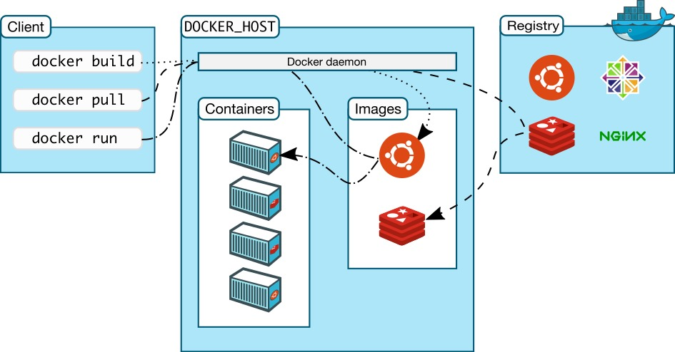
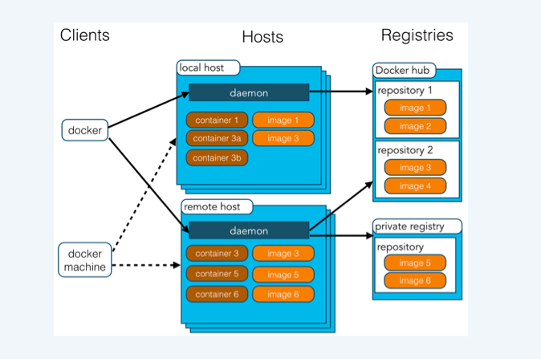
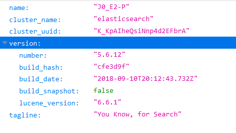
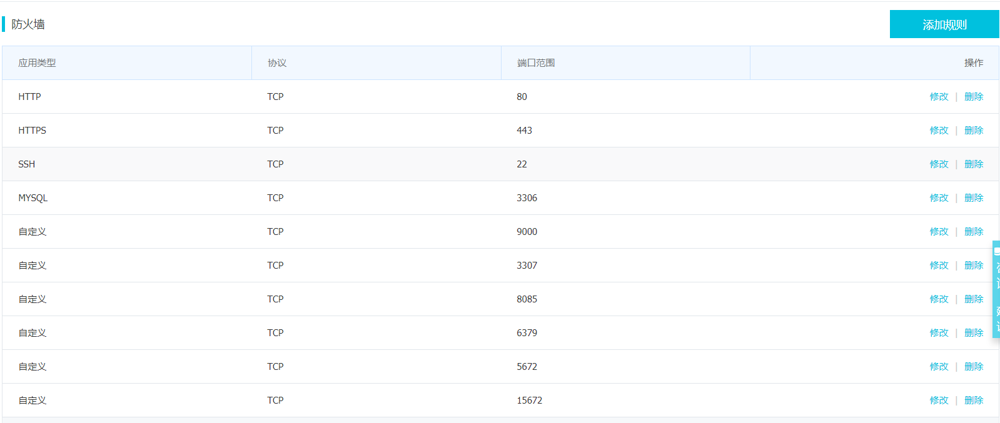
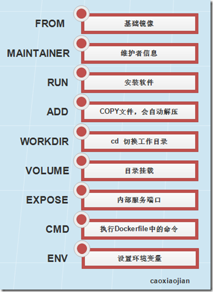

## docker入门

### 简介

Docker[中文文档](https://yeasy.gitbooks.io/docker_practice/content/)

Docker 是一个开源的应用容器引擎，基于Go 语言并遵从`Apache2.0`协议开源。
`Docker` 可以让开发者打包他们的应用以及依赖包到一个轻量级、可移植的容器中，然后发布到任何流行的`Linux`机器上，也可以实现虚拟化。
容器是完全使用沙箱机制，相互之间不会有任何接口，更重要的是容器性能开销极低。

Docker支持将软件编译成一个镜像；然后在镜像中各种软件做好配置，将镜像发布出去，其他使用者可以直接使用这个镜像运行中的这个镜像称为容器，容器启动是非常快速的。类似windows里面的ghost操作系统，安装好后什么都有了



### Docker术语

docker镜像(Images)：Docker 镜像是用于创建 Docker容器的模板。

docker容器（Container）：容器是独立运行的一个或一组应用。

docker客户端（Client）：客户端通过命令行或者其他工具使Docker [APl](https://docs.docker.com/reference/api/docker_remote_api)与Docker的守护进程通信

docker主机（Host)：一个物理或者虚拟的机器用于执行Docker守护进程和容器。

docker仓库（Registry）：Docker仓库用来保存镜像，可以理解为版本控制中的代码仓库。[Docker Hub](https://hub.docker.com)提供了庞大的镜像集合供使用



使用Docker的步骤：

1. 安装Docker
2. 去Docker仓库找到这个软件对应的镜像
3. 使用Docker运行这个镜像，这个镜像就会生成一个Docker容器
4. 对容器的启动停止就是对软件的启动停止

### docker 服务

docker必须运行在64位的系统上,对于`CentOS`的版本号并没有特别要求,但是内核版本必须高于3.10。

可以使用如下命令查看内核版本

```shell
#查看内核版本
$ uname -r
3.10.0-327.el7.x86_64
```

#### 升级内核

如果内核版本太低使用下面的命令升级内核

```shell
#导入elrepo的key，然后安装elrepo的yum源
rpm -import https://www.elrepo.org/RPM-GPG-KEY-elrepo.org

rpm -Uvh http://www.elrepo.org/elrepo-release-7.0-2.el7.elrepo.noarch.rpm

#使用以下命令列出可用的内核相关包：
yum --disablerepo="*" --enablerepo="elrepo-kernel" list available

#选择想要安装的内核版本，比如安装64位4.19版本内核
yum -y --enablerepo=elrepo-kernel install kernel-ml.x86_64 kernel-ml-devel.x86_64

#查看内核版本默认启动顺序：
awk -F\' '$1=="menuentry " {print $2}' /etc/grub2.cfg

#编辑grub.conf文件，修改Grub引导顺序，将default设置为0
vim /etc/grub.conf

#重启系统
shutdown -r now

#如果想要删除多余的内核，自行百度
```

#### yum安装Docker

1. 登录系统,并确认用户为 root 或者用户有权限使用 sudo 命令。
2. 保证你现有的yum安装包是最新的

```shell
$ sudo yum update
```

安装

```shell
$ yum install docker
```

或者

```shell
$ sudo yum install docker-engine
```

启动docker

```shell
$ sudo service docker start
```

可以使用docker查看版本，测试docker服务启动没有

```shell
$ sudo docker -v
```

如果想设置docker服务开机启动

```shell
$ sudo systemctl enable docker
```

如果想停止docker服务

```shell
systemctl stop docker
```

为了确保docker可用,可以运行一个docker容器测试一下,再次之前你可能需要配置docker的加速器,可以使用阿里云账户的容器镜像加速,根据提示操作即可,或者自行百度其他加速器地址,否则可能会无法下载镜像

```shell
$ sudo docker run hello-world
```

如果看到如下的提示信息(注意:`This message shows that your installation appears to be working correctly.`这句)说明docker成功安装可以运行容器

```shell
Unable to find image 'hello-world:latest' locally
latest: Pulling from library/hello-world
c04b14da8d14: Pull complete
Digest: sha256:0256e8a36e2070f7bf2d0b0763dbabdd67798512411de4cdc
f9431a1feb60fd9
Status: Downloaded newer image for hello-world:latest
Hello from Docker!
This message shows that your installation appears to be working correctly.
......
```

#### 使用脚本安装

执行安装脚本

```shell
curl -fsSL https://get.docker.com/ | sh
```

该脚本会添加 `docker.repo`仓库并安装docker。

#### 创建一个docker用户组

> 注意:该操作是可选的

docker 守护进程现在绑定了一个`Unix Socket`,取代了之前的`TCP`端口。 默认情况下,这个`Socket`的属主用户是 `root` 并且用户可以通过 `sudo` 进行访问。因此, `docker` 守护进程总是通过 `root` 用户运行。

为了避免在使用docker命令的时候使用`sudo`,需要创建一个名为`docker` 的`Unix`用户组,并给该用户组添加用户。当`docker`守护进程启动后,`docker`用户组的用户可以获得`socket`的的读写权限。

> docker组不等价于用户root，如果想要知道的更多关于安全影响，查看[docker daemon attack surface](http://www.bubuko.com/infodetail-2223211.html#docker-daemon-attack-surface)

创建docker用户组并添加用户:

```shell
$ sudo groupadd docker
```

为docker用户组添加用户

```shell
$ sudo usermod -aG docker your_username
```

然后注销账户重新登录,这样可以保证你的用户获得正确的权限

重新登录以后,确认你可以不使用`sudo`启动docker容器

```shell
$ docker run hello-world
```

### 卸载

你可以通 yum 卸载docker软件

1. 列出所有以及安装的程序包

```shell
$ yum list installed |grep docker
docker-engine.x86_64 1.12.1-1.el7.centos@dockerrepo
docker-engine-selinux.noarch 1.12.1-1.el7.centos@dockerrepo
```

2. 删除软件包

```shell
$ sudo yum -y remove docker-engine.x86_64
1.12.1-1.el7.centos
```

该命令不会删除docker镜像,容器,数据卷,或者用户创建的配置文件

如果要删除镜像,容器和数据卷,使用以下命令

```shell
$ rm -rf /var/lib/docker
```

### 镜像操作

从docker仓库搜索镜像

```shell
$ docker search 镜像名
例如
$ docker search mysql
```

搜索到镜像以后，拉取镜像

```shell
$ docker pull 镜像名:tag#tag可以指定版本号,不指定默认是latest版本,tag以官网搜索的镜像为准
例如：
$ docker pull mysql:5.7
```

查看本地所有docker镜像

```shell
$ docker images
```

删除指定的本地镜像

```shell
$ docker rmi image-id#镜像id
```

还可以在`https://hub.docker.com`搜索想要的镜像

### 容器操作

- 首先需要安装镜像
- 然后运行镜像
- 之后会产生一个容器（正在运行的软件）

**步骤（以tomcat镜像为例）：**

1. 搜索镜像

```shell
$ docker search tomcat
```

2. 拉去docker镜像，我默认为latest，如果拉去镜像总是`TLS handshake timeout`超时可以配置docker镜像的加速器

```shell
# 加速地址
curl -sSL https://get.daocloud.io/daotools/set_mirror.sh | sh -s 
#然后根据提示重启dockers服务即可生效

#比如中国科学技术大学镜像地址,或者你也可以使用别的比如阿里云
curl -sSL https://get.daocloud.io/daotools/set_mirror.sh | sh -s https://docker.mirrors.ustc.edu.cn
```

拉取镜像：

```shell
$ docker pull tomcat
```

3. 根据镜像启动容器(`-d表示后台运行`)

```shell
docker run --name 给容器起一个名字 -d 镜像名称不带docker.io如果有标签加标签
比如：
docker run --name mytomcat -d tomcat:latest
```

运行成功后会得到一串id比如：`bc41fb8f4d680d68b5c11f856d24e13f5e3fdaa4337593036388807416821a4b`

4. 可以使用`docker ps`查看哪些docker镜像在运行

```shell
docker ps
# 查看所有的容器
docker ps -a
```

5. 停止运行中的容器

```shell
docker stop 容器id/容器名称
```

6. 删除指定容器

```shell
docker rm 容器id
```

删除以后只要镜像没有删除，下次启动镜像时就会创建容器，但是有tomcat容器是不能访问的，必须要做端口映射

7. 端口映射

```shell
# 可以不指定--name，使用-p参数将主机的8888端口映射到8080端口，就可以
# 使用8888端口访问tomcat了，8888只是举例也可以8080:8080
docker run -d -p 8888:8080 tomcat
```

此时就可以使用公网ip或者如果是虚拟机就虚拟机本机`ip:映射端口号`访问了，如果不能访问，请检查防火墙的状态或者配置防火墙规则

```shell
# 查询端口是否开放
firewall-cmd --query-port=8080/tcp
# 开放80端口
firewall-cmd --permanent --add-port=80/tcp
firewall-cmd --permanent --add-port=8080-8085/tcp
# 移除端口
firewall-cmd --permanent --remove-port=8080/tcp
查看防火墙的开放的端口
firewall-cmd --permanent --list-ports

#重启防火墙(修改配置后要重启防火墙)
firewall-cmd --reload


# 参数解释
1、firwall-cmd：是Linux提供的操作firewall的一个工具；
2、--permanent：表示设置为持久；
3、--add-port：标识添加的端口；
```

8. 查看docker日志

```shell
docker logs 容器id/容器名
```

9. 进入容器中(比如进入mysql的容器，就可以使用`mysql- u root -p`登陆进`mysql`了)

```shell
docker exec -it mysqldocker bash #mysqldocker是mysql容器名称
```

**更多操作命令参考**

```shell
https://docs.docker.com/engine/reference/commandline/docker/
```

### 常用环境搭建

1. 安装mysql

```java
docker pull mysql:5.7
```

如果使用常规方式启动mysql会发现并没有启动起来，查看你日志会发现

```shell
error: database is uninitialized and password option is not specified 
  You need to specify one of MYSQL_ROOT_PASSWORD, MYSQL_ALLOW_EMPTY_PASSWORD and MYSQL_RANDOM_ROOT_PASSWORD
```

没有指定密码，这三个三处必须指定一个，安装时可以参考官方文档

```shell
docker run --name mysql57 -e MYSQL_ROOT_PASSWORD=123456 -d mysql:5.7
```

但是没有做端口映射外部不能访问，如果要做端口映射

```shell
docker run -p 3306:3306 --name mysql57 -e MYSQL_ROOT_PASSWORD=123456 -d mysql:5.7
```

**注意：**如果默认latest安装，会安装`mysql8`版本，加密方式与之前都不同，所以使用sqlyog或其他客户端连接时会报错`Plugin caching sha2 password could not be loaded:`,解决方式自行百度。比如可以进入mysql容器使用`ALTER USER 'root'@'localhost' IDENTIFIED WITH mysql_native_password BY 'password';`密码，如果不行建议更换`navicat12`

2. 安装redis

```shell
# 拉去redis镜像
docker pull redis

# 运行redis镜像创建容器,并且配置持久化为yes
docker run -p 6380:6379 --name myredis -d redis redis-server --appendonly yes
```

3. 安装RabbitMQ

```shell
sudo docker pull rabbitmq:3.7-management

sudo docker run -d -p 5672:5672 -p 15672:15672 --name myrabbitmq rabbitmq:3.7-management
```

15672是后台管理的端口号，装好以后可以使用访问

```
ip:15672
```

然后使用默认的账号密码登陆

```
账号：guest
密码：guest
```

如果是远程主机如果使用guest或着为了安全考虑，都应该需要创建新的用户名和密码然后删除`guest`用户

3. 安装elasticsearch

```shell
#下载镜像
sudo docker pull elasticsearch

#运行，初始化堆内存大小为256m
sudo docker run -e ES_JAVA_OPTS="-Xms256m -Xmx256m" -d -p 9200:9200 -p 9300:9300 --name myES01 elasticsearch
```

然后访问9200端口出现下面的结果则说明安装成功了：



参考官网镜像仓库自带的文档就可以将以上的都安装完毕

**注意：如果是远程服务器比如阿里云的，处理端口映射以外，还需要去阿里云的控制台设置防火墙规则**，比如：



### 文件拷贝

如果我们需要讲文件拷贝到容器中可以使用`cp`命令

```shell
docker cp 需要拷贝的文件或目录 容器名称:容器目录
```

例如:

```shell
docker cp 2.txt /root
```

也可以将文件从容器中拷贝出来

```shell
docker 容器名称:容器目录或文件 目的路径
例如:
docker cp c2:/root/2.txt ./
```

演示:

```shell
# 终端1:拉取centos的镜像,并运行
sudo docker pull centos
sudo docker run -it --name c1 centos

# 新开一个终端,我称之为终端2
cd ~
touch hello.txt
sudo docker cp hello.txt c1:/root 

# 此时到到终端1执行ls即可看到hello.txt
```

### 目录挂载

我们可以在创建容器的时候,将宿主机的目录与容器内的目录进行映射,这样我们就可以通过修改宿主机的某个目录中的文件去影响容器.

创建容器时,使用`-v`参数指定容器数据卷,格式:`-v 宿主机目录:容器目录`

```shell
docker run -itd --name c1 -v ~/test: /usr/local/src/html centos
```

此时home目录下会存在一个test文件夹

```shell
#切换到home目录下的test文件夹中创建一个hello.txt
cd ~/test
sudo touch hello.txt

# 进入容器中,查看是否在html文件中存在hello.txt
sudo docker exec -it c1 /bin/bash
cd /usr/local/src
ls
```

使用这样的方式我们就可以很方便的修改某些配置文件而不用进入容器中

## docker进阶

### 镜像制作

镜像制作方式有两种:

1. 通过`docker commit`命令制作
2. 编写`docker file`去构建

#### docker commit

使用`docker commit`制作镜像需要一个基础镜像,本质是一个OS

```shell
# 拉取基础镜像
sudo docker pull centos

# 创建交互式容器,执行结束会在容器中
sudo docker run -it --name mycentos centos
# 安装jdk
yum install jdk

# 拷贝tomcat到容器
docker cp apache-tomcat-7.0.47.tar.gz mycentos:/root/

# 进入容器中,解压tomcat
tar -zxvf apache-tomcat-7.0.47.tar.gz -C /usr/local

# 退出容器,执行commit去创建一个myhttpd的镜像
sudo docker commit mycentos mytomcat

# 使用新镜像
sudo docker run -itd --name tomcat1 -p 8090:8080 mytomcat /bin/bash
# 启动容器中的tomcat
sudo docker exec tomcat1 /usr/local/apache-tomcat-7.0.47/bin/startup.sh
```

此时打开浏览器访问:`http://ip:8090`即可看到tomcat的首页

### 镜像打包

**镜像打包**

1. 镜像打包:

```shell
docker save -o /root/tomcat7.tar mytomcat
```

2. 将打包的镜像上传到其他服务器

```shell
scp tomcat7.tar 其他服务器ip:/root
```

3. 导入镜像

```shell
docker load -i /root/tomcat7.tar
```

**容器打包**

1. 容器打包

```shell
docker export -o /root/t1.tar t1
```

2. 导入容器

```shell
docker import t1.tar mytomcat:latest
```

### docker builder

`DockerFile` 使用基本的基于`DSL`语法的指令来构建一个Docker镜像,之后使用`docker builder`命令基于该`Dockerfile`中的指令构建一个新的镜像.

官方[参考文档](https://docs.docker.com/engine/reference/builder/#known-issues-run)

中文[参考文档]([http://www.dockerinfo.net/dockerfile%e4%bb%8b%e7%bb%8d](http://www.dockerinfo.net/dockerfile介绍))

#### 指令



`Dockerfile` 由一行行命令语句组成，并且支持以 `#` 开头的注释行。

一般的，`Dockerfile` 分为四部分：基础镜像信息、维护者信息、镜像操作指令和容器启动时执行指令。

指令的一般格式为 `INSTRUCTION arguments`，指令包括 `FROM`、`MAINTAINER`、`RUN` 等。

#### FROM

`FROM指令`,用于指定基础镜像,必须制定切需要在`Dockerfile`其他指令的前面,后续的指令都以来与该指令制定的`image`,`FROM`指令制定的基础`image`可以是官方仓库中的,也可以位于本地仓库,如果在同一个`Dockerfile`中创建多个镜像时，可以使用多个 `FROM` 指令（每个镜像一次）。

格式为:

```shell
FROM <image>或FROM <image>:<tag>
```

#### MAINTAINER

作用是用于制定镜像的创建者信息,当我们对该`image`执行`docker inspect`命令时,输出中有相应的字段记录该信息

格式为:

```shell
MAINTAINER <name>
```

#### RUN

该指令用于执行命令,比如我们想在镜像中安装vim,只需要在Dockerfile中写`RUN yum install -y vim`即可

格式为:

```shell
RUN <command> 或 RUN ["executable", "param1", "param2"]
```

前者将在shell终端中运行命令,即`/bin/sh -c`; 后者则使用`exec`执行命令。指令使用其他终端可以通过第二种方式实现, 例如 `RUN ["/bin/bash", "-c", "echo hello"]`,

每条`RUN`指令将在前面镜像基础上执行该命令,并提交为新的镜像。当命令较长时可以使用`\`换行。

#### CMD

指定启动容器时执行的命令，每个` Dockerfile` 只能有一条 `CMD` 命令。如果指定了多条命令，只有最后一条会被执行。

支持三种格式

- `CMD ["executable", "param1", "param2"]` 使用 `exec` 执行，推荐方式；
- `CMD command param1 param2` 在 `/bin/sh` 中执行，提供给需要交互的应用；
- `CMD ["param1", "param2"]` 提供给 `ENTRYPOINT` 的默认参数；

如果用户启动容器时候指定了运行的命令，则会覆盖掉 `CMD` 指定的命令。

####  EXPOSE

告诉 Docker 服务端容器暴露的端口号，供互联系统使用。在启动容器时需要通过 -P，Docker 主机会自动分配一个端口转发到指定的端口。

格式为:

```shell
EXPOSE <port> [<port>...]
```

#### ENV

指定一个环境变量，会被后续 `RUN` 指令使用，并在容器运行时保持。

格式为:

```shell
ENV <key> <value>
```

例如:

```shell
ENV PG_MAJOR 9.3
ENV PG_VERSION 9.3.4
RUN curl -SL http://example.com/postgres-$PG_VERSION.tar.xz | tar -xJC /usr/src/postgress && …
ENV PATH /usr/local/postgres-$PG_MAJOR/bin:$PATH
```

#### ADD

该命令将复制指定的 `<src>` 到容器中的 `<dest>`。 其中 `<src>` 可以是`Dockerfile`所在目录的一个相对路径；也可以是一个 URL；还可以是一个 tar 文件（自动解压为目录）。

格式为:

```shell
COPY <src> <dest>
```

#### ENTRYPOINT

配置容器启动后执行的命令，并且不可被 `docker run` 提供的参数覆盖。

格式为:

```shell
ENTRYPOINT ["executable", "param1", "param2"]
或者
ENTRYPOINT command param1 param2（shell中执行）
```

每个 `Dockerfile` 中只能有一个 `ENTRYPOINT`，当指定多个时，只有最后一个起效。

#### VOLUME

创建一个可以从本地主机或其他容器挂载的挂载点，一般用来存放数据库和需要保持的数据等。

格式为:

```shell
VOLUME ["/data"]
```

#### USER

指定运行容器时的用户名或 `UID`，后续的 `RUN` 也会使用指定用户。

格式为:

```shell
USER daemon
```

当服务不需要管理员权限时，可以通过该命令指定运行用户。并且可以在之前创建所需要的用户

例如：

```shell
RUN groupadd -r postgres && useradd -r -g postgres postgres
```

要临时获取管理员权限可以使用 `gosu`，而不推荐 `sudo`。

#### WORKDIR

为后续的 `RUN`、`CMD`、`ENTRYPOINT` 指令配置工作目录。

格式为:

```shell
WORKDIR /path/to/workdir
```

可以使用多个 `WORKDIR` 指令，后续命令如果参数是相对路径，则会基于之前命令指定的路径。

例如:

```shell
WORKDIR /a
WORKDIR b
WORKDIR c
RUN pwd
```

则最终路径为 `/a/b/c`

#### ONBUILD

配置当所创建的镜像作为其它新创建镜像的基础镜像时，所执行的操作指令。

格式为;

```shell
ONBUILD [INSTRUCTION]
```

例如，`Dockerfile` 使用如下的内容创建了镜像 `image-A`。

```shell
[...]
ONBUILD ADD . /app/src
ONBUILD RUN /usr/local/bin/python-build --dir /app/src
[...]
```

如果基于` image-A` 创建新的镜像时，新的`Dockerfile`中使用 `FROM image-A`指定基础镜像时，会自动执行`ONBUILD` 指令内容，等价于在后面添加了两条指令。

```shell
FROM image-A

#Automatically run the following
ADD . /app/src
RUN /usr/local/bin/python-build --dir /app/src
```

使用 `ONBUILD` 指令的镜像，推荐在标签中注明，例如 `ruby:1.9-onbuild`。

#### 创建镜像

编写完成 `Dockerfile` 之后，可以通过 `docker build` 命令来创建镜像。

基本的格式为

```shell
docker build [选项] 路径
```

该命令将读取指定路径下（包括子目录）的 `Dockerfile`，并将该路径下所有内容发送给 `Docker`服务端，由服务端来创建镜像。因此一般建议放置 `Dockerfile` 的目录为空目录。也可以通过 `.dockerignore` 文件（每一行添加一条匹配模式）来让 `Docker` 忽略路径下的目录和文件。

要指定镜像的标签信息，可以通过 `-t` 选项，例如

```shell
$ sudo docker build -t myrepo/myapp /tmp/test1/
```

