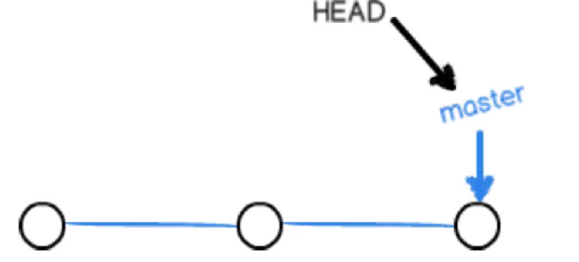
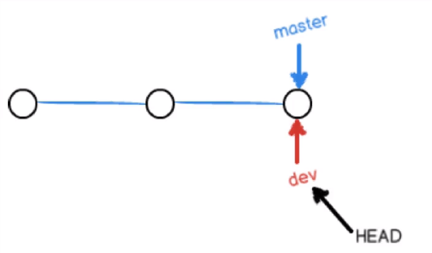
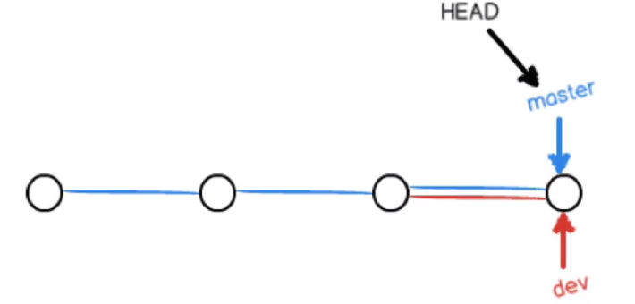
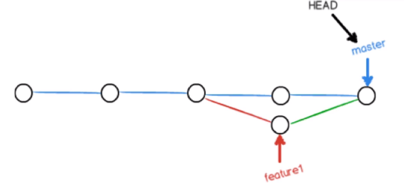

# Git

## git基本命令

- 查看当前文件的状态：git status
- 从工作区提交到暂存区：git add 文件名
- 将暂存区的文件提交到仓库：git commit -m "提交描述"

### 初始化git

当git第一次安装时需要初始化用户名和邮箱

- 设置用户名：
  git config --global user.name '用户名'
- 设置用户名邮箱
  git config --global user.email '邮箱地址'

```
该设置在github仓库主页显示谁提交了该文件
```

- 查看设置
  git config -list

### 初始化一个新仓库

- mkdir 文件夹名
- 在文件内初始化git

```
- 进入到文件夹内：cd 文件夹名
- 初始化： git init
如此仓库即在test里了
```

### 向仓库中添加文件

- 将文件从工作区添加到暂存区

### 删除仓库文件

- 删除工作目录：rm -f 文件名
- 从git中删除文件 git rm 文件名
- 提交修改：git commit -m '描述'

## git分支

### 分支的创建查看及切换

当使用`git init`的时候会初始化一个分支为`master`分支，但是这个分支只有提交一次之后才会生效,所以必须先写点什么东西然后在提交，如果是空提交是不行的比如下面

```shell
$ git commit -m 'init commit'
On branch master

Initial commit

nothing to commit
```

此时master分支并没有生效，可以使用`git branch`命令查看所有分支

```shell
$ git branch
* master
```

只有看到这样的结果才说明master分支生效了。`*`代表当前分支

创建分支和查看分支使用的是一个命令：

```shell
$ git branch test_branch #创建分支

$ git branch	#查看分支
* master
  test_branch
```

**切换分支：**

通过`git checkout 分支名称`切换分支

```shell
$ git checkout test_branch
Switched to branch 'test_branch'
```

不同的分支在没有合并之前是独立的。

### 分支的重要操作

删除分支

```
git branch -d 分支名称
```

`git`不允许删除当前所处的分支

如果要删除的分支并没有完全被合并那么要删除就需要使用 `-D`选项

```
git branch -D 分支名称
```

创建分支并切换的简写命令为：

```
git checkout -b 分支名
```

使用`git checkout -`可以回退切换分支,例如：

```shell
$ git checkout -b test_branch2
Switched to a new branch 'test_branch2'
#在使用git checkout - 即可回退到之前所处的分支
$ git checkout -
Switched to branch 'master'
```

使用`git merge 分支名`可以将指定的分支合并到当前分支上

例如我在master分支上创建了一个文件名叫`test_branch.txt`内容为：

```
this is master test_branch i want to merge test_branch2 branch file
```

然后再创建了一个叫`test_branch2`的分支在此分支上创建一个相同名称的`test_branch.txt`内容为：

```
this is test_branch2 branch
```

此时切换回`master`分支使用`git merge test_branch2`

```shell
$ git merge test_branch2 #合并分支

$ cat test_branch.txt #输出master分支的文件内容
this is master test_branch i want to merge test_branch2 branch file
this is test_branch2 branch
```

如果此时发生冲突，需要手动解决然后用 `git add 冲突的文件名`告诉git冲突已经解决了然乎使用`git commit`完成最终合并

**分支中的HEAD**

使用

```
git reset HEAD 文件名
```

可以将已经在暂存区中的文件挪出来即从暂存区删除恢复原来的状态

**在只有一个分支的情况下**`HEAD`指向的是当前分支而master指向提交



如果此时在`master`分支上在创建一个`dev`分支并切换到`dev`分支上



如果此时在`dev`分支上做一次提交那么状态又如下所示：


总结而言就是`HEAD`是指向当前分支的，而当前分支指向提交

如果将`dev`分支合并到`master`在没有任何冲突的情况下的状态如下图：



产生冲突后分支合并冲突：



## 分支进阶与版本回退

### fast-forward

- 如果可能，合并分支时Git会使用fast-forward模式

- 在这种模式下，删除分支时会丢掉分支信息

- 合并时加上--no-ff参数会禁用fast-forward，这样会多出一个commit id

  ```shell
  git merge --no-ff dev
  ```

- 查看log

  ```
  git log --graph
  ```

`git add .`和`git commit -m `的简写形式

```
git commit -am '提交描述'
```

### 版本回退

回退到上一版本

```shell
git reset --hard HEAD^
# 或者
git reset --hard HEAD～1 # 1位置表示回到第几个提交
# 或者
git reset --hard commit_id
```

如果想回退两个版本

```shell
git reset --hard HEAD^^
```

回退之后还可以通过commitId前进,通过commitId可以回退到任何提交例如：

```
git reset --hard ef34 #id前几位就可以
```

返回到某一个版本

```shell
#reflog记录的是操作日志就算版本回退了所有操作的commit依然存在
git reflog 
```

例如：

```shell
$ git reflog 
ef34732 (HEAD -> master) HEAD@{0}: reset: moving to ef347
a9b0f96 HEAD@{1}: reset: moving to HEAD^^
ef34732 (HEAD -> master) HEAD@{2}: reset: moving to HEAD^
690b3a8 HEAD@{3}: commit: fouth commit
ef34732 (HEAD -> master) HEAD@{4}: commit: third commit
1fa07d2 HEAD@{5}: commit: first commit:create some test file
a9b0f96 HEAD@{6}: commit (initial): init commit
```

然后就可以通过cmmitId进行版本切换

## checkout进阶与stash

使用下面的命令，可以丢弃修改（未添加到暂存区的修改）

```shell
 git checkout -- 文件名
```

`checkout`进行版本切换

```
git checkout commitId
```

但是使用`checkout`切换版本属于游离状态与之前的版本切换是不一样的。游离状态的分支是没有名字的只有commitId

**分支改名：**

```
git branch -m 原分支名 需要更改的名称
例如将test_branch分支该名为test分支
git branch -m test_branch test
```

`git stash`可以将当前分支未提交的内容保存起来然后切换到其他分支，如果在当前分支上做出修改没有提交想要切换到其他分支可以使用此命令。

当切换回来的时候使用`git stash list`恢复保存的内容

例如：在dev分支写的内容已经添加到暂存区了但是还没写完不能提交此时想要切换到其他分支

```
$ git checkout master
error: Your local changes to the following files would be overwritten by checkout:
        hello.txt
Please commit your changes or stash them before you switch branches.
Aborting
```

就会报错提示无法切换修改还没有提交

那么就可以使用`git stash`命令将状态保存起来

```shell
$ git stash
Saved working directory and index state WIP on dev: a773231 create a file
#也可以保存时输入一下备注信息
# git stash '这是一段备注'
```

然后再其他分支做了一些事情之后，再切换来还原状态

```shell
$ git checkout master
Switched to branch 'master'
# ....做事一些事情，然后切换回dev分支
$ git checkout dev
Switched to branch 'dev'

$ git stash list
stash@{0}: WIP on dev: a773231 create a file
stash@{1}: WIP on master: 690b3a8 fouth commit

```

**保存工作现场总结**

- 保存现场

```
git stash
git stash list
```

- 恢复现场

```
git stash apply（stash内容并不删除，需要通过git stash drop stash@（0}手动删除）

git stash pop（恢复的同时也将stash内容删除）

git stash apply stash@（0}
```

## 标签与diff

- 新建标签，标签有两种：轻量级标签（lightweight）与带有附注标签
  （annotated）

- 创建一个轻量级标签

  ```
  git tag v1.0.1
  ```

- 创建一个带有附注的标签

  ```
  git tag-a v1.0.2 -m 'release version'
  ```

- 删除标签

  ```
  git tag -d tag_name
  ```

**查看文件都有谁修改过：**

```shell
$ git blame test.txt
690b3a81 (guqing 2019-03-17 20:29:26 +0800 1) 我在这里添加了一行
690b3a81 (guqing 2019-03-17 20:29:26 +0800 2) 这是第四次修改
```

### 差异性比较diff

#### 比较工作区和暂存区的差异

```shell
$ git diff
diff --git a/test.txt b/test.txt
index b704362..e5c0dec 100644
--- a/test.txt
+++ b/test.txt
@@ -1,3 +1,4 @@
 我在这里添加了一行
 这是第四次修改
 hello world
+hello java
```

代表有三行相同`hello java`这一行不同

#### 比较工作区与特定的commitId的差异

```
git diff commit_id
```

例如：

```shell
$ git diff HEAD # HEAD指向的是一次提交
diff --git a/test.txt b/test.txt
index d0a5143..e5c0dec 100644
--- a/test.txt
+++ b/test.txt
@@ -1,2 +1,4 @@
 我在这里添加了一行
 这是第四次修改
+hello world
+hello java
```

#### 比较暂存区与已提交特定把把版本的差异

```shell
git diff --cached commit_id #不加commit_id表示与最新提交比较
```

例如：

```shell
$ git diff --cached
diff --git a/test.txt b/test.txt
index d0a5143..b704362 100644
--- a/test.txt
+++ b/test.txt
@@ -1,2 +1,3 @@
 我在这里添加了一行
 这是第四次修改
+hello world
```

## 远程仓库

push 推送

pull 拉取，同时会执行合并merge,pull == fetch + merge

推送命令：

```shell
git remote add origin 仓库地址 #使用orgin与仓库地址关联
git push -u origin master # 将master推送到远程，并与本地master分支关连，下次就不用再写master
```

然后下次提交时使用`git push`就可以向该远程仓库提交了

使用`git remote show`命令可以列出与当前仓库关联的所有远程仓库

查看远程仓库详细信息`git remote show orgin`

**基于Git分支的开发模型：**

- develop分支（频繁变化的一个分支）
- test分支（供测试与产品等人员使用的一个分支，变化不是特别频繁）
- master分支（生产发布分支，变化非常不频繁的一个分支）
- bugfix（hotfix）分支（生产系统当中出现了紧急Bug，用于紧急修复的分支）

```shell
git push origin +master #强制推送到远程
```

## git fetch 和git pull 的差别

1. `git fetch` 相当于是从远程获取最新到本地，不会自动merge，如下指令：

```shell
　git fetch orgin master //将远程仓库的master分支下载到本地当前branch中

　git log -p master  ..origin/master //比较本地的master分支和origin/master分支的差别

　git merge origin/master //进行合并
```

也可以用以下指令：

```shell
git fetch origin master:tmp //从远程仓库master分支获取最新，在本地建立tmp分支

git diff tmp //將當前分支和tmp進行對比

git merge tmp //合并tmp分支到当前分支
```

2. `git pull`：相当于是从远程获取最新版本并merge到本地

```shell
git pull origin master
```

`git pull` 相当于从远程获取最新版本并merge到本地

在实际使用中，git fetch更安全一些