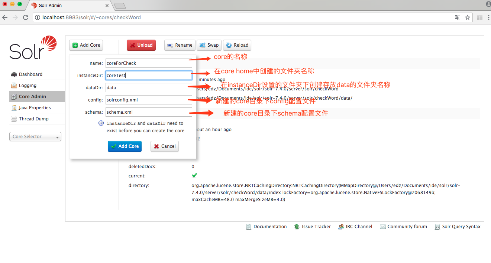

# Lucene 和 Solr

## 1.Lucene 起步

本文使用的是`Lucene7.7.1`和`Solr7.7.1`版本

### 1.1 lucene 介绍

Lucene 是一个全文检索引擎工具包，最初是 apache 软件基金会 jakarta 项目组的一个子项目，但它不是一个完整的全文检索引擎，而是一个全文检索引擎的架构，提供了完整的查询引擎和索引引擎，以及部分文本分析引擎。Lucene 的目的是为软件开发人员提供一个简单易用的工具包，以方便的在目标系统中实现全文检索的功能例如站内搜索，或者是以此为基础建立起完整的全文检索引擎。Lucene 提供了一个简单却强大的应用程式接口，能够做全文索引和搜寻。在 Java 开发环境里 Lucene 是一个成熟的免费开源工具。就其本身而言，Lucene 是当前以及最近几年最受欢迎的免费 Java 信息检索程序库。人们经常提到信息检索程序库，虽然与搜索引擎有关，但不应该将信息检索程序库与搜索引擎相混淆。

### 1.2 Lucen 的功能

#### 可扩展的高性能索引

- 在现代硬件上超过 150GB /小时
- 小 RAM 要求 - 只有 1MB 堆
- 增量索引与批量索引一样快
- 索引大小约为索引文本大小的 20-30％

#### 强大，准确，高效的搜索算法

- 排名搜索 - 首先返回最佳结果

- 许多强大的查询类型：短语查询，通配符查询，邻近查询，范围查询等

- 现场搜索（例如标题，作者，内容）

- 按任何领域排序

- 使用合并结果进行多索引搜索

- 允许同时更新和搜索

- 灵活的分面，突出显示，连接和结果分组

- 快速，记忆效率高和错误容忍的建议

- 可插拔排名模型，包括[矢量空间模型](http://en.wikipedia.org/wiki/Vector_Space_Model)和[Okapi BM25](http://en.wikipedia.org/wiki/Okapi_BM25)

- 可配置存储引擎（编解码器）

#### 跨平台解决方案

- 可作为[Apache 许可](http://www.apache.org/licenses/LICENSE-2.0.html)下的开源软件 使用，它允许您在商业和开源程序中使用 Lucene
- 100％-pure Java
- 可用的其他编程语言中的实现是索引兼容的

**Lucene 文档地址：**

```
http://lucene.apache.org/core/7_7_1/index.html
```

### 1.2 lucene 全文检索的应用场景

对于数据量大，数据结果不固定的数据可采用全文检索方式搜索，比如百度、google 等搜索引擎，电商网站站内搜索，论坛站内搜索等。

### 1.3 Lucen 实现全文索引的流程


1.红色表示所有过程，对要搜索的原始内容进行索引，构建一个索引库，索引过程包括：

确定原始内容即要搜索的内容 --> 采集文档 --> 创建文档 --> 分析文档 --> 索引文档

2.橙色表示搜索过程，从索引库中搜索内容，搜索过程包括：

用户通过搜索界面 --> 创建查询 --> 执行搜索，从索引库查询 --> 渲染搜索结果

### 1.4 创建索引

#### 1.4.1 获得原始文档

原始文档是指要索引和搜索的内容，原始内容包括互联网上的网页、数据库中的数据、磁盘上的文件等

本例中的原始内容就是磁盘上的文件，如下图所示：


​ 从互联网上、数据库、文件系统中等获取需要搜素的原始信息，这个过程就是信息采集，信息采集的目的是为了对原始内容进行索引。
​ 在 Internet 上采集信息的软件通常称为爬虫或蜘蛛，称为网络机器人，爬虫访问互联网上的每一个网页，将获取到的网页内容存储起来。
​ Lucene 不提供信息采集的类库，需要自己编写一个爬虫程序实现信息采集，也可以通
过一些开源软件实现信息采集，如下：
​ [Nutch](http:/lucene.apache.org/nutch)，Nutch 是 apache 的一个子项目，包括大规模爬虫工具，能够抓取和分辨 web 网站数据。
​ [jsoup](http://jsoup.org/)，jsoup 是一款 Java 的 HTML 解析器，可直接解析某个 URL 地址、HTML 文本内容。它提供了一套非常省力的 APl，可通过 DOM，CSS 以及类似于 iQuery 的操作方法来取出和操作数据。
​ [heritrix](http:/sourceforge.net/proiects/archive-crawler/files/)，Heritrix 是一个由 java 开发的、开源的网络爬虫，用户可以使用它来从网上抓取想要的资源。其最出色之处在于它良
好的可扩展性，方便用户实现自己的抓取逻辑。
​ 本案例我们要获取磁盘上文件的内容，可以通过文件流来读取文本文件的内容，对于
pdf、doc、xls 等文件可通过第三方提供的解析工具读取文件内容，比如 Apache POl 读取 doc 和 xs 的文件内容。

### 1.5 创建文档对象

​ 获取原始内容的目的是为了索引，在索引前需要将原始内容创建成文档（Document），文档中包括一个一个的域（Field），域中存储内容。
​ 这里我们可以将磁盘上的一个文件当成一个 document，Document 中包括一些 Field
（filename 文件名称、fle_path 文件路径、flesize 文件大小、file_content 文件内容），如下图：


在 Lucene 中的域就相当于数据库中的字段，可以有多个域，且域名称可以相同，一个域由域名称，域值组成类似域 K,V 键值对。每一个文档都有一个唯一的编号就是文档的 id，与数据库的 id 类似，但是无法手动指定，是 Lucene 自增的。

### 1.6 分析文档

​ 将原始内容创建为包含域（Field）的文档（document），需要再对域中的内容进行分析，分析的过程是经过对原始文档提取单词、将字母转为小写、去除标点符号、去除停用词等过程生成最终的语汇单元，可以将语汇单元理解为一个一个的单词。

比如下边的文档经过分析如下：

原文档内容：

```
Lucene is a Java full-text search engine.Lucene is not a complete application，but rather a code library and API that can easily be used to add search capabilities to applications.…
```

分析后得到的语汇单元为：

```
lucene、java、full、search、engine....
```

每个单词叫做一个 Term，不同的域中拆分出来的相同的单词被当作是不同的 term。tem 中包含两部分一部分是文档的域名，另一部分是单词的内容。例如：文件名中包含 apache 和文件内容中包含的 apache 是不同的 term。

### 1.7 创建索引

​ 对所有文档分析得出的语汇单元进行素引，索引的目的是为了搜索，最终要实现只搜索被索引的语汇单元从而找到 Document（文档）。

假设有文档 A 和文档 B,文档 A 经过分词后包含 spring,文档 B 经过分词后也包含 spring,那么索引词 spring 会有一个 count 来计数，为了在搜索这个索引时能将 count 个文档返回，创建索引时就会多一个域来存储分词后对应的文档 id。

注意：创建索引是对语汇单元索引，通过词语找文档，这种索引的结构叫倒排索引结构。传统方法是根据文件找到该文件的内容，在文件内容中匹配搜索关键字，这种方法是顺序扫描方法，数据量大、搜索慢。
倒排索引结构是根据内容（词语）找文档，如下图：


倒排索引结构也叫反向索引结构，包括索引和文档两部分，索引即词汇表，它的规模较小，而文档集合较大。

### 1.8 查询索引

全文检索系统提供用户搜索的界面供用户提交搜索的关键字，搜索完成展示搜索结果。


### 1.9 创建查询

用户输入查询关键字执行搜索之前需要先构建一个查询对象，查询对象中可以指定查询要搜索的 Field 文档域、查询关键字等，查询对象会生成具体的查询语法，例如:语法`fileName:lucene`表示要搜索 Field 域的内容为`lucene`的文档。

### 1.10 执行查询

搜索索引过程:
根据查询语法在倒排索引词典表中分别找出对应搜索词的索引，从而找到索引所链接的文档链表。

### 1.11 渲染结果


Lucene 不提供制作用户搜索界面的功能，需要根据自的需求开发搜索界面。

## 2. 配置开发环境

### 2.1 Lucene 下载

```
http://lucene.apache.org
```

版本：7.7.1

IDE:eclipse

### 2.2 创建工程

新建名为 lucene 的项目

导入 jar 包：

```
必须jar包：
commons-io-2.6.jar
lucene-analyzers-common-7.7.1.jar
lucene-core-7.7.1.jar
lucene-memory-7.7.1.jar

可选jar包：
IK分词器
IK-Analyzer-7.2.1.jar

关键词高亮插件包：
lucene-highlighter-7.7.1.jar
lucene-queries-7.7.1.jar
lucene-queryparser-7.7.1.jar
lucene-join-7.7.1.jar
```

创建 LuceneStarting 类并写**创建索引**方法：

设置索引存放位置为：`F:/testData/luceneIndex`

测试文件存放位置为：`F:/testData/lucenetestdata`,可以自己弄几个文档测试一下。


### 2.3 实现步骤

第一步：创建一个`java`工程，并导入 jar 包。第二步：创建一个`indexwriter`对象。
1）指定索引库的存放位置 Directory 对象
2）指定一个分析器，对文档内容进行分析。
第三步：创建 `document`对象。
第三步：创建`Field` 对象，将 field 添加到`document`对象中。
第四步：使用`indexwriter`对象将`document`对象写入索引库，此过程进行索引创建。并将索引和`document`对象写入索引库。
第五步：关闭`Indexwriter`对象。

**Field 域的属性:**
是否分析：是否对域的内容进行分词处理。前提是我们要对域的内容进行查询。
是否索引：将`Field`分析后的词或整个`Field`值进行索引，只有索引方可搜索到。比如：商品名称、商品简介分析后进行索引，订单号、身份证号不用分析但也要索引，这些将来都要作为查询条件。
是否存储：将`Field`值存储在文档中，存储在文档中的`Field` 才可以从`Document`中获取。
比如：商品名称、订单号，凡是将来要从`Document` 中获取的 Field 都要存储。

```java
/**
 * @ClassName:  LuceneStarting
 * @Description: lucen入门
 * 创建索引
 * 查询索引
 * @author: guqing
 * @date:   2019年3月10日 下午2:14:53
 *
 */
public class LuceneStarting {
    /**
	 * @throws IOException
	 * @Description: 测试创建索引
	 * @param:
	 * @return: void
	 * @throws
	 */
	@Test
	public void testCreateIndex() throws IOException{
		//第一步：创建一个java工程，并导入jar包
		//第二步：创建一个indexwriter对象
		//	（1）指定索引库存放位置Directory对象
		//	（2）指定一个分析器，对文档内容进行分析

		//File indexrepository_file = new File("F:/testData/luceneIndex");
		//Path path = indexrepository_file.toPath();
		//Directory directory = FSDirectory.open(path);//使用path
		//索引建立在内存中
		//Directory directory01=new RAMDirectory();

        //设置索引存放位置
		Path path = FileSystems.getDefault().getPath("F:/testData/luceneIndex");
		Directory directory = FSDirectory.open(path);

		//Analyzer analyzer = new StandardAnalyzer();
		Analyzer analyzer = new IKAnalyzer();
		IndexWriterConfig indexWriterConfig = new IndexWriterConfig(analyzer);
		IndexWriter inedxWriter = new IndexWriter(directory, indexWriterConfig);

		/*
		 * 第三步：创建document对象
		 * Field域的属性：
		 * 是否分析：是否对域的内容进行分词处理，前提是我们要对域的内容进行查询
		 * 是否索引：将Field分析后的词或整个Field值进行索引，只有索引方可以搜索到
		 * 比如商品名称商品简介分析后进行索引
		 * 是否存储：将Field值存储到文档中，存储到Field才可以从document中获取，
		 * 是否存储的标准是否要展示给用户看
		 * --------------------------------------------------------------------------
		 * Field类			数据类型		是否分析		是否索引		是否存储
		 * StringField		字符串				N				Y			Y/N
		 * LongField		Long型			 Y				Y			Y/N
		 * StoredField		支持多种类型		  N				N			Y
		 * TextField		字符串或流		   Y			Y			Y/N
		 * LongField现已废弃由LongPoint取代，所有数值类型都是Point
		 */

		File file = new File("F:/testData/lucenetestdata");
		File[] listFiles = file.listFiles();
		for(File listFile : listFiles){
			Document document = new Document();

			//文件名称
			String fileName = listFile.getName();
			//创建域用于存储,域名 域值 是否存储
			Field fileNameField = new TextField("fileName", fileName, Store.YES);

			//文件大小
			long fileSize = FileUtils.sizeOf(listFile);
			Field fileSizeField = new LongPoint("fileSize", fileSize);//new StoredField("fileSize", fileSize);

			//文件路径
			String filePath = listFile.getAbsolutePath();
			Field filePathField = new StoredField("filePath", filePath);

			//文件内容
			String fileContent = FileUtils.readFileToString(listFile, "GBK");//txt文件是GBK编码
			Field fileContentField = new TextField("fileContent", fileContent, Store.YES);

			//第四步：创建field对象，将field添加到document
			document.add(fileNameField);
			document.add(fileSizeField);
			document.add(filePathField);
			document.add(fileContentField);

			//第五步：使用indexwriter对象将document对象写入索引库，此过程进行索引创建，并将索引和document对象写入索引库
			inedxWriter.addDocument(document);
		}

		//第六步：关闭IndexWriter对象
		inedxWriter.close();
}
```

### 2.4 精确查询方法：

第一步：创建一个`Directory`对象，也就是索引库存放的位置。
第二步：创建一个`indexReader`对象，需要指定`Directory`对象。
第三步：创建一个`indexsearcher`对象，需要指定`IncdexReader`对象第四步：创建一个`TermQuery`对象，指定查询的域和查询的键词。
第五步：执行查询。
第六步：返回查询结果。遍历查询结果并输出。第七步：关闭`IndexReader` 对象

```java
	/**
	 * @Description: 分词搜索
	 * @param: @throws IOException
	 * @return: void
	 * @throws
	 */
	@Test
	public void testSearch() throws IOException{
		//第一步：创建一个Directory对象，也就是索引库存放的位置
		Path path = FileSystems.getDefault().getPath("F:/testData/luceneIndex");
		Directory directory = FSDirectory.open(path);

		//第二步：创建一个indexReader对象，需要执行Directory对象
		IndexReader indexReader = DirectoryReader.open(directory);

		//第三步：创建一个indexSearcher对象，需要指定IndexReader对象
		IndexSearcher indexSearch = new IndexSearcher(indexReader);

		//第四步：创建一个TermQuery对象，指定查询的域和查询的关键词,精准查询
		Query query = new TermQuery(new Term("fileName", "ant"));
		TopDocs topDoecs = indexSearch.search(query, 4);
		//第五步：返回查询
		ScoreDoc[] scoreDocs = topDoecs.scoreDocs;
		//第六步：返回查询结果，遍历查询结果并输出
		for(ScoreDoc scoreDoc : scoreDocs){
			int docID = scoreDoc.doc;
			Document document = indexSearch.doc(docID);
			String fileName = document.get("fileName");
			String fileSize = document.get("fileSize");
			String filePath = document.get("filePath");
			String fileContent = document.get("fileContent");

			System.out.println("--------------->fileName:" + fileName +",fileSize:" + fileSize + ",filePath:" + filePath);
		}
		//第七步：关闭IndexReader对象
		indexReader.close();
	}

	@Test
    public void testTokenStream() throws Exception {// 创建一个分析器对象
        //Analyzer analyzer = new StandardAnalyzer();
        //Analyzer analyzer = new CJKAnalyzer();
        //Analyzer analyzer = new SmartChineseAnalyzer();
        Analyzer analyzer = new IKAnalyzer();
        // 获得tokenStream对象
        // 第一个参数：域名，可以随便给一个
        // 第二个参数：要分析的文本内容
        File file = new File("F:/testData/lucenetestdata/网易热评.txt");
        String content = FileUtils.readFileToString(file, "GBK");
        TokenStream tokenStream = analyzer.tokenStream("test",content);
        // 添加一个引用，可以获得每个关键词
        CharTermAttribute charTermAttribute = tokenStream.addAttribute(CharTermAttribute.class);
        // 添加一个偏移量的引用，记录了关键词的开始位置以及结束位置
        OffsetAttribute offsetAttribute = tokenStream.addAttribute(OffsetAttribute.class);
        // 将指针调整到列表的头部
        tokenStream.reset();
        // 遍历关键词列表，通过incrementToken方法判断列表是否结束
        while (tokenStream.incrementToken()) {
            // 关键词的起始位置
            System.out.println("start->" + offsetAttribute.startOffset());
            // 取关键词
            System.out.println(charTermAttribute);
            // 结束位置
            System.out.println("end->" + offsetAttribute.endOffset());
            System.out.println("\n");
        }
        tokenStream.close();
    }
```

### 2.5 支持中文分词

分析其（Analyzer）的执行结果

```java
@Test
    public void testTokenStream() throws Exception {// 创建一个分析器对象
        //标砖分词器
        Analyzer analyzer = new StandardAnalyzer();

        //CJK分词器，Lucene自带
        //Analyzer analyzer = new CJKAnalyzer();

        //SmartChinese分词器
        //Analyzer analyzer = new SmartChineseAnalyzer();

        //IK分词器
        //Analyzer analyzer = new IKAnalyzer();


        // 获得tokenStream对象
        // 第一个参数：域名，可以随便给一个
        // 第二个参数：要分析的文本内容
        File file = new File("F:/testData/lucenetestdata/网易热评.txt");
        String content = FileUtils.readFileToString(file, "GBK");
        TokenStream tokenStream = analyzer.tokenStream("test",content);
        // 添加一个引用，可以获得每个关键词
        CharTermAttribute charTermAttribute = tokenStream.addAttribute(CharTermAttribute.class);
        // 添加一个偏移量的引用，记录了关键词的开始位置以及结束位置
        OffsetAttribute offsetAttribute = tokenStream.addAttribute(OffsetAttribute.class);
        // 将指针调整到列表的头部
        tokenStream.reset();
        // 遍历关键词列表，通过incrementToken方法判断列表是否结束
        while (tokenStream.incrementToken()) {
            // 关键词的起始位置
            System.out.println("start->" + offsetAttribute.startOffset());
            // 取关键词
            System.out.println(charTermAttribute);
            // 结束位置
            System.out.println("end->" + offsetAttribute.endOffset());
            System.out.println("\n");
        }
        tokenStream.close();
    }
```

使用标准分词器对中文的分词效果是单个词:

```
start->0 小 end->1
start->1 时 end->2
start->2 候 end->3
start->3 一 end->4
start->4 直 end->5
start->5 幻 end->6
start->6 想 end->7
start->8 长 end->9
start->9 大 end->10
start->10 的 end->11
start->11 世 end->12
start->12 界 end->13
start->13 有 end->14
start->14 多 end->15
start->15 不 end->16
start->16 一 end->17
start->17 样 end->18
```

其他分词器可以自己测试，效果不是很好，IK 分词器支持扩展词库，分词效果为：

```
start->0
小时候
end->3

start->0
小时
end->2

start->4
直
end->5

start->5
幻想
end->7

start->8
长大
end->10

start->11
世界
end->13

start->14
多不
end->16

start->15
不一样
end->18

start->17
样
end->18
```

导入 jar 包：`IK-Analyzer-7.2.1.jar`

加入`IK`分词器的配置文件：`IKAnalyzer.cfg.xml`

```xml
<?xml version="1.0" encoding="UTF-8"?>
<!DOCTYPE properties SYSTEM "http://java.sun.com/dtd/properties.dtd">
<properties>
	<comment>IK Analyzer 扩展配置</comment>
	<!--用户可以在这里配置自己的扩展字典 -->
	<entry key="ext_dict">hotword.dic;internetword.dic;phrase.dic;chatword.dic;</entry>

	<!--用户可以在这里配置自己的扩展停止词字典-->
	<entry key="ext_stopwords">stopword.dic;</entry>

</properties>
```

其中`stopword.dic`(停止词)和`hotword.dic`（热词）为必须导入否则会报找不到文件错误,还可以额外添加一些词库，如：`internetword.dic`、`phrase.dic`、`chatword.dic`

**stopword.dic**例如：（详细见文件）

```
able
about
above
according
hereby
herein
i’d
ie
if
together
too
took
toward
towards
ous
very
via
viz
vs
want
wants
was
wasn’t
way
we
we’d
welcome
zt
ZT
zz
ZZ
一
一下
一些
一切
一则
一天
一定
一方面
一般
一起
一边
一面
万一
上下
上升
上去
上来
上述
上面
下列
下去
下来
下面
不一
不怕
不惟
不成
不拘
不敢
不断
不是
不比
不然
```

### 2.6 索引库使用时机

#### 索引时使用 Analyzer

​ 输入关键字进行搜索，当需要让该关键字与文档域内所包含的词进行匹配时需要对文档域内容进行分析，需要经过`Analyzer`分析器处理生成语汇单元（`Token`）。分析器分析的对象是文档中的`Field`域。当`Field`的属性`tokenized`（是否分词）为 true 时会对 Field 值进行分析，如下图：


对于一些`Field`可以不用分析：
1、不作为查询条件的内容，比如文件路径

2、不是匹配内容中的词而匹配 Field 的整体内容，比如订单号、身份证号等。

#### 搜索时使用 Analyzer

​ 对搜索关键字进行分析和索引分析一样，使用 Analyzer 对搜素关键字进行分析、分词处理，使用分析后每个词语进行搜索。比如：搜索关键字：`spring web`，经过分析器进行分词，得出：spring web 拿词去索引词典表查找，找到索引链接到`Document`，解析`Document`内容。对于匹配整体 Field 域的查询可以在搜索时不分析，比如根据订单号、身份证号查询等。
**注意：搜索使用的分析器要和索引使用的分析器一致 I**

### 2.7 索引库的维护

### 2.7.1 索引库的添加

起步已经包括了索引添加

### 2.7.2 索引库的删除

```java
public IndexWriter getIndexWriter() throws IOException {
		//第一步：创建一个Directory对象，也就是索引库存放的位置
		Path path = FileSystems.getDefault().getPath("F:/testData/luceneIndex");
		Directory directory = FSDirectory.open(path);
		Analyzer analyzer = new IKAnalyzer();
		IndexWriterConfig indexWriterConfig = new IndexWriterConfig(analyzer);
		IndexWriter inedxWriter = new IndexWriter(directory, indexWriterConfig);
		return inedxWriter;
}
```

以上的 get 方法用于获得`IndexWriter`，以便不需要重复的写这些代码。

#### 2.7.2.1 删除全部索引：

```java
//全部删除
@Test
public void testDeleteIndex() throws IOException{
    IndexWriter inedxWriter = getIndexWriter();
    inedxWriter.deleteAll();//删除全部
    inedxWriter.close();
}
```

#### 2.7.2.2 根据条件删除：

```java
//根据条件
@Test
public void testDeleteIndexByCondition() throws IOException{
    IndexWriter inedxWriter = getIndexWriter();

    Query query = new TermQuery(new Term("fileName", "apache"));

    inedxWriter.deleteDocuments(query);

    inedxWriter.close();
}
```

#### 2.7.2.3 恢复删除：

```java
//恢复,从回收站恢复
@Test
public void testRecover() throws Exception{
    IndexWriter indexWriter = getIndexWriter();

    indexWriter.rollback();

    indexWriter.close();
}
```

### 2.7.3 索引库修改：

```java
//修改
@Test
public void testUpdateIndex() throws IOException{
    IndexWriter inedxWriter = getIndexWriter();

    Document document = new Document();
    document.add(new TextField("fileName", "测试文件名称", Store.YES));
    document.add(new TextField("fileContent", "测试文件内容", Store.YES));

    //以lucene为关键词的就更新，先删除lucene索引，在添加document
    inedxWriter.updateDocument(new Term("fileName", "ant"), document);

    inedxWriter.close();
}
```

### 2.7.4 Lucene 索引库的查询（重点）

用于输出查询结果的公共方法：

```java
//执行查询并打印结果
public void printResult(IndexSearcher indexSearcher,Query query,Integer num) throws Exception{
    //使用排序
    //Sort sort  =new Sort();
    //SortField f = new SortField("fileSize",Type.LONG,true); // 按照fileSize字段排序，true表示降序
    //sort.setSort(f);
    // 多个条件排序
    // Sort sort = new Sort();
    // SortField f1 = new SortField("createdate", SortField.DOC, true);
    // SortField f2 = new SortField("bookname", SortFiedl.INT, false);
    // sort.setSort(new SortField[] { f1, f2 });
    //高亮显示start

    //算分
    QueryScorer scorer=new QueryScorer(query);
    //显示得分高的片段
    Fragmenter fragmenter=new SimpleSpanFragmenter(scorer);
    //设置标签内部关键字的颜色
    //第一个参数：标签的前半部分；第二个参数：标签的后半部分。
    SimpleHTMLFormatter simpleHTMLFormatter=new SimpleHTMLFormatter("<b><font color='red'>","</font></b>");

    //第一个参数是对查到的结果进行实例化；第二个是片段得分（显示得分高的片段，即摘要）
    Highlighter highlighter=new Highlighter(simpleHTMLFormatter, scorer);
    //设置片段
    highlighter.setTextFragmenter(fragmenter);
    //高亮显示end
    TopDocs topDocs = indexSearcher.search(query, num);
    ScoreDoc[] scoreDocs = topDocs.scoreDocs;//文档id数组
    for (ScoreDoc scoreDoc : scoreDocs) {
        //根据id获取文档
        Document document = indexSearcher.doc(scoreDoc.doc);

        //获取结果,没有存储的是null,比如内容
        String fileSize = document.get("fileSize");
        String filePath = document.get("filePath");
        String name = document.get("fileName");
        String fileContent = document.get("fileContent");

        if(name!=null){
            //把全部得分高的摘要给显示出来
            //第一个参数是对哪个参数进行设置；第二个是以流的方式读入
            TokenStream tokenStream = new IKAnalyzer().tokenStream("fileName", new StringReader(name));
            TokenStream tokenStream1 = new IKAnalyzer().tokenStream("fileContent", new StringReader(fileContent));
            //获取最高的片段
            System.out.println("高亮文档名: "+highlighter.getBestFragment(tokenStream, name));
            System.out.println("高亮文件内容: "+highlighter.getBestFragment(tokenStream1, fileContent));
        }

        System.out.println("fileName:"+name+",fileSize:"+fileSize+",filePath:"+filePath);
        System.out.println("-------------------");
    }
}
```

以上使用到 Lucene Highlight 高亮显示 jar 包，具体导入已经在第一节说过了。

获取 IndexSearcher 的公共方法：

```java
public IndexSearcher getIndexSearcher() throws IOException{
    //第一步：创建一个Directory对象，也就是索引库存放的位置
    Path path = FileSystems.getDefault().getPath("F:/testData/luceneIndex");
    Directory directory = FSDirectory.open(path);

    //第二步：创建一个indexReader对象，需要执行Directory对象
    IndexReader indexReader = DirectoryReader.open(directory);

    //第三步：创建一个indexSearcher对象，需要指定IndexReader对象
    IndexSearcher indexSearch = new IndexSearcher(indexReader);

    return indexSearch;
}
```

#### 2.7.4.1 查询全部

```java
@Test
public void testMatchAllDocsQuery() throws Exception{
    IndexSearcher indexSearch =  getIndexSearcher();

    //创建查询器
    Query query = new MatchAllDocsQuery();
    //打印查询结果
    printResult(indexSearch,query,10);

    //关闭资源
    indexSearch.getIndexReader().close();
}
```

#### 2.7.4.2 精确查询及指定范围查询

```java
//数值精确查询
@Test
public void testNumberSearch() throws Exception{
    IndexSearcher indexSearch =  getIndexSearcher();

    //数字精确查询, 查询大小为1503b和1401b的两个文件，也可以传一个List
    //新版本中数值都使用Point进行查询,原理的Numic被废弃
    Query query = LongPoint.newSetQuery("fileSize", 1503L, 1401L);//不定参数

    //范围查询：查询fileSize范围为 [500字节,12018字节]的文档
    Query query1 = LongPoint.newRangeQuery("fileSize", 500L, 12018L);

    printResult(indexSearch,query1,10);

    //关闭资源
    indexSearch.getIndexReader().close();
}
```

字符串范围查询：

```java

/**
 * TermRangeQuery是用于字符串范围查询的，既然涉及到范围必然需要字符串比较大小，
 * 字符串比较大小其实比较的是ASC码值，即ASC码范围查询。
 * 一般对于英文来说，进行ASC码范围查询还有那么一点意义，
 * 中文汉字进行ASC码值比较没什么太大意义，所以这个TermRangeQuery了解一下就行
 */
@Test
public void testTermRangeQuery() throws Exception{
    IndexSearcher indexSearcher = getIndexSearcher();

    String lowerTermString = "想";//范围的下端的文字,后面boolean为真,对应值为闭区间
    String upperTermString = "有时";//范围的上限内的文本,后面boolean为真,对应值为闭区间

    //lucene 使用 BytesRef 在索引中表示utf-8编码的字符,此类含有偏移量_长度以及byte数组,可使用utf8toString API转换字符串
    Query query=new TermRangeQuery("fileContent",new BytesRef(lowerTermString),new BytesRef(upperTermString),true,true);

    printResult(indexSearcher,query,10);

    //关闭reader
    indexSearcher.getIndexReader().close();
}
```

#### 2.7.4.3 布尔查询

```java
/**
 * BooleanQuery也是实际开发过程中经常使用的一种Query。
 * 它其实是一个组合的Query，在使用时可以把各种Query对象添加进去并标明它们之间的逻辑关系。
 * 所有的Query都可以通过booleanQUery组合起来
 * BooleanQuery本身来讲是一个布尔子句的容器，它提供了专门的API方法往其中添加子句，
 * 并标明它们之间的关系
 */
@Test
public void testBoostQuery() throws Exception{
    IndexSearcher indexSearcher = getIndexSearcher();
    //组合条件
    Query query1=new TermQuery(new Term("fileContent","小时候"));
    Query query2=new TermQuery(new Term("fileContent","大海"));

    //相当于一个包装类，将 Query 设置 Boost 值 ，然后包装起来。
    //再通过复合查询语句，可以突出 Query 的优先级
    BoostQuery query=new BoostQuery(query2, 2f);

    //创建BooleanQuery.Builder
    BooleanQuery.Builder builder=new BooleanQuery.Builder();
    //添加逻辑
    /**
	     *   1．MUST和MUST：取得两个查询子句的交集。  and
	         2．MUST和MUST_NOT：表示查询结果中不能包含MUST_NOT所对应得查询子句的检索结果。
	         3．SHOULD与MUST_NOT：连用时，功能同MUST和MUST_NOT。
	         4．SHOULD与MUST连用时，结果为MUST子句的检索结果,但是SHOULD可影响排序。
	         5．SHOULD与SHOULD：表示“或”关系，最终检索结果为所有检索子句的并集。
	         6．MUST_NOT和MUST_NOT：无意义，检索无结果。
	     */
    builder.add(query1, Occur.SHOULD);// 文件内容不包含词语,但是内容必须包含
    builder.add(query, Occur.SHOULD);
    //build query
    BooleanQuery  booleanQuery=builder.build();

    printResult(indexSearcher,booleanQuery,10);

    //关闭reader
    indexSearcher.getIndexReader().close();
}
```

#### 2.7.4.4 匹配查询

前缀匹配查询：

```java
/**
* @Description: 查询文件名以 小 开头的索引  前缀匹配查询
* @param: @throws Exception
* @return: void
* @throws
*/
@Test
public void testPrefixQuery() throws Exception{
    IndexSearcher indexSearcher = getIndexSearcher();

    //查询文件名以"小"开头的索引  前缀匹配查询
    Query query=new PrefixQuery(new Term("fileContent","小"));
    System.out.println(query);

    printResult(indexSearcher,query,10);

    //关闭reader
    indexSearcher.getIndexReader().close();
}
```

短语匹配查询：

```java
/**
*  PhraseQuery，是指通过短语来检索，比如我想查“集合 类型”这个短语，
*  那么如果待匹配的document的指定项里包含了"集合 类型"这个短语，
*  这个document就算匹配成功。可如果待匹配的句子里包含的是“集合 中 不可以 存储 基本 数据”，
*  那么就无法匹配，可以设定slop，匹配间隔
*  先给出slop的概念：slop是指两个项的位置之间允许的最大间隔距离
*/
@Test
public void testPhraseQuery() throws Exception{
    IndexSearcher indexSearcher = getIndexSearcher();

    Builder build = new PhraseQuery.Builder();
    build.add(new Term("fileContent","集合"));
    build.add(new Term("fileContent","类型"));

    //设置slop,即最大相隔多远,即多少个文字的距离,
    build.setSlop(8);//表示如果这两个词语相隔20个字以下的位置就匹配
    PhraseQuery phraseQuery = build.build();

    printResult(indexSearcher,phraseQuery,10);

    //关闭reader
    indexSearcher.getIndexReader().close();
}

```

查询结果为：

```
<b><font color='red'>集合</font></b>中不可以存储基本数据<b><font color='red'>类型</font></b>值。
<b><font color='red'>集合</font></b>容器因为内部的数据结构不同，有多种具体容器。
不断的向上抽取，就形成了集合框架。
```

#### 2.7.4.5 模糊查询及通配符

```java
/**
 * @Description: 测试   FuzzyQuery 模糊查询
 * @param: @throws Exception
 * @return: void
 * @throws
 */
@Test
public void testFuzzyQuery() throws Exception{
    IndexSearcher indexSearcher = getIndexSearcher();

    //FuzzyQuery是一种模糊查询，它可以简单地识别两个相近的词语
    Query query = new FuzzyQuery(new Term("fileContent","网易"));

    printResult(indexSearcher,query,10);

    //关闭reader
    indexSearcher.getIndexReader().close();
}

/**
 * @Description: 测试   WildcardQuery 通配符查询
 * @param: @throws Exception
 * @return: void
 * @throws
 */
@Test
public void testWildcardQuery() throws Exception{
    IndexSearcher indexSearcher = getIndexSearcher();

    //Lucene也提供了通配符的查询，这就是WildcardQuery。
    // 通配符“?”代表1个字符，而“*”则代表0至多个字符,与正则表达式相同。
    Query query = new WildcardQuery(new Term("fileContent","?时候")); //名字以“时候”结尾
    Query query1 = new WildcardQuery(new Term("fileContent","大*")); //名字以“大”开头

    printResult(indexSearcher,query,10);
    printResult(indexSearcher,query1,10);

    //关闭reader
    indexSearcher.getIndexReader().close();
}
```

查询结果为：

```
以时候结尾：
我们背负着过去的东西前行，也许<b><font color='red'>有时候</font></b>这些东西已经太过沉重。假使再给我们一次机会
我们会怎么做呢，我们能勇敢说出<b><font color='red'>那时候</font></b>没敢说出的话吗？爱要及时，不要吝惜。

以大开头：
内部维护了一个<b><font color='red'>大型</font></b>的byte数组
啊，<b><font color='red'>大海</font></b>啊，你全是水！
```

### 2.7.5 条件解析查询

一下分别列出四种条件解析查询方式：

1. 查询内容包含集合 || 大海 || 时候的文件

2. 指定域查询文件名称包含"网易"的

3. 匹配内容以 小 开头的文件

4. 匹配文件内容包含"集合" 和 文件名称包含"网易"的文件

可以看出条件解析查询更加灵活和方便，基本能满足之前所有的查询方式。

```java
/**
 * @Description: QueryParser 解析表达式查询
 * @param: @throws Exception
 * @return: void
 * @throws
 */
@Test
public void testQueryParser() throws Exception{
    /**
	  * 解析查询表达式
	  * QueryParser实际上就是一个解析用户输入的工具，可以通过扫描用户输入的字符串，生成Query对象
	  */
    IndexSearcher indexSearcher = getIndexSearcher();

    Query query = new TermQuery(new Term("fileContent","集合"));

    //  参数:  默认域  分词解析器
    QueryParser queryParser = new QueryParser("fileContent", new IKAnalyzer());

    //解析 ,如果不指定域,使用默认域  使用语法书写
    Query parse1 = queryParser.parse("集合 大海 时候");//查询内容包含集合 || 大海 || 时候的文件

    Query parse2 = queryParser.parse("fileName:网易");//指定域查询文件名称包含"网易"的

    Query parse3 = queryParser.parse("fileContent:小*");//匹配内容以 小 开头的文件

    Query parse4 = queryParser.parse("fileContent:集合 fileName:网易");//匹配文件内容包含"集合" 和 文件名称包含"网易"的文件

    printResult(indexSearcher,parse3,10);

    //关闭reader
    indexSearcher.getIndexReader().close();
}
```

### 2.7.6 权重查询

权重查询与百度搜索排名差不多，指定权重可以让其排在查询结果的前面。

```java
/**
 * @Description: 测试带权重的查询
 * @param: @throws Exception
 * @return: void
 * @throws
 */
@Test
public void testWightQuery() throws Exception{
    /**
	  * 解析查询表达式
	  * MultiFieldQueryParser支持多默认域
	  */
    IndexSearcher indexSearcher = getIndexSearcher();

    // 指定多默认域数组
    String[] arr=new String[]{"fileName","fileContent"};

    //搜索时设置权重,权重默认是1, 文件名字符合条件的排序在前面
    Map<String,Float> boosts = new HashMap<String,Float>();
    boosts.put("fileName", 10.0f);//文件名称权重更高，符合条件的文件名称会排在符合条件的内容前面
    boosts.put("fileContent", 5.0f);

    MultiFieldQueryParser queryParser = new MultiFieldQueryParser(arr, new IKAnalyzer(),boosts);//指定搜索权重

    //解析 ,如果不指定域,使用默认域  使用语法书写
    Query parse = queryParser.parse("添加");//查询所有默认域里有集合的文档

    printResult(indexSearcher,parse,10);

    //关闭reader
    indexSearcher.getIndexReader().close();
}
```

查询结果：(查询结果文件名称符合关键词的权重更高会排在内容符合的文档前面)

```
高亮文档名:<b><font color='red'>添加</font></b>测试权重查询.txt

高亮文件内容: 显示一个DB：show databases；
1，<b><font color='red'>添加</font></b>。
	boolean add(Object obj):
	boolean addAll(Collection coll):

2，删除
```

## 3. Solr 搭建及使用

### 3.1 Solr 下载

官网：

```
htpp://lucene.apache.org
```


### 3.2 solr 配置

#### 3.2.1 配置 solr 与 tomcat 整合：

1. 下载一个干净的 tomcat:

```
官网：http://tomcat.apache.org
下载：apache-tomcat-8.5.38
jdk:1.8
```

2. 将下载好的 solr7.7.1 解压缩


3. 将`solr-7.7.1\server\solr-webapp\`路径下的`webapp`改名为`solr`后拷贝到`apache-tomcat-8.5.38\webapps\`路径下

4. 将`solr-7.7.1\server\lib\ext`路径下的所有 jar 包拷贝到`apache-tomcat-8.5.38\webapps\solr\WEB-INF\lib`下


5. 将`solr-7.7.1\server\lib`下的以`metrics-`开头和`gmetrics-`开头的 jar 包拷贝到`apache-tomcat-8.5.38\webapps\solr\WEB-INF\lib`下


7. 在`apache-tomcat-8.5.38\webapps\solr\WEB-INF`目录下建立一个`classes`文件夹用于存放`log4j.properties`的配置文件记录日志

8. 复制`solr-7.7.1\server\resources`目录下的`log4j2.xml`配置文件到`apache-tomcat-8.5.38\webapps\solr\WEB-INF\classes`下。


然后打开`log4j2.xml`配置日志的存放路径:


#### 3.2.2 配置 solr 的家目录

1. 选一个目录存放`solr`的`home`目录我的建立在和 tomcat 存放目录的同级，新建一个`solrhome`文件夹作为 solr 的`home`目录


2. 将`solr-7.7.1\server\solr`目录下的所有文件及文件夹拷贝到`solrhome`文件夹中,在将`contrib`和`dist`两个文件夹复制到`solrhome`中


得到：


3. 在 tomcat 的 solr 工程文件夹的 web.xml 中即`apache-tomcat-8.5.38\webapps\solr\WEB-INF`下的 web.xml 中声明 solrhome 的位置：增加一行如下：

```xml
<env-entry>
    <env-entry-name>solr/home</env-entry-name>
    <!-- 写自己创建的solrhome的位置-->
    <env-entry-value>F:/solr/solorhome</env-entry-value>
    <env-entry-type>java.lang.String</env-entry-type>
 </env-entry>
```

然后注释到 web.xml 中的如下配置：

```xml
  <!-- Get rid of error message -->
<!--
  <security-constraint>
    <web-resource-collection>
      <web-resource-name>Disable TRACE</web-resource-name>
      <url-pattern>/</url-pattern>
      <http-method>TRACE</http-method>
    </web-resource-collection>
    <auth-constraint/>
  </security-constraint>
  <security-constraint>
    <web-resource-collection>
      <web-resource-name>Enable everything but TRACE</web-resource-name>
      <url-pattern>/</url-pattern>
      <http-method-omission>TRACE</http-method-omission>
    </web-resource-collection>
  </security-constraint>
-->
```

到这里 solr 配置就结束了，然后启动 tomcat 服务器访问

```
http://localhost:8080/solr/index.html
```

可以看到首页


**注意：如果 tomcat 无法通过`startup.bat`启动，看到界面一闪而过，则需要配置 JRE 的环境变量：**


其中变量值为你安装`java`的目录的`jre`文件夹的路径

然后在`Path`环境变量中加入一行：

```
%JRE_HOME%\bin
```

就可以启动了。

### 3.3 solr 创建 Core

solr 的`Core`就是`Solr`存放数据或者说是索引的地方,本质是一个文件夹，位置在 solr 的 home 目录下。

在 solr 管理首页点击`Core Admin`


然后点击`Add Core`



点击`Add Core`，我们认为会在 core home 路径下，创建了一个名为 coreTest 的文件夹并完成 core 的创建，然而并不是。


报错了，上方红色报错信息中指出的路径即为 core home 路径（由于上面两张图是盗来的所以看到版本和路径不对，但是不影响），就是我们刚刚创建的`solrhome`文件夹

找到 solrhome 文件夹在里面会发现只有 coreTest 文件夹是一个空的，core 并未成功创建，因为我们缺少 solrconfig.xml,将之前复制到 solrhome 中的`solorhome\configsets\_default`文件夹 下的`conf`文件夹复制到

`coreTest`文件夹下,再次回到首页点击`Add Core`核就创建成功了。


点击`Core Selector`可以选择创建的 Core 查看具体信息


点击`schema`可以添加域：


涉及到的域的类型就域 Lucene 一致了，这里不再赘述。

**界面中的一些菜单介绍：**

1. Dashboard：
   仪表盘，显示了该 Solr 实例开始启动运行的时间、版本、系统资源、ivm 等信息。

2. Logging Solr

   运行日志信息。

3. Cloud
   Cloud 即 Solrdoud，即 Sor 云（集群），当使用 Solr Cloud 模式运行时会显示此菜单，如下图是 Solr Cloud 的管理界面：

4. Core Admin
   Solr Core 的管理界面。Solr Core 是 Solr 的一个独立运行实例单位，它可以对外提供索引和搜索服务，一个 Solr 工程可以运行多个 Solrcore（Solr 实例），一个 Core 对应一个索引目录。
   添加 solrcore：
   第一步：复制 collection1 改名为 collection2 第二步：修改 core.properties。name=collection2 第三步：重启 tomcat

5. java properties
   Solr 在 JVM 运行环境中的属性信息，包括类路径、文件编码、ivm 内存设置等信息。

6. Tread Dump
   显示 SolrServer 中当前活跃线程信息，同时也可以跟踪线程运行栈信息。

7. Analysis
   通过 Analysis 的界面可以测试索引分析器和搜索分析器的执行情况。

8. Dataimport
   可以定义数据导入处理器，从关系数据库将数据导入到 Solr 索引库中。

9. Document.
   通过此菜单可以创建索引、更新索引、删除索引等操作。

### 3.4 配置 IK 中文分词器

#### 3.4.1 Managed-schema 介绍

Managed-schema，在 Solr 创建的 Core 的 conf 目录下如：`solorhome\collection1\conf`，它是 Solr 数据表配置文件，它定义了加入索引的数据的数据类型的。主要包括 Fieldlypes、Fields 和其他的一些缺省设置。


#### 3.4.2 安装 IK 中文分词器

第一步：把`IK-Analyzer-7.2.1.jar`添加到`apache-tomcat-8.5.38\webapps\solrsolr\WEB-INF\ib`目录下。

第二步：复制 IKAnalyzer 的配置文件和自定义词典和停用词词典到`apache-tomcat-8.5.38\webapps\solr\WEB-INF\classes`下。

第三步：配置 Core 的 managed-schema 文件`solorhome\collection1\conf`

```xml
<fieldType name="text_ik" class="solr.TextField">
    <analyzer class="org.wltea.analyzer.lucene.IKAnalyzer"/>
</fieldType>

<field name="content_ik" type="text_ik" indexed="true" stored="false"/>
```

保存，重启`tomcat`就可以使用`IK分词器`了

在`solr`管理页面选择核然后选择`analysis`就可以查看分词效果了


### 3.5 批量导入数据

使用 dataimport 插件批量导入数据。
第一步：把 dataimport 插件依赖的 jar 包添加到 solrcore 中路径:`collection1\lib`(collection1 时核名称，没有 lib 文件夹需要创建一个)中。


还需要连接 mysql 数据库所以导入 mysql 的驱动包`mysql-connector-java-5.1.46-bin.jar`

第二步：配置核的核心配置文件`solrconfig.xml`(目录：`solorhome\collection1\conf`)，在其中添加一个`requestHandler`

```xml
<!-- 配置导入数据的requestHandler -->
<requestHandler name="/dataimport" class="org.apache.solr.handler.dataimport.DataImportHandler">
    <lst name="defaults">
        <str name="config">data-config.xml</str>
    </lst>
</requestHandler>
```

配置中涉及到`data-config.xml`配置文件用于存放数据库连接信息，在`solrconfig.xml`同级目录下创建一个`data-config.xml`


然后配置上：

```xml
<?xml version="1.0" encoding="UTF-8"?>
<dataConfig>
	<dataSource type="JdbcDataSource"
		driver="com.mysql.jdbc.Driver"
		url="jdbc:mysql://localhost:3306/lucene"
		user="root"
		password="123456"/>

	<document>
		<entity name="product" query="SELECT pid, name, catalog, price, picture, shop_name, market_time FROM product">
			<field column="pid" name="id"/>
			<field column="name" name="product_name"/>
			<field column="catalog" name="product_catalog"/>
			<field column="price" name="product_price"/>
			<field column="picture" name="product_picture"/>
			<field column="shop_name" name="product_shop_name"/>
			<field column="market_time" name="product_market_time"/>
		</entity>
	</document>
</dataConfig>
```

导入`lucene.sql`即可建表。

由于将数据库字段映射为`solr`域而 solr 中没有定义这些域，所以就需要手动配置。

下面就来说明关于设置业务系统 Field。

#### 3.5.1 设置业务系统 Field

如果不使用 Solr 提供的 Field 可以针对具体的业务需要自定义一套 Field，如下是商品信息 Field：

```xml
<-- product，在solr7中float，double之类的都是系统自带pfloat，pdouble -->
<field name="product_name" type="text_ik" indexed="true" stored="true"/>
<field name="product_price" type="pfloat" indexed="true" stored="true"/>
<field name="product_picture" type="string" indexed="false" stored="true"/>
<field name="product_catalog" type="text_ik" indexed="true" stored="true"/>
<field name="product_shop_name" type="text_ik" indexed="true" stored="true"/>

<field name="product_keywords" type="text_ik" indexed="true" stored="false"
multiValued="true"/>

<copyField source="product_name" dest="product_keywords"/>
<copyField source="product_catalog" dest="product_keywords"/>
<copyField source="product_shop_name" dest="product_keywords"/>
```

其中`product_keywords`是新增加的一个多值域，而`copyField`则是用于拷贝，将`product_name`,`product_catalog`,`product_shop_name`拷贝到`product_keywords`域中，这样在搜索的时候就不需要分别搜索那三个域，而是直接搜索`product_keywords`一次就可以返回搜索结果，提高搜索速度。

将上面的配置文件复制到核的`managed-schema`配置文件中（`solorhome\collection1\conf\managed-schema`）：


配置好这些以后，重启服务器会可以打开`dataimport`了

#### 3.5.2 导入数据


## 4. 使用 SolrJ 管理索引库

### 4.1 什么是 solrJ

`SolrJ`是访间`Solr`服务的`java`客户端，提供索引和搜索的请求方法，`SolrJ`通常在嵌入在业务系统中，通过`SolrJ`的`API`接口操作`Solr`服务如下图：


### 4.2 导入 SolrJ 所需 jar 包

在`solr`目录下的`dist`目录中导入下图 jar 包


### 4.3 SolrJ 管理索引

首先，SolrJ 管理索引是通过服务的方式，所以需要一个 api，为搭建的 solr 服务器的基地址

```
http://localhost:8080/solr/collection1
```

注意：该地址不能写成：`http://localhost:8080/solr/index.html#/collection1`也不能写成`http://localhost:8080/solr/index.html/collection1`，collection1 是需要操作的 Core 名称

为了下面的操作演示方便，提取一些公共代码：

```java
/**
 * solr服务的基地址
 */
private static final String BASE_URL = "http://localhost:8080/solr/collection1";

/**
 * @Description: solr7已经删除了HttpSolrClient的构造方法创建SolrClient,需要使用Builder来构建
 * @param: @return
 * @return: HttpSolrClient
 * @throws
 */
public static HttpSolrClient getSolrClient(){
    /*
     * 设置连接的超时时间
     * .withConnectionTimeout(10000)
     * .withSocketTimeout(60000)
     */
    return new HttpSolrClient.Builder(BASE_URL)
        .withConnectionTimeout(10000)
        .withSocketTimeout(60000)
        .build();
}
```

#### 4.3.1 SolrJ 添加和更新索引

```java
/**
 * @Description: 添加和更新索引，如果id不同为添加，id相同为更新
 * @throws IOException
 * @throws SolrServerException
 * @param:
 * @return: void
 * @throws
 */
@Test
public void testAddIndex() throws SolrServerException, IOException{
    //单机版,通过get获取SolrClient
    SolrClient solrClient = getSolrClient();

    //添加时可以不指定id，solr会默认使用自己添加id例如：0be216be-de68-43b5-8917-a01e59936ce4
    //如果指定了id，在solr记录中存在就会更新信息，并且是真的更新，id还是原来那个
    SolrInputDocument document = new SolrInputDocument();
    //document.addField("id", "0be216be-de68-43b5-8917-a01e59936ce4");
    document.addField("product_name", "牛皮糖");

    solrClient.add(document);
    solrClient.commit();
}
```

### 4.3.2 SolrJ 删除索引

```java
@Test
public void testDelete() throws SolrServerException, IOException{
    SolrClient solrClient = getSolrClient();

    //根据id删除
    //solrClient.deleteById("0be216be-de68-43b5-8917-a01e59936ce4");

    //根据条件删除
    solrClient.deleteByQuery("product_name:牛皮");

    solrClient.commit();
}
```

### 4.3.3 SolrJ 查询索引

```java
/**
 * @Description: 使用   MapSolrParams 查询
 * @param: @throws SolrServerException
 * @param: @throws IOException
 * @return: void
 * @throws
 */
@Test
public void testMapSolrParams() throws SolrServerException, IOException{
    SolrClient solrClient = getSolrClient();

    Map<String,String> map = new HashMap<>();
    //指定查询关键词,只推荐写一个q，如果还有其他条件使用过滤条件
    map.put("q", "product_name:黑色");


    //fl:指定需要查询的域名称，则默认查询全部域
    //map.put("fl", "id, product_name,product_price");


    //指定排序：asc升序, desc降序
    //map.put("sort", "product_price asc");


    /*
	 * 使用过滤条件查询:
	 * 例如下面:查询价格小于100为[* TO 100],TO必须要是大写,
	 * 查询价格大于100的[100 TO *],[]表示包含，不包含使用{}
	 * 例如{],表示前包后不包
	 */
    //map.put("fq", "product_price:[* TO 100]");
    //map.put("fq", "product_price:[100 TO *]");
    //map.put("fq", "product_shop_name:旗舰店");

    //使用rows指定查询多少行，还可以指定start表示从查询结果的第几条开始选取指定条数，就是分页
    //map.put("rows", "1");

    /*
	 * 指定默认搜索域
	 * 如果搜索时没有指定搜索域则默认搜索这里指定的域
	 */
    map.put("df", "product_name");

    SolrParams solrParams = new MapSolrParams(map);
    QueryResponse queryResponse = solrClient.query(solrParams);
    System.out.println(queryResponse);
}

/**
 * @Description: 使用 SolrQuery 查询
 * @param: @throws SolrServerException
 * @param: @throws IOException
 * @return: void
 * @throws
 */
@Test
public void testSolrQuery() throws SolrServerException, IOException{
    SolrClient solrClient = getSolrClient();
    //关键词 过滤条件  排序 分页 开始行 每页数 高亮 默认域 只查询指定域
    SolrQuery solrQuery = new SolrQuery();
    //设置关键词,指定了默认域可以直接写关键词，等同于solrQuery.setQuery("product_name:衣服")
    solrQuery.set("q", "衣服");

    //设置过滤条件
    solrQuery.set("fq", "product_price:[* TO 100]");

    //添加排序条件
    solrQuery.addSort("product_price", ORDER.desc);

    //分页
    solrQuery.setStart(5);
    solrQuery.setRows(10);

    //设置默认域
    solrQuery.set("df", "product_name");

    //查询指定域,与上面一样key为fl,值为需要查询的域名称，这里省略不写了

    //高亮,打开高亮开关,设置高亮前缀和后缀即可使用高亮，此功能solr自带，但是高亮的结果和查询结果不再一个容器需要单独获取
    solrQuery.setHighlight(true);
    solrQuery.setHighlightSimplePre("<color style='color:red'>");
    solrQuery.setHighlightSimplePost("</color>");

    //执行查询
    QueryResponse queryResponse = solrClient.query(solrQuery);

    //获取高亮结果，最外层Map的K为id,V为Map,第二层Map,K为域名称，V为list
    Map<String,Map<String,List<String>>> hightLightMap = queryResponse.getHighlighting();

    //文档结果集
    SolrDocumentList solrDocumentList = queryResponse.getResults();
    //总条数
    Long totalCount = solrDocumentList.getNumFound();
    System.out.println("totalCount:" + totalCount);
    for(SolrDocument document : solrDocumentList){
        //System.out.println(document);

        //获取高亮文档
        Map<String,List<String>> fieldMap = hightLightMap.get(document.get("id"));
        //高亮的内容是搜索的域这里是默认域product_name,且获得的List只有product_name的值
        List<String> productNameList = fieldMap.get("product_name");
        System.out.println(productNameList.get(0));

    }
}
```

## 5. 案例

### 5.1 系统架构


这个案例不写商品修改了，所以 mysql 暂时不需要，如果设计到商品添加更新或者删除，需要同时维护数据库和 Solr 索引。

**代码见资料：**

百度网盘链接：https://pan.baidu.com/s/15V_UMGhsP6PDsdYwTi9C0w
提取码：u7zk
