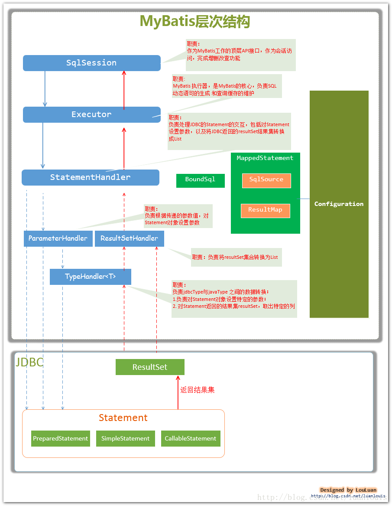
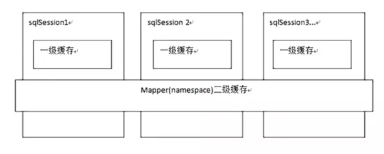
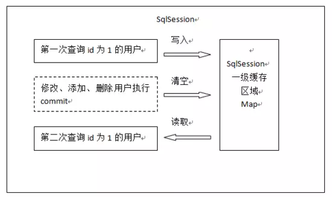
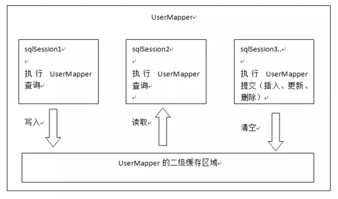
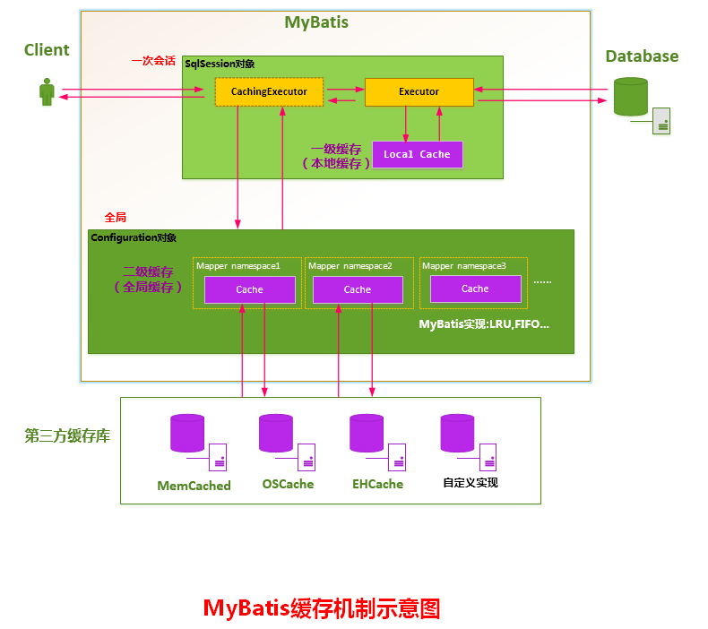

# Mybatis

## 对原生jdbc程序中的问题总结


###  jdbc编程步骤

1. 加载数据库驱动
2. 创建并获取数据库链接
3. 创建jdbc statement对象
4. 设置sql语句
5. 设置sql语句中的参数(使用preparedStatement)
6. 通过statement执行sql并获取结果
7. 对sql执行结果进行解析处理
8. 释放资源(resultSet、preparedstatement、connection)


### 问题总结

1. 数据库连接，使用时就创建，不使用立即释放，对数据库进行频繁连接开启和关闭，造成数据库资源浪费，影响数据库性能。

　　**设想** 使用数据库连接池管理数据库连接。

2. 将sql语句硬编码到java代码中，如果sql语句修改，需要重新编译java代码，不利于系统维护。

　　**设想：** 将sql语句配置在xml配置文件中，即使sql变化，不需要对java代码进行重新编译。

3. 向preparedStatement中设置参数，对占位符号位置和设置参数值，硬编码在java代码中，不利于系统维护。

　　**设想：** 将sql语句及占位符号和参数全部配置在xml中。

4. 从resutSet中遍历结果集数据时，存在硬编码，将获取表的字段进行硬编码，不利于系统维护。

　　**设想：** 将查询的结果集，自动映射成java对象。

### 参考代码

```java
package com.iot.mybatis.jdbc;

//import java.sql.*;
import java.sql.Connection;
import java.sql.DriverManager;
import java.sql.PreparedStatement;
import java.sql.ResultSet;
import java.sql.SQLException;

/**
 * Created by Administrator on 2016/2/21.
 */
public class JdbcTest {
    public static void main(String[] args) {
        //数据库连接
        Connection connection = null;
        //预编译的Statement，使用预编译的Statement提高数据库性能
        PreparedStatement preparedStatement = null;
        //结果集
        ResultSet resultSet = null;

        try {
            //加载数据库驱动
            Class.forName("com.mysql.jdbc.Driver");

            //通过驱动管理类获取数据库链接
            connection =  DriverManager.getConnection("jdbc:mysql://120.25.162.238:3306/mybatis001?characterEncoding=utf-8", "root", "123");
            //定义sql语句 ?表示占位符
            String sql = "select * from user where username = ?";
            //获取预处理statement
            preparedStatement = connection.prepareStatement(sql);
            //设置参数，第一个参数为sql语句中参数的序号（从1开始），第二个参数为设置的参数值
            preparedStatement.setString(1, "王五");
            //向数据库发出sql执行查询，查询出结果集
            resultSet =  preparedStatement.executeQuery();
            //遍历查询结果集
            while(resultSet.next()){
                System.out.println(resultSet.getString("id")+"  "+resultSet.getString("username"));
            }
        } catch (Exception e) {
            e.printStackTrace();
        }finally{
            //释放资源
            if(resultSet!=null){
                try {
                    resultSet.close();
                } catch (SQLException e) {
                    // TODO Auto-generated catch block
                    e.printStackTrace();
                }
            }
            if(preparedStatement!=null){
                try {
                    preparedStatement.close();
                } catch (SQLException e) {
                    // TODO Auto-generated catch block
                    e.printStackTrace();
                }
            }
            if(connection!=null){
                try {
                    connection.close();
                } catch (SQLException e) {
                    // TODO Auto-generated catch block
                    e.printStackTrace();
                }
            }

        }

    }

}
```

## mybatis概述

### mybatis 介绍

mybatis是一个持久层的框架，是apache下的顶级项目。

mybatis托管到goolecode下，再后来托管到github下

```
https://github.com/mybatis/mybatis-3/releases
```

mybatis让程序将主要精力放在sql上，通过mybatis提供的映射方式，自由灵活生成（半自动化，大部分需要程序员编写sql）满足需要sql语句。

mybatis可以将向 preparedStatement中的输入参数自动进行输入映射，将查询结果集灵活映射成java对象。（输出映射）


### 框架原理




### mybatis框架执行过程

1、配置`mybatis`的配置文件，`SqlMapConfig.xml`（名称不固定）

2、通过配置文件，加载`mybatis`运行环境，创建`SqlSessionFactory`会话工厂(SqlSessionFactory`在实际使用时按单例方式)

3、通过SqlSessionFactory创建SqlSession。SqlSession是一个面向用户接口（提供操作数据库方法），实现对象是线程不安全的，建议sqlSession应用场合在方法体内。

4、调用sqlSession的方法去操作数据。如果需要提交事务，需要执行SqlSession的commit()方法。

5、释放资源，关闭SqlSession


### mybatis开发dao的方法

1.原始dao 的方法

- 需要程序员编写dao接口和实现类
- 需要在dao实现类中注入一个SqlSessionFactory工厂

2.mapper代理开发方法（建议使用）

只需要程序员编写mapper接口（就是dao接口）。
程序员在编写mapper.xml(映射文件)和mapper.java需要遵循一个开发规范：

- mapper.xml中namespace就是mapper.java的类全路径。
- mapper.xml中statement的id和mapper.java中方法名一致。
- mapper.xml中statement的parameterType指定输入参数的类型和mapper.java的方法输入参数类型一致
- mapper.xml中statement的resultType指定输出结果的类型和mapper.java的方法返回值类型一致。


SqlMapConfig.xml配置文件：可以配置properties属性、别名、mapper加载。


### 输入映射和输出映射

- 输入映射：
  - parameterType：指定输入参数类型可以简单类型、pojo、hashmap。
  - 对于综合查询，建议parameterType使用包装的pojo，有利于系统扩展。

- 输出映射：
	- resultType：查询到的列名和resultType指定的pojo的属性名一致，才能映射成功。
	- reusltMap：可以通过resultMap 完成一些高级映射。如果查询到的列名和映射的pojo的属性名不一致时，通过resultMap设置列名和属性名之间的对应关系（映射关系）。可以完成映射。
		- 高级映射：
			将关联查询的列映射到一个pojo属性中。（一对一）
			将关联查询的列映射到一个`List<pojo>`中。（一对多）

### 动态sql

- 动态sql：（重点）
   - if判断（掌握）
   - where
   - foreach
   - sql片段（掌握）

## 入门程序一

mybatis入门程序

### 工程结构

在IDEA中新建了一个普通的java项目，新建文件夹lib,加入jar包,工程结构如图。


- log4j.properties

```
# Global logging configuration
log4j.rootLogger=DEBUG, stdout
# Console output...
log4j.appender.stdout=org.apache.log4j.ConsoleAppender
log4j.appender.stdout.layout=org.apache.log4j.PatternLayout
log4j.appender.stdout.layout.ConversionPattern=%5p [%t] - %m%n

```

- SqlMapConfig.xml

```xml
<?xml version="1.0" encoding="UTF-8" ?>
<!DOCTYPE configuration
        PUBLIC "-//mybatis.org//DTD Config 3.0//EN"
        "http://mybatis.org/dtd/mybatis-3-config.dtd">
<configuration>
    <!-- 和spring整合后 environments配置将废除-->
    <environments default="development">
        <environment id="development">
            <!-- 使用jdbc事务管理，事务控制由mybatis-->
            <transactionManager type="JDBC" />
            <!-- 数据库连接池,由mybatis管理-->
            <dataSource type="POOLED">
                <property name="driver" value="com.mysql.jdbc.Driver" />
                <property name="url" value="jdbc:mysql://120.25.162.238:3306/mybatis001?characterEncoding=utf-8" />
                <property name="username" value="root" />
                <property name="password" value="123" />
            </dataSource>
        </environment>
    </environments>

</configuration>
```

### 映射文件

- sqlmap/User.xml

```xml
<?xml version="1.0" encoding="UTF-8" ?>
<!DOCTYPE mapper
        PUBLIC "-//mybatis.org//DTD Mapper 3.0//EN"
        "http://mybatis.org/dtd/mybatis-3-mapper.dtd">
<!-- namespace 命名空间，作用就是对sql进行分类化管理,理解为sql隔离
 注意：使用mapper代理方法开发，namespace有特殊重要的作用
 -->
<mapper namespace="test">
    <!-- 在映射文件中配置很多sql语句 -->
    <!--需求:通过id查询用户表的记录 -->
    <!-- 通过select执行数据库查询
     id:标识映射文件中的sql，称为statement的id
     将sql语句封装到mappedStatement对象中，所以将id称为statement的id
     parameterType:指定输入参数的类型
     #{}标示一个占位符,
     #{value}其中value表示接收输入参数的名称，如果输入参数是简单类型，那么#{}中的值可以任意。

     resultType：指定sql输出结果的映射的java对象类型，select指定resultType表示将单条记录映射成java对象
     -->
    <select id="findUserById" parameterType="int" resultType="com.iot.mybatis.po.User">
        SELECT * FROM  user  WHERE id=#{value}
    </select>

    <!-- 根据用户名称模糊查询用户信息，可能返回多条
	resultType：指定就是单条记录所映射的java对象类型
	${}:表示拼接sql串，将接收到参数的内容不加任何修饰拼接在sql中。
	使用${}拼接sql，引起 sql注入
	${value}：接收输入参数的内容，如果传入类型是简单类型，${}中只能使用value
	 -->
    <select id="findUserByName" parameterType="java.lang.String" resultType="com.iot.mybatis.po.User">
        SELECT * FROM user WHERE username LIKE '%${value}%'
    </select>


</mapper>
```


在sqlMapConfig.xml中加载User.xml

```xml
<!-- 加载映射文件-->
<mappers>
    <mapper resource="sqlmap/User.xml"/>
</mappers>
```

### 程序代码

- po类`User.java`

```java
package com.iot.mybatis.po;

import java.util.Date;

/**
 * Created by Administrator on 2016/2/21.
 */
public class User {
    //属性名要和数据库表的字段对应
    private int id;
    private String username;// 用户姓名
    private String sex;// 性别
    private Date birthday;// 生日
    private String address;// 地址

    public int getId() {
        return id;
    }

    public void setId(int id) {
        this.id = id;
    }

    public String getUsername() {
        return username;
    }

    public void setUsername(String username) {
        this.username = username;
    }

    public String getSex() {
        return sex;
    }

    public void setSex(String sex) {
        this.sex = sex;
    }

    public Date getBirthday() {
        return birthday;
    }

    public void setBirthday(Date birthday) {
        this.birthday = birthday;
    }

    public String getAddress() {
        return address;
    }

    public void setAddress(String address) {
        this.address = address;
    }

    @Override
    public String toString() {
        return "User [id=" + id + ", username=" + username + ", sex=" + sex
                + ", birthday=" + birthday + ", address=" + address + "]";
    }
}
```


- 测试代码

```java
package com.iot.mybatis.first;

import com.iot.mybatis.po.User;
import org.apache.ibatis.io.Resources;
import org.apache.ibatis.session.SqlSession;
import org.apache.ibatis.session.SqlSessionFactory;
import org.apache.ibatis.session.SqlSessionFactoryBuilder;
import org.junit.Test;

import java.io.IOException;
import java.io.InputStream;
import java.util.List;

/**
 * Created by Administrator on 2016/2/23.
 */
public class MybatisFirst {

    //根据id查询用户信息，得到一条记录结果

    @Test
    public void findUserByIdTest() throws IOException{
        // mybatis配置文件
        String resource = "SqlMapConfig.xml";
        // 得到配置文件流
        InputStream inputStream =  Resources.getResourceAsStream(resource);
        //创建会话工厂，传入mybatis配置文件的信息
        SqlSessionFactory sqlSessionFactory = new SqlSessionFactoryBuilder().build(inputStream);

        // 通过工厂得到SqlSession
        SqlSession sqlSession = sqlSessionFactory.openSession();

        // 通过SqlSession操作数据库
        // 第一个参数：映射文件中statement的id，等于=namespace+"."+statement的id
        // 第二个参数：指定和映射文件中所匹配的parameterType类型的参数
        // sqlSession.selectOne结果 是与映射文件中所匹配的resultType类型的对象
        // selectOne查询出一条记录
        User user = sqlSession.selectOne("test.findUserById", 1);

        System.out.println(user);

        // 释放资源
        sqlSession.close();

    }

    // 根据用户名称模糊查询用户列表
    @Test
    public void findUserByNameTest() throws IOException {
        // mybatis配置文件
        String resource = "SqlMapConfig.xml";
        // 得到配置文件流
        InputStream inputStream = Resources.getResourceAsStream(resource);

        // 创建会话工厂，传入mybatis的配置文件信息
        SqlSessionFactory sqlSessionFactory = new SqlSessionFactoryBuilder()
                .build(inputStream);

        // 通过工厂得到SqlSession
        SqlSession sqlSession = sqlSessionFactory.openSession();
        // list中的user和映射文件中resultType所指定的类型一致
        List<User> list = sqlSession.selectList("test.findUserByName", "小明");
        System.out.println(list);
        sqlSession.close();
    }
}
```


输出：

- `findUserByIdTest()`

```
DEBUG [main] - Logging initialized using 'class org.apache.ibatis.logging.slf4j.Slf4jImpl' adapter.
DEBUG [main] - PooledDataSource forcefully closed/removed all connections.
DEBUG [main] - PooledDataSource forcefully closed/removed all connections.
DEBUG [main] - PooledDataSource forcefully closed/removed all connections.
DEBUG [main] - PooledDataSource forcefully closed/removed all connections.
DEBUG [main] - Opening JDBC Connection
DEBUG [main] - Created connection 1857815974.
DEBUG [main] - Setting autocommit to false on JDBC Connection [com.mysql.jdbc.JDBC4Connection@6ebc05a6]
DEBUG [main] - ==>  Preparing: SELECT * FROM user WHERE id=? 
DEBUG [main] - ==> Parameters: 1(Integer)
DEBUG [main] - <==      Total: 1
User [id=1, username=王五, sex=2, birthday=null, address=null]
DEBUG [main] - Resetting autocommit to true on JDBC Connection [com.mysql.jdbc.JDBC4Connection@6ebc05a6]
DEBUG [main] - Closing JDBC Connection [com.mysql.jdbc.JDBC4Connection@6ebc05a6]
DEBUG [main] - Returned connection 1857815974 to pool.
```

- `findUserByNameTest()`

```
DEBUG [main] - Logging initialized using 'class org.apache.ibatis.logging.slf4j.Slf4jImpl' adapter.
DEBUG [main] - PooledDataSource forcefully closed/removed all connections.
DEBUG [main] - PooledDataSource forcefully closed/removed all connections.
DEBUG [main] - PooledDataSource forcefully closed/removed all connections.
DEBUG [main] - PooledDataSource forcefully closed/removed all connections.
DEBUG [main] - Opening JDBC Connection
DEBUG [main] - Created connection 1596467899.
DEBUG [main] - Setting autocommit to false on JDBC Connection [com.mysql.jdbc.JDBC4Connection@5f282abb]
DEBUG [main] - ==>  Preparing: SELECT * FROM user WHERE username LIKE '%小明%' 
DEBUG [main] - ==> Parameters: 
DEBUG [main] - <==      Total: 3
[User [id=16, username=张小明, sex=1, birthday=null, address=河南郑州], User [id=22, username=陈小明, sex=1, birthday=null, address=河南郑州], User [id=25, username=陈小明, sex=1, birthday=null, address=河南郑州]]
DEBUG [main] - Resetting autocommit to true on JDBC Connection [com.mysql.jdbc.JDBC4Connection@5f282abb]
DEBUG [main] - Closing JDBC Connection [com.mysql.jdbc.JDBC4Connection@5f282abb]
DEBUG [main] - Returned connection 1596467899 to pool.
```


### 总结

- `parameterType`

在映射文件中通过parameterType指定输入参数的类型


- `resultType`

在映射文件中通过resultType指定输出结果的类型


- `#{}`和`${}`

`#{}`表示一个占位符号;

`${}`表示一个拼接符号，会引起sql注入，所以不建议使用


- `selectOne`和`selectList`

`selectOne`表示查询一条记录进行映射，使用`selectList`也可以使用，只不过只有一个对象

`selectList`表示查询出一个列表(参数记录)进行映射，不能够使用`selectOne`查，不然会报下面的错:

```
org.apache.ibatis.exceptions.TooManyResultsException: Expected one result (or null) to be returned by selectOne(), but found: 3
```

## 入门程序二


添加、删除、更新用户

### 映射文件

 - User.xml,在入门程序一基础上增加

```xml
    <!-- 添加用户
        parameterType：指定输入 参数类型是pojo（包括 用户信息）
        #{}中指定pojo的属性名，接收到pojo对象的属性值，mybatis通过OGNL获取对象的属性值
        -->
    <insert id="insertUser" parameterType="com.iot.mybatis.po.User">
        <!--
         将插入数据的主键返回，返回到user对象中

         SELECT LAST_INSERT_ID()：得到刚insert进去记录的主键值，只适用与自增主键

         keyProperty：将查询到主键值设置到parameterType指定的对象的哪个属性
         order：SELECT LAST_INSERT_ID()执行顺序，相对于insert语句来说它的执行顺序
         resultType：指定SELECT LAST_INSERT_ID()的结果类型
          -->
        <selectKey keyProperty="id" order="AFTER" resultType="java.lang.Integer">
          SELECT LAST_INSERT_ID()
        </selectKey>
        INSERT INTO user (username,birthday,sex,address)values (#{username},#{birthday},#{sex},#{address})
        <!--
            使用mysql的uuid（）生成主键
            执行过程：
            首先通过uuid()得到主键，将主键设置到user对象的id属性中
            其次在insert执行时，从user对象中取出id属性值
             -->
        <!--  <selectKey keyProperty="id" order="BEFORE" resultType="java.lang.String">
            SELECT uuid()
        </selectKey>
        insert into user(id,username,birthday,sex,address) value(#{id},#{username},#{birthday},#{sex},#{address}) -->

    </insert>

    <!-- 删除 用户
        根据id删除用户，需要输入 id值
         -->
    <delete id="deleteUser" parameterType="java.lang.Integer">
        delete from user where id=#{id}
    </delete>

    <!-- 根据id更新用户
    分析：
    需要传入用户的id
    需要传入用户的更新信息
    parameterType指定user对象，包括 id和更新信息，注意：id必须存在
    #{id}：从输入 user对象中获取id属性值
     -->
    <update id="updateUser" parameterType="com.iot.mybatis.po.User">
        update user set username=#{username},birthday=#{birthday},sex=#{sex},address=#{address}
        where id=#{id}
    </update>

```


(注：这里的`birthday`字段在mysql表中是DATE类型，在User类中`birthday`属性是java的`java.util.Date`类型，并没有进行转换就插入成功了。

看到有的文章说，在字段中有Date和DateTime类型，在插入数据时只要将实体的属性设置成Timestamp就会对应mysql的DateTime类型，Date会对应mysql的Date类型:
`#{modified_date,jdbcType=TIMESTAMP}、#{date,jdbcType=DATE}`

我上面的`birthday`，配置成`#{birthday,jdbcType=TIMESTAMP}`，结果也插入成功了，具体实现待查)

### 程序代码

- User.java,在入门程序一基础上增加三个测试方法

```java
  // 添加用户信息
    @Test
    public void insertUserTest() throws IOException {
        // mybatis配置文件
        String resource = "SqlMapConfig.xml";
        // 得到配置文件流
        InputStream inputStream = Resources.getResourceAsStream(resource);

        // 创建会话工厂，传入mybatis的配置文件信息
        SqlSessionFactory sqlSessionFactory = new SqlSessionFactoryBuilder()
                .build(inputStream);

        // 通过工厂得到SqlSession
        SqlSession sqlSession = sqlSessionFactory.openSession();
        // 插入用户对象
        User user = new User();
        user.setUsername("王小军");
        user.setBirthday(new Date());
        user.setSex("1");
        user.setAddress("河南郑州");

        sqlSession.insert("test.insertUser", user);

        // 提交事务
        sqlSession.commit();

        // 获取用户信息主键
        System.out.println(user.getId());
        // 关闭会话
        sqlSession.close();

    }

    // 根据id删除 用户信息
    @Test
    public void deleteUserTest() throws IOException {
        // mybatis配置文件
        String resource = "SqlMapConfig.xml";
        // 得到配置文件流
        InputStream inputStream = Resources.getResourceAsStream(resource);

        // 创建会话工厂，传入mybatis的配置文件信息
        SqlSessionFactory sqlSessionFactory = new SqlSessionFactoryBuilder()
                .build(inputStream);

        // 通过工厂得到SqlSession
        SqlSession sqlSession = sqlSessionFactory.openSession();

        // 传入id删除 用户
        sqlSession.delete("test.deleteUser", 29);

        // 提交事务
        sqlSession.commit();

        // 关闭会话
        sqlSession.close();

    }

    // 更新用户信息
    @Test
    public void updateUserTest() throws IOException {
        // mybatis配置文件
        String resource = "SqlMapConfig.xml";
        // 得到配置文件流
        InputStream inputStream = Resources.getResourceAsStream(resource);

        // 创建会话工厂，传入mybatis的配置文件信息
        SqlSessionFactory sqlSessionFactory = new SqlSessionFactoryBuilder()
                .build(inputStream);

        // 通过工厂得到SqlSession
        SqlSession sqlSession = sqlSessionFactory.openSession();
        // 更新用户信息

        User user = new User();
        //必须设置id
        user.setId(27);
        user.setUsername("王大军");
        user.setBirthday(new Date());
        user.setSex("2");
        user.setAddress("河南郑州");

        sqlSession.update("test.updateUser", user);

        // 提交事务
        sqlSession.commit();

        // 关闭会话
        sqlSession.close();

    }

```


- 自增主键返回

```xml
<selectKey keyProperty="id" order="AFTER" resultType="java.lang.Integer">
          SELECT LAST_INSERT_ID()
</selectKey>
```

如果没有在上面的配置中配置`resultType`，则会报下面的异常


```
org.apache.ibatis.exceptions.PersistenceException: 
### Error updating database.  Cause: org.apache.ibatis.executor.ExecutorException: A query was run and no Result Maps were found for the Mapped Statement 'test.insertUser!selectKey'.  It's likely that neither a Result Type nor a Result Map was specified.
### The error may exist in sqlmap/User.xml
### The error may involve test.insertUser!selectKey-Inline
### The error occurred while setting parameters
### SQL: SELECT LAST_INSERT_ID()
### Cause: org.apache.ibatis.executor.ExecutorException: A query was run and no Result Maps were found for the Mapped Statement 'test.insertUser!selectKey'.  It's likely that neither a Result Type nor a Result Map was specified.

	...

Caused by: org.apache.ibatis.executor.ExecutorException: A query was run and no Result Maps were found for the Mapped Statement 'test.insertUser!selectKey'.  It's likely that neither a Result Type nor a Result Map was specified.


```


### 总结

#### `#{}`和`${}`

`#{}`表示一个占位符号，`#{}`接收输入参数，类型可以是简单类型，pojo、hashmap。

如果接收简单类型，`#{}`中可以写成value或其它名称。

`#{}`接收pojo对象值，通过OGNL读取对象中的属性值，通过属性.属性.属性...的方式获取对象属性值。

`${}`表示一个拼接符号，会引用sql注入，所以**不建议使用`${}`**。

`${}`接收输入参数，类型可以是简单类型，pojo、hashmap。

如果接收简单类型，`${}`中只能写成value。

`${}`接收pojo对象值，通过OGNL读取对象中的属性值，通过属性.属性.属性...的方式获取对象属性值。

#### mybatis和hibernate本质区别和应用场景

#### hibernate

是一个标准ORM框架（对象关系映射）。入门门槛较高的，不需要程序写sql，sql语句自动生成了。对sql语句进行优化、修改比较困难的。

**应用场景**：适用与需求变化不多的中小型项目，比如：后台管理系统，erp、orm、oa

#### mybatis

专注是sql本身，需要程序员自己编写sql语句，sql修改、优化比较方便。mybatis是一个不完全的ORM框架，虽然程序员自己写sql，mybatis也可以实现映射（输入映射、输出映射）。

应用场景：适用与需求变化较多的项目，比如：互联网项目。

企业进行技术选型，以低成本高回报作为技术选型的原则，根据项目组的技术力量进行选择。

#### 什么是OGNL？

OGNL是Object Graphic Navigation Language(对象图导航语言)的缩写，他是一个开源项目。Struts框架使用OGNL作为默认的表达式语言。

[以下内容来源](https://www.cnblogs.com/cenyu/p/6233942.html)

### OGNL优势

- 支持对象方法调用，如：`×××.doSomeSpecial()`;

- 支持类静态的方法调用和值访问，表达式的格式如下

  ```java
  格式：
  	@[类全名（包括包路径）]@[方法名 |  值名]
  
  例如：
  	@java.lang.String@format('foo %s', 'bar')
  或
      @tutorial.MyConstant@APP_NAME；
  ```

- 支持赋值操作和表达式串联

  ```markdown
  如price=100, discount=0.8,calculatePrice()，这个表达式会返回80
  ```

- 访问OGNL上下文（OGNL context）和ActionContext；

- 操作（创建）集合对象。

OGNL 有一个上下文（Context）概念，说白了上下文就是一个MAP结构，它实现了`java.utils.Map`的接口。

Struts框架默认就支持Ognl表达式语言。(从struts项目必须引入ognl.jar包可以看出)

#### Ognl表达式语言的作用

- jsp页面取值用
- EL表达式语言，也用于页面取值，是jsp页面取值的标准（默认就可以使用）
- Ognl表达式语言，Struts标签默认支持的表达式语言，必须配置Struts标签用，不能离开Struts标签直接使用，就是说Ognl必须在Struts中使用
- 对比来看，EL使用范围更广，项目中不限制使用哪一种，哪一种熟悉就使用哪一种

#### OgnlContext对象（了解）

OgnlContext对象是ognl表达式语言的核心。
但是项目中不会要求写OgnlContext的代码，Ognl标签其实是调用了OgnlContext对象。所以只做了解即可。

OgnlContext对象在源码中实现了Map接口：
`public class OgnlContext implements Map {……}`

Ognl表达式语言取值，也是用java代码取值的，原理就是使用OgnlContext和Ognl这两个类，**只需要记住，Ognl取根元素不用#号，取非根元素要使用#号**：

**OgnlContext类**
硬编码方式，了解OgnlContext对象，因为OgnlContext对象实现是Map接口，所有OgnlContext本质就是一个Map，可以使用map方法：

```java
OgnlContext context = new OgnlContext();
context.put("uesr",user);
context.put("address",address);
context.setRoot(address);
```

**Ognl类**
Ognl类也是Ognl底层运行的代码，常用的api如下：

```java
// 解析ognl表达式
Object obj1 = Ognl.parseExpression(“country”);
// 获取ognl的表达式值,obj1是上面一个api，其他两个分别是创建的上下文对象以及一个不用修改的参数
Ognl.getValue(obj1, context, context.getRoot()); 
// 方法调用
Object obj2 = Ognl.parseExpression(“language.toUpperCase()”);
// 等同于上面
Object obj3 = Ognl.parseExpression("@java.lang.Integer@toBinaryString(10)");
// Math类的方法直接调用,静态方法的调用
Object obj4 = Ognl.parseExpression(“@@min(10,4)”);
```

代码示例如下：

```java
/**
 * OgnlContext用法
 * 1.使用Ognl表达式语言取值，如果取非根元素的值，必须用#号
 * 2.使用Ognl表达式语言取值，如果取根元素的值，不用#号
 * 3.Ognl可以调用静态方法
 */
public class OgnlDemo {

    //非根元素
    @Test
    public void testOgnl1() throws OgnlException {
        //创建一个Ognl上下文对象
        OgnlContext context = new OgnlContext();

        /**
         * 1.OgnlContext放入基本变量数据
         */
        //放入数据
        context.put("cn","China");
        //获取数据（map）
        String value = (String)context.get("cn");

        System.out.println(value);

        /**
         * 2.OgnlContext放入对象数据
         */
        //创建对象，设置对象属性
        User user = new User();
        user.setId(100);
        user.setName("Jack");
        //【往非根元素放入数据，取值的时候表达式要用“#”】
        context.put("user",user);
        //获取对象属性
        //使用这种方式也可以获取
        Object s = context.get("user");
        System.out.println(s);


        //使用Ognl表达式来获取
        //举例：例如标签<s:a value="#user.id">取值，实际上就是运行了下面的代码获取的
        //先构建一个Ognl表达式，再解析表达式
        Object ognl = Ognl.parseExpression("#user.id");//构建Ognl表达式
        Object value1 = Ognl.getValue(ognl, context, context.getRoot());//解析表达式
        System.out.println(value1);


        User user1 = new User();
        user1.setId(100);
        user1.setName("Jack");
        context.setRoot(user1);
        Object ognl1 = Ognl.parseExpression("id");//构建Ognl表达式
        Object value2 = Ognl.getValue(ognl1, context, context.getRoot());//解析表达式
        System.out.println(value2);

    }


    //根元素，
    @Test
    public void testOgnl2() throws OgnlException {
        OgnlContext context = new OgnlContext();

        User user1 = new User();
        user1.setId(100);
        user1.setName("Jack");
        context.setRoot(user1);
        //根元素直接使用id,不需要加#号
        Object ognl1 = Ognl.parseExpression("id");//构建Ognl表达式
        Object value2 = Ognl.getValue(ognl1, context, context.getRoot());//解析表达式
        System.out.println(value2);

    }

    //ognl对静态方法调用的支持
    @Test
    public void testOgnl3() throws Exception{
        //创建一个Ognl上下文对象
        OgnlContext context = new OgnlContext();

        // Ognl表达式语言，调用类的静态方法
		// Object ognl = Ognl.parseExpression("@Math@floor(10.9)");
        // 由于Math类在开发中比较常用，所有也可以这样写
        Object ognl = Ognl.parseExpression("@@floor(10.9)");
        Object value = Ognl.getValue(ognl, context, context.getRoot());
        System.out.println(value);
    }
}
```

#### ValueStack对象

**1.ValueStack即值栈对象**
ValueStack实际是一个接口，在Struts2中利用Ognl时，实际上使用的是实现了该接口的OgnlValueStack类，这个类是Struts2利用Ognl的基础

**2.ValueStack特点**
ValueStack贯穿整个Action的生命周期（每个Action类的对象实例都拥有一个ValueStack对象），即用户每次访问struts的action，都会创建一个Action对象、值栈对象、ActionContext对象，然后把Action对象放入值栈中；最后再把值栈对象放入request中，传入jsp页面。相当于**一个数据的中转站**，在其中保存当前Action对象和其他相关对象。**Struts2框架把ValueStack对象保存在名为“struts。valueStack”的request请求属性中。**

**3.ValueStack存储对象**

代码调试的时候，发现有一个root是compundRoot类，继承ArrayList，保存的是action对象；还有一个OgnlContext是继承Map，保存数据。
所以ValueStack存储对象时是分两个地方来存的，也即ValueStack对象的组成是由List栈和Map栈构成的：
`ObjectStack`：Struts把根元素，即action对象及全局属性存入ObjectStack中---List

> list栈主要存储：action对象，Map对象（通过vs.set()设置），通过push方法设置的对象，以及其他代理对象

根元素的存储示例：

```java
 //存储值栈对象
ActionContext ac = ActionContext.getContext();

ValueStack vs = ac.getValueStack();
vs.set("user1",new User(100,"Jack1"));//Map
vs.push(new User(100,"Jack2"));//栈顶
```

`ContextMap`：Struts把各种各样的映射关系（域数据）存入`ContextMap`中

**Struts会把下面这些映射存入ContextMap中：**

- parameter：该Map中包含当前请求的请求参数
- request：该Map中包含当前request对象中的所有属性
- Session：该Map中包含当前Session对象中的所有属性
- application：该Map中包含当前application对象中的所有属性
- attr：该Map按如下顺序来检索某个属性：request，Session，application
  非根元素Map中存放数据的方法示例：

```java
 //存储值栈对象
ActionContext ac = ActionContext.getContext();

//映射数据
ac.getContextMap().put("request_data", "request_data");
ac.getSession().put("session_data", "session_data");
ac.getApplication().put("application_data","application_data");
```

从栈中取值的两种方式：

```java
//获取值栈对象的两种方式，是等价的
public void getVs() {
    //1.获取值栈对象
    HttpServletRequest request = ServletActionContext.getRequest();
    ValueStack vs1 = (ValueStack) request.getAttribute("struts.valueStack");

    /**************************************************/
    //2.获取值栈对象
    ActionContext ac = ActionContext.getContext();
    ValueStack vs2 = ac.getValueStack();

    System.out.println(vs1==vs2);//true
}
```

在jsp页面中，对不同ValueStack中的不同类型取值方法不同，
如果是根元素取值，直接写表达式；
非根元素(request，Session，application，att，parmeters)必须用#号，例#request.cn

#### JSP页面中获取ValueStack数据

```jsp
<%@taglib prefix="s" uri="/struts-tags" %>
<%@ page contentType="text/html;charset=UTF-8" language="java" %>
<html>
  <head>
    <title>jsp页面取值</title>
  </head>
  <body>
index页面
<%--页面，必须要拿到ValueStack--%>
<%--struts的调试标签，可以观测值栈数据--%>
<s:debug/>
<br/>1.取根元素的值<br/>
  <s:property value="user.id"/>
  <s:property value="user.name"/>

<br/>2.取非根元素<br/>
  <s:property value="#request.cn"/>
  <s:property value="#request.request_data"/>
  <s:property value="#session.session_data"/>
  <s:property value="#application.application_data"/><br/>

<%--attr按顺序自动找request/session/application,找到后立刻返回--%>
  <s:property value="#attr.application_data"/>
<%--获取请求参数数据--%>
  <s:property value="#parameters.userName"/>
  </body>
</html>
```

## 开发dao方法


本文讲解SqlSession，并对两种方法(原始dao开发和mapper代理开发)分别做简单展示


### SqlSession使用范围

- SqlSessionFactoryBuilder

通过`SqlSessionFactoryBuilder`创建会话工厂`SqlSessionFactory`将`SqlSessionFactoryBuilder`当成一个工具类使用即可，不需要使用单例管理`SqlSessionFactoryBuilder`。在需要创建`SqlSessionFactory`时候，只需要new一次`SqlSessionFactoryBuilder`即可。


- `SqlSessionFactory`

通过`SqlSessionFactory`创建`SqlSession`，使用单例模式管理`sqlSessionFactory`（工厂一旦创建，使用一个实例）。将来mybatis和spring整合后，使用单例模式管理`sqlSessionFactory`。


- `SqlSession`

`SqlSession`是一个面向用户（程序员）的接口。SqlSession中提供了很多操作数据库的方法：如：`selectOne`(返回单个对象)、`selectList`（返回单个或多个对象）。

`SqlSession`是线程不安全的，在`SqlSesion`实现类中除了有接口中的方法（操作数据库的方法）还有数据域属性。

`SqlSession`最佳应用场合在方法体内，定义成局部变量使用。s


### 原始dao开发方法

程序员需要写dao接口和dao实现类

需要向dao实现类中注入SqlSessionFactory，在方法体内通过SqlSessionFactory创建SqlSession

#### dao接口

```java
public interface UserDao {
    //根据id查询用户信息
    public User findUserById(int id) throws Exception;

    //根据用户名列查询用户列表
    public List<User> findUserByName(String name) throws Exception;

    //添加用户信息
    public void insertUser(User user) throws Exception;

    //删除用户信息
    public void deleteUser(int id) throws Exception;
}
```

#### dao接口实现类

```java
package com.iot.mybatis.dao;

import com.iot.mybatis.po.User;
import org.apache.ibatis.session.SqlSession;
import org.apache.ibatis.session.SqlSessionFactory;

import java.util.List;

/**
 * Created by Brian on 2016/2/24.
 */
public class UserDaoImpl implements UserDao{
    // 需要向dao实现类中注入SqlSessionFactory
    // 这里通过构造方法注入
    private SqlSessionFactory sqlSessionFactory;

    public UserDaoImpl(SqlSessionFactory sqlSessionFactory){
        this.sqlSessionFactory = sqlSessionFactory;
    }


    @Override
    public User findUserById(int id) throws Exception {
        SqlSession sqlSession = sqlSessionFactory.openSession(); // 线程不安全，写在方法体内
        User user = sqlSession.selectOne("test.findUserById",id);
        //释放资源
        sqlSession.close();
        return user;
    }

    @Override
    public List<User> findUserByName(String name) throws Exception {
        SqlSession sqlSession = sqlSessionFactory.openSession();
        List<User> list = sqlSession.selectList("test.findUserByName", name);
        // 释放资源
        sqlSession.close();
        return list;
    }

    @Override
    public void insertUser(User user) throws Exception {
        SqlSession sqlSession = sqlSessionFactory.openSession();
        //执行插入操作
        sqlSession.insert("test.insertUser", user);
        // 提交事务
        sqlSession.commit();
        // 释放资源
        sqlSession.close();
    }

    @Override
    public void deleteUser(int id) throws Exception {
        SqlSession sqlSession = sqlSessionFactory.openSession();
        //执行插入操作
        sqlSession.delete("test.deleteUser", id);
        // 提交事务
        sqlSession.commit();
        // 释放资源
        sqlSession.close();
    }
}
```

#### 测试代码

```java
package com.iot.mybatis.dao;

import java.io.InputStream;

import com.iot.mybatis.po.User;
import org.apache.ibatis.io.Resources;
import org.apache.ibatis.session.SqlSessionFactory;
import org.apache.ibatis.session.SqlSessionFactoryBuilder;
import org.junit.Before;
import org.junit.Test;


public class UserDaoImplTest {

	private SqlSessionFactory sqlSessionFactory;

	// 此方法是在执行testFindUserById之前执行
	@Before
	public void setUp() throws Exception {
		// 创建sqlSessionFactory

		// mybatis配置文件
		String resource = "SqlMapConfig.xml";
		// 得到配置文件流
		InputStream inputStream = Resources.getResourceAsStream(resource);

		// 创建会话工厂，传入mybatis的配置文件信息
		sqlSessionFactory = new SqlSessionFactoryBuilder()
				.build(inputStream);
	}

	@Test
	public void testFindUserById() throws Exception {
		// 创建UserDao的对象
		UserDao userDao = new UserDaoImpl(sqlSessionFactory);

		// 调用UserDao的方法
		User user = userDao.findUserById(1);
		
		System.out.println(user);
	}

}
```

#### 总结原始dao开发问题

1. dao接口实现类方法中存在大量模板方法，设想能否将这些代码提取出来，大大减轻程序员的工作量。
2. 调用sqlsession方法时将statement的id硬编码了
3. 调用sqlsession方法时传入的变量，由于sqlsession方法使用泛型，即使变量类型传入错误，在编译阶段也不报错，不利于程序员开发。


### mapper代理方法

程序员只需要mapper接口（相当 于dao接口）

程序员还需要编写mapper.xml映射文件

程序员编写mapper接口需要遵循一些开发规范，mybatis可以自动生成mapper接口实现类代理对象。

#### 开发规范

- 在mapper.xml中namespace等于mapper接口地址

```xml
<!--
 namespace 命名空间，作用就是对sql进行分类化管理,理解为sql隔离
 注意：使用mapper代理方法开发，namespace有特殊重要的作用,namespace等于mapper接口地址
 -->
<mapper namespace="com.iot.mybatis.mapper.UserMapper">
```

- mapper.java接口中的方法名和mapper.xml中statement的id一致

- mapper.java接口中的方法输入参数类型和mapper.xml中statement的parameterType指定的类型一致。

- mapper.java接口中的方法返回值类型和mapper.xml中statement的resultType指定的类型一致。

```xml
<select id="findUserById" parameterType="int" resultType="com.iot.mybatis.po.User">
    SELECT * FROM  user  WHERE id=#{value}
</select>
```

```java
//根据id查询用户信息
public User findUserById(int id) throws Exception;
```

总结：以上开发规范主要是对下边的代码进行统一生成：

```java
User user = sqlSession.selectOne("test.findUserById", id);
sqlSession.insert("test.insertUser", user);
```

#### 代码

- mapper.xml

```xml
<?xml version="1.0" encoding="UTF-8" ?>
<!DOCTYPE mapper
        PUBLIC "-//mybatis.org//DTD Mapper 3.0//EN"
        "http://mybatis.org/dtd/mybatis-3-mapper.dtd">
<!--
 namespace 命名空间，作用就是对sql进行分类化管理,理解为sql隔离
 注意：使用mapper代理方法开发，namespace有特殊重要的作用
 -->
<mapper namespace="com.iot.mybatis.mapper.UserMapper">
 <!-- 在映射文件中配置很多sql语句 -->
    <!--需求:通过id查询用户表的记录 -->
    <!-- 通过select执行数据库查询
     id:标识映射文件中的sql，称为statement的id
     将sql语句封装到mappedStatement对象中，所以将id称为statement的id
     parameterType:指定输入参数的类型
     #{}标示一个占位符,
     #{value}其中value表示接收输入参数的名称，如果输入参数是简单类型，那么#{}中的值可以任意。

     resultType：指定sql输出结果的映射的java对象类型，select指定resultType表示将单条记录映射成java对象
     -->
    <select id="findUserById" parameterType="int" resultType="com.iot.mybatis.po.User">
        SELECT * FROM  user  WHERE id=#{value}
    </select>

    <!-- 根据用户名称模糊查询用户信息，可能返回多条
	resultType：指定就是单条记录所映射的java对象类型
	${}:表示拼接sql串，将接收到参数的内容不加任何修饰拼接在sql中。
	使用${}拼接sql，引起 sql注入
	${value}：接收输入参数的内容，如果传入类型是简单类型，${}中只能使用value
	 -->
    <select id="findUserByName" parameterType="java.lang.String" resultType="com.iot.mybatis.po.User">
        SELECT * FROM user WHERE username LIKE '%${value}%'
    </select>


    <!-- 添加用户
        parameterType：指定输入 参数类型是pojo（包括 用户信息）
        #{}中指定pojo的属性名，接收到pojo对象的属性值，mybatis通过OGNL获取对象的属性值
        -->
    <insert id="insertUser" parameterType="com.iot.mybatis.po.User">
        <!--
         将插入数据的主键返回，返回到user对象中

         SELECT LAST_INSERT_ID()：得到刚insert进去记录的主键值，只适用与自增主键

         keyProperty：将查询到主键值设置到parameterType指定的对象的哪个属性
         order：SELECT LAST_INSERT_ID()执行顺序，相对于insert语句来说它的执行顺序
         resultType：指定SELECT LAST_INSERT_ID()的结果类型
          -->
        <selectKey keyProperty="id" order="AFTER" resultType="java.lang.Integer">
          SELECT LAST_INSERT_ID()
        </selectKey>
        INSERT INTO user (username,birthday,sex,address)values (#{username},#{birthday},#{sex},#{address})
        <!--
            使用mysql的uuid（）生成主键
            执行过程：
            首先通过uuid()得到主键，将主键设置到user对象的id属性中
            其次在insert执行时，从user对象中取出id属性值
             -->
        <!--  <selectKey keyProperty="id" order="BEFORE" resultType="java.lang.String">
            SELECT uuid()
        </selectKey>
        insert into user(id,username,birthday,sex,address) value(#{id},#{username},#{birthday},#{sex},#{address}) -->

    </insert>

    <!-- 删除 用户
        根据id删除用户，需要输入 id值
         -->
    <delete id="deleteUser" parameterType="java.lang.Integer">
        delete from user where id=#{id}
    </delete>

    <!-- 根据id更新用户
    分析：
    需要传入用户的id
    需要传入用户的更新信息
    parameterType指定user对象，包括 id和更新信息，注意：id必须存在
    #{id}：从输入 user对象中获取id属性值
     -->
    <update id="updateUser" parameterType="com.iot.mybatis.po.User">
        update user set username=#{username},birthday=#{birthday},sex=#{sex},address=#{address}
        where id=#{id}
    </update>
    
</mapper>
```

- 在SqlMapConfig.xml中加载映射文件

```xml
<mappers>  
    <mapper resource="mapper/UserMapper.xml"/>  
</mappers>  

```

- UserMapper.java

```java
public interface UserMapper {
    //根据id查询用户信息
    public User findUserById(int id) throws Exception;

    //根据用户名列查询用户列表
    public List<User> findUserByName(String name) throws Exception;

    //添加用户信息
    public void insertUser(User user) throws Exception;

    //删除用户信息
    public void deleteUser(int id) throws Exception;

    //更新用户
    public void updateUser(User user)throws Exception;
}

```


- UserMapperTest/java

```java
public class UserMapperTest {  
  
    private SqlSessionFactory sqlSessionFactory;  
      
    //注解Before是在执行本类所有测试方法之前先调用这个方法  
    @Before  
    public void setup() throws Exception{  
        //创建SqlSessionFactory  
        String resource="SqlMapConfig.xml";  
          
        //将配置文件加载成流  
        InputStream inputStream = Resources.getResourceAsStream(resource);  
        //创建会话工厂，传入mybatis配置文件的信息  
        sqlSessionFactory=new SqlSessionFactoryBuilder().build(inputStream);  
    }  
      
    @Test  
    public void testFindUserById() throws Exception{  
          
        SqlSession sqlSession=sqlSessionFactory.openSession();  
          
        //创建UserMapper代理对象  
        UserMapper userMapper=sqlSession.getMapper(UserMapper.class);  
          
        //调用userMapper的方法  
        User user=userMapper.findUserById(1);  
          
        System.out.println(user.getUsername());  
    }  
}  
```


#### 一些问题总结

- 代理对象内部调用`selectOne`或`selectList`
  - 如果mapper方法返回单个pojo对象（非集合对象），代理对象内部通过selectOne查询数据库。
  - 如果mapper方法返回集合对象，代理对象内部通过selectList查询数据库。


- mapper接口方法参数只能有一个是否影响系统开发

mapper接口方法参数只能有一个，系统是否不利于扩展维护?系统框架中，dao层的代码是被业务层公用的。即使mapper接口只有一个参数，可以使用包装类型的pojo满足不同的业务方法的需求。

注意：持久层方法的参数可以包装类型、map...等，service方法中建议不要使用包装类型（不利于业务层的可扩展）。

## 配置文件

本文主要讲解SqlMapConfig配置文件

> 参考[mybatis – MyBatis 3 |Configuration](http://www.mybatis.org/mybatis-3/configuration.html)

SqlMapConfig.xml中配置的内容和顺序如下

- properties（属性）
- settings（全局配置参数）
- **typeAliases（类型别名）**
- typeHandlers（类型处理器）
- *objectFactory（对象工厂）*
- *plugins（插件）*
- environments（环境集合属性对象）
  - environment（环境子属性对象）
    - transactionManager（事务管理）
    - dataSource（数据源）
- **mappers（映射器）**

(注：粗体是重点，斜体不常用)


### properties(属性)

将数据库连接参数单独配置在db.properties中，只需要在SqlMapConfig.xml中加载db.properties的属性值。在SqlMapConfig.xml中就不需要对数据库连接参数硬编码。

将数据库连接参数只配置在db.properties中。原因：方便对参数进行统一管理，其它xml可以引用该db.properties。

```properties
jdbc.driver=com.mysql.jdbc.Driver
jdbc.url=jdbc:mysql://120.25.162.238:3306/mybatis001?characterEncoding=utf-8
jdbc.username=root
jdbc.password=123
```

在sqlMapConfig.xml加载属性文件：

```xml
<properties resource="db.properties">
        <!-- properties中还可以配置一些属性名和属性值  -->
        <!-- <property name="jdbc.driver" value=""/> -->
</properties>

<!-- 和spring整合后 environments配置将废除-->
<environments default="development">
    <environment id="development">
        <!-- 使用jdbc事务管理，事务控制由mybatis-->
        <transactionManager type="JDBC" />
        <!-- 数据库连接池,由mybatis管理-->
        <dataSource type="POOLED">
            <property name="driver" value="${jdbc.driver}" />
            <property name="url" value="${jdbc.url}" />
            <property name="username" value="${jdbc.username}" />
            <property name="password" value="${jdbc.password}" />
        </dataSource>
    </environment>
</environments>
```

注意： MyBatis 将按照下面的顺序(优先级)来加载属性：

- 在`properties`元素体内定义的属性首先被读取。 
- 然后会读取`properties`元素中resource或url加载的属性，它会覆盖已读取的同名属性。 
- 最后读取`parameterType`传递的属性，它会覆盖已读取的同名属性。

建议：

- 不要在`properties`元素体内添加任何属性值，只将属性值定义在properties文件中。
- 在properties文件中定义属性名要有一定的特殊性，如：`XXXXX.XXXXX.XXXX`

### settings(全局参数配置)

mybatis框架在运行时可以调整一些运行参数,比如：开启二级缓存、开启延迟加载...

全局参数将会影响mybatis的运行行为。具体参考官网：

> [mybatis-settings](http://www.mybatis.org/mybatis-3/configuration.html#settings)


### typeAliases(类型别名)

在mapper.xml中，定义很多的statement，statement需要`parameterType`指定输入参数的类型、需要`resultType`指定输出结果的映射类型。

如果在指定类型时输入类型全路径，不方便进行开发，可以针对`parameterType`或`resultType`指定的类型定义一些别名，在mapper.xml中通过别名定义，方便开发。


- mybatis默认支持别名

> 参考 [typeAliases](http://www.mybatis.org/mybatis-3/configuration.html#typeAliases)


| 别名       | 映射的类型 |
| :--------- | :--------- |
| _byte      | byte       |
| _long      | long       |
| _short     | short      |
| _int       | int        |
| _integer   | int        |
| _double    | double     |
| _float     | float      |
| _boolean   | boolean    |
| string     | String     |
| byte       | Byte       |
| long       | Long       |
| short      | Short      |
| int        | Integer    |
| integer    | Integer    |
| double     | Double     |
| float      | Float      |
| boolean    | Boolean    |
| date       | Date       |
| decimal    | BigDecimal |
| bigdecimal | BigDecimal |


- 自定义别名
  -	单个别名定义 
    批量定义别名（常用）

```xml
## SqlMapConfig.xml文件
<!-- 别名定义 -->
<typeAliases>

    <!-- 针对单个别名定义
    type：类型的路径
    alias：别名
     -->
    <!-- <typeAlias type="cn.itcast.mybatis.po.User" alias="user"/> -->
    <!-- 批量别名定义
    指定包名，mybatis自动扫描包中的po类，自动定义别名，别名就是类名（首字母大写或小写都可以）
    -->
    <package name="com.iot.mybatis.po"/>

</typeAliases>
```

### typeHandlers(类型处理器)

mybatis中通过typeHandlers完成jdbc类型和java类型的转换。例如：

```xml
<select id="findUserById" parameterType="int" resultType="user">
		select * from user where id = #{id}
</select>
```

mybatis自带的类型处理器基本上满足日常需求，不需要单独定义。

mybatis支持类型处理器

>  参考 [typeHandlers](http://www.mybatis.org/mybatis-3/configuration.html#typeHandlers)

| 类型处理器              | Java类型              | JDBC类型                                                 |
| :---------------------- | :-------------------- | :------------------------------------------------------- |
| BooleanTypeHandler      | Boolean，boolean      | 任何兼容的布尔值                                         |
| ByteTypeHandler         | Byte，byte            | 任何兼容的数字或字节类型                                 |
| ShortTypeHandler        | Short，short          | 任何兼容的数字或短整型                                   |
| IntegerTypeHandler      | Integer，int          | 任何兼容的数字和整型                                     |
| LongTypeHandler         | Long，long            | 任何兼容的数字或长整型                                   |
| FloatTypeHandler        | Float，float          | 任何兼容的数字或单精度浮点型                             |
| DoubleTypeHandler       | Double，double        | 任何兼容的数字或双精度浮点型                             |
| BigDecimalTypeHandler   | BigDecimal            | 任何兼容的数字或十进制小数类型                           |
| StringTypeHandler       | String                | CHAR和VARCHAR类型                                        |
| ClobTypeHandler         | String                | CLOB和LONGVARCHAR类型                                    |
| NStringTypeHandler      | String                | NVARCHAR和NCHAR类型                                      |
| NClobTypeHandler        | String                | NCLOB类型                                                |
| ByteArrayTypeHandler    | byte[]                | 任何兼容的字节流类型                                     |
| BlobTypeHandler         | byte[]                | BLOB和LONGVARBINARY类型                                  |
| DateTypeHandler         | Date（java.util）     | TIMESTAMP类型                                            |
| DateOnlyTypeHandler     | Date（java.util）     | DATE类型                                                 |
| TimeOnlyTypeHandler     | Date（java.util）     | TIME类型                                                 |
| SqlTimestampTypeHandler | Timestamp（java.sql） | TIMESTAMP类型                                            |
| SqlDateTypeHandler      | Date（java.sql）      | DATE类型                                                 |
| SqlTimeTypeHandler      | Time（java.sql）      | TIME类型                                                 |
| ObjectTypeHandler       | 任意                  | 其他或未指定类型                                         |
| EnumTypeHandler         | Enumeration类型       | VARCHAR-任何兼容的字符串类型，作为代码存储（而不是索引） |

### mappers(映射配置)

- 通过resource加载单个映射文件

```xml
<!--通过resource方法一次加载一个映射文件 -->
<mapper resource="mapper/UserMapper.xml"/>
```

- 通过mapper接口加载单个mapper

```xml
 <!-- 通过mapper接口加载单个 映射文件
        遵循一些规范：需要将mapper接口类名和mapper.xml映射文件名称保持一致，且在一个目录中
        上边规范的前提是：使用的是mapper代理方法
         -->
<mapper class="com.iot.mybatis.mapper.UserMapper"/> 
```

目录示例

```
com.iot.mybatis.mapper------------------package包
           |----UserMapper.java
           |----UserMapper.xml
              
```

- 批量加载mapper(推荐使用)

```xml
<!-- 批量加载mapper
		指定mapper接口的包名，mybatis自动扫描包下边所有mapper接口进行加载
		遵循一些规范：需要将mapper接口类名和mapper.xml映射文件名称保持一致，且在一个目录 中
		上边规范的前提是：使用的是mapper代理方法
		 -->
<package name="com.iot.mybatis.mapper"/>
```

## 输入映射

本文主要讲解mybatis的输入映射。


通过parameterType指定输入参数的类型，类型可以是

- 简单类型
- hashmap
- pojo的包装类型

### 传递pojo的包装对象

需求：完成用户信息的综合查询，需要传入查询条件很复杂（可能包括用户信息、其它信息，比如商品、订单的）

针对上边需求，建议使用自定义的包装类型的pojo。

在包装类型的pojo中将复杂的查询条件包装进去。	

```java
package com.iot.mybatis.po;

/**
 * Created by Brian on 2016/2/24.
 */
public class UserQueryVo {

    //在这里包装所需要的查询条件

    //用户查询条件
    private UserCustom userCustom;

    public UserCustom getUserCustom() {
        return userCustom;
    }

    public void setUserCustom(UserCustom userCustom) {
        this.userCustom = userCustom;
    }

    //可以包装其它的查询条件，订单、商品
    //....

}
```

其中，UserCustom类继承User

```java
public class UserCustom extends User{
}
```

- mapper.xml

在UserMapper.xml中定义用户信息综合查询（查询条件复杂，通过高级查询进行复杂关联查询）。

```xml
    <!-- 用户信息综合查询
        #{userCustom.sex}:取出pojo包装对象中性别值
        ${userCustom.username}：取出pojo包装对象中用户名称
     -->
    <select id="findUserList" parameterType="com.iot.mybatis.po.UserQueryVo"
            resultType="com.iot.mybatis.po.UserCustom">
        SELECT * FROM user WHERE user.sex=#{userCustom.sex} AND user.username LIKE '%${userCustom.username}%'
    </select>
```

注意不要将`#{userCustom.sex}`中的`userCustom`写成`UserCustom`,前者指属性名(由于使用IDE提示自动补全，所以只是把类型名首字母小写了)，后者指类型名，这里是`UserQueryVo`类中的`userCustom`属性，是**属性名**。写错会报如下异常：

```
org.apache.ibatis.exceptions.PersistenceException: 
### Error querying database.  Cause: org.apache.ibatis.reflection.ReflectionException: There is no getter for property named 'UserCustom' in 'class com.iot.mybatis.po.UserQueryVo'
### Cause: org.apache.ibatis.reflection.ReflectionException: There is no getter for property named 'UserCustom' in 'class com.iot.mybatis.po.UserQueryVo'
```

- mapper.java

```java
//用户信息综合查询
public List<UserCustom> findUserList(UserQueryVo userQueryVo) throws Exception;
```

- 测试代码

```java
//用户信息的综合 查询
@Test
public void testFindUserList() throws Exception {
    SqlSession sqlSession = sqlSessionFactory.openSession();
    //创建UserMapper对象，mybatis自动生成mapper代理对象
    UserMapper userMapper  sqlSession.getMapper(UserMapper.class);
    //创建包装对象，设置查询条件
    UserQueryVo userQueryVo = new UserQueryVo();
    UserCustom userCustom = new UserCustom();
    //由于这里使用动态sql，如果不设置某个值，条件不会拼接在sql中
    userCustom.setSex("1");
    userCustom.setUsername("张三");
    userQueryVo.setUserCustom(userCustom);
    //调用userMapper的方法
    List<UserCustom> list = userMapper.findUserList(userQueryVo);
    System.out.println(list);
}
```

## 输出映射

本文主要讲解mybatis的输出映射。


输出映射有两种方式

- `resultType`
- `resultMap`


### resultType

- 使用 `resultType` 进行输出映射，只有查询出来的列名和 pojo 中的属性名一致，该列才可以映射成功。
- 如果查询出来的列名和 pojo 中的属性名全部不一致，没有创建 pojo 对象。
- 只要查询出来的列名和 pojo 中的属性有一个一致，就会创建 pojo 对象。

#### 输出简单类型

需求：用户信息的综合查询列表总数，通过查询总数和上边用户综合查询列表才可以实现分页。


- mapper.xml

```xml
 <!-- 用户信息综合查询总数
        parameterType：指定输入类型和findUserList一样
        resultType：输出结果类型
    -->
    <select id="findUserCount" parameterType="com.iot.mybatis.po.UserQueryVo" resultType="int">
        SELECT count(*) FROM user WHERE user.sex=#{userCustom.sex} AND user.username LIKE '%${userCustom.username}%'
    </select>
```

- mapper.java

```java
//用户信息综合查询总数
@Test
public void testFindUserCount() throws Exception {

    SqlSession sqlSession = sqlSessionFactory.openSession();

    //创建UserMapper对象，mybatis自动生成mapper代理对象
    UserMapper userMapper = sqlSession.getMapper(UserMapper.class);

    //创建包装对象，设置查询条件
    UserQueryVo userQueryVo = new UserQueryVo();
    UserCustom userCustom = new UserCustom();
    //由于这里使用动态sql，如果不设置某个值，条件不会拼接在sql中
    userCustom.setSex("1");
    userCustom.setUsername("小");
    userQueryVo.setUserCustom(userCustom);
    //调用userMapper的方法
    int count = userMapper.findUserCount(userQueryVo);
    System.out.println(count);
}
```


- 小结

查询出来的结果集只有一行且一列，可以使用简单类型进行输出映射。


####	输出pojo对象和pojo列表

不管是输出的pojo单个对象还是一个列表（list中包括pojo），在mapper.xml中 `resultType` 指定的类型是一样的。

在mapper.java指定的方法返回值类型不一样：

- 输出单个pojo对象，方法返回值是单个对象类型

```java
//根据id查询用户信息
public User findUserById(int id) throws Exception;
```

- 输出pojo对象list，方法返回值是`List<Pojo>`

```java
//根据用户名列查询用户列表
public List<User> findUserByName(String name) throws Exception;
```


生成的动态代理对象中是根据mapper方法的返回值类型确定是调用`selectOne`(返回单个对象调用)还是`selectList` （返回集合对象调用 ）

### resultMap

mybatis中使用resultMap完成高级输出结果映射。(一对多，多对多)


####	resultMap使用方法 

如果查询出来的列名和pojo的属性名不一致，通过定义一个resultMap对列名和pojo属性名之间作一个映射关系。

1.定义resultMap

2.使用resultMap作为statement的输出映射类型

- 定义reusltMap

```xml
<!-- 定义resultMap
	将SELECT id id_,username username_ FROM USER 和User类中的属性作一个映射关系
	
	type：resultMap最终映射的java对象类型,可以使用别名
	id：对resultMap的唯一标识
	 -->
	 <resultMap type="user" id="userResultMap">
	 	<!-- id表示查询结果集中唯一标识 
	 	column：查询出来的列名
	 	property：type指定的pojo类型中的属性名
	 	最终resultMap对column和property作一个映射关系 （对应关系）
	 	-->
	 	<id column="id_" property="id"/>
	 	<!-- 
	 	result：对普通名映射定义
	 	column：查询出来的列名
	 	property：type指定的pojo类型中的属性名
	 	最终resultMap对column和property作一个映射关系 （对应关系）
	 	 -->
	 	<result column="username_" property="username"/>
	 </resultMap>
```

- 使用resultMap作为statement的输出映射类型

```xml
<!-- 使用resultMap进行输出映射
        resultMap：指定定义的resultMap的id，如果这个resultMap在其它的mapper文件，前边需要加namespace
        -->
    <select id="findUserByIdResultMap" parameterType="int" resultMap="userResultMap">
        SELECT id id_,username username_ FROM USER WHERE id=#{value}
    </select>

```

- mapper.java

```java
//根据id查询用户信息，使用resultMap输出
public User findUserByIdResultMap(int id) throws Exception;
```

- 测试代码

```java
@Test
public void testFindUserByIdResultMap() throws Exception {
	SqlSession sqlSession = sqlSessionFactory.openSession();
	//创建UserMapper对象，mybatis自动生成mapper代理对象
	UserMapper userMapper = sqlSession.getMapper(UserMapper.class);
	//调用userMapper的方法
	User user = userMapper.findUserByIdResultMap(1);
	System.out.println(user);
}
```


#### 小结 

使用resultType进行输出映射，只有查询出来的列名和pojo中的属性名一致，该列才可以映射成功。

如果查询出来的列名和pojo的属性名不一致，通过定义一个resultMap对列名和pojo属性名之间作一个映射关系。

## 动态sql

mybatis核心：对sql语句进行灵活操作，通过表达式进行判断，对sql进行灵活拼接、组装。

**需求**

- 用户信息综合查询列表和用户信息查询列表总数这两个statement的定义使用动态sql。
- 对查询条件进行判断，如果输入参数不为空才进行查询条件拼接。

### if判断

- mapper.xml

```xml
<!-- 用户信息综合查询
    #{userCustom.sex}:取出pojo包装对象中性别值
    ${userCustom.username}：取出pojo包装对象中用户名称
 -->
<select id="findUserList" parameterType="com.iot.mybatis.po.UserQueryVo"
        resultType="com.iot.mybatis.po.UserCustom">
    SELECT * FROM user
    <!--  where 可以自动去掉条件中的第一个and -->
    <where>
        <if test="userCustom!=null">
            <if test="userCustom.sex!=null and userCustom.sex != '' ">
               AND user.sex=#{userCustom.sex}
            </if>
            <if test="userCustom.username!=null and userCustom.username != '' ">
               AND user.username LIKE '%${userCustom.username}%'
            </if>
        </if>
    </where>

</select>

<!-- 用户信息综合查询总数
    parameterType：指定输入类型和findUserList一样
    resultType：输出结果类型
-->
<select id="findUserCount" parameterType="com.iot.mybatis.po.UserQueryVo" resultType="int">
    SELECT count(*) FROM user
    <where>
        <if test="userCustom!=null">
            <if test="userCustom.sex!=null and userCustom.sex != '' ">
                AND user.sex=#{userCustom.sex}
            </if>
            <if test="userCustom.username!=null and userCustom.username != '' ">
                AND user.username LIKE '%${userCustom.username}%'
            </if>
        </if>
    </where>
</select>

```

- 测试结果

1.注释掉 `testFindUserList()` 方法中的 `userCustom.setUsername("张三");`


```java
//由于这里使用动态sql，如果不设置某个值，条件不会拼接在sql中
userCustom.setSex("1");
//userCustom.setUsername("张三");
userQueryVo.setUserCustom(userCustom);
```

输出

```
DEBUG [main] - Checking to see if class com.iot.mybatis.mapper.UserMapper matches criteria [is assignable to Object]
DEBUG [main] - Checking to see if class com.iot.mybatis.mapper.UserMapperTest matches criteria [is assignable to Object]
DEBUG [main] - Opening JDBC Connection
DEBUG [main] - Created connection 352359770.
DEBUG [main] - Setting autocommit to false on JDBC Connection [com.mysql.jdbc.JDBC4Connection@1500955a]
DEBUG [main] - ==>  Preparing: SELECT * FROM user WHERE user.sex=? 
DEBUG [main] - ==> Parameters: 1(String)
DEBUG [main] - <==      Total: 6
[User [id=10, username=张三, sex=1, birthday=Thu Jul 10 00:00:00 CST 2014, address=北京市], User [id=16, username=张小明, sex=1, birthday=null, address=河南郑州], User [id=22, username=陈小明, sex=1, birthday=null, address=河南郑州], User [id=24, username=张三丰, sex=1, birthday=null, address=河南郑州], User [id=25, username=陈小明, sex=1, birthday=null, address=河南郑州], User [id=28, username=王小军, sex=1, birthday=Tue Feb 23 00:00:00 CST 2016, address=河南郑州]]
```

可以看到sql语句为`reparing: SELECT * FROM user WHERE user.sex=? `，没有username的部分


2.`userQueryVo` 设为null,则 `userCustom` 为null

```java
//List<UserCustom> list = userMapper.findUserList(userQueryVo);
List<UserCustom> list = userMapper.findUserList(null);
```

输出

```
DEBUG [main] - ==>  Preparing: SELECT * FROM user 
DEBUG [main] - ==> Parameters: 
DEBUG [main] - <==      Total: 9
[User [id=1, username=王五, sex=2, birthday=null, address=null], User [id=10, username=张三, sex=1, birthday=Thu Jul 10 00:00:00 CST 2014, address=北京市], User [id=16, username=张小明, sex=1, birthday=null, address=河南郑州], User [id=22, username=陈小明, sex=1, birthday=null, address=河南郑州], User [id=24, username=张三丰, sex=1, birthday=null, address=河南郑州], User [id=25, username=陈小明, sex=1, birthday=null, address=河南郑州], User [id=26, username=王五, sex=null, birthday=null, address=null], User [id=27, username=王大军, sex=2, birthday=Tue Feb 23 00:00:00 CST 2016, address=河南郑州], User [id=28, username=王小军, sex=1, birthday=Tue Feb 23 00:00:00 CST 2016, address=河南郑州]]

```

可以看到sql语句变为了`SELECT * FROM user`

### sql片段(重点)

将上边实现的动态sql判断代码块抽取出来，组成一个sql片段。其它的statement中就可以引用sql片段。


- 定义sql片段

```xml
<!-- 定义sql片段
id：sql片段的唯 一标识

经验：是基于单表来定义sql片段，这样话这个sql片段可重用性才高
在sql片段中不要包括 where
 -->
<sql id="query_user_where">
    <if test="userCustom!=null">
        <if test="userCustom.sex!=null and userCustom.sex!=''">
            AND user.sex = #{userCustom.sex}
        </if>
        <if test="userCustom.username!=null and userCustom.username!=''">
            AND user.username LIKE '%${userCustom.username}%'
        </if>
    </if>
</sql>
```

- 引用sql片段

```xml
<!-- 用户信息综合查询
    #{userCustom.sex}:取出pojo包装对象中性别值
    ${userCustom.username}：取出pojo包装对象中用户名称
 -->
<select id="findUserList" parameterType="com.iot.mybatis.po.UserQueryVo"
        resultType="com.iot.mybatis.po.UserCustom">
    SELECT * FROM user
    <!--  where 可以自动去掉条件中的第一个and -->
    <where>
        <!-- 引用sql片段 的id，如果refid指定的id不在本mapper文件中，需要前边加namespace -->
        <include refid="query_user_where"></include>
        <!-- 在这里还要引用其它的sql片段  -->
    </where>
</select>
```

### foreach标签

向sql传递数组或List，mybatis使用foreach解析

在用户查询列表和查询总数的statement中增加多个id输入查询。两种方法，sql语句如下：

- `SELECT * FROM USER WHERE id=1 OR id=10 OR id=16`
- `SELECT * FROM USER WHERE id IN(1,10,16)`

一个使用OR,一个使用IN


- 在输入参数类型中添加`List<Integer> ids`传入多个id

```java
public class UserQueryVo {

    //传入多个id
    private List<Integer> ids;
    
    getter、setter方法
    。。。
}
```

- 修改mapper.xml

```xml
<if test="ids!=null">
    <!-- 使用 foreach遍历传入ids
    collection：指定输入 对象中集合属性
    item：每个遍历生成对象中
    open：开始遍历时拼接的串
    close：结束遍历时拼接的串
    separator：遍历的两个对象中需要拼接的串
     -->
    <!-- 使用实现下边的sql拼接：
     AND (id=1 OR id=10 OR id=16)
     -->
    <foreach collection="ids" item="user_id" open="AND (" close=")" separator="or">
        <!-- 每个遍历需要拼接的串 -->
        id=#{user_id}
    </foreach>
    
    <!-- 实现  “ and id IN(1,10,16)”拼接 -->
    <!-- <foreach collection="ids" item="user_id" open="and id IN(" close=")" separator=",">
        每个遍历需要拼接的串
        #{user_id}
    </foreach> -->

</if>

```


- 测试代码

在`testFindUserList`中加入

```java
//传入多个id
List<Integer> ids = new ArrayList<Integer>();
ids.add(1);
ids.add(10);
ids.add(16);
//将ids通过userQueryVo传入statement中
userQueryVo.setIds(ids);

```

### 更新语句

```xml
<update id="updateUser">
		update user set id=#{id}
		<if test="username!=null">
			,username=#{username}
		</if>
		<if test="sex!=null">
			,sex=#{sex}
		</if>
		<if test="birthday!=null">
			,birthday=#{birthday}
		</if>
		<if test="address!=null">
			,address=#{address}
		</if>
		where id=#{id}
	</update>
	也可以使用set标签代替set

```

### 动态sql批量删除

```xml
foreach 属性详解
collection 表示参数类型 比如是数组或者集合
open 表示以神符号开始
close 表示以什么符号结束
separator 表示分隔符
item 表示要遍历的名称

<!-- 动态删除之集合版本 -->
<delete id="dynaDeleteList">
	delete from t_user where id in
	<foreach collection="list" open="(" close=")" separator="," item="ids" >
	#{ids}
	</foreach>
</delete>

<!--动态删除之数组版本-->
<delete id="dynaDeleteArray">
	delete from t_user where id in 
	<foreach collection="参数类型" open="（" close="）" separator="," item="最好是形参名字">
	#{最好是形参的名字}
</foreach> 
</delete>
```

### 动态sql插入

```xml
<sql id="key">
	<trim suffixOverrides=",">
	<if test="id!=null">
	id,
	</if>
	...
	</trim>
</sql>
<sql id="value">
	<trim suffixOverrides=",">
	<if test="id!=null">
	#{id},
	</if>
	...
	</trim>
</sql>

<insert id="dynaInsert" parameterType="参数类型">
	insert into t_user(<include refid="key"></include>) values(<include refid="value"></include>)
</insert>
```

## 订单商品数据模型分析

###	数据模型分析思路

- 每张表记录的数据内容

分模块对每张表记录的内容进行熟悉，相当于你学习系统需求（功能）的过程。

- 每张表重要的字段设置

非空字段、外键字段

- 数据库级别表与表之间的关系

外键关系

- 表与表之间的业务关系

在分析表与表之间的业务关系时一定要建立在某个业务意义基础上去分析。

###	数据模型分析

>  TODO 图待补充

- 用户表user：记录了购买商品的用户信息
- 订单表orders：记录了用户所创建的订单（购买商品的订单）
- 订单明细表orderdetail：记录了订单的详细信息即购买商品的信息
- 商品表items：记录了商品信息


表与表之间的业务关系：

在分析表与表之间的业务关系时需要建立在某个业务意义基础上去分析。先分析数据级别之间有关系的表之间的业务关系：

- usre和orders：

user--->orders：一个用户可以创建多个订单，一对多
orders--->user：一个订单只由一个用户创建，一对一

- orders和orderdetail：

orders--->orderdetail：一个订单可以包括多个订单明细，因为一个订单可以购买多个商品，每个商品的购买信息在orderdetail记录，一对多关系

orderdetail---> orders：一个订单明细只能包括在一个订单中，一对一


- orderdetail和itesm：

orderdetail--->itesms：一个订单明细只对应一个商品信息，一对一

items---> orderdetail:一个商品可以包括在多个订单明细 ，一对多

再分析数据库级别没有关系的表之间是否有业务关系：

- orders和items：

orders和items之间可以通过orderdetail表建立关系。

### 订单商品数据模型建表sql

```sql
/*
SQLyog v10.2 
MySQL - 5.1.72-community : Database - mybatis
*********************************************************************
*/

/*!40101 SET NAMES utf8 */;

/*!40101 SET SQL_MODE=''*/;

/*!40014 SET @OLD_UNIQUE_CHECKS=@@UNIQUE_CHECKS, UNIQUE_CHECKS=0 */;
/*!40014 SET @OLD_FOREIGN_KEY_CHECKS=@@FOREIGN_KEY_CHECKS, FOREIGN_KEY_CHECKS=0 */;
/*!40101 SET @OLD_SQL_MODE=@@SQL_MODE, SQL_MODE='NO_AUTO_VALUE_ON_ZERO' */;
/*!40111 SET @OLD_SQL_NOTES=@@SQL_NOTES, SQL_NOTES=0 */;
/*Table structure for table `items` */

CREATE TABLE `items` (
  `id` int(11) NOT NULL AUTO_INCREMENT,
  `name` varchar(32) NOT NULL COMMENT '商品名称',
  `price` float(10,1) NOT NULL COMMENT '商品定价',
  `detail` text COMMENT '商品描述',
  `pic` varchar(64) DEFAULT NULL COMMENT '商品图片',
  `createtime` datetime NOT NULL COMMENT '生产日期',
  PRIMARY KEY (`id`)
) ENGINE=InnoDB AUTO_INCREMENT=4 DEFAULT CHARSET=utf8;

/*Table structure for table `orderdetail` */

CREATE TABLE `orderdetail` (
  `id` int(11) NOT NULL AUTO_INCREMENT,
  `orders_id` int(11) NOT NULL COMMENT '订单id',
  `items_id` int(11) NOT NULL COMMENT '商品id',
  `items_num` int(11) DEFAULT NULL COMMENT '商品购买数量',
  PRIMARY KEY (`id`),
  KEY `FK_orderdetail_1` (`orders_id`),
  KEY `FK_orderdetail_2` (`items_id`),
  CONSTRAINT `FK_orderdetail_1` FOREIGN KEY (`orders_id`) REFERENCES `orders` (`id`) ON DELETE NO ACTION ON UPDATE NO ACTION,
  CONSTRAINT `FK_orderdetail_2` FOREIGN KEY (`items_id`) REFERENCES `items` (`id`) ON DELETE NO ACTION ON UPDATE NO ACTION
) ENGINE=InnoDB AUTO_INCREMENT=5 DEFAULT CHARSET=utf8;

/*Table structure for table `orders` */

CREATE TABLE `orders` (
  `id` int(11) NOT NULL AUTO_INCREMENT,
  `user_id` int(11) NOT NULL COMMENT '下单用户id',
  `number` varchar(32) NOT NULL COMMENT '订单号',
  `createtime` datetime NOT NULL COMMENT '创建订单时间',
  `note` varchar(100) DEFAULT NULL COMMENT '备注',
  PRIMARY KEY (`id`),
  KEY `FK_orders_1` (`user_id`),
  CONSTRAINT `FK_orders_id` FOREIGN KEY (`user_id`) REFERENCES `user` (`id`) ON DELETE NO ACTION ON UPDATE NO ACTION
) ENGINE=InnoDB AUTO_INCREMENT=6 DEFAULT CHARSET=utf8;

/*Table structure for table `user` */

CREATE TABLE `user` (
  `id` int(11) NOT NULL AUTO_INCREMENT,
  `username` varchar(32) NOT NULL COMMENT '用户名称',
  `birthday` date DEFAULT NULL COMMENT '生日',
  `sex` char(1) DEFAULT NULL COMMENT '性别',
  `address` varchar(256) DEFAULT NULL COMMENT '地址',
  PRIMARY KEY (`id`)
) ENGINE=InnoDB AUTO_INCREMENT=27 DEFAULT CHARSET=utf8;

/*!40101 SET SQL_MODE=@OLD_SQL_MODE */;
/*!40014 SET FOREIGN_KEY_CHECKS=@OLD_FOREIGN_KEY_CHECKS */;
/*!40014 SET UNIQUE_CHECKS=@OLD_UNIQUE_CHECKS */;
/*!40111 SET SQL_NOTES=@OLD_SQL_NOTES */;

```

测试数据

```sql
/*
SQLyog v10.2 
MySQL - 5.1.72-community : Database - mybatis
*********************************************************************
*/


/*!40101 SET NAMES utf8 */;

/*!40101 SET SQL_MODE=''*/;

/*!40014 SET @OLD_UNIQUE_CHECKS=@@UNIQUE_CHECKS, UNIQUE_CHECKS=0 */;
/*!40014 SET @OLD_FOREIGN_KEY_CHECKS=@@FOREIGN_KEY_CHECKS, FOREIGN_KEY_CHECKS=0 */;
/*!40101 SET @OLD_SQL_MODE=@@SQL_MODE, SQL_MODE='NO_AUTO_VALUE_ON_ZERO' */;
/*!40111 SET @OLD_SQL_NOTES=@@SQL_NOTES, SQL_NOTES=0 */;
/*Data for the table `items` */

insert  into `items`(`id`,`name`,`price`,`detail`,`pic`,`createtime`) values (1,'台式机',3000.0,'该电脑质量非常好！！！！',NULL,'2015-02-03 13:22:53'),(2,'笔记本',6000.0,'笔记本性能好，质量好！！！！！',NULL,'2015-02-09 13:22:57'),(3,'背包',200.0,'名牌背包，容量大质量好！！！！',NULL,'2015-02-06 13:23:02');

/*Data for the table `orderdetail` */

insert  into `orderdetail`(`id`,`orders_id`,`items_id`,`items_num`) values (1,3,1,1),(2,3,2,3),(3,4,3,4),(4,4,2,3);

/*Data for the table `orders` */

insert  into `orders`(`id`,`user_id`,`number`,`createtime`,`note`) values (3,1,'1000010','2015-02-04 13:22:35',NULL),(4,1,'1000011','2015-02-03 13:22:41',NULL),(5,10,'1000012','2015-02-12 16:13:23',NULL);

/*Data for the table `user` */

insert  into `user`(`id`,`username`,`birthday`,`sex`,`address`) values (1,'王五',NULL,'2',NULL),(10,'张三','2014-07-10','1','北京市'),(16,'张小明',NULL,'1','河南郑州'),(22,'陈小明',NULL,'1','河南郑州'),(24,'张三丰',NULL,'1','河南郑州'),(25,'陈小明',NULL,'1','河南郑州'),(26,'王五',NULL,NULL,NULL);

/*!40101 SET SQL_MODE=@OLD_SQL_MODE */;
/*!40014 SET FOREIGN_KEY_CHECKS=@OLD_FOREIGN_KEY_CHECKS */;
/*!40014 SET UNIQUE_CHECKS=@OLD_UNIQUE_CHECKS */;
/*!40111 SET SQL_NOTES=@OLD_SQL_NOTES */;
```

## 一对一查询


本文使用两种方式(resultType和resultMap)实现一对一查询，查询订单信息，关联查询创建订单的用户信息


### resultType实现

- sql语句


确定查询的主表：订单表

确定查询的关联表：用户表

关联查询使用内连接？还是外连接？

由于orders表中有一个外键（user_id），通过外键关联查询用户表只能查询出一条记录，可以使用内连接。

```sql
SELECT 
  orders.*,
  USER.username,
  USER.sex,
  USER.address 
FROM
  orders,
  USER 
WHERE orders.user_id = user.id
```

- 创建pojo

将上边sql查询的结果映射到pojo中，pojo中必须包括所有查询列名。

原始的Orders.java不能映射全部字段，需要新创建的pojo。

创建一个pojo继承包括查询字段较多的po类。

对应数据表的几个pojo类(Items,Orderdetail,Orders)就是把该类的属性名设为和数据表列字段名相同，并为这些属性添加getter和setter，在这里就不贴代码了，只贴出对应于关联查询的自定义pojo类`OrdersCustom`的代码

```java
/**
 * 
 * <p>Title: OrdersCustom</p>
 * <p>Description: 订单的扩展类</p>
 */
//通过此类映射订单和用户查询的结果，让此类继承包括 字段较多的pojo类
public class OrdersCustom extends Orders{
	
	//添加用户属性
	/*USER.username,
	  USER.sex,
	  USER.address */
	
	private String username;
	private String sex;
	private String address;


	public String getUsername() {
		return username;
	}
	public void setUsername(String username) {
		this.username = username;
	}

	public String getSex() {
		return sex;
	}
	public void setSex(String sex) {
		this.sex = sex;
	}

	public String getAddress() {
		return address;
	}
	public void setAddress(String address) {
		this.address = address;
	}

}
```

- mapper.xml

```xml
 <!-- 查询订单关联查询用户信息 -->
<select id="findOrdersUser"  resultType="com.iot.mybatis.po.OrdersCustom">
  SELECT
      orders.*,
      user.username,
      user.sex,
      user.address
    FROM
      orders,
      user
    WHERE orders.user_id = user.id
</select>
```


- mapper.java

```java
//查询订单关联查询用户信息
public List<OrdersCustom> findOrdersUser()throws Exception;
}
```

### resultMap实现

使用resultMap将查询结果中的订单信息映射到Orders对象中，在orders类中添加User属性，将关联查询出来的用户信息映射到orders对象中的user属性中。

- 定义resultMap


```xml
<!-- 订单查询关联用户的resultMap
将整个查询的结果映射到com.iot.mybatis.po.Orders中
 -->
<resultMap type="com.iot.mybatis.po.Orders" id="OrdersUserResultMap">
    <!-- 配置映射的订单信息 -->
    <!-- id：指定查询列中的唯一标识，订单信息的中的唯 一标识，如果有多个列组成唯一标识，配置多个id
        column：订单信息的唯一标识列
        property：订单信息的唯一标识列所映射到Orders中哪个属性
      -->
    <id column="id" property="id"/>
    <result column="user_id" property="userId"/>
    <result column="number" property="number"/>
    <result column="createtime" property="createtime"/>
    <result column="note" property="note"/>

    <!-- 配置映射的关联的用户信息 -->
    <!-- association：用于映射关联查询单个对象的信息
    property：要将关联查询的用户信息映射到Orders中哪个属性
     -->
    <association property="user"  javaType="com.iot.mybatis.po.User">
        <!-- id：关联查询用户的唯 一标识
        column：指定唯 一标识用户信息的列
        javaType：映射到user的哪个属性
         -->
        <id column="user_id" property="id"/>
        <result column="username" property="username"/>
        <result column="sex" property="sex"/>
        <result column="address" property="address"/>
    </association>
</resultMap>

```


- statement定义


```xml
<!-- 查询订单关联查询用户信息 -->
<select id="findOrdersUserResultMap" resultMap="OrdersUserResultMap">
    SELECT
    orders.*,
    user.username,
    user.sex,
    user.address
    FROM
    orders,
    user
    WHERE orders.user_id = user.id
</select>
```

- mapper.java

```java
//查询订单关联查询用户使用resultMap
public List<Orders> findOrdersUserResultMap()throws Exception;
```

- 测试代码

```java
@Test
public void testFindOrdersUserResultMap() throws Exception {

	SqlSession sqlSession = sqlSessionFactory.openSession();
	// 创建代理对象
	OrdersMapperCustom ordersMapperCustom = sqlSession
			.getMapper(OrdersMapperCustom.class);

	// 调用maper的方法
	List<Orders> list = ordersMapperCustom.findOrdersUserResultMap();

	System.out.println(list);

	sqlSession.close();
}
```

### resultType和resultMap实现一对一查询小结

实现一对一查询：

- resultType：使用resultType实现较为简单，如果pojo中没有包括查询出来的列名，需要增加列名对应的属性，即可完成映射。如果没有查询结果的特殊要求建议使用resultType。
- resultMap：需要单独定义resultMap，实现有点麻烦，如果对查询结果有特殊的要求，使用resultMap可以完成将关联查询映射pojo的属性中。
- resultMap可以实现延迟加载，resultType无法实现延迟加载。

## 一对多查询


本文实现一对多查询，查询订单及订单明细的信息

### 示例

- sql

确定主查询表：订单表
确定关联查询表：订单明细表
在一对一查询基础上添加订单明细表关联即可。

```sql
SELECT 
  orders.*,
  user.username,
  user.sex,
  user.address,
  orderdetail.id orderdetail_id,
  orderdetail.items_id,
  orderdetail.items_num,
  orderdetail.orders_id
FROM
  orders,
  user,
  orderdetail
WHERE orders.user_id = user.id AND orderdetail.orders_id=orders.id
```

**注意上面的`orderdetail.id (AS) orderdetail_id`,这里需要取别名，否则由于orders表也有id字段，在后面映射时会冲突**

- 映射思路

使用resultType将上边的查询结果映射到pojo中，订单信息的就是重复。

对orders映射不能出现重复记录。

在orders.java类中添加`List<orderDetail> orderDetails`属性。
最终会将订单信息映射到orders中，订单所对应的订单明细映射到orders中的orderDetails属性中。

映射成的orders记录数为两条（orders信息不重复）,每个orders中的orderDetails属性存储了该订单所对应的订单明细。


- 在orders中添加list订单明细属性

```java
//订单明细
private List<Orderdetail> orderdetails;
```

- mapper.xml

```xml
<!-- 查询订单关联查询用户及订单明细，使用resultmap -->
<select id="findOrdersAndOrderDetailResultMap" resultMap="OrdersAndOrderDetailResultMap">
   SELECT
      orders.*,
      user.username,
      user.sex,
      user.address,
      orderdetail.id orderdetail_id,
      orderdetail.items_id,
      orderdetail.items_num,
      orderdetail.orders_id
    FROM
      orders,
      user,
      orderdetail
    WHERE orders.user_id = user.id AND orderdetail.orders_id=orders.id
</select>
```

- resultMap定义

```xml
<!-- 订单及订单明细的resultMap
使用extends继承，不用在中配置订单信息和用户信息的映射
 -->
<resultMap type="com.iot.mybatis.po.Orders" id="OrdersAndOrderDetailResultMap" extends="OrdersUserResultMap">
    <!-- 订单信息 -->
    <!-- 用户信息 -->
    <!-- 使用extends继承，不用在中配置订单信息和用户信息的映射 -->


    <!-- 订单明细信息
    一个订单关联查询出了多条明细，要使用collection进行映射
    collection：对关联查询到多条记录映射到集合对象中
    property：将关联查询到多条记录映射到com.iot.mybatis.po.Orders哪个属性
    ofType：指定映射到list集合属性中pojo的类型
     -->
    <collection property="orderdetails" ofType="com.iot.mybatis.po.Orderdetail">
        <!-- id：订单明细唯 一标识
        property:要将订单明细的唯 一标识 映射到com.iot.mybatis.po.Orderdetail的哪个属性
          -->
        <id column="orderdetail_id" property="id"/>
        <result column="items_id" property="itemsId"/>
        <result column="items_num" property="itemsNum"/>
        <result column="orders_id" property="ordersId"/>
    </collection>

</resultMap>
```


- mapper.java

```java
//查询订单(关联用户)及订单明细
public List<Orders>  findOrdersAndOrderDetailResultMap()throws Exception;
```


### 小结

mybatis使用resultMap的collection对关联查询的多条记录映射到一个list集合属性中。

使用resultType实现：将订单明细映射到orders中的orderdetails中，需要自己处理，使用双重循环遍历，去掉重复记录，将订单明细放在orderdetails中。


另外，下面这篇文章对一对多的resultMap机制解释的很清楚：

> [MyBatis：一对多表关系详解(从案例中解析)](http://blog.csdn.net/xzm_rainbow/article/details/15336933)

## 多对多查询

本文实现多对多查询，查询用户及用户购买商品信息。

### 示例

查询主表是：用户表

关联表：由于用户和商品没有直接关联，通过订单和订单明细进行关联，所以关联表：orders、orderdetail、items


- sql

```sql
SELECT 
  orders.*,
  user.username,
  user.sex,
  user.address,
  orderdetail.id orderdetail_id,
  orderdetail.items_id,
  orderdetail.items_num,
  orderdetail.orders_id,
  items.name items_name,
  items.detail items_detail,
  items.price items_price
FROM
  orders,
  user,
  orderdetail,
  items
WHERE orders.user_id = user.id AND orderdetail.orders_id=orders.id AND orderdetail.items_id = items.id
```


- 映射思路

将用户信息映射到user中。

在user类中添加订单列表属性`List<Orders> orderslist`，将用户创建的订单映射到orderslist

在Orders中添加订单明细列表属性`List<OrderDetail>orderdetials`，将订单的明细映射到orderdetials

在OrderDetail中添加`Items`属性，将订单明细所对应的商品映射到Items


- mapper.xml

```xml
<!-- 查询用户及购买的商品信息，使用resultmap -->
<select id="findUserAndItemsResultMap" resultMap="UserAndItemsResultMap">
   SELECT
      orders.*,
      user.username,
      user.sex,
      user.address,
      orderdetail.id orderdetail_id,
      orderdetail.items_id,
      orderdetail.items_num,
      orderdetail.orders_id,
      items.name items_name,
      items.detail items_detail,
      items.price items_price
    FROM
      orders,
      user,
      orderdetail,
      items
    WHERE orders.user_id = user.id AND orderdetail.orders_id=orders.id AND orderdetail.items_id = items.id
</select>
```

- resultMap

```xml
<!-- 查询用户及购买的商品 -->
<resultMap type="com.iot.mybatis.po.User" id="UserAndItemsResultMap">
    <!-- 用户信息 -->
    <id column="user_id" property="id"/>
    <result column="username" property="username"/>
    <result column="sex" property="sex"/>
    <result column="address" property="address"/>

    <!-- 订单信息
    一个用户对应多个订单，使用collection映射
     -->
    <collection property="ordersList" ofType="com.iot.mybatis.po.Orders">
        <id column="id" property="id"/>
        <result column="user_id" property="userId"/>
        <result column="number" property="number"/>
        <result column="createtime" property="createtime"/>
        <result column="note" property="note"/>

        <!-- 订单明细
         一个订单包括 多个明细
         -->
        <collection property="orderdetails" ofType="com.iot.mybatis.po.Orderdetail">
            <id column="orderdetail_id" property="id"/>
            <result column="items_id" property="itemsId"/>
            <result column="items_num" property="itemsNum"/>
            <result column="orders_id" property="ordersId"/>

            <!-- 商品信息
             一个订单明细对应一个商品
             -->
            <association property="items" javaType="com.iot.mybatis.po.Items">
                <id column="items_id" property="id"/>
                <result column="items_name" property="name"/>
                <result column="items_detail" property="detail"/>
                <result column="items_price" property="price"/>
            </association>

        </collection>

    </collection>
</resultMap>
```

- mapper.java

```java
//查询用户购买商品信息
public List<User>  findUserAndItemsResultMap()throws Exception;
```

### 多对多查询总结

将查询用户购买的商品信息明细清单，（用户名、用户地址、购买商品名称、购买商品时间、购买商品数量）

针对上边的需求就使用resultType将查询到的记录映射到一个扩展的pojo中，很简单实现明细清单的功能。

一对多是多对多的特例，如下需求：

查询用户购买的商品信息，用户和商品的关系是多对多关系。

- 需求1：

查询字段：用户账号、用户名称、用户性别、商品名称、商品价格(最常见)

企业开发中常见明细列表，用户购买商品明细列表，

使用resultType将上边查询列映射到pojo输出。

- 需求2：

查询字段：用户账号、用户名称、购买商品数量、商品明细（鼠标移上显示明细）

使用resultMap将用户购买的商品明细列表映射到user对象中。

总结：

使用resultMap是针对那些对查询结果映射有特殊要求的功能，比如特殊要求映射成list中包括多个list。

### resultMap总结

- resultType
  - 作用：将查询结果按照sql列名pojo属性名一致性映射到pojo中。
  - 场合：常见一些明细记录的展示，比如用户购买商品明细，将关联查询信息全部展示在页面时，此时可直接使用resultType将每一条记录映射到pojo中，在前端页面遍历list（list中是pojo）即可。

- resultMap

使用association和collection完成一对一和一对多高级映射（对结果有特殊的映射要求）。

association：

- 作用：将关联查询信息映射到一个pojo对象中。
- 场合：为了方便查询关联信息可以使用association将关联订单信息映射为用户对象的pojo属性中，比如：查询订单及关联用户信息。

使用resultType无法将查询结果映射到pojo对象的pojo属性中，根据对结果集查询遍历的需要选择使用resultType还是resultMap。
	
collection：

- 作用：将关联查询信息映射到一个list集合中。
- 场合：为了方便查询遍历关联信息可以使用collection将关联信息映射到list集合中，比如：查询用户权限范围模块及模块下的菜单，可使用collection将模块映射到模块list中，将菜单列表映射到模块对象的菜单list属性中，这样的作的目的也是方便对查询结果集进行遍历查询。如果使用resultType无法将查询结果映射到list集合中。

## 延迟加载


resultMap可以实现高级映射（使用`association`、`collection`实现一对一及一对多映射），`association`、`collection`具备延迟加载功能。

延迟加载：先从单表查询、需要时再从关联表去关联查询，大大提高数据库性能，因为查询单表要比关联查询多张表速度要快。


需求：

如果查询订单并且关联查询用户信息。如果先查询订单信息即可满足要求，当我们需要查询用户信息时再查询用户信息。把对用户信息的按需去查询就是延迟加载。

### 使用association实现延迟加载

- mapper.xml

需要定义两个mapper的方法对应的statement。

1.只查询订单信息

`SELECT * FROM orders`

在查询订单的statement中使用association去延迟加载（执行）下边的satatement(关联查询用户信息)

```xml
<!-- 查询订单关联查询用户，用户信息需要延迟加载 -->
<select id="findOrdersUserLazyLoading" resultMap="OrdersUserLazyLoadingResultMap">
    SELECT * FROM orders
</select>
```

2.关联查询用户信息

通过上边查询到的订单信息中user_id去关联查询用户信息,使用UserMapper.xml中的findUserById

```xml
<select id="findUserById" parameterType="int" resultType="com.iot.mybatis.po.User">
    SELECT * FROM  user  WHERE id=#{value}
</select>
```

上边先去执行findOrdersUserLazyLoading，当需要去查询用户的时候再去执行findUserById，通过resultMap的定义将延迟加载执行配置起来。


- 延迟加载resultMap

```xml
<!-- 延迟加载的resultMap -->
<resultMap type="com.iot.mybatis.po.Orders" id="OrdersUserLazyLoadingResultMap">
    <!--对订单信息进行映射配置  -->
    <id column="id" property="id"/>
    <result column="user_id" property="userId"/>
    <result column="number" property="number"/>
    <result column="createtime" property="createtime"/>
    <result column="note" property="note"/>
    <!-- 实现对用户信息进行延迟加载
    select：指定延迟加载需要执行的statement的id（是根据user_id查询用户信息的statement）
    要使用userMapper.xml中findUserById完成根据用户id(user_id)用户信息的查询，如果findUserById不在本mapper中需要前边加namespace
    column：订单信息中关联用户信息查询的列，是user_id
    关联查询的sql理解为：
    SELECT orders.*,
    (SELECT username FROM USER WHERE orders.user_id = user.id)username,
    (SELECT sex FROM USER WHERE orders.user_id = user.id)sex
     FROM orders
     -->
    <association property="user"  javaType="com.iot.mybatis.po.User"
                 select="com.iot.mybatis.mapper.UserMapper.findUserById"
                 column="user_id">
     <!-- 实现对用户信息进行延迟加载 -->

    </association>

</resultMap>
```

**与非延迟加载的主要区别就在`association`标签属性多了`select`和`column`**

```xml
<association property="user"  javaType="com.iot.mybatis.po.User"
             select="com.iot.mybatis.mapper.UserMapper.findUserById"
             column="user_id">
```

- mapper.java

```java
//查询订单关联查询用户，用户信息是延迟加载
public List<Orders> findOrdersUserLazyLoading()throws Exception;
```


- 测试思路
  - 执行上边mapper方法(`findOrdersUserLazyLoading`)，内部去调用`com.iot.mybatis.mapper.OrdersMapperCustom`中的`findOrdersUserLazyLoading`只查询orders信息（单表）。
   - 在程序中去遍历上一步骤查询出的List`<Orders>`，当我们调用Orders中的getUser方法时，开始进行延迟加载。
   - 延迟加载，去调用UserMapper.xml中findUserbyId这个方法获取用户信息。

- 延迟加载配置

mybatis默认没有开启延迟加载，需要在SqlMapConfig.xml中setting配置。

在mybatis核心配置文件中配置：lazyLoadingEnabled、aggressiveLazyLoading


| 设置项                | 描述                                                         | 允许值     | 默认值 |
| :-------------------- | :----------------------------------------------------------- | :--------- | :----- |
| lazyLoadingEnabled    | 全局性设置懒加载。如果设为‘false’，则所有相关联的都会被初始化加载 | true/false | false  |
| aggressiveLazyLoading | 当设置为‘true’的时候，懒加载的对象可能被任何懒属性全部加载。否则，每个属性都按需加载。 | true/false | true   |


在SqlMapConfig.xml中配置：

```xml
<settings>
    <!-- 打开延迟加载 的开关 -->
    <setting name="lazyLoadingEnabled" value="true"/>
    <!-- 将积极加载改为消极加载即按需要加载 -->
    <setting name="aggressiveLazyLoading" value="false"/>
    <!-- 开启二级缓存 -->
   <!-- <setting name="cacheEnabled" value="true"/>-->
</settings>
```

- 测试代码

```java
// 查询订单关联查询用户，用户信息使用延迟加载
@Test
public void testFindOrdersUserLazyLoading() throws Exception {
	SqlSession sqlSession = sqlSessionFactory.openSession();// 创建代理对象
	OrdersMapperCustom ordersMapperCustom = sqlSession
			.getMapper(OrdersMapperCustom.class);
	// 查询订单信息（单表）
	List<Orders> list = ordersMapperCustom.findOrdersUserLazyLoading();

	// 遍历上边的订单列表
	for (Orders orders : list) {
		// 执行getUser()去查询用户信息，这里实现按需加载
		User user = orders.getUser();
		System.out.println(user);
	}
}
```


### 延迟加载思考

不使用mybatis提供的association及collection中的延迟加载功能，如何实现延迟加载？？

实现方法如下：

定义两个mapper方法：

- 查询订单列表
- 根据用户id查询用户信息

实现思路：

先去查询第一个mapper方法，获取订单信息列表；在程序中（service），按需去调用第二个mapper方法去查询用户信息。

总之，使用延迟加载方法，先去查询简单的sql（最好单表，也可以关联查询），再去按需要加载关联查询的其它信息。


### IDEA的debug小现象

使用的是intellij IDEA 15.0.2

先说一下结果吧，IDEA在debug和run条件下，打印结果不同

我为了验证延迟加载前的user是否为空，在Orders类中加入了

```java
public void print(){
    System.out.println("----test-print-----"+user+"   user==null: "+(user==null));
}
```

测试代码如下：

```java
// 查询订单关联查询用户，用户信息使用延迟加载
@Test
public void testFindOrdersUserLazyLoading() throws Exception {
	SqlSession sqlSession = sqlSessionFactory.openSession();// 创建代理对象
	OrdersMapperCustom ordersMapperCustom = sqlSession
			.getMapper(OrdersMapperCustom.class);
	// 查询订单信息（单表）
	List<Orders> list = ordersMapperCustom.findOrdersUserLazyLoading();

	// 遍历上边的订单列表
	for (Orders orders : list) {
		// 执行getUser()去查询用户信息，这里实现按需加载
		//User user = orders.getUser();
		//System.out.println(user);
		orders.print();
	}

}

```

然后分别run和debug

- run输出

```java
DEBUG [main] - Opening JDBC Connection
DEBUG [main] - Created connection 110771485.
DEBUG [main] - Setting autocommit to false on JDBC Connection [com.mysql.jdbc.JDBC4Connection@69a3d1d]
DEBUG [main] - ==>  Preparing: SELECT * FROM orders 
DEBUG [main] - ==> Parameters: 
DEBUG [main] - <==      Total: 3
----test-print-----null   user==null: true
----test-print-----null   user==null: true
----test-print-----null   user==null: true

```

- debug输出

在`List<Orders> list = ordersMapperCustom.findOrdersUserLazyLoading();`打断点，运行完这句,日志输出为：

```
DEBUG [main] - Opening JDBC Connection
DEBUG [main] - Created connection 1219273867.
DEBUG [main] - Setting autocommit to false on JDBC Connection [com.mysql.jdbc.JDBC4Connection@48aca48b]
DEBUG [main] - ==>  Preparing: SELECT * FROM orders 
DEBUG [main] - ==> Parameters: 
DEBUG [main] - <==      Total: 3

```

但是当你点开`list`属性时，控制台又输出了，而且可以看到list里的user是有内容的

```
DEBUG [main] - ==>  Preparing: SELECT * FROM user WHERE id=? 
DEBUG [main] - ==> Parameters: 1(Integer)
DEBUG [main] - <==      Total: 1
DEBUG [main] - ==>  Preparing: SELECT * FROM user WHERE id=? 
DEBUG [main] - ==> Parameters: 10(Integer)
DEBUG [main] - <==      Total: 1

```

运行完所有程序，控制台输出为：

```
DEBUG [main] - Opening JDBC Connection
DEBUG [main] - Created connection 1219273867.
DEBUG [main] - Setting autocommit to false on JDBC Connection [com.mysql.jdbc.JDBC4Connection@48aca48b]
DEBUG [main] - ==>  Preparing: SELECT * FROM orders 
DEBUG [main] - ==> Parameters: 
DEBUG [main] - <==      Total: 3
DEBUG [main] - ==>  Preparing: SELECT * FROM user WHERE id=? 
DEBUG [main] - ==> Parameters: 1(Integer)
DEBUG [main] - <==      Total: 1
DEBUG [main] - ==>  Preparing: SELECT * FROM user WHERE id=? 
DEBUG [main] - ==> Parameters: 10(Integer)
DEBUG [main] - <==      Total: 1
----test-print-----User [id=1, username=王五, sex=2, birthday=null, address=null]   user==null: false
----test-print-----User [id=1, username=王五, sex=2, birthday=null, address=null]   user==null: false
----test-print-----User [id=10, username=张三, sex=1, birthday=Thu Jul 10 00:00:00 CST 2014, address=北京市]   user==null: false

```


所以，我觉得应该是在debug时，查看属性的话，IDEA会自动调用get相应的方法，从而触发user的查询。延迟加载的源码实现以后我会阅读，把这个问题弄清楚。

## 查询缓存之一级缓存

本文主要讲mybatis的一级缓存，一级缓存是SqlSession级别的缓存。


### 查询缓存

mybatis提供查询缓存，用于减轻数据压力，提高数据库性能。

mybaits提供一级缓存，和二级缓存。



一级缓存是SqlSession级别的缓存。在操作数据库时需要构造sqlSession对象，在对象中有一个数据结构（HashMap）用于存储缓存数据。不同的sqlSession之间的缓存数据区域（HashMap）是互相不影响的。

二级缓存是mapper级别的缓存，多个SqlSession去操作同一个Mapper的sql语句，多个SqlSession可以共用二级缓存，二级缓存是跨SqlSession的。

为什么要用缓存？

如果缓存中有数据就不用从数据库中获取，大大提高系统性能。


### 一级缓存

#### 一级缓存工作原理



第一次发起查询用户id为1的用户信息，先去找缓存中是否有id为1的用户信息，如果没有，从数据库查询用户信息。得到用户信息，将用户信息存储到一级缓存中。

如果sqlSession去执行commit操作（执行插入、更新、删除），清空SqlSession中的一级缓存，这样做的目的为了让缓存中存储的是最新的信息，避免脏读。

第二次发起查询用户id为1的用户信息，先去找缓存中是否有id为1的用户信息，缓存中有，直接从缓存中获取用户信息。


#### 一级缓存测试

mybatis默认支持一级缓存，不需要在配置文件去配置。

按照上边一级缓存原理步骤去测试。

测试代码

```java
// 一级缓存测试
@Test
public void testCache1() throws Exception {
	SqlSession sqlSession = sqlSessionFactory.openSession();// 创建代理对象
	UserMapper userMapper = sqlSession.getMapper(UserMapper.class);

	// 下边查询使用一个SqlSession
	// 第一次发起请求，查询id为1的用户
	User user1 = userMapper.findUserById(1);
	System.out.println(user1);

	// 如果sqlSession去执行commit操作（执行插入、更新、删除），清空SqlSession中的一级缓存，这样做的目的为了让缓存中存储的是最新的信息，避免脏读。

	// 更新user1的信息
	// user1.setUsername("测试用户22");
	// userMapper.updateUser(user1);
	// //执行commit操作去清空缓存
	// sqlSession.commit();

	// 第二次发起请求，查询id为1的用户
	User user2 = userMapper.findUserById(1);
	System.out.println(user2);

	sqlSession.close();

}
```

1.不执行更新操作，输出:

```
DEBUG [main] - Opening JDBC Connection
DEBUG [main] - Created connection 110771485.
DEBUG [main] - Setting autocommit to false on JDBC Connection [com.mysql.jdbc.JDBC4Connection@69a3d1d]
DEBUG [main] - ==>  Preparing: SELECT * FROM user WHERE id=? 
DEBUG [main] - ==> Parameters: 1(Integer)
DEBUG [main] - <==      Total: 1
User [id=1, username=王五, sex=2, birthday=null, address=null]
User [id=1, username=王五, sex=2, birthday=null, address=null]
DEBUG [main] - Resetting autocommit to true on JDBC Connection [com.mysql.jdbc.JDBC4Connection@69a3d1d]
DEBUG [main] - Closing JDBC Connection [com.mysql.jdbc.JDBC4Connection@69a3d1d]
DEBUG [main] - Returned connection 110771485 to pool.
```

2.取消测试代码中更新的的注释，输出：

```
DEBUG [main] - Opening JDBC Connection
DEBUG [main] - Created connection 110771485.
DEBUG [main] - Setting autocommit to false on JDBC Connection [com.mysql.jdbc.JDBC4Connection@69a3d1d]
DEBUG [main] - ==>  Preparing: SELECT * FROM user WHERE id=? 
DEBUG [main] - ==> Parameters: 1(Integer)
DEBUG [main] - <==      Total: 1
User [id=1, username=王五, sex=2, birthday=null, address=null]
DEBUG [main] - ==>  Preparing: update user set username=?,birthday=?,sex=?,address=? where id=? 
DEBUG [main] - ==> Parameters: 测试用户22(String), null, 2(String), null, 1(Integer)
DEBUG [main] - <==    Updates: 1
DEBUG [main] - Committing JDBC Connection [com.mysql.jdbc.JDBC4Connection@69a3d1d]
DEBUG [main] - ==>  Preparing: SELECT * FROM user WHERE id=? 
DEBUG [main] - ==> Parameters: 1(Integer)
DEBUG [main] - <==      Total: 1
User [id=1, username=测试用户22, sex=2, birthday=null, address=null]
DEBUG [main] - Resetting autocommit to true on JDBC Connection [com.mysql.jdbc.JDBC4Connection@69a3d1d]
DEBUG [main] - Closing JDBC Connection [com.mysql.jdbc.JDBC4Connection@69a3d1d]
DEBUG [main] - Returned connection 110771485 to pool.
```

#### 一级缓存应用

正式开发，是将mybatis和spring进行整合开发，事务控制在service中。

一个service方法中包括 很多mapper方法调用。

```
service{
	//开始执行时，开启事务，创建SqlSession对象
	//第一次调用mapper的方法findUserById(1)
	
	//第二次调用mapper的方法findUserById(1)，从一级缓存中取数据
	//方法结束，sqlSession关闭
}
```

如果是执行两次service调用查询相同的用户信息，不走一级缓存，因为session方法结束，sqlSession就关闭，一级缓存就清空。

## 查询缓存之二级缓存

本文主要讲mybatis的二级缓存，二级缓存是mapper级别的缓存，多个SqlSession去操作同一个Mapper的sql语句，多个SqlSession可以共用二级缓存，二级缓存是跨SqlSession的。


### 二级缓存原理




首先开启mybatis的二级缓存.

sqlSession1去查询用户id为1的用户信息，查询到用户信息会将查询数据存储到二级缓存中。

如果SqlSession3去执行相同mapper下sql，执行commit提交，清空该mapper下的二级缓存区域的数据。

sqlSession2去查询用户id为1的用户信息，去缓存中找是否存在数据，如果存在直接从缓存中取出数据。

二级缓存与一级缓存区别，**二级缓存的范围更大，多个sqlSession可以共享一个UserMapper的二级缓存区域**。

UserMapper有一个二级缓存区域（按namespace分），其它mapper也有自己的二级缓存区域（按namespace分）。每一个namespace的mapper都有一个二缓存区域，两个mapper的namespace如果相同，这两个mapper执行sql查询到数据将存在相同的二级缓存区域中。


### 开启二级缓存

mybaits的二级缓存是mapper范围级别，除了在SqlMapConfig.xml设置二级缓存的总开关，还要在具体的mapper.xml中开启二级缓存。

在核心配置文件SqlMapConfig.xml中加入`<setting name="cacheEnabled" value="true"/>`

| 设置项       | 描述                                              | 允许值     | 默认值 |
| :----------- | :------------------------------------------------ | :--------- | :----- |
| cacheEnabled | 对在此配置文件下的所有cache 进行全局性开/关设置。 | true/false | true   |

```xml
<!-- 开启二级缓存 -->
<setting name="cacheEnabled" value="true"/>
```

在UserMapper.xml中开启二缓存，UserMapper.xml下的sql执行完成会存储到它的缓存区域（HashMap）。

```xml
<mapper namespace="com.iot.mybatis.mapper.UserMapper">
<!-- 开启本mapper的namespace下的二级缓存-->
<cache />

...

</mapper>
```


### 调用pojo类实现序列化接口

```java
public class User implements Serializable{
    ....
}
```

为了将缓存数据取出执行反序列化操作，因为二级缓存数据存储介质多种多样，不一定在内存。

### 测试方法

```java
// 二级缓存测试
@Test
public void testCache2() throws Exception {
	SqlSession sqlSession1 = sqlSessionFactory.openSession();
	SqlSession sqlSession2 = sqlSessionFactory.openSession();
	SqlSession sqlSession3 = sqlSessionFactory.openSession();
	// 创建代理对象
	UserMapper userMapper1 = sqlSession1.getMapper(UserMapper.class);
	// 第一次发起请求，查询id为1的用户
	User user1 = userMapper1.findUserById(1);
	System.out.println(user1);

	//这里执行关闭操作，将sqlsession中的数据写到二级缓存区域
	sqlSession1.close();


//		//使用sqlSession3执行commit()操作
//		UserMapper userMapper3 = sqlSession3.getMapper(UserMapper.class);
//		User user  = userMapper3.findUserById(1);
//		user.setUsername("张明明");
//		userMapper3.updateUser(user);
//		//执行提交，清空UserMapper下边的二级缓存
//		sqlSession3.commit();
//		sqlSession3.close();


	UserMapper userMapper2 = sqlSession2.getMapper(UserMapper.class);
	// 第二次发起请求，查询id为1的用户
	User user2 = userMapper2.findUserById(1);
	System.out.println(user2);

	sqlSession2.close();
}
```


1.无更新，输出

```
DEBUG [main] - Cache Hit Ratio [com.iot.mybatis.mapper.UserMapper]: 0.0
DEBUG [main] - Opening JDBC Connection
DEBUG [main] - Created connection 103887628.
DEBUG [main] - Setting autocommit to false on JDBC Connection [com.mysql.jdbc.JDBC4Connection@631330c]
DEBUG [main] - ==>  Preparing: SELECT * FROM user WHERE id=? 
DEBUG [main] - ==> Parameters: 1(Integer)
DEBUG [main] - <==      Total: 1
User [id=1, username=测试用户22, sex=2, birthday=null, address=null]
DEBUG [main] - Resetting autocommit to true on JDBC Connection [com.mysql.jdbc.JDBC4Connection@631330c]
DEBUG [main] - Closing JDBC Connection [com.mysql.jdbc.JDBC4Connection@631330c]
DEBUG [main] - Returned connection 103887628 to pool.
DEBUG [main] - Cache Hit Ratio [com.iot.mybatis.mapper.UserMapper]: 0.5
User [id=1, username=测试用户22, sex=2, birthday=null, address=null]
```

2.有更新，输出


```
DEBUG [main] - Cache Hit Ratio [com.iot.mybatis.mapper.UserMapper]: 0.0
DEBUG [main] - Opening JDBC Connection
DEBUG [main] - Created connection 103887628.
DEBUG [main] - Setting autocommit to false on JDBC Connection [com.mysql.jdbc.JDBC4Connection@631330c]
DEBUG [main] - ==>  Preparing: SELECT * FROM user WHERE id=? 
DEBUG [main] - ==> Parameters: 1(Integer)
DEBUG [main] - <==      Total: 1
User [id=1, username=测试用户22, sex=2, birthday=null, address=null]
DEBUG [main] - Resetting autocommit to true on JDBC Connection [com.mysql.jdbc.JDBC4Connection@631330c]
DEBUG [main] - Closing JDBC Connection [com.mysql.jdbc.JDBC4Connection@631330c]
DEBUG [main] - Returned connection 103887628 to pool.
DEBUG [main] - Cache Hit Ratio [com.iot.mybatis.mapper.UserMapper]: 0.5
DEBUG [main] - Opening JDBC Connection
DEBUG [main] - Checked out connection 103887628 from pool.
DEBUG [main] - Setting autocommit to false on JDBC Connection [com.mysql.jdbc.JDBC4Connection@631330c]
DEBUG [main] - ==>  Preparing: update user set username=?,birthday=?,sex=?,address=? where id=? 
DEBUG [main] - ==> Parameters: 张明明(String), null, 2(String), null, 1(Integer)
DEBUG [main] - <==    Updates: 1
DEBUG [main] - Committing JDBC Connection [com.mysql.jdbc.JDBC4Connection@631330c]
DEBUG [main] - Resetting autocommit to true on JDBC Connection [com.mysql.jdbc.JDBC4Connection@631330c]
DEBUG [main] - Closing JDBC Connection [com.mysql.jdbc.JDBC4Connection@631330c]
DEBUG [main] - Returned connection 103887628 to pool.
DEBUG [main] - Cache Hit Ratio [com.iot.mybatis.mapper.UserMapper]: 0.3333333333333333
DEBUG [main] - Opening JDBC Connection
DEBUG [main] - Checked out connection 103887628 from pool.
DEBUG [main] - Setting autocommit to false on JDBC Connection [com.mysql.jdbc.JDBC4Connection@631330c]
DEBUG [main] - ==>  Preparing: SELECT * FROM user WHERE id=? 
DEBUG [main] - ==> Parameters: 1(Integer)
DEBUG [main] - <==      Total: 1
User [id=1, username=张明明, sex=2, birthday=null, address=null]
DEBUG [main] - Resetting autocommit to true on JDBC Connection [com.mysql.jdbc.JDBC4Connection@631330c]
DEBUG [main] - Closing JDBC Connection [com.mysql.jdbc.JDBC4Connection@631330c]
DEBUG [main] - Returned connection 103887628 to pool.
```


### useCache配置

在statement中设置`useCache=false`可以禁用当前select语句的二级缓存，即每次查询都会发出sql去查询，默认情况是true，即该sql使用二级缓存。

`<select id="findOrderListResultMap" resultMap="ordersUserMap" useCache="false">`

总结：针对每次查询都需要最新的数据sql，要设置成useCache=false，禁用二级缓存。

### 刷新缓存（就是清空缓存）

刷新缓存就是清空缓存。在mapper的同一个namespace中，如果有其它insert、update、delete操作数据后需要刷新缓存，如果不执行刷新缓存会出现脏读。

 设置statement配置中的`flushCache="true"`属性，默认情况下为true即刷新缓存，如果改成false则不会刷新。使用缓存时如果手动修改数据库表中的查询数据会出现脏读。如下：

`<insert id="insertUser" parameterType="cn.itcast.mybatis.po.User" flushCache="true">`

总结：一般下执行完commit操作都需要刷新缓存，`flushCache=true`表示刷新缓存，这样可以避免数据库脏读。

### 应用场景和局限性

- 应用场景

对于访问多的查询请求且用户对查询结果实时性要求不高，此时可采用mybatis二级缓存技术降低数据库访问量，提高访问速度，业务场景比如：耗时较高的统计分析sql、电话账单查询sql等。

实现方法如下：通过设置刷新间隔时间，由mybatis每隔一段时间自动清空缓存，根据数据变化频率设置缓存刷新间隔flushInterval，比如设置为30分钟、60分钟、24小时等，根据需求而定。


- 局限性

mybatis二级缓存对细粒度的数据级别的缓存实现不好，比如如下需求：对商品信息进行缓存，由于商品信息查询访问量大，但是要求用户每次都能查询最新的商品信息，此时如果使用mybatis的二级缓存就无法实现当一个商品变化时只刷新该商品的缓存信息而不刷新其它商品的信息，因为mybaits的二级缓存区域以mapper为单位划分，当一个商品信息变化会将所有商品信息的缓存数据全部清空。解决此类问题需要在业务层根据需求对数据有针对性缓存。

## mybatis整合ehcache

ehcache是一个分布式缓存框架

### 分布缓存

我们系统为了提高系统并发，性能、一般对系统进行分布式部署（集群部署方式）




不使用分布缓存，缓存的数据在各各服务单独存储，不方便系统开发。所以要使用分布式缓存对缓存数据进行集中管理。

mybatis无法实现分布式缓存，需要和其它分布式缓存框架进行整合。


### 整合方法(掌握)

mybatis提供了一个`cache`接口，如果要实现自己的缓存逻辑，实现`cache`接口开发即可。

mybatis和ehcache整合，mybatis和ehcache整合包中提供了一个cache接口的实现类。


```java
package org.apache.ibatis.cache;

import java.util.concurrent.locks.ReadWriteLock;

/**
 * SPI for cache providers.
 * 
 * One instance of cache will be created for each namespace.
 * 
 * The cache implementation must have a constructor that receives the cache id as an String parameter.
 * 
 * MyBatis will pass the namespace as id to the constructor.
 * 
 * <pre>
 * public MyCache(final String id) {
 *  if (id == null) {
 *    throw new IllegalArgumentException("Cache instances require an ID");
 *  }
 *  this.id = id;
 *  initialize();
 * }
 * </pre>
 *
 * @author Clinton Begin
 */

public interface Cache {

  /**
   * @return The identifier of this cache
   */
  String getId();

  /**
   * @param key Can be any object but usually it is a {@link CacheKey}
   * @param value The result of a select.
   */
  void putObject(Object key, Object value);

  /**
   * @param key The key
   * @return The object stored in the cache.
   */
  Object getObject(Object key);

  /**
   * Optional. It is not called by the core.
   * 
   * @param key The key
   * @return The object that was removed
   */
  Object removeObject(Object key);

  /**
   * Clears this cache instance
   */  
  void clear();

  /**
   * Optional. This method is not called by the core.
   * 
   * @return The number of elements stored in the cache (not its capacity).
   */
  int getSize();
  
  /** 
   * Optional. As of 3.2.6 this method is no longer called by the core.
   *  
   * Any locking needed by the cache must be provided internally by the cache provider.
   * 
   * @return A ReadWriteLock 
   */
  ReadWriteLock getReadWriteLock();

}
```


mybatis默认实现cache类是：

```java
package org.apache.ibatis.cache.impl;

import java.util.HashMap;
import java.util.Map;
import java.util.concurrent.locks.ReadWriteLock;

import org.apache.ibatis.cache.Cache;
import org.apache.ibatis.cache.CacheException;

/**
 * @author Clinton Begin
 */
public class PerpetualCache implements Cache {

  private String id;

  private Map<Object, Object> cache = new HashMap<Object, Object>();

  public PerpetualCache(String id) {
    this.id = id;
  }

  public String getId() {
    return id;
  }

  public int getSize() {
    return cache.size();
  }

  public void putObject(Object key, Object value) {
    cache.put(key, value);
  }

  public Object getObject(Object key) {
    return cache.get(key);
  }

  public Object removeObject(Object key) {
    return cache.remove(key);
  }

  public void clear() {
    cache.clear();
  }

  public ReadWriteLock getReadWriteLock() {
    return null;
  }

  public boolean equals(Object o) {
    if (getId() == null) throw new CacheException("Cache instances require an ID.");
    if (this == o) return true;
    if (!(o instanceof Cache)) return false;

    Cache otherCache = (Cache) o;
    return getId().equals(otherCache.getId());
  }

  public int hashCode() {
    if (getId() == null) throw new CacheException("Cache instances require an ID.");
    return getId().hashCode();
  }

}
```

#### 整合ehcache

- 加入ehcache包
  - ehcache-core-2.6.5.jar
  - mybatis-ehcache-1.0.2.jar

配置mapper中`cache`中的`type`为ehcache对cache接口的实现类型

```xml
 <!-- 开启本mapper的namespace下的二级缓存
    type：指定cache接口的实现类的类型，mybatis默认使用PerpetualCache
    要和ehcache整合，需要配置type为ehcache实现cache接口的类型
    <cache />
    -->
    <cache type="org.mybatis.caches.ehcache.EhcacheCache"/>
```

#### 加入ehcache的配置文件

在classpath下配置ehcache.xml


```xml
<ehcache xmlns:xsi="http://www.w3.org/2001/XMLSchema-instance"
	xsi:noNamespaceSchemaLocation="../config/ehcache.xsd">
	<diskStore path="F:\develop\ehcache" />
	<defaultCache 
		maxElementsInMemory="1000" 
		maxElementsOnDisk="10000000"
		eternal="false" 
		overflowToDisk="false" 
		timeToIdleSeconds="120"
		timeToLiveSeconds="120" 
		diskExpiryThreadIntervalSeconds="120"
		memoryStoreEvictionPolicy="LRU">
	</defaultCache>
</ehcache>
```

## spring和mybatis整合

本文主要将如何将spring和mybatis整合，只是作简单的示例，没有使用Maven构建。并展示mybatis与spring整合后如何进行原始dao开发和mapper代理开发。


### 整合思路

需要spring通过单例方式管理`SqlSessionFactory`。

spring和mybatis整合生成代理对象，使用`SqlSessionFactory`创建`SqlSession`。（spring和mybatis整合自动完成）

持久层的mapper都需要由spring进行管理。


### 整合环境

创建一个新的java工程（接近实际开发的工程结构）

jar包：

- mybatis3.2.7的jar包
- spring3.2.0的jar包
- mybatis和spring的整合包：早期ibatis和spring整合是由spring官方提供，mybatis和spring整合由mybatis提供。

### sqlSessionFactory

在applicationContext.xml配置`sqlSessionFactory`和数据源

`sqlSessionFactory`在mybatis和spring的整合包下。

```xml
<beans xmlns="http://www.springframework.org/schema/beans"
       xmlns:xsi="http://www.w3.org/2001/XMLSchema-instance" xmlns:mvc="http://www.springframework.org/schema/mvc"
       xmlns:context="http://www.springframework.org/schema/context"
       xmlns:aop="http://www.springframework.org/schema/aop" xmlns:tx="http://www.springframework.org/schema/tx"
       xsi:schemaLocation="http://www.springframework.org/schema/beans
		http://www.springframework.org/schema/beans/spring-beans-3.2.xsd
		http://www.springframework.org/schema/mvc
		http://www.springframework.org/schema/mvc/spring-mvc-3.2.xsd
		http://www.springframework.org/schema/context
		http://www.springframework.org/schema/context/spring-context-3.2.xsd
		http://www.springframework.org/schema/aop
		http://www.springframework.org/schema/aop/spring-aop-3.2.xsd
		http://www.springframework.org/schema/tx
		http://www.springframework.org/schema/tx/spring-tx-3.2.xsd ">


    <!-- 加载配置文件 -->
    <context:property-placeholder location="classpath:db.properties" />

    <!-- 数据源，使用dbcp -->
    <bean id="dataSource" class="org.apache.commons.dbcp.BasicDataSource"
          destroy-method="close">
        <property name="driverClassName" value="${jdbc.driver}" />
        <property name="url" value="${jdbc.url}" />
        <property name="username" value="${jdbc.username}" />
        <property name="password" value="${jdbc.password}" />
        <property name="maxActive" value="10" />
        <property name="maxIdle" value="5" />
    </bean>

    <!-- sqlSessinFactory -->
    <bean id="sqlSessionFactory" class="org.mybatis.spring.SqlSessionFactoryBean">
        <!-- 加载mybatis的配置文件 -->
        <property name="configLocation" value="mybatis/SqlMapConfig.xml" />
        <!-- 数据源 -->
        <property name="dataSource" ref="dataSource" />
    </bean>
</beans>
```

### 原始dao开发(和spring整合后)

- User.xml

```xml
<?xml version="1.0" encoding="UTF-8" ?>
<!DOCTYPE mapper
        PUBLIC "-//mybatis.org//DTD Mapper 3.0//EN"
        "http://mybatis.org/dtd/mybatis-3-mapper.dtd">
<!-- namespace 命名空间，作用就是对sql进行分类化管理,理解为sql隔离
 注意：使用mapper代理方法开发，namespace有特殊重要的作用
 -->
<mapper namespace="test">
    <!-- 在映射文件中配置很多sql语句 -->
    <!--需求:通过id查询用户表的记录 -->
    <!-- 通过select执行数据库查询
     id:标识映射文件中的sql，称为statement的id
     将sql语句封装到mappedStatement对象中，所以将id称为statement的id
     parameterType:指定输入参数的类型
     #{}标示一个占位符,
     #{value}其中value表示接收输入参数的名称，如果输入参数是简单类型，那么#{}中的值可以任意。

     resultType：指定sql输出结果的映射的java对象类型，select指定resultType表示将单条记录映射成java对象
     -->
    <select id="findUserById" parameterType="int" resultType="com.iot.ssm.po.User">
        SELECT * FROM  user  WHERE id=#{value}
    </select>


</mapper>
```

在SqlMapconfig.xml中加载User.xml

```xml
 <!-- 加载映射文件-->
<mappers>
    <mapper resource="sqlmap/User.xml"/>
</mappers>  
```

- dao(实现类继承``SqlSessionDaoSupport``)

```java
public interface UserDao {
    //根据id查询用户信息
    public User findUserById(int id) throws Exception;
}
```

dao接口实现类需要注入`SqlSessoinFactory`，通过spring进行注入。这里spring声明配置方式，配置dao的bean

**让UserDaoImpl实现类继承SqlSessionDaoSupport**

```java
public class UserDaoImpl extends SqlSessionDaoSupport implements UserDao{


    @Override
    public User findUserById(int id) throws Exception {
        //继承SqlSessionDaoSupport，通过this.getSqlSession()得到sqlSessoin
        SqlSession sqlSession = this.getSqlSession();
        User user = sqlSession.selectOne("test.findUserById",id);

        return user;
    }

}
```

- 配置dao

在applicationContext.xml中配置dao

```xml
<!-- 原始dao接口 -->
<bean id="userDao" class="com.iot.ssm.dao.UserDaoImpl">
    <property name="sqlSessionFactory" ref="sqlSessionFactory"/>
</bean>
```

- 测试程序

```java
public class UserDaoImplTest {

	private ApplicationContext applicationContext;

	//在setUp这个方法得到spring容器
	@Before
	public void setUp() throws Exception {
		applicationContext = new ClassPathXmlApplicationContext("classpath:spring/applicationContext.xml");
	}

	@Test
	public void testFindUserById() throws Exception {
		// 创建UserDao的对象
		UserDao userDao = (UserDao)applicationContext.getBean("userDao");

		// 调用UserDao的方法
		User user = userDao.findUserById(1);
		
		System.out.println(user);
	}

}
```


### mapper代理开发


- mapper.java

```java
public interface UserMapper {
    //根据id查询用户信息
    User findUserById(int id) throws Exception;

}
```

- mapper.xml

```xml
<?xml version="1.0" encoding="UTF-8" ?>
<!DOCTYPE mapper
        PUBLIC "-//mybatis.org//DTD Mapper 3.0//EN"
        "http://mybatis.org/dtd/mybatis-3-mapper.dtd">
<!--
 namespace 命名空间，作用就是对sql进行分类化管理,理解为sql隔离
 注意：使用mapper代理方法开发，namespace有特殊重要的作用
 -->
<mapper namespace="com.iot.ssm.mapper.UserMapper">

    <!-- 在映射文件中配置很多sql语句 -->

    <select id="findUserById" parameterType="int" resultType="user">
        SELECT * FROM  user  WHERE id=#{value}
    </select>

</mapper>
```


- 通过`MapperFactoryBean`创建代理对象

```xml
 <!-- mapper配置
    MapperFactoryBean：根据mapper接口生成代理对象
    -->

<bean id="userMapper" class="org.mybatis.spring.mapper.MapperFactoryBean">
        //mapperInterface指定mapper接口
        <property name="mapperInterface" value="com.iot.ssm.mapper.UserMapper"/>
        <property name="sqlSessionFactory" ref="sqlSessionFactory"/>
</bean>
```

此方法问题：需要针对每个mapper进行配置，麻烦。


- 通过`MapperScannerConfigurer`进行mapper扫描（建议使用）

```xml
<!-- mapper批量扫描，从mapper包中扫描出mapper接口，自动创建代理对象并且在spring容器中注册
    遵循规范：将mapper.java和mapper.xml映射文件名称保持一致，且在一个目录 中
    自动扫描出来的mapper的bean的id为mapper类名（首字母小写）
    -->
<bean class="org.mybatis.spring.mapper.MapperScannerConfigurer">
    <!-- 指定扫描的包名
    如果扫描多个包，每个包中间使用半角逗号分隔
    -->
    <property name="basePackage" value="com.iot.ssm.mapper"/>
    <property name="sqlSessionFactoryBeanName" value="sqlSessionFactory"/>

</bean>
```

- 测试代码

```java
package com.iot.mybatis.mapper;

import com.iot.ssm.mapper.UserMapper;
import com.iot.ssm.po.User;
import org.junit.Before;
import org.junit.Test;
import org.springframework.context.ApplicationContext;
import org.springframework.context.support.ClassPathXmlApplicationContext;

public class UserMapperTest {

	private ApplicationContext applicationContext;

	//在setUp这个方法得到spring容器
	@Before
	public void setUp() throws Exception {
		applicationContext = new ClassPathXmlApplicationContext("classpath:spring/applicationContext.xml");
	}


	@Test
	public void testFindUserById() throws Exception {


		UserMapper userMapper = (UserMapper)applicationContext.getBean("userMapper");

		//调用userMapper的方法

		User user = userMapper.findUserById(1);

		System.out.println(user);

	}

}
```

### 遇到的问题

```
org.springframework.beans.factory.BeanDefinitionStoreException: Failed to read candidate component class: file [D:\intellij\workspace\spring-mybatis\out\production\spring-mybatis\com\iot\ssm\mapper\UserMapper.class]; nested exception is java.lang.IllegalArgumentException

	at org.springframework.context.annotation.ClassPathScanningCandidateComponentProvider.findCandidateComponents(ClassPathScanningCandidateComponentProvider.java:281)
	at org.springframework.context.annotation.ClassPathBeanDefinitionScanner.doScan(ClassPathBeanDefinitionScanner.java:242)
	at org.mybatis.spring.mapper.ClassPathMapperScanner.doScan(ClassPathMapperScanner.java:155)
	at org.springframework.context.annotation.ClassPathBeanDefinitionScanner.scan(ClassPathBeanDefinitionScanner.java:220)
	at org.mybatis.spring.mapper.MapperScannerConfigurer.postProcessBeanDefinitionRegistry(MapperScannerConfigurer.java:315)
	at org.springframework.context.support.AbstractApplicationContext.invokeBeanFactoryPostProcessors(AbstractApplicationContext.java:630)
	at org.springframework.context.support.AbstractApplicationContext.refresh(AbstractApplicationContext.java:461)
	at org.springframework.context.support.ClassPathXmlApplicationContext.<init>(ClassPathXmlApplicationContext.java:139)
	at org.springframework.context.support.ClassPathXmlApplicationContext.<init>(ClassPathXmlApplicationContext.java:83)
	at com.iot.mybatis.mapper.UserMapperTest.setUp(UserMapperTest.java:17)
	at sun.reflect.NativeMethodAccessorImpl.invoke0(Native Method)
	at sun.reflect.NativeMethodAccessorImpl.invoke(NativeMethodAccessorImpl.java:62)
	at sun.reflect.DelegatingMethodAccessorImpl.invoke(DelegatingMethodAccessorImpl.java:43)
	at java.lang.reflect.Method.invoke(Method.java:483)
	at org.junit.runners.model.FrameworkMethod$1.runReflectiveCall(FrameworkMethod.java:44)
	at org.junit.internal.runners.model.ReflectiveCallable.run(ReflectiveCallable.java:15)
	at org.junit.runners.model.FrameworkMethod.invokeExplosively(FrameworkMethod.java:41)
	at org.junit.internal.runners.statements.RunBefores.evaluate(RunBefores.java:27)
	at org.junit.runners.ParentRunner.runLeaf(ParentRunner.java:263)
	at org.junit.runners.BlockJUnit4ClassRunner.runChild(BlockJUnit4ClassRunner.java:69)
	at org.junit.runners.BlockJUnit4ClassRunner.runChild(BlockJUnit4ClassRunner.java:48)
	at org.junit.runners.ParentRunner$3.run(ParentRunner.java:231)
	at org.junit.runners.ParentRunner$1.schedule(ParentRunner.java:60)
	at org.junit.runners.ParentRunner.runChildren(ParentRunner.java:229)
	at org.junit.runners.ParentRunner.access$000(ParentRunner.java:50)
	at org.junit.runners.ParentRunner$2.evaluate(ParentRunner.java:222)
	at org.junit.runners.ParentRunner.run(ParentRunner.java:292)
	at org.junit.runner.JUnitCore.run(JUnitCore.java:157)
	at com.intellij.junit4.JUnit4IdeaTestRunner.startRunnerWithArgs(JUnit4IdeaTestRunner.java:69)
	at com.intellij.rt.execution.junit.JUnitStarter.prepareStreamsAndStart(JUnitStarter.java:234)
	at com.intellij.rt.execution.junit.JUnitStarter.main(JUnitStarter.java:74)
	at sun.reflect.NativeMethodAccessorImpl.invoke0(Native Method)
	at sun.reflect.NativeMethodAccessorImpl.invoke(NativeMethodAccessorImpl.java:62)
	at sun.reflect.DelegatingMethodAccessorImpl.invoke(DelegatingMethodAccessorImpl.java:43)
	at java.lang.reflect.Method.invoke(Method.java:483)
	at com.intellij.rt.execution.application.AppMain.main(AppMain.java:144)
Caused by: java.lang.IllegalArgumentException
	at org.springframework.asm.ClassReader.<init>(Unknown Source)
	at org.springframework.asm.ClassReader.<init>(Unknown Source)
	at org.springframework.asm.ClassReader.<init>(Unknown Source)
	at org.springframework.core.type.classreading.SimpleMetadataReader.<init>(SimpleMetadataReader.java:52)
	at org.springframework.core.type.classreading.SimpleMetadataReaderFactory.getMetadataReader(SimpleMetadataReaderFactory.java:80)
	at org.springframework.core.type.classreading.CachingMetadataReaderFactory.getMetadataReader(CachingMetadataReaderFactory.java:101)
	at org.springframework.context.annotation.ClassPathScanningCandidateComponentProvider.findCandidateComponents(ClassPathScanningCandidateComponentProvider.java:257)
	... 35 more

```


- 搜到的答案

>* [BeanDefinitionStoreException Failed to read candidate component class](http://stackoverflow.com/questions/22771826/beandefinitionstoreexception-failed-to-read-candidate-component-class)
>* [Failed to read candidate component错误](http://www.osblog.net/blog/399.html)


总结起来就是java 8 和spring 3 不能一起用，我在IDEA的`project settings`里把`project language level`换成`7`就好了。具体原因还不清楚

## mybatis逆向工程


mybaits需要程序员自己编写sql语句,mybatis官方提供逆向工程,可以针对单表自动生成mybatis执行所需要的代码（mapper.java,mapper.xml、po..）

企业实际开发中，常用的逆向工程方式：由数据库的表生成java代码。

先附上官网链接：

>* [MyBatis Generator](http://www.mybatis.org/generator/)
>* [A code generator for MyBatis and iBATIS. - GitHub](https://github.com/mybatis/generator)


### 下载逆向工程

这里其实可以添加Maven依赖的，因为跟着视频做的，所以我就建了个普通工程，直接添加了个lib文件夹，把要用的jar包直接copy进来了。

> maven中央仓库`MyBatis-Generator`下载地址：[【MyBatis Generator Core】](http://mvnrepository.com/artifact/org.mybatis.generator/mybatis-generator-core)

### 使用方法

#### 运行逆向工程

根据官网说的[（Running MyBatis Generator）](http://www.mybatis.org/generator/running/running.html)：

**Running MyBatis Generator**

MyBatis Generator (MBG) can be run in the following ways:

- From the command prompt with an XML configuration
- As an Ant task with an XML configuration
- As a Maven Plugin
- From another Java program with an XML configuration
- From another Java program with a Java based configuration

还可以通过eclipse的插件生成代码

建议使用java程序方式，不依赖开发工具。


#### 生成代码配置文件


```xml
<?xml version="1.0" encoding="UTF-8"?>
<!DOCTYPE generatorConfiguration
  PUBLIC "-//mybatis.org//DTD MyBatis Generator Configuration 1.0//EN"
  "http://mybatis.org/dtd/mybatis-generator-config_1_0.dtd">

<generatorConfiguration>
	<context id="testTables" targetRuntime="MyBatis3">
		<commentGenerator>
			<!-- 是否去除自动生成的注释 true：是 ： false:否 -->
			<property name="suppressAllComments" value="true" />
		</commentGenerator>
		<!--数据库连接的信息：驱动类、连接地址、用户名、密码 -->
		<jdbcConnection driverClass="com.mysql.jdbc.Driver"
			connectionURL="jdbc:mysql://120.25.162.238:3306/mybatis001?characterEncoding=utf-8" 
			userId="root"
			password="123">
		</jdbcConnection>
		<!-- <jdbcConnection driverClass="oracle.jdbc.OracleDriver"
			connectionURL="jdbc:oracle:thin:@127.0.0.1:1521:yycg" 
			userId="yycg"
			password="yycg">
		</jdbcConnection> -->

		<!-- 默认false，把JDBC DECIMAL 和 NUMERIC 类型解析为 Integer，为 true时把JDBC DECIMAL 和 
			NUMERIC 类型解析为java.math.BigDecimal -->
		<javaTypeResolver>
			<property name="forceBigDecimals" value="false" />
		</javaTypeResolver>

		<!-- targetProject:生成PO类的位置 -->
		<javaModelGenerator targetPackage="com.iot.ssm.po"
			targetProject=".\src">
			<!-- enableSubPackages:是否让schema作为包的后缀 -->
			<property name="enableSubPackages" value="false" />
			<!-- 从数据库返回的值被清理前后的空格 -->
			<property name="trimStrings" value="true" />
		</javaModelGenerator>
        <!-- targetProject:mapper映射文件生成的位置 -->
		<sqlMapGenerator targetPackage="com.iot.ssm.mapper" 
			targetProject=".\src">
			<!-- enableSubPackages:是否让schema作为包的后缀 -->
			<property name="enableSubPackages" value="false" />
		</sqlMapGenerator>
		<!-- targetPackage：mapper接口生成的位置 -->
		<javaClientGenerator type="XMLMAPPER"
			targetPackage="com.iot.ssm.mapper" 
			targetProject=".\src">
			<!-- enableSubPackages:是否让schema作为包的后缀 -->
			<property name="enableSubPackages" value="false" />
		</javaClientGenerator>
		<!-- 指定数据库表 -->
		<table tableName="items"></table>
		<table tableName="orders"></table>
		<table tableName="orderdetail"></table>
		<table tableName="user"></table>
		<!-- <table schema="" tableName="sys_user"></table>
		<table schema="" tableName="sys_role"></table>
		<table schema="" tableName="sys_permission"></table>
		<table schema="" tableName="sys_user_role"></table>
		<table schema="" tableName="sys_role_permission"></table> -->
		
		<!-- 有些表的字段需要指定java类型
		 <table schema="" tableName="">
			<columnOverride column="" javaType="" />
		</table> -->
	</context>
</generatorConfiguration>
```

需要注意的位置：

- `javaModelGenerator`,生成PO类的位置
- `sqlMapGenerator`,mapper映射文件生成的位置
- `javaClientGenerator`,mapper接口生成的位置 
- `table`,指定数据库表 


#### 执行生成程序

```java
public void generator() throws Exception{

	List<String> warnings = new ArrayList<String>();
	boolean overwrite = true;
	//指定逆向工程配置文件
	File configFile = new File("generatorConfig.xml"); 
	ConfigurationParser cp = new ConfigurationParser(warnings);
	Configuration config = cp.parseConfiguration(configFile);
	DefaultShellCallback callback = new DefaultShellCallback(overwrite);
	MyBatisGenerator myBatisGenerator = new MyBatisGenerator(config,
			callback, warnings);
	myBatisGenerator.generate(null);
} 
```

日志输出：

```
2016-02-27 16:29:46,419 [main] DEBUG [org.mybatis.generator.internal.db.DatabaseIntrospector] - Retrieving column information for table "items"
2016-02-27 16:29:46,477 [main] DEBUG [org.mybatis.generator.internal.db.DatabaseIntrospector] - Found column "id", data type 4, in table "mybatis001..items"
2016-02-27 16:29:46,477 [main] DEBUG [org.mybatis.generator.internal.db.DatabaseIntrospector] - Found column "name", data type 12, in table "mybatis001..items"
2016-02-27 16:29:46,477 [main] DEBUG [org.mybatis.generator.internal.db.DatabaseIntrospector] - Found column "price", data type 7, in table "mybatis001..items"
2016-02-27 16:29:46,477 [main] DEBUG [org.mybatis.generator.internal.db.DatabaseIntrospector] - Found column "detail", data type -1, in table "mybatis001..items"
2016-02-27 16:29:46,477 [main] DEBUG [org.mybatis.generator.internal.db.DatabaseIntrospector] - Found column "pic", data type 12, in table "mybatis001..items"
2016-02-27 16:29:46,478 [main] DEBUG [org.mybatis.generator.internal.db.DatabaseIntrospector] - Found column "createtime", data type 93, in table "mybatis001..items"
2016-02-27 16:29:46,503 [main] DEBUG [org.mybatis.generator.internal.db.DatabaseIntrospector] - Retrieving column information for table "orders"
2016-02-27 16:29:46,551 [main] DEBUG [org.mybatis.generator.internal.db.DatabaseIntrospector] - Found column "id", data type 4, in table "mybatis001..orders"
2016-02-27 16:29:46,551 [main] DEBUG [org.mybatis.generator.internal.db.DatabaseIntrospector] - Found column "user_id", data type 4, in table "mybatis001..orders"
2016-02-27 16:29:46,551 [main] DEBUG [org.mybatis.generator.internal.db.DatabaseIntrospector] - Found column "number", data type 12, in table "mybatis001..orders"
2016-02-27 16:29:46,551 [main] DEBUG [org.mybatis.generator.internal.db.DatabaseIntrospector] - Found column "createtime", data type 93, in table "mybatis001..orders"
2016-02-27 16:29:46,551 [main] DEBUG [org.mybatis.generator.internal.db.DatabaseIntrospector] - Found column "note", data type 12, in table "mybatis001..orders"
2016-02-27 16:29:46,577 [main] DEBUG [org.mybatis.generator.internal.db.DatabaseIntrospector] - Retrieving column information for table "orderdetail"
2016-02-27 16:29:46,630 [main] DEBUG [org.mybatis.generator.internal.db.DatabaseIntrospector] - Found column "id", data type 4, in table "mybatis001..orderdetail"
2016-02-27 16:29:46,630 [main] DEBUG [org.mybatis.generator.internal.db.DatabaseIntrospector] - Found column "orders_id", data type 4, in table "mybatis001..orderdetail"
2016-02-27 16:29:46,631 [main] DEBUG [org.mybatis.generator.internal.db.DatabaseIntrospector] - Found column "items_id", data type 4, in table "mybatis001..orderdetail"
2016-02-27 16:29:46,631 [main] DEBUG [org.mybatis.generator.internal.db.DatabaseIntrospector] - Found column "items_num", data type 4, in table "mybatis001..orderdetail"
2016-02-27 16:29:46,656 [main] DEBUG [org.mybatis.generator.internal.db.DatabaseIntrospector] - Retrieving column information for table "user"
2016-02-27 16:29:46,706 [main] DEBUG [org.mybatis.generator.internal.db.DatabaseIntrospector] - Found column "id", data type 4, in table "mybatis001..user"
2016-02-27 16:29:46,706 [main] DEBUG [org.mybatis.generator.internal.db.DatabaseIntrospector] - Found column "username", data type 12, in table "mybatis001..user"
2016-02-27 16:29:46,706 [main] DEBUG [org.mybatis.generator.internal.db.DatabaseIntrospector] - Found column "birthday", data type 91, in table "mybatis001..user"
2016-02-27 16:29:46,706 [main] DEBUG [org.mybatis.generator.internal.db.DatabaseIntrospector] - Found column "sex", data type 1, in table "mybatis001..user"
2016-02-27 16:29:46,706 [main] DEBUG [org.mybatis.generator.internal.db.DatabaseIntrospector] - Found column "address", data type 12, in table "mybatis001..user"
```

#### 使用生成的代码

需要将生成工程中所生成的代码拷贝到自己的工程中。

测试ItemsMapper中的方法

```java
package com.iot.ssm.mapper;

import static org.junit.Assert.*;

import java.util.Date;
import java.util.List;

import com.iot.ssm.po.Items;
import com.iot.ssm.po.ItemsExample;
import org.junit.Before;
import org.junit.Test;
import org.springframework.context.ApplicationContext;
import org.springframework.context.support.ClassPathXmlApplicationContext;


public class ItemsMapperTest {

	private ApplicationContext applicationContext;
	
	private ItemsMapper itemsMapper;

	//在setUp这个方法得到spring容器
	@Before
	public void setUp() throws Exception {
		applicationContext = new ClassPathXmlApplicationContext("classpath:spring/applicationContext.xml");
		itemsMapper = (ItemsMapper) applicationContext.getBean("itemsMapper");
	}

	//根据主键删除 
	@Test
	public void testDeleteByPrimaryKey() {
		
	}

	//插入
	@Test
	public void testInsert() {
		//构造 items对象
		Items items = new Items();
		items.setName("手机");
		items.setPrice(999f);
		items.setCreatetime(new Date());
		itemsMapper.insert(items);
	}

	//自定义条件查询
	@Test
	public void testSelectByExample() {
		ItemsExample itemsExample = new ItemsExample();
		//通过criteria构造查询条件
		ItemsExample.Criteria criteria = itemsExample.createCriteria();
		criteria.andNameEqualTo("笔记本");
		//可能返回多条记录
		List<Items> list = itemsMapper.selectByExample(itemsExample);
		
		System.out.println(list);
		
	}

	//根据主键查询
	@Test
	public void testSelectByPrimaryKey() {
		Items items = itemsMapper.selectByPrimaryKey(1);
		System.out.println(items);
	}

	//更新数据
	@Test
	public void testUpdateByPrimaryKey() {
		
		//对所有字段进行更新，需要先查询出来再更新
		Items items = itemsMapper.selectByPrimaryKey(1);
		
		items.setName("手机");
		
		itemsMapper.updateByPrimaryKey(items);
		//如果传入字段不空为才更新，在批量更新中使用此方法，不需要先查询再更新
		//itemsMapper.updateByPrimaryKeySelective(record);
		
	}
}
```

### spring整合mybatis时容易出现的错误

#### 1.由于mybatis交给spring管理,不允许手动关闭sqlSession,否则会报错

#### 2.在beans.xml配置数据库连接池时

```xml
<bean id="dataSource" class="org.apache.commons.dbcp.BasicDataSource" destroy-method="close">
	<property name="driverClassName" value="${jdbc.driver}"></property>
	<property name="url" value="${jdbc.url}"></property>
	<property name="username" value="${jdbc.username}"></property>
	<property name="password" value="${jdbc.password}"></property>
</bean>
注意属性名称不要写错
driverClassName不要写成driverClass
url不要写成jdbcUrl
username不要写成user
```

#### 3.导包时注意依赖问题

dbcp数据库连接池需要导入

```
commons-dbcp-1.4.jar
commons-logging-1.2.jar
commons-pool-1.6.jar
```

#### 4.如果是原始dao开发在SqlMapConfig.xml中不要忘记导入映射文件

### beans.xml

```xml
<?xml version="1.0" encoding="UTF-8"?>
<beans xmlns="http://www.springframework.org/schema/beans"
       xmlns:xsi="http://www.w3.org/2001/XMLSchema-instance"
       xmlns:aop="http://www.springframework.org/schema/aop"
       xmlns:tx="http://www.springframework.org/schema/tx" 
       xmlns:context="http://www.springframework.org/schema/context" 
       xsi:schemaLocation="http://www.springframework.org/schema/beans 
       					   http://www.springframework.org/schema/beans/spring-beans.xsd
       					   http://www.springframework.org/schema/tx 
       					   http://www.springframework.org/schema/tx/spring-tx.xsd
       					   http://www.springframework.org/schema/aop 
       					   http://www.springframework.org/schema/aop/spring-aop.xsd
       					   http://www.springframework.org/schema/context
       					   http://www.springframework.org/schema/context/spring-context.xsd">

	<!-- 自动扫描与装配bean -->
	<context:component-scan base-package="xyz.guqing.ssm"></context:component-scan>
	
	<!-- 导入外部的properties文件 -->
	<context:property-placeholder location="classpath:jdbc.properties"/>
	<!-- 配置数据库连接池 -->
	<bean id="dataSource" class="org.apache.commons.dbcp.BasicDataSource" destroy-method="close">
		<property name="driverClassName" value="${jdbc.driver}"></property>
		<property name="url" value="${jdbc.url}"></property>
		<property name="username" value="${jdbc.username}"></property>
		<property name="password" value="${jdbc.password}"></property>
	</bean>
	
	<!-- 配置事务驱动 -->
	<bean name="txManager" class="org.springframework.jdbc.datasource.DataSourceTransactionManager">
		<property name="dataSource" ref="dataSource"></property>
	</bean>
	<tx:annotation-driven transaction-manager="txManager" />
	
	
	<!-- 配置sqlSessionFactory -->
	<bean id="sqlSessionFactory" class="org.mybatis.spring.SqlSessionFactoryBean">
		<!-- 加载mybatis的配置文件 -->
		<property name="configLocation" value="classpath:mybatis/SqlMapConfig.xml"/>
		<!-- 配置数据源 -->
		<property name="dataSource" ref="dataSource" />
	</bean>
	
	<!-- 原始dao接口 -->
	<bean id="userDao" class="xyz.guqing.ssm.dao.impl.UserDaoImpl">
		<!-- 注入sqlSessionFactory -->
		<property name="sqlSessionFactory" ref="sqlSessionFactory"/>
	</bean>
</beans>
```

### SqlMapConfig.xml

```xml
<?xml version="1.0" encoding="UTF-8" ?>
<!DOCTYPE configuration  PUBLIC "-//mybatis.org//DTD Config 3.0//EN"
  "http://mybatis.org/dtd/mybatis-3-config.dtd">
<configuration>
	
	<!-- 全局配置参数 -->
	<settings>
		<!-- 打开延迟加载的开关 -->
		<setting name="lazyLoadingEnabled" value="true"/>
		<!-- 将积极加载改为按需加载 -->
		<setting name="aggressiveLazyLoading" value="false"/>
		
		<!-- 开启二级缓存 -->
		<setting name="cacheEnabled" value="true"/>
	</settings>
	
	<mappers>
		<!-- 通过resource一次加载一个映射文件，即导入单个映射文件 -->
		<mapper resource="sqlmap/UserMapper.xml"/>
		
		<package name="xyz.guqing.ssm.mapper"/>
	</mappers>
</configuration>
```

