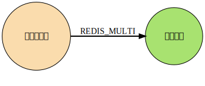
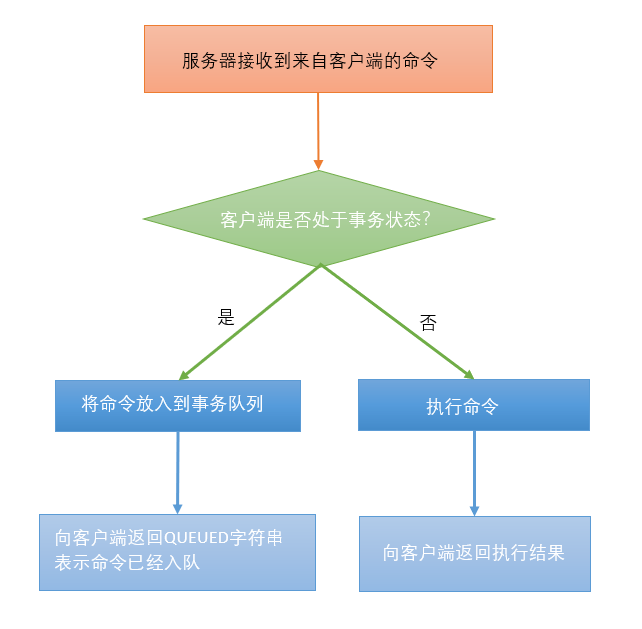
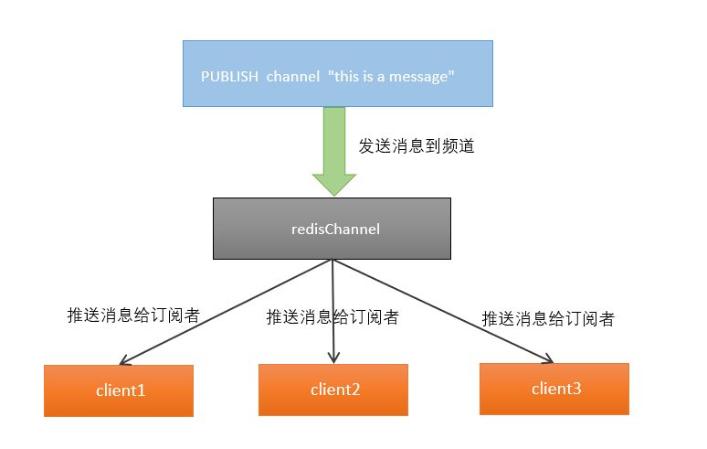
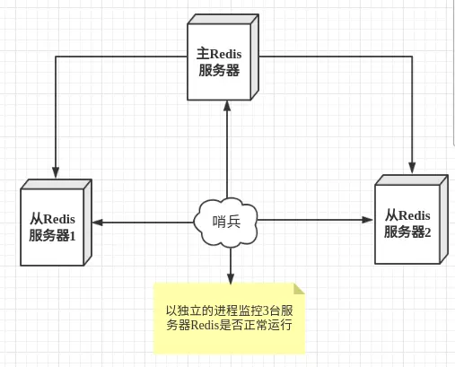
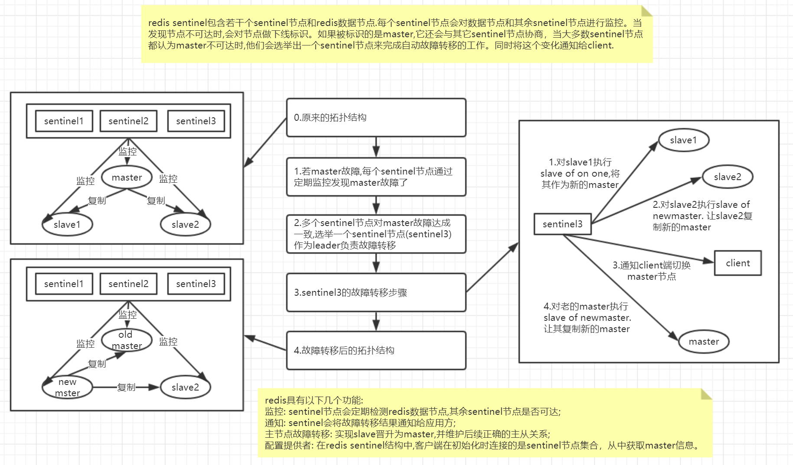
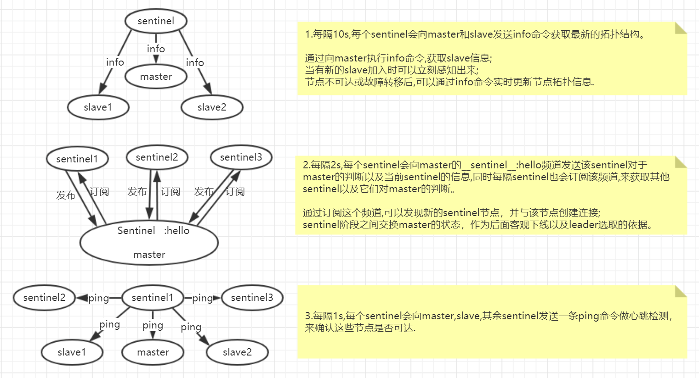
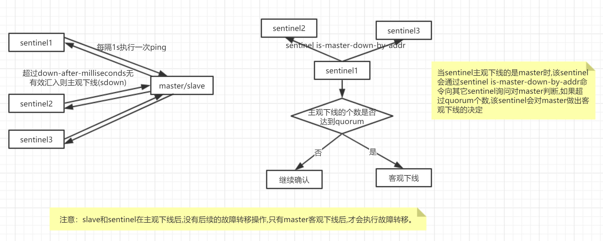
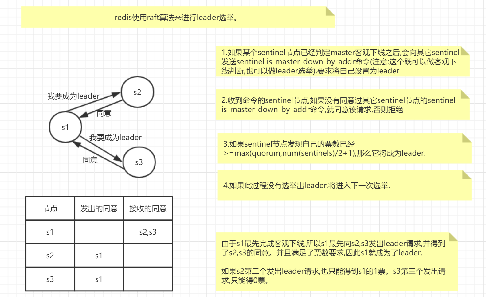
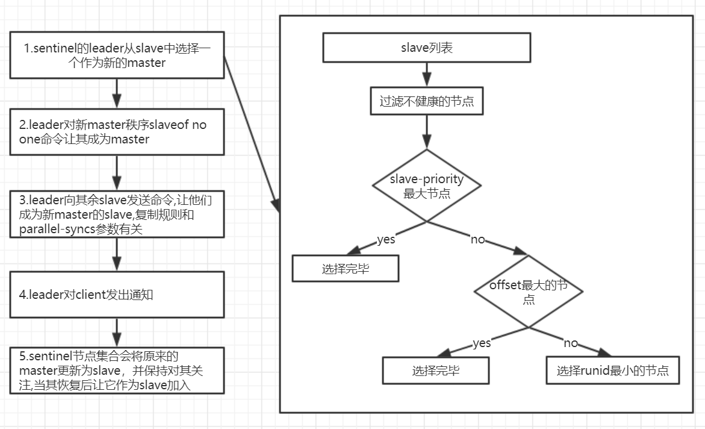
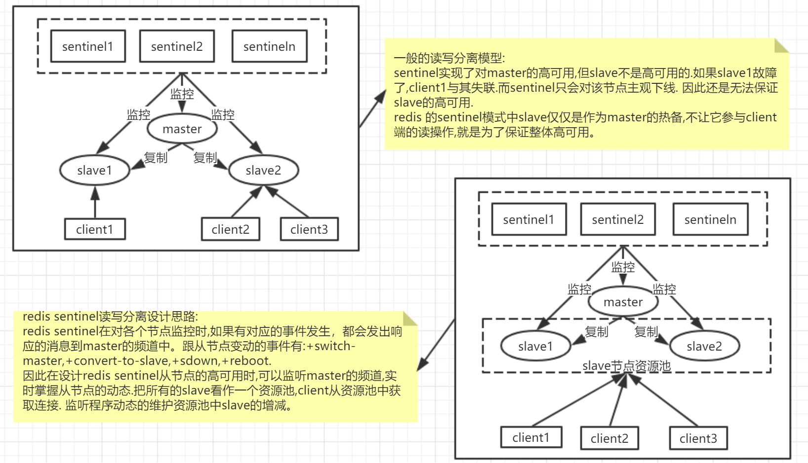

## 1. 安装redis
### 1.1 安装
- 1.进入/opt目录下
cd /opt
- 2.安装
```
wget http://download.redis.io/releases/redis-5.0.2.tar.gz
tar xzf redis-5.0.2.tar.gz
cd redis-5.0.2
make
```

### 1.2 备份redis的配置文件
```
> 进入opt目录
	cd /opt
> 新建一个myredisconf文件夹
	mkdir myredisconf
> 进入redis的安装目录
	cd /opt/redis-5.0.2
>复制配置文件到myredisconf文件加
	cp ./redis.conf ../myredisconf
```
### 1.3 修改redis备份后的配置文件
```properties

vim /opt/myredisconf/redis.conf

将下面的daemonize no改为yes
################################ GENERAL #####################################
# By default Redis does not run as a daemon. Use 'yes' if you need it.
# Note that Redis will write a pid file in /var/run/redis.pid when daemonized.
daemonize yes
```
### 1.4 启动redis的服务端
```properties
进入到redis的src目录下
cd /opt/redis-5.0.2/src
使用备份的配置文件启动redis服务端
./redis-server /opt/myredisconf/redis.conf

看到类似如下提示说明启动成功
8347:C 11 Dec 2018 16:36:52.716 # oO0OoO0OoO0Oo Redis is starting oO0OoO0OoO0Oo
8347:C 11 Dec 2018 16:36:52.716 # Redis version=5.0.2, bits=64, commit=00000000, modified=0, pid=8347, just started
8347:C 11 Dec 2018 16:36:52.716 # Configuration loaded

接着启动redis的客户端，默认端口号是6379，参数-p
./redis-cli -p 6379
出现下面提示便进入到了redis的客户端
127.0.0.1:6379> 
测试连接
输入：ping
redis回答PONG说明连接成功
测试存储
set k1 helloworld
get k1
看到
“helloworld”
使用select 库号 可以切换库
```

### 1.5 redis性能测试

启动redis服务器，切换到redis安装目录下，运行redis-benchmark即可看到测试读写速度


## 2. redis启动后杂项基础知识

- dbsize

查看当前库的key数量

- keys  pattern （如：keys *,keys k?)

列出当前库所有键，keys支持正则查询，例如：`keys k?`会查询首字母带k的键

keys [0-9]* 会查询出首字母是数字的所有key

- flushall

清空所有库（不要用！）

- flushdb

清空当前库（不要用！）


redis统一密码管理，16个库密码要么不用，要么都相同


## 3. redis五大数据类型

Redis is an open source (BSD licensed), in-memory **data structure store**, used as a database, cache and message broker. It supports data structures such as [strings](https://redis.io/topics/data-types-intro#strings), [hashes](https://redis.io/topics/data-types-intro#hashes), [lists](https://redis.io/topics/data-types-intro#lists), [sets](https://redis.io/topics/data-types-intro#sets), [sorted sets](https://redis.io/topics/data-types-intro#sorted-sets) with range queries, [bitmaps](https://redis.io/topics/data-types-intro#bitmaps), [hyperloglogs](https://redis.io/topics/data-types-intro#hyperloglogs), [geospatial indexes](https://redis.io/commands/geoadd) with radius queries and [streams](https://redis.io/topics/streams-intro.md). Redis has built-in [replication](https://redis.io/topics/replication), [Lua scripting](https://redis.io/commands/eval), [LRU eviction](https://redis.io/topics/lru-cache), [transactions](https://redis.io/topics/transactions) and different levels of [on-disk persistence](https://redis.io/topics/persistence), and provides high availability via [Redis Sentinel](https://redis.io/topics/sentinel) and automatic partitioning with [Redis Cluster](https://redis.io/topics/cluster-tutorial).

redis是一个内存数据结构存储器，可以用来作为数据库、缓存和消息代理。他支持的数据类型有

- String
- hash
- list
- set
- sorted set

- bitmap
- 超级日志
- 具有半径查询和流地理空间索引

### 3.0 redis 键操作（key)

- keys *

- exists key名：判断某个key是否存在

- move key db：将key记录移动到其他库

- expire key 秒数：为给定的key设置过期时间

- ttl key：查看还有多少秒过期，-1表示永不过期，-2表示已过期，过期后记录不存在

- type key：查看key的类型

如果存储时键已经存在则内容覆盖

其他命令查文档

```
redis命令参考网址：http://redisdoc.com/
```

### 3.1 String型

String是redis最基本的类型，可以理解为与memcache一模一样的类型，一个key对应一个value。

String类型二进制安全的，意思是redis的String可以包含任何数据。比如jpg的图片或者序列化的对象，一个redis中字符串value最多可以是512M。

#### 字符串操作指令：

- strlen key：

```
获取键长度
```

- append key:

```
追加
```

- 对于键是纯数值的：

```
incr key：单步递增
decr key：单步递减
incrby key：设置步长递增
decrby key：设置步长递减
```

- getrange 

```shell
获取指定区间范围内的值，相当于字符串截取如：
getrange k1 0 3
```

- setex(set with expire)键秒值

```
将键 key 的值设置为 value ， 并将键 key 的生存时间设置为 seconds 秒钟。
如果键 key 已经存在， 那么 SETEX 命令将覆盖已有的值。
SETEX 命令的效果和以下两个命令的效果类似：
SET key value
EXPIRE key seconds  # 设置生存时间

SETEX 和这两个命令的不同之处在于 SETEX 是一个原子（atomic）操作， 它可以在同一时间内完成设置值和设置过期时间这两个操作， 因此 SETEX 命令在储存缓存的时候非常实用。
```

- setnx(set if not exist)

```
SETEX 和这两个命令的不同之处在于 `SETEX` 是一个原子（atomic）操作， 它可以在同一时间内完成设置值和设置过期时间这两个操作， 因此 `SETEX` 命令在储存缓存的时候非常实用。

返回值
命令在设置成功时返回 1 ， 设置失败时返回 0 。

示例：
redis> EXISTS job                # job 不存在
(integer) 0

redis> SETNX job "programmer"    # job 设置成功
(integer) 1
```

- MSET key value [key value …]

```
同时为多个键设置值。

如果某个给定键已经存在， 那么 MSET 将使用新值去覆盖旧值， 如果这不是你所希望的效果， 请考虑使用 MSETNX 命令， 这个命令只会在所有给定键都不存在的情况下进行设置。

MSET 命令总是返回 OK 。

示例：
redis> MSET date "2012.3.30" time "11:00 a.m." weather "sunny"
OK
```

- MGET key [key …]

```shell
返回给定的一个或多个字符串键的值。

如果给定的字符串键里面， 有某个键不存在， 那么这个键的值将以特殊值 nil 表示。

返回值：
MGET 命令将返回一个列表， 列表中包含了所有给定键的值。

示例：
redis> MGET redis mongodb
1) "redis.com"
2) "mongodb.org"
```

- MSETNX key value [key value …]

```
当且仅当所有给定键都不存在时， 为所有给定键设置值。

即使只有一个给定键已经存在， MSETNX 命令也会拒绝执行对所有键的设置操作。

MSETNX 是一个原子性(atomic)操作， 所有给定键要么就全部都被设置， 要么就全部都不设置， 不可能出现第三种状态。

返回值：
当所有给定键都设置成功时， 命令返回 1 ； 如果因为某个给定键已经存在而导致设置未能成功执行， 那么命令返回 0 。

示例：
对不存在的键执行 MSETNX 命令：
MSETNX k1 "MySQL" k2 "MongoDB" k3 "redis"
对某个已经存在的键进行设置：
redis> MSETNX rmdbs "Sqlite" language "python"  # rmdbs 键已经存在，操作失败
(integer) 0
```


### 3.2 List列表

redis列表是简单的字符串列表，按照插入顺序排列，你可以添加一个元素到列表的头部（左边）或者尾部（右边）。它的底层实际是一个链表。

- LPUSH key value [value …]

```
作用：将一个或多个值 value 插入到列表 key 的表头

描述：如果有多个 value 值，那么各个 value 值按从左到右的顺序依次插入到表头： 比如说，对空列表 mylist 执行命令 LPUSH mylist a b c ，列表的值将是 c b a ，这等同于原子性地执行 LPUSH mylist a 、 LPUSH mylist b 和 LPUSH mylist c 三个命令。
如果 key 不存在，一个空列表会被创建并执行 LPUSH 操作。
当 key 存在但不是列表类型时，返回一个错误。

返回值：
执行 LPUSH 命令后，列表的长度。

示例：
redis> lpush mylist a b c d a # 列表允许重复元素
redis> LRANGE mylist 0 -1 
“a”
"b"
"c"
"d"
"a"
```

- LPUSHX key value

```
作用：将值 value 插入到列表 key 的表头，当且仅当 key 存在并且是一个列表。相当于对已存在的列表执行追加操作。
和 LPUSH key value [value …] 命令相反，当 key 不存在时， LPUSHX 命令什么也不做。

示例：
# 对空列表执行 LPUSHX
redis> LPUSHX greet "hello"      # 尝试 LPUSHX，失败，因为列表为空
(integer) 0
# 对非空列表执行 LPUSHX
redis> LPUSHX greet "good morning"      # 这次 LPUSHX 执行成功
(integer) 2
```

- RPUSH key value [value …]

```
作用：将一个或多个值 value 插入到列表 key 的表尾(最右边)。

描述：如果有多个 value 值，那么各个 value 值按从左到右的顺序依次插入到表尾：比如对一个空列表 mylist 执行 RPUSH mylist a b c ，得出的结果列表为 a b c ，等同于执行命令 RPUSH mylist a 、 RPUSH mylist b 、 RPUSH mylist c 。

如果 key 不存在，一个空列表会被创建并执行 RPUSH 操作
当 key 存在但不是列表类型时，返回一个错误。

返回值：
执行 RPUSH 操作后，表的长度。

示例：
redis> RPUSH mylist a b c
(integer) 3

redis> LRANGE mylist 0 -1
1) "a"
2) "b"
3) "c"
```

- LPOP key

```
作用：移除并返回列表 key 的头元素

返回值：
列表的头元素。 当 key 不存在时，返回 nil 。

示例：类似队列,先进先出
redis> RPUSH mylist a b c
(integer) 3
redis>lpop mylist
"a"
```

- RPOP key

```
作用：移除并返回列表 key 的尾元素。

返回值：
列表的尾元素。 当 key 不存在时，返回 nil 。

示例：类似栈，先进后出
redis> RPUSH mylist a b c d
(integer) 3
redis>rpop mylist
"d"
```

- LINDEX key index

```
作用：返回列表 key 中，下标为 index 的元素。

描述：下标(index)参数 start 和 stop 都以 0 为底，也就是说，以 0 表示列表的第一个元素，以 1 表示列表的第二个元素，以此类推。
你也可以使用负数下标，以 -1 表示列表的最后一个元素， -2 表示列表的倒数第二个元素，以此类推。如果 key 不是列表类型，返回一个错误。

返回值：列表中下标为 index 的元素。 如果 index 参数的值不在列表的区间范围内(out of range)，返回 nil 

示例：
redis> lpush mylist 1 2 3 4 5
redis> lrange mylist 0 -1
1) "5"
2) "4"
3) "3"
4) "2"
5) "1"
redis> lindex mylist 1
"4"

```

- LLEN key

```
作用：返回列表 key 的长度。

描述：如果 key 不存在，则 key 被解释为一个空列表，返回 0
如果 key 不是列表类型，返回一个错误。

返回值：列表 key 的长度。

示例：
redis> llen mylist
(integer) 5
```

- LREM key count value

```
作用：根据参数 count 的值，移除列表中与参数 value 相等的元素。

描述：count 的值可以是以下几种：
count > 0 : 从表头开始向表尾搜索，移除与 value 相等的元素，数量为 count 。
count < 0 : 从表尾开始向表头搜索，移除与 value 相等的元素，数量为 count 的绝对值。
count = 0 : 移除表中所有与 value 相等的值。

返回值：被移除元素的数量。 因为不存在的 key 被视作空表(empty list)，所以当 key 不存在时， LREM 命令总是返回 0 。

示例：
redis> lrange mylist 0 -1
1) "3"
2) "2"
3) "2"
4) "2"
5) "5"
6) "4"
7) "3"
8) "2"
9) "1"
redis> lrem mylist 2 2 #移除2个mylist中的2
(integer) 2
redis> lrange mylist 0 -1
1) "3"
2) "2"
3) "5"
4) "4"
5) "3"
6) "2"
7) "1"
```

- LTRIM key start stop

```
作用：对一个列表进行修剪(trim)，就是说，让列表只保留指定区间内的元素，不在指定区间之内的元素都将被删除。

描述：举个例子，执行命令 LTRIM list 0 2 ，表示只保留列表 list 的前三个元素，其余元素全部删除。下标(index)参数 start 和 stop 都以 0 为底。也可以使用负数下标，以 -1 表示列表的最后一个元素，-2 表示列表的倒数第二个元素。

返回值：
当 key 不是列表类型时，返回一个错误
命令执行成功时，返回 ok 。

注意：
超出范围的下标值不会引起错误。
如果 start 下标比列表的最大下标 end ( LLEN list 减去 1 )还要大，或者 start > stop ， LTRIM 返回一个空列表(因为 LTRIM 已经将整个列表清空)。
如果 stop 下标比 end 下标还要大，Redis将 stop 的值设置为 end 。

示例：
redis> lpush mylist 1 2 3 4 5 6
redis> lrange mylist 0 -1
1) "8"
2) "7"
3) "6"
4) "5"
5) "4"
6) "3"
7) "2"
8) "1"
redis> LTRIM mylist 0 4 #截取0-4的元素
OK
redis> lrange mylist 0 -1
1) "8"
2) "7"
3) "6"
4) "5"
5) "4"

redis> ltrim mylist 0 10086 #如果 stop下标比end下标还要大，则stop=end 。
redis> lrange mylist 0 -1 #所以一个也没有被丢弃
1) "8"
2) "7"
3) "6"
4) "5"
5) "4"

redis> ltrim mylist 10086 4 #start > end 则列表被清空
redis> lrange mylist 0 -1
(empty list or set)
```

- RPOPLPUSH source destination

```
作用：
将列表 source 中的最后一个元素(尾元素)弹出，并返回给客户端。
将 source 弹出的元素插入到列表 destination ，作为 destination 列表的的头元素

描述：
如果 source 不存在，值 nil 被返回，并且不执行其他动作。
如果 source 和 destination 相同，则列表中的表尾元素被移动到表头，并返回该元素，可以把这种特殊情况视作列表的旋转(rotation)操作。

返回值：被弹出的元素。

示例：
redis> lpush mylist 1 2 3 4 5
redis> lrange mylist 0 -1
1) "5"
2) "4"
3) "3"
4) "2"
5) "1"
redis> rpoplpush mylist deslist #将mylist的尾元素添加到deslist的头部
1) "1"

redis> lrange deslist 0 -1
1) "1"
```

- LSET key index value

```
作用：将列表 key 下标为 index 的元素的值设置为 value 。
当 index 参数超出范围，或对一个空列表( key 不存在)进行 LSET 时，返回一个错误。

返回值：
操作成功返回 ok ，否则返回错误信息。

示例：
redis> lpush mylist 1 2 3 4 5
(integer) 5
redis> lrange mylist 0 -1
1) "5"
2) "4"
3) "3"
4) "2"
5) "1"
redis> lset mylist 2 7 #将下标为2的元素设置为7
OK
redis> lrange mylist 0 -1
1) "5"
2) "4"
3) "7"
4) "2"
5) "1"
```

- LINSERT key BEFORE|AFTER pivot value

```
作用：将值 value 插入到列表 key 当中，位于值 pivot 之前或之后。
当 pivot 不存在于列表 key 时，不执行任何操作。
当 key 不存在时， key 被视为空列表，不执行任何操作。
如果 key 不是列表类型，返回一个错误。

返回值：
如果命令执行成功，返回插入操作完成之后，列表的长度。 如果没有找到 pivot ，返回 -1 。 如果 key 不存在或为空列表，返回 0 。

示例：
redis> lpush mylist js is the best language
(integer) 5
redis> lrange mylist 0 -1
1) "language"
2) "best"
3) "the"
4) "is"
5) "js"

redis> linsert mylist before js java #在js之前插入java
(integer) 6
redis> lrange mylist 0 -1
1) "language"
2) "best"
3) "the"
4) "is"
5) "java"
6) "js"

```

**总结：**

他是一个字符串列表，left，right都可以插入/添加

如果键不存在，创建心得链表；

如果键已经存在，新增内容；

如果值全部移除，对应得键也就消失了。

链表得操作无论是头还是尾效率都极高，但假如是对中间元素进行操作，效率就很惨淡了。

### 3.3 Set集合

redis的set是string类型的无需集合。它是通过HashTable实现的。

- SADD key member [member …]

```
作用：将一个或多个 member 元素加入到集合 key 当中，已经存在于集合的 member 元素将被忽略。
假如 key 不存在，则创建一个只包含 member 元素作成员的集合。
当 key 不是集合类型时，返回一个错误。

返回值：
被添加到集合中的新元素的数量，不包括被忽略的元素。

示例：
redis> sadd set01 hello world hello 
(integer) 2
redis> smembers set01
1) "world"
2) "hello"

```

- SMEMBERS key

```
作用：返回集合 key 中的所有成员。
不存在的 key 被视为空集合。

返回值：
集合中的所有成员。

示例：
redis> SADD language Ruby Python Clojure
(integer) 3

redis> SMEMBERS language
1) "Python"
2) "Ruby"
3) "Clojure"
```

- SISMEMBER key member

```
作用：判断 member 元素是否集合 key 的成员。

返回值：
如果 member 元素是集合的成员，返回 1 。 如果 member 元素不是集合的成员，或 key 不存在，返回 0 。

示例：
redis> sismember set01 hello
(integer) 1
```

- SCARD key

```
作用：返回集合 key 的基数(集合中元素的数量)。

返回值：
集合的基数。 当 key 不存在时，返回 0 。

示例：
redis> scard set01
(integer) 2
```

- SREM key member [member …]

```
作用：移除集合 key 中的一个或多个 member 元素，不存在的 member 元素会被忽略。
当 key 不是集合类型，返回一个错误。

返回值：被成功移除的元素的数量，不包括被忽略的元素。

示例：
redis> SMEMBERS set01
1) "hello"
2) "world"
redis> srem set01 hello
(integer) 1
redis> SMEMBERS set01
1) "world"
```

- SRANDMEMBER key [count]

```
作用：如果命令执行时，只提供了 key 参数，那么返回集合中的一个随机元素。

描述：从 Redis 2.6 版本开始， SRANDMEMBER 命令接受可选的 count 参数：
如果 count 为正数，且小于集合基数，那么命令返回一个包含 count 个元素的数组，数组中的元素各不相同。如果 count 大于等于集合基数，那么返回整个集合。
如果 count 为负数，那么命令返回一个数组，数组中的元素可能会重复出现多次，而数组的长度为 count 的绝对值。
该操作和 SPOP key 相似，但 SPOP key 将随机元素从集合中移除并返回，而 SRANDMEMBER 则仅仅返回随机元素，而不对集合进行任何改动。

返回值：
只提供 key 参数时，返回一个元素；如果集合为空，返回 nil 。 如果提供了 count 参数，那么返回一个数组；如果集合为空，返回空数组。

示例：
127.0.0.1:6379> sadd set02 hello is anybody here me
(integer) 5
redis> SRANDMEMBER set02 3
1) "hello"
2) "me"
3) "anybody"
redis> SRANDMEMBER set02 3
1) "hello"
2) "me"
3) "anybody"
redis> SRANDMEMBER set02 3
1) "is"
2) "me"
3) "anybody"
```

- SPOP key

```
作用:移除并返回集合中的一个随机元素。

返回值：被移除的随机元素。 当 key 不存在或 key 是空集时，返回 nil 。

示例：5.x版本可以指定pop个数
redis> SMEMBERS set02
1) "is"
2) "here"
3) "anybody"
4) "hello"
5) "me"
redis> spop set02
"here"
redis> spop set02 2
1) "anybody"
2) "is"
redis> SMEMBERS set02
1) "hello"
2) "me"

```

- SMOVE source destination member

```
作用：将 member 元素从 source 集合移动到 destination 集合。

描述：
如果 source 集合不存在或不包含指定的 member 元素，则 SMOVE 命令不执行任何操作，仅返回 0 。否则， member 元素从 source 集合中被移除，并添加到 destination 集合中去。
当 destination 集合已经包含 member 元素时， SMOVE 命令只是简单地将 source 集合中的 member 元素删除。

返回值：
如果 member 元素被成功移除，返回 1 。 如果 member 元素不是 source 集合的成员，并且没有任何操作对 destination 集合执行，那么返回 0 。

示例：
redis> SMEMBERS set01
1) "are"
2) "you"
3) "world"
redis> SMEMBERS set02
1) "x"
2) "y"
3) "z"
redis>  smove set01 set02 world
(integer) 1
redis> SMEMBERS set02
1) "z"
2) "y"
3) "world"
4) "x"
```

**数学集合类：**

- 差集：SDIFF key [key …]

```
作用：返回一个集合的全部成员，该集合是所有给定集合之间的差集。不存在的 key 被视为空集

返回值：一个包含差集成员的列表。

示例：
redis> sadd set01 1 2 3 4 5 x y 
(integer) 7
redis> sadd set02 1 2 3 4 a b c
(integer) 7
redis> sdiff set01 set02
1) "y"
2) "x"
3) "5"

```

- 交集：SINTER key [key …]

```
作用：返回一个集合的全部成员，该集合是所有给定集合的交集。
不存在的 key 被视为空集。
当给定集合当中有一个空集时，结果也为空集(根据集合运算定律)。

返回值：交集成员的列表。

示例：
redis> sadd set01 1 2 3 4 5 x y 
(integer) 7
redis> sadd set02 1 2 3 4 a b c
(integer) 7
redis> sinter set01 set02
1) "2"
2) "3"
3) "1"
4) "4"
```

- 并集：SUNION key [key …]

```
作用：返回一个集合的全部成员，该集合是所有给定集合的并集。
不存在的 key 被视为空集。

返回值：并集成员的列表。

示例：
redis> sadd set01 1 2 3 4 5 x y 
(integer) 7
redis> sadd set02 1 2 3 4 a b c
(integer) 7
redis> SUNION set01 set02
 1) "y"
 2) "3"
 3) "1"
 4) "c"
 5) "4"
 6) "x"
 7) "5"
 8) "2"
 9) "a"
10) "b"

```

### 3.4 Hash

类似Java里面的Map<String,Object>

- HSET hash field value

```
作用：将哈希表 hash 中域 field 的值设置为 value 。
如果给定的哈希表并不存在， 那么一个新的哈希表将被创建并执行 HSET 操作。
如果域 field 已经存在于哈希表中， 那么它的旧值将被新值 value 覆盖。

返回值：
当 HSET 命令在哈希表中新创建 field 域并成功为它设置值时， 命令返回 1 ； 如果域 field 已经存在于哈希表， 并且 HSET 命令成功使用新值覆盖了它的旧值， 那么命令返回 0 。

示例：
redis> hset user id 001
(integer) 1
redis> hget user id
"001"
```

- HGET hash field

```
作用：返回哈希表中给定域的值。

返回值：
HGET 命令在默认情况下返回给定域的值。
如果给定域不存在于哈希表中， 又或者给定的哈希表并不存在， 那么命令返回 nil 。

示例：
redis> hget user id
"001"
```

- HSETNX hash field value

```
作用：当且仅当域 field 尚未存在于哈希表的情况下， 将它的值设置为 value 。
如果给定域已经存在于哈希表当中， 那么命令将放弃执行设置操作。
如果哈希表 hash 不存在， 那么一个新的哈希表将被创建并执行 HSETNX 命令。

返回值：
HSETNX 命令在设置成功时返回 1 ， 在给定域已经存在而放弃执行设置操作时返回 0 。

示例：
#未存在时设置成功
redis> HSETNX database name Redis
(integer) 0
redis> HGET database name
"Redis"

#已存在时值不变
redis> HSETNX database name Riak
(integer) 0
redis> HGET database name
"Redis"
```


- HMSET key field value [field value …] / HMGET key field [field …]

```
作用：同时将多个 field-value (域-值)对设置到哈希表 key 中。
此命令会覆盖哈希表中已存在的域。
如果 key 不存在，一个空哈希表被创建并执行 HMSET 操作。

返回值：
如果命令执行成功，返回 OK 。
当 key 不是哈希表(hash)类型时，返回一个错误。

示例：
redis> hmset customer id 01 name zhangsan sex male
OK
redis> hmget customer id name sex
1) "01"
2) "zhangsan"
3) "male"
```

- HGETALL key

```
作用：返回哈希表 key 中，所有的域和值。
在返回值里，紧跟每个域名(field name)之后是域的值(value)，所以返回值的长度是哈希表大小的两倍。

返回值：以列表形式返回哈希表的域和域的值。
若 key 不存在，返回空列表。

示例：
redis> hgetall customer
1) "id"
2) "01"
3) "name"
4) "zhangsan"
5) "sex"
6) "male"

```

- HLEN key

```
作用：返回哈希表 key 中域的数量。

返回值：哈希表中域的数量。
当 key 不存在时，返回 0 。

示例：
redis> hgetall customer
1) "id"
2) "01"
3) "name"
4) "zhangsan"
5) "sex"
6) "male"
redis> hlen customer
(integer) 3

```

- HEXISTS hash field

```
作用：检查给定域 field 是否存在于哈希表 hash 当中。

返回值：
HEXISTS 命令在给定域存在时返回 1 ， 在给定域不存在时返回 0 。

示例：
redis> HEXISTS customer name
(integer) 1
```

- HKEYS key

```
作用：返回哈希表 key 中的所有域。

返回值：一个包含哈希表中所有域的表。
当 key 不存在时，返回一个空表。

示例：
redis> hkeys customer
1) "id"
2) "name"
3) "sex"
```

- HVALS key

```
作用：返回哈希表 key 中所有域的值。

返回值：
一个包含哈希表中所有值的表。
当 key 不存在时，返回一个空表。

示例：
redis> hvals customer
1) "01"
2) "zhangsan"
3) "male"
```

- HINCRBY key field increment

```
作用：为哈希表 key 中的域 field 的值加上增量 increment 。增量也可以为负数，相当于对给定域进行减法操作。如果 key 不存在，一个新的哈希表被创建并执行 HINCRBY 命令。对字符串进行HINCRBY 会报错。

返回值：执行 HINCRBY 命令之后，哈希表 key 中域 field 的值。

示例：
redis> hgetall customer
1) "id"
2) "01"
3) "name"
4) "zhangsan"
5) "sex"
6) "male"
7) "age"
8) "19"
redis> hincrby customer age 1
(integer) 20

```

- HINCRBYFLOAT key field increment

```
作用：为哈希表 key 中的域 field 加上浮点数增量 increment 。
如果哈希表中没有域 field ，那么 HINCRBYFLOAT 会先将域 field 的值设为 0 ，然后再执行加法操作。如果键 key 不存在，那么 HINCRBYFLOAT 会先创建一个哈希表，再创建域 field ，最后再执行加法操作。

返回值：执行加法操作之后 field 域的值。

示例：
redis> HINCRBYFLOAT customer age 0.5
"20.5"
```


### 3.5 Zset有序集合(sorted set)

redis zset和色图一样也是String类型的元素集合，且不允许重复。

不同的是每个元素都会关联一个double类型的分数。

redis正是通过分数来为集合中的成员进行从小到大的排序。zset的成员是唯一的，但是分数（score）却可以重复

- ZADD key score member [[score member] [score member] …]

```
作用：将一个或多个 member 元素及其 score 值加入到有序集 key 当中。
如果某个 member 已经是有序集的成员，那么更新这个 member 的 score 值，并通过重新插入这个 member 元素，来保证该 member 在正确的位置上。
score 值可以是整数值或双精度浮点数。

返回值：
被成功添加的新成员的数量，不包括那些被更新的、已经存在的成员。

示例：
redis> zadd page_rank 20 baidu.com 30 google.com 40 tencent.com
(integer) 3
```

- ZRANGE key start stop [WITHSCORES]

```
作用：返回有序集 key 中，指定区间内的成员。
其中成员的位置按 score 值递增(从小到大)来排序。
具有相同 score 值的成员按字典序(lexicographical order )来排列。
下标参数 start 和 stop 都以 0 为底，也就是说，以 0 表示有序集第一个成员，以 1 表示有序集第二个成员，以此类推。 你也可以使用负数下标，以 -1 表示最后一个成员， -2 表示倒数第二个成员，以此类推。

返回值：指定区间内，带有 score 值(可选)的有序集成员的列表。

示例：
redis> zrange page_rank 0 -1
1) "baidu.com"
2) "google.com"
3) "tencent.com"

redis> zrange page_rank 0 -1 withscores
1) "baidu.com"
2) "20"
3) "google.com"
4) "30"
5) "tencent.com"
6) "40"
```

- ZRANGEBYSCORE key min max [WITHSCORES] [LIMIT offset count]

```
作用：返回有序集 key 中，所有 score 值介于 min 和 max 之间(包括等于 min 或 max )的成员。有序集成员按 score 值递增(从小到大)次序排列
> LIMIT 参数指定返回结果的数量及区间(就像SQL中的 SELECT LIMIT offset, count )
> WITHSCORES 参数决定结果集是单单返回有序集的成员，还是将有序集成员及其 score 值一起返回。

区间及无限：
min 和 max 可以是 -inf 和 +inf ，这样一来，你就可以在不知道有序集的最低和最高 score 值的情况下，使用 ZRANGEBYSCORE 这类命令。
默认情况下，区间的取值使用闭区间 (小于等于或大于等于)，你也可以通过给参数前增加 ( 符号来使用可选的开区间 (小于或大于)，如：ZRANGEBYSCORE zset (1 5

返回值:指定区间内，带有 score 值(可选)的有序集成员的列表。

示例：
#显示<=30的网站域名
redis> zrangebyscore page_rank -inf 30 withscores
1) "baidu.com"
2) "20"
3) "google.com"
4) "30"

#显示整个有序集
redis> zrangebyscore page_rank -inf +inf
1) "baidu.com"
2) "google.com"
3) "tencent.com"

#查询>20 <=40的网站域名
27.0.0.1:6379> zrangebyscore page_rank (20 40 withscores
1) "google.com"
2) "30"
3) "tencent.com"
4) "40"
```

- ZREM key member [member …]

```
作用：移除有序集 key 中的一个或多个成员，不存在的成员将被忽略。
当 key 存在但不是有序集类型时，返回一个错误。

返回值：被成功移除的成员的数量，不包括被忽略的成员。

示例：
#移除单个元素
redis> zrem page_rank baidu.com
(integer) 1

#移除多个元素
redis> ZREM page_rank baidu.com bing.com
(integer) 2
```

- ZCARD key

```
作用：返回有序集 key 的基数。

返回值：
当 key 存在且是有序集类型时，返回有序集的基数。 当 key 不存在时，返回 0 

示例：
redis> zcard page_rank
(integer) 2
```

- ZCOUNT key min max

```
作用：返回有序集 key 中， score 值在 min 和 max 之间(默认包括 score 值等于 min 或 max )的成员的数量。

返回值
score 值在 min 和 max 之间的成员的数量。

示例：
redis> zadd zset01 10 hello 20 world 30 im 40 jack 50 haha
(integer) 5
redis> zcount zset01 10 30
(integer) 3
```

- ZRANK key member

```
作用：返回有序集 key 中成员 member 的排名。其中有序集成员按 score 值递增(从小到大)顺序排列。
排名以 0 为底，也就是说， score 值最小的成员排名为 0 。

返回值：
如果 member 是有序集 key 的成员，返回 member 的排名。 如果 member 不是有序集 key 的成员，返回 nil 。

示例：
redis> zrange zset01 0 -1
1) "hello"
2) "world"
3) "im"
4) "jack"
5) "haha"
redis> zrank zset01 jack #下标从0开始
(integer) 3

```

- ZSCORE key member （递增排列）

```
作用：返回有序集 key 中，成员 member 的 score 值。
如果 member 元素不是有序集 key 的成员，或 key 不存在，返回 nil 。

返回值：
member 成员的 score 值，以字符串形式表示。

示例：
redis> zrange zset01 0 -1 withscores
 1) "hello"
 2) "10"
 3) "world"
 4) "20"
 5) "im"
 6) "30"
 7) "jack"
 8) "40"
 9) "haha"
10) "50"
redis> zscore zset01 im
"30"
```

- ZREVRANGE key start stop [WITHSCORES] （递减排列）

```
作用：返回有序集 key 中，指定区间内的成员。
其中成员的位置按 score 值递减(从大到小)来排列。 具有相同 score 值的成员按字典序的逆序排列。（reverse lexicographical order）

返回值：
指定区间内，带有 score 值(可选)的有序集成员的列表。

示例：
redis> zrevrange zset01 0 -1 withscores
 1) "haha"
 2) "50"
 3) "jack"
 4) "40"
 5) "im"
 6) "30"
 7) "world"
 8) "20"
 9) "hello"
10) "10"
```

- ZREVRANGEBYSCORE key max min [WITHSCORES] [LIMIT offset count]

```
作用：返回有序集 key 中， score 值介于 max 和 min 之间(默认包括等于 max 或 min )的所有的成员。有序集成员按 score 值递减(从大到小)的次序排列。
具有相同 score 值的成员按字典序的逆序(reverse lexicographical order )排列。

返回值：
指定区间内，带有 score 值(可选)的有序集成员的列表。

示例：
redis> ZREVRANGEBYSCORE zset01 50 20 withscores
1) "haha"
2) "50"
3) "jack"
4) "40"
5) "im"
6) "30"
7) "world"
8) "20"

```


## 4. 解析配置文件

### 4.1位置

默认配置文件位置在redis安装目录下

```
/opt/redis-5.0.2/
```

备份的配置文件目录：

```
/opt/myredisconf/
```

### 4.2 Units 单位

```shell
  1 # Redis configuration file example.
   2 #
   3 # Note that in order to read the configuration file, Redis must be
   4 # started with the file path as first argument:
   5 #
   6 # ./redis-server /path/to/redis.conf
   7 
   8 # Note on units: when memory size is needed, it is possible to specify
   9 # it in the usual form of 1k 5GB 4M and so forth:
  10 #
  11 # 1k => 1000 bytes
  12 # 1kb => 1024 bytes
  13 # 1m => 1000000 bytes
  14 # 1mb => 1024*1024 bytes
  15 # 1g => 1000000000 bytes
  16 # 1gb => 1024*1024*1024 bytes
  17 #
  18 # units are case insensitive so 1GB 1Gb 1gB are all the same.

```

1.配置大小单位，开头定义了一些基本的度量单位，只支持bytes,不支持bit

2.对大小写敏感

3.1k和1kb大小不一样，1m和1mb大小也不一样，同理以此类推

### 4.3 Includes包含

```
  22 # Include one or more other config files here.  This is useful if you
  23 # have a standard template that goes to all Redis servers but also need
  24 # to customize a few per-server settings.  Include files can include
  25 # other files, so use this wisely.
  26 #
  27 # Notice option "include" won't be rewritten by command "CONFIG REWRITE"
  28 # from admin or Redis Sentinel. Since Redis always uses the last processed
  29 # line as value of a configuration directive, you'd better put includes
  30 # at the beginning of this file to avoid overwriting config change at runtime.
  31 #
  32 # If instead you are interested in using includes to override configuration
  33 # options, it is better to use include as the last line.
  34 #
  35 # include /path/to/local.conf
  36 # include /path/to/other.conf
```

和struts2配置文件类似，可以通过include包含，redis.conf可以作用总配置文件，包含其他。

### 4.4 NETWORK网络

```
  48 # By default, if no "bind" configuration directive is specified, Redis listens
  49 # for connections from all the network interfaces available on the server.
  50 # It is possible to listen to just one or multiple selected interfaces using
  51 # the "bind" configuration directive, followed by one or more IP addresses.
  52 #
  53 # Examples:
  54 #
  55 # bind 192.168.1.100 10.0.0.1
  56 # bind 127.0.0.1 ::1
  57 #
  58 # ~~~ WARNING ~~~ If the computer running Redis is directly exposed to the
  59 # internet, binding to all the interfaces is dangerous and will expose the
  60 # instance to everybody on the internet. So by default we uncomment the
  61 # following bind directive, that will force Redis to listen only into
  62 # the IPv4 loopback interface address (this means Redis will be able to
  63 # accept connections only from clients running into the same computer it
  64 # is running).
  65 #
  66 # IF YOU ARE SURE YOU WANT YOUR INSTANCE TO LISTEN TO ALL THE INTERFACES
  67 # JUST COMMENT THE FOLLOWING LINE.
  68 # ~~~~~~~~~~~~~~~~~~~~~~~~~~~~~~~~~~~~~~~~~~~~~~~~~~~~~~~~~~~~~~~~~~~~~~~~
  69 bind 127.0.0.1

```

默认情况下，如果没有指定“绑定”配置指令，Redis将监听用于连接服务器上所有可用的网络接口。可以只使用一个或多个选择的接口来监听“绑定”配置指令，后面跟着一个或多个IP地址。

例如：
 bind 192.168.1.100 10.0.0.1
 bind 127.0.0.1 ::1

如果运行Redis的计算机直接暴露于internet，则绑定到所有接口是危险的，并将实例暴露给internet上的每个人。默认情况下，我们取消注释

遵循bind指令，这将强制Redis只监听IPv4环回接口地址(这意味着Redis将只能接受来自运行在它所运行的同一台计算机上的客户机的连接)。

如果您确定希望实例侦听所有接口，只需注释以下行即可。

bind 127.0.0.1

```
# Protected mode is a layer of security protection, in order to avoid that
  72 # Redis instances left open on the internet are accessed and exploited.
  73 #
  74 # When protected mode is on and if:
  75 #
  76 # 1) The server is not binding explicitly to a set of addresses using the
  77 #    "bind" directive.
  78 # 2) No password is configured.
  79 #
  80 # The server only accepts connections from clients connecting from the
  81 # IPv4 and IPv6 loopback addresses 127.0.0.1 and ::1, and from Unix domain
  82 # sockets.
  83 #
  84 # By default protected mode is enabled. You should disable it only if
  85 # you are sure you want clients from other hosts to connect to Redis
  86 # even if no authentication is configured, nor a specific set of interfaces
  87 # are explicitly listed using the "bind" directive.
  88 protected-mode yes

```

受保护模式是一层安全保护，为了避免Redis实例在internet上处于打开状态时被访问和利用。当保护模式为打开时，如果:服务器没有使用“绑定”指令显式地绑定到一组地址。没有配置密码。服务器只接受来自IPv4和IPv6环回地址127.0.0.1和::1以及Unix域套接字的连接。

默认情况下启用保护模式。只有当您确信希望来自其他主机的客户机连接到Redis(即使没有配置身份验证，也没有使用“bind”指令显式列出特定的接口集)时，才应该禁用它。


```
  89 # Accept connections on the specified port, default is 6379 (IANA   90 #815344).
  91 # If port 0 is specified Redis will not listen on a TCP socket.
  92 port 6379

```

接受指定端口上的连接，默认值为6379 (IANA 815344)。

如果端口被指定为0，Redis将不会监听TCP套接字。


```
  94 # TCP listen() backlog.
  95 #
  96 # In high requests-per-second environments you need an high backlog in order
  97 # to avoid slow clients connections issues. Note that the Linux kernel
  98 # will silently truncate it to the value of /proc/sys/net/core/somaxconn so
  99 # make sure to raise both the value of somaxconn and tcp_max_syn_backlog
 100 # in order to get the desired effect.
 101 tcp-backlog 511

```

TCP连接队列：

在每秒高请求的环境中，您需要一个高backlog值来避免客户机连接缓慢的问题。注意，Linux内核将悄悄地将其截断为/proc/sys/net/core/somaxconn的值，因此请确保同时提高somaxconn和tcp_max_syn_backlog的值，以获得所需的效果，默认值为511

backlog队列总和=未完成三次握手队列 + 已完成三次握手队列

```
 103 # Unix socket.
 104 #
 105 # Specify the path for the Unix socket that will be used to listen for
 106 # incoming connections. There is no default, so Redis will not listen
 107 # on a unix socket when not specified.
 108 #
 109 # unixsocket /tmp/redis.sock
 110 # unixsocketperm 700
 111 
 112 # Close the connection after a client is idle for N seconds (0 to disable)
 113 timeout 0

```

指定用于侦听传入连接的Unix套接字的路径。没有缺省值，因此如果没有指定，Redis将不会在unix套接字上侦听。

如果想要开启unix套接字侦听开启如下配置

unixsocket /tmp/redis.sock

unixsocketperm 700


一下是设置客户端在空闲多少秒后关闭连接(0表示禁用)

timeout 0


```
# TCP keepalive.
 116 #
 117 # If non-zero, use SO_KEEPALIVE to send TCP ACKs to clients in absence
 118 # of communication. This is useful for two reasons:
 119 #
 120 # 1) Detect dead peers.
 121 # 2) Take the connection alive from the point of view of network
 122 #    equipment in the middle.
 123 #
 124 # On Linux, the specified value (in seconds) is the period used to send ACKs.
 125 # Note that to close the connection the double of the time is needed.
 126 # On other kernels the period depends on the kernel configuration.
 127 #
 128 # A reasonable value for this option is 300 seconds, which is the new
 129 # Redis default starting with Redis 3.2.1.
 130 tcp-keepalive 300
```

设置TCP keepalive：

如果非零，在没有通信的情况下，使用SO_KEEPALIVE向客户机发送TCP ACKs。这很有用，原因有二:

(1) 检测死节点。

(2) 站在网络设备的中间，从网络设备的角度进行活连接。在Linux上，指定的值(以秒为单位)是用来发送ACKs的周期。注意，要关闭连接，需要双倍的时间。对于其他内核，周期取决于内核配置。

这个选项的合理值是300秒，这是从Redis 3.2.1开始，新版Redis的默认值。

tcp-keepalive 300

### 4.5 通用配置

```
# By default Redis does not run as a daemon. Use 'yes' if you need it.
# Note that Redis will write a pid file in /var/run/redis.pid when #daemonized.
daemonize yes
```

默认情况下，Redis不作为守护进程运行。如果你需要，用“是”。注意，Redis将在/var/run/redis中编写pid文件。

```
# If you run Redis from upstart or systemd, Redis can interact with your
# supervision tree. Options: 
#   supervised no      - no supervision interaction
#   supervised upstart - signal upstart by putting Redis into SIGSTOP mode
#   supervised systemd - signal systemd by writing READY=1 to $NOTIFY_SOCKET
#   supervised auto    - detect upstart or systemd method based on
#                        UPSTART_JOB or NOTIFY_SOCKET environment variables
# Note: these supervision methods only signal "process is ready."
#       They do not enable continuous liveness pings back to your supervisor.
```

如果您从upstart或systemd运行Redis, Redis可以与您的监控树进行交互。

选项:

supervised no:没有监督互动

supervised upstart:通过将redis设置为SIGSTOP模式向upstart发送信号

supervised systemd:通过写入READY=1到$NOTIFY_SOCKET来信号systemd

supervised auto:

```
# Specify the server verbosity level.
# This can be one of:
# debug (a lot of information, useful for development/testing)
# verbose (many rarely useful info, but not a mess like the debug level)
# notice (moderately verbose, what you want in production probably)
# warning (only very important / critical messages are logged)
loglevel notice

```

loglevel日志级别：

指定服务器详细级别。这可以是其中之一:

debug(大量信息，对开发/测试有用)

verbose (许多很少有用的信息，但不像调试级别那样混乱)

notice(可能比较冗长，生产中需要什么)

warning(只记录非常重要/关键的消息)

默认值是：notice

```
# Specify the log file name. Also the empty string can be used to force
# Redis to log on the standard output. Note that if you use standard
# output for logging but daemonize, logs will be sent to /dev/null
logfile ""
```

指定日志文件名。另外，空字符串还可以用来强制redis日志以标准方式输出。注意，如果您使用标准输出进行日志记录，但使用守护模式，日志将被发送到/dev/null

```
# To enable logging to the system logger, just set 'syslog-enabled' to yes,
# and optionally update the other syslog parameters to suit your needs.
# syslog-enabled no
```

要启用对系统日志记录器的日志记录，只需将'syslog-enabled'设置为yes，并可选地更新其他syslog参数以满足您的需要。

默认值为： syslog-enabled no

```
#Specify the syslog identity.
# syslog-ident redis
```

指定syslog标识。

```
Specify the syslog facility. Must be USER or between LOCAL0-LOCAL7.
# syslog-facility local0
```

指定syslog工具。必须是USER或介于LOCAL0-LOCAL7之间。

```
# Set the number of databases. The default database is DB 0, you can select
# a different one on a per-connection basis using SELECT <dbid> where
# dbid is a number between 0 and 'databases'-1
databases 16
```

设置数据库的数量。默认数据库是DB 0，您可以选择

在每个连接的基础上使用`SELECT <DBid>`中的一个不同的

DBid是介于0和“databases”-1之间的数字

```
# By default Redis shows an ASCII art logo only when started to log to the
# standard output and if the standard output is a TTY. Basically this means
# that normally a logo is displayed only in interactive sessions.
#
# However it is possible to force the pre-4.0 behavior and always show a
# ASCII art logo in startup logs by setting the following option to yes.
always-show-logo yes
```

默认情况下，Redis只在开始记录标准输出和标准输出为TTY时显示ASCII艺术标志。基本上，这意味着logo通常只在交互式会话中显示。

但是，通过将以下选项设置为yes，可以强制执行4.0之前的行为，并始终在启动日志中显示ASCII art徽标。

默认值：always-show-logo no

### 4.6 SNAPSHOTTING快照

```
Save the DB on disk:
#
#   save <seconds> <changes>
#
#   Will save the DB if both the given number of seconds and the given
#   number of write operations against the DB occurred.
#
#   In the example below the behaviour will be to save:
#   after 900 sec (15 min) if at least 1 key changed
#   after 300 sec (5 min) if at least 10 keys changed
#   after 60 sec if at least 10000 keys changed
#
#   Note: you can disable saving completely by commenting out all "save" lines.
#
#   It is also possible to remove all the previously configured save
#   points by adding a save directive with a single empty string argument
#   like in the following example:
#
#   save ""

```

将数据持久化到磁盘：

```
save <seconds> <changes>
```

如果给定的秒数和给定的对数据库的写操作数同时发生，则会保存数据库。

在下面的例子中，行为将被保存:

900秒(15分钟)后，如果至少有一个键发生了变化

300秒(5分钟)后，如果至少有10个键被更改

60秒后，如果至少10000个键发生了变化

注意:您可以通过注释掉所有“save”行来完全禁用save。

也可以删除所有以前配置的保存点，添加一个保存指令与一个空字符串参数，如下面的例子:

```
 save ""
```

默认值：

```
save 900 1
save 300 10
save 60 10000
```


```
# By default Redis will stop accepting writes if RDB snapshots are enabled
# (at least one save point) and the latest background save failed.
# This will make the user aware (in a hard way) that data is not persisting
# on disk properly, otherwise chances are that no one will notice and some
# disaster will happen.
#
# If the background saving process will start working again Redis will
# automatically allow writes again.
#
# However if you have setup your proper monitoring of the Redis server
# and persistence, you may want to disable this feature so that Redis will
# continue to work as usual even if there are problems with disk,
# permissions, and so forth.
stop-writes-on-bgsave-error yes
```

默认情况下，如果启用了RDB快照(至少一个保存点)，并且最新的后台保存失败，那么Redis将停止接受写操作。这将使用户(以一种艰难的方式)意识到数据没有正确地持久存储在磁盘上，否则很可能没有人会注意到，并且会发生一些灾难。

如果后台保存过程将再次开始工作，Redis将自动允许再次写入。

但是，如果您已经设置了对Redis服务器和持久性的适当监视，那么您可能希望禁用该特性，以便即使存在磁盘、权限等问题，Redis也能照常工作。

意思就是是否在后台保存发生错误时停止写操作，出错了就不在继续保存了，如果需要该特性则设置：

```
stop-writes-on-bgsave-error yes
```


```
# Compress string objects using LZF when dump .rdb databases?
# For default that's set to 'yes' as it's almost always a win.
# If you want to save some CPU in the saving child set it to 'no' but
# the dataset will likely be bigger if you have compressible values or keys.
rdbcompression yes
```

在转储.rdb数据库时使用LZF压缩字符串对象?默认情况下，它被设置为“yes”，因为它几乎总是赢家。如果您想在save子集中保存一些CPU，请将其设置为“no”，但是如果您有可压缩的值或键，数据集可能会更大。

就是在转存/备份 `.rdb`文件时是否启用压缩，启用压缩会占用cpu空间，但是没有比要省，占用不了多少。

```
# The filename where to dump the DB
dbfilename dump.rdb
```

设置转存文件名，数据持久化到磁盘是`.rdb`的后缀但还需要一个名字，可以设置该名称。

```
# The working directory.
#
# The DB will be written inside this directory, with the filename specified
# above using the 'dbfilename' configuration directive.
#
# The Append Only File will also be created inside this directory.
#
# Note that you must specify a directory here, not a file name.
dir ./

```

设置工作目录：DB将在这个目录中编写，使用上面的“dbfilename”配置指令指定的文件名。这个目录中还将创建Append Only文件。注意，这里必须指定一个目录，而不是文件名。

### 4.7 REPLICATION主从复制

原文翻译：

主-从复制：使用replicaof使一个Redis实例成为另一个Redis服务器的副本。关于Redis复制，有几件事需要尽快了解。

```
+------------------+      +---------------+
|      Master      | ---> |    Replica    |
| (receive writes) |      |  (exact copy) |
+------------------+      +---------------+
```

- Redis 使用异步复制。 从 Redis 2.8 开始， 从服务器会以每秒一次的频率向主服务器报告复制流（replication stream）的处理进度。

- 一个主服务器可以有多个从服务器。

- 不仅主服务器可以有从服务器， 从服务器也可以有自己的从服务器， 多个从服务器之间可以构成一个图状结构。

- 复制功能不会阻塞主服务器： 即使有一个或多个从服务器正在进行初次同步， 主服务器也可以继续处理命令请求。

- 复制功能也不会阻塞从服务器： 只要在 `redis.conf` 文件中进行了相应的设置， 即使从服务器正在进行初次同步， 服务器也可以使用旧版本的数据集来处理命令查询。

  不过， 在从服务器删除旧版本数据集并载入新版本数据集的那段时间内， 连接请求会被阻塞。

  你还可以配置从服务器， 让它在与主服务器之间的连接断开时， 向客户端发送一个错误。

- 复制功能可以单纯地用于数据冗余（data redundancy）， 也可以通过让多个从服务器处理只读命令请求来提升扩展性（scalability）： 比如说， 繁重的 [SORT key [BY pattern\] [LIMIT offset count] [GET pattern [GET pattern …]] [ASC | DESC] [ALPHA] [STORE destination]](http://redisdoc.com/database/sort.html#sort) 命令可以交给附属节点去运行。

- 可以通过复制功能来让主服务器免于执行持久化操作： 只要关闭主服务器的持久化功能， 然后由从服务器去执行持久化操作即可。

#### 4.7.1 关闭主服务器持久化时，复制功能的数据安全

  当配置Redis复制功能时，强烈建议打开主服务器的持久化功能。 否则的话，由于延迟等问题，部署的服务应该要避免自动拉起。

  为了帮助理解主服务器关闭持久化时自动拉起的危险性，参考一下以下会导致主从服务器数据全部丢失的例子：

  \1. 假设节点A为主服务器，并且关闭了持久化。 并且节点B和节点C从节点A复制数据

  \2. 节点A崩溃，然后由自动拉起服务重启了节点A. 由于节点A的持久化被关闭了，所以重启之后没有任何数据

  \3. 节点B和节点C将从节点A复制数据，但是A的数据是空的， 于是就把自身保存的数据副本删除。

  在关闭主服务器上的持久化，并同时开启自动拉起进程的情况下，即便使用Sentinel来实现Redis的高可用性，也是非常危险的。 因为主服务器可能拉起得非常快，以至于Sentinel在配置的心跳时间间隔内没有检测到主服务器已被重启，然后还是会执行上面的数据丢失的流程。

  无论何时，数据安全都是极其重要的，所以应该禁止主服务器关闭持久化的同时自动拉起。

#### 4.7.2 复制功能的运作原理

  无论是初次连接还是重新连接， 当建立一个从服务器时， 从服务器都将向主服务器发送一个 [SYNC](http://redisdoc.com/internal/sync.html#sync) 命令。

  接到 [SYNC](http://redisdoc.com/internal/sync.html#sync) 命令的主服务器将开始执行 [BGSAVE](http://redisdoc.com/persistence/bgsave.html#bgsave) ， 并在保存操作执行期间， 将所有新执行的写入命令都保存到一个缓冲区里面。

  当 [BGSAVE](http://redisdoc.com/persistence/bgsave.html#bgsave) 执行完毕后， 主服务器将执行保存操作所得的 `.rdb` 文件发送给从服务器， 从服务器接收这个 `.rdb` 文件， 并将文件中的数据载入到内存中。

  之后主服务器会以 Redis 命令协议的格式， 将写命令缓冲区中积累的所有内容都发送给从服务器。

  你可以通过 telnet 命令来亲自验证这个同步过程： 首先连上一个正在处理命令请求的 Redis 服务器， 然后向它发送 [SYNC](http://redisdoc.com/internal/sync.html#sync) 命令， 过一阵子， 你将看到 telnet 会话（session）接收到服务器发来的大段数据（`.rdb` 文件）， 之后还会看到， 所有在服务器执行过的写命令， 都会重新发送到 telnet 会话来。

  即使有多个从服务器同时向主服务器发送 [SYNC](http://redisdoc.com/internal/sync.html#sync) ， 主服务器也只需执行一次 [BGSAVE](http://redisdoc.com/persistence/bgsave.html#bgsave) 命令， 就可以处理所有这些从服务器的同步请求。

  从服务器可以在主从服务器之间的连接断开时进行自动重连， 在 Redis 2.8 版本之前， 断线之后重连的从服务器总要执行一次完整重同步（full resynchronization）操作， 但是从 Redis 2.8 版本开始， 从服务器可以根据主服务器的情况来选择执行完整重同步还是部分重同步（partial resynchronization）。

#### 4.7.3 部分重同步

  从 Redis 2.8 开始， 在网络连接短暂性失效之后， 主从服务器可以尝试继续执行原有的复制进程（process）， 而不一定要执行完整重同步操作。

  这个特性需要主服务器为被发送的复制流创建一个内存缓冲区（in-memory backlog）， 并且主服务器和所有从服务器之间都记录一个复制偏移量（replication offset）和一个主服务器 ID （master run id）， 当出现网络连接断开时， 从服务器会重新连接， 并且向主服务器请求继续执行原来的复制进程：

  - 如果从服务器记录的主服务器 ID 和当前要连接的主服务器的 ID 相同， 并且从服务器记录的偏移量所指定的数据仍然保存在主服务器的复制流缓冲区里面， 那么主服务器会向从服务器发送断线时缺失的那部分数据， 然后复制工作可以继续执行。
  - 否则的话， 从服务器就要执行完整重同步操作。

  Redis 2.8 的这个部分重同步特性会用到一个新增的 [PSYNC master_run_id offset](http://redisdoc.com/internal/psync.html#psync) 内部命令， 而 Redis 2.8 以前的旧版本只有 [SYNC](http://redisdoc.com/internal/sync.html#sync) 命令， 不过， 只要从服务器是 Redis 2.8 或以上的版本， 它就会根据主服务器的版本来决定到底是使用 [PSYNC master_run_id offset](http://redisdoc.com/internal/psync.html#psync) 还是 [SYNC](http://redisdoc.com/internal/sync.html#sync) ：

  - 如果主服务器是 Redis 2.8 或以上版本，那么从服务器使用 [PSYNC master_run_id offset](http://redisdoc.com/internal/psync.html#psync) 命令来进行同步。
  - 如果主服务器是 Redis 2.8 之前的版本，那么从服务器使用 [SYNC](http://redisdoc.com/internal/sync.html#sync) 命令来进行同步。

#### 4.7.4 配置

配置一个从服务器非常简单， 只要在配置文件中增加以下的这一行就可以了：

```
slaveof 192.168.1.1 6379
```

当然， 你需要将代码中的 `192.168.1.1` 和 `6379` 替换成你的主服务器的 IP 和端口号。

另外一种方法是调用 [SLAVEOF host port](http://redisdoc.com/replication/slaveof.html#slaveof) 命令， 输入主服务器的 IP 和端口， 然后同步就会开始：

```
127.0.0.1:6379> SLAVEOF 192.168.1.1 10086
OK
```

#### 4.7.5 只读从服务器

从 Redis 2.6 开始， 从服务器支持只读模式， 并且该模式为从服务器的默认模式。

只读模式由 `redis.conf` 文件中的 `slave-read-only` 选项控制， 也可以通过 [CONFIG SET parameter value](http://redisdoc.com/configure/config_set.html#config-set) 命令来开启或关闭这个模式。

只读从服务器会拒绝执行任何写命令， 所以不会出现因为操作失误而将数据不小心写入到了从服务器的情况。

即使从服务器是只读的， `DEBUG` 和 `CONFIG` 等管理式命令仍然是可以使用的， 所以我们还是不应该将服务器暴露给互联网或者任何不可信网络。 不过， 使用 `redis.conf` 中的命令改名选项， 我们可以通过禁止执行某些命令来提升只读从服务器的安全性。

你可能会感到好奇， 既然从服务器上的写数据会被重同步数据覆盖， 也可能在从服务器重启时丢失， 那么为什么要让一个从服务器变得可写呢？

原因是， 一些不重要的临时数据， 仍然是可以保存在从服务器上面的。 比如说， 客户端可以在从服务器上保存主服务器的可达性（reachability）信息， 从而实现故障转移（failover）策略。

#### 4.7.6 从服务器相关配置

如果主服务器通过 `requirepass` 选项设置了密码， 那么为了让从服务器的同步操作可以顺利进行， 我们也必须为从服务器进行相应的身份验证设置。

对于一个正在运行的服务器， 可以使用客户端输入以下命令：

```
config set masterauth <password>
```

要永久地设置这个密码， 那么可以将它加入到配置文件中：

```
masterauth <password>
```

另外还有几个选项， 它们和主服务器执行部分重同步时所使用的复制流缓冲区有关， 详细的信息可以参考 Redis 源码中附带的 `redis.conf` 示例文件。

#### 4.7.7主服务器只在有至少 N 个从服务器的情况下，才执行写操作

从 Redis 2.8 开始， 为了保证数据的安全性， 可以通过配置， 让主服务器只在有至少 N 个当前已连接从服务器的情况下， 才执行写命令。

不过， 因为 Redis 使用异步复制， 所以主服务器发送的写数据并不一定会被从服务器接收到， 因此， 数据丢失的可能性仍然是存在的。

以下是这个特性的运作原理：

- 从服务器以每秒一次的频率 PING 主服务器一次， 并报告复制流的处理情况。
- 主服务器会记录各个从服务器最后一次向它发送 PING 的时间。
- 用户可以通过配置， 指定网络延迟的最大值 `min-slaves-max-lag` ， 以及执行写操作所需的至少从服务器数量 `min-slaves-to-write` 。

如果至少有 `min-slaves-to-write` 个从服务器， 并且这些服务器的延迟值都少于 `min-slaves-max-lag`秒， 那么主服务器就会执行客户端请求的写操作。

你可以将这个特性看作 CAP 理论中的 C 的条件放宽版本： 尽管不能保证写操作的持久性， 但起码丢失数据的窗口会被严格限制在指定的秒数中。

另一方面， 如果条件达不到 `min-slaves-to-write` 和 `min-slaves-max-lag` 所指定的条件， 那么写操作就不会被执行， 主服务器会向请求执行写操作的客户端返回一个错误。

以下是这个特性的两个选项和它们所需的参数：

- `min-slaves-to-write <number of slaves>`
- `min-slaves-max-lag <number of seconds>`

### 4.8 SECURITY安全

```
Require clients to issue AUTH <PASSWORD> before processing any other
# commands.  This might be useful in environments in which you do not trust
# others with access to the host running redis-server.
#
# This should stay commented out for backward compatibility and because most
# people do not need auth (e.g. they run their own servers).
#
# Warning: since Redis is pretty fast an outside user can try up to
# 150k passwords per second against a good box. This means that you should
# use a very strong password otherwise it will be very easy to break.
#
# requirepass foobared

# Command renaming.
#
# It is possible to change the name of dangerous commands in a shared
# environment. For instance the CONFIG command may be renamed into something
# hard to guess so that it will still be available for internal-use tools
# but not available for general clients.
#
# Example:
# rename-command CONFIG b840fc02d524045429941cc15f59e41cb7be6c52
#
# It is also possible to completely kill a command by renaming it into
# an empty string:
#
# rename-command CONFIG ""
#
# Please note that changing the name of commands that are logged into the
# AOF file or transmitted to replicas may cause problems.
```

安全设置要求客户端在处理任何其他命令之前发出身份验证。在您不信任其他人访问运行redis-server的主机的环境中，这可能很有用。

为了向后兼容性，这应该保留注释，因为大多数人不需要auth(例如，他们运行自己的服务器)。

警告:由于Redis速度相当快，外部用户可以尝试高达每秒150k个密码来破解。这意味着您应该使用一个非常强大的密码，否则它将非常容易被打破。

默认情况下 requirepass 参数是空的，这就意味着你无需通过密码验证就可以连接到 redis 服务。

你配置来设置一个密码，如下：

```
requirepass foobar
```

也可以通过命令来修改：

```
127.0.0.1:6379> CONFIG set requirepass "foobar"
OK
127.0.0.1:6379> CONFIG get requirepass
1) "requirepass"
2) "foobar"
```

设置密码后，客户端连接 redis 服务就需要密码验证，否则无法执行命令。

**AUTH** 命令基本语法格式如下：

```
127.0.0.1:6379> AUTH password
#例如
127.0.0.1:6379> AUTH "foobar"
OK
```

**命令重命名:**

可以在共享环境中更改危险命令的名称。例如，可以将CONFIG命令重命名为难以猜测的名称，以便它仍然可以用于内部使用的工具，但不能用于一般客户端。

例子:

```
rename-command CONFIG b840fc02d524045429941cc15f59e41cb7be6c52
```

也可以通过将一个命令重命名为空字符串来完全杀死它:

```
rename-command CONFIG ""
```

请注意，更改记录到AOF文件或传输到副本的命令的名称可能会导致问题。

### 4.9 CLIENTS客户端数量

```
# Set the max number of connected clients at the same time. By default
# this limit is set to 10000 clients, however if the Redis server is not
# able to configure the process file limit to allow for the specified limit
# the max number of allowed clients is set to the current file limit
# minus 32 (as Redis reserves a few file descriptors for internal uses).
#
# Once the limit is reached Redis will close all the new connections sending
# an error 'max number of clients reached'.

#maxclients 10000
```

自Redis2.6以后，允许使用者在配置文件(Redis.conf)`maxclients`属性上修改客户端连接的最大数，也可以通过在Redis-cli工具上输入`config set maxclients` 去设置最大连接数。根据连接数负载的情况，这个数字应该设置为预期连接数峰值的110%到150之间，若是连接数超出这个数字后，Redis会拒绝并立刻关闭新来的连接。通过设置最大连接数来限制非预期数量的连接数增长，是非常重要的。另外，新连接尝试失败会返回一个错误消息，这可以让客户端知道，Redis此时有非预期数量的连接数，以便执行对应的处理措施。 

### 4.10 MEMORY MANAGEMENT内存管理

```
# Set a memory usage limit to the specified amount of bytes.
# When the memory limit is reached Redis will try to remove keys
# according to the eviction policy selected (see maxmemory-policy).
#
# If Redis can't remove keys according to the policy, or if the policy is
# set to 'noeviction', Redis will start to reply with errors to commands
# that would use more memory, like SET, LPUSH, and so on, and will continue
# to reply to read-only commands like GET.
#
# This option is usually useful when using Redis as an LRU or LFU cache, or to
# set a hard memory limit for an instance (using the 'noeviction' policy).
#
# WARNING: If you have replicas attached to an instance with maxmemory on,
# the size of the output buffers needed to feed the replicas are subtracted
# from the used memory count, so that network problems / resyncs will
# not trigger a loop where keys are evicted, and in turn the output
# buffer of replicas is full with DELs of keys evicted triggering the deletion
# of more keys, and so forth until the database is completely emptied.
# In short... if you have replicas attached it is suggested that you set a lower
# limit for maxmemory so that there is some free RAM on the system for replica
# output buffers (but this is not needed if the policy is 'noeviction').
#
# maxmemory <bytes>

# MAXMEMORY POLICY: how Redis will select what to remove when maxmemory
# is reached. You can select among five behaviors:
#
# volatile-lru -> Evict using approximated LRU among the keys with an expire set.
# allkeys-lru -> Evict any key using approximated LRU.
# volatile-lfu -> Evict using approximated LFU among the keys with an expire set.
# allkeys-lfu -> Evict any key using approximated LFU.
# volatile-random -> Remove a random key among the ones with an expire set.
# allkeys-random -> Remove a random key, any key.
# volatile-ttl -> Remove the key with the nearest expire time (minor TTL)
# noeviction -> Don't evict anything, just return an error on write operations.
#
# LRU means Least Recently Used
# LFU means Least Frequently Used
#
# Both LRU, LFU and volatile-ttl are implemented using approximated
# randomized algorithms.

# Note: with any of the above policies, Redis will return an error on write
#       operations, when there are no suitable keys for eviction.
#
#       At the date of writing these commands are: set setnx setex append
#       incr decr rpush lpush rpushx lpushx linsert lset rpoplpush sadd
#       sinter sinterstore sunion sunionstore sdiff sdiffstore zadd zincrby
#       zunionstore zinterstore hset hsetnx hmset hincrby incrby decrby
#       getset mset msetnx exec sort
#
# The default is:
#
# maxmemory-policy noeviction

# LRU, LFU and minimal TTL algorithms are not precise algorithms but approximated
# algorithms (in order to save memory), so you can tune it for speed or
# accuracy. For default Redis will check five keys and pick the one that was
# used less recently, you can change the sample size using the following
# configuration directive.
#
# The default of 5 produces good enough results. 10 Approximates very closely
# true LRU but costs more CPU. 3 is faster but not very accurate.
#
# maxmemory-samples 5

# Starting from Redis 5, by default a replica will ignore its maxmemory setting
# (unless it is promoted to master after a failover or manually). It means
# that the eviction of keys will be just handled by the master, sending the
# DEL commands to the replica as keys evict in the master side.
#
# This behavior ensures that masters and replicas stay consistent, and is usually
# what you want, however if your replica is writable, or you want the replica to have
# a different memory setting, and you are sure all the writes performed to the
# replica are idempotent, then you may change this default (but be sure to understand
# what you are doing).

# Note that since the replica by default does not evict, it may end using more
# memory than the one set via maxmemory (there are certain buffers that may
# be larger on the replica, or data structures may sometimes take more memory and so
# forth). So make sure you monitor your replicas and make sure they have enough
# memory to never hit a real out-of-memory condition before the master hits
# the configured maxmemory setting.
#
# replica-ignore-maxmemory yes

```

默认情况下，在32位系统中，Redis最大使用3GB的内存，在64位系统中则没有限制。

在使用Redis时，应该对数据占用的最大空间有一个基本准确的预估，并为Redis设定最大使用的内存。否则在64位系统中Redis会无限制地占用内存（当物理内存被占满后会使用swap空间），容易引发各种各样的问题。

通过如下配置控制Redis使用的最大内存：

```
maxmemory <bytes>
例如：
maxmemory 100mb
```

在内存占用达到了maxmemory后，再向Redis写入数据时，Redis会：

- 根据配置的数据淘汰策略尝试淘汰数据，释放空间
- 如果没有数据可以淘汰，或者没有配置数据淘汰策略，那么Redis会对所有写请求返回错误，但读请求仍然可以正常执行

在为Redis设置maxmemory时，需要注意：

- 如果采用了Redis的主从复制，主节点向从节点同步数据时，会占用掉一部分内存空间，如果maxmemory过于接近主机的可用内存，导致数据同步时内存不足。所以设置的maxmemory不要过于接近主机可用的内存，留出一部分预留用作主从同步。

**数据淘汰机制**

Redis提供了5种数据淘汰策略当redis内存占用达到maxmemory时会使用配置的数据淘汰策略来删除内存中的数据：

- volatile-lru：使用LRU算法进行数据淘汰（淘汰上次使用时间最早的，且使用次数最少的key），只淘汰设定了有效期的key
- allkeys-lru：使用LRU算法进行数据淘汰，所有的key都可以被淘汰
- volatile-random：随机淘汰数据，只淘汰设定了有效期的key
- allkeys-random：随机淘汰数据，所有的key都可以被淘汰
- volatile-ttl：淘汰剩余有效期最短的key

最好为Redis指定一种有效的数据淘汰策略以配合maxmemory设置，避免在内存使用满后发生写入失败的情况。

一般来说，推荐使用的策略是volatile-lru，并辨识Redis中保存的数据的重要性。对于那些重要的，绝对不能丢弃的数据（如配置类数据等），应不设置有效期，这样Redis就永远不会淘汰这些数据。对于那些相对不是那么重要的，并且能够热加载的数据（比如缓存最近登录的用户信息，当在Redis中找不到时，程序会去DB中读取），可以设置上有效期，这样在内存不够时Redis就会淘汰这部分数据。

配置方法：

```
maxmemory-policy volatile-lru #默认是noeviction，即不进行数据淘汰
```

### 4.11 LAZY FREEING 惰性删除

```
# Redis has two primitives to delete keys. One is called DEL and is a blocking
# deletion of the object. It means that the server stops processing new commands
# in order to reclaim all the memory associated with an object in a synchronous
# way. If the key deleted is associated with a small object, the time needed
# in order to execute the DEL command is very small and comparable to most other
# O(1) or O(log_N) commands in Redis. However if the key is associated with an
# aggregated value containing millions of elements, the server can block for
# a long time (even seconds) in order to complete the operation.
#
# For the above reasons Redis also offers non blocking deletion primitives
# such as UNLINK (non blocking DEL) and the ASYNC option of FLUSHALL and
# FLUSHDB commands, in order to reclaim memory in background. Those commands
# are executed in constant time. Another thread will incrementally free the
# object in the background as fast as possible.
#
# DEL, UNLINK and ASYNC option of FLUSHALL and FLUSHDB are user-controlled.
# It's up to the design of the application to understand when it is a good
# idea to use one or the other. However the Redis server sometimes has to
# delete keys or flush the whole database as a side effect of other operations.
# Specifically Redis deletes objects independently of a user call in the
# following scenarios:
#
# 1) On eviction, because of the maxmemory and maxmemory policy configurations,
#    in order to make room for new data, without going over the specified
#    memory limit.
# 2) Because of expire: when a key with an associated time to live (see the
#    EXPIRE command) must be deleted from memory.
# 3) Because of a side effect of a command that stores data on a key that may
#    already exist. For example the RENAME command may delete the old key
#    content when it is replaced with another one. Similarly SUNIONSTORE
#    or SORT with STORE option may delete existing keys. The SET command
#    itself removes any old content of the specified key in order to replace
#    it with the specified string.
# 4) During replication, when a replica performs a full resynchronization with
#    its master, the content of the whole database is removed in order to
#    load the RDB file just transferred.
#
# In all the above cases the default is to delete objects in a blocking way,
# like if DEL was called. However you can configure each case specifically
# in order to instead release memory in a non-blocking way like if UNLINK
# was called, using the following configuration directives:
lazyfree-lazy-eviction no
lazyfree-lazy-expire no
lazyfree-lazy-server-del no
replica-lazy-flush no

```

redis4.0新增了lazy free特性，lazy free可译为惰性删除或延迟释放；当删除键的时候,redis提供异步延时释放key内存的功能，把key释放操作放在bio(Background I/O)单独的子线程处理中，减少删除big key对redis主线程的阻塞。有效地避免删除big key带来的性能和可用性问题。

由于redis是单线程程序(除少量的bio任务),当运行一个耗时较大的请求时，会导致所有请求排队等待redis不能响应其他请求，引起性能问题,甚至集群发生故障切换。而redis删除大的集合键时，就属于这类比较耗时的请求。

删除集合耗时参考：

| Key类型    | Item数量 | 耗时    |
| ---------- | -------- | ------- |
| Hash       | ~100万   | ~1000ms |
| List       | ~100万   | ~1000ms |
| Set        | ~100万   | ~1000ms |
| Sorted Set | ~100万   | ~1000ms |

lazy free的使用分为2类：

第一类是与DEL命令对应的主动删除。

第二类是过期key删除、maxmemory key驱逐淘汰删除。

#### 主动删除键使用lazy free

##### UNLINK命令

[UNLINK命令](https://link.jianshu.com?t=https://redis.io/commands/unlink)是与DEL一样删除key功能的lazy free实现。
 唯一不同时，UNLINK在删除集合类键时，如果集合键的元素个数大于64个(详细后文），会把真正的内存释放操作，给单独的bio来操作。
 示例如下：使用UNLINK命令删除一个大键mylist, 它包含200万个元素，但用时只有0.03毫秒

```
redis> LLEN mylist
(integer) 2000000
redis> UNLINK mylist
(integer) 1
redis> SLOWLOG get
1) 1) (integer) 1
   2) (integer) 1505465188
   3) (integer) 30
   4) 1) "UNLINK"
      2) "mylist"
   5) "127.0.0.1:17015"
   6) ""
```

注意：DEL命令，还是并发阻塞的删除操作

##### FLUSHALL/FLUSHDB ASYNC

通过对[FLUSHALL/FLUSHDB](https://link.jianshu.com/?t=https://redis.io/commands/flushall)添加ASYNC异步清理选项，来减少操作时间。使用`async`之后redis在清理整个实例或DB时，操作都是异步的，避免线程杜塞。

```
redis> flushall  //同步清理实例数据，180万个key耗时1020毫秒
OK
(1.02s)
redis> DBSIZE
(integer) 1812637
redis> flushall async  //异步清理实例数据，180万个key耗时约9毫秒
OK
redis> SLOWLOG get
 1) 1) (integer) 2996109
    2) (integer) 1505465989
    3) (integer) 9274       //指令运行耗时9.2毫秒
    4) 1) "flushall" 
       2) "async"
    5) "127.0.0.1:20110"
    6) ""
```

#### 被动删除键使用lazy free

lazy free应用于被动删除中，目前有4种场景，每种场景对应一个配置参数； 默认都是关闭。

```
lazyfree-lazy-eviction no
lazyfree-lazy-expire no
lazyfree-lazy-server-del no
slave-lazy-flush no
```

##### lazyfree-lazy-eviction

针对redis内存使用达到maxmeory，并设置有淘汰策略的情况下，决定在被动淘汰键时，是否采用lazy free机制；
 因为此场景开启lazy free, 可能使用淘汰键的内存释放不及时，导致redis内存超用，超过maxmemory的限制。此场景使用时，请结合业务测试。

##### lazyfree-lazy-expire

针对设置有TTL的键，达到过期后，被redis清理删除时是否采用lazy free机制；
此场景建议开启，因TTL本身是自适应调整的速度。

##### lazyfree-lazy-server-del

针对有些指令在处理已存在的键时，会带有一个隐式的DEL键的操作。如[rename命令](https://link.jianshu.com/?t=https://redis.io/commands/rename)，当目标键已存在,redis会先删除目标键，如果这些目标键是一个big key,那就会引入阻塞删除的性能问题。 此参数设置就是解决这类问题，建议可开启。

##### slave-lazy-flush

针对slave进行全量数据同步，slave在加载master的`.rdb`文件前，会运行flushall来清理自己的数据场景，
`lave-lazy-flush`参数设置决定是否采用异步flush机制。如果内存变动不大，建议开启。可减少全量同步耗时，从而减少主库因输出缓冲区爆涨引起的内存使用增长。

### lazy free的监控

lazy free能监控的数据指标，只有一个值：lazyfree_pending_objects，表示redis执行lazy free操作，在等待被实际回收内容的键个数。并不能体现单个大键的元素个数或等待lazy free回收的内存大小。
 所以此值有一定参考值，可监测redis lazy free的效率或堆积键数量； 比如在flushall async场景下会有少量的堆积。

### 4.12 APPEND ONLY MODE

```
#原文1：什么是APPEND ONLY
# By default Redis asynchronously dumps the dataset on disk. This mode is
# good enough in many applications, but an issue with the Redis process or
# a power outage may result into a few minutes of writes lost (depending on
# the configured save points).
#
# The Append Only File is an alternative persistence mode that provides
# much better durability. For instance using the default data fsync policy
# (see later in the config file) Redis can lose just one second of writes in a
# dramatic event like a server power outage, or a single write if something
# wrong with the Redis process itself happens, but the operating system is
# still running correctly.
#
# AOF and RDB persistence can be enabled at the same time without problems.
# If the AOF is enabled on startup Redis will load the AOF, that is the file
# with the better durability guarantees.
#
# Please check http://redis.io/topics/persistence for more information.

appendonly no


# The name of the append only file (default: "appendonly.aof")

appendfilename "appendonly.aof"

# 原文2：fsync()解释
# The fsync() call tells the Operating System to actually write data on disk
# instead of waiting for more data in the output buffer. Some OS will really flush
# data on disk, some other OS will just try to do it ASAP.
#
# Redis supports three different modes:
#
# no: don't fsync, just let the OS flush the data when it wants. Faster.
# always: fsync after every write to the append only log. Slow, Safest.
# everysec: fsync only one time every second. Compromise.
#
# The default is "everysec", as that's usually the right compromise between
# speed and data safety. It's up to you to understand if you can relax this to
# "no" that will let the operating system flush the output buffer when
# it wants, for better performances (but if you can live with the idea of
# some data loss consider the default persistence mode that's snapshotting),
# or on the contrary, use "always" that's very slow but a bit safer than
# everysec.
#
# More details please check the following article:
# http://antirez.com/post/redis-persistence-demystified.html
#
# If unsure, use "everysec".

# appendfsync always
appendfsync everysec
# appendfsync no

#原文3：使用fsync的影响
# When the AOF fsync policy is set to always or everysec, and a background
# saving process (a background save or AOF log background rewriting) is
# performing a lot of I/O against the disk, in some Linux configurations
# Redis may block too long on the fsync() call. Note that there is no fix for
# this currently, as even performing fsync in a different thread will block
# our synchronous write(2) call.
#
# In order to mitigate this problem it's possible to use the following option
# that will prevent fsync() from being called in the main process while a
# BGSAVE or BGREWRITEAOF is in progress.
#
# This means that while another child is saving, the durability of Redis is
# the same as "appendfsync none". In practical terms, this means that it is
# possible to lose up to 30 seconds of log in the worst scenario (with the
# default Linux settings).
# If you have latency problems turn this to "yes". Otherwise leave it as
# "no" that is the safest pick from the point of view of durability.

no-appendfsync-on-rewrite no

# 原文4：自动重写append only文件的配置
# Automatic rewrite of the append only file.
# Redis is able to automatically rewrite the log file implicitly calling
# BGREWRITEAOF when the AOF log size grows by the specified percentage.
#
# This is how it works: Redis remembers the size of the AOF file after the
# latest rewrite (if no rewrite has happened since the restart, the size of
# the AOF at startup is used).
#
# This base size is compared to the current size. If the current size is
# bigger than the specified percentage, the rewrite is triggered. Also
# you need to specify a minimal size for the AOF file to be rewritten, this
# is useful to avoid rewriting the AOF file even if the percentage increase
# is reached but it is still pretty small.
#
# Specify a percentage of zero in order to disable the automatic AOF
# rewrite feature.

auto-aof-rewrite-percentage 100
auto-aof-rewrite-min-size 64mb

# 原文5：AOF文件在Redis启动过程中被截断时该做何处理
# An AOF file may be found to be truncated at the end during the Redis
# startup process, when the AOF data gets loaded back into memory.
# This may happen when the system where Redis is running
# crashes, especially when an ext4 filesystem is mounted without the
# data=ordered option (however this can't happen when Redis itself
# crashes or aborts but the operating system still works correctly).
#
# Redis can either exit with an error when this happens, or load as much
# data as possible (the default now) and start if the AOF file is found
# to be truncated at the end. The following option controls this behavior.
#
# If aof-load-truncated is set to yes, a truncated AOF file is loaded and
# the Redis server starts emitting a log to inform the user of the event.
# Otherwise if the option is set to no, the server aborts with an error
# and refuses to start. When the option is set to no, the user requires
# to fix the AOF file using the "redis-check-aof" utility before to restart
# the server.
#
# Note that if the AOF file will be found to be corrupted in the middle
# the server will still exit with an error. This option only applies when
# Redis will try to read more data from the AOF file but not enough bytes
# will be found.
aof-load-truncated yes

# When rewriting the AOF file, Redis is able to use an RDB preamble in the
# AOF file for faster rewrites and recoveries. When this option is turned
# on the rewritten AOF file is composed of two different stanzas:
#
#   [RDB file][AOF tail]
#
# When loading Redis recognizes that the AOF file starts with the "REDIS"
# string and loads the prefixed RDB file, and continues loading the AOF
# tail.
aof-use-rdb-preamble yes

```

Redis可以实现数据的持久化存储，即将数据保存到磁盘上。 
Redis的持久化存储提供两种方式：RDB与AOF。RDB是默认配置。AOF需要手动开启。 默认是关闭AOF模式的。

如果需要开启redis的AOF持久化需要做如下配置：

```
appendonly yes  #开启AOF模式 原文1
appendfilename "appendonly.aof" #保存数据的AOF文件名称 原文1

# appendfsync always
appendfsync everysec    #fsync模式    原文2
# appendfsync no

no-appendfsync-on-rewrite no    #原文3

auto-aof-rewrite-percentage 100
auto-aof-rewrite-min-size 64mb  #原文4

aof-load-truncated yes  #原文5
```

原文1：

Redis默认采用异步的方式将数据存放到磁盘上，这个模式对大部份应用来说是足够好的，但是在Redis进程或电源发生故障的情况下，可能会造成小部份的数据丢失，这取决于配置的保存时间点。 
Appendonly是一种能够提供非常好的持久化的模式，例如使用默认的Fsync方案，Redis能在发生[服务器电源](https://www.baidu.com/s?wd=%E6%9C%8D%E5%8A%A1%E5%99%A8%E7%94%B5%E6%BA%90&tn=24004469_oem_dg&rsv_dl=gh_pl_sl_csd)故障或操作系统仍然正常运行但Redis进程莫名挂掉的情况下，只丢失1秒的数据。 
AOF与RDB模式可以同时启用，这并不冲突。如果AOF是可用的，那Redis启动时将自动加载AOF，这个文件能够提供更好的持久性保障。

原文2：

fsync()调用告诉操作系统将数据真实的写入磁盘而不是放到缓冲区中，一些操作系统会真实的执行请求，还有一些操作系统只会尽力的尝试。

Redis支持3种不同的模式： 
no：不即时同步，由操作系统控制何时刷写到磁盘上，这种模式速度最快； 
always：每次只写日志，速度较慢，但最安全； 
everysec：每秒钟同步一次，折中的方案。

默认的模式是“everysec”，它通常是在速度和数据安全之间折中的方法。如果你可以控制操作系统在Redis需要的时候去刷写缓冲区那可以使用“no”模式，能够提供更好的性能（但如果你能接受一些数据丢失，可以考虑默认的持久化模式–快照方式），相反，使用“always”模式很慢，但是它比“everysec”模式要安全一点。

如果不确定，就使用“everysec”。

原文3：

当使用AOF的fsync方案设置为“always”或“everysec”时，后台的存储进程会执行大量的磁盘I/O操作，在一些Linux架构中，Redis在fsync()调用时可能会阻塞很久。这个问题当前并没有修复，即使是在一个不同的线程执行fsync也将会阻塞我们的同步写调用。

为了缓解这个问题，可以使用以下选项，它将会在有一个BGSAVE或BGREWRITEAOF正在运行时，阻止主进程调用fsync()。

这意味着有另一个子进程在存储时，Redis的持久性等同于“appendfsync none”。在实践中，意味着在最坏的情况下它可能丢失多达30秒的日志（默认的Linux设置）。

如果你有潜在的问题需要更改它为“yes”。否则从持久性的观点来看“no”是最安全的选择。

原文4：

自动重写append only文件。 
当AOF日志的大小根据指定的百分比增长时，Redis会暗中调用BGREWRITEAOF去自动重写日志文件。

工作原理：Redis记忆AOF文件最后一次重写的大小（如果重启后没有重写发生，AOF的大小在启动时会被使用）。

基本大小对比当前大小。如果当前大小比指定的百分比大，触发重写。并且你要为AOF文件指定一个最小的尺寸去重写，这对于避免重写AOF文件是有用的，即使达到了百分比增长率但它仍然是非常小的。

指定百分比为0以便禁用自动AOF重写。

原文5：

可能发现一个AOF文件在Redis启动过程中被截断，当AOF数据被加载回内存时。 
这可能发生在系统中Redis运行崩溃，尤其是挂载一个EXT4文件系统而没有使用“data=ordered”选项时（但是这不会发生在Redis自身崩溃或中断而操作系统仍然正常运行的时候）。

当有一个错误发生时Redis要么退出，要么加载尽可能多的数据（当前默认）启动，如果AOF文件最后发现被截断。以下选项控制这个行为。

如果aof-load-truncated被设置为“yes”，一个被截断的AOF文件将会被加载，Redis服务启动发出一个日志告知用户这个事件。如果这个选项设置为“no”，服务器中止一个错误并拒绝启动。当选项被设置为“no”，用户需要在重启服务之前使用“redis-check-aof”功能确定AOF文件。

需要注意的是如果AOF文件被发现是损坏的，那服务器仍然会以一个错误退出。这个选项仅适用于Redis希望读取更多的数据但是没有发现足够的字节时。

### 4.13 LUA SCRIPTING (LUA脚本)

```

# Max execution time of a Lua script in milliseconds.
#
# If the maximum execution time is reached Redis will log that a script is
# still in execution after the maximum allowed time and will start to
# reply to queries with an error.
#
# When a long running script exceeds the maximum execution time only the
# SCRIPT KILL and SHUTDOWN NOSAVE commands are available. The first can be
# used to stop a script that did not yet called write commands. The second
# is the only way to shut down the server in the case a write command was
# already issued by the script but the user doesn't want to wait for the natural
# termination of the script.
#
# Set it to 0 or a negative value for unlimited execution without warnings.
lua-time-limit 5000

```

设置Lua脚本的最大执行时间(以毫秒为单位)。如果达到最大执行时间，Redis将响应一个错误提示为：“脚本在最大允许时间之后仍然没有执行完“，但是脚本不会停止，会继续执行。

当长时间运行的脚本超过最大执行时间时，只有`SCRIPT KILL` 和 `SHUTDOWN NOSAVE`是可用的。第一种方法可用于停止尚未调用write命令的脚本。第二种方法是在脚本已经发出写命令但用户不想等待脚本自然终止的情况下关闭服务器的唯一方法。

将其设置为0或负值，以便在没有警告的情况下无限执行。

Lua 脚本功能是 Reids 2.6 版本的最大亮点， 通过内嵌对 Lua 环境的支持， Redis 解决了长久以来不能高效地处理 CAS （check-and-set）命令的缺点， 并且可以通过组合使用多个命令， 轻松实现以前很难实现或者不能高效实现的模式。

#### 什么是LUA

Lua 是一种轻量小巧的脚本语言，用标准C语言编写并以源代码形式开放， 其设计目的是为了嵌入应用程序中，从而为应用程序提供灵活的扩展和定制功能。其设计目的是为了嵌入应用程序中，从而为应用程序提供灵活的扩展和定制功能。

#### LUA特性

- **轻量级**: 它用标准C语言编写并以源代码形式开放，编译后仅仅一百余K，可以很方便的嵌入别的程序里。
- **可扩展**: Lua提供了非常易于使用的扩展接口和机制：由宿主语言(通常是C或C++)提供这些功能，Lua可以使用它们，就像是本来就内置的功能一样。
- 其它特性:
  - 支持面向过程(procedure-oriented)编程和函数式编程(functional programming)；
  - 自动内存管理；只提供了一种通用类型的表（table），用它可以实现数组，哈希表，集合，对象；
  - 语言内置模式匹配；闭包(closure)；函数也可以看做一个值；提供多线程（协同进程，并非操作系统所支持的线程）支持；
  - 通过闭包和table可以很方便地支持面向对象编程所需要的一些关键机制，比如数据抽象，虚函数，继承和重载等。

#### 初始化Lua环境

在初始化 Redis 服务器时， 对 Lua 环境的初始化也会一并进行。

为了让 Lua 环境符合 Redis 脚本功能的需求， Redis 对 Lua 环境进行了一系列的修改， 包括添加函数库、更换随机函数、保护全局变量， 等等。

整个初始化 Lua 环境的步骤如下：

1. 调用 [lua_open](http://www.lua.org/pil/24.1.html) 函数，创建一个新的 Lua 环境。

2. 载入指定的 Lua 函数库，包括：

   - 基础库（base lib）。
   - 表格库（table lib）。
   - 字符串库（string lib）。
   - 数学库（math lib）。
   - 调试库（debug lib）。
   - 用于处理 JSON 对象的 `cjson` 库。
   - 在 Lua 值和 C 结构（struct）之间进行转换的 `struct` 库（<http://www.inf.puc-rio.br/~roberto/struct/>）。
   - 处理 MessagePack 数据的 `cmsgpack` 库（<https://github.com/antirez/lua-cmsgpack>）。

3. 屏蔽一些可能对 Lua 环境产生安全问题的函数，比如 [loadfile](http://pgl.yoyo.org/luai/i/loadfile) 。

4. 创建一个 Redis 字典，保存 Lua 脚本，并在复制（replication）脚本时使用。字典的键为 SHA1 校验和，字典的值为 Lua 脚本。

5. 创建一个

   ```
   redis
   ```

   全局表格到 Lua 环境，表格中包含了各种对 Redis 进行操作的函数，包括：

   - 用于执行 Redis 命令的 `redis.call` 和 `redis.pcall` 函数。

   - 用于发送日志（log）的

     ```
     redis.log
     ```

     函数，以及相应的日志级别（level）：

     - `redis.LOG_DEBUG`
     - `redis.LOG_VERBOSE`
     - `redis.LOG_NOTICE`
     - `redis.LOG_WARNING`

   - 用于计算 SHA1 校验和的 `redis.sha1hex` 函数。

   - 用于返回错误信息的 `redis.error_reply` 函数和 `redis.status_reply` 函数。

6. 用 Redis 自己定义的随机生成函数，替换 `math` 表原有的 `math.random` 函数和 `math.randomseed` 函数，新的函数具有这样的性质：每次执行 Lua 脚本时，除非显式地调用 `math.randomseed` ，否则 `math.random` 生成的伪随机数序列总是相同的。

7. 创建一个对 Redis 多批量回复（multi bulk reply）进行排序的辅助函数。

8. 对 Lua 环境中的全局变量进行保护，以免被传入的脚本修改。

9. 因为 Redis 命令必须通过客户端来执行，所以需要在服务器状态中创建一个无网络连接的伪客户端（fake client），专门用于执行 Lua 脚本中包含的 Redis 命令：当 Lua 脚本需要执行 Redis 命令时，它通过伪客户端来向服务器发送命令请求，服务器在执行完命令之后，将结果返回给伪客户端，而伪客户端又转而将命令结果返回给 Lua 脚本。

10. 将 Lua 环境的指针记录到 Redis 服务器的全局状态中，等候 Redis 的调用。

以上就是 Redis 初始化 Lua 环境的整个过程， 当这些步骤都执行完之后， Redis 就可以使用 Lua 环境来处理脚本了。

严格来说， 步骤 1 至 8 才是初始化 Lua 环境的操作， 而步骤 9 和 10 则是将 Lua 环境关联到服务器的操作， 为了按顺序观察整个初始化过程， 我们将两种操作放在了一起。

另外， 步骤 6 用于创建无副作用的脚本， 而步骤 7 则用于去除部分 Redis 命令中的不确定性（non deterministic）。

#### Lua教程参见

```
http://www.runoob.com/lua/lua-tutorial.html
```

#### redis使用Lua示例：

在redis-cli中直接写lua脚本，非常不方便编辑，所以通常创建一个lua文件然后写lua脚本，然后执行这个lua脚本，例如：

通过lua脚本获取指定的key的List中的所有数据，创建一个lua脚本文件命名为`test.lua`,然后写如下代码：

```
local key=KEYS[1]

local list=redis.call("lrange",key,0,-1);

return list;
```

然后在redis中添加一个`list`名为`persion`集合：

```
lpush person mary jack peter
```

然后我们来执行这个lua脚本，下面这样：

```
redis> redis-cli --eval /opt/testdata/test.lua person
1) "mary"
2) "jack"
3) "peter"
```


### 4.14 REDIS CLUSTER 

```
#
# ++++++++++++++++++++++++++++++++++++++++++++++++++++++++++++++++++++++++++++
# WARNING EXPERIMENTAL: Redis Cluster is considered to be stable code, however
# in order to mark it as "mature" we need to wait for a non trivial percentage
# of users to deploy it in production.
# ++++++++++++++++++++++++++++++++++++++++++++++++++++++++++++++++++++++++++++
#
# Normal Redis instances can't be part of a Redis Cluster; only nodes that are
# started as cluster nodes can. In order to start a Redis instance as a
# cluster node enable the cluster support uncommenting the following:
#
# cluster-enabled yes

# Every cluster node has a cluster configuration file. This file is not
# intended to be edited by hand. It is created and updated by Redis nodes.
# Every Redis Cluster node requires a different cluster configuration file.
# Make sure that instances running in the same system do not have
# overlapping cluster configuration file names.
#
# cluster-config-file nodes-6379.conf

# Cluster node timeout is the amount of milliseconds a node must be unreachable
# for it to be considered in failure state.
# Most other internal time limits are multiple of the node timeout.
#
# cluster-node-timeout 15000

# A replica of a failing master will avoid to start a failover if its data
# looks too old.
#
# There is no simple way for a replica to actually have an exact measure of
# its "data age", so the following two checks are performed:
#
# 1) If there are multiple replicas able to failover, they exchange messages
#    in order to try to give an advantage to the replica with the best
#    replication offset (more data from the master processed).
#    Replicas will try to get their rank by offset, and apply to the start
#    of the failover a delay proportional to their rank.
#
# 2) Every single replica computes the time of the last interaction with
#    its master. This can be the last ping or command received (if the master
#    is still in the "connected" state), or the time that elapsed since the
#    disconnection with the master (if the replication link is currently down).
#    If the last interaction is too old, the replica will not try to failover
#    at all.
#
# The point "2" can be tuned by user. Specifically a replica will not perform
# the failover if, since the last interaction with the master, the time
# elapsed is greater than:
#
#   (node-timeout * replica-validity-factor) + repl-ping-replica-period
#
# So for example if node-timeout is 30 seconds, and the replica-validity-factor
# is 10, and assuming a default repl-ping-replica-period of 10 seconds, the
# replica will not try to failover if it was not able to talk with the master
# for longer than 310 seconds.
#
# A large replica-validity-factor may allow replicas with too old data to failover
# a master, while a too small value may prevent the cluster from being able to
# elect a replica at all.
#
# For maximum availability, it is possible to set the replica-validity-factor
# to a value of 0, which means, that replicas will always try to failover the
# master regardless of the last time they interacted with the master.
# (However they'll always try to apply a delay proportional to their
# offset rank).
#
# Zero is the only value able to guarantee that when all the partitions heal
# the cluster will always be able to continue.
#
# cluster-replica-validity-factor 10
# Cluster replicas are able to migrate to orphaned masters, that are masters
# that are left without working replicas. This improves the cluster ability
# to resist to failures as otherwise an orphaned master can't be failed over
# in case of failure if it has no working replicas.
#
# Replicas migrate to orphaned masters only if there are still at least a
# given number of other working replicas for their old master. This number
# is the "migration barrier". A migration barrier of 1 means that a replica
# will migrate only if there is at least 1 other working replica for its master
# and so forth. It usually reflects the number of replicas you want for every
# master in your cluster.
#
# Default is 1 (replicas migrate only if their masters remain with at least
# one replica). To disable migration just set it to a very large value.
# A value of 0 can be set but is useful only for debugging and dangerous
# in production.
#
# cluster-migration-barrier 1

# By default Redis Cluster nodes stop accepting queries if they detect there
# is at least an hash slot uncovered (no available node is serving it).
# This way if the cluster is partially down (for example a range of hash slots
# are no longer covered) all the cluster becomes, eventually, unavailable.
# It automatically returns available as soon as all the slots are covered again.
#
# However sometimes you want the subset of the cluster which is working,
# to continue to accept queries for the part of the key space that is still
# covered. In order to do so, just set the cluster-require-full-coverage
# option to no.
#
# cluster-require-full-coverage yes

# This option, when set to yes, prevents replicas from trying to failover its
# master during master failures. However the master can still perform a
# manual failover, if forced to do so.
#
# This is useful in different scenarios, especially in the case of multiple
# data center operations, where we want one side to never be promoted if not
# in the case of a total DC failure.
#
# cluster-replica-no-failover no

# In order to setup your cluster make sure to read the documentation
# available at http://redis.io web site.


```

#### redis cluster配置

```
cluster-enabled yes
```

如果配置yes则开启集群功能，此redis实例作为集群的一个节点，否则，它是一个普通的单一的redis实例。

```
cluster-config-file nodes-6379.conf
```

虽然此配置的名字叫"集群配置文件"，但是此配置文件不能人工编辑，它是集群节点自动维护的文件，主要用于记录集群中有哪些节点、他们的状态以及一些持久化参数等，方便在重启时恢复这些状态。通常是在收到请求之后这个文件就会被更新。

```
cluster-node-timeout 15000
```

这是集群中的节点能够失联的最大时间，超过这个时间，该节点就会被认为故障。如果主节点超过这个时间还是不可达，则用它的从节点将启动故障迁移，升级成主节点。注意，任何一个节点在这个时间之内如果还是没有连上大部分的主节点，则此节点将停止接收任何请求。一般设置为15秒即可。

```
cluster-slave-validity-factor 10
```

如果设置成０，则无论从节点与主节点失联多久，从节点都会尝试升级成主节点。如果设置成正数，则cluster-node-timeout乘以cluster-slave-validity-factor得到的时间，是从节点与主节点失联后，此从节点数据有效的最长时间，超过这个时间，从节点不会启动故障迁移。假设cluster-node-timeout=5，cluster-slave-validity-factor=10，则如果从节点跟主节点失联超过50秒，此从节点不能成为主节点。注意，如果此参数配置为非0，将可能出现由于某主节点失联却没有从节点能顶上的情况，从而导致集群不能正常工作，在这种情况下，只有等到原来的主节点重新回归到集群，集群才恢复运作。

```
cluster-migration-barrier 1
```

主节点需要的最小从节点数，只有达到这个数，主节点失败时，它从节点才会进行迁移。更详细介绍可以看本教程后面关于副本迁移到部分。

```
cluster-require-full-coverage yes
```


在部分key所在的节点不可用时，如果此参数设置为"yes"(默认值), 则整个集群停止接受操作；如果此参数设置为”no”，则集群依然为可达节点上的key提供读操作。

### 4.15 CLUSTER DOCKER/NAT support 

```
# In certain deployments, Redis Cluster nodes address discovery fails, because
# addresses are NAT-ted or because ports are forwarded (the typical case is
# Docker and other containers).
#
# In order to make Redis Cluster working in such environments, a static
# configuration where each node knows its public address is needed. The
# following two options are used for this scope, and are:
#
# * cluster-announce-ip
# * cluster-announce-port
# * cluster-announce-bus-port
#
# Each instruct the node about its address, client port, and cluster message
# bus port. The information is then published in the header of the bus packets
# so that other nodes will be able to correctly map the address of the node
# publishing the information.
#
# If the above options are not used, the normal Redis Cluster auto-detection
# will be used instead.
#
# Note that when remapped, the bus port may not be at the fixed offset of
# clients port + 10000, so you can specify any port and bus-port depending
# on how they get remapped. If the bus-port is not set, a fixed offset of
# 10000 will be used as usually.
#
# Example:
#
# cluster-announce-ip 10.1.1.5
# cluster-announce-port 6379
# cluster-announce-bus-port 6380
```

在某些部署中，Redis集群节点地址发现失败，因为地址是NAT-ted的，或者因为端口被转发(典型的情况是Docker和其他容器)。

为了让Redis集群在这样的环境中工作，需要一个静态配置，其中每个节点都知道自己的公共地址。此范围使用以下两个选项:

```
cluster-announce-ip
cluster-announce-port
cluster-announce-bus-port
```

每个节点都指示节点的地址、客户端端口和集群消息总线端口。然后将信息发布到总线包的头部，以便其他节点能够正确映射发布信息的节点的地址。

如果不使用上述选项，则使用常规的Redis集群自动检测。注意，在重新映射时，总线端口可能不在客户机`port + 10000`的固定偏移量上，因此可以根据重新映射的方式指定任何端口和总线端口。如果没有设置总线端口，将像往常一样使用10000的固定偏移量。

例如：

```
cluster-announce-ip 10.1.1.5
cluster-announce-port 6379
cluster-announce-bus-port 6380
```

### 4.16 SLOW LOG

```
# The Redis Slow Log is a system to log queries that exceeded a specified
# execution time. The execution time does not include the I/O operations
# like talking with the client, sending the reply and so forth,
# but just the time needed to actually execute the command (this is the only
# stage of command execution where the thread is blocked and can not serve
# other requests in the meantime).
#
# You can configure the slow log with two parameters: one tells Redis
# what is the execution time, in microseconds, to exceed in order for the
# command to get logged, and the other parameter is the length of the
# slow log. When a new command is logged the oldest one is removed from the
# queue of logged commands.

# The following time is expressed in microseconds, so 1000000 is equivalent
# to one second. Note that a negative number disables the slow log, while
# a value of zero forces the logging of every command.
slowlog-log-slower-than 10000

# There is no limit to this length. Just be aware that it will consume memory.
# You can reclaim memory used by the slow log with SLOWLOG RESET.
slowlog-max-len 128
```

**reids 慢查询日志：**

许多存储系统(如:`MySQL`)提供慢查询日志帮助开发与运维人员定位系统存在的慢操作.所谓慢查询日志就是系统在命令执行前后计算每条命令的执行时间,当超过预设阈值,就将这条命令的相关信息(例如:发生时间,耗时,命令的详细信息)记录到慢查询日志中,`Redis`也提供了类似的功能.

**Redis命令执行流程:**

1. 发送命令
2. 命令排队
3. 命令执行
4. 返回结果

需要注意,慢查询只统计步骤`3`的时间,所以没有慢查询并不代表客户端没有超时问题.

**慢查询的两个配置参数**

对于慢查询功能,需要明确两件事:

- 预设阈值怎么设置?
- 慢查询记录存放在那?

`Redis`提供了`slowlog-log-slower-than`和`slowlog-max-len`配置来解决这两个问题.从字面意思就可以看出,`slowlog-log-slower-than`就是这个预设阈值,它的单位是毫秒(`1秒=1000000微秒`)默认值是`10000`,假如执行了一条"很慢"的命令(例如`key *`),如果执行时间超过`10000微秒`,那么它将被记录在慢查询日志中.

如果`slowlog-log-slower-than=0`会记录所有命令,`slowlog-log-slower-than<0`对于任何命令都不会进行记录

从字面意思看,`slowlog-max-len`只是说明了慢查询日志最多存储多少条,并没有说明存放在哪里?实际上`Redis`使用了一个列表来存储慢查询日志,`slowlog-max-len`就是列表的最大长度.一个新的命令满足慢查询条件时被插入到这个列表中,当慢查询日志列表已处于其最大长度时,最早插入的一个命令将从列表中移出,例如`slowlog-max-len`设置长度为`64`.当有第`65`条慢查询日志插入的话,那么队头的第一条数据就出列,第`65`条慢查询就会入列.

在`Redis`中有两种修改配置的方法,一种是修改配置文件,另一种是使用`config set`命令动态修改.例如下面使用`config set`命令将`slowlog-log-slower-than`设置为`20000微妙`.`slowlog-max-len`设置为`1024`:

```
config set slowlog-log-slower-than 20000
config set slowlog-max-len 1024
config rewrite
```

虽然慢查询日志存放在`Redis`内存列表中,但是`Redis`并没有暴露这个列表的键,而是通过一组命令来实现对慢查询日志的访问和管理.

获取慢查询日志

```
slowlog get [n] #可选参数 n可以指定条数.
```

获取慢查询日志列表当前长度

```
slowlog len
```

慢查询日志重置

```
slowlog reset
```

**实践：**

慢查询功能可以有效地帮助我们找到`Redis`可能存在的瓶颈,但在实际使用过程中要注意以下几点:

- `slowlog-max-len`:线上建议调大慢查询列表,记录慢查询时`Redis`会对长命令做阶段操作,并不会占用大量内存.增大慢查询列表可以减缓慢查询被剔除的可能,例如线上可设置为`1000`以上.
- `slowlog-log-slower-than`:默认值超过`10`毫秒判定为慢查询,需要根据`Redis`并发量调整该值.由于`Redis`采用单线程相应命令,对于高流量的场景,如果命令执行时间超过`1`毫秒以上,那么`Redis`最多可支撑`OPS`不到`1000`因此对于高OPS场景下的`Redis`建议设置为`1`毫秒.
- 慢查询只记录命令的执行时间,并不包括命令排队和网络传输时间.因此客户端执行命令的时间会大于命令的实际执行时间.因为命令执行排队机制,慢查询会导致其他命令级联阻塞,因此客户端出现请求超时时,需要检查该时间点是否有对应的慢查询,从而分析是否为慢查询导致的命令级联阻塞.
- 由于慢查询日志是一个先进先出的队列,也就是说如果慢查询比较多的情况下,可能会丢失部分慢查询命令,为了防止这种情况发生,可以定期执行`slowlog get`命令将慢查询日志持久化到其他存储中(例如:`MySQL`、`ElasticSearch`等),然后可以通过可视化工具进行查询.


### 4.17 LATENCY MONITOR

```
# The Redis latency monitoring subsystem samples different operations
# at runtime in order to collect data related to possible sources of
# latency of a Redis instance.
#
# Via the LATENCY command this information is available to the user that can
# print graphs and obtain reports.
#
# The system only logs operations that were performed in a time equal or
# greater than the amount of milliseconds specified via the
# latency-monitor-threshold configuration directive. When its value is set
# to zero, the latency monitor is turned off.
#
# By default latency monitoring is disabled since it is mostly not needed
# if you don't have latency issues, and collecting data has a performance
# impact, that while very small, can be measured under big load. Latency
# monitoring can easily be enabled at runtime using the command
# "CONFIG SET latency-monitor-threshold <milliseconds>" if needed.
latency-monitor-threshold 0
```

redis在2.8.13版本引入了latency monitoring，这里主要是监控latency spikes(`延时毛刺`)。它基于事件机制进行监控，command事件是监控命令执行latency，fast-command事件是监控时间复杂度为O(1)及O(logN)命令的latency，fork事件则监控redis执行系统调用fork(2)的latency。

默认情况下，延迟监视是禁用的，因为如果没有延迟问题，基本上不需要它，而且收集数据对性能有影响，虽然影响很小，但是可以在大负载下测量。如果需要，可以在运行时使用“CONFIG SET lat- monitor-threshold”命令轻松启用延迟监视。

**设置/开启latency monitor:**

```
127.0.0.1:6379> config set latency-monitor-threshold 100
OK
```

**读取latency monitor配置**

```
127.0.0.1:6379> config get latency-monitor-threshold
1) "latency-monitor-threshold"
2) "100"
```

**获取最近的latency**

```
127.0.0.1:6379> latency latest #返回事件名、发生的时间戳、最近的延时(毫秒)、最大的延时(毫秒)
1) 1) "command"
   2) (integer) 1537268070
   3) (integer) 250
   4) (integer) 1010
```

**查看某一事件的延时历史**

```
127.0.0.1:6379> latency history command
1) 1) (integer) 1537268064
   2) (integer) 1010
2) 1) (integer) 1537268070
   2) (integer) 250
```

**查看事件延时图**

```
127.0.0.1:6379> latency graph command
command - high 500 ms, low 100 ms (all time high 500 ms)
--------------------------------------------------------------------------------
   _#
  _||
 _|||
_||||

22117
4062s
ssss
```

**重置/清空事件数据**

```
127.0.0.1:6379> latency reset command
(integer) 1
```

**诊断建议**

```
127.0.0.1:6379> latency doctor
Dave, I have observed latency spikes in this Redis instance. You don't mind talking about it, do you Dave?
1. command: 6 latency spikes (average 257ms, mean deviation 142ms, period 3.83 sec). Worst all time event 500ms.
I have a few advices for you:
- Check your Slow Log to understand what are the commands you are running which are too slow to execute. Please check http://redis.io/commands/slowlog for more information.
- Deleting, expiring or evicting (because of maxmemory policy) large objects is a blocking operation. If you have very large objects that are often deleted, expired, or evicted, try to fragment those objects into multiple smaller objects.
```


### 4.18 EVENT NOTIFICATION

```

# Redis can notify Pub/Sub clients about events happening in the key space.
# This feature is documented at http://redis.io/topics/notifications
#
# For instance if keyspace events notification is enabled, and a client
# performs a DEL operation on key "foo" stored in the Database 0, two
# messages will be published via Pub/Sub:
#
# PUBLISH __keyspace@0__:foo del
# PUBLISH __keyevent@0__:del foo
#
# It is possible to select the events that Redis will notify among a set
# of classes. Every class is identified by a single character:
#
#  K     Keyspace events, published with __keyspace@<db>__ prefix.
#  E     Keyevent events, published with __keyevent@<db>__ prefix.
#  g     Generic commands (non-type specific) like DEL, EXPIRE, RENAME, ...
#  $     String commands
#  l     List commands
#  s     Set commands
#  h     Hash commands
#  z     Sorted set commands
#  x     Expired events (events generated every time a key expires)
#  e     Evicted events (events generated when a key is evicted for maxmemory)
#  A     Alias for g$lshzxe, so that the "AKE" string means all the events.
#
#  The "notify-keyspace-events" takes as argument a string that is composed
#  of zero or multiple characters. The empty string means that notifications
#  are disabled.
#
#  Example: to enable list and generic events, from the point of view of the
#           event name, use:
#
#  notify-keyspace-events Elg
#
#  Example 2: to get the stream of the expired keys subscribing to channel
#             name __keyevent@0__:expired use:
#
#  notify-keyspace-events Ex
#
#  By default all notifications are disabled because most users don't need
#  this feature and the feature has some overhead. Note that if you don't
#  specify at least one of K or E, no events will be delivered.
notify-keyspace-events ""
```

键空间通知使得客户端可以通过订阅频道或模式， 来接收那些以某种方式改动了 Redis 数据集的事件。

​    因为 Redis 目前的订阅与发布功能采取的是发送即忘（fire and forget）策略， 所以如果你的程序需要可靠事件通知（reliable notification of events）， 那么目前的键空间通知可能并不适合你：当订阅事件的客户端断线时， 它会丢失所有在断线期间分发给它的事件。并不能确保消息送达。

事件的类型

​    对于每个修改数据库的操作，键空间通知都会发送两种不同类型的事件消息：keyspace 和 keyevent。以 keyspace 为前缀的频道被称为键空间通知（key-space notification）， 而以 keyevent 为前缀的频道则被称为键事件通知（key-event notification）。

​    事件是用  __keyspace@DB__:KeyPattern 或者  __keyevent@DB__:OpsType 的格式来发布消息的。

​    DB表示在第几个库；KeyPattern则是表示需要监控的键模式（可以用通配符）；OpsType则表示操作类型。因此，如果想要订阅特殊的Key上的事件，应该是订阅keyspace。

​    比如说，对 0 号数据库的键 mykey 执行 [DEL](http://redisdoc.com/key/del.html#del) 命令时， 系统将分发两条消息， 相当于执行以下两个 [PUBLISH](http://redisdoc.com/pub_sub/publish.html#publish) 命令：

```
PUBLISH __keyspace@0__:sampleKey del
PUBLISH __keyevent@0__:del sampleKey
```

​    订阅第一个频道 __keyspace@0__:mykey 可以接收 0 号数据库中所有修改键 mykey 的事件， 而订阅第二个频道 __keyevent@0__:del 则可以接收 0 号数据库中所有执行 del 命令的键。 

配置

​    键空间通知通常是不启用的，因为这个过程会产生额外消耗。所以在使用该特性之前，请确认一定是要用这个特性的，然后修改配置文件。相关配置项如下：

| 字符 | 发送的通知                                                   | 操作类型         |
| ---- | ------------------------------------------------------------ | ---------------- |
| K    | 键空间通知，所有通知以 `__keyspace@<db>__ `为前缀，针对Key   |                  |
| E    | 键事件通知，所有通知以 `__keyevent@<db>__ `为前缀，针对event |                  |
| g    | DEL 、 EXPIRE 、 RENAME 等类型无关的通用命令的通知           | 通用操作或事件   |
| $    | 字符串命令的通知                                             | 特定数据类型操作 |
| l    | 列表命令的通知                                               | 特定数据类型操作 |
| s    | 集合命令的通知                                               | 特定数据类型操作 |
| h    | 哈希命令的通知                                               | 特定数据类型操作 |
| z    | 有序集合命令的通知                                           | 特定数据类型操作 |
| x    | 过期事件：每当有过期键被删除时发送                           | 通用操作或事件   |
| e    | 驱逐(evict)事件：每当有键因为 maxmemory 政策而被删除时发送   | 通用操作或事件   |
| A    | 参数 g$lshzxe 的别名，相当于是All                            |                  |

 输入的参数中至少要有一个 K 或者 E ， 否则的话， 不管其余的参数是什么， 都不会有任何通知被分发。

Redis 使用以下两种方式删除过期的键：

- 当一个键被访问时，程序会对这个键进行检查，如果键已经过期，那么该键将被删除。
- 底层系统会在后台渐进地查找并删除那些过期的键，从而处理那些已经过期、但是不会被访问到的键。

当过期键被以上两个程序的任意一个发现、 并且将键从数据库中删除时， Redis 会产生一个 expired 通知。
Redis 并不保证生存时间（TTL）变为 0 的键会立即被删除： 如果程序没有访问这个过期键， 或者带有生存时间的键非常多的话， 那么在键的生存时间变为 0 ， 直到键真正被删除这中间， 可能会有一段比较显著的时间间隔。
因此， Redis 产生 expired 通知的时间为过期键被删除的时候， 而不是键的生存时间变为 0 的时候。

### 4.19 ADVANCED CONFIG高级配置

```
# 当哈希有少量条目且最大的条目不超过给定的阈值时，使用内存有效的数据结构对哈希进行编码。可以使用以下指令配 # 置这些阈值。
hash-max-ziplist-entries 512
hash-max-ziplist-value 64

# 列表也以一种特殊的方式编码，以节省大量空间。
# 可以指定每个内部列表节点允许的条目数作为固定的最大大小或元素的最大数量。
# 对于固定的最大大小，使用-5到-1，表示:
# -5: max size: 64 Kb  <-- 不建议用于正常工作负载
# -4: max size: 32 Kb  <-- 不推荐
# -3: max size: 16 Kb  <-- 也不是很推荐
# -2: max size: 8 Kb   <-- 推荐
# -1: max size: 4 Kb   <-- 推荐
# 正数表示每个列表节点上存储的元素数精确到_exactly_
# 性能最好的选项通常是-2 (8 Kb大小)或-1 (4 Kb大小)，但如果您的用例是惟一的，则根据需要调整设置。
list-max-ziplist-size -2


# 列表也可以压缩
# 压缩深度是指从列表的*每个*边到*排除*压缩的quicklist ziplist节点的数量。对于快速的push/pop操作，列表# 的头部和尾部总是未压缩的。有如下选项:
# 0: 禁用所有列表压缩
# 1: 深度为1的意思是“在列表中从第一个1个节点之后才开始压缩，
#    要么从头部开始，要么从尾部开始
#    list表示为: [head]->node->node->...->node->[tail]
#    可以看出[head]、[tail]永远不会被压缩;内部节点将被压缩。
# 2: [head]->[next]->node->node->...->node->[prev]->[tail]
#    这里的意思是:不要压缩head【不压缩头】或head->next【不压缩头的下一个节点】或tail->prev【不压缩尾 #	   的前一个节点】或tail【不压缩尾】，而是压缩它们之间的所有节点。
# 3: [head]->[next]->[next]->node->node->...->node->[prev]->[prev]->[tail]
# 	 解释同2，以此类推
list-compress-depth 0

# Sets在一种情况下有一种特殊的编码:当集合由以10为基数的字符串组成时，这些字符串恰好是64位带符号整数范围内 # 的整数。
# 下面的配置设置sets集合大小的限制，以便使用这种特殊的内存保存编码。
set-max-intset-entries 512

# 与hashes和lists类似，为了节省大量空间，还对排序集进行了特殊编码。这种编码只在排序集的长度和元素低于以下 # 限制时使用:
zset-max-ziplist-entries 128
zset-max-ziplist-value 64

# HyperLogLog稀疏表示字节限制。限制包括16个字节的头。当使用稀疏表示的HyperLogLog超过此限制时，它将被转 # 换为稠密表示。
# 大于16000的值是完全无用的，因为此时密集表示更有效。
#
# 建议值为~3000，以在不降低太多PFADD(稀疏编码的O(N))的情况下，获得空间高效编码的优点。如果不关心CPU，但 # 关心空间，并且数据集由许多基数在0 - 15000范围内的HyperLogLogs组成，则可以将该值提高到~10000。
hll-sparse-max-bytes 3000

# 流宏节点的最大大小/项。流数据结构是由大节点组成的基数树，其中包含多个编码项。使用此配置可以配置单个节点的 # 大小(以字节为单位)，以及在添加新的流条目时切换到新节点之前它可能包含的最大项数。如果将下列任何设置,设置为 # 零，则忽略该限制，因此，可以通过将max-bytes设置为0并将max-entries设置为所需的值来仅设置max entires # 限制。
stream-node-max-bytes 4096
stream-node-max-entries 100


# 很难翻译：Active rehashing uses 1 millisecond every 100 milliseconds of CPU time in
# order to help rehashing the main Redis hash table (the one mapping top-level
# keys to values). The hash table implementation Redis uses (see dict.c)
# performs a lazy rehashing: the more operation you run into a hash table
# that is rehashing, the more rehashing "steps" are performed, so if the
# server is idle the rehashing is never complete and some more memory is used
# by the hash table.
#
# The default is to use this millisecond 10 times every second in order to
# actively rehash the main dictionaries, freeing memory when possible.
#
# 如果不太确定:
# 如果您有硬延迟需求，并且在您的环境中，Redis能够以2毫秒的延迟不时地回复查询，这不是一件好事，那么请使   # 用“activerehashing no”。
#
# 如果你没有这么严格的要求，可以使用“activerehashing yes” 尽快释放内存。
activerehashing yes

# 客户机输出缓冲区限制可用于强制断开从服务器读取数据的速度不够快的客户机(一个常见的原因是发布/订阅客户机不 # 能像发布服务器生成消息那样快速地使用消息)。
#
# 对于三类不同的客户端，可以设置不同的限制:
#
# normal -> 普通客户端包括MONITOR客户端
# replica  -> 副本客户端
# pubsub -> 客户至少订阅了一个pubsub通道或模式
#
# 每个client-output-buffer-limit指令的语法如下:
#
# client-output-buffer-limit <class> <hard limit> <soft limit> <soft seconds>
#
# 一旦达到硬限制，或者达到软限制并持续达到指定的秒数(连续)，客户机将立即断开连接。
# So for instance if the hard limit is 32 megabytes and the soft limit is
# 16 megabytes / 10 seconds, the client will get disconnected immediately
# if the size of the output buffers reach 32 megabytes, but will also get
# disconnected if the client reaches 16 megabytes and continuously overcomes
# the limit for 10 seconds.
#
# 默认情况下，普通客户端并不受限制，因为它们在没有请求(以push方式)的情况下不会接收数据，而是在请求之后才接 # 收数据，因此只有异步客户端可能会创建一个场景，其中数据的请求速度比读取速度快。
#
# 相反，对于pubsub和副本客户机有一个默认限制，因为订阅者和副本以推送方式接收数据。
#
# 通过将它们设置为零，可以禁用硬限制或软限制。
# 总而言之就是设置正常情况下客户端输出缓冲区的限制，以及备份的限制和订阅模式的输出缓冲区限制
client-output-buffer-limit normal 0 0 0
client-output-buffer-limit replica 256mb 64mb 60
client-output-buffer-limit pubsub 32mb 8mb 60


# Client query buffers accumulate new commands. They are limited to a fixed
# amount by default in order to avoid that a protocol desynchronization (for
# instance due to a bug in the client) will lead to unbound memory usage in
# the query buffer. However you can configure it here if you have very special
# needs, such us huge multi/exec requests or alike.
# 客户端查询缓冲区限制
# client-query-buffer-limit 1gb

# In the Redis protocol, bulk requests, that are, elements representing single
# strings, are normally limited ot 512 mb. However you can change this limit
# here.
# 设置协议最大体长
# proto-max-bulk-len 512mb

# Redis调用一个内部函数来执行许多后台任务，比如在超时时关闭客户机连接，清除从未被请求的过期密钥，等等。
#
# 并不是所有的任务都以相同的频率执行，但是Redis根据指定的“hz”值检查要执行的任务。
#
# 默认情况下，“hz”被设置为10。当Redis空闲时，提高值将使用更多的CPU，但同时也会使Redis在同时有许多键过期 # 时响应更快，并且可以更精确地处理超时。
#
# 范围在1到500之间，但是值超过100通常不是一个好主意。大多数用户应该使用默认值10，只有在需要非常低延迟的环 # 境中才将其提高到100。
hz 10

# 通常，HZ值与连接的客户机数量成正比是有用的。这很有用，例如，为了避免每次后台任务调用处理太多的客户机，从 # 而避免延迟高峰。
#
# 由于默认HZ值默认被保守地设置为10，因此Redis提供了使用自适应HZ值的能力，当有许多连接的客户端时，这种自适 # 应HZ值将临时提高。
#
# 当启用动态HZ时，将使用实际配置的HZ作为基线，但在连接更多客户机时，将根据需要实际使用配置的HZ值的倍数。这 # 样，一个空闲的实例将使用非常少的CPU时间，而一个繁忙的实例将响应更快。
dynamic-hz yes

# 当一个子文件重写AOF文件时，如果启用了以下选项，该文件将每生成32MB数据进行一次fsync-ed。这对于更增量地 # 将文件提交到磁盘并避免较大的延迟峰值非常有用。
aof-rewrite-incremental-fsync yes

#当redis保存RDB文件时，如果启用了以下选项，那么该文件将每生成32MB的数据进行一次fsync-ed。这对于更增量地# 将文件提交到磁盘并避免较大的延迟峰值非常有用。
rdb-save-incremental-fsync yes

# 可以调优Redis LFU清除(参见maxmemory设置)。但是，最好从默认设置开始，只有在研究了如何改进性能和键LFU # 如何随时间变化(可以通过OBJECT FREQ命令进行检查)之后才更改它们。
#
# 在Redis LFU实现中有两个可调参数:计数器对数因子和计数器衰减时间。在更改这两个参数之前，理解它们的含义是 # 很重要的。
#
# LFU计数器仅为每个键8位，其最大值为255，因此Redis使用具有对数行为的概率增量。给定旧计数器的值，当访问一# 个键时，计数器按如下方式递增:
#
# 1. 提取0到1之间的随机数R。
# 2. 概率P计算为1/(old_value*lfu_log_factor+1)
# 3. 计数器只有在R < P时才递增。
#
# 默认的lfu-log因子是10。这是一个频率计数器如何随着不同的访问次数和不同的对数因子变化的表:
#
# +--------+------------+------------+------------+------------+------------+
# | factor | 100 hits   | 1000 hits  | 100K hits  | 1M hits    | 10M hits   |
# +--------+------------+------------+------------+------------+------------+
# | 0      | 104        | 255        | 255        | 255        | 255        |
# +--------+------------+------------+------------+------------+------------+
# | 1      | 18         | 49         | 255        | 255        | 255        |
# +--------+------------+------------+------------+------------+------------+
# | 10     | 10         | 18         | 142        | 255        | 255        |
# +--------+------------+------------+------------+------------+------------+
# | 100    | 8          | 11         | 49         | 143        | 255        |
# +--------+------------+------------+------------+------------+------------+
#
# 注:上表是通过运行以下命令得到的:
#
#   redis-benchmark -n 1000000 incr foo
#   redis-cli object freq foo
#
# 注2:计数器的初始值为5，以便让新对象有机会累积命中。
#
# 计数器衰减时间是键计数器除以2(如果值小于<= 10，则衰减)所必须经过的时间，单位为分钟。
#
# lfu- decaytime的默认值是1。一个特殊的值0表示每次扫描计数器时计数器都会衰减。
#
# lfu-log-factor 10
# lfu-decay-time 1
```


### 4.20 ACTIVE DEFRAGMENTATION 

**redis内存碎片**

```
#
# 警告:这个特性是实验性的。然而，即使在生产过程中，它也要经过压力测试，并由多位工程师进行了一段时间的手工测# 试。
#
# 什么是主动碎片整理?
# -------------------------------
#
# 活动(在线)碎片整理允许Redis服务器压缩内存中较小的数据分配和释放位置之间的空间，从而允许回收内存。
# 碎片是每个分配器和某些工作负载都会发生的自然过程(但幸运的是，对于Jemalloc就不那么常见了)。通常需要重新 # 启动服务器来降低碎片，或者至少清除所有数据并重新创建它。然而，由于Oran Agra为Redis 4.0实现的这个特   # 性，这个过程可以在运行时以一种“热”的方式发生，同时服务器正在运行。
#
# 分裂时基本上超过一定水平(见下面的配置选项)复述,将利用特定Jemalloc特性在连续的内存区域创建新副本的值
# (以便了解分配是否会导致碎片，并将其分配到更好的位置),同时,将释放旧的数据副本。对所有键递增地重复此过程以# 便碎片回落到正常值。
#
# 需要了解的重要事项:
#
# 1. 默认情况下，此功能是禁用的，并且只有在编译Redis时使用我们附带的Jemalloc的副本(附带Redis的源代码) #    才能工作。这是Linux构建的默认设置。
#
# 2. 如果没有碎片问题，则永远不需要启用此功能。
#
# 3. 一旦您遇到了碎片问题，您可以在需要时使用“CONFIG SET activedefrag yes”命令启用此功能。
#
# 配置参数能够微调碎片整理过程的行为。如果您不确定它们的意思，最好不要使用缺省值。
# 启用碎片整理
# activedefrag yes

# 启动主动碎片整理的碎片浪费的最小数量
# active-defrag-ignore-bytes 100mb

# 启动主动碎片整理的最小碎片百分比
# active-defrag-threshold-lower 10

# 最大限度的碎片处理百分比
# active-defrag-threshold-upper 100

# 在CPU百分比中进行碎片整理的最小工作量
# active-defrag-cycle-min 5

# 整理磁盘碎片占cpu百分比的最大值
# active-defrag-cycle-max 75

# 从主字典扫描能够处理的set/hash/zset/list字段的最大数量
# active-defrag-max-scan-fields 1000
```

## 5. 常用配置redis.conf介绍

参数说明：

redis.conf配置项说明如下：

1. redis默认不是以守护进程的方式运行，可以通过该配置修改，使用yes启用守护进程

   ```
   daemonize no
   ```

2. 当redis以守护进程方式运行时，redis默认会把pid写入/var/run/redis.pid文件，可以通过pidfile指定：

   ```
   pidfile /var/run/redis.pid
   ```

3. 指定redis监听端口，弄人端口6379，作者在自己的一片博文中解释了为什么选用6379作为默认端口，因为6379在手机按键上MERZ对应的号码，MERZ取自意大利女歌手Alessia Merz的名字

   ```
   port 6379
   ```

4. 绑定的主机地址：

   ```
   bind 127.0.0.1
   ```

5. 当客户端闲置多长时间后关闭连接，如果指定为0，表示关闭该功能：

   ```
   timeout 300
   ```

6. 单位为秒，如果设置为0，则不会进行Keepalive检测，建议设置成60

   ```
   tcp-Keepalive 60
   ```

7. 指定日志记录级别，redis总共支持四个级别：debug、verbose、notice、waring,，默认verbose

   ```
   loglevel verbose
   ```

8. 日志记录，默认为标准输出，如果配置redis为守护进程方式运行，而这里又配置记录方式为标准输出，则日志将会发送给/dev/null

   ```
   logfile stdout
   ```

9. 设置数据库的数量，默认数据库为0，可以使用`select <dbid>`命令在连接上指定数据库id

   ```
   databases 16
   ```

10. 指定在多长时间内，有多少次更新操作，就将数据同步到数据文件，可以多个条件配置

   ```
   save <seconds> <changes>
   ```

   redis默认配置文件中提供了三个条件：

   ```
   save 900 1
   
   save 300 10
   
   save 60 10000
   ```

   分别表示900秒（15分钟）内有1个更改，300秒（5分钟）内有10个更改以及60秒内有10000个更改

11. tcp-backlog设置tcp的backlog，backlog其实是一个连接队列，backlog队列总和=未完成三次握手队列+已经完成三次握手队列。
    在高并发环境下你需要一个高backlog值来避免慢客户端连接问题。注意Linux内核会将这个值减小到/proc/sys/net/core/somaxconn的值，所以需要确认增大somaxconn和tcp_max_syn_backlog两个值
    来达到想要的效果

    ```
    tcp-backlog 511
    ```

12. Syslog-enabled是否把日志输出到syslog中，默认为no

    ```
    Syslog-enabled no
    ```

13. Syslog-ident指定syslog里的日志标志,默认：redis

    ```
    syslog-ident "redis"
    ```

14. Syslog-facility指定syslog设备，值可以是USER或LOCAL0-LOCAL7

15. 指定存储至本地数据库时是否压缩数据，默认为yes，Redis采用LZF压缩，如果为了节省CPU时间，可以关闭该选项，但会导致数据库文件变的巨大

    ```
    rdbcompression yes
    ```

16. 指定本地数据库文件名，默认值为dump.rdb

    ```
    dbfilename dump.rdb
    ```

17. 指定本地数据库存放目录

    ```
    dir ./
    ```

18. 设置当本机为slav服务时，设置master服务的IP地址及端口，在Redis启动时，它会自动从master进行数据同步

    ```
    slaveof <masterip><masterport>
    ```

19. .当master服务设置了密码保护时，slave服务连接master的密码

    ```
    masterauth <master-password>
    ```

20. .设置Redis连接密码，如果配置了连接密码，客户端在连接Redis时需要通过`AUTH <password>`命令提供密码，默认关闭

    ```
    requirepass foobared
    ```

21. 设置同一时间最大客户端连接数，默认无限制，Redis可以同时打开的客户端连接数为Redis进程可以打开的最大文件描述符数，如果设置maxclients0，表示不作限制。当客户端连接数到达限制时，Redis会关闭新的连接并向客户端返回max number of clients reached错误信息

    ```
    maxclients 128
    ```

22. 指定Redis最大内存限制，Redis在启动时会把数据加载到内存中，达到最大内存后，Redis会先尝试清除已到期或即将到期的Key，当此方法处理后，仍然到达最大内存设置，将无法再进行写入操作，但仍然可以进行读取操作。Redis新的vm机制，会把Key存放内存，Value会存放在swap区

    ```
    maxmemory <bytes>
    ```

23. 指定是否在每次更新操作后进行日志记录，Redis在默认情况下是异步的把数据写入磁盘，如果不开启，可能会在断电时导致一段时间内的数据丢失。因为redis本身同步数据文件是按上面save条件来同步的，所以有的数据会在一段时间内只存在于内存中。默认为no

    ```
    appendonly no
    ```

24. 指定更新日志文件名，默认为appendonly.aof

    ```
    appendfilename appendonly.aof
    ```

25. 指定更新日志条件，共有3个可选值：

- no：表示等操作系统进行数据缓存同步到磁盘（快）

- always：表示每次更新操作后手动调用fsync（）将数据写到磁盘（慢，安全）

- everysec：表示每秒同步一次（折衷，默认值）appendfsync everysec

26. 指定是否启用虚拟内存机制，默认值为no，简单的介绍一下，VM机制将数据分页存放，由Redis将访问量较少的页即冷数据swap到磁盘上，访问多的页面由磁盘自动换出到内存中（在后面的文章我会仔细分析Redis的VM机制）

    ```
    vm-enabled no
    ```

    

27. 虚拟内存文件路径，默认值为/tmp/redis.swap，不可多个Redis实例共享

    ```
    vm-swap-file/tmp/redis.swap
    ```

28. 将所有大于vm-max-memory的数据存入虚拟内存，无论vm-max-memory设置多小，所有索引数据都是内存存储的（Redis的索引数据就是keys），也就是说，当vm-max-memory设置为0的时候，其实是所有value都存在于磁盘。默认值为0

    ```
    vm-max-memory 0
    ```

29. Redis swap文件分成了很多的page，一个对象可咪保存在多个page上面，但一个page上不能被多个对象共享，vm-page-size是要根据存储的数据大小来设定的，作者建议如果存储很多小对象，page大小最好设置为32或者64bytes；如果存储很大大对象，则可以使用更大的page，如果不确定，就使用默认值

    ```
    vm-page-size 32
    ```

30. 25.设置swap文件中的page数量，由于页表（一种表示页面空闲或使用的bitmap）是在放在内存中的，，在磁盘上每8个pages将消耗1byte的内存。

    ```
    vm-pages 134217728
    ```

31. 设置访问swap文件的线程数，最好不要超过机器的核数，如果设置为0，那么所有对swap文件的操作都是串行的，可能会造成比较长时间的延迟。默认值为4

    ```
    vm-max-threads 4
    ```

32. 设置在向客户端应答时，是否把较小的包合并为一个包发送，默认为开启

    ```
    glueoutputbuf yes
    ```

33. 指定在超过一定的数量或者最大的元素超过某一临界值时，采用一种特殊的哈希算法

    ```
    hash-max-zipmap-entries 64
    hash-max-zipmap-value 512
    ```

34. 指定是否激活重置哈希，默认为开启（后面在介绍Redis的哈希算法时具体介绍)

    ```
    activerehashing yes
    ```

35. 指定包含其它的配置文件，可以在同一主机上多个Redis实例之间使用同一份配置文件，而同时各个实例又拥有自己的特定配置文件

    ```
    include /path/to/local.conf
    ```


## 6.Redis持久化

 ### 6.1什么是redis持久化

在指定的时间间隔内将内存中的数据集快照写入磁盘，也就是Snapshot快照，它恢复时是将快照文件直接读到内存里。

Redis会单独创建（fork）一个子进程来进行持久化，会先将数据写入到一个临时文件中，待持久化过程都结束了，再用这个临时文件替换上次持久化好的文件。
整个过程中，主进程是不进行任何IO操作的，这就确保了极高的性能如果需要进行大规模数据的恢复，且对于数据恢复的完整性不是非常敏感，那RDB方式要比AOF方式更加的高效。RDB的缺点是最后一次持久化后的数据可能丢失。

Fork的作用是复制一个与当前进程一样的进程。新进程的所有数据（变量、环境变量、程序计数器等）数值都和原进程一致，但是是一个全新的进程，并作为原进程的子进程.

Rdb保存的`dump.rdb`文件

save 秒钟与操作次数

```
Save the DB on disk:
#
#   save <seconds> <changes>
#
#   Will save the DB if both the given number of seconds and the given
#   number of write operations against the DB occurred.
#
#   In the example below the behaviour will be to save:
#   after 900 sec (15 min) if at least 1 key changed
#   after 300 sec (5 min) if at least 10 keys changed
#   after 60 sec if at least 10000 keys changed
```

RDB是整个内存的压缩过的Snapshot，RDB的数据结构，可以配置复合的快照触发条件，默认
是1分钟内改了1万次，或5分钟内改了10次，或15分钟内改了1次。

配置文件的介绍那都已经写过了，Redis的持久化包括：`RDB`和`AOF`，这里只是象征性的列一下。

## 7.Redis的事务

Redis 事务可以一次执行多个命令， 并且带有以下两个重要的保证：

- 批量操作在发送 EXEC 命令前被放入队列缓存。
- 收到 EXEC 命令后进入事务执行，事务中任意命令执行失败，其余的命令依然被执行。
- 在事务执行过程，其他客户端提交的命令请求不会插入到事务执行命令序列中。

一个事务从开始到执行会经历以下三个阶段：

- 开始事务（MULTI）。
- 命令入队。
- 执行事务（EXEC）。

在Redis的事务里面，采用的是乐观锁，主要是为了提高性能，减少客户端的等待。由几个命令构成：WATCH, UNWATCH, MULTI, EXEC, DISCARD。
通过WATCH，可以实现CAS操作。使用WATCH监听一些键，然后去检查键的值，然后根据键的值来决定是否还需要进行MULTI，如果键的值被改了，则重新。（因为有可能在执行WATCH前，键的值被改了，所以需要先WATCH，然后再作判断）。在执行MULTI命令后，如果中途WATCH的键的值被修改了，后续再执行EXEC时，整个事务都会被终止`（也就是说watch就是乐观锁，执行watch之后如果有其他线程来修改被watch的数据那么在当前事务执行（EXEC）时会返回Nullmulti-bulk应答以通知调用者事务执行失败）`。

下表列出了 redis 事务的相关命令：

| 序号 | 命令及描述                                                   |
| :--- | :----------------------------------------------------------- |
| 1    | [DISCARD](http://www.runoob.com/redis/transactions-discard.html)  取消事务，放弃执行事务块内的所有命令。 |
| 2    | [EXEC](http://www.runoob.com/redis/transactions-exec.html)  执行所有事务块内的命令。 |
| 3    | [MULTI](http://www.runoob.com/redis/transactions-multi.html)  标记一个事务块的开始。 |
| 4    | [UNWATCH](http://www.runoob.com/redis/transactions-unwatch.html)  取消 WATCH 命令对所有 key 的监视。 |
| 5    | [WATCH key [key ...\]](http://www.runoob.com/redis/transactions-watch.html)  监视一个(或多个) key ，如果在事务执行之前这个(或这些) key 被其他命令所改动，那么事务将被打断。 |

### 7.1 Redis事务的过程解释：

#### 开始事务：

Redis以`MULTI` 命令的执行标记着事务的开始：

这个命令唯一做的就是， 将客户端的 `REDIS_MULTI` 选项打开， 让客户端从非事务状态切换到事务状态。



#### 命令入队

当客户端处于非事务状态下时， 所有发送给服务器端的命令都会立即被服务器执行。

但是， 当客户端进入事务状态之后， 服务器在收到来自客户端的命令时， 不会立即执行命令， 而是将这些命令全部放进一个事务队列里， 然后返回 `QUEUED` ， 表示命令已入队：

```
redis> MULTI
OK
redis> SET sayhi "hello redis"
QUEUED
redis> GET sayhi
QUEUED
```



事务队列是一个存储数组的集合，每个元素（数组）都包含三个属性;

1. 要执行的命令（cmd）
2. 命令的参数（argv）
3. 参数的个数（argc）

#### 执行事务

如果客户端正处于事务状态， 那么当 [EXEC](http://redis.readthedocs.org/en/latest/transaction/exec.html#exec) 命令执行时， 服务器根据客户端所保存的事务队列， 以先进先出（FIFO）的方式执行事务队列中的命令： 最先入队的命令最先执行， 而最后入队的命令最后执行。

当事务队列里的所有命令被执行完之后， [EXEC](http://redis.readthedocs.org/en/latest/transaction/exec.html#exec) 命令会将回复队列作为自己的执行结果返回给客户端， 客户端从事务状态返回到非事务状态， 至此， 事务执行完毕。

```
redis> multi
OK
redis> set k1 v1
QUEUED
redis> set k2 v2
QUEUED
redis> set k3 v3
QUEUED
redis> get k2
QUEUED
redis> exec
1) OK
2) OK
3) OK
4) "v2"
```

#### 事务中的命令和普通命令的区别

无论在事务状态下， 还是在非事务状态下， Redis 命令都由同一个函数执行， 所以它们共享很多服务器的一般设置， 比如 AOF 的配置、RDB 的配置，以及内存限制，等等。

不过事务中的命令和普通命令在执行上还是有一点区别的，其中最重要的两点是：

1. 非事务状态下的命令以单个命令为单位执行，前一个命令和后一个命令的客户端不一定是同一个；

   而事务状态则是以一个事务为单位，执行事务队列中的所有命令：除非当前事务执行完毕，否则服务器不会中断事务，也不会执行其他客户端的其他命令。

2. 在非事务状态下，执行命令所得的结果会立即被返回给客户端；

   而事务则是将所有命令的结果集合到回复队列，再作为 [EXEC](http://redis.readthedocs.org/en/latest/transaction/exec.html#exec) 命令的结果返回给客户端。

#### 注意：

**Redis 的事务是不可嵌套的**， 当客户端已经处于事务状态， 而客户端又再向服务器发送 [MULTI](http://redis.readthedocs.org/en/latest/transaction/multi.html#multi) 时， 服务器只是简单地向客户端发送一个错误， 然后继续等待其他命令的入队。 [MULTI](http://redis.readthedocs.org/en/latest/transaction/multi.html#multi) 命令的发送不会造成整个事务失败， 也不会修改事务队列中已有的数据。
**没有隔离级别的概念**：队列中的备令没有提交之前都不会实际的被执行，也就不存在“事务内的查询要看到事务里的更新，在事务外查询不能看到“这个让人万分头痛的问题不保证原子性：redis同一个事务中如果有一条命令执行失败，其后的命令仍然会被执行，没有回滚

#### 总结

- 事务提供了一种将多个命令打包，然后一次性、有序地执行的机制。
- 事务在执行过程中不会被中断，所有事务命令执行完之后，事务才能结束。
- 多个命令会被入队到事务队列中，然后按先进先出（FIFO）的顺序执行。
- 带 `WATCH` 命令的事务会将客户端和被监视的键在数据库的 `watched_keys` 字典中进行关联，当键被修改时，程序会将所有监视被修改键的客户端的 `REDIS_DIRTY_CAS` 选项打开。
- 只有在客户端的 `REDIS_DIRTY_CAS` 选项未被打开时，才能执行事务，否则事务直接返回失败。
- Redis 的事务保证了 ACID 中的一致性（C）和隔离性（I），但并不保证原子性（A）和持久性（D）

## 8. Redis的发布订阅

Redis提供了发布订阅功能，可以用于消息的传输，Redis的发布订阅机制包括三个部分，发布者，订阅者和频道。 

发布者和订阅者都是Redis客户端，频道（Channel）则为Redis服务器端，发布者将消息发送到某个的频道，订阅了这个频道的订阅者就能接收到这条消息。Redis的这种发布订阅机制与基于主题的发布订阅类似，Channel相当于主题。

### 8.1 频道的订阅与发送

Redis 的 `SUBSCRIBE` 命令可以让客户端订阅任意数量的频道， 每当有新信息发送到被订阅的频道时， 信息就会被发送给所有订阅指定频道的客户端。

下图展示了频道 `redisChannel` ， 以及订阅这个频道的三个客户端 —— `client1` 、 `client2` 和 `client3` 之间的关系模型：



### 8.2 频道创建及订阅过程

订阅频道(自动创建)名为 **redisChannel：**

```
redis> SUBSCRIBE redisChannel
Reading messages... (press Ctrl-C to quit)
1) "subscribe"
2) "redisChannel"
3) (integer) 1
```

重新开启个 redis 客户端，然后在频道 redisChannel发布消息，订阅者就能接收到消息。

```
redis> PUBLISH redisChannel "welcome to subscribe redisChannel"
(integer) 1
```

订阅者的客户端会显示如下消息:

```
1) "message"
2) "redisChannel"
3) "welcome to subscribe redisChannel"
```

redis 发布订阅常用命令：

| 序号 | 命令及描述                                                   |
| :--- | :----------------------------------------------------------- |
| 1    | PSUBSCRIBE pattern [pattern ...\] 订阅一个或多个符合给定模式的频道。 |
| 2    | PUBSUB subcommand [argument [argument ...\]] 查看订阅与发布系统状态。 |
| 3    | PUBLISH channel message]将信息发送到指定的频道。             |
| 4    | PUNSUBSCRIBE [pattern [pattern ...\]]退订所有给定模式的频道。 |
| 5    | SUBSCRIBE channel [channel ...\] 订阅给定的一个或多个频道的信息。 |
| 6    | UNSUBSCRIBE [channel [channel ...\]指退订给定的频道。        |

## 9.Redis的复制（Master和Slave）

- 备机与主机使用`slaveof ip 端口`建立连接后备机会将主机的所有数据备份到备机

- 主从复制，读写分离：只有主机可以写，从机只能读，如果从机使用写命令会报错

- 如果主机挂了，备机依然是备机，不会夺位，除非手动操作

- 如果主机修复了，备机依然会继续备份无需任何操作

- 如果某台备机挂了，修复后启动redis会变成master，需要与主机重新连接才可以继续备份`slaveof ip 端口`

- 上一个Slave可以是下一个slave的Master，Slave同样可以接收其他slaves的连接和同步请求，那么该slave作为了链条中下一个的master，可以有效减轻master的写压力

- 中途变更转向：会清除之前的数据，重新建立，拷贝最新的
- `SLAVEOF no one`可以使当前数据库停止与其他数据库的同步，转成主数据库

**复制的原理**

Slave启动成功连接到master后会发送一个sync命令
Master接到命令启动后台的存盘进程，同时收集所有接收到的用于修改数据集命令，
在后台进程执行完毕之后，master将传送整个数据文件到slave，以完成一次完全同步
全量复制：而slave服务在接收到数据库文件数据后，将其存盘并加载到内存中。
增量复制：Master继续将新的所有收集到的修改命令依次传给slave，完成同步但是只要是重新连接master，一次完全同步（全量制）将被自动执行

### 哨兵模式：

反客为主的自动版，能够后台监控主机是否故障，如果故障了根据投票数自动将从库转换为主库



这里的哨兵有两个作用

- 通过发送命令，让Redis服务器返回监控其运行状态，包括主服务器和从服务器。
- 当哨兵监测到master宕机，会自动将slave切换成master，然后通过**发布订阅模式**通知其他的从服务器，修改配置文件，让它们切换主机。

然而一个哨兵进程对Redis服务器进行监控，可能会出现问题，为此，我们可以使用多个哨兵进行监控。各个哨兵之间还会进行监控，这样就形成了多哨兵模式。

**故障切换（failover）**的过程: 假设主服务器宕机，哨兵1先检测到这个结果，系统并不会马上进行failover过程，仅仅是哨兵1主观的认为主服务器不可用，这个现象成为**主观下线**。当后面的哨兵也检测到主服务器不可用，并且数量达到一定值时，那么哨兵之间就会进行一次投票，投票的结果由一个哨兵发起，进行failover操作。切换成功后，就会通过发布订阅模式，让各个哨兵把自己监控的从服务器实现切换主机，这个过程称为**客观下线**。这样对于客户端而言，一切都是透明的。



在redis的安装目录下有一个`sentinel.conf`配置文件因描述过多摘除部分介绍：

```
sentinel monitor <master-name> <ip> <port> <quorum> 
代表sentinel节点需要监控<ip> <port>这个master,<master-name>是master的别名,<quorum> 代表判断master故障至少需要2个sentinel节点同意。
注意：sentinel实际上会监控所有的数据节点，但这里只配置了master的节点，因为sentinel会从master中获取所有slave以及其它sentinel节点的相关信息。
<quorum>还与sentinel节点leader选举有关，至少要有max(quorum,num(sentinels)/2+1)个sentinel节点参与选举，才能选出leader,从而完成故障转移。

sentinel auth-pass <master-name> <password>
如果master配置了密码,需要添加master的密码

sentinel down-after-milliseconds <master-name> <times>
心跳检测：每个sentinel节点都要通过定期发送ping命令来判断redis数据节点和其余sentinel节点是否可达，如果超过了down-after-milliseconds配置的时间没有有效的恢复，则判定节点不可达。

sentinel parallel-syncs <master-name> <nums>
用来限制在一次故障转移之后,每次向新的master发起复制操作的slave个数。尽管复制操作通常不会阻塞主节点,但是同时向master发起复制,必然会对master所在机器造成网络和磁盘IO开销。

sentinel failover-timeout <master-name> <times>
故障转移超时时间。作用于故障转移的各个阶段:
1) 选出合适slave;
2) 晋升选出的slave为master;
3) 命令其余slave复制新的master;
4) 等待原master恢复后命令它去复制新的master;

sentinel notification-script <master-name> <script-path>
在故障转移期间,当一些警告级别的sentinel事件发生(比如-sdown客观下线,-odown主观下线)时,会触发对应路径下的脚本，并向脚本发送相应的事件参数。

sentinel client-reconfig-script <master-name> <script-path>
在故障转移结束后，会触发对应路径下的脚本，并向脚本发送故障转移结果的相关参数。
```

### 如何使用哨兵模式

将redis安装目录下的`sentinel.conf`文件拷贝一份到myredis文件夹然后修改，这个文件夹是安装redis的时候手动创建的我的路径是：`/opt/myredisconf`，也可以手动创建一个`sentinel.conf`复制上面的然后修改。

假设现在有四台机器：

| 服务类型 | 是否是主服务器 | IP地址         | 端口  |
| -------- | -------------- | -------------- | ----- |
| Redis    | 是             | 192.168.236.34 | 6379  |
| Redis    | 否             | 192.168.236.35 | 6379  |
| Redis    | 否             | 192.168.236.36 | 6379  |
| Sentinel | -              | 192.168.236.37 | 26379 |

将192.168.236.34的redis作为主机，哨兵监控主机：

1. 在`/opt/myredisconf/`目录下创建一个`sentinel.conf`配置如下内容

   ```
   sentinel monitor redismaster34 192.168.236.34 6379 1 
   
   # 无密码 不需要配置
   # sentinel auth-pass <master-name> <password>
   
   sentinel down-after-milliseconds redismaster34 5000
   # 心跳检测：每个sentinel节点都要通过定期发送ping命令来判断redis数据节点和其余sentinel节点是否可   # 达，如果超过了down-after-milliseconds配置的时间没有有效的恢复，则判定节点不可达。
   
   sentinel parallel-syncs redismaster34 2
   # 用来限制在一次故障转移之后,每次向新的master发起复制操作的slave个数。尽管复制操作通常不会阻塞主节    # 点,但是同时向master发起复制,必然会对master所在机器造成网络和磁盘IO开销。
   
   sentinel failover-timeout redismaster34 30000
   # 故障转移超时时间。作用于故障转移的各个阶段:
   # 1) 选出合适slave;
   # 2) 晋升选出的slave为master;
   # 3) 命令其余slave复制新的master;
   # 4) 等待原master恢复后命令它去复制新的master;
   
   # sentinel notification-script <master-name> <script-path>
   # 在故障转移期间,当一些警告级别的sentinel事件发生(比如-sdown客观下线,-odown主观下线)时,会触发对应  # 路径下的脚本，并向脚本发送相应的事件参数。
   
   # sentinel client-reconfig-script <master-name> <script-path>
   # 在故障转移结束后，会触发对应路径下的脚本，并向脚本发送故障转移结果的相关参数。
   ```

2. 设置三台redis主机**主从复制**

   - 将`192.168.236.34`当作主机，则`192.168.236.35`、`192.168.236.36`当作备机

   - 分别在`192.168.236.35`以及`192.168.236.36`启动redis，启动客户端，执行如下命令

     ```
     slaveof 192.168.236.34 6379 #执行完成后可以使用info replication检查状态
     ```

3. 启动哨兵

   ```
   redis-sentinel /opt/myredisconf/sentinel.conf
   ```

   此时会看到：

   ```
   <pre>22354:X 16 Mar 2019 13:54:01.941 # oO0OoO0OoO0Oo Redis is starting oO0OoO0OoO0Oo
   22354:X 16 Mar 2019 13:54:01.941 # Redis version=5.0.2, bits=64, commit=00000000, modified=0, pid=22354, just started
   22354:X 16 Mar 2019 13:54:01.941 # Configuration loaded
   22354:X 16 Mar 2019 13:54:01.943 * Increased maximum number of open files to 10032 (it was originally set to 1024).
                   _._                                                  
              _.-``__ &apos;&apos;-._                                             
         _.-``    `.  `_.  &apos;&apos;-._           Redis 5.0.2 (00000000/0) 64 bit
     .-`` .-```.  ```\/    _.,_ &apos;&apos;-._                                   
    (    &apos;      ,       .-`  | `,    )     Running in sentinel mode
    |`-._`-...-` __...-.``-._|&apos;` _.-&apos;|     Port: 26379
    |    `-._   `._    /     _.-&apos;    |     PID: 22354
     `-._    `-._  `-./  _.-&apos;    _.-&apos;                                   
    |`-._`-._    `-.__.-&apos;    _.-&apos;_.-&apos;|                                  
    |    `-._`-._        _.-&apos;_.-&apos;    |           http://redis.io        
     `-._    `-._`-.__.-&apos;_.-&apos;    _.-&apos;                                   
    |`-._`-._    `-.__.-&apos;    _.-&apos;_.-&apos;|                                  
    |    `-._`-._        _.-&apos;_.-&apos;    |                                  
     `-._    `-._`-.__.-&apos;_.-&apos;    _.-&apos;                                   
         `-._    `-.__.-&apos;    _.-&apos;                                       
             `-._        _.-&apos;                                           
                 `-.__.-&apos;                                               
   
   22354:X 16 Mar 2019 13:54:01.944 # WARNING: The TCP backlog setting of 511 cannot be enforced because /proc/sys/net/core/somaxconn is set to the lower value of 128.
   22354:X 16 Mar 2019 13:54:01.963 # Sentinel ID is a11334fcd3f61919fe8f6bb9986fb9cf9c9e7e88
   22354:X 16 Mar 2019 13:54:01.963 # +monitor master redismaster34 192.168.236.34 6379 quorum 1
   22354:X 16 Mar 2019 13:54:01.965 * +slave slave 192.168.236.35:6379 192.168.236.35 6379 @ redismaster34 192.168.236.34 6379
   22354:X 16 Mar 2019 13:54:01.966 * +slave slave 192.168.236.36:6379 192.168.236.36 6379 @ redismaster34 192.168.236.34 6379</pre>
   ```

   此时如果主机`192.168.236.34`挂了，就会在备机之间选举一个主机出来，然后原主机`192.168.236.34`修复时就是自当变成备机，不需要任何操作。实现了redis的高可用。可以使用一台机器来模拟上述过程，只不过是为了更加贴合真实环境。

### redis sentinel实现原理

#### 三个定时监控任务



#### 主观下线和客观下线



#### sentinel leader选举



#### 故障转移



#### sentinel模式的一些注意点

- 故障转移日志分析
- 节点运维
- 高可用读写分离



#### 哨兵模式的缺点

复制延时：
由于所有的写操作都是先在Master上操作，然后同步更新到Slave上，所以从Master同步到Slave机器有一定的延迟，当系统很繁忙的时候，延迟问题会更加严重，Slave机器数量的增加也会使这个问题更加严重。

## 10. Redis的Java客户端

### 10.1 启用远程连接

1. 注释掉`bind 127.0.0.1`可以使所有的ip访问redis

2. 修改：`protected-mode no`

3. 修改`daemonize `为yes,以守护进程的方式运行

   ```
   daemonize yes # 根据版本不同可能默认值不同我的默认是yes不需要修改
   ```

4. 启用redis密码登陆：

   ```
   config set requirepass 30807 #由于在redis在虚拟机密码没有设置很长
   ```

5. 设置防火墙规则

   ```
   iptables -I INPUT -p tcp --dport 6379 -j ACCEPT
   ```


### 10.2 Jedis测试连接

1. 创建maven项目名为redis

2. pom.xml中引入依赖

   ```xml
   <dependency>
       <groupId>redis.clients</groupId>
       <artifactId>jedis</artifactId>
       <version>3.0.1</version>
       <type>jar</type>
       <scope>compile</scope>
   </dependency>
   ```

3. 创建测试类`TestPing`

   ```java
   @Test
   public void testPing(){
       Jedis jedis = new Jedis("192.168.93.131", 6379);
       jedis.auth("30807");//验证密码
       System.out.println(jedis.ping());
       jedis.close();
   }
   ```

### 10.3 Jedis的基本操作

```java
public class TestAPI {
	private static String url = "192.168.93.131";
	private static int port = 6379;
	
	public Jedis getJedis(){
		Jedis jedis = new Jedis(url, port);
		jedis.auth("30807");//验证密码
		return jedis;
	}
	
	//测试set操作
	@Test
	public void testSet(){
		Jedis jedis = getJedis();
		
		jedis.set("k1", "v1");
		jedis.set("k2", "v2");
		
		jedis.close();
	}
	
	//测试get操作
	@Test
	public void testGet(){
		Jedis jedis = getJedis();
		
		System.out.println(jedis.get("k1"));
		
		jedis.close();
	}
	
	//测试keys
	@Test
	public void testKeys(){
		Jedis jedis = getJedis();
		
		Set<String> set = jedis.keys("*");
		System.out.println(set);
		
		jedis.close();
	}
}
```

jedis的事务：

```java
public class TestTransaction {
	public Jedis getJedis(){
		Jedis jedis = new Jedis("192.168.93.131", 6379);
		jedis.auth("30807");//验证密码
		return jedis;
	}
	@Test
	public void testTx(){
		Jedis jedis = getJedis();
		//开启事务
		Transaction transaction = jedis.multi();
		transaction.set("k3", "v3");
		transaction.set("k4", "v4");
		transaction.get("k4");
		
		//提交,并返回执行结果
		List<Object> list = transaction.exec();
		System.out.println(list);
		
		jedis.close();
	}
}
```

通过上面的代码会发现方法名基本上和redis命令是一样的，但是每次都创建连接使用完关闭连接就很烦。

所以下面演示redis线程池

### 10.4 JedisPool线程池

Jedis实例不是线程安全的,所以不可以多个线程共用一个Jedis实例，但是创建太多的实现也不好因为这意味着会建立很多sokcet连接。 
JedisPool是一个线程安全的网络连接池。可以用JedisPool创建一些可靠Jedis实例，可以从池中获取Jedis实例，使用完后再把Jedis实例还回JedisPool。这种方式可以避免创建大量socket连接并且会实现高效的性能。

JedisPoll有切片非切片之分：

- JedisPool类是非切片连接池适用于单机版，即单节点非集群
- ShardedJedisPool是切片连接池，适用于Redis集群

这里创建JedisPool单机版连接池工具类，一般集群会使用spring-data所以不写ShardedJedisPool工具类了

```java
public class RedisManager  {
    private JedisPool jedisPool;//非切片连接池
    
    private String connectHost;
    private int connectPort;
    private String requirePass;
    
    private int maxTotal = 20;//最大连接数
    private int maxIdle = 5;//最小空闲数
    private long maxWaitMillis = 10000;
    //是否在从池中取出连接前进行检验，如果检验失败，则从池中去除连接并尝试取出另一个
    private boolean testOnBorrow = true;
    //在空闲时检查有效性，默认false
    private boolean testWhileIdle = false;
    private Properties prop = new Properties();
    
    private volatile static RedisManager redisManager = null;
    
    //创建redisClient时初始化连接池创建jedis并返回
    private RedisManager() { 
    	try {
			prop.load(RedisManager.class.getClassLoader().getResourceAsStream("redis.properties"));
		} catch (IOException e) {
			new RuntimeException("File not find:redis.properties is not find in classpth");
		}
    	
        //读取配置文件
    	this.connectHost = prop.getProperty("redis.connect.host");
    	
    	String port = prop.getProperty("redis.connect.port");
    	if(isNotBlank(port)){
    		this.connectPort = Integer.parseInt(port);
    	}
    	
    	String maxIdle = prop.getProperty("redis.connect.maxIdle");
    	if(isNotBlank(maxIdle)){
    		this.maxIdle = Integer.parseInt(maxIdle);
    	}
    	String maxTotal = prop.getProperty("redis.connect.maxTotal");
    	if(isNotBlank(maxTotal)){
    		this.maxTotal = Integer.parseInt(maxTotal);
    	}
    	String maxWaitMillis = prop.getProperty("redis.connect.maxWaitMillis");
    	if(isNotBlank(maxWaitMillis)){
    		this.maxWaitMillis = Long.parseLong(maxWaitMillis);
    	}
    	String testOnBorrow = prop.getProperty("redis.connect.testOnBorrow");
    	if(isNotBlank(testOnBorrow)){
    		this.testOnBorrow = Boolean.parseBoolean(testOnBorrow);
    	}
    	String testWhileIdle = prop.getProperty("redis.connect.testWhileIdle");
    	if(isNotBlank(testWhileIdle)){
    		this.testOnBorrow = Boolean.parseBoolean(testWhileIdle);
    	}
    	
    	this.requirePass = prop.getProperty("redis.connect.requirePass");
    	
    	initialPool(connectHost, connectPort,requirePass);
    } 
   
    /**
     * @Description: 单类模式获取instance的方法   
     * @param: @return      
     * @return: RedisManager      
     * @throws
     */
    public static RedisManager getRedisManagerInstance(){
		while(redisManager==null){
			synchronized(RedisManager.class){
				redisManager = new RedisManager();
			}
		}
		return redisManager;
	}
   
    /**
     * @Description: 判断字符串是否为空   
     * @param: @param str
     * @param: @return      
     * @return: boolean      
     * @throws
     */
    private boolean isNotBlank(String str){
    	if(str != null && str.length() > 0 && str.trim().length() > 0){
    		return true;
    	}
    	return false;
    }
    
    /**
     * 初始化非切片池
     */
    private void initialPool(String connectionUrl, int port, String requirePass) { 
        // 池基本配置 
        JedisPoolConfig config = new JedisPoolConfig(); 
        config.setMaxTotal(maxTotal);//总连接数
        config.setMaxIdle(maxIdle); 
        config.setMaxWaitMillis(maxWaitMillis);//10s
        config.setTestOnBorrow(testOnBorrow); 
        config.setTestWhileIdle(testWhileIdle);
        
        this.jedisPool = new JedisPool(config, connectionUrl, port);
    }
    
    /**
     * @Description: 获取Jedis实例
     * @param: @return      
     * @return: Jedis      
     * @throws
     */
    public Jedis getJedis() {
        Jedis jedis = null;
        try {
            if (jedisPool != null) {
                jedis = jedisPool.getResource();
                //设置连接密码
                jedis.auth(this.requirePass);
            }
        } catch (Exception e) {
            throw new RuntimeException("get jedis failed");
        }  
        return jedis;
    }
}
```

测试：

```java
@Test
public void testRedisManager(){
    RedisManager redisManager1 = RedisManager.getRedisManagerInstance();

    Jedis jedis = redisManager1.getJedis();

    System.out.println(jedis.ping());

    //使用连接池后底层会自动归还连接
    jedis.close();
}
```

用完后直接使用`jedis.close();`方法即可向池归还连接,贴出close实现源码：

```java
@Override
  public void close() {
    if (dataSource != null) {
      JedisPoolAbstract pool = this.dataSource;
      this.dataSource = null;
      if (client.isBroken()) {
        pool.returnBrokenResource(this);
      } else {
        pool.returnResource(this);
      }
    } else {
      super.close();
    }
  }
```


## 11.关于锁补充

**表级锁：**开销小，加锁快；不会出现死锁；锁定粒度大，发生锁冲突的概率最高，并发度最低。 
**行级锁：**开销大，加锁慢；会出现死锁；锁定粒度最小，发生锁冲突的概率最低，并发度也最高。 
**页面锁：**开销和加锁时间界于表锁和行锁之间；会出现死锁；锁定粒度界于表锁和行锁之间，并发度一般 

悲观锁：每次获取数据的时候，都会担心数据被修改，所以每次获取数据的时候都会进行加锁，确保在自己使用的过程中数据不会被别人修改，直接将整张表上锁，使用完成后进行数据解锁。由于数据进行加锁，期间对该数据进行读写的其他线程都会进行等待。

乐观锁（OptimisticLock），顾名思义，就是很乐观，每次去拿数据的时候都认为别人不会修改，所以不会上锁，但是在更新的时候会判断一下在此期间别人有没有去更新这个数据，可以使用版本号等机制。乐观锁适用于多读的应用类型，这样可以提高吞吐量乐观锁策略：

提交版本必须大于记录当前版本才能执行更新。

#### InnoDB的行锁模式及加锁方法

InnoDB实现了以下两种类型的行锁。

- **共享锁（s）：又称读锁。**允许一个事务去读一行，阻止其他事务获得相同数据集的排他锁。若事务T对数据对象A加上S锁，则事务T可以读A但不能修改A，其他事务只能再对A加S锁，而不能加X锁，直到T释放A上的S锁。这保证了其他事务可以读A，但在T释放A上的S锁之前不能对A做任何修改。
- **排他锁（Ｘ）：又称写锁。**允许获取排他锁的事务更新数据，阻止其他事务取得相同的数据集共享读锁和排他写锁。若事务T对数据对象A加上X锁，事务T可以读A也可以修改A，其他事务不能再对A加任何锁，直到T释放A上的锁。
- 对于共享锁大家可能很好理解，就是多个事务只能读数据不能改数据。 
  对于排他锁大家的理解可能就有些差别，我当初就犯了一个错误，以为排他锁锁住一行数据后，其他事务就不能读取和修改该行数据，其实不是这样的。排他锁指的是一个事务在一行数据加上排他锁后，其他事务不能再在其上加其他的锁。mysql InnoDB引擎默认的修改数据语句：**update,delete,insert都会自动给涉及到的数据加上排他锁，select语句默认不会加任何锁类型**，如果加排他锁可以使用select …for update语句，加共享锁可以使用select … lock in share mode语句。**所以加过排他锁的数据行在其他事务种是不能修改数据的，也不能通过for update和lock in share mode锁的方式查询数据，但可以直接通过select …from…查询数据，因为普通查询没有任何锁机制。**

另外，为了允许行锁和表锁共存，实现多粒度锁机制，InnoDB还有两种内部使用的**意向锁（Intention Locks）**，这两种意向锁都是表锁。

- 意向共享锁（IS）：事务打算给数据行共享锁，事务在给一个数据行加共享锁前必须先取得该表的IS锁。
- 意向排他锁（IX）：事务打算给数据行加排他锁，事务在给一个数据行加排他锁前必须先取得该表的IX锁。