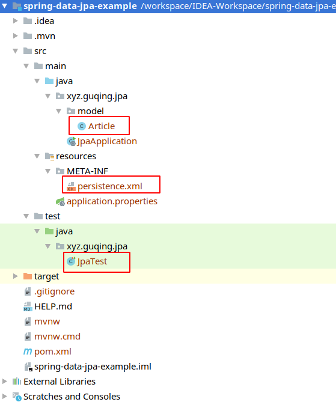

# Spring Data JPA

## JPA 回顾

### JPA 基础

​ `Hibernate`是一个全自动的`ORM`框架，是对`JDBC`技术的封装，它在实体类的数据库表之间建立映射关系，使得程序员可以在使用面向对象变成思维来操作数据库，而`Hibernate`自动给我们生成`SQL`语句。

​ `JPA`的全称是`Java Persistence API`，即`Java`持久化`API`，是`SUN`公司退出的一套基于`ORM`规范，注意不是`ORM`框架——因为`JPA`并未提供`ORM`实现，它只是提供了一些变成的`API`接口。


`JPA`(`ORM`规范)的作用：使得实现`JPA`规范的`ORM`框架可以自由切换

`ORM`框架的作用：简化`JDBC`的代码

### JPA 基本注解

#### @Entity

标注用于实体类声明语句之前，指出该`Java`类为实体类，将映射到指定的数据库表。如声明一个实体类`Customer`，将它映射到数据的`coustomer`表上。

```java
import javax.persistence.Entity;

@Entity
public class Person {
  //...
}
```

#### @Table

- 当实体类与其映射的数据库表名不同名时，需要使用`@Table`标注说明，该注解与`@Entity`标注并列使用，置于实体类声明语句之前，可写于单独语句行，也可与声明数据同行。
- `@Table`标注的常用选项是`name`，用于指明数据库的表名。
- `@Table`标注还有两个可选项`catalog`和`schema`用于设置表所属的数据库目录或模式，通常为数据库名。
- `uniqueConstraints`选项用于设置约束条件，通常不须设置。

```java
import javax.persistence.Entity;
import javax.persistence.Table;

@Entity
@Table(name = "tb_person")
public class Person {
  // ....
}
```

#### @Id

- `@Id`标注用于声明一个实体类的属性映射为数据库的主键列。该属性通常置于属性声明语句之上，可与声明数据同行，也可写在单独行上。
- `@Id`标注也可置于属性的`getter`方法之上。

```java
@Entity
@Table(name = "tb_person")
public class Person {
    @Id
    private Integer id;

    private String name;
    // ......
}
```

#### @GeneratedValue

- `@GeneratedValue`用于标注主键的生成策略，通过`strategy`属性指定。默认情况下，`JPA`自动选择一个最合适底层数据库的主键生成策略：`SqlServer`对应`identity`，`MySql`对应`auto increment`。
- 在`javax.persistence.GenerationType`中定义了以下几种可供选择的策略：

```markdown
IDENTITY：采用数据库 ID 自增长的方式来自增主键字段，Oracle 不支持这种方式（oracle12g 后，应该支持了。）

AUTO：JPA 自动选择合适的策略，是默认选项

SEQUENCE：通过序列产生主键，通过@SequenceGenerator 注解指定序列名，MySql 不支持这种方式。

TABLE：通过表产生键，框架借助由表模拟序列产生主键，使用该策略可以使应用更易于数据库移植。
```

使用实例：

```java
@Entity
@Table(name = "tb_person")
public class Person {
    @Id
    @GeneratedValue(strategy = GenerationType.IDENTITY)
    private Integer id;

    private String name;
    // ......
}
```

#### @Column

- 当实体的属性与其映射的数据库表的列不同名时需要使用`@Column`标注说明，该属性通常置于实体的属性声明语句之前，还可与`@Id`标注一起使用。
- `@Column`标注的常量属性是 name，用于设置映射数据库表的列名。此外，该注解还包含其他多个属性，比如：`unique`，`nullable`，`length`等。
- `@Column`标注的`columnDefinition`属性：表示该字段在数据中的实际类型，通常`ORM`框架可以根据属性类型自动判断数据中的字段的类型，但是对于`Date`类型仍无法确定数据库中字段类型究竟是`Date`,`Time`还是`Timestamp`。此外，`String`的默认类型为`varchar`，如果要将`String`类型映射到特定数据库的`BLOB`或`Text`字段类型。
- `@Column`标注也可以置于属性的`getter`方法之上。

```java
@Entity
@Table(name = "article")
public class Article {
    @Id
    @GeneratedValue(strategy = GenerationType.IDENTITY)
    private Integer id;

    @Column(name = "author", nullable = false, length = 255)
    private String author;

    // ......
}
```

#### @Basic

- `@Basic`表示一个简单的属性到数据库表的字段的映射，对于没有任何标注的`getXxx()`方法，默认即为`Basic`
- `fetch`：表示该属性的读取策略，有`EAGER`和`LAZY`两种，分别表示主支抓取和延迟加载，默认为`EAGER`
- `optional`：表示该属性是否允许为`null`,默认为`true`。


#### @Transient

- 表示该属性并非一个到数据库表的字段的映射，`ORM`框架将忽略该属性。
- 如果一个属性并非数据库的字段映射，就务必将其标示为`@Transient`，否则，`ORM`框架默认其注解为`@Basic`。

假设`Person`类需要扩展一个帮助方法，`getUserInfo()`

```java
// 帮助方法，不希望保存到数据库，但是需要动态获取Customer对象的属性。
public String getUserInfo() {
    return "username:" + fullName + ",age:" + age;
}
```

此时，运行时抛出异常，解决方式，而且又不抛异常的方案：需要在`getUserInfo()`方法上添加注解`@Transient`

```java
@Transient
public String getUserInfo() {
    return "username:" + fullName + ",age:" + age;
}
```

#### @Temporal

- 在核心的`JAVA API`中并没有定义`Date`类型的精度（`temporal precision`）。而在数据库中，表示`Date`类型的数据类型有`DATE`，`TIME`和`TEIMSTAMP`三种精度（即单纯的日期，时间，或者两者兼备）。在运行属性映射是可使用
- `@Temporal`注解来调整`Date`精度。

```java
@Entity
@Table(name = "article")
public class Article {
	// ......
    @Temporal(TemporalType.DATE)
    private Date crateTime;
    // ......
```

### JPA 实战

#### 目标

本章节我们要实现的功能是搭建`JPA`环境，并实现一条数据的增删改查。

#### 准备数据库环境

```mysql
# 创建数据库
CREATE DATABASE `spring-data-jpa`;
# 需要手动建表
Create TABLE `article`
(
  `id`         int(11) NOT NULL auto_increment COMMENT '主键',
  `author`     varchar(255) default NULL COMMENT '作者',
  `title`      varchar(255) default NULL COMMENT '标题',
  `createTime` datetime     default NULL COMMENT '创建时间',
  `modifyTime` datetime     default NULL COMMENT '修改时间',
  PRIMARY KEY (`id`)
);
```

#### 创建 Java 项目导入坐标

创建一个 Java 项目，可以是普通 Java 项目然后手动导入 jar 包，也可以是 maven 项目添加`JPA`的依赖如下图：


这里为了后续使用`Spring data Jpa`方便，直接创建`SpringBoot`项目，然后引入依赖如下:

```xml
<dependency>
    <groupId>mysql</groupId>
    <artifactId>mysql-connector-java</artifactId>
</dependency>
<dependency>
    <groupId>org.springframework.boot</groupId>
    <artifactId>spring-boot-starter-data-jpa</artifactId>
</dependency>
<!-- 使用lombok-->
<dependency>
    <groupId>org.projectlombok</groupId>
    <artifactId>lombok</artifactId>
    <optional>true</optional>
</dependency>
<dependency>
    <groupId>org.springframework.boot</groupId>
    <artifactId>spring-boot-starter-test</artifactId>
    <scope>test</scope>
    <exclusions>
        <exclusion>
            <groupId>org.junit.vintage</groupId>
            <artifactId>junit-vintage-engine</artifactId>
        </exclusion>
    </exclusions>
</dependency>
```

本测试项目使用`lombok`来简化实体类的书写，需要 IDEA 需要先安装[lombok](https://projectlombok.org/)插件，或者如果不使用`lombok`插件在实体类中手动添加`get-set`方法。

工程结构如下：



#### 创建实体类

```java
/**
 * 文章实体类
 * @author guqing
 * @date 2019-12-18 17:02
 */
@Data
@Entity
@Table(name = "article")
public class Article {
    @Id
    @GeneratedValue(strategy = GenerationType.IDENTITY)
    private Integer id;
    @Column(name = "author", nullable = false)
    private String author;
    private String title;
    private Date createTime;
    private Date modifyTime;
}
```

#### 加入 JPA 的核心配置文件

如下图所示，在`resources`下创建一个`META-INF`目录然后创建一个`persistence.xml`


然后写上如下配置：

```xml
<?xml version="1.0" encoding="utf-8" ?>
<persistence xmlns="http://java.sun.com/xml/ns/persistence"
             xmlns:xsi="http://www.w3.org/2001/XMLSchema-instance"
             xsi:schemaLocation="http://java.sun.com/xml/ns/persistence http://java.sun.com/xml/ns/persistence/persistence_2_0.xsd"
             version="2.0"
>
    <!--持久化单元,name持久化单元的名称唯一，transaction-type事物类型：RESOURCE_LOCAL表示本地事物，JTA表示分布式事物-->
    <persistence-unit name="jpaUnit" transaction-type="RESOURCE_LOCAL">
        <!--配置JPA规范的服务提供商，当项目中只有一个JPA的实现时，此设置可以省略如只导入Hibernate依赖-->
        <provider>org.hibernate.jpa.HibernatePersistenceProvider</provider>
        <properties>
            <!--数据库驱动-->
            <property name="javax.persistence.jdbc.driver" value="com.mysql.jdbc.Driver"/>
            <!--数据库地址-->
            <property name="javax.persistence.jdbc.url" value="jdbc:mysql:///spring-data-jpa"/>
            <!--数据库用户名-->
            <property name="javax.persistence.jdbc.user" value="root"/>
            <!--数据库密码-->
            <property name="javax.persistence.jdbc.password" value="123456"/>
        </properties>
    </persistence-unit>
</persistence>
```

以上是基本配置，由于使用的`JPA`规范的具体实现是`hibernate`所以还可以配置`Hibernate`的参数，如下图所示：


如果配置了`hbm2ddl.auto`则可以不需要手动创建数据库表。

#### 单元测试

为了快速演示，一下代码再进行公共代码或工具类抽取，也不考虑异常情况下的事物回滚以及关闭资源操作。

```java
class JpaTest {

    @Test
    void testSave() {
        // 创建文章对象
        Article article = new Article();
        article.setTitle("使用JPA");
        article.setAuthor("guqing");
        article.setCreateTime(new Date());
        article.setModifyTime(new Date());

        // 使用JPA将文章对象保存到数据库中
        // 1.创建一个持久化管理器工厂
        String persistenceUnitName = "jpaUnit";
        EntityManagerFactory factory = Persistence.createEntityManagerFactory(persistenceUnitName);

        // 2.创建持久化管理器
        EntityManager entityManager = factory.createEntityManager();

        // 3.获取事物并开启
        EntityTransaction transaction = entityManager.getTransaction();
        transaction.begin();

        // 4.操作
        entityManager.persist(article);

        // 5.提交事务
        transaction.commit();

        // 6.关闭资源,factory工厂不需要手动关闭
        entityManager.close();
    }

    @Test
    void testFind() {
        String persistenceUnitName = "jpaUnit";
        EntityManagerFactory factory = Persistence.createEntityManagerFactory(persistenceUnitName);

        EntityManager entityManager = factory.createEntityManager();

        EntityTransaction transaction = entityManager.getTransaction();
        transaction.begin();

        // 查询主键值为1的数据
        Article article = entityManager.find(Article.class, 1);
        System.out.println(article);

        transaction.commit();
        entityManager.close();
    }

    @Test
    void testUpdate() {
        String persistenceUnitName = "jpaUnit";
        EntityManagerFactory factory = Persistence.createEntityManagerFactory(persistenceUnitName);

        EntityManager entityManager = factory.createEntityManager();

        EntityTransaction transaction = entityManager.getTransaction();
        transaction.begin();

        // 先查询再修改
        Article article = entityManager.find(Article.class, 1);
        article.setTitle("使用JPA，被修改方法修改过");
        article.setModifyTime(new Date());
        // 更新
        entityManager.merge(article);

        transaction.commit();
        entityManager.close();
    }

    @Test
    void testDelete() {
        String persistenceUnitName = "jpaUnit";
        EntityManagerFactory factory = Persistence.createEntityManagerFactory(persistenceUnitName);

        EntityManager entityManager = factory.createEntityManager();

        EntityTransaction transaction = entityManager.getTransaction();
        transaction.begin();

        // 先查询再删除
        Article article = entityManager.find(Article.class, 1);
        // 删除
        entityManager.remove(article);

        transaction.commit();
        entityManager.close();
    }
}
```

### JPA 的重要 API 介绍

#### EntityManagerFactory

`EntityManagerFactory`接口主要用来创建`EntityManager`实例，它是一个线程安全的对象，并且其创建极其浪费资源，所以在写代码的过程中要保持它是单例的。

#### EntityManager

在`JPA`规范中，`EntityManager`是操作数据的重要`API`，它是线程不安全的，需要保持线程独有。

重要方法说明：

- `getTransaction`: 获取事物对象
- `persist`: 保存操作
- `merge`: 更新操作
- `remove`: 删除操作
- `find/getReference`: 根据 id 查询

## Spring Data JPA

### 简介

`SpringData Jpa`是`Spring Data`家族的一个成员，是`Spring Data`对`JPA`封装之后的产物，目的在于简化基于`JPA`的数据访问技术。使用`Spring Data JPA`技术之后，开发者只需要声明`Dao`层的接口，不必再写实现类或其他代码，剩下的一切交给`Spring Data Jpa`搞定。

### 快速入门

搭建`Spring Data Jpa`环境，并实现数据的增删该查

#### 环境准备

本章节继续使用`JPA回顾`章节中创建的项目，`pom.xml`文件和目录结构也不需要改变。

新增内容如下：

创建持久层类`ArticleRepository`：

```java
package xyz.guqing.jpa.repository;

import org.springframework.data.jpa.repository.JpaRepository;
import xyz.guqing.jpa.model.Article;
/**
 * 文章实体类对于的持久化接口
 * @author guqing
 * @date 2019-12-18 20:48
 */
public interface ArticleRepository extends JpaRepository<Article, Integer> {
}
```

对于使用`Mysql`数据库而言，持久层接口需要继承`JpaRepository`，它有两个泛型参数，第一个是该持久层对于的实体类，第二个参数是实体类中对应数据库表的主键属性的类型，也就是加了`@Id`注解的属性类型。

配置`application.yaml`

```yaml
spring:
  datasource:
    driver-class-name: com.mysql.cj.jdbc.Driver
    url: jdbc:mysql:///spring-data-jpa
    username: root
    password: 123456
  jpa:
    hibernate:
      ddl-auto: update
```

创建测试类`SpringDataJpaTest`

```java
/**
 * Spring Data Jpa 测试类
 * @author guqing
 * @date 2019-12-18 21:02
 */
@SpringBootTest
public class SpringDataJpaTest {

}
```

由于`JPA`回顾中创建的`META-INF`以及`测试类`不需要可以删除也可以留着，此时工程结构如下：


#### 测试

```java
/**
 * Spring Data Jpa 测试类
 * @author guqing
 * @date 2019-12-18 21:02
 */
@SpringBootTest
public class SpringDataJpaTest {
    @Autowired
    private ArticleRepository articleRepository;

    @Test
    public void testSave() {
        Article article = new Article();
        article.setAuthor("guqing");
        article.setTitle("Hello Spring Data Jpa");
        article.setCreateTime(new Date());
        article.setModifyTime(new Date());
        articleRepository.save(article);
    }

    @Test
    public void testFindById() {
        Optional<Article> articleOptional = articleRepository.findById(2);
        // java8的新特性
        articleOptional.ifPresent(System.out::println);
    }

    @Test
    public void findAll() {
        List<Article> articles = articleRepository.findAll();
        articles.forEach(System.out::println);
    }

    @Test
    public void testUpdate() {
        Article article = new Article();
        article.setId(2);
        article.setModifyTime(new Date());
        article.setTitle("快速入门Spring Data JPA");
        // 保存和修改都是save()方法，实体对象中存在id就更新
        // 建议先查询在更细，否则对象中没有设置的值数据库中会被设置为null
        articleRepository.save(article);
    }


    @Test
    public void testDelete() {
        articleRepository.deleteById(2);
    }
}
```

关于其中应用到的`JDK8`新特性可以参考[Java8 新特性](https://plum.guqing.me/views/java8/features.html)

## 关于 Repository

使用`Spring Data Repository`可极大地简化为了实现各种持久层的数据库访问而写的样板代码量。也就是`Spring Data Jpa`快速入门中继承的`Repository`接口，继承了`Repository`就获得了丰富的`CURD`能力。

### 核心概念

`Spring Data`库的核心接口是`Repository`。它使用`domain`类去管理,`domain`类中的`id`类型作为类型参数。这个接口主要作为一个标记接口,依靠具体的类型运作并帮助您发现接口,`CrudRepository`提供丰富的`CRUD`功能去管理实体类。

`Spring Data Repository`的结构树如下图所示（`ArticleRepository`使我们自己写的接口继承了`JpaRepository`）：


关于 `CrudRepository`接口：

```java
public interface CrudRepository<T, ID extends Serializable>
extends Repository<T, ID> {
    <S extends T> S save(S entity); (1)

    T findOne(ID primaryKey); 		(2)

    Iterable<T> findAll(); 			(3)

    Long count(); 					(4)

    void delete(T entity); 			(5)

    boolean exists(ID primaryKey);  (6)
    // ... more functionality omitted.
}
```

方法说明：

(1) 保存给定的实体。
(2) 返回给定 id 的实体。
(3) 返回所有实体。
(4) 返回实体的数量。
(5) 删除给定的实体。
(6) 表明一个指定 id 的实体是否存在。

> `Spring Data Jpa`还提供持久性特定于技术的抽象如 `JpaRepository`或`MongoRepository`. 如上图继承树所示那样，这些接口继承于`CrudRepository`,实现了特定的一些功能

`CrudRepository`有一个`PagingAndSortingRepository`抽象,增加了额外的方法来简化对实体的分页访问:

`PagingAndSortingRepository`接口如下：

```java
public interface PagingAndSortingRepository<T, ID extends Serializable>
extends CrudRepository<T, ID> {
    Iterable<T> findAll(Sort sort);
    Page<T> findAll(Pageable pageable);
}
```

进入`用户类别`的第二页(每一页的条目是 20)，可以照下面这样来分页

```java
PagingAndSortingRepository<User, Long> repository = // ... get access to a bean
Page<User> users = repository.findAll(PageRequest.of(1, 20));
```

除了查询方法外,还有统计查询和删除查询:

```java
public interface UserRepository extends CrudRepository<User, Long> {
	Long countByLastname(String lastname);
}
```

查询并删除:

```java
public interface UserRepository extends CrudRepository<User, Long> {
    Long deleteByLastname(String lastname);
    List<User> removeByLastname(String lastname);
}
```

### 查询方法

标准的`CRUD`功能存储库通常对底层数据存储查询。`Spring Data`把这些查询变成了四个步骤的过程:

1、声明一个接口继承`Repository`或其子类,输入实体类型和`ID`类型。

```java
interface PersonRepository extends Repository<User, Long> { ... }
```

2、在接口里声明查询方法。

```java
interface PersonRepository extends Repository<Person, Long> {
	List<Person> findByLastname(String lastname);
}
```

3、为这些接口创建代理实例,也可通过 `JavaConfig`:

```java
import org.springframework.data.jpa.repository.config.EnableJpaRepositories;
@EnableJpaRepositories
class Config {}
```

或通过`xml`配置

```xml
<?xml version="1.0" encoding="UTF-8"?>
<beans xmlns="http://www.springframework.org/schema/beans"
    xmlns:xsi="http://www.w3.org/2001/XMLSchema-instance"
    xmlns:jpa="http://www.springframework.org/schema/data/jpa"
    xsi:schemaLocation="http://www.springframework.org/schema/beans
        http://www.springframework.org/schema/beans/spring-beans.xsd
        http://www.springframework.org/schema/data/jpa
        http://www.springframework.org/schema/data/jpa/spring-jpa.xsd">

    <jpa:repositories base-package="com.acme.repositories"/>
</beans>
```

本例中使用了`JPA`名称空间。如果您正在使用`repository`中的抽象为任何其他数据源,你需要改
变这种适当的名称空间声明你的存储模块来与`jpa`支持,例如:`mongodb`。
注意,不用通过`Java`变量来配置包,默认情况下回根据注解的类来自动声明。定制的包扫描
可以使用`basePackage`属性,特定的库可以使用`@Enable`来注解。

获得 repository 实例注入并使用它:

```java
public class SomeClient {
    private final PersonRepository repository;

    @Autowired
    public SomeClient(PersonRepository repository) {
        this.repository = repository;
    }

    public void doSomething() {
    	List<Person> persons = repository.findByLastname("Matthews");
	}
}
```

### 定义查询方法

由于`Spring JPA Repository`的实现原理是采用动态代理的机制，所以有定义查询方法：

- 从方法名称中可以指定特定用于存储的查询和更新
- 通过使用`@Query`手动定义的查询

具体采用哪一种，取决于实际存储操作, 但是，必须要指定一种策略用于创建实际的查询。

#### @Query 查询

一个类似`HQL`的语法,在接口上使用`@Query`标识：

```java
@Query("select a from user a where a.id = ?1")
public User findById(Long id);
```

使用`@Modifying`标识修改

```java
@Modifying
@Query("update User a set a.name = ?1 where a.id < ?2")
public int updateName(String name, Long id);
```

携带分页信息:

```java
@Query("select u from User u where u.name=?1")
public List<User> findByName(String name, Pageable pageable);
```

除此之外也可以使用原生`sql`，只需要`@Query(nativeQuery=true)`标识即可如：

```java
@Query(value = "select * from book b where b.name=?1", nativeQuery = true)
List<Book> findByName(String name);
```

使用`@Param`注解注入参数:

```java
@Query(value = "select name,author,price from Book b where b.name = :name AND b.author=:author AND b.price=:price")
List<Book> findByNamedParam(@Param("name") String name, @Param("author") String author,
        @Param("price") long price);
```

`SPEL`表达式(使用时请参考最后的补充说明)

```java
public interface BookQueryRepositoryExample extends Repository<Book, Long>{
    // #{#entityName}的值为Book对象对应的数据表名称(book)。
	@Query(value = "select * from #{#entityName} b where b.name=?1")
	List<Book> findByName(String name);
}
```

> 先来说一说`#{#entityName}`到底是个啥。从字面来看，`#{#entityName}`不就是实体类的名称么，对，他就是。
>
> 实体类`Book`,使用`@Entity`注解后，`spring`会将实体类`Book`纳入管理。默认`#{#entityName}`的值就是`Book`。
>
> 但是如果使用了`@Entity(name = "book")`来注解实体类`Book`,此时`#{#entityName}`的值就变成了`book`。

#### 根据方法名称创建查询

`query builder`机制内置为构建约束查询库的实体。 带前缀的机
制`findXXBy`,`readAXXBy`，`queryXXBy`, `countXXBy`,`getXXBy`自动解析的其余部分。进一步引入子句可以包含表达式等。第一个
示实际的标准的开始。 还可以定义条件`And`或者`Or`。

如根据方法名创建查询示例：

```java
public interface PersonRepository extends Repository<User, Long> {
    List<Person> findByEmailAddressAndLastname(EmailAddress emailAddress, String lastnam
    e);

    // Enables the distinct flag for the query
    List<Person> findDistinctPeopleByLastnameOrFirstname(String lastname, String firstna
    me);

    List<Person> findPeopleDistinctByLastnameOrFirstname(String lastname, String firstna
    me);

    // Enabling ignoring case for an individual property
    List<Person> findByLastnameIgnoreCase(String lastname);

    // Enabling ignoring case for all suitable properties
    List<Person> findByLastnameAndFirstnameAllIgnoreCase(String lastname, String firstna
    me);

    // Enabling static ORDER BY for a query
    List<Person> findByLastnameOrderByFirstnameAsc(String lastname);

    List<Person> findByLastnameOrderByFirstnameDesc(String lastname);
}
```

如上查询的规则是：`find+全局修饰+By+实体的属性名称+限定词+连接词+ …(其它实体属性)+OrderBy+排序属性+排序方向`。

```markdown
全局修饰： Distinct， Top， First

关键词： IsNull， IsNotNull， Like， NotLike， Containing， In， NotIn，IgnoreCase， Between， Equals， LessThan， GreaterThan， After， Before…

排序方向： Asc， Desc

连接词： And， Or
```

::: tip 解释说明

- `And`： 等价于 `SQL` 中的 `and` 关键字，比如 `findByUsernameAndPassword(String user, Striang pwd)`；

- `Or`： 等价于 `SQL` 中的 `or` 关键字，比如 `findByUsernameOrAddress(String user, String addr)`

- `Between`： 等价于 `SQL`中的 `between` 关键字，比如 `findBySalaryBetween(int max, int min)`

- `LessThan`： 等价于`SQL` 中的 `<`，比如 `findBySalaryLessThan(int max)`

- `GreaterThan`： 等价于 `SQL` 中的`>`，比如 `findBySalaryGreaterThan(int min)`

- `IsNull`： 等价于 `SQL` 中的 `is null`，比如 `findByUsernameIsNull()`

- `IsNotNull`： 等价于 `SQL` 中的 `is not null`，比如 `findByUsernameIsNotNull()`

- `NotNull`： 与 `IsNotNull`等价；

- `Like`： 等价于`SQL`中的 `like`，比如 `findByUsernameLike(String user)`

- `NotLike`： 等价于`SQL` 中的 `not like`，比如 `findByUsernameNotLike(String user)`

- `OrderBy`： 等价于 `SQL` 中的 `order by`，比如 `findByUsernameOrderBySalaryAsc(String user)`

- `Not`： 等价于 `SQL` 中的 `！=`，比如 `findByUsernameNot(String user)`；

- `In`： 等价于 `SQL` 中的 `in`，比如 `findByUsernameIn(Collection userList)`，方法的参数可以是 `Collection` 类型，也可以是数组或者不定长参数；

- `NotIn`： 等价于 `SQL` 中的 `not in`，比如 `findByUsernameNotIn(Collection userList)`，方法的参数可以是 `Collection` 类型，也可以是数组或者不定长参数；

:::

#### 查询顺序

如上介绍的两种查询方法就会发现，假如使用`@Query`时发现方法名称也符合查询规则，此时该怎么办呢，它该优先采用哪种策略呢？

`Spring Data JPA`在为此， 提供了 `query-lookup-strategy` 属性，用以指定查找的顺序。它有如下三个取值：

- `create` ：通过解析方法名字来创建查询。即使有符合的命名查询，或者方法通过 @Query 指定的查询语句，都将会被忽略。
- `create-if-not-found`：如果方法通过 `@Query`指定了查询语句，则使用该语句实现查询；如果没有，则查找是否定义了符合条件的命名查询，如果找到，则使用该命名查询；如果两者都没有找到，则通过解析方法名字来创建查询。这是 `query-lookup-strategy`属性的默认值。
- `use-declared-query`：如果方法通过`@Query` 指定了查询语句，则使用该语句实现查询；如果没有，则查找是否定义了符合条件的命名查询，如果找到，则使用该命名查询；如果两者都没有找到，则抛出异常。

#### 嵌套属性查询

如上例所示，属性表达式只能引用被管实体的直接属性。在查询创建时，您已经确保已解析的属性是托管域类的属性。但是，您也可以通过遍历嵌套属性来定义约束。考虑以下方法签名：

```java
List<Person> findByAddressZipCode(ZipCode zipCode);
```

假设`Person`的`Address`(地址)中带有`ZipCode`(邮编)属性。在这种情况下，该方法将创建属性遍历`x.address.zipCode`。解析算法首先将整个部分（`AddressZipCode`）解释为属性，然后检查域类中具有该名称的属性（未大写）。如果算法成功，它将使用该属性。如果不是，该算法将驼峰案例部分的源从右侧分为头和尾，并尝试找到相应的属性-在我们的示例中为`AddressZip`和`Code`。如果该算法找到了具有该头部的属性，则它将采用该头部，并继续从那里开始构建树，以刚才描述的方式将尾部向上拆分。如果第一个分割不匹配，则算法会将分割点移到左侧（`Address`，`ZipCode`）并继续。

尽管这在大多数情况下应该可行，但是算法可能会选择错误的属性。假设`Person`该类也具有一个`addressZip`属性。该算法将在第一轮拆分中已经匹配，选择错误的属性，然后失败（因为类型`addressZip`可能没有`code`属性）。

要解决这种歧义，您可以`_`在方法名称内部使用手动定义遍历点。因此，我们的方法名称如下：

```java
List<Person> findByAddress_ZipCode(ZipCode zipCode);
```

如果你的属性名称包含下划线(如`first_name`中的下划线),建议使用驼峰的方式来替换它。

#### 特殊参数处理

处理参数查询只需方法参数定义为已经在上面的例子中。 除了基础查询将会认识到某些特定
类型`Pageable`和`Sort`应用动态查询分页和排序

例如：使用`Pageable`、`Slice`和`Sort`来查询

```java
Page<User> findByLastname(String lastname, Pageable pageable);
Slice<User> findByLastname(String lastname, Pageable pageable);
List<User> findByLastname(String lastname, Sort sort);
List<User> findByLastname(String lastname, Pageable pageable);
```

> 接受`Sort`并`Pageable`期望将非`null`值传递给方法的`API` 。如果不想应用任何排序或分页，请使用`Sort.unsorted()`和`Pageable.unpaged()`。

第一个方法允许在你的查询方法的静态定义查询中通过一个
`org.springframework.data.domain.Pageable`实例来动态的添加分页。分页类知道元素的总数
和可用页数。它通过基础库来触发一个统计查询计算所有的总数。由于这个查询开销很大,所以可以使用`Slice`来替代。`Slice`仅仅知道是否有下一个`Slice`可用,这对查询大数据已经足够了。

排序选项也通过`Pageable`实例处理。如果只需要排序，则将一个`org.springframework.data.domain.Sort`参数添加到方法中。如您所见，返回一个 `List`也是可能的。在这种情况下，`Page`不会创建构建实际实例所需的其他元数据（反过来，这意味着不会发出本来必要的其他计数查询）。而是，它将查询限制为仅查找给定范围的实体。

#### 限制查询结果

查询方法的结果可以通过关键字`first`或者`top`来限制,它们可以交替使用。在`top/first`后添加数
字来表示返回最大的结果数。如果没有数字,则默认假定 1 作为结果大小。

例如：用`Top`和`First`查询限制结果大小

```java
User findFirstByOrderByLastnameAsc();

User findTopByOrderByAgeDesc();

Page<User> queryFirst10ByLastname(String lastname, Pageable pageable);

Slice<User> findTop3ByLastname(String lastname, Pageable pageable);

List<User> findFirst10ByLastname(String lastname, Sort sort);

List<User> findTop10ByLastname(String lastname, Pageable pageable);
```

限制表达式也支持`Distinct`关键字。对于限制查询的结果集定义到一个实例中包装这个结果到
一个`Optional`中也是被支持的。

如果分页或者切片被应用到一个限制查询分页(计算多少页可用)则它也能应用于限制结果。

> 要注意结合通过`Sort`参数动态排序的限制结果容许表达查询的方法为`K`最小的,以
> 及`K`最大的元素。

#### 流查询结果

查询方法能对以 JAVA 8 的 Stream 为返回的结果进行逐步处理。而不是简单地包装查询结果在被用来执行流的流数据存储特定的方法。

例如以`JAVA 8`的`Stream`来进行查询的流处理结果

```java
@Query("select u from User u")
Stream<User> findAllByCustomQueryAndStream();

Stream<User> readAllByFirstnameNotNull();

@Query("select u from User u")
Stream<User> streamAllPaged(Pageable pageable);
```

> 一个数据流可能包裹底层数据存储特定资源,因此在使用后必须关闭。 你也可以使用
> `close()`方法或者`JAVA 7 try-with-resources`区块手动关闭数据流。

例如：在`try-with-resources`块中操作一个`Stream`

```java
try(Stream<User stream = repository.findAllByCustomQueryAndStream()){
	stream.forEach(...);
}
```

> 注意：当前不是所有的`Spring Data`模块都支持`Stream`作为返回类型

#### 异步查询结果

```java
@Async
Future<User> findByFirstname(String firstname);					(1)

@Async
CompletableFuture<User> findOneByFirstname(String firstname);	(2)

@Async
ListenableFuture<User> findOneByLastname(String lastname);		(3)
```

- (1) 使用 `java.util.concurrent.Future`作为返回类型
- (2) 使用 `Java 8`的`java.util.concurrent.CompletableFuture`作为返回类型
- (3) 使用 `org.springframework.util.concurrent.ListenableFuture`作为返回类型

### 动态条件查询

#### 使用 Specification 查询

先在自定义的`repository`接口中比如定义一个`PersonRepository`继承`JpaSpecificationExecutor`接口，代码如下：

```java
/**
 * @author guqing
 * @date 2019-12-19 15:31
 */
public interface PersonRepository extends JpaRepository<Person, Integer>, JpaSpecificationExecutor<Person> {
}

```

然后对于`Service`层的方法就可以这么写：

```java
/**
 * @author guqing
 * @date 2019-12-19 15:33
 */
@Service
public class PersonService {
    private final PersonRepository personRepository;

    @Autowired
    public PersonService(PersonRepository personRepository) {
        this.personRepository = personRepository;
    }

    public Page<Person> findAll(QueryParam queryParam) {
        Specification<Person> specification = new Specification<Person>() {
            @Override
            public Predicate toPredicate(Root<Person> root, CriteriaQuery<?> criteriaQuery, CriteriaBuilder criteriaBuilder) {
                List<Predicate> predicates = new ArrayList<Predicate>();
                if(queryParam.getName() != null) {
                    // 这里的name和实体属性对应，不是和数据库字段对应,下面同理
                    predicates.add(criteriaBuilder.equal(root.get("name"), queryParam.getName()));
                }

                if(queryParam.getAge() != null) {
                    predicates.add(criteriaBuilder.le(root.get("age"), queryParam.getAge()));
                }
                //创建一个条件的集合，长度为上面满足条件的个数
                Predicate[] pre = new Predicate[predicates.size()];
                //将上面拼接好的条件返回去
                return criteriaQuery.where(predicates.toArray(pre)).getRestriction();
            }
        };

        return personRepository.findAll(specification, PageRequest.of(0, 15));
    }
}
```

由于`PersonRepository`还继承了`JpaRepository`所以可以使用`Spring Data Jpa`提供的`CRUD`方法。

## 实体关系映射

### 作用

简化编程操作。把冗余的操作交给底层框架来处理。

例如，如果我要给一位新入学的学生添加一位新的老师。而这个老师又是新来的，在学生数据库与教师数据库中均不存在对应的数据。那么我需要先在教师数据库中保存新来的老师的数据，同时在学生数据库中保存新学生的数据，然后再给两者建立关联。
而如果我们使用了实体关系映射，我们只需要将该新教师实体交给该学生实体，然后保存该学生实体即可完成。

### 一对一

一对一关系即两个数据库中的数据一一对应，例如员工和身份证

员工：

```java
@Entity
@Data
@Table
public class Emp{
  @Id
  @GeneratedValue
  privte Integer id;

  @Column(length = 40)
  private String name;

  @OneToOne(cascade = CascadeType.ALL)
  private Identity identity;
}
```

身份证：

```java
@Entity
@Data
@Table
public class Identity{
  @Id
  @GeneratedValue
  privte Integer id;

  @OneToOne(cascade = CascadeType.ALL, mappedBy = "identity")
  private Emp emp;
  //....
}
```

以上例子，双向一对一，`Emp` 为关系拥有方，`Identity`为关系被拥有方。
执行`spring-data-jpa`新增操作时，如果通过`Identity`的数据访问层进行新增操作(`IdentityRepository.save()`)
，`Emp`表和`Identity`表都有数据，但是不会设置这两条数据的关系，`Emp`表中的外键为`null`。
反之，以关系拥有方`Emp`的数据访问层进行新增操作(`EmpRepository.save()`),`Emp`表和`Identity`表都有数据，并且设置了两条数据的关系，即`Emp`表中的外键也得到正确新增。

### 级联关系

关于一对一关系中涉及到的`CascadeType`解释，该选项即为设置级联关系：

- `CascadeType.PERSIST`: `Cascade persist operation`，级联保存操作。持久保存拥有对方实体时，也会持久保存该实体的所有相关数据。

- `CascadeType.REMOVE`: `Cascade remove operation`，级联删除操作。删除当前实体时，与它有映射关系的实体也会跟着被删除。

- `CascadeType.MERGE`: `Cascade merge operation`，级联更新（合并）操作。

- `CascadeType.DETACH`: `Cascade detach operation`，级联脱管/游离操作。如果你要删除一个实体，但是它有外键无法删除，你就需要这个级联权限了。它会撤销所有相关的外键关联。

- `CascadeType.REFRESH`: `Cascade refresh operation`，级联刷新操作。假设场景 有一个订单,订单里面关联了许多商品,这个订单可以被很多人操作,那么这个时候 A 对此订单和关联的商品进行了修改,与此同时,B 也进行了相同的操作,但是 B 先一步比 A 保存了数据,那么当 A 保存数据的时候,就需要先刷新订单信息及关联的商品信息后,再将订单及商品保存。

- `CascadeType.ALL`: `Cascade all operations`，清晰明确，拥有以上所有级联操作权限

**级联保存 Demo:**

```java
public class Student {
    //配置多对多关系
    @ManyToMany(cascade=CascadeType.PERSIST,fetch=FetchType.LAZY)
    private Set<Course> courses = new HashSet<>();
    //其他代码略
}
```

上面的代码中给了`Student对Course`进行级联保存（`cascade=CascadeType.PERSIST`）的权限。此时，若`Student`实体持有的`Course`实体在数据库中不存在时，保存该`Student`时，系统将自动在`Course`实体对应的数据库中保存这条`Course`数据。而如果没有这个权限，则无法保存该`Course`数据。

**设置级联保存**

简单理解：想要级联保存谁，就在这个想要保存对象的字段属性上进行级联的设置`cascade=CascadeType.类型`

1. 实体中需要有别的实体对象，如 A 类中有一个 B 的 Set 集合

```java
class A{
    //B的Set集合，此对象需要new创建出来？看情况
    private Set<B> bSet = new HashSet<B>();
}
```

2. 需要在这个`bSet`集合属性上使用关系映射的注解，并配置级联关系

```java
@ManyToMany(cascade=CascadeType.PERSIST,fetch=FetchType.LAZY)
private Set<B> bSet = new HashSet<B>();
```

3. 然后直接保存对象`A`，当`A`中有`bSet`对象时，就会级联保存了

### 一对多和多对一

- 一对多关系即数据库中的一行数据关联另一个数据库中的多行关系。多对一与之相反。
- 一对多与多对一关系也可能会有中间表关联两者。但是我们一般不建议使用中间表。使用`mapperBy`可以避免系统生成中间表（会在多的一方数据库中增加一个字段记录外键）。
- 在一的一方使用`@OneToMany`，`fetch`默认的是`LAZY`
- 在多的一方使用`@ManyToOne`，`fetch`默认是`EAGER`

举例一：学生和班级的关系，学生是多的一方，班级是一的一方。如果不在多的一方（学生）中使用`mapperBy`来增加外键字段，那么将会生成中间表来维护，不建议这么做。

Student

```java
public class Student {
	//其余略
    @ManyToOne(cascade=CascadeType.ALL,fetch=FetchType.LAZY)
    //学生（对于班级来说是多的一方）是维护方，需要维护外键关系，因此使用@JoinColumn添加外键
    //name：对应的是数据库里的要映射的外键名 referencedColumnName：指向的是班级类（一的一方）的主键
    @JoinColumn(name = "stu_class",referencedColumnName = "id")
    private ClassEntity classEntity;
}
```

`ClassEntity`（班级）

```java
public class ClassEntity {
    @Id
    @GeneratedValue(generator = "idGenerator")
    @GenericGenerator(name = "idGenerator", strategy = "uuid")
    private String id;

    //这里级联仅做了保存关系，班级（一的一方）是被维护方
    @OneToMany(cascade=CascadeType.PERSIST,fetch=FetchType.LAZY,mappedBy="classEntity")
    private Set<Student> students= new HashSet<>();
}
```

举例二：管理员和猫，一个管理员可以有多只猫，管理员能对猫设置所有级联操作，但是猫不能对管理员设置删除级联。

`FairyAdmin`（一的一方，被维护方）

```java
@Data
@ToString(exclude = "catList")
@Entity//交给jpa管理实体，并设置映射到数据库的表名
@Table(name = "tab_admin")
public class FairyAdmin {

    @Id //主键
    @Column(name = "adminId",unique = true,nullable = false) //name属性不写默认和字段一样
    @GeneratedValue(strategy = GenerationType.IDENTITY)//主键由数据库自动生成（主要是自动增长型）
    private Integer adminId;

    @Column(length = 100,unique = true)
    private String adminUsername;

    @Column(length = 100)
    private String adminNickname;

    //一的一方
    @OneToMany(mappedBy = "admin",cascade = CascadeType.ALL,fetch = FetchType.EAGER)
    private List<FairyCat> catList = new ArrayList<FairyCat>();

}
```

`FairyCat`（多的一方，关系的维护方）

```java
@Data
@Entity
@Table(name = "tab_cat")
public class FairyCat {
    @Id
    @GeneratedValue(strategy = GenerationType.IDENTITY)
    private Integer catId;

    @Column(nullable = false)
    private String catName;

    //多的一方，设置了级联增/改/刷新
    @ManyToOne(cascade = {CascadeType.PERSIST,CascadeType.MERGE,CascadeType.REFRESH},fetch = FetchType.EAGER)
    private FairyAdmin admin;
}
```

### 多对多

举例：学生和课程的关系。一位学生，会修多门课程；而一门课程，也会被多位学生修习。此时，双方的关系即为多对多关系。拥有多对多关系的两个实体将会有一个**中间表**来记录两者之间的关联关系。

Student

```java
@Entity
@NoArgsConstructor
@Getter
@Setter
public class Student {

    @Id
    //用了下面Hibernate提供的生成器来做主键
    @GeneratedValue(generator = "idGenerator")
    //Hibernate的通用主键生成器，生成策略时uuid
    @GenericGenerator(name = "idGenerator", strategy = "uuid")
    private String id;

    private String sName;

    //这里直接new了空对象方便直接设置
    @ManyToMany(cascade=CascadeType.ALL,fetch=FetchType.LAZY)
    private Set<Course> courses = new HashSet<>();
}
```

Course

```java
@Entity
@NoArgsConstructor
@Getter
@Setter
public class Course {
    @Id
    @GeneratedValue(generator = "idGenerator")
    @GenericGenerator(name = "idGenerator", strategy = "uuid")
    private String id;
    private String cName;

    // cascade（级联关系）fetch（加载策略）mappedBy（声明关系的维护方）mappedBy
    // 出现在哪一方意味着哪一方不用维护外键关系了
 	@ManyToMany(cascade=CascadeType.ALL,fetch=FetchType.LAZY,mappedBy="courses")
    private Set<Student> students= new HashSet<>();
}
```

`mappedBy`声明于关系的被维护方，声明的值为关系的维护方的关系对象属性名。在实例中，`mappedBy`被声明于`Course`类中，其值为`Student`类中的`Set`对象`courses`。即，`Student`为关系维护方，`Course`为被维护方。

> 关于`mappedBy`可以参考 [有关 mappedBy 的思考](https://www.jianshu.com/p/0ffb8ef64760)
>
> `fetch`管读取，`cascade`管增删改。
>
> **关于 fetch 解释如下：** > `FetchType.LAZY`：懒加载，加载一个实体时，定义懒加载的属性不会马上从数据库中加载。
> `FetchType.EAGER`：急加载，加载一个实体时，定义急加载的属性会立即从数据库中加载。
>
> `@OneToMany`默认的是`LAZY`，`@ManyToOne`默认是`EAGER`

注意：如果使用懒加载，需要在`spring boot`的`application.yaml`中配置

```yaml
spring:
  jpa:
    open-in-view: true
```

这样可以将`session`的关闭延迟到视图层进行，方式提前关闭无法使用`session`。
