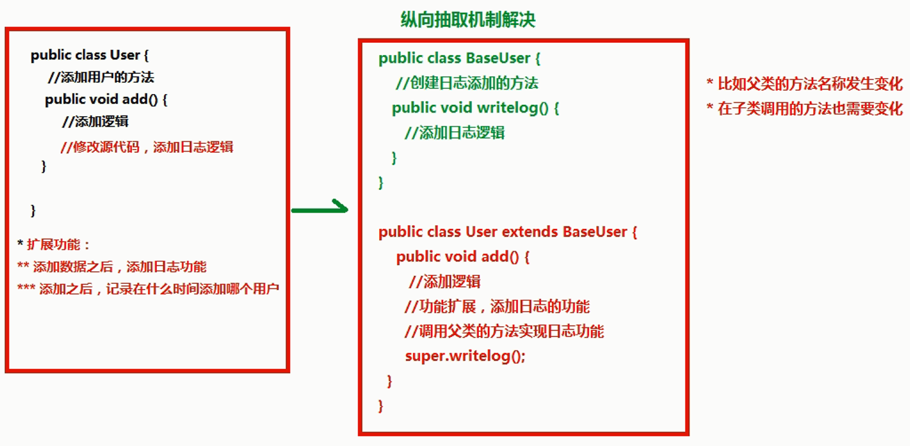

## Spring概念

1. spring是开源的轻量级框架  

2. spring核心主要两部分： 

   （1）aop：面向切面编程，扩展功能不是修改源代码实现 

   （2）ioc：控制反转  

   - 比如有一个类，在类里面有方法（不是静态的方法），调用类里面的方法，创建类的对象，使用对象调用方法，创建类对象的过程，需要new出来对象  
   - 把对象的创建不是通过new方式实现，而是交给spring配置创建类对象  

3. spring是一站式框架 

   （1）spring在javaee三层结构中，每一层都提供不同的解决技术  

   - web层：springMVC  
   - service层：spring的ioc  
   - dao层：spring的jdbcTemplate  

4. spring版本 
   spring4.x  

## Spring的ioc操作

1. 把对象的创建交给spring进行管理  

2. ioc操作两部分： 

   （1）ioc的配置文件方式 

   （2）ioc的注解方式 

## IOC底层原理

* ioc底层原理使用技术 

  （1）xml配置文件 

  （2）dom4j解析xml 

  （3）工厂设计模式 

  （4）反射 
   


## IOC入门案例  

1. 导入jar包 
   做基础功能时core Container只需要Beans、Core、Context、SpEL四个jar包  
   同时导入支持日志输出的jar包：log4j-1.2.jar和commons-logging-1.2.jar  

2. 创建类，在类里面创建方法  

   ```java
   package me.test.ioc;
   
   public class User {
   
       public void add() {
           System.out.println("add........");
       }
   }
   ```

   （1）spring核心配置文件名称和位置不是固定的  

   - 建议放到src下面，官方建议applicationContext.xml  

   （2）引入schema约束  

   - spring-framework-4.3.9.RELEASE\docs\spring-framework-reference\html\xsd-configuration.html文件中去找（从后往前找）

   ```xml
   <beans xmlns="http://www.springframework.org/schema/beans"
   xmlns:xsi="http://www.w3.org/2001/XMLSchema-instance"
   xsi:schemaLocation="
       http://www.springframework.org/schema/beans http://www.springframework.org/schema/beans/spring-beans.xsd">
   ```

3. 创建spring配置文件，配置创建类  

   ```xml
   <!-- ioc入门 -->
   <bean id="user" class="me.test.ioc.User"></bean>
   ```

4. 写代码测试对象创建  
   这段代码在测试中使用，实际开发不会这样使用  

   ```java
   package me.test.ioc;
   
   import org.junit.Test;
   import org.springframework.context.ApplicationContext;
   import org.springframework.context.support.ClassPathXmlApplicationContext;
   
   public class IOCTest {
   
       @Test
       public void userTest() {
           //1加载spring配置文件，根据配置文件创建对象
           ApplicationContext context = new ClassPathXmlApplicationContext("bean1.xml");
           //2得到配置创建的对象
           User user = (User) context.getBean("user");
           System.out.println(user);
           user.add();
       }
   }
   
   /*结果：
   me.test.ioc.User@35d176f7
   add........ */
   ```

## Spring的bean管理（xml方式）

### Bean实例化的方式  

1. 在spring里面通过配置文件 创建对象
2. bean实例化（创建对象）三种方式实现 

**（1）使用类的无参数构造创建（重点，最常用）** 

通过配置文件Spring会去找类中的无参构造函数创建对象 

类中如果没有无参构造函数，会出现异常：No default  constructor found  

**（2）使用静态工厂创建** 
创建静态的方法，返回类对象 

bean实体

```java
public class bean2 {
    public void add(){
        System.out.println("bean2........");
    }
}
```

工厂类

```java
public class Bean2Factory {
	//静态的方法，返回Bean2对象
	public static bean2 getBean2(){
		return new bean2();
	}
}
```

spring配置

```xml
<!-- 使用静态工厂创建对象 -->
<bean id="bean2" class="bean.Bean2Factory" factory-method="getBean2"></bean>
```

**（3）使用实例工厂创建** 

```java
public class Bean3 {
	public void add(){
		System.out.println("bean3........");
	}
}

```

创建不是静态的方法，返回类对象

```java
public class Bean3Factory {
	//普通的方法，返回Bean3对象
	public Bean3 getBean3() {
		return new Bean3();
	}
}

```

spring配置

```java
<!-- 使用实例工厂创建对象 -->
<!-- 创建工厂对象 -->
<bean id="bean3Factory" class="bean.Bean3Factory"></bean>
<bean id="bean3" factory-bean="bean3Factory" factory-method="getBean3"></bean> 

```

### Bean标签常用属性  

1. id属性：定义的名称，id属性值名称任意命名   

   - id属性值，不能包含特殊符号  
   - 根据id值得到配置对象  

2. class属性：创建对象所在类的全路径  

3. name属性： 
   功能和id属性一样的，id属性值不能包含特殊符号，但是在name属性值里面可以包含特殊符号  
   老版本为兼容struts1的name属性，现在基本只是用id属性  

4. scope属性  

   - singleton：默认值，单例（重点）  

   ```xml
   <bean id="user" class="me.test.ioc.User" scope="singleton"></bean>
   
   ```

   ```java
   User user = (User) context.getBean("user");
   System.out.println(user);
   
   User user2 = (User) context.getBean("user");
   System.out.println(user2);
   
   //结果是一个对象
   me.test.ioc.User@35d176f7
   me.test.ioc.User@35d176f7
   
   ```

   - prototype：多例（用在配置action）（重点）  

   ```xml
   <bean id="user" class="me.test.ioc.User" scope="prototype"></bean>
   
   ```

   ```java
   User user = (User) context.getBean("user");
   System.out.println(user);
   
   User user2 = (User) context.getBean("user");
   System.out.println(user2);
   
   //结果是两个不同的对象
   me.test.ioc.User@5c5a1b69
   me.test.ioc.User@3701eaf6
   
   ```

   - request：创建对象把对象放到request域里面（了解）  
   - session：创建对象把对象放到session域里面（了解）  
   - globalSession：创建对象把对象放到globalSession里面（全局session）（了解）


### 属性注入介绍

创建对象时候，向类里面属性里面设置值  

* 属性注入的方式介绍（三种方式）

  1. 使用 set() 方法注入
  2. 使用有参数构造注入
  3. 使用接口注入

  Java代码可以实现示例
  

* 在spring框架里面，支持前两种方式  

  1. set方法注入（重点，主要都是通过这种方式）  

  ```java
  package me.test.property;
  public class Book {
      private String bookname;
  
      public void setBookname(String bookname) {
          this.bookname = bookname;
      }
      
      public void bookTest() {
          System.out.println("book...." + bookname);
      }
  }
  
  ```

  配置文件配置注入的属性和值  

  ```xml
  <!-- 使用set方法注入属性 -->
  <bean id="book" class="me.test.property.Book">
      <!-- 注入属性值
      name属性值：类里面定义的属性名称  
      value属性：设置具体的值	
      -->
      <property name="bookname" value="西游记"></property>
  </bean>
  
  ```

  测试  

  ```java
  public void bookTest() {
      // 1. 加载Spring配置文件，根据创建对象
      ApplicationContext context = new ClassPathXmlApplicationContext("bean1.xml");
      // 2. 得到配置创建的对象
      Book book = (Book) context.getBean("book");
      book.bookTest();
  }
  
  //结果：book....西游记
  
  ```

  2. 有参数构造注入（用的不是很多）

  ```java
  package me.test.property;
  
  public class PropertyTestDemo {
  
      private String username;
  
      public PropertyTestDemo(String username) {
          super();
          this.username = username;
      }
      
      public void propertyTest() {
          System.out.println("PropertyTest......" + username);
      }
  }
  
  ```

  配置文件配置注入的属性和值  

  ```xml
  <!-- 使用有参构造注入属性 -->
  <bean id="property" class="me.test.property.PropertyTestDemo">
      <!-- 使用有参构造 -->
      <constructor-arg name="username" value="张三"></constructor-arg>
  </bean>
  
  ```

  测试  

  ```java
  public void propertyTest() {
  	ApplicationContext context = new ClassPathXmlApplicationContext("bean1.xml");
  	PropertyTestDemo property = (PropertyTestDemo) context.getBean("property");
  	property.propertyTest();
  }
  
  //结果：PropertyTest......张三
  
  ```

## 注入对象类型属性（重点）

之前要获取dao对象，action要new一个service对象，service中又要new一个dao对象，现在把new的过程交给spring来操作  

* 具体实现过程（不通过new） 
  dao层

  ```java
  package me.test.ioc;
  public class UserDao {
      public void add() {
          System.out.println("userDao.....");
      }
  }
  
  ```

  1. 在service里面把dao作为类型属性
  2. 生成dao类型属性的set方法

  ```java
  package me.test.ioc;
  
  public class UserService {
  
      //1 定义dao类型属性
      private UserDao userDao;
      
      //2 生成set方法
      public void setUserDao(UserDao userDao) {
          this.userDao = userDao;
      }
  
      public void add() {
          System.out.println("userService.....");
          // 得到UserDao对象，调用其方法
          userDao.add();
      }
  }
  
  ```

  3. 配置文件中注入关系

  ```xml
  <!-- 注入对象类型属性 -->
  <!-- 1配置service和dao对象 -->
  <bean id="userDao" class="me.test.ioc.UserDao"></bean>
  
  <bean id="userService" class="me.test.ioc.UserService">
      <!-- 注入dao对象
           name属性值：service里面类属性名称
           现在不要写value属性，因为之前注入是字符串，现在是对象
           写ref属性：dao配置bean标签中id值
      -->
      <property name="userDao" ref="userDao"></property>
  </bean>
  
  ```

  测试

  ```java
  public void userDaoTest() {
  	ApplicationContext context = new ClassPathXmlApplicationContext("bean1.xml");
  	UserService userService = (UserService) context.getBean("userService");
  	userService.add();
  }
  
  //结果：均得到相应对象，执行其方法
  userService.....
  userDao.....
  
  ```

## P名称空间注入（了解）

在一个标签中不能写多个相同的属性，用名称空间可以区分不同的属性  

```java
package me.test.ioc;

public class Person {

	private String pname;

	public void setPname(String pname) {
		this.pname = pname;
	}
	public void add() {
		System.out.println("person..." + pname);
	}
}

```

```xml
<?xml version="1.0" encoding="UTF-8"?>
<beans xmlns="http://www.springframework.org/schema/beans"
    xmlns:xsi="http://www.w3.org/2001/XMLSchema-instance"
    //p空间声明
    xmlns:p="http://www.springframework.org/schema/p"
    xsi:schemaLocation="
        http://www.springframework.org/schema/beans http://www.springframework.org/schema/beans/spring-beans.xsd">
    
    <!-- p名称空间注入 
    相对于set方法，不用写<property>  
    -->
    <bean id="person" class="me.test.ioc.Person" p:pname="张三"></bean>
</beans>

```

## 注入复杂类型属性

1. 数组
2. list集合
3. map集合
4. properties类型  

* 实现过程  

  ```java
  package me.test.ioc;
  
  import java.util.List;
  import java.util.Map;
  import java.util.Properties;
  
  public class Person {
  
      private String[] arrs;
      private List<String> list;
      private Map<String, String> map;
      private Properties properties;
          
      public void setArrs(String[] arrs) {
          this.arrs = arrs;
      }
      public void setList(List<String> list) {
          this.list = list;
      }
      public void setMap(Map<String, String> map) {
          this.map = map;
      }
      public void setProperties(Properties properties) {
          this.properties = properties;
      }
  
      public void add() {
          System.out.println("person..." + arrs);
          System.out.println("person..." + list);
          System.out.println("person..." + map);
          System.out.println("person..." + properties);
      }
  }
  
  ```

  ```xml
  <!-- 注入复杂类型属性值 -->
  <bean id="person" class="me.test.ioc.Person">
      <!-- 数组 -->
      <property name="arrs">
          <list>
              <value>张三</value>
              <value>李四</value>
              <value>王五</value>
          </list>
      </property>
      
      <!-- list -->
      <property name="list">
          <list>
              <value>昨天</value>
              <value>今天</value>
              <value>明天</value>
          </list>
      </property>
      
      <!-- map -->
      <property name="map">
          <map>
              <entry key="aa" value="一号"></entry>
              <entry key="bb" value="二号"></entry>
              <entry key="cc" value="三号"></entry>
          </map>
      </property>
      
      <!-- properties -->
      <property name="properties">
          <props>
              <prop key="driverclass">com.mysql.jdbc.Driver</prop>
              <prop key="username">root</prop>
              <prop key="password">root</prop>
          </props>
      </property>
  </bean>
  
  ```

## IOC和DI区别

* IOC：控制反转，把对象创建交给spring进行配置
* DI：依赖注入，向类里面的属性中设置值
* 关系：依赖注入不能单独存在，需要在IOC基础之上完成操作

## Spring整合web项目原理

1. 加载spring核心配置文件  

   ```java
   //1加载spring配置文件，根据配置文件创建对象
   ApplicationContext context = new ClassPathXmlApplicationContext("bean1.xml");
   
   ```

   每次调用都需要new对象，功能可以实现，效率很低

2. 优化实现思想：把加载配置文件和创建对象过程，在服务器启动时候完成  

3. 实现原理 
   （1）ServletContext对象 
   （2）监听器  

   具体使用：  

   - 在服务器启动时候，为每个项目创建一个ServletContext对象  
   - 在ServletContext对象创建时候，使用监听器可以监听到ServletContext对象在什么时候创建  
   - 使用监听器监听到ServletContext对象创建时候 
     - 加载spring配置文件，把配置文件配置对象创建
     - 把创建出来的对象放到ServletContext域对象里面（setAttribute方法） 
   - 获取对象时候，到ServletContext域得到 （getAttribute方法）  

## Spring的bean管理（注解）

### 注解介绍

1. 代码里面特殊标记，使用注解可以完成功能

2. 注解写法 @注解名称(属性名称=属性值)

3. 注解使用在类上面，方法上面 和 属性上面

### Spring注解开发准备

1. 导入 jar 包  

   （1）导入基本的 jar 包（4个jar包和log4j）

   （2）导入 aop 的 jar 包 （spring-aop-4.3.9.RELEASE.jar  ）

2. 创建类，创建方法  

3. 创建 spring 配置文件，引入约束  

   （1）做 ioc 基本功能，引入约束 beans  

   （2）做 spring 的 ioc 注解开发，引入新的约束  

   ```xml
   xsi:schemaLocation="
   http://www.springframework.org/schema/beans http://www.springframework.org/schema/beans/spring-beans.xsd
   http://www.springframework.org/schema/context http://www.springframework.org/schema/context/spring-context.xsd"  
   ```

   （3）开启注解扫描  

   ```xml
   <?xml version="1.0" encoding="UTF-8"?>
   <beans xmlns="http://www.springframework.org/schema/beans"
   xmlns:xsi="http://www.w3.org/2001/XMLSchema-instance"
   xmlns:context="http://www.springframework.org/schema/context" xsi:schemaLocation="
       http://www.springframework.org/schema/beans http://www.springframework.org/schema/beans/spring-beans.xsd
       http://www.springframework.org/schema/context http://www.springframework.org/schema/context/spring-context.xsd">
       <!-- 开启注解扫描
           到包里面扫描类、方法、属性上面是否有注解
       -->
       <context:component-scan base-package="me.test.domain"></context:component-scan>
       
       <!-- 了解：扫描属性上的注解（范围没有上面的大，使用少） -->
       <context:annotation-config></context:annotation-config>
   </beans>
   ```

4. 注解创建对象 

   在创建对象的类上面使用注解实现  

   ```java
   package me.test.domain;
   import org.springframework.stereotype.Component;
   
   @Component(value="user")
   public class User {
       public void add() {
           System.out.println("add...");
       }
   }
   ```

   测试

   ```java
   //注解创建对象
   @Test
   public void userTest1() {
   	ApplicationContext context = new ClassPathXmlApplicationContext("bean.xml");
   	User user = (User) context.getBean("user");
   	System.out.println(user);
   	user.add();
   }
   
   // 结果：me.test.domain.User@d6da883  add...
   ```

* 创建对象有四个注解 

  1. @Component 
     下面三个是衍生注解  

  2. @Controller web层  

  3. @Service 业务层  

  4. @Repository 持久层  

     目前这四个注解功能是一样的，都创建对象  

* 创建对象单实例还是多实例

  ```java
  @Component(value="user")  
  @Scope(value="prototype")   //多实例
  ```

## 注解注入属性

创建 service 类，创建 dao 类，在 service 得到 dao 对象  

1. 创建 dao 和 service 对象

```java
package me.test.domain;
import org.springframework.stereotype.Repository;

@Repository(value="userDao")
public class UserDao {
    public void add() {
        System.out.println("dao...");
    }
}
```

在 service 类里面定义 dao 类型属性
**@Autowired** 自动注入：根据 UserDao 类名称找到类对应的对象，注入进来
**@Resource(name="userDao")** 第二种注解方式  

```java
package me.test.domain;

import org.springframework.beans.factory.annotation.Autowired;
import org.springframework.stereotype.Service;

@Service(value="userService")
public class UserService {

    //得到UserDao对象
    //1.定义UserDao类型属性
    //在UserDao属性上使用注解，完成对象注入

    // 第一种方式 @Autowired
    @Resource(name="userDao") // 第二种方式 name的值就是你想注入对象的名称
    private UserDao userDao;
    public void add() {
        System.out.println("service...");
        System.out.println(userDao);
        userDao.add();
    }
}
```

```xml
<context:component-scan base-package="me.test.domain"></context:component-scan>
```

```java
public void userTest2() {
    ApplicationContext context = new ClassPathXmlApplicationContext("bean.xml");
    UserService userService =(UserService) context.getBean("userService");
    System.out.println(userService);
    userService.add();
}
//结果：
me.test.domain.UserService@6c3f5566
service...
me.test.domain.UserDao@12405818
dao...
```

## 配置文件和注解混合使用

1. 创建对象操作使用配置文件方式实现  

```xml
<?xml version="1.0" encoding="UTF-8"?>
<beans xmlns="http://www.springframework.org/schema/beans"
xmlns:xsi="http://www.w3.org/2001/XMLSchema-instance"
xmlns:context="http://www.springframework.org/schema/context" xsi:schemaLocation="
    http://www.springframework.org/schema/beans http://www.springframework.org/schema/beans/spring-beans.xsd
    http://www.springframework.org/schema/context http://www.springframework.org/schema/context/spring-context.xsd">
    <!-- 开启注解扫描
        到包里面扫描类、方法、属性上面是否有注解
        -->
    <context:component-scan base-package="me.test.domain"></context:component-scan>

    <bean id="bookService" class="me.test.domain.UserService"></bean>
    <bean id="bookDao" class="me.test.domain.UserDao"></bean>
</beans>
```

2. 注入属性的操作使用注解方式实现

```java
@Resource(name="userDao") 
private UserDao userDao;
//得到UserDao对象
```

## AOP概念

hibernate 要手动进行事务操作，在spring中通过配置文件来配置事务  

1. aop：面向切面编程，扩展功能不修改源代码实现  
2. AOP 采取横向抽取机制，取代了传统纵向继承体系重复性代码
3. aop 底层使用动态代理实现 
   1. 第一种情况，有接口情况，使用动态代理创建接口实现类代理对象 
   2. 第二种情况，没有接口情况，使用动态代理创建类的子类代理对象  

## AOP原理




   


  

## AOP操作术语

1. Joinpoint(连接点): 类里面可以被增强的方法，这些方法称为连接点  
2. **Pointcut(切入点)**:所谓切入点是指我们要对哪些Joinpoint进行拦截的定义  
3. **Advice(通知/增强)**:所谓通知是指拦截到Joinpoint之后所要做的事情就是通知.通知分为前置通知,后置通知,异常通知,最终通知,环绕通知(切面要完成的功能)  
4. **Aspect(切面)**: 是切入点和通知（引介）的结合  
5. Introduction(引介):引介是一种特殊的通知在不修改类代码的前提下, Introduction可以在运行期为类动态地添加一些方法或Field  
6. Target(目标对象):代理的目标对象(要增强的类)  
7. Weaving(织入):是把增强应用到目标的过程 
   把advice 应用到 target的过程
8. Proxy（代理）:一个类被AOP织入增强后，就产生一个结果代理类 
     

## Spring的aop操作

1. 在spring里面进行aop操作，使用aspectj实现 
   （1）aspectj不是spring一部分，和spring一起使用进行aop操作 
   （2）Spring2.0以后新增了对AspectJ支持  
2. 使用aspectj实现aop有两种方式 
   （1）基于aspectj的xml配置 
   （2）基于aspectj的注解方式  

### AOP操作准备

1. 除了导入基本的jar包之外，还需要导入aop相关的jar包 
   aopalliance-1.0.jar 
   aspectjweaver-1.8.7.jar 
   spring-aop-4.3.9.RELEASE.jar 
   spring-aspects-4.3.9.RELEASE.jar

2. 创建spring核心配置文件，导入aop的约束  

   ```xml
   <beans xmlns="http://www.springframework.org/schema/beans"
       xmlns:xsi="http://www.w3.org/2001/XMLSchema-instance"
       xmlns:aop="http://www.springframework.org/schema/aop" xsi:schemaLocation="
           http://www.springframework.org/schema/beans http://www.springframework.org/schema/beans/spring-beans.xsd
           http://www.springframework.org/schema/aop http://www.springframework.org/schema/aop/spring-aop.xsd">  
   </beans>
   ```

* 使用表达式配置切入点

  1. 切入点：实际增强的方法  
  2. 常用的表达式  
     execution(<访问修饰符>?<返回类型><方法名>(<参数>)<异常>)  

  ```
  （1）execution(* cn.itcast.aop.Book.add(..))  
      *是访问修饰符  表示对类里面的某一个方法增强  ..表示如果有参数也包含 
  
  （2）execution(* cn.itcast.aop.Book.*(..))      表示某个包里面类所有方法  
  （3）execution(* *.*(..))                       表示所有类所有方法  
  （4）execution(* save*(..))                     匹配所有save开头的方法 
  ```

* 基于Aspectj的aop操作实现  

  ```java
  package me.test.aop;
  
  public class Book {
      public void add() {
          System.out.println("add...");
      }
  }
  
  package me.test.aop;
  
  public class MyBook {
      public void before1() {
          System.out.println("前置增强...");
      }
  
      public void after1() {
  	    System.out.println("后置增强...");
      }
  
      //环绕通知
      public void around1(ProceedingJoinPoint proceedingJoinPoint) throws Throwable {
          //方法之前执行
          System.out.println("方法之前。。。");
          //执行被增强方法
          proceedingJoinPoint.proceed();
          //方法之后执行
          System.out.println("方法之后。。。");
      }
  }
  ```

  使用mybook类before1方法增强book类的add方法  

  ```xml
  <?xml version="1.0" encoding="UTF-8"?>
  <beans xmlns="http://www.springframework.org/schema/beans"
      xmlns:xsi="http://www.w3.org/2001/XMLSchema-instance"
      xmlns:aop="http://www.springframework.org/schema/aop" xsi:schemaLocation="
          http://www.springframework.org/schema/beans http://www.springframework.org/schema/beans/spring-beans.xsd
          http://www.springframework.org/schema/aop http://www.springframework.org/schema/aop/spring-aop.xsd">
      <!-- 1.配置对象 -->
      <bean id="book" class="me.test.aop.Book"></bean>
      <bean id="mybook" class="me.test.aop.MyBook"></bean>
      <!-- 2.配置aop操作 -->
      <aop:config>
          <!-- 2.1配置切入点 -->
          <aop:pointcut expression="execution(* me.test.aop.Book.add(..))" id="pointcut1"/>
          
          <!-- 2.2配置切面 -->
          <aop:aspect ref="mybook">
              <!-- 2.2.1配置增强类型 
                  method:增强类里哪个方法作为前置增强
                  pointcut-ref:增强方法应用在哪个切入点上
              -->
              <aop:before method="before1" pointcut-ref="pointcut1"/>
  
              <aop:after-returning method="after1" pointcut-ref="pointcut1"/>
          
              <aop:around method="around1" pointcut-ref="pointcut1"/>
          </aop:aspect>
      </aop:config>
  </beans>
  ```

  测试

  ```java
  public void bookTest() {
  	ApplicationContext context = new ClassPathXmlApplicationContext("bean3.xml");
  	Book book = (Book) context.getBean("book");
  	System.out.println(book);
  	book.add();
  }
  /*结果
  前置增强...
  方法之前。。。
  add...
  方法之后。。。
  后置增强...
  */
  ```

## log4j介绍

1. 通过log4j可以看到程序运行过程中更详细的信息  
   （1）经常使用log4j查看日志
2. 使用  
   （1）导入log4j的jar包  
   （2）复制log4j的配置文件，复制到src下面  
3. 设置日志级别  
   log4j.rootLogger=info, stdout  
   （1）info：看到基本信息  
   （2）debug：看到更详细信息  

## Spring整合web项目演示

1. 演示问题  
   （1）action调用service，service调用dao（注入）  
   UserAction  

   ```java
   package me.test.action;
   
   import org.springframework.context.ApplicationContext;
   import org.springframework.context.support.ClassPathXmlApplicationContext;
   
   import com.opensymphony.xwork2.ActionSupport;
   
   import me.test.service.UserService;
   
   public class UserAction extends ActionSupport {
   
       @Override
       public String execute() throws Exception {
           System.out.println("action...");
           ApplicationContext context = new ClassPathXmlApplicationContext("bean.xml");
           UserService userService = (UserService) context.getBean("userService");
           userService.add();
           return NONE;
       }
   }
   ```

   UserDao

   ```java
   package me.test.dao;
   
   public class UserDao {
   
       public void add() {
           System.out.println("dao...");
       }
   }
   ```

   UserService

   ```java
   package me.test.service;
   
   import me.test.dao.UserDao;
   
   public class UserService {
   
       private UserDao userDao;
       
       public void setUserDao(UserDao userDao) {
           this.userDao = userDao;
       }
   
       public void add() {
           System.out.println("service...");
           userDao.add();
       }
   }
   ```

   Spring配置文件bean.xml 

   ```xml
   <?xml version="1.0" encoding="UTF-8"?>
   <beans xmlns="http://www.springframework.org/schema/beans"
       xmlns:xsi="http://www.w3.org/2001/XMLSchema-instance"
       xmlns:aop="http://www.springframework.org/schema/aop" xsi:schemaLocation="
           http://www.springframework.org/schema/beans http://www.springframework.org/schema/beans/spring-beans.xsd
           http://www.springframework.org/schema/aop http://www.springframework.org/schema/aop/spring-aop.xsd">
       <!--参数配置-->
       <bean id="userDao" class="me.test.dao.UserDao"></bean>
       <bean id="userService" class="me.test.service.UserService">
           <property name="userDao" ref="userDao" ></property>
       </bean>
   </beans>
   
   ```

   （2）struts.xml中配置action  

   ```xml
   <?xml version="1.0" encoding="UTF-8"?>
   <!DOCTYPE struts PUBLIC
               "-//Apache Software Foundation//DTD Struts Configuration 2.5//EN"
               "http://struts.apache.org/dtds/struts-2.5.dtd">
   <struts>
       <package name="demo" extends="struts-default" namespace="/">
       <action name="user" class="me.test.action.UserAction"></action>
       </package>	
   </struts>
   
   ```

   （3）web.xml中配置struts2过滤器  

   ```xml
   <filter>
       <filter-name>struts2</filter-name>
       <filter-class>org.apache.struts2.dispatcher.ng.filter.StrutsPrepareAndExecuteFilter</filter-class>
   </filter>
   <filter-mapping>
       <filter-name>struts2</filter-name>
       <url-pattern>/*</url-pattern>
   </filter-mapping>
   
   ```

   ```
   访问：http://localhost:8080/spring3/user.action  
   结果：
   action...
   service...
   dao...
   
   ```

   每次访问或刷新action时候，都会加载spring配置文件，性能低  

2. 解决方案：  
   （1）在服务器启动时候，创建对象加载配置文件  
   （2）底层使用监听器、ServletContext对象

3. 在spring里面不需要我们自己写代码实现，帮我们封装好了  
   （1）封装了一个监听器，只需要 配置监听器 就可以了  
   （2）配置监听器之前做事情：导入spring整合web项目jar包  
   spring-web-4.3.9.RELEASE.jar  

   - ContextLoaderListener监听器中已经实现了ServletContextListener 

   ```xml
   <!-- spring配置监听器 -->
   <listener>
       <listener-class>org.springframework.web.context.ContextLoaderListener</listener-class>
   </listener>
   
   ```

   （3）指定加载spring配置文件位置  
   单独配置监听器后如果不指定spring的加载文件，是找不到监听器的，默认到下面路径中找指定的文件并抛出异常  

   ```
   java.io.FileNotFoundException: Could not open ServletContext resource [/WEB-INF/applicationContext.xml]
   
   ```

   指定自定义名称及位置  
   在web.xml中设置

   ```xml
   <!-- 指定spring配置文件位置 -->
   <context-param>
       <param-name>contextConfigLocation</param-name>
       <param-value>classpath:bean.xml</param-value>
   </context-param>
   
   <!-- param-name:contextConfigLocation
   是配置的监听器ContextLoaderListener的父类ContextLoader中的一个常量的值
   public static final String CONFIG_LOCATION_PARAM = "contextConfigLocation";
   
   param-value是配置文件名称，写法固定 classpath：配置文件名.xml
   -->
   
   ```

## 基于aspectj的注解aop

1. 使用注解方式实现aop操作 
   导包，引入约束 
   两个类Book和MyBook，增强Book类中的add()方法 
   （1） 创建对象 
   （2） 在spring核心配置文件中，开启aop操作 

   ```xml
   <!-- 1.配置对象 -->
   <bean id="book" class="me.test.aop.Book"></bean>
   <bean id="mybook" class="me.test.aop.MyBook"></bean>
   
   <!-- 开启aop操作 -->
   <aop:aspectj-autoproxy></aop:aspectj-autoproxy>
   
   ```

   （3） 在增强类上面使用注解完成aop操作  

   ```java
   package me.test.aop;
   
   import org.aspectj.lang.ProceedingJoinPoint;
   import org.aspectj.lang.annotation.AfterReturning;
   import org.aspectj.lang.annotation.Around;
   import org.aspectj.lang.annotation.Aspect;
   import org.aspectj.lang.annotation.Before;
   
   @Aspect
   public class MyBook {
       
       //在方法上面使用注解完成增强配置
       @Before(value="execution(* me.test.aop.Book.*(..))")
       public void before1() {
           System.out.println("前置增强...");
       }
       
       @AfterReturning(value="execution(* me.test.aop.Book.*(..))")
       public void after1() {
           System.out.println("后置增强...");
       }
       
       //环绕通知
       @Around(value="execution(* me.test.aop.Book.*(..))")
       public void around1(ProceedingJoinPoint proceedingJoinPoint) throws Throwable {
           //方法之前执行
           System.out.println("方法之前。。。");
           //执行被增强方法
           proceedingJoinPoint.proceed();
           //方法之后执行
           System.out.println("方法之后。。。");
       }
   }
   
   ```

   | AspectJ提供不同的通知类型 |                                             |
   | :-----------------------: | :------------------------------------------ |
   |          @Before          | 前置通知，相当于BeforeAdvice                |
   |      @AfterReturning      | 后置通知，相当于AfterReturningAdvice        |
   |          @Around          | 环绕通知，相当于MethodInterceptor           |
   |      @AfterThrowing       | 抛出通知，相当于ThrowAdvice                 |
   |          @After           | 最终final通知，不管是否异常，该通知都会执行 |

## Spring的jdbcTemplate操作

* spring框架一站式框架  
  （1）针对javaee三层，每一层都有解决技术  
  （2）在dao层，使用 jdbcTemplate  

* spring对不同的持久化层技术都进行封装  

  |  ORM持久化技术  | 模板类                                               |
  | :-------------: | :--------------------------------------------------- |
  |      JDBC       | org.springframework.jdbc.core.JdbcTemplate           |
  |   Hibernate5    | org.springframework.orm.hibernate5.HibernateTemplate |
  | iBatis(MyBatis) | org.springframework.orm.ibatis.SqlMapClientTemplate  |
  |       JPA       | org.springframework.orm.jpa.JpaTemplate              |

  jdbcTemplate对jdbc进行封装  

* jdbcTemplate使用和dbutils使用很相似，都对数据库进行crud操作  

### 增加

1.  导入jdbcTemplate使用的jar包  
    spring-tx-4.3.9.RELEASE.jar spring事务包  
    spring-jdbc-4.3.9.RELEASE.jar  
2.  创建对象，设置数据库信息  
3.  创建jdbcTemplate对象，设置数据源  
4.  调用jdbcTemplate对象里面的方法实现操作  

```java
	@Test
	public void addTest() {
		//设置数据库信息
		DriverManagerDataSource dataSource = new DriverManagerDataSource();
		dataSource.setDriverClassName("org.mariadb.jdbc.Driver");
		dataSource.setUrl("jdbc:mariadb://localhost:3306/test1");
		dataSource.setUsername("root");
		dataSource.setPassword("root");
		
		//创建jdbcTemplate对象，设置数据源
		JdbcTemplate jdbcTemplate = new JdbcTemplate(dataSource);
		
		//调用jdbctemplate对象的方法实现操作
		//创建sql语句
		String sql = "insert into test values(?,?)";
		int rows = jdbcTemplate.update(sql, "张三","123");
		System.out.println(rows);
	}
```

### 修改

```java
String sql = "update test set password=? where username=?";
jdbcTemplate.update(sql, "456","张三");
```

### 删除

```java
String sql = "delete from test where username=?";
jdbcTemplate.update(sql, "张三");
```

### 查询

使用jdbcTemplate实现查询操作

```
相对于dbUtils
使用dbUtils，有接口ResultSetHandler  
dbUtils提供了针对不同的结果实现类  

jdbcTemplate实现查询，有接口RowMapper  
jdbcTemplate针对这个接口没有提供实现类，得到不同的类型数据需要自己进行数据封装  
```

* 查询返回某一个值  
  `public <T> T queryForObject(String sql, Class<T> requiredType)`  
  （1）第一个参数是sql语句  
  （2）第二个参数 返回类型的class  

  ```java
  String sql = "select count(*) from test";
  int rows = jdbcTemplate.queryForObject(sql, Integer.class);
  ```

* 查询返回对象  
  `public <T> T queryForObject(String sql, Object[] args, RowMapper<T> rowMapper)`  
  第一个参数是sql语句  
  第二个参数是 RowMapper，是接口，类似于dbutils里面接口  
  第三个参数是 可变参数  

  ```java
  class MyRowMapper implements RowMapper<User> {
  
      @Override
      public User mapRow(ResultSet rs, int num) throws SQLException {
          //1从结果集中把数据得到
          String username = rs.getString("username");
          String password = rs.getString("password");
          
          //2把得到数据封装到对象里面
          User user = new User();
          user.setUsername(username);
          user.setPassword(password);
          
          return user;
      }
  }
  ```

  ```java
  String sql = "select * from test where username=?";
  User user = jdbcTemplate.queryForObject(sql, new MyRowMapper(), "mary");
  ```

* 查询返回list集合  
  `public <T> List<T> query(String sql, RowMapper<T> rowMapper) `

  ```java
  String sql = "select * from test";
  List<User> list = jdbcTemplate.query(sql, new MyRowMapper());
  ```

  以上写的代码都是在单元测试中的写到的，真正开发中jdbc模板要用到dao层，dao里边要用到dao模板，spring中有ioc，ioc就是把对象创建交给spring容器管理，在dao里边可以写这个设置数据库信息的代码，但不建议这么写，把这些过程交给spring配置实现  

## Spring配置c3p0连接池和dao使用jdbcTemplate

### Spring配置c3p0连接池

1. 导入jar包  

2. 创建spring配置文件，配置连接池  
   以前代码中实现方式

   ```java
       //c3p0设置数据库信息
   	ComboPooledDataSource dataSource = new ComboPooledDataSource();
   	dataSource.setDriverClass("org.mariadb.jdbc.Driver");
   	dataSource.setJdbcUrl("jdbc:mariadb://localhost:3306/test1");
   	dataSource.setUser("root");
   	dataSource.setPassword("root");
   
   ```

   将代码在spring配置文件中进行配置

   ```xml
   <bean id="dataSource" class="com.mchange.v2.c3p0.ComboPooledDataSource">
       <!-- 注入属性值 -->
       <property name="driverClass" value="org.mariadb.jdbc.Driver"></property>
       <property name="jdbcUrl" value="jdbc:mariadb://localhost:3306/test1"></property>
       <property name="user" value="root"></property>
       <property name="password" value="root"></property>
   </bean>
   
   ```

### dao使用jdbcTemplate

1. 创建service和dao，配置service和dao对象，在service注入dao对象  
2. 创建jdbcTemplate对象，把模板对象注入到dao里面  
3. 在jdbcTemplate对象里面注入dataSource  

```xml
    <!-- 配置对象 -->
    <bean id="userService" class="me.test.service.UserService">
        <property name="userDao" ref="userDao" ></property>
    </bean>
    <bean id="userDao" class="me.test.dao.UserDao">
        <!-- 注入jdbcTemplate对象 -->
        <property name="jdbcTemplate" ref="jdbcTemplate"></property>
    </bean>

    <!-- 配置jdbcTemplate对象 -->
    <bean id="jdbcTemplate" class="org.springframework.jdbc.core.JdbcTemplate">
        <!-- 把dataSourece传递到模板对象里面 -->
        <property name="dataSource" ref="dataSource"></property>
    </bean>

```

dao层

```java
package me.test.dao;

import org.springframework.jdbc.core.JdbcTemplate;

public class UserDao {
	
	//得到jdbcTemplate对象
	private JdbcTemplate jdbcTemplate;

	public void setJdbcTemplate(JdbcTemplate jdbcTemplate) {
		this.jdbcTemplate = jdbcTemplate;
	}
	
	//添加操作
	public void add() {
		String sql = "insert into test values(?,?)";
		jdbcTemplate.update(sql, "张三", "123");
	}
}

```

## Spring的事务管理

### 事务概念

1.  什么事务  
    事务是操作中最基本的单元，表示一组操作要么都成功，有一个失败那么所有都失败  
2.  事务特性  
    原子性 一致性 隔离性 持久性  
3.  不考虑隔离性产生读问题  
    隔离性：多个事务之间没有影响  
    （1）脏读  
    （2）不可重复读  
    （3）虚读  
4.  解决读问题  
    设置隔离级别  

### Spring事务管理api

在hibernate时要写很多行代码实现  
创建sessionfactory session 开启提交回滚事务。要自己写代码操作事务  
用到spring后事务的代码就不用我们写了，交给spring通过配置来完成  

1. spring事务管理两种方式  
   第一种 编程式事务管理（不用）  
   第二种 声明式事务管理  
   （1） 基于xml配置文件实现  
   （2） 基于注解实现  
2. spring事务管理的api介绍  
   接口：PlatformTransactionManager 事务管理器  

### 搭建转账环境

1. 创建数据库表account，添加数据  

2. 创建service和dao类，完成注入关系  
   在bean.xml中引入约束，并在项目中导入aop tx等包  

   ```xml
   <?xml version="1.0" encoding="UTF-8"?>
   <beans xmlns="http://www.springframework.org/schema/beans"
           xmlns:xsi="http://www.w3.org/2001/XMLSchema-instance"
           xmlns:aop="http://www.springframework.org/schema/aop"
           xmlns:tx="http://www.springframework.org/schema/tx" xsi:schemaLocation="
           http://www.springframework.org/schema/beans http://www.springframework.org/schema/beans/spring-beans.xsd
           http://www.springframework.org/schema/tx http://www.springframework.org/schema/tx/spring-tx.xsd
           http://www.springframework.org/schema/aop http://www.springframework.org/schema/aop/spring-aop.xsd">
   </beans>
   
   ```

### 声明式事务管理（xml配置）

配置文件方式使用aop思想配置  

1.  配置事务管理器，指定对那个数据库进行操作  
2.  配置事务增强  
3.  配置切面  

```xml
    <!-- 1.配置事务管理器 -->
    <bean id="transactionManager" class="org.springframework.jdbc.datasource.DataSourceTransactionManager">
        <!-- 注入dataSource -->
        <property name="dataSource" ref="dataSource"></property>
    </bean>
    
    <!-- 2.配置事务增强 -->
    <tx:advice id="txadvice" transaction-manager="transactionManager">
        <!-- 做事务操作 -->
        <tx:attributes>
            <!-- 设置进行事务操作的方法匹配规则 -->
            <tx:method name="accout*" propagation="REQUIRED"/>
        </tx:attributes>
    </tx:advice>
    
    <!-- 3配置切面 -->
    <aop:config>
        <!-- 切入点 -->
        <aop:pointcut expression="execution(* me.test.service.OrderService.*(..))" id="pointcut1"/>
        <!-- 切面 
       advice-ref 事务应用在哪个切入点上
        -->
        <aop:advisor advice-ref="txadvice" pointcut-ref="pointcut1"/>
    </aop:config>
</beans>

```

### 声明式事务管理（注解）

1. 配置事务管理器  

2. 配置事务注解  

   ```xml
   <!-- 1.配置事务管理器 -->
   <bean id="transactionManager" class="org.springframework.jdbc.datasource.DataSourceTransactionManager">
       <property name="dataSource" ref="dataSource"></property>
   </bean>
   <!-- 2开启事务注解 -->
   <tx:annotation-driven transaction-manager="transactionManager"/>
   ```

3. 在要使用事务的方法所在类上面添加注解  

   ```java
   @Transaction
   public class OrederService{
   
   }
   ```

## 回顾SSH框架知识点  

### Hibernate框架  

1. hibernate核心配置文件  
   （0）orm思想  

   - 对象关系映射，让实体类跟数据库表字段进行对应关系  

   （1）数据库信息  
   （2）hibernate信息  
   （3）映射配置  
   （4）hibernate核心配置文件  

   - 如果单纯使用hibernate框架，核心配置文件名称 hibernate.cfg.xml和位置 src下面 固定的  
   - hibernate和spring **整合**时候，hibernate核心配置文件名称和位置 **没有固定要求的**  

2. hibernate映射配置文件  
   （1）实体类和数据库表映射关系—使用orm思想  

3. hibernate操作的步骤  
   在spring框架对hibernate框架进行封装，使用hibernateTemplate  

### Struts2框架

1. Action操作  
   （1）action创建三种方式  

   - 写个普通类  
   - 写个类实现一个接口  
   - 继承类 ActionSupport  

   （2）配置action访问路径  

   - 创建struts.xml配置文件，这个文件名称和位置固定 src下面的  

   （3）配置访问action的多个方法  

   - 使用通配符方式配置；method属性中直接写方法名字  

   （4）在action获取表单提交数据  

   - 获取request对象  
     **使用ServletActionContext类获取**
   - 属性封装  
   - 模型驱动（重点）  
   - 表达式封装  

   （5）在action操作域对象  

   - 使用ServletActionContext获取域对象  

   （6）配置struts2的过滤器StrutsPrepareAndExcuteFilter  

2. 值栈  
   （1）向值栈放数据  

   - set方法  
   - push方法  
   - 定义变量，生成get方法  

   （2）从值栈获取数据  

   - 在jsp中使用struts2标签+ognl获取  
   - <s:property>  
   - <s:iterator>  

3. 拦截器  
   （1）aop和责任链模式  
   （2）自定义拦截器  

   - 继承MethodFilterInterceptor  
   - 重写类里面的方法  
   - 配置拦截器和action关联  

### Spring框架

1.  spring核心配置文件  
    （1）名称和位置没有固定要求  
    （2）在spring核心配置文件中引入schema约束  
2.  创建对象  
    （1）xml配置方式：`<bean  id=""  class=""  scope=""/> `
    （2）注解方式：四个注解  
    - @Component  
    - @Controller  
    - @Service  
    - @Repository  
3.  注入属性(对象类型属性)  
    （1）xml配置方式  
    （2）注解方式：两个注解  
    - @Autowired  
    - @Resource  
4.  使用ServletContext对象和监听器实现  
    （1）在服务器启动时候，加载spring配置文件，创建对象  
    （2）配置spring的监听器  
    （3）指定spring配置文件位置  
5.  jdbcTemplate  
6.  spring事务配置  
    （1）xml方式  
    （2）注解方式  

## SSH框架整合思想

1.  三大框架应用在javaee三层结构  
2.  struts2框架和spring整合  
    （1）struts2的action在spring配置  
3.  spring框架和hibernate框架整合  
    （1）hibernate的sessionFactory交给spring配置  
    （2）把hibernate数据库配置交给spring配置  
      

## 整合struts2和spring框架

1. 把struts2的action交给spring管理  

2. 实现过程  
   （1）导入struts2和spring的jar包  
   用于整合jar包：struts2-spring-plugin-2.3.34.jar；spring-web-4.3.9.RELEASE.jar  
   （2）创建action  
   （3）创建struts2核心配置文件，配置action  

   - 位置在src下面，名称是struts.xml  

   ```xml
   <?xml version="1.0" encoding="UTF-8"?>
   <!DOCTYPE struts PUBLIC
               "-//Apache Software Foundation//DTD Struts Configuration 2.5//EN"
               "http://struts.apache.org/dtds/struts-2.5.dtd">
   <struts>
       <package name="demo" extends="struts-default" namespace="/">
       <!-- class属性里就不写action全路径了，因为会分别在struts2和spring中创建两次
           写Spring配置的action的bean的id值
           -->
       <action name="userAction" class="userAction" ></action>
       </package>	
   </struts>
   ```

   （4）在web.xml中配置struts2过滤器  

   ```xml
   <!-- struts2拦截器 -->
   <filter>
       <filter-name>struts2</filter-name>
       <filter-class>org.apache.struts2.dispatcher.ng.filter.StrutsPrepareAndExecuteFilter</filter-class>
   </filter>
   
   <filter-mapping>
       <filter-name>struts2</filter-name>
       <url-pattern>/*</url-pattern>
   </filter-mapping>
   ```

   （5）导入spring的jar包  
   （6）创建spring配置文件  

   1. 引入约束  
   2. 在web.xml中配置spring监听器（服务器启动时加载spring配置文件）
   3. 指定spring配置文件位置（名字到监听器源代码中找）  

   ```xml
   <!-- web.xml中spring配置监听器 -->
   <listener>
       <listener-class>org.springframework.web.context.ContextLoaderListener</listener-class>
   </listener>
   
   <!-- 指定spring配置文件位置 -->
   <context-param>
     <param-name>contextConfigLocation</param-name>
     <param-value>classpath:bean.xml</param-value>
   </context-param>
   ```

   （7）把action交给spring进行配置（重点） 

   ```xml
   <!-- 配置action对象 -->
   <bean id="userAction" class="me.test.action.UserAction" scope="prototype"></bean>
   ```

   - 在spring配置action对象，在struts.xml中也配置action对象？  
     解决：只需要在spring里面配置action对象，不要在struts.xml中配置  
     修改struts2配置文件

   ```xml
   <!-- class属性里就不写action全路径了，因为会分别在struts2和spring中创建两次
       写Spring配置的action的bean的id值
   -->
   <action name="userAction" class="userAction" ></action>
   ```

   加入日志文件：log4j.properties

## Spring框架整合hibernate框架

1.  把hibernate核心配置文件中配置数据库信息，把数据库信息在spring进行配置  
2.  把hibernate里面的sessionFactory创建交给spring管理  

### 具体实现

1. 导入hibernate的jar包
   （1）导入struts2和hibernate的jar包时候有jar冲突问题  
   在struts2里面有jar包:javassist-3.11.0.GA.jar  
   在hibernate里面有jar包javassist-3.23.1-GA.jar  
   删除低版本的jar包  
   （2）导入spring整合持久化层框架需要导入jar包  
   spring-orm-4.3.9.RELEASE.jar  

2. 搭建hibernate环境搭建  
   （1）创建实体类  

   ```java
   package me.test.entity;
   
   public class User {
   
       private Integer userid;
       private String username;
       private String password;
       
       public Integer getUserid() {
           return userid;
       }
       public void setUserid(Integer userid) {
           this.userid = userid;
       }
       public String getUsername() {
           return username;
       }
       public void setUsername(String username) {
           this.username = username;
       }
       public String getPassword() {
           return password;
       }
       public void setPassword(String password) {
           this.password = password;
       }
   }
   ```

   （2）配置实体类映射关系  

   ```xml
   <?xml version="1.0" encoding="UTF-8"?>
   <!DOCTYPE hibernate-mapping PUBLIC 
       "-//Hibernate/Hibernate Mapping DTD 3.0//EN"
       "http://www.hibernate.org/dtd/hibernate-mapping-3.0.dtd">
   <hibernate-mapping>
       <class name="me.test.entity.User" table="user">
           <id name="userid" column="userid">
               <generator class="native"></generator>
           </id>
           <property name="username" column="username"></property>
           <property name="password" column="password"></property>
       </class>
   </hibernate-mapping>
   ```

   （3）创建核心配置文件  

   - 加入工具类HibernateUtils.java，测试配置是否正确  

   ```xml
   <?xml version="1.0" encoding="UTF-8"?>
   <!DOCTYPE hibernate-configuration PUBLIC
       "-//Hibernate/Hibernate Configuration DTD 3.0//EN"
       "http://www.hibernate.org/dtd/hibernate-configuration-3.0.dtd">
   <hibernate-configuration>
       <session-factory>
       
           <!-- <property name="hibernate.connection.driver_class">org.mariadb.jdbc.Driver</property>
           <property name="hibernate.connection.url">jdbc:mariadb://localhost:3306/test1</property>
           <property name="hibernate.connection.username">root</property>
           <property name="hibernate.connection.password">root</property> -->
           
           <!-- 第二部分：配置 hibernate信息 -->
           <!-- 输出底层sql语句 -->
           <property name="hibernate.show_sql">true</property>
           <!-- 输出底层sql语句格式化 -->
           <property name="hibernate.format_sql">true</property>
           <!-- hibernate创建表，需要配置之后 
               update：如果已经有表，更新表；如果没有，帮助创建
           -->
           <property name="hibernate.hbm2ddl.auto">update</property>
           <!-- 配置数据库方言
                       在mysql里面实现分页 关键字limit，只能使用在mysql中  
                       在oracle数据库,实现分页rownum
                       让hibernate框架识别不同数据库的自己特有的语句
           -->
           <property name="hibernate.dialect">org.hibernate.dialect.MySQL5InnoDBDialect</property>
           <!-- 配置session绑定本地线程 
               thread：Session对象的生命周期与本地线程绑定
               jta：Session对象的生命周期与JTA事务绑定
               managed:hibernate委托程序来管理session对象的生命周期
           -->
           <property name="hibernate。current_session_context_class">thread</property>
           
           <!-- 第三部分：把映射文件放到核心配置文件中 必须的-->
           <mapping resource="me/test/entity/User.hbm.xml" />
       </session-factory>
   </hibernate-configuration>
   ```

   hibernate工具类

   ```java
   package me.test.utils;
   
   import org.hibernate.Session;
   import org.hibernate.SessionFactory;
   import org.hibernate.cfg.Configuration;
   
   public class HibernateUtils {
       
       private static Configuration cfg;
       private static SessionFactory sessionFactory;
       //静态代码块实现
       static {
           //加载核心配置文件
           cfg = new Configuration();
           cfg.configure();
           sessionFactory = cfg.buildSessionFactory();
       }
       
       //提供方法返回sessionFactory
       public static SessionFactory getSessionFactory() {
           return sessionFactory;
       }
       
       //提供返回与本地线程绑定的session方法
       public static Session getSessionobject() {
           return sessionFactory.getCurrentSession();
       }
       
       public static void main(String[] args) {
   
       }
   }
   
   ```

   测试时先把配置数据库的信息打开，运行该类，数据库中创建了一个表，说明搭建了hibernate环境  

3. 把hibernate核心配置文件数据库配置，在spring进行配置  
   （1）把hibernate核心文件中数据库配置去掉了，在spring配置  

4. 把hibernate的sessionFactory交给spring配置  
   （1）服务器启动时候，加载spring配置文件，把配置文件中对象创建  
   （2）把sessionFactory对象创建在spring配置  
   （3）因为创建sessionFactory代码不是new出来的，而是多行代码实现的  

   ```java
   static {
       //加载核心配置文件
       cfg = new Configuration();
       cfg.configure();
       sessionFactory = cfg.buildSessionFactory();
   }
   
   ```

   （4）spring里面针对上面情况，封装类，配置类对象可以创建sessionFactory    
   org.springframework.orm.hibernate5.LocalSessionFactoryBean  

   ```xml
   <!-- sessionFactory创建交给spring管理 -->
   <bean id="sessionFactory" class="org.springframework.orm.hibernate5.LocalSessionFactoryBean">
       <!-- 因为在hibernate核心配置文件中，没有数据库配置，数据库配置在spring里面配置，所以需要注入datasource -->
       <property name="dataSource" ref="dataSource"></property>
       
       <!-- 指定使用hibernate核心配置文件 -->
       <property name="configLocations" value="classpath:hibernate.cfg.xml"></property>
   </bean>
   
   ```

   启动服务器就创建了表验证了sessionFactory交给了spring管理了  

5. 在dao里面使用hibernateTemplate  
   （1）在dao得到hibernateTemplate的对象  

   ```java
   package me.test.dao.impl;
   
   import org.springframework.orm.hibernate5.HibernateTemplate;
   
   import me.test.dao.UserDao;
   import me.test.entity.User;
   
   public class UserDaoImpl implements UserDao {
   
       //得到hibernateTemplate对象
       private HibernateTemplate hibernateTemplate;
       
       public void setHibernateTemplate(HibernateTemplate hibernateTemplate) {
           this.hibernateTemplate = hibernateTemplate;
       }
   
       //添加操作
       public void add() {
           //hibernateTemplate就是对hibernate的封装
           //HibernateTemplate hibernateTemplate = new HibernateTemplate();
           //hibernateTemplate.saveOrUpdate(entity);
           User user = new User();
           user.setUsername("张三");
           user.setPassword("123");
           
           hibernateTemplate.save(user);
       }
   }
   
   ```

   （2）调用hibernate模板里面save方法添加  
   没有配置事务，做操作时候，出现异常  

   ```
   Write operations are not allowed in read-only mode (FlushMode.MANUAL): Turn your Session into FlushMode.COMMIT/AUTO or remove 'readOnly' marker from transaction definition.
   
   ```

   事务不会自动提交，只读状态  

6. 配置事务  

   ```xml
   <!-- 配置事务管理器-->
   <bean id="transactionManager" class="org.springframework.orm.hibernate5.HibernateTransactionManager">
       <!-- 注入sessionFactory(sessionFactory也包含dataSource) -->
       <property name="sessionFactory" ref="sessionFactory"></property>
   </bean>
   
   <!-- 开启事务注解 -->
   <tx:annotation-driven transaction-manager="transactionManager"/>
   
   ```

   在service类上添加注解

   ```java
   @Transactional
   public class UserService {}
   
   ```

### HibernateTemplate介绍

1. HibernateTemplate对hibernate框架进行封装  
   直接调用HibernateTemplate里面的方法实现功能  

2. HibernateTemplate常用的方法  

   - Serializable save(Object entity) ：添加操作  
   - void update(Object entity) ：修改操作  
   - void delete(Object entity) ：删除操作  
   - `<T> T get(Class<T> entityClass, Serializable id)` ：根据id查询  
   - `<T> T load(Class<T> entityClass, Serializable id)`： 根据id查询  

   ```java
   //根据id查询
       public User getUser() {
           User user = hibernateTemplate.get(User.class, 1);
           return null;
       }
   
       //find查询所有记录
       public List find() {
           List<User> list = (List<User>) hibernateTemplate.find("from User");
           return null;
       }
       
       //find条件查询 
       //（1）第一个参数是 hql语句 （2）语句参数值
       public List findFor() {
           List<User> list = (List<User>) hibernateTemplate.find("from User where username=?","张三");
           return null;
       }
   
   ```

   find方法本身无法实现分页，需要使用下面这个方法    

   ```java
   public List<?> findByCriteria(final DetachedCriteria criteria, final int firstResult, final int maxResults)
   
   ```

## 整合其他方式

spring整合hibernate时候，可以不写hibernate核心配置文件  
    （1）把hibernate核心配置文件中，基本信息配置和映射引入都放到spring配置  
    配置到sessionFactory下  

```xml
<!-- sessionFactory创建交给spring管理 -->
<bean id="sessionFactory" class="org.springframework.orm.hibernate5.LocalSessionFactoryBean"> 
    <!-- 如果不写hibernate核心配置文件  -->
    <!-- hibernate基本信息配置 -->
    <property name="hibernateproperties">
        <props>
            <!-- 配置数据库方言 -->
            <prop key="hibernate.dialect">org.hibernate.dialect.MySQL5InnoDBDialect</prop>
            <!-- 输出底层sql语句 -->
            <prop key="hibernate.show_sql">true</prop>
            <!-- 输出底层sql语句格式化 -->
            <prop key="hibernate.format_sql">true</prop>
            <!-- hibernate创建表 -->
            <prop key="hibernate.hbm2ddl.auto">update</prop>
        </props>
    </property>   
    <!-- 把映射文件引入配置-->
    <property name="mappingResources">
        <list>
            <value>me/test/entity/User.hbm.xml</value>
        </list>
    </property>
</bean>
```

## Spring分模块开发

1. 在spring里面配置多个内容，造成配置混乱，不利于维护  

2. 把spring核心配置文件中，一部分配置放到单独的配置文件中，在spring核心配置文件中引入单独配置文件  

   ```xml
   <!-- 引入其他spring配置文件 -->
       <import resource="classpath:bean2.xml"/>
   ```


[以上内容取自](https://github.com/frank-lam)

哔哩哔哩在线：[SpringMvc+Mybatis由浅入深全套视频教程（完整版）](https://www.bilibili.com/video/av21901888)