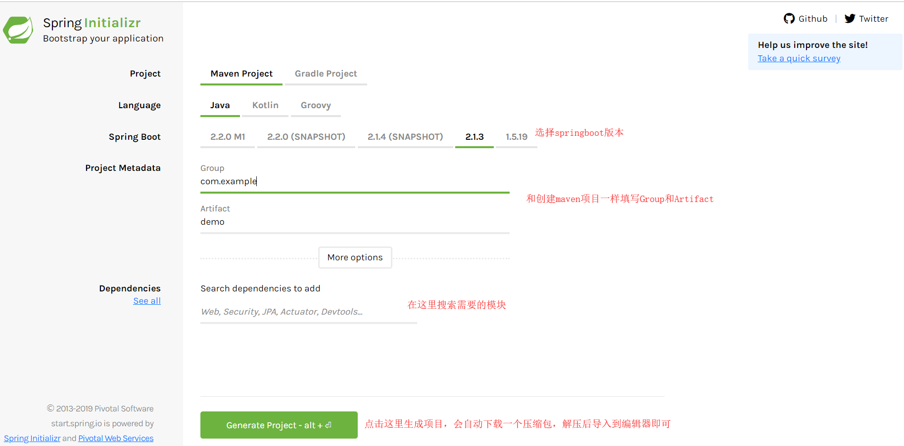
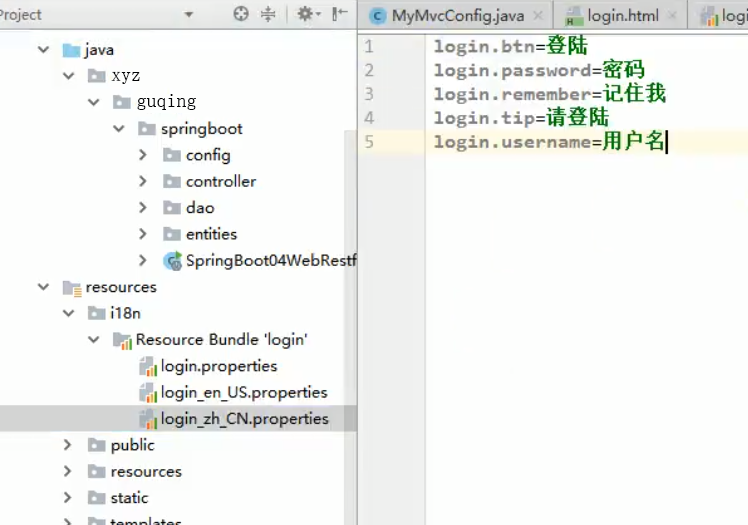
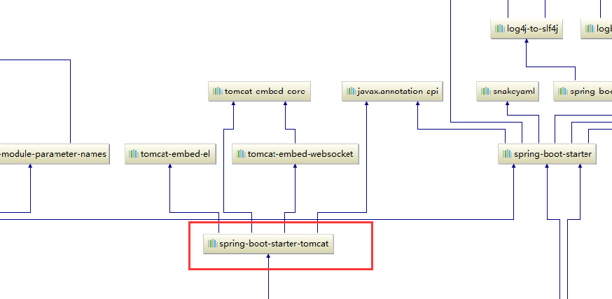

# SpringBoot核心原理

## 1. Spring Boot 简介

Spring 诞生时是 Java 企业版（Java Enterprise Edition，JEE，也称 J2EE）的轻量级代替品。无需开发重量级的 Enterprise JavaBean（EJB），Spring 为企业级Java 开发提供了一种相对简单的方法，通过依赖注入和面向切面编程，用简单的Java 对象（Plain Old Java Object，POJO）实现了 EJB 的功能。

虽然 Spring 的组件代码是轻量级的，但它的配置却是重量级的。所以Spring Boot孕育而生，为了简化xml配置，但是它的能力远不止于此，Spring Boot可以轻松创建独立的，生产级的基于Spring的应用程序，只需要“run”就可以。

## 2. 微服务

微服务的概念在2014年被一个叫`martin fowler`的人在一篇博客中首次提出。
微服务架构是一种架构，它描述了将软件应用程序设计为可独立部署的服务套件的特定方法。虽然没有对这种架构风格的精确定义，但围绕业务能力，自动部署，端点智能以及语言和数据的分散控制等组织存在某些共同特征。

参考：

```
http://blog.cuicc.com/blog/2015/07/22/microservices/
```

### 2.1 单体应用的缺点

1. 逻辑复杂、模块耦合、代码臃肿，修改难度大，版本迭代效率低下
   系统启动慢，一个进程包含了所有的业务逻辑，涉及到的启动模块过多，导致系统的启动、重启时间周期过长
2. 系统错误隔离性差、可用性差，任何一个模块的错误均可能造成整个系统的宕机
3. 可伸缩性差；系统的扩容只能只对这个应用进行扩容，不能做到对某个功能点进行扩容
4. 线上问题修复周期长；任何一个线上问题修复需要对整个应用系统进行全面升级

### 2.2 微服务优点

相比之下为服务的出现弥补了单体应用程序的缺点具有：

1. 易于开发、理解和维护；
2. 比单体应用启动快；
3. 局部修改很容易部署，有利于持续集成和持续交付；
4. 故障隔离，一个服务出现问题不会影响整个应用；
5. 不会受限于任何技术栈。


## 3. 环境准备

在`maven3.6.0`的`settings.xml`配置文件中添加：

```xml
<profiles>
    <profile>
        <id>jdk-1.8</id>
        <activation>
            <activeByDefault>true</activeByDefault>
            <jdk>1.8</jdk>
        </activation>
        <properties>
            <maven.compiler.source>1.8</maven.compiler.source>
            <maven.compiler.target>1.8</maven.compiler.target>
            <maven.compiler.compilerVersion>1.8</maven.compiler.compilerVersion>
        </properties>
    </profile>
</profiles>
```

## 4. Spring Boot HelloWorld

1. 创建一个maven工程(jar)
2. 导入相关依赖

```xml
<!-- Inherit defaults from Spring Boot -->
<parent>
    <groupId>org.springframework.boot</groupId>
    <artifactId>spring-boot-starter-parent</artifactId>
    <version>2.1.3.RELEASE</version>
</parent>

<!-- Add typical dependencies for a web application -->
<dependencies>
    <dependency>
        <groupId>org.springframework.boot</groupId>
        <artifactId>spring-boot-starter-web</artifactId>
    </dependency>
</dependencies>
```

3. 编写一个主程序类

```java
//标注主程序类，说明这是一个springboot应用
@SpringBootApplication
public class HelloWorldMainApplication {
    public static void main(String[] args) {
        //spring应用启动起来
        SpringApplication.run(HelloWorldMainApplication.class,args);
    }
}
```

4. 编写一个Controller

```java
@RestController
public class HelloController {
    
    @RequestMapping("/hello")
    @ResponseBody
    public String hello(){
        return "Hello World";
    }
}
```

5. 运行`HelloWorldMainApplication`打开浏览器访问

```
localhost:8080/hello
```

### 简化部署

创建一个可执行的jar包，只需要在maven中添加插件依赖：

```xml
<!-- Package as an executable jar -->
<build>
    <plugins>
        <plugin>
            <groupId>org.springframework.boot</groupId>
            <artifactId>spring-boot-maven-plugin</artifactId>
        </plugin>
    </plugins>
</build>
```

这个插件可以将应用打包成一个可以执行的jar包

然后会在当前项目`target`目录下创建一个`项目名.jar`,比如我的叫`springboot01-helloworld.jar`然后打开终端或者命令行

```shell
java -jar ./springboot01-helloworld.jar
```

就可以运行当前项目，通过浏览器依然可以项刚才一样访问`localhost:8080/hello`,无需手动部署`tomcat`,非常方便

**扩展：**

IDEA编辑器常用快捷键

| 快捷键                 | 说明                                                         |
| ---------------------- | ------------------------------------------------------------ |
| Ctrl + /               | 智能补全                                                     |
| Alt + Enter            | 相当于eclipse里Alt + /智能补全外的其他选项，或许还要更强大   |
| Alt + Insert           | 生成代码的constructor override toString等等                  |
| Ctrl + shift + 空格    | 对于喜欢写漂亮的文档注释的，可以通过Ctrl + shift + 空格 来预览Documentation |
| Ctrl + Alt + shift + T | 超级重构，包含重构的常用功能                                 |
| Alt + shift + R        | 重构之重命名                                                 |
| Alt + shift + C        | 重构之修改方法签名                                           |
| Alt + shift + M        | 重构之修抽取方法                                             |
| Ctrl + shift + X       | 大小写切换                                                   |
| Ctrl + F               | 当前文档查找                                                 |
| Ctrl + H               | 超级查找                                                     |
| Ctrl + T               | 查看实现类                                                   |
| Ctrl + o               | 查看当前类的成员属性                                         |
| Ctrl + shift + E       | 最近修改过的文件                                             |
| Ctrl + D               | 比较文件内容                                                 |
| Ctrl + F9              | 编译所有文件                                                 |
| Ctrl + shift + F9      | 编译有改动的文件                                             |

## 5. Hello World探究

### 5.1 父项目

在项目依赖的pom.xml文件中引入过一个父工程

```xml
<!-- Inherit defaults from Spring Boot -->
<parent>
    <groupId>org.springframework.boot</groupId>
    <artifactId>spring-boot-starter-parent</artifactId>
    <version>2.1.3.RELEASE</version>
</parent>

它的父项目是：
<parent>
    <groupId>org.springframework.boot</groupId>
    <artifactId>spring-boot-dependencies</artifactId>
    <version>2.1.3.RELEASE</version>
    <relativePath>../../spring-boot-dependencies</relativePath>
</parent>
它是真正管理Spring Boot应用里面的所有依赖版本的，被称为Spring Boot的版本仲裁中心
```

以后我们导入依赖默认是不需要写版本的（如果dependencies里没有管理的依赖才需要声明版本号）

### 5.2 导入的依赖

```xml
<!-- Add typical dependencies for a web application -->
<dependencies>
    <dependency>
        <groupId>org.springframework.boot</groupId>
        <artifactId>spring-boot-starter-web</artifactId>
    </dependency>
</dependencies>
```

**spring-boot-starter**-web

spring-boot-starter:被称为spring-boot的场景启动器；帮我们导入了web模块正常运行所依赖的组件

Spring Boot将所有的功能场景都抽取出来，做成一个个的starters(**启动器**)，只需要在项目中引入这些starter相关场景，相关的所有依赖就会导入进来，要什么功能就导入什么启动器

**Table 13.1. Spring Boot application starters （Spring Boot的启动器）**

| Name                                          | Description                                                  | Pom                                                          |
| --------------------------------------------- | ------------------------------------------------------------ | ------------------------------------------------------------ |
| `spring-boot-starter`                         | Core starter, including auto-configuration support, logging and YAML | [Pom](https://github.com/spring-projects/spring-boot/tree/v2.1.3.RELEASE/spring-boot-project/spring-boot-starters/spring-boot-starter/pom.xml) |
| `spring-boot-starter-activemq`                | Starter for JMS messaging using Apache ActiveMQ              | [Pom](https://github.com/spring-projects/spring-boot/tree/v2.1.3.RELEASE/spring-boot-project/spring-boot-starters/spring-boot-starter-activemq/pom.xml) |
| `spring-boot-starter-amqp`                    | Starter for using Spring AMQP and Rabbit MQ                  | [Pom](https://github.com/spring-projects/spring-boot/tree/v2.1.3.RELEASE/spring-boot-project/spring-boot-starters/spring-boot-starter-amqp/pom.xml) |
| `spring-boot-starter-aop`                     | Starter for aspect-oriented programming with Spring AOP and AspectJ | [Pom](https://github.com/spring-projects/spring-boot/tree/v2.1.3.RELEASE/spring-boot-project/spring-boot-starters/spring-boot-starter-aop/pom.xml) |
| `spring-boot-starter-artemis`                 | Starter for JMS messaging using Apache Artemis               | [Pom](https://github.com/spring-projects/spring-boot/tree/v2.1.3.RELEASE/spring-boot-project/spring-boot-starters/spring-boot-starter-artemis/pom.xml) |
| `spring-boot-starter-batch`                   | Starter for using Spring Batch                               | [Pom](https://github.com/spring-projects/spring-boot/tree/v2.1.3.RELEASE/spring-boot-project/spring-boot-starters/spring-boot-starter-batch/pom.xml) |
| `spring-boot-starter-cache`                   | Starter for using Spring Framework’s caching support         | [Pom](https://github.com/spring-projects/spring-boot/tree/v2.1.3.RELEASE/spring-boot-project/spring-boot-starters/spring-boot-starter-cache/pom.xml) |
| `spring-boot-starter-cloud-connectors`        | Starter for using Spring Cloud Connectors which simplifies connecting to services in cloud platforms like Cloud Foundry and Heroku | [Pom](https://github.com/spring-projects/spring-boot/tree/v2.1.3.RELEASE/spring-boot-project/spring-boot-starters/spring-boot-starter-cloud-connectors/pom.xml) |
| `spring-boot-starter-data-cassandra`          | Starter for using Cassandra distributed database and Spring Data Cassandra | [Pom](https://github.com/spring-projects/spring-boot/tree/v2.1.3.RELEASE/spring-boot-project/spring-boot-starters/spring-boot-starter-data-cassandra/pom.xml) |
| `spring-boot-starter-data-cassandra-reactive` | Starter for using Cassandra distributed database and Spring Data Cassandra Reactive | [Pom](https://github.com/spring-projects/spring-boot/tree/v2.1.3.RELEASE/spring-boot-project/spring-boot-starters/spring-boot-starter-data-cassandra-reactive/pom.xml) |
| `spring-boot-starter-data-couchbase`          | Starter for using Couchbase document-oriented database and Spring Data Couchbase | [Pom](https://github.com/spring-projects/spring-boot/tree/v2.1.3.RELEASE/spring-boot-project/spring-boot-starters/spring-boot-starter-data-couchbase/pom.xml) |
| `spring-boot-starter-data-couchbase-reactive` | Starter for using Couchbase document-oriented database and Spring Data Couchbase Reactive | [Pom](https://github.com/spring-projects/spring-boot/tree/v2.1.3.RELEASE/spring-boot-project/spring-boot-starters/spring-boot-starter-data-couchbase-reactive/pom.xml) |
| `spring-boot-starter-data-elasticsearch`      | Starter for using Elasticsearch search and analytics engine and Spring Data Elasticsearch | [Pom](https://github.com/spring-projects/spring-boot/tree/v2.1.3.RELEASE/spring-boot-project/spring-boot-starters/spring-boot-starter-data-elasticsearch/pom.xml) |
| `spring-boot-starter-data-jdbc`               | Starter for using Spring Data JDBC                           | [Pom](https://github.com/spring-projects/spring-boot/tree/v2.1.3.RELEASE/spring-boot-project/spring-boot-starters/spring-boot-starter-data-jdbc/pom.xml) |
| `spring-boot-starter-data-jpa`                | Starter for using Spring Data JPA with Hibernate             | [Pom](https://github.com/spring-projects/spring-boot/tree/v2.1.3.RELEASE/spring-boot-project/spring-boot-starters/spring-boot-starter-data-jpa/pom.xml) |
| `spring-boot-starter-data-ldap`               | Starter for using Spring Data LDAP                           | [Pom](https://github.com/spring-projects/spring-boot/tree/v2.1.3.RELEASE/spring-boot-project/spring-boot-starters/spring-boot-starter-data-ldap/pom.xml) |
| `spring-boot-starter-data-mongodb`            | Starter for using MongoDB document-oriented database and Spring Data MongoDB | [Pom](https://github.com/spring-projects/spring-boot/tree/v2.1.3.RELEASE/spring-boot-project/spring-boot-starters/spring-boot-starter-data-mongodb/pom.xml) |
| `spring-boot-starter-data-mongodb-reactive`   | Starter for using MongoDB document-oriented database and Spring Data MongoDB Reactive | [Pom](https://github.com/spring-projects/spring-boot/tree/v2.1.3.RELEASE/spring-boot-project/spring-boot-starters/spring-boot-starter-data-mongodb-reactive/pom.xml) |
| `spring-boot-starter-data-neo4j`              | Starter for using Neo4j graph database and Spring Data Neo4j | [Pom](https://github.com/spring-projects/spring-boot/tree/v2.1.3.RELEASE/spring-boot-project/spring-boot-starters/spring-boot-starter-data-neo4j/pom.xml) |
| `spring-boot-starter-data-redis`              | Starter for using Redis key-value data store with Spring Data Redis and the Lettuce client | [Pom](https://github.com/spring-projects/spring-boot/tree/v2.1.3.RELEASE/spring-boot-project/spring-boot-starters/spring-boot-starter-data-redis/pom.xml) |
| `spring-boot-starter-data-redis-reactive`     | Starter for using Redis key-value data store with Spring Data Redis reactive and the Lettuce client | [Pom](https://github.com/spring-projects/spring-boot/tree/v2.1.3.RELEASE/spring-boot-project/spring-boot-starters/spring-boot-starter-data-redis-reactive/pom.xml) |
| `spring-boot-starter-data-rest`               | Starter for exposing Spring Data repositories over REST using Spring Data REST | [Pom](https://github.com/spring-projects/spring-boot/tree/v2.1.3.RELEASE/spring-boot-project/spring-boot-starters/spring-boot-starter-data-rest/pom.xml) |
| `spring-boot-starter-data-solr`               | Starter for using the Apache Solr search platform with Spring Data Solr | [Pom](https://github.com/spring-projects/spring-boot/tree/v2.1.3.RELEASE/spring-boot-project/spring-boot-starters/spring-boot-starter-data-solr/pom.xml) |
| `spring-boot-starter-freemarker`              | Starter for building MVC web applications using FreeMarker views | [Pom](https://github.com/spring-projects/spring-boot/tree/v2.1.3.RELEASE/spring-boot-project/spring-boot-starters/spring-boot-starter-freemarker/pom.xml) |
| `spring-boot-starter-groovy-templates`        | Starter for building MVC web applications using Groovy Templates views | [Pom](https://github.com/spring-projects/spring-boot/tree/v2.1.3.RELEASE/spring-boot-project/spring-boot-starters/spring-boot-starter-groovy-templates/pom.xml) |
| `spring-boot-starter-hateoas`                 | Starter for building hypermedia-based RESTful web application with Spring MVC and Spring HATEOAS | [Pom](https://github.com/spring-projects/spring-boot/tree/v2.1.3.RELEASE/spring-boot-project/spring-boot-starters/spring-boot-starter-hateoas/pom.xml) |
| `spring-boot-starter-integration`             | Starter for using Spring Integration                         | [Pom](https://github.com/spring-projects/spring-boot/tree/v2.1.3.RELEASE/spring-boot-project/spring-boot-starters/spring-boot-starter-integration/pom.xml) |
| `spring-boot-starter-jdbc`                    | Starter for using JDBC with the HikariCP connection pool     | [Pom](https://github.com/spring-projects/spring-boot/tree/v2.1.3.RELEASE/spring-boot-project/spring-boot-starters/spring-boot-starter-jdbc/pom.xml) |
| `spring-boot-starter-jersey`                  | Starter for building RESTful web applications using JAX-RS and Jersey. An alternative to [`spring-boot-starter-web`](https://docs.spring.io/spring-boot/docs/2.1.3.RELEASE/reference/htmlsingle/#spring-boot-starter-web) | [Pom](https://github.com/spring-projects/spring-boot/tree/v2.1.3.RELEASE/spring-boot-project/spring-boot-starters/spring-boot-starter-jersey/pom.xml) |
| `spring-boot-starter-jooq`                    | Starter for using jOOQ to access SQL databases. An alternative to [`spring-boot-starter-data-jpa`](https://docs.spring.io/spring-boot/docs/2.1.3.RELEASE/reference/htmlsingle/#spring-boot-starter-data-jpa) or [`spring-boot-starter-jdbc`](https://docs.spring.io/spring-boot/docs/2.1.3.RELEASE/reference/htmlsingle/#spring-boot-starter-jdbc) | [Pom](https://github.com/spring-projects/spring-boot/tree/v2.1.3.RELEASE/spring-boot-project/spring-boot-starters/spring-boot-starter-jooq/pom.xml) |
| `spring-boot-starter-json`                    | Starter for reading and writing json                         | [Pom](https://github.com/spring-projects/spring-boot/tree/v2.1.3.RELEASE/spring-boot-project/spring-boot-starters/spring-boot-starter-json/pom.xml) |
| `spring-boot-starter-jta-atomikos`            | Starter for JTA transactions using Atomikos                  | [Pom](https://github.com/spring-projects/spring-boot/tree/v2.1.3.RELEASE/spring-boot-project/spring-boot-starters/spring-boot-starter-jta-atomikos/pom.xml) |
| `spring-boot-starter-jta-bitronix`            | Starter for JTA transactions using Bitronix                  | [Pom](https://github.com/spring-projects/spring-boot/tree/v2.1.3.RELEASE/spring-boot-project/spring-boot-starters/spring-boot-starter-jta-bitronix/pom.xml) |
| `spring-boot-starter-mail`                    | Starter for using Java Mail and Spring Framework’s email sending support | [Pom](https://github.com/spring-projects/spring-boot/tree/v2.1.3.RELEASE/spring-boot-project/spring-boot-starters/spring-boot-starter-mail/pom.xml) |
| `spring-boot-starter-mustache`                | Starter for building web applications using Mustache views   | [Pom](https://github.com/spring-projects/spring-boot/tree/v2.1.3.RELEASE/spring-boot-project/spring-boot-starters/spring-boot-starter-mustache/pom.xml) |
| `spring-boot-starter-oauth2-client`           | Starter for using Spring Security’s OAuth2/OpenID Connect client features | [Pom](https://github.com/spring-projects/spring-boot/tree/v2.1.3.RELEASE/spring-boot-project/spring-boot-starters/spring-boot-starter-oauth2-client/pom.xml) |
| `spring-boot-starter-oauth2-resource-server`  | Starter for using Spring Security’s OAuth2 resource server features | [Pom](https://github.com/spring-projects/spring-boot/tree/v2.1.3.RELEASE/spring-boot-project/spring-boot-starters/spring-boot-starter-oauth2-resource-server/pom.xml) |
| `spring-boot-starter-quartz`                  | Starter for using the Quartz scheduler                       | [Pom](https://github.com/spring-projects/spring-boot/tree/v2.1.3.RELEASE/spring-boot-project/spring-boot-starters/spring-boot-starter-quartz/pom.xml) |
| `spring-boot-starter-security`                | Starter for using Spring Security                            | [Pom](https://github.com/spring-projects/spring-boot/tree/v2.1.3.RELEASE/spring-boot-project/spring-boot-starters/spring-boot-starter-security/pom.xml) |
| `spring-boot-starter-test`                    | Starter for testing Spring Boot applications with libraries including JUnit, Hamcrest and Mockito | [Pom](https://github.com/spring-projects/spring-boot/tree/v2.1.3.RELEASE/spring-boot-project/spring-boot-starters/spring-boot-starter-test/pom.xml) |
| `spring-boot-starter-thymeleaf`               | Starter for building MVC web applications using Thymeleaf views | [Pom](https://github.com/spring-projects/spring-boot/tree/v2.1.3.RELEASE/spring-boot-project/spring-boot-starters/spring-boot-starter-thymeleaf/pom.xml) |
| `spring-boot-starter-validation`              | Starter for using Java Bean Validation with Hibernate Validator | [Pom](https://github.com/spring-projects/spring-boot/tree/v2.1.3.RELEASE/spring-boot-project/spring-boot-starters/spring-boot-starter-validation/pom.xml) |
| `spring-boot-starter-web`                     | Starter for building web, including RESTful, applications using Spring MVC. Uses Tomcat as the default embedded container | [Pom](https://github.com/spring-projects/spring-boot/tree/v2.1.3.RELEASE/spring-boot-project/spring-boot-starters/spring-boot-starter-web/pom.xml) |
| `spring-boot-starter-web-services`            | Starter for using Spring Web Services                        | [Pom](https://github.com/spring-projects/spring-boot/tree/v2.1.3.RELEASE/spring-boot-project/spring-boot-starters/spring-boot-starter-web-services/pom.xml) |
| `spring-boot-starter-webflux`                 | Starter for building WebFlux applications using Spring Framework’s Reactive Web support | [Pom](https://github.com/spring-projects/spring-boot/tree/v2.1.3.RELEASE/spring-boot-project/spring-boot-starters/spring-boot-starter-webflux/pom.xml) |
| `spring-boot-starter-websocket`               | Starter for building WebSocket applications using Spring Framework’s WebSocket support | [Pom](https://github.com/spring-projects/spring-boot/tree/v2.1.3.RELEASE/spring-boot-project/spring-boot-starters/spring-boot-starter-websocket/pom.xml) |

### 5.3 主程序类，主入口类

```java
//标注主程序类，说明这是一个springboot应用
@SpringBootApplication
public class HelloWorldMainApplication {
    public static void main(String[] args) {
        //spring应用启动起来
        SpringApplication.run(HelloWorldMainApplication.class,args);
    }
}
```

`@SpringBootApplication`: Spring Boot应用标注在某个类上说明这个类是Spring Boot的主配置类，Spring Boot就应该运行这个类的main方法来启动SpringBoot应用

```java
@Target({ElementType.TYPE})
@Retention(RetentionPolicy.RUNTIME)
@Documented
@Inherited
@SpringBootConfiguration
@EnableAutoConfiguration
@ComponentScan(
    excludeFilters = {@Filter(
    type = FilterType.CUSTOM,
    classes = {TypeExcludeFilter.class}
), @Filter(
    type = FilterType.CUSTOM,
    classes = {AutoConfigurationExcludeFilter.class}
)}
)
public @interface SpringBootApplication {
```

SpringBootApplication其实是一个组合注解类，其中

`@SpringBootConfiguration`是Spring Boot的配置类，标注在这个类上表示这是Spring Boot的配置类，由下面的注解构成

```java
@Target({ElementType.TYPE})
@Retention(RetentionPolicy.RUNTIME)
@Documented
@Configuration
public @interface SpringBootConfiguration {
}

```

`@Configuration`:配置类上用来标注这个注解，配置类就相当于是配置文件，将配置文件都替换为配置类，配置类也是容器中的一个组件

`@@EnableAutoConfiguration`:开启自动配置功能，以前需要配置的东西，Spring Boot 帮助我们自动配置；它告诉SpringBoot开启自动配置功能，这样自动配置才能生效，它也是一个组合注解类

```java
@Target({ElementType.TYPE})
@Retention(RetentionPolicy.RUNTIME)
@Documented
@Inherited
@AutoConfigurationPackage
@Import({AutoConfigurationImportSelector.class})
public @interface EnableAutoConfiguration {
```

`@AutoConfigurationPackage`:自动配置包，使用的是`@Import({Registrar.class})`完成的功能，它是Spring的底层注解，作用是给容器中导入一个组件；导入的组件由`Registrar.class`类来指定。==`@AutoConfigurationPackage`会将主程序类(`@SpringBootApplication`标注的类)所在包中所有的所有组件及子包中左右组件扫描到Spring容器中==

```java
@Target({ElementType.TYPE})
@Retention(RetentionPolicy.RUNTIME)
@Documented
@Inherited
@Import({Registrar.class})
public @interface AutoConfigurationPackage {
}
```

在`EnableAutoConfiguration`注解类中还标了`@Import({AutoConfigurationImportSelector.class})`注解，导入哪些组件的选择器，所有需要导入的组件会以全类名的方式返回；这些组件就会被添加到容器中。

会给容器中导入非常多的自动配置类（xxxAutoConfiguration）;就是给容器中导入这个场景需要的所有组件，并配置好这些组件。有了自动配置类，免去了我们手动编写配置，注入功能组件等的工作。

方法SpringBoot在启动时通过`SpringFactoriesLoader.loadFactoryNames(EnableAutoConfiguration.class,classLoader);`从类路径下的`META/spring.factories``中获取EnableAutoConfiguration`指定的值。将这些值作为自动配置导入到容器中，自动配置类就生效了，帮我们进行自动配置工作。以前我们需要自动配置的东西比如Singmvc的视图解析器，前端控制器，这些配置都帮我们自动配置了，以前需要配置的东西依然存在，只是不需要我们手动配置了而已。

J2EE的整体整合解决方案和自动配置都在`spring-boot-autoconfigure-2.1.3.RELEASE.jar`中（不同的版本只是版本号不同）

## 6. 如何快速创建一个SpringBoot项目

使用`Spring Initializer`创建向导快速创建一个Spring Boot项目，IDEA和Spring提供的STS都支持创建向导


然后会看到如下界面选中自己使用的`jdk`版本然后执行`Next`


填写项目相关信息然后下一步


选择自己需要的模块，比如web模块或者数据库模块，安全，数据校验等，然后执行下一步：


然后默认直接完成即可，IDEA会联网自动下载所需的依赖。

如果你的编辑器不支持`Spring Initializer`快速创建，也可以去官网

```
https://start.spring.io
```



默认生成的Spring Boot项目，目录结构说明：


- 主程序已经生成好了，我们只需要关心自己的项目逻辑即可

- resources文件夹中目录结构
  - static：保存所有的静态资源，js，css，images等，类似于webContent
  - templates:保存所有的模板页面；（Spring Boot默认jar包使用嵌入式的Tomcat，默认是不支持JSP页面的）可以使用模板引擎如freemarker、thymeleaf等；
  - application.properties：Spring boot应用的配置文件，可以自己配置，比如启动端口号可以配置`server.port=8081`

## 7. Spring Boot的配置

### 7.1 配置文件

Spring Boot会使用一个全局的配置文件（名称固定），默认支持两种格式：

- application.properties
- application.yml

配置文件的作用：修改SpringBoot自动配置的默认值；SpringBoot在底层都帮我们配置好了，但是我们可以自定义修改不满意的地方，这就需要手动配置。

`.yml`是`YAML` (Yet Another Markup Language另一种标记语言)的缩写

- 以前的配置文件按大多数都是用的是`xxx.xml`文件

- 而`YAML`是以**数据为中心**的，比`json`，`xml`等更适合做配置文件

YAML配置实例：

```yaml
server:
  port: 8081
```

可以看到非常的简洁

### 7.2 YAML语法

k:(空格)v:表示一堆键值对（空格必须有）；

以空格的缩进来控制层级关系；只要是左对齐的一列数据，都是同一个层级的

```yaml
server:
	port: 8081
	path: /hello
```

属性和值也是大小写敏感的

### 7.3 值的写法

字面量：普通值（数字、字符串、布尔）

```
k: v:字面直接来写，字符串默认不用加上单引号或双引号
	""：双用号，不会转移字符串里面得特殊字符，特殊字符会作为本身想表示的意思
		name: "zhangsan\nlisi",最终输出为：zhangsan换行lisi
	'':单引号,会转移特殊字符，特殊字符最终只是一个普通的字符串数据
		name: "zhangsan\nlisi",最终输出为:zhangsan\nlisi
```

对象、Map（属性和值，键值对）

```
k:v：在下一行来写对象的属性和值的关系，注意缩进
	对象还是k:v键值对的方式，例如friends对象：
	friends:
		name:zhangsan
		age:20
```

行内写法：

```yaml
friends: {lastName: zhangsan, age: 18}
```

数组（List、Set）

用`- 值`表示数组中的一个元素

```yaml
pets:
- cat
- dog
- pig
```

行内写法：

```yaml
pets: [cat, dog, pig]
```

### 7.4 获取配置文件值（配置文件注入）

创建一个`Person`类

```java
/**
 * 将配置文件中配置的每一个属性的值映射到这个bean中
 * 借助一个注解@EnableConfigurationProperties:告诉springboot将本类中的所有属性和配置文件中相关的配置进行绑定
 *   prefix = "Person":配置文件中哪个下面的所有属性进行一一映射
 *  只有这个组件是容器中的组件才能使用容器的功能
 *
 */
@Component
@ConfigurationProperties(prefix = "person")
public class Person {
    private String lastName;
    private Integer age;
    private Boolean boss;
    private Date birthday;
    
    private Map<String,Object> maps;
    private List<Object> lists;
    private Dog dog;
}
```

其中引用到一个`Dog`类

```java
public class Dog {
    private String name;
    private Integer age;
} 
```

使用`@ConfigurationProperties`注解需要导入maven配置,编写yaml文件时就有提示

```xml
<!--generate your own configuration metadata file-->
<dependency>
    <groupId>org.springframework.boot</groupId>
    <artifactId>spring-boot-configuration-processor</artifactId>
    <optional>true</optional>
</dependency>
```

使用yaml配置文件给Person注入值：

```yaml
person:
  lastName: zhangsan
  age: 18
  boss: false
  birthday: 2019/3/22
  maps: {k1: v1,k2: v2,k3: v3}
  lists:
    - lisi
    - wangwu
    - wangerma
    - ergouzi
  dog:
    name: 小狗
    age: 2
```

然后写测试类

```java
/**
 * SpringBoot单元测试
 * 可以在测试期间很方便的类似编码一样的进行自动注入等功能
 */
@RunWith(SpringRunner.class)
@SpringBootTest //spring boot的单元测试
public class Springboot02ConfigApplicationTests {

    @Resource
    Person person;
    
    @Test
    public void contextLoads() {
        System.out.println(person);
    }

}
```

可以看到输出结果：

```
Person{lastName='zhangsan', age=18, boss=false, birthday=Fri Mar 22 00:00:00 CST 2019, maps={k1=v1, k2=v2, k3=v3}, lists=[lisi, wangwu, wangerma, ergouzi], dog=Dog{name='小狗', age=2}}
```

而对于`application.properties`的配置方式为：

```proper
# 配置person的值
person.last-name=张三
person.age=18
person.birthday=2019/3/22
person.boss=false
person.maps.k1=v1
person.maps.k2=v2
person.maps.k3=v3
person.dog.name=小狗
person.dog.age=5
```

如果输出结果出现乱码需要在IDEA编辑器设置编码


如果不使用`@ConfigurationProperties`注解，也可以使用`@Value`的方式获取配置文件中的值,@Value的key读取的是配置文件中的key

```java
@Component
//@ConfigurationProperties(prefix = "person")
public class Person {
    /**
     * @Value相当于一下配置中的value的作用
     * <bean class="Person">
     *      <properties name="lastName" value="字面量/${key}从环境变量、配置文件中获取值/#{SpEL}"></properties>
     * </bean>
     */
    @Value("${person.last-name}")
    private String lastName;
    
    @Value("#{11*2}")
    private Integer age;
    
    @Value("true")
    private Boolean boss;
}
```

### 7.5 @Value获取值和@ConfigurationProperties获取值比较

| 测试功能             | @ConfigurationProperties | @Value       |
| -------------------- | ------------------------ | ------------ |
| 注入数据             | 批量注入配置文件中的属性 | 一个一个指定 |
| 松散绑定（松散语法） | 支持                     | 不支持       |
| SpEL                 | 不支持                   | 支持         |
| JSR303数据校验       | 支持                     | 不支持       |
| 复杂类型封装         | 支持                     | 不支持       |

JSR303数据校验(例如校验Email地址)：

```java
@Component
@ConfigurationProperties(prefix = "person")
@Validated
public class Person {
    @Email
    private String lastName;
}
```

运行：

```
Value: 张三
Origin: class path resource [application.properties]:2:18
Reason: 不是一个合法的电子邮件地址
```

### 7.6 @PropertySource&@ImportResource

#### 7.6.1 @PropertySource

`@PropertySource`: 加载指定的配置文件

当配置比较多时如果全部放在全局的配置文件`application`中就会很乱，那么这时可以将一些配置文件抽取出来放在另一个配置文件中使用`@PropertySource`来加载，它接收一个value数组`String[] value();`可以同时指定多个配置文件，例如

`@PropertySource(value={"classpath:person.properties"})`

#### 7.6.2 @ImportResource

`@ImportResource: `导入Spring的配置文件，让配置文件里面的内容生效。

Spring Boot里面没有Spring的配置文件，我们自己编写的配置文件也不能自动识别，想让Spring的配置文件生效，加载进来就需要使用`@ImportResource`，例如下面：

```java
@SpringBootApplication
@ImportResource(locations = {"classpath:beans.xml"})//加载配置文件
public class SpringbootConfigMainApplication {

    public static void main(String[] args) {
        SpringApplication.run(SpringbootConfigMainApplication.class, args);
    }

}
```

```xml
<?xml version="1.0"	encoding="UTF-8"?>
<beans xmlns="http://www.springframework.org/schema/beans"
       xmlns:xsi="http://www.w3.org/2001/XMLSchema-instance"
       xmlns:p="http://www.springframework.org/schema/p"
       xmlns:context="http://www.springframework.org/schema/context"
       xsi:schemaLocation="http://www.springframework.org/schema/beans
       http://www.springframework.org/schema/beans/spring-beans.xsd
       http://www.springframework.org/schema/context
       http://www.springframework.org/schema/context/spring-context.xsd">

    <bean id="helloService" class="xyz.guqing.springboot.service.HelloService"></bean>
</beans>
```

通过上面的方式就可以把`HelloService`加载进容器中

```java
@Test
public void testHelloService() {
    boolean isContains = applicationContext.containsBean("helloService");
    //返回true
    System.out.println(isContains);
}
```

但是SpringBoot不推荐使用配置文件的方式而是，而是使用全注解的方式：

写一个配置类：

```java
/**
 * @Configuration指明当前类是一个配置类，就是来替代之前的Spring配置文件
 * 之前是在配置文件中用<bean></bean>添加组件的，现在有@Bean注解
 */
@Configuration
public class MyAppConfig {
    //将方法的返回值添加到容器中，在容器中这个组件默认的id就是方法名
    @Bean
    public HelloService helloService() {
        return new HelloService();
    }
}
```

测试：

```java
@Test
public void testHelloService() {
    boolean isContains = applicationContext.containsBean("helloService");
    //返回true
    System.out.println(isContains);
}
```

通过上面的例子可以看到，使用配置类的方式一样可以实现配置文件的作用，这是spring推荐的方式。

### 7.7 配置文件占位符

#### 7.7.1 随机数

```java
${random.value}、${random.int}、${random.1ong}
${random.int(10)}、${random.int[1024,65536]}
```

例如：

```properties
person.last-name=张三${random.uuid}
person.age=${random.int}
```

#### 7.7.2 占位符获取之前配置的值

如果没有可以使用`：`指定默认值

```properties
person.dog.name=${person.last-name}的小狗
#hello不存在指定默认值为hello
person.dog.sayHi=${person.hello:hello}
```

### 7.8 Profile

#### 1. 多Profile文件

在主配置文件编写的时候，文件名可以是`application-{profile}.properties/yml`

带上profile表示就可以动态切换配置文件，默认使用的是`application.properties`配置文件。

假如现在创建三个配置文件：

```
application.properties
application-dev.properties
application-prod.properties
```

现在启动项目，使用的是`application.properties`配置文件，

如果在`application.properties`中添加一行配置

```properties
spring.profiles.active=dev
```

启动项目后运行的就是`application-dev.properties`，如此便实现了多配置文件的动态切换

#### 2. yml支持多文档块方式

```yaml
server:
  port: 8081
spring:
  profiles:
    active: dev
---
server:
  port: 8082
spring:
  profiles: dev
---
server:
  port: 8083

spring:
    profiles: prod
```

如上所示：`yml`不需要像`properties`文件那样创建多个配置文件来切换，而是使用多文档块的方式定义，每一个文档块就相当于一个配置文件（使用`---`来划分的叫一个文档块），在第一个文档块中指定：

```yaml
spring:
  profiles:
    active: dev
```

即可激活指定的配置文件使其生效。

#### 3. 激活指定Profile

1. 在配置文件中指定`spring.profiles.active=dev`就可以激活使用配置文件

2. 命令行方式激活：

   ```
   --spring.profiles.active=dev
   ```

   例如：

   ```
   java -jar spring-boot-02-config-0.0.1-SNAPSHOT.jar --spring.profiles.active=dev
   ```

3. 虚拟机参数：

   ```
   -Dspring.profiles.active=dev
   ```

   在IDEA中可以在编辑器直接设置命令行参数和虚拟机参数：


### 7.9 配置文件的加载位置

`spring boot`启动会扫描以下位置的`application.properties`或者`application.yml`文件作为`Spring boot`的默认配置文件

- `file: ./config/`

- `file: ./`

- `classpath:/config/`

- `classpath:/`

以上是按照优先级从高到低的顺序，所有位置的文件都会被加载，高优先级配置内容会覆盖低优先级配置内容，导致互补配置。
我们也可以通过配置spring.config.location来改变默认配置


还可以通过`spring.config.location`来改变默认的配置文件的配置，比如项目打包以后可以使用命令行参数的形式，启动项目时指定配置文件的新配置；指定的配置文件和默认加载的这些配置文件会共同起作用，形成互补配置。

```
java -jar spring-boot-02-config02-0.0.1-SNAPSHOT.jar --spring.config.location=D:/application.properties
```

### 7.10外部配置加载顺序

Spring Boot 支持多种外部配置方式

**这些方式优先级由高到低如下：**

1. **命令行参数**

   ```
   java -jar spring-boot02-config02-0.0.1-SNAPSHOT.jar --server.port=8087
   ```

2. 来自`java:comp/env`的`JNDI`属性

3. Java系统属性（System.getProperties0）

4. 操作系统环境变量

5. RandomValuePropertySource配置的random.*属性值

**由jar包外向jar包内进行寻找，优先加载带profile的**

6. **jar包外部的application-{profile）.properties或application.yml（带spring.profile）配置文件**
7. **jar包内部的application-{profile}.properties或application.yml（带spring.profile）配置文件**


**在加载不带profile的**

8. **jar包外部的application.properties或application.yml（不带spring.profile）配置文件**
9. **jar包内部的application.properties或application.yml（不带spring.profile）配置文件**


10. @Configuration注解类上的@PropertySource

11. 通过SpringApplication.setDefaultProperties指定的默认属性

所有支持的配置加载来源参考官方文档：

```
https://docs.spring.io/spring-boot/docs/2.1.3.RELEASE/reference/htmlsingle/#boot-features-external-config
```

## 8. 自动配置原理

配置文件能配置哪些属性，参照：

```
https://docs.spring.io/spring-boot/docs/2.1.3.RELEASE/reference/htmlsingle/#common-application-properties
```

（1）SpringBoot启动的时候加载主配置类，开启了自动配置功能`@EnableAutoConfiguration`

### `@EnableAutoConfiguration`的作用：

（2）利用`AutoConfigurationImportSelector`给容器中导入一些组件，可以查看`selectImports()`方法的内容来查看具体导入了哪些组件。

```
List<String> configurations = this.getCandidateConfigurations(annotationMetadata, attributes);
```

用于获取候选的配置

```java
 List<String> configurations = SpringFactoriesLoader.loadFactoryNames(this.getSpringFactoriesLoaderFactoryClass(), this.getBeanClassLoader());
```

通过`SpringFactoriesLoader.loadFactoryNames`扫描类路径下的`META-INF/spring.factories`,（`org.springframework.boot:spring-boot-autoconfigure:2.1.3.RELEASE/META-INF/spring.factories`）然后把扫描到的这些文件的内容包装成`properties`对象,然后通过`properties`对象来获取`EnableAutoConfiguration.class类`（类名）对应的值，然后把他们添加到容器中。

总结就是将类路径下的`META-INF/spring.factories`里面配置的所有`EnableAutoConfiguration`的值加入到容器中。

```proper
# Auto Configure
org.springframework.boot.autoconfigure.EnableAutoConfiguration=\
org.springframework.boot.autoconfigure.admin.SpringApplicationAdminJmxAutoConfiguration,\
org.springframework.boot.autoconfigure.aop.AopAutoConfiguration,\
org.springframework.boot.autoconfigure.amqp.RabbitAutoConfiguration,\
org.springframework.boot.autoconfigure.batch.BatchAutoConfiguration,\
org.springframework.boot.autoconfigure.cache.CacheAutoConfiguration,\
org.springframework.boot.autoconfigure.cassandra.CassandraAutoConfiguration,\
org.springframework.boot.autoconfigure.cloud.CloudServiceConnectorsAutoConfiguration,\
org.springframework.boot.autoconfigure.context.ConfigurationPropertiesAutoConfiguration,\
org.springframework.boot.autoconfigure.context.MessageSourceAutoConfiguration,\
org.springframework.boot.autoconfigure.context.PropertyPlaceholderAutoConfiguration,\
org.springframework.boot.autoconfigure.couchbase.CouchbaseAutoConfiguration,\
org.springframework.boot.autoconfigure.dao.PersistenceExceptionTranslationAutoConfiguration,\
org.springframework.boot.autoconfigure.data.cassandra.CassandraDataAutoConfiguration,\
org.springframework.boot.autoconfigure.data.cassandra.CassandraReactiveDataAutoConfiguration,\
org.springframework.boot.autoconfigure.data.cassandra.CassandraReactiveRepositoriesAutoConfiguration,\
org.springframework.boot.autoconfigure.data.cassandra.CassandraRepositoriesAutoConfiguration,\
org.springframework.boot.autoconfigure.data.couchbase.CouchbaseDataAutoConfiguration,\
org.springframework.boot.autoconfigure.data.couchbase.CouchbaseReactiveDataAutoConfiguration,\
org.springframework.boot.autoconfigure.data.couchbase.CouchbaseReactiveRepositoriesAutoConfiguration,\
org.springframework.boot.autoconfigure.data.couchbase.CouchbaseRepositoriesAutoConfiguration,\
org.springframework.boot.autoconfigure.data.elasticsearch.ElasticsearchAutoConfiguration,\
org.springframework.boot.autoconfigure.data.elasticsearch.ElasticsearchDataAutoConfiguration,\
org.springframework.boot.autoconfigure.data.elasticsearch.ElasticsearchRepositoriesAutoConfiguration,\
org.springframework.boot.autoconfigure.data.jdbc.JdbcRepositoriesAutoConfiguration,\
org.springframework.boot.autoconfigure.data.jpa.JpaRepositoriesAutoConfiguration,\
org.springframework.boot.autoconfigure.data.ldap.LdapRepositoriesAutoConfiguration,\
org.springframework.boot.autoconfigure.data.mongo.MongoDataAutoConfiguration,\
org.springframework.boot.autoconfigure.data.mongo.MongoReactiveDataAutoConfiguration,\
org.springframework.boot.autoconfigure.data.mongo.MongoReactiveRepositoriesAutoConfiguration,\
org.springframework.boot.autoconfigure.data.mongo.MongoRepositoriesAutoConfiguration,\
org.springframework.boot.autoconfigure.data.neo4j.Neo4jDataAutoConfiguration,\
org.springframework.boot.autoconfigure.data.neo4j.Neo4jRepositoriesAutoConfiguration,\
org.springframework.boot.autoconfigure.data.solr.SolrRepositoriesAutoConfiguration,\
org.springframework.boot.autoconfigure.data.redis.RedisAutoConfiguration,\
org.springframework.boot.autoconfigure.data.redis.RedisReactiveAutoConfiguration,\
org.springframework.boot.autoconfigure.data.redis.RedisRepositoriesAutoConfiguration,\
org.springframework.boot.autoconfigure.data.rest.RepositoryRestMvcAutoConfiguration,\
org.springframework.boot.autoconfigure.data.web.SpringDataWebAutoConfiguration,\
org.springframework.boot.autoconfigure.elasticsearch.jest.JestAutoConfiguration,\
org.springframework.boot.autoconfigure.elasticsearch.rest.RestClientAutoConfiguration,\
org.springframework.boot.autoconfigure.flyway.FlywayAutoConfiguration,\
org.springframework.boot.autoconfigure.freemarker.FreeMarkerAutoConfiguration,\
org.springframework.boot.autoconfigure.gson.GsonAutoConfiguration,\
org.springframework.boot.autoconfigure.h2.H2ConsoleAutoConfiguration,\
org.springframework.boot.autoconfigure.hateoas.HypermediaAutoConfiguration,\
org.springframework.boot.autoconfigure.hazelcast.HazelcastAutoConfiguration,\
org.springframework.boot.autoconfigure.hazelcast.HazelcastJpaDependencyAutoConfiguration,\
org.springframework.boot.autoconfigure.http.HttpMessageConvertersAutoConfiguration,\
org.springframework.boot.autoconfigure.http.codec.CodecsAutoConfiguration,\
org.springframework.boot.autoconfigure.influx.InfluxDbAutoConfiguration,\
org.springframework.boot.autoconfigure.info.ProjectInfoAutoConfiguration,\
org.springframework.boot.autoconfigure.integration.IntegrationAutoConfiguration,\
org.springframework.boot.autoconfigure.jackson.JacksonAutoConfiguration,\
org.springframework.boot.autoconfigure.jdbc.DataSourceAutoConfiguration,\
org.springframework.boot.autoconfigure.jdbc.JdbcTemplateAutoConfiguration,\
org.springframework.boot.autoconfigure.jdbc.JndiDataSourceAutoConfiguration,\
org.springframework.boot.autoconfigure.jdbc.XADataSourceAutoConfiguration,\
org.springframework.boot.autoconfigure.jdbc.DataSourceTransactionManagerAutoConfiguration,\
org.springframework.boot.autoconfigure.jms.JmsAutoConfiguration,\
org.springframework.boot.autoconfigure.jmx.JmxAutoConfiguration,\
org.springframework.boot.autoconfigure.jms.JndiConnectionFactoryAutoConfiguration,\
org.springframework.boot.autoconfigure.jms.activemq.ActiveMQAutoConfiguration,\
org.springframework.boot.autoconfigure.jms.artemis.ArtemisAutoConfiguration,\
org.springframework.boot.autoconfigure.groovy.template.GroovyTemplateAutoConfiguration,\
org.springframework.boot.autoconfigure.jersey.JerseyAutoConfiguration,\
org.springframework.boot.autoconfigure.jooq.JooqAutoConfiguration,\
org.springframework.boot.autoconfigure.jsonb.JsonbAutoConfiguration,\
org.springframework.boot.autoconfigure.kafka.KafkaAutoConfiguration,\
org.springframework.boot.autoconfigure.ldap.embedded.EmbeddedLdapAutoConfiguration,\
org.springframework.boot.autoconfigure.ldap.LdapAutoConfiguration,\
org.springframework.boot.autoconfigure.liquibase.LiquibaseAutoConfiguration,\
org.springframework.boot.autoconfigure.mail.MailSenderAutoConfiguration,\
org.springframework.boot.autoconfigure.mail.MailSenderValidatorAutoConfiguration,\
org.springframework.boot.autoconfigure.mongo.embedded.EmbeddedMongoAutoConfiguration,\
org.springframework.boot.autoconfigure.mongo.MongoAutoConfiguration,\
org.springframework.boot.autoconfigure.mongo.MongoReactiveAutoConfiguration,\
org.springframework.boot.autoconfigure.mustache.MustacheAutoConfiguration,\
org.springframework.boot.autoconfigure.orm.jpa.HibernateJpaAutoConfiguration,\
org.springframework.boot.autoconfigure.quartz.QuartzAutoConfiguration,\
org.springframework.boot.autoconfigure.reactor.core.ReactorCoreAutoConfiguration,\
org.springframework.boot.autoconfigure.security.servlet.SecurityAutoConfiguration,\
org.springframework.boot.autoconfigure.security.servlet.SecurityRequestMatcherProviderAutoConfiguration,\
org.springframework.boot.autoconfigure.security.servlet.UserDetailsServiceAutoConfiguration,\
org.springframework.boot.autoconfigure.security.servlet.SecurityFilterAutoConfiguration,\
org.springframework.boot.autoconfigure.security.reactive.ReactiveSecurityAutoConfiguration,\
org.springframework.boot.autoconfigure.security.reactive.ReactiveUserDetailsServiceAutoConfiguration,\
org.springframework.boot.autoconfigure.sendgrid.SendGridAutoConfiguration,\
org.springframework.boot.autoconfigure.session.SessionAutoConfiguration,\
org.springframework.boot.autoconfigure.security.oauth2.client.servlet.OAuth2ClientAutoConfiguration,\
org.springframework.boot.autoconfigure.security.oauth2.client.reactive.ReactiveOAuth2ClientAutoConfiguration,\
org.springframework.boot.autoconfigure.security.oauth2.resource.servlet.OAuth2ResourceServerAutoConfiguration,\
org.springframework.boot.autoconfigure.security.oauth2.resource.reactive.ReactiveOAuth2ResourceServerAutoConfiguration,\
org.springframework.boot.autoconfigure.solr.SolrAutoConfiguration,\
org.springframework.boot.autoconfigure.task.TaskExecutionAutoConfiguration,\
org.springframework.boot.autoconfigure.task.TaskSchedulingAutoConfiguration,\
org.springframework.boot.autoconfigure.thymeleaf.ThymeleafAutoConfiguration,\
org.springframework.boot.autoconfigure.transaction.TransactionAutoConfiguration,\
org.springframework.boot.autoconfigure.transaction.jta.JtaAutoConfiguration,\
org.springframework.boot.autoconfigure.validation.ValidationAutoConfiguration,\
org.springframework.boot.autoconfigure.web.client.RestTemplateAutoConfiguration,\
org.springframework.boot.autoconfigure.web.embedded.EmbeddedWebServerFactoryCustomizerAutoConfiguration,\
org.springframework.boot.autoconfigure.web.reactive.HttpHandlerAutoConfiguration,\
org.springframework.boot.autoconfigure.web.reactive.ReactiveWebServerFactoryAutoConfiguration,\
org.springframework.boot.autoconfigure.web.reactive.WebFluxAutoConfiguration,\
org.springframework.boot.autoconfigure.web.reactive.error.ErrorWebFluxAutoConfiguration,\
org.springframework.boot.autoconfigure.web.reactive.function.client.ClientHttpConnectorAutoConfiguration,\
org.springframework.boot.autoconfigure.web.reactive.function.client.WebClientAutoConfiguration,\
org.springframework.boot.autoconfigure.web.servlet.DispatcherServletAutoConfiguration,\
org.springframework.boot.autoconfigure.web.servlet.ServletWebServerFactoryAutoConfiguration,\
org.springframework.boot.autoconfigure.web.servlet.error.ErrorMvcAutoConfiguration,\
org.springframework.boot.autoconfigure.web.servlet.HttpEncodingAutoConfiguration,\
org.springframework.boot.autoconfigure.web.servlet.MultipartAutoConfiguration,\
org.springframework.boot.autoconfigure.web.servlet.WebMvcAutoConfiguration,\
org.springframework.boot.autoconfigure.websocket.reactive.WebSocketReactiveAutoConfiguration,\
org.springframework.boot.autoconfigure.websocket.servlet.WebSocketServletAutoConfiguration,\
org.springframework.boot.autoconfigure.websocket.servlet.WebSocketMessagingAutoConfiguration,\
org.springframework.boot.autoconfigure.webservices.WebServicesAutoConfiguration,\
org.springframework.boot.autoconfigure.webservices.client.WebServiceTemplateAutoConfiguration
```

每一个这样的`xxxAutoConfiguration`类都是容器中的一个组件，都加入到容器中用于做自动配置。

（3）每一个自动配置类进行自动配置功能

（4）以`HttpEncodingAutoConfiguration`（Http编码自动配置）为例解释自动配置原理。

```java

@Configuration//表示这是一个配置类，和以前编写的配置文件一样也可以给容器中添加组件
@EnableConfigurationProperties({HttpProperties.class})//启用指定类的ConfigurationProperties功能,将配置文件的值和HttpProperties绑定起来。并把HttpProperties加入到ioc容器中
@ConditionalOnWebApplication(
    type = Type.SERVLET
)//Spring底层@Conditional注解，根据不同的条件，如果满足指定的条件，整个配置里面的配置就会生效；判断当前应用是否是web应用，如果是当前配置类生效
@ConditionalOnClass({CharacterEncodingFilter.class})//判断当前项目有没有这个类CharacterEncodingFilter，springmvc中进行乱码解决的过滤器
@ConditionalOnProperty(
    prefix = "spring.http.encoding",
    value = {"enabled"},
    matchIfMissing = true
)//判断配置文件中是否存在某个配置spring.http.encoding.enabled;如果不存在判断也是成立的，相当于即使配置文件中不配置spring.http.encoding.enabled=true也是默认生效的
public class HttpEncodingAutoConfiguration {
    
    //它已经和springBoot的配置文件映射了
    private final Encoding properties;
    
    //只有一个有参构造器的情况下参数的值就会从穷奇中拿
     public HttpEncodingAutoConfiguration(HttpProperties properties) {
        this.properties = properties.getEncoding();
    }
    
    @Bean//给容器中添加一个组件
    @ConditionalOnMissingBean//判断如果容器中没有这个组件就添加这个组件
    public CharacterEncodingFilter characterEncodingFilter() {
        CharacterEncodingFilter filter = new OrderedCharacterEncodingFilter();
        filter.setEncoding(this.properties.getCharset().name());
        filter.setForceRequestEncoding(this.properties.shouldForce(org.springframework.boot.autoconfigure.http.HttpProperties.Encoding.Type.REQUEST));
        filter.setForceResponseEncoding(this.properties.shouldForce(org.springframework.boot.autoconfigure.http.HttpProperties.Encoding.Type.RESPONSE));
        return filter;
    }
}
```

这个配置类就是根据当前不同的条件判断，决定这个配置类是否生效，一旦配置类生效,就`@Bean`也就是给容器中添加一个组件，这个组件的某些值需要从`propertie`中获取，这些类里面的每一个属性又是和配置文件绑定的。


（5）所有在配置文件中能配置的属性都是在xxxProperties类中封装的配置文件能配什么可以参考某个功能对应的这个属性类来得知

```java
@ConfigurationProperties(
    prefix = "spring.http"
)//从配置文件中获取指定的值和bean的属性进行绑定
public class HttpProperties {}
```

### 精髓：

1. springboot启动会加载大量的自动配置类
2. 我们看需要的功能有没有SpringBoot默认写好的自动配置类
3. 如果有，在看这个自动配置类中到底配置了哪些组件，只要我们需要用的组件存在，就不需要再来配置了，如果没有就需要自己写一个配置类
4. 给容器中自动配置类添加组件的时候会从properties类中获取某些属性，我们就可以在配置文件中指定这些属性的值

在SpringBoot中：

xxxAutoConfiguration:spring做自动配置的类，会给容器中添加组件

xxxProperties:封装配置文件中相关的属性

### 细节

1.@Conditional派生注解（Spring注解版原生的@Conditional作用）

作用：必须是@Conditional指定的条件成立，才给容器中添加组件，配置里面的所有内容才生效

| Conditional扩展注解             | 作用（判断是否满足当前指定条件）                             |
| ------------------------------- | ------------------------------------------------------------ |
| @ConditionalOnJava              | 系统的java版本是否符合要求                                   |
| @ConditionalOnBean              | 容器中存在指定Bean                                           |
| @ConditionalOnMissingBean       | 容器中不存在指定Bean                                         |
| @ConditionalOnExpression        | 满足SpEL表达式指定                                           |
| @ConditionalOnClass             | 系统中有指定的类                                             |
| @ConditionalOnMissingClass      | 系统中没有指定的类                                           |
| @ConditionalOnSingleCandidate   | 容器中只有一个指定的Bean，或者这个Bean是首选Bean             |
| @ConditionalOnProperty          | 系统中指定的属性是否有指定的值@ConditionalOnResource 类路径下是否存在指定资源文件 |
| @ConditionalOnWebApplication    | 当前是web环境                                                |
| @ConditionalOnNotWebApplication | 当前不是web环境                                              |
| @ConditionalOnJndi              | JNDI存在指定项                                               |

**自动配置类必须在一定的条件下才能生效**
我们怎知道哪些自动配置类生效：

在springboot的配置文件中配置上一行

```properties
#开启springBoot的的debug模式
debug=true
```

打开这个模式以后运行项目时控制台上就会打印一个自动配置报告，这样就可以看到哪些自动配置类生效了

```java
============================
CONDITIONS EVALUATION REPORT
============================


Positive matches:(启用了哪些自动配置类)
-----------------

   CodecsAutoConfiguration matched:
      - @ConditionalOnClass found required class 'org.springframework.http.codec.CodecConfigurer' (OnClassCondition)

   CodecsAutoConfiguration.JacksonCodecConfiguration matched:
      - @ConditionalOnClass found required class 'com.fasterxml.jackson.databind.ObjectMapper' (OnClassCondition)

Negative matches:（未启用的自动配置类）
-----------------

   ActiveMQAutoConfiguration:
      Did not match:
         - @ConditionalOnClass did not find required class 'javax.jms.ConnectionFactory' (OnClassCondition)

   AopAutoConfiguration:
      Did not match:
         - @ConditionalOnClass did not find required class 'org.aspectj.lang.annotation.Aspect' (OnClassCondition)

```


## 9. Spring Boot与日志

### 9.1 日志框架

市场上存在非常多的日志框架。JUL（java.util.logging），JCL（Apache Commons Logging），Log4j，Log4j2，Logback、SLF4j、jboss-logging等。
Spring Boot在框架内容部使用JCL，spring-boot-starter-logging采用了sif4j+logback的形式，Spring Boot也能自动适配（jul、log4j2、logback）并简化配置

| 日志接口（抽象层）                                           | 日志实现                                         |
| ------------------------------------------------------------ | ------------------------------------------------ |
| ~~JCL（Jakarta Comlmons Logging）~~、SLFj（Simple Logging Facade for Java）、~~jboss-logging~~ | Log4j、JUL（java.util.logging）、Log4j2、Logback |

使用方式，左边选一个抽象层接口，右边选一个实现
接口层：SLF4J

日志实现层：Logback


SpringBoot:底层是Spring框架，Spring框架默认使用的是JCL

SpringBoot选择用的是SLF4J和Logback

### 9.2 SLF4J使用

#### 1. 如何在系统中使用SLF4J

以后开发的时候，日志记录方法的调用，不应该来直接调用日志的实现类，而是调用日志抽象层里面的方法。

应该给系统导入`slf4j`的jar包和`logback`的实现jar

```java
import org.slf4j.Logger;
import org.slf4j.LoggerFactory;

public class HelloWorld {
    public static void main(String[] args) {
        Logger logger = LoggerFactory.getLogger(HelloWorld.class);
        logger.info("Hello World");
    }
}
```


每一个日志的实现框架都有自己的配置文件，使用slf4j以后配置文件还是做成日志实现框架的自己配置文件。

### 9.3 遗留问题

很多框架的日志不统一问题。

统一日志记录，即使是别的框架和我一起统一使用slf4j


**如何让系统中所有的体制都统一到slf4j**

1. 将系统中其他日志框架先排除出去
2. 用中间包来替换焉有的日志框架
3. 导入slf4j的其他实现

### 9.4 SpringBoot的日志关系

```xml
<dependency>
    <groupId>org.springframework.boot</groupId>
    <artifactId>spring-boot-starter</artifactId>
    <version>2.1.3.RELEASE</version>
    <scope>compile</scope>
</dependency>
```

SpringBoot使用它来做日志功能：

```xml
<dependency>
    <groupId>org.springframework.boot</groupId>
    <artifactId>spring-boot-starter-logging</artifactId>
    <version>2.1.3.RELEASE</version>
    <scope>compile</scope>
</dependency>
```

SpringBoot底层日志依赖关系：


总结：

1. SpringBoot底层也是使用slf4j+logback的方式进行日志记录

2. SpringBoot也把其他的日志都替换成了slf4j

3. 中间替换包

   ```java
   @Suppres suarnings("rawtypes")
   public abstract class LogFactory{
       static String UNSUPPORTED_OPERATION_IN_JCL_OVER_SLF4]="http://ww.s1f4j. org/codes. html# unsupported_operation_in_jc1_over_slf4j";
       
       static LogFactory logFactory=new SLF4] LogFactory();
   }
   ```


4. 如果我们引入其他框架，一定要把这个框架的默认日志依赖移除

   例如spring框架用的是commons-logging,springboot就会先排除它默认依赖的日志：

   ```xml
   <dependency>
       <groupId>org.springframework</groupId>
       <artifactId>spring-core</artifactId>
       <exclusions>
           <exclusion>
          		<groupId>commons-1ogging</groupId>
         		<artifactId>commons-logging</artifactId>
           </exclusion>
       </exclusions>
   </dependency>
   ```

   SpringBoot能自动适配所有的日志，而底层使用slf4j+logback的方式记录日志，引入其他日志框架的时候，只需要把这个框架依赖的日志框架排除掉即可。

### 9.5 日志的使用

```java
//集滤器
Logger logger = LoggerFactory.getLogger(getClass());

@Test
public void contextLoads() {
    //日志级别,有低到高，可以调整日志输出的级别，日志只会在当前及以上级别生效,springboot默认使用的是info级别
    logger.trace("这是trance日志");
    logger.debug("这是dubug日志");
    logger.info("这是info日志");
    logger.warn("这是warn日志");
    logger.error("这是error日志");

}
```

日志级别可以在配置文件中配置

```properties
logging.level.xyz.guqing=trace

#当前项目下指定生成日志的存放位置可以指定完整的路径
logging.file=springboot.log

#在当前磁盘的根路径下创建spring文件夹和里面的log文件夹，使用spring.log作为默认文件
logging.path=/spring/log

#在控制台在输出的日志格式,日志格式请百度
logging.pattern.console=
#指定文件日志输出的格式
logging.pattern.file=
```

### 9.6 指定配置

给类路径下放上每个日志框架自己的配置文件即可；springBoot就不使用它默认的配置了

| Logging System          | Customization                                                |
| ----------------------- | ------------------------------------------------------------ |
| Logback                 | `logback-spring.xml`, `logback-spring.groovy`, `logback.xml`, or `logback.groovy` |
| Log4j2                  | `log4j2-spring.xml` or `log4j2.xml`                          |
| JDK (Java Util Logging) | `logging.properties`                                         |

> When possible, we recommend that you use the `-spring` variants for your logging configuration (for example, `logback-spring.xml` rather than `logback.xml`). If you use standard configuration locations, Spring cannot completely control log initialization.(如果可能的话，我们推荐你使用`-spring`后缀的日志配置，例如`logback-spring.xml`而不是`logback.xml`,如果你使用标准的配置位置，spring不能完全控制日志的初始化)

loggack.xml配置文件能直接被日志框架识别，但是logback-spring.xml就不直接加载日志的配置项而是由spring加载，所以可以使用spring的profile特性，这也是官网推荐的方式。

```xml
<!-- 在logback-spring.xm通过下面的方式可以指定某段配置只在某个环境下生效-->
<springProfile name="staging">
	<!-- configuration to be enabled when the "staging" profile is active -->
</springProfile>

<springProfile name="dev | staging">
	<!-- configuration to be enabled when the "dev" or "staging" profiles are active -->
</springProfile>

<springProfile name="!production">
	<!-- configuration to be enabled when the "production" profile is not active -->
</springProfile>
```

### 9.7 切换日志框架

1. 排除logback依赖
2. 排除log4j-over-slf4j
3. 引入slf4j-log4j12适配层
4. 完成3步骤maven会自动导入log4j依赖不需要手动引入
5. 创建一个log4j的配置文件，也可以使用springboot推荐的方式`log4j-spring.xml`

完成以上步骤即可实现切换日志框架。

> Logback是由[log4j](https://baike.baidu.com/item/log4j)创始人设计的又一个开源日志组件。logback当前分成三个模块：logback-core,logback- classic和logback-access。logback-core是其它两个模块的基础模块。logback-classic是log4j的一个 改良版本。此外logback-classic完整实现SLF4J API使你可以很方便地更换成其它日志系统如log4j或JDK14 Logging。logback-access访问模块与[Servlet](https://baike.baidu.com/item/Servlet/477555)容器集成提供通过Http来访问日志的功能(百度百科)

从以上说名可以发现Logback其实是`log4j`的改良版，所以没有必要从`Logback`切换回`Log4j`


## 10. web开发

使用SpringBoot：

1. 创建Springboot应用，选中我们需要的模块
2. SpringBoot已经默认将这些场景配置好了，只需要在配置文件中指定少量配置就可以运行起来
3. 实现自己的业务逻辑

搞清楚自动配置原理是以上的关键。

```java
xxxAutoConfiguration类：帮我们自动配置
xxxProperties类：规定了我们可以做哪些配置
```

### 10.1 SpringBoot对静态资源的映射规则

摘取WebMvcAutoConfiguration类中的一段代码来分析：

```java
 public void addResourceHandlers(ResourceHandlerRegistry registry) {
     if (!this.resourceProperties.isAddMappings()) {
         logger.debug("Default resource handling disabled");
     } else {
         Duration cachePeriod = this.resourceProperties.getCache().getPeriod();
         CacheControl cacheControl = this.resourceProperties.getCache().getCachecontrol().toHttpCacheControl();
         if (!registry.hasMappingForPattern("/webjars/**")) {
             this.customizeResourceHandlerRegistration(registry.addResourceHandler(new String[]{"/webjars/**"}).addResourceLocations(new String[]{"classpath:/META-INF/resources/webjars/"}).setCachePeriod(this.getSeconds(cachePeriod)).setCacheControl(cacheControl));
         }

         String staticPathPattern = this.mvcProperties.getStaticPathPattern();
         if (!registry.hasMappingForPattern(staticPathPattern)) {
             this.customizeResourceHandlerRegistration(registry.addResourceHandler(new String[]{staticPathPattern}).addResourceLocations(getResourceLocations(this.resourceProperties.getStaticLocations())).setCachePeriod(this.getSeconds(cachePeriod)).setCacheControl(cacheControl));
         }

     }
 }
```

1. 所有`/webjars/**`都去`classpath:/META-INF/resources/webjars/`中找资源（`webjars`：以jar包的方式引入静态资源）参考`https://www.webjars.org/`网站，所有需要的静态资源如`jquery`都可以通过maven依赖的方式导入


```xml
<dependency>
    <groupId>org.webjars.bower</groupId>
    <artifactId>jquery</artifactId>
    <version>3.3.1</version>
</dependency>
```

2. 还可以通过下面的资源配置类中配置的方式来加载

```java
@ConfigurationProperties(
    prefix = "spring.resources",
    ignoreUnknownFields = false
)
public class ResourceProperties {
    
}
```

其中规定了可以通过`/**`访问当前项目的任何资源，下面这几个路径来访问静态资源（称为静态资源文件夹），通过`/**`访问时会去下面目录找静态资源

```
"classpath:/META-INF/resources/",
"classpath:/resources/",
"classpath:/static/",
"c1asspath:/public/"
"/":当前项目的根路径
```

3. WebMvcAutoConfiguration类中还有下面的方法，用来配置欢迎页映射，寻找的是`静态资源文件夹下的所有index.html页面`

```java
@Bean
public WelcomePageHandlerMapping welcomePageHandlerMapping(ApplicationContext applicationContext) {
    return new WelcomePageHandlerMapping(new TemplateAvailabilityProviders(applicationContext), applicationContext, this.getWelcomePage(), this.mvcProperties.getStaticPathPattern());
}
```

4. 如下代码就是springboot默认的图标配置类，所有的`**/favico.ico`都是在静态资源文件夹下找

```java
@Configuration
@ConditionalOnProperty(
    value = {"spring.mvc.favicon.enabled"},
    matchIfMissing = true
)
public static class FaviconConfiguration implements ResourceLoaderAware {
    private final ResourceProperties resourceProperties;
    private ResourceLoader resourceLoader;

    public FaviconConfiguration(ResourceProperties resourceProperties) {
        this.resourceProperties = resourceProperties;
    }

    public void setResourceLoader(ResourceLoader resourceLoader) {
        this.resourceLoader = resourceLoader;
    }

    @Bean
    public SimpleUrlHandlerMapping faviconHandlerMapping() {
        SimpleUrlHandlerMapping mapping = new SimpleUrlHandlerMapping();
        mapping.setOrder(-2147483647);
        mapping.setUrlMap(Collections.singletonMap("**/favicon.ico", this.faviconRequestHandler()));
        return mapping;
    }

    @Bean
    public ResourceHttpRequestHandler faviconRequestHandler() {
        ResourceHttpRequestHandler requestHandler = new ResourceHttpRequestHandler();
        requestHandler.setLocations(this.resolveFaviconLocations());
        return requestHandler;
    }

    private List<Resource> resolveFaviconLocations() {
        String[] staticLocations = WebMvcAutoConfiguration.WebMvcAutoConfigurationAdapter.getResourceLocations(this.resourceProperties.getStaticLocations());
        List<Resource> locations = new ArrayList(staticLocations.length + 1);
        Stream var10000 = Arrays.stream(staticLocations);
        ResourceLoader var10001 = this.resourceLoader;
        var10001.getClass();
        var10000.map(var10001::getResource).forEach(locations::add);
        locations.add(new ClassPathResource("/"));
        return Collections.unmodifiableList(locations);
    }
}
```

以上所有的路径都是通过`static.locations`来加载的,如果需要更改静态资源的加载位置，在springboot配置文件中配置

```properties
spring.resources.static-locations=classpath:/resources/
```

### 10.2 模板引擎

JSP、Velocity、Freemarker、Thymeleaf;


SpringBoot推荐使用Thymeleaf

### 10.3 Thymeleaf的使用

Thymeleaf参考文档：

```
https://www.thymeleaf.org/doc/tutorials/3.0/usingthymeleaf.html
```

#### 10.3.1 引入Thymeleaf

```xml
<!--引入模板引擎依赖-->
<dependency>
    <groupId>org.thymeleaf</groupId>
    <artifactId>thymeleaf-spring5</artifactId>
</dependency>
```

Thymeleaf的自动配置类

```java
@ConfigurationProperties(
    prefix = "spring.thymeleaf"
)
public class ThymeleafProperties {
    private static final Charset DEFAULT_ENCODING;
    public static final String DEFAULT_PREFIX = "classpath:/templates/";
    public static final String DEFAULT_SUFFIX = ".html";
    private boolean checkTemplate = true;
    private boolean checkTemplateLocation = true;
    private String prefix = "classpath:/templates/";
    private String suffix = ".html";
    //只要把html页面放在类路径下的templates文件夹下，thymeleaf就能自动渲染
}
```

#### 10.3.2 Thymeleaf使用示例

```java
//查出一些数据，在页面展示
@RequestMapping("/success")
public ModelAndView success() {
    Map<String,Object> map = new HashMap<>();
    map.put("id","1");
    map.put("name","张三");
    map.put("age","20");
    map.put("email","11111@qq.com");
    map.put("description","这是一大段描述");

    ModelAndView modelAndView = new ModelAndView();
    modelAndView.addObject("userMap", map);
    modelAndView.setViewName("success");
    return modelAndView;
}
```

```html
<!DOCTYPE html>
<html xmlns:th="http://www.thymeleaf.org"><!--引入thymeleaf名称空间 -->
<head>
    <meta charset="UTF-8">
    <title>Title</title>
    <style>
        table {
            border-collapse: collapse;
        }
        table tr td{
            border: 1px solid #ccc;
        }
    </style>
</head>
<body>
    <h1>这是一个测试页面</h1>
    <div>
        <table>
            <tr>
                <td>id</td>
                <td>name</td>
                <td>age</td>
                <td>email</td>
                <td>description</td>
            </tr>
            <tr>
                <td th:text="${userMap.id}"></td>
                <td th:text="${userMap.name}"></td>
                <td th:text="${userMap.age}"></td>
                <td th:text="${userMap.email}"></td>
                <td th:text="${userMap.description}"></td>
            </tr>
        </table>
    </div>
</body>
</html>
```

### 10.4 Thymeleaf语法

#### 10.4.1 `th:text`：改变当前元素里面的文本内容

`th:任意html属性`：替换原生属性的值

| `th:abbr`               | `th:accept`           | `th:accept-charset` |
| ----------------------- | --------------------- | ------------------- |
| `th:accesskey`          | `th:action`           | `th:align`          |
| `th:alt`                | `th:archive`          | `th:audio`          |
| `th:autocomplete`       | `th:axis`             | `th:background`     |
| `th:bgcolor`            | `th:border`           | `th:cellpadding`    |
| `th:cellspacing`        | `th:challenge`        | `th:charset`        |
| `th:cite`               | `th:class`            | `th:classid`        |
| `th:codebase`           | `th:codetype`         | `th:cols`           |
| `th:colspan`            | `th:compact`          | `th:content`        |
| `th:contenteditable`    | `th:contextmenu`      | `th:data`           |
| `th:datetime`           | `th:dir`              | `th:draggable`      |
| `th:dropzone`           | `th:enctype`          | `th:for`            |
| `th:form`               | `th:formaction`       | `th:formenctype`    |
| `th:formmethod`         | `th:formtarget`       | `th:fragment`       |
| `th:frame`              | `th:frameborder`      | `th:headers`        |
| `th:height`             | `th:high`             | `th:href`           |
| `th:hreflang`           | `th:hspace`           | `th:http-equiv`     |
| `th:icon`               | `th:id`               | `th:inline`         |
| `th:keytype`            | `th:kind`             | `th:label`          |
| `th:lang`               | `th:list`             | `th:longdesc`       |
| `th:low`                | `th:manifest`         | `th:marginheight`   |
| `th:marginwidth`        | `th:max`              | `th:maxlength`      |
| `th:media`              | `th:method`           | `th:min`            |
| `th:name`               | `th:onabort`          | `th:onafterprint`   |
| `th:onbeforeprint`      | `th:onbeforeunload`   | `th:onblur`         |
| `th:oncanplay`          | `th:oncanplaythrough` | `th:onchange`       |
| `th:onclick`            | `th:oncontextmenu`    | `th:ondblclick`     |
| `th:ondrag`             | `th:ondragend`        | `th:ondragenter`    |
| `th:ondragleave`        | `th:ondragover`       | `th:ondragstart`    |
| `th:ondrop`             | `th:ondurationchange` | `th:onemptied`      |
| `th:onended`            | `th:onerror`          | `th:onfocus`        |
| `th:onformchange`       | `th:onforminput`      | `th:onhashchange`   |
| `th:oninput`            | `th:oninvalid`        | `th:onkeydown`      |
| `th:onkeypress`         | `th:onkeyup`          | `th:onload`         |
| `th:onloadeddata`       | `th:onloadedmetadata` | `th:onloadstart`    |
| `th:onmessage`          | `th:onmousedown`      | `th:onmousemove`    |
| `th:onmouseout`         | `th:onmouseover`      | `th:onmouseup`      |
| `th:onmousewheel`       | `th:onoffline`        | `th:ononline`       |
| `th:onpause`            | `th:onplay`           | `th:onplaying`      |
| `th:onpopstate`         | `th:onprogress`       | `th:onratechange`   |
| `th:onreadystatechange` | `th:onredo`           | `th:onreset`        |
| `th:onresize`           | `th:onscroll`         | `th:onseeked`       |
| `th:onseeking`          | `th:onselect`         | `th:onshow`         |
| `th:onstalled`          | `th:onstorage`        | `th:onsubmit`       |
| `th:onsuspend`          | `th:ontimeupdate`     | `th:onundo`         |
| `th:onunload`           | `th:onvolumechange`   | `th:onwaiting`      |
| `th:optimum`            | `th:pattern`          | `th:placeholder`    |
| `th:poster`             | `th:preload`          | `th:radiogroup`     |
| `th:rel`                | `th:rev`              | `th:rows`           |
| `th:rowspan`            | `th:rules`            | `th:sandbox`        |
| `th:scheme`             | `th:scope`            | `th:scrolling`      |
| `th:size`               | `th:sizes`            | `th:span`           |
| `th:spellcheck`         | `th:src`              | `th:srclang`        |
| `th:standby`            | `th:start`            | `th:step`           |
| `th:style`              | `th:summary`          | `th:tabindex`       |
| `th:target`             | `th:title`            | `th:type`           |
| `th:usemap`             | `th:value`            | `th:valuetype`      |
| `th:vspace`             | `th:width`            | `th:wrap`           |
| `th:xmlbase`            | `th:xmllang`          | `th:xmlspace`       |


#### 10.4.2 能写哪些表达式

- Simple expressions:

  - Variable Expressions: `${...}`（获取值底层是OGNL）

    1. 获取对象的属性，调用方法
    2. 使用内置的基本对象
    3. 当计算上下文变量上的OGNL表达式时，表达式可以使用一些对象，以获得更高的灵活性。这些对象将以#符号开始引用(根据OGNL标准):

    ```
    #ctx: the context object.
    #vars: the context variables.
    #locale: the context locale.
    #request: (only in Web Contexts) the HttpServletRequest object.
    #response: (only in Web Contexts) the HttpServletResponse object.
    #session: (only in Web Contexts) the HttpSession object.
    #servletContext: (only in Web Contexts) the ServletContext object.
    
    使用方式如（Established locale country）:
    <span th:text="${#locale.country}">US</span>.
    ```

    4. 使用内置的工具对象

       ```properties
       #execInfo: information about the template being processed.
       #messages: methods for obtaining externalized messages inside variables expressions, in the same way as they would be obtained using #{…} syntax.
       #uris: methods for escaping parts of URLs/URIs
       #conversions: methods for executing the configured conversion service (if any).
       #dates: methods for java.util.Date objects: formatting, component extraction, etc.
       #calendars: analogous to #dates, but for java.util.Calendar objects.
       #numbers: methods for formatting numeric objects.
       #strings: methods for String objects: contains, startsWith, prepending/appending, etc.
       #objects: methods for objects in general.
       #bools: methods for boolean evaluation.
       #arrays: methods for arrays.
       #lists: methods for lists.
       #sets: methods for sets.
       #maps: methods for maps.
       #aggregates: methods for creating aggregates on arrays or collections.
       #ids: methods for dealing with id attributes that might be repeated (for example, as a result of an iteration).
       ```

  - Selection Variable Expressions: `*{...}`（选择表达式和${}功能上一样，配合th:Obejct补充使用）
  - Message Expressions: `#{...}`（获取国际化内容）
  - Link URL Expressions: `@{...}`（定义url链接）
  - Fragment Expressions: `~{...}`（片段应用表达式）

- Literals（字面量）

  - Text literals: `'one text'`, `'Another one!'`,…
  - Number literals: `0`, `34`, `3.0`, `12.3`,…
  - Boolean literals: `true`, `false`
  - Null literal: `null`
  - Literal tokens: `one`, `sometext`, `main`,…

- Text operations:（文本操作）

  - String concatenation: `+`
  - Literal substitutions: `|The name is ${name}|`

- Arithmetic operations:（算术操作）

  - Binary operators: `+`, `-`, `*`, `/`, `%`
  - Minus sign (unary operator): `-`

- Boolean operations:（布尔操作）

  - Binary operators: `and`, `or`
  - Boolean negation (unary operator): `!`, `not`

- Comparisons and equality:（比较和等值运算）

  - Comparators: `>`, `<`, `>=`, `<=` (`gt`, `lt`, `ge`, `le`)
  - Equality operators: `==`, `!=` (`eq`, `ne`)

- Conditional operators:（条件运算）

  - If-then: `(if) ? (then)`
  - If-then-else: `(if) ? (then) : (else)`
  - Default: `(value) ?: (defaultvalue)`

- Special tokens:（特殊操作）

  - No-Operation: `_`

**以上内容及示例参考：**

```
https://www.thymeleaf.org/doc/tutorials/3.0/usingthymeleaf.html#standard-expression-syntax
```

### 10.5 SpringMVC的自动配置

参考文档：

```
https://docs.spring.io/spring-boot/docs/2.1.3.RELEASE/reference/htmlsingle/#boot-features-spring-mvc-auto-configuration
```

SpringBoot提供了对`SpringMVC`的自动配置功能，可以很好的与大多数应用配合使用

自动配置在Spring的默认值之上添加了以下特性:

- Inclusion of `ContentNegotiatingViewResolver` and `BeanNameViewResolver` beans.
  - 自动配置了视图解析器，视图对象决定如何渲染（转发/重定向）
  - `ContentNegotiatingViewResolver` 组合所有视图解析器
  - 如何定制：可以自己给容器中添加一个视图解析器，`ContentNegotiatingViewResolver` 对自动将其组合进来
- Support for serving static resources, including support for WebJars (covered [later in this document](https://docs.spring.io/spring-boot/docs/2.1.3.RELEASE/reference/htmlsingle/#boot-features-spring-mvc-static-content))).
  - 静态资源文件夹路径，和wabjars
- Automatic registration of `Converter`, `GenericConverter`, and `Formatter` beans.
  - 自动注册了 `Converter`, `GenericConverter`和`Formatter` beans.
  - 类型转换使用`Converter`
  - 格式化器`Formatter` ,需要配置文件中指定才会生效，可以自己添加格式化器和转换器只需要放在容器中即可
- Support for `HttpMessageConverters` (covered [later in this document](https://docs.spring.io/spring-boot/docs/2.1.3.RELEASE/reference/htmlsingle/#boot-features-spring-mvc-message-converters)).
  - `HttpMessageConverters`消息转换器，用于转换请求和响应如响应json数据
  - `HttpMessageConverters`是从容器中确定的,从容器中获取所有的`HttpMessageConverters`，可以自己向容器中添加。
- Automatic registration of `MessageCodesResolver` (covered [later in this document](https://docs.spring.io/spring-boot/docs/2.1.3.RELEASE/reference/htmlsingle/#boot-features-spring-message-codes)).
  - `MessageCodesResolver`定义错误代码生成规则，如校验规则
- Static `index.html` support.（静态首页访问）
- Custom `Favicon` support (covered [later in this document](https://docs.spring.io/spring-boot/docs/2.1.3.RELEASE/reference/htmlsingle/#boot-features-spring-mvc-favicon)).
  - 自定义`Favicon` ，Spring Boot会在已配置的静态内容位置和类路径的根目录中查找favicon.ico(按顺序)。如果存在这样的文件，它将自动用作应用程序的favicon。
- Automatic use of a `ConfigurableWebBindingInitializer` bean (covered [later in this document](https://docs.spring.io/spring-boot/docs/2.1.3.RELEASE/reference/htmlsingle/#boot-features-spring-mvc-web-binding-initializer)).
  - 我们可以自己配置一个`ConfigurableWebBindingInitializer` 来替换默认配置（添加到容器中）
  - 作用是初始化web数据 绑定器的，将请求参数绑定到对象

`org.springframework.boot.autoconfigure.web`：这个包是spring-web的所有自动场景。

如果您想要保留Spring Boot MVC特性，并且想要添加额外的MVC配置(拦截器、格式化器、视图控制器和其他特性)，您可以添加自己的`@Configuration`类，类型为`WebMvcConfigurer` ，但是**不带**`@EnableWebMvc`。如果希望提供`RequestMappingHandlerMapping`、`RequestMappingHandlerAdapter`或`ExceptionHandlerExceptionResolver`的自定义实例，可以声明一个`WebMvcRegistrationsAdapter`实例来提供此类组件。

如果你想完全控制`Spring MVC`，你可以添加你自己的`@Configuration`，将其注解为`@EnableWebMvc`。
**例如：扩展下面的功能**

```xml
<mvc:view-controller path="/hello"view-name="success"/>
<mvc:interceptors>
    <mVc:interceptor>
        <mvc:mapping path="/hel1o"/>
        <bean></bean>
        </mvc:interceptor>
</mvc:interceptors>
```

编写一个配置类（`@Configuration`），是`WebMvcRegistrationsAdapter`类型,不能标注`@EnableWebMvc`

即保留了所有的自动配置，也能用我们扩展的配置

```java
//使用WebMvcConfigurer可以扩展springmvc的功能
@Configuration
public class MyMvcConfig implements WebMvcConfigurer {
    @Override
    public void addViewControllers(ViewControllerRegistry registry) {
        //它的效果就是浏览器发送/guqing请求，跳转到success页面
        registry.addViewController("/guqing").setViewName("success");
    }
}
```

原理：

 1. WebMvcAutoConfiguration是SpringMvc的自动配置类

 2. 在做其他自动配置时会导入`@Import(EnableWebMvcConfiguration.class)`

    ```java
    @Configuration
    public static class EnableWebMvcConfiguration extends DelegatingWebMvcConfiguration {}
    
    
    @Configuration
    public class DelegatingWebMvcConfiguration extends WebMvcConfigurationSupport {
        private final WebMvcConfigurerComposite configurers = new WebMvcConfigurerComposite();
    
        @Autowired(required = false)//从容器中获取所有的WebMvcConfigurer
        public void setConfigurers(List<WebMvcConfigurer> configurers) {
            if (!CollectionUtils.isEmpty(configurers)) {
                this.configurers.addWebMvcConfigurers(configurers);
                //一个参考实现，将所有的WebMvcConfigurer相关的配置都来一起调用
                //@Override
                //public void addViewcontrollers(ViewcontrollerRegistry registry){
    			//	for(webMvcConfigurer delegate: this. delegates){
    			//			delegate. addVieucontrollers(registry);
                //   }
                }
            }
        }
    ```

    3. 容器中所有的WebMvcConfigurer都会一起起作用

    4. 我们的配置类也会被调用：

       效果：SpringMvc的自动配置和我们的扩展配置都会起作用

#### 全面接管SpringMVC

springBoot对SpringMvc的自动配置不需要了，所有都是我们自己配置，所有的SpringMVC的自动配置都失效了，只需要在配置类中添加`@EnableWebMvc`即可，**不推荐全面接管。**

原理：为什么加了`@EnableWebMvc`就自动失效了

1. 自动配置的核心：

```java
@Import({DelegatingWebMvcConfiguration.class})
public @interface EnableWebMvc {
}
```

2. 上面的导入了下面这个类

```java
@Configuration
public class DelegatingWebMvcConfiguration extends WebMvcConfigurationSupport {
```

3. 而自动配置类得逻辑是`@ConditionalOnMissingBean({WebMvcConfigurationSupport.class})`

```java
@Configuration
@ConditionalOnWebApplication(type = Type.SERVLET)
@ConditionalOnClass({Servlet.class, ispatcherServlet.class, WebMvcConfigurer.class})
@ConditionalOnMissingBean({WebMvcConfigurationSupport.class})//容器中没有WebMvcConfigurationSupport组件的时候，这个自动配置类才生效
@AutoConfigureOrder(-2147483638)
@AutoConfigureAfter({DispatcherServletAutoConfiguration.class, TaskExecutionAutoConfiguration.class,ValidationAutoConfiguration.class})
public class WebMvcAutoConfiguration {
```

所以综上就是，注解了`@EnableWebMvc`时会导入`WebMvcConfigurationSupport`类，而只有在没有这个类时MVC的自动配置类才会生效。而`WebMvcConfigurationSupport`只是SpringMVC的基本功能，所以大部分都要自己配置（视图解析器、拦截器等）。

### 10.6 修改SpringBoot默认配置的模式

1. SpringBoot在自动配置很多组件的时候，先看容器中有没有用户自动配置的bean(通过`@ConditionalOnMissingBean(HttpPutFormContentFilter.class)`r没有就使用用户的配置),如果有些组件可以有多个（如：ViewResolver）将用户配置的和自己默认的组合起来。
2. 在SpringBoot中会有非常多的`xxxConfigurer`，帮助我们进行**扩展配置**
3. 在springboot中也会有很多的xxxCustomizer帮助我们进行定制配置

## 11. RestfulCRUD练习

1. 默认访问首页

### 国际化

1. 编写国际化配置文件
2. 使用ResourceBundleMessageSource管理国际化资源文件
3. 再页面使用fmt:message取出国际化内容

步骤：

1.编写或计划配置文件，抽取页面需要显示的国际化消息



2. Spring Boot自动配置好了管理国际化资源文件的组件

```java
@ConfigurationProperties(prefix="spring. messages")
public class MessageSourceAutoConfiguration{
/**
* Comma-separated list of basenames (essentially a fully-qualified classpath
* location), each following the ResourceBundle convention with relaxed support for
* slash based locations. If it doesn't contain a package qualifier(such as
* "org. mypackage"), it will be resolved from the classpath root.private String 
* basename="messages";
*/

    @Bean
    public MessageSource messageSource(){
		ResourceBundleMessageSource messageSource =new ResourceBundleMessageSource(); 			if(Stringutils. hasText(this. basename)){
			messageSource. setBasenames(StringUtils. commaDelimitedlistToStringArray(
Stringutils. trimAllwhitespace(this. basename))); 
        }
        if(this. encoding l=null){
			messageSource.setDefaultEncoding(this. encoding. name());
            messageSource.setFallbackToSystemLocale(this. fa11backToSystemLocale); 					messageSource.setCacheSeconds(this. cacheSeconds); 										messageSource.setAlwaysUseMessageFormat(this. alwaysUseMessageFormat); 
            return messageSource;
        }
}
```

3. 再springboot的配置文件中指定国际化资源文件的存放路径

```properties
spring.messages.basename=i18n.login
```

4. 去页面取到国际化配置文件的值(使用Thymeleaf模板引擎)


如果遇到乱码问题请检查`properties`配置文件编码格式。

原理：

国际化Locale（区域信息对象），LocaleResolver（获取区域信息对象）,再`WebMvcAutoConfiguration`中有一个与区域信息有关的组件，如果不明确指定区域信息是根据`AcceptHeaderLocaleResolver`来获取的。

```java
public LocaleResolver localeResolver() {
            if (this.mvcProperties.getLocaleResolver() == org.springframework.boot.autoconfigure.web.servlet.WebMvcProperties.LocaleResolver.FIXED) {
                return new FixedLocaleResolver(this.mvcProperties.getLocale());
            } else {
                AcceptHeaderLocaleResolver localeResolver = new AcceptHeaderLocaleResolver();
                localeResolver.setDefaultLocale(this.mvcProperties.getLocale());
                return localeResolver;
            }
        }
```

而`AcceptHeaderLocaleResolver`中又是根据请求头来获取区域信息的

```java
public Locale resolveLocale(HttpServletRequest request) {
        Locale defaultLocale = this.getDefaultLocale();
        if (defaultLocale != null && request.getHeader("Accept-Language") == null) {
            return defaultLocale;
        } else {
            Locale requestLocale = request.getLocale();
            List<Locale> supportedLocales = this.getSupportedLocales();
            if (!supportedLocales.isEmpty() && !supportedLocales.contains(requestLocale)) {
                Locale supportedLocale = this.findSupportedLocale(request, supportedLocales);
                if (supportedLocale != null) {
                    return supportedLocale;
                } else {
                    return defaultLocale != null ? defaultLocale : requestLocale;
                }
            } else {
                return requestLocale;
            }
        }
    }
```

所以，可以通过自定义区域信息解析器，然后链接携带区域信息，实现语言的切换。

自定义区域信息解析器：

```java
/**
 * 可以在链接上携带区域信息,
 * 在这里创建一个组件类，然后再配置类中使用这个组件即@Bean将其添加到容器中
 */
public class MyLocaleResover implements LocaleResolver {
    @Override
    public Locale resolveLocale(HttpServletRequest httpServletRequest) {
        //zh_CN,en_US
        String language = httpServletRequest.getParameter("language");
        Locale locale = Locale.getDefault();//获取默认的语言信息
        if(!StringUtils.isEmpty(language)){
            //截取语言信息和国家信息
            String[] languageAndCountry = language.split("_");
            locale = new Locale(languageAndCountry[0],languageAndCountry[1]);
        }
        return locale;
    }
    
    @Override
    public void setLocale(HttpServletRequest httpServletRequest, HttpServletResponse httpServletResponse, Locale locale) {
    
    }
}
```

再配置类中将其添加到容器(`@Configuration`注解的类)

```java
@Bean
public LocaleResolver localeResolver(){
    return new MyLocaleResover();
}
```

### 登陆

开发时模板引擎页面修改以后，要实时生效：

1. 禁用模板引擎的缓存

```properties
spring.thymeleaf.cache=false
```

2. 页面修改完成以后ctrl+F9重新编译

3. 拦截器登陆检查

```java

public class LoginHandlerInterceptor implements HandlerInterceptor {
    //目标方法执行之前
    @Override
    public boolean preHandle(HttpServletRequest request, HttpServletResponse response, Object handler) throws Exception {
        Object username = request.getSession().getAttribute("loginUser");
        if(username != null){
            //登录,放行
            return true;
        }
        request.setAttribute("loginMsg","没有权限访问，请先登录");
        request.getRequestDispatcher("/index.html").forward(request,response);
        return false;
    }
}
```

将拦截器配置到容器中(在MyMvcConfig中添加方法)：

```java
//注册拦截器
@Override
public void addInterceptors(InterceptorRegistry registry) {
    registry.addInterceptor(new LoginHandlerInterceptor())//添加拦截器
        .addPathPatterns("/**")//拦截任意层目录下的任意请求
        .excludePathPatterns("/index.html","/","/user/login")
        .excludePathPatterns("/static/**","/assets/**");//处理静态资源

}
```

### CRUD员工列表

1. API接口

|              | 请求URL       | 请求方式 |
| ------------ | ------------- | -------- |
| 查询所有员工 | findAll       | GET      |
| 查询某个员工 | findById/{id} | GET      |
| 到添加页面   | savePage      | GET      |
| 添加员工     | add           | POST     |
| 修改员工信息 | update        | PUT      |
| 删除员工信息 | delete        | DELETE   |

### thymeleaf公共代码抽取

```html
1、抽取公共片段
<div th:fragment="copy"）
&copy；2011 The Good Thymes Virtual Grocery
</div>

2、引入公共片段
<div th:insert="～{footer:：copy}"></div>
~{templatename；：selector}：模板名：：选择器
~{templatename:：fragmentname}：模板名：：片段名

如果使用th:insert等属性进行引入，可以不用写~{}
行内写法可以加上[[~{}]]、[(~{})]
```

三种引入功能片段的th属性：

- `th:insert` 将公共片段整个插入到声明引入的元素中
- `th:replace` 将声明引入的元素替换为公共片段
- `th:include` 将被引入的片段的内容包含进这个标签中

使用实例：

```html
<footer th:fragment="copy">
  &copy; 2011 The Good Thymes Virtual Grocery
</footer>
```

```html
<body>

  ...

  <div th:insert="footer :: copy"></div>

  <div th:replace="footer :: copy"></div>

  <div th:include="footer :: copy"></div>
  
</body>
```

使用后的效果：

```html
<body>

  ...

  <div>
    <footer>
      &copy; 2011 The Good Thymes Virtual Grocery
    </footer>
  </div>

  <footer>
    &copy; 2011 The Good Thymes Virtual Grocery
  </footer>

  <div>
    &copy; 2011 The Good Thymes Virtual Grocery
  </div>
  
</body>
```

###### ==实验代码TODO==


## 12 SpringBoot默认的错误处理机制

### SpringBoot默认的错误处理机制

1. 返回一个错误页面

默认效果：


2. 如果是其他客户端，默认响应一个json数据


原理：

可以参照ErrorMvcAutoConfiguration,错误处理的自动配置类

```java

@Configuration
@ConditionalOnWebApplication(type = Type.SERVLET)
@ConditionalOnClass({Servlet.class, DispatcherServlet.class})
@AutoConfigureBefore({WebMvcAutoConfiguration.class})
@EnableConfigurationProperties({ServerProperties.class, ResourceProperties.class, WebMvcProperties.class})
public class ErrorMvcAutoConfiguration {}
```

他们给容器中添加了以下组件：

```java
@Bean
@ConditionalOnMissingBean(value = {ErrorAttributes.class},
	 search = SearchStrategy.CURRENT
)
public DefaultErrorAttributes errorAttributes() {
   return new DefaultErrorAttributes(this.serverProperties.getError().isIncludeException());
}

@Bean
@ConditionalOnMissingBean(
    value = {ErrorController.class},
    search = SearchStrategy.CURRENT
)
public BasicErrorController basicErrorController(ErrorAttributes errorAttributes) {
        return new BasicErrorController(errorAttributes, this.serverProperties.getError(), this.errorViewResolvers);
}

private static class ErrorPageCustomizer implements ErrorPageRegistrar, Ordered {
        private final ServerProperties properties;
        private final DispatcherServletPath dispatcherServletPath;

        protected ErrorPageCustomizer(ServerProperties properties, DispatcherServletPath dispatcherServletPath) {
            this.properties = properties;
            this.dispatcherServletPath = dispatcherServletPath;
        }

        public void registerErrorPages(ErrorPageRegistry errorPageRegistry) {
            ErrorPage errorPage = new ErrorPage(this.dispatcherServletPath.getRelativePath(this.properties.getError().getPath()));
            errorPageRegistry.addErrorPages(new ErrorPage[]{errorPage});
        }

        public int getOrder() {
            return 0;
        }
}


@Bean
@ConditionalOnBean({DispatcherServlet.class})
@ConditionalOnMissingBean
public DefaultErrorViewResolver conventionErrorViewResolver() {
    return new DefaultErrorViewResolver(this.applicationContext, this.resourceProperties);
}
```

即：

1、DefaultErrorAttributes:

帮我们在页面共享信息

2、BasicErrorController:

```java
该组件返回的是BasicErrorController，如下：
@Controller
@RequestMapping({"${server.error.path:${error.path:/error}}"})
public class BasicErrorController extends AbstractErrorController {
	//该类中有两中请求的处理方法errorHtml和error
    
     @RequestMapping(produces = {"text/html"})//产生html类型数据
    public ModelAndView errorHtml(HttpServletRequest request, HttpServletResponse response) {
        HttpStatus status = this.getStatus(request);
        Map<String, Object> model = Collections.unmodifiableMap(this.getErrorAttributes(request, this.isIncludeStackTrace(request, MediaType.TEXT_HTML)));
        response.setStatus(status.value());
        
        //去哪个页面作为错误页面，包含页面地址和页面内容
        ModelAndView modelAndView = this.resolveErrorView(request, response, status, model);
        return modelAndView != null ? modelAndView : new ModelAndView("error", model);
    }

    @RequestMapping//产生json数据
    public ResponseEntity<Map<String, Object>> error(HttpServletRequest request) {
        Map<String, Object> body = this.getErrorAttributes(request, this.isIncludeStackTrace(request, MediaType.ALL));
        HttpStatus status = this.getStatus(request);
        return new ResponseEntity(body, status);
    }
}
```

springboot会根据浏览器请求头来识别响应哪种数据：

```properties
RequestHeaders
Accept: text/html,application/xhtml+xml,application/xml;q=0.9,image/webp,image/apng,*/*;q=0.8
```

可以看出如果是浏览器请求，优先接收的是`text/html`格式数据，

而如果是客户端发送请求请求头信息如下：

```properties
Request Headers:
cache-control:"no-cache"
Postman-Token:"81abafbc-a524-4881-a224-47bc08f76209"
User-Agent:"PostmanRuntime/7.6.1"
Accept:"*/*"
Host:"localhost:8080"
accept-encoding:"gzip, deflate"
Response Headers:
Content-Type:"application/json;charset=UTF-8"
Transfer-Encoding:"chunked"
Date:"Thu, 28 Mar 2019 03:24:50 GMT"
```

Accept是`Accept:"*/*"`,没有指定优先接收哪种格式，所以浏览器请求到`errorHtml`方法而客户端请求`error`方法。

3、ErrorPageCustomizer:

```java
@Value("${error.path:/error}")
private String path = "/error";
系统出现错误以后来到error请求进行处理；（类似于web.xml中注册错误页面规则）
```

4、DefaultErrorViewResolver:

```java
 public ModelAndView resolveErrorView(HttpServletRequest request, HttpStatus status, Map<String, Object> model) {
        ModelAndView modelAndView = this.resolve(String.valueOf(status.value()), model);
        if (modelAndView == null && SERIES_VIEWS.containsKey(status.series())) {
            modelAndView = this.resolve((String)SERIES_VIEWS.get(status.series()), model);
        }

        return modelAndView;
    }


    private ModelAndView resolve(String viewName, Map<String, Object> model) {
        //默认springboot可以去找到一个页面，error/404
        String errorViewName = "error/" + viewName;
        //模板引擎可以解析这个页面地址就用模板引擎解析
        TemplateAvailabilityProvider provider = this.templateAvailabilityProviders.getProvider(errorViewName, this.applicationContext);
        //模板引擎剋用的情况下返回errorViewName指定的视图地址，如果不可用在staticlocaltions静态资源文件加下找errorViewname对应的页面，即会掉用下面的方法可以看到它的内容是resource.exists()，判断静态资源文件夹下是否存在，存在就用不存在就返回空，所以总结出如何定制错误页面，往下找
        return provider != null ? new ModelAndView(errorViewName, model) : this.resolveResource(errorViewName, model);
    }

//这个方法就是上面调用的this.resolveResource(errorViewName, model);
private ModelAndView resolveResource(String viewName, Map<String, Object> model) {
        String[] var3 = this.resourceProperties.getStaticLocations();
        int var4 = var3.length;

        for(int var5 = 0; var5 < var4; ++var5) {
            String location = var3[var5];

            try {
                Resource resource = this.applicationContext.getResource(location);
                resource = resource.createRelative(viewName + ".html");
                if (resource.exists()) {
                    return new ModelAndView(new DefaultErrorViewResolver.HtmlResourceView(resource), model);
                }
            } catch (Exception var8) {
            }
        }

        return null;
    }
```

步骤：

一旦系统出现了4xx或者5xx之类的错误，`ErrorPageCustomizer`就会生效（定制错误页面响应规则），就会来到/error请求，就会被`BasicErrorController`处理。

响应页面：去哪个页面是由DefaultErrorViewResolver解析得到的，而它又是

```java
 protected ModelAndView resolveErrorView(HttpServletRequest request, HttpServletResponse response, HttpStatus status, Map<String, Object> model) {
        Iterator var5 = this.errorViewResolvers.iterator();

        ModelAndView modelAndView;
        do {
            if (!var5.hasNext()) {
                return null;
            }
			
            //异常视图的解析器，拿到所有的
            ErrorViewResolver resolver = (ErrorViewResolver)var5.next();
            modelAndView = resolver.resolveErrorView(request, status, model);
        } while(modelAndView == null);

        return modelAndView;
    }
```


### 如何定制错误响应：

#### 如何定制错误的页面

1. 有模板引擎的情况下：error/状态码，【将错误页面命名为错误状态码.html放在模板引擎文件加下的error文件夹下，发生此状态吗的错误就会来到对应的页面】，我们可以使用4xx和5xx作为错误页面的文件名来匹配这种类型的所有错误，精确优先(优先寻找精确的状态码.html页面)

- 页面获取的信息：

  timestamp：时间戳

  status:状态码

  exception:异常

  message:异常消息

  errors:JSR303数据校验的错误都在这

2. 没有模板引擎（模板引擎找不到这个页面），静态资源文件夹下找。
3. 以上都没有错误页面默认就是来到springboot的错误提示页面


#### 如何定制错误的数据

1. 自定义异常处理器&返回定制json数据

```java
@ControllerAdvice
public class MyExceptionHandler {
    @ExceptionHandler(UserNotExistException.class)
    @ResponseBody
    public Map<String,Object> handleException(Exception e){
        Map<String,Object> exceptionMap = new HashMap<>();
        exceptionMap.put("code","user.notexist");
        exceptionMap.put("message",e.getMessage());
        
        return exceptionMap;
    }
}
//这种方法的缺点，浏览器和客户端出错都是返回json，没有自适应效果
```

2. 出现错误以后转发到error进行自适应响应效果处理

```java
//对上面代码改进后
@ControllerAdvice
public class MyExceptionHandler {
    @ExceptionHandler(UserNotExistException.class)
    public String handleException(Exception e){
        Map<String,Object> exceptionMap = new HashMap<>();
        exceptionMap.put("code","user.notexist");
        exceptionMap.put("message",e.getMessage());

        return "forward:/error";
    }
}
```

但是还有点问题,出错了状态码还是200：


再次改进，设置自己的状态码

```java
@ControllerAdvice
public class MyExceptionHandler {
	@ExceptionHandler(UserNotExistException.class)
    public String handleException(Exception e, HttpServletRequest request){
        Map<String,Object> exceptionMap = new HashMap<>();
        exceptionMap.put("code","user.notexist");
        exceptionMap.put("message",e.getMessage());
        /*
         * Springboot源码对状态码获取的方式：
         * Integer statuscode=(Integer) request
         * .getAttribute("javax.servlet.error.status_code");
         *
         * 所以根据这种方式我们就可以设置自己的状态码，4xx、5xx
         */
        request.setAttribute("javax.servlet.error.status_code", 500);
        
        return "forward:/error";
    }
}
```

3. 有自适应效果及写带自己定制的数据：

出现错误以后，会来到/error请求，被BasicErrorController处理,响应出去可以获取的数据是由getErrorAttributes得到的（是AbstractErrorController规定的方法，该类的实现类是ErrorController）；当容器中没有ErrorController组件的时候的时候才会使用BasicErrorController，所以：

- 我们可以完全来编写一个ErrorController的实现类放到容器中。或者是编写一个AbstractErrorController的子类，但是这种办法复杂。
- 还有第二种方法，页面上能用的数据，或者是json返回能用的数据，都是通过`errorAttributes.getErrorAttributes`得到的，容器中是由`DefaultErrorAttributes.getErrorAttributes()`默认进行数据处理的，容器中没有`DefaultErrorAttributes`组件才会添加，所以可以写一个

自定义`ErrorAttributes`改变默认行为：

```java
//给容器中加入我们自己定义的错误属性
@Component
public class MyErrorAttributes extends DefaultErrorAttributes {
    @Override
    public Map<String, Object> getErrorAttributes(WebRequest webRequest, boolean includeStackTrace) {
        Map<String,Object> errorAttributesMap = super.getErrorAttributes(webRequest, includeStackTrace);
        //有了这个Map就可以自己在里面添加一些自己属性然后返回这个Map即可，例如
        errorAttributesMap.put("sayHi", "恭喜你成功看到我了，不幸的是，服务器出错了");
        return errorAttributesMap;
    }
}
```

如果我们还想之前定义的`MyExceptionHandler`异常处理器也生效，根据执行顺序，出错后先执行的是`MyExceptionHandler`异常处理器然后转发到`/error`由`springboot`处理,所以我们可以将`MyExceptionHandler`定义的Map放到`request`域中,然后在自定义的`MyErrorAttributes`中获取这个map这样就可以实现即有自定义响应数据，也有自己添加的属性了

#### 异常响应自适应及数据定制完整代码

自定义异常处理类;`MyExceptionHandler`

```java
@ControllerAdvice
public class MyExceptionHandler {
    
    @ExceptionHandler(UserNotExistException.class)
    public String handleException(Exception e, HttpServletRequest request){
        Map<String,Object> exceptionMap = new HashMap<>();
        exceptionMap.put("code","user.notexist");
        exceptionMap.put("message",e.getMessage());
        /*
         * Springboot源码对状态码获取的方式：
         * Integer statuscode=(Integer) request
         * .getAttribute("javax.servlet.error.status_code");
         *
         * 所以根据这种方式我们就可以设置自己的状态码，4xx、5xx
         */
        request.setAttribute("javax.servlet.error.status_code", 500);
    
        request.setAttribute("exceptionMap",exceptionMap);
        return "forward:/error";
    }
}
```

自定义错误属性类`MyErrorAttributes`

```java
//给容器中加入我们自己定义的错误属性
@Component
public class MyErrorAttributes extends DefaultErrorAttributes {
    //返回值的map就是页面和json能获取的所有字段
    @Override
    public Map<String, Object> getErrorAttributes(WebRequest webRequest, boolean includeStackTrace) {
        Map<String,Object> errorAttributesMap = super.getErrorAttributes(webRequest, includeStackTrace);
        //有了这个Map就可以自己在里面添加一些自己属性然后返回这个Map即可，例如
        errorAttributesMap.put("sayHi", "恭喜你成功看到我了，不幸的是，服务器出错了");
    
        Map<String,Object> exceptionMap = (Map<String, Object>) webRequest.getAttribute("exceptionMap",0);//0代表从request域中获取
        //放入需要返回的Map中
        errorAttributesMap.put("exceptionMap",exceptionMap);
        return errorAttributesMap;
    }
}
```

客户端的效果：


浏览器效果：


响应的自适应，是通过定制`ErrorAttributes`来实现的，自定义异常信息可以通过自定义异常来实现然后将其捆绑到自定义的`ErrorAttributes`，来达到最终的效果


## 13. 配置嵌入式的Servlet容器

SpringBoot默认使用Tomcat作为嵌入式的Servlet容器



### 13.1 问题：

#### 1.如何定制和修改Servlet容器的相关配置

1.修改和server有关的配置（ServerProperties）

```properties
#修改和server有关的配置
server.port=8080
server.context-path=/hello
server.tomcat.uri-encoding=utf-8

#通过的servlet容器设置
server.xxx

#Tomcat相关的设置
server.tomcat.xxx
```

2.编写一个`WebServerFactoryCustomizer`:嵌入式的Servlet容器的定制器，来修改Servlet容器的配置

```java
@Configuration
public class MyMvcConfig implements WebMvcConfigurer {
//加入到容器中
    @Bean
    public WebServerFactoryCustomizer<ConfigurableWebServerFactory> webServerFactoryCustomizer(){
        return new WebServerFactoryCustomizer<ConfigurableWebServerFactory>() {
            //定制嵌入式的servlet容器相关规则
            @Override
            public void customize(ConfigurableWebServerFactory factory) {
                factory.setPort(8081);
            }
        };
    }
}
```

以上两种方式是同一个原理，都可以实现对容器的配置。

#### 2.如何注册Servlet、Filter、Listener

由于SpringBoot默认是以jar包的方式启动嵌入式的Servlet容器来启动SpringBoot的web应用，没有web.xml文件。所以三大组件需要使用如下的方式：

分别使用

- ServletRegistrationBean

```java
//创建一个Servlet
public class MyServlet extends HttpServlet {
    //处理get请求
    @Override
    protected void doGet(HttpServletRequest req, HttpServletResponse resp) throws ServletException, IOException {
        doPost(req, resp);
    }
    
    //处理post请求
    @Override
    protected void doPost(HttpServletRequest req, HttpServletResponse resp) throws ServletException, IOException {
        resp.getWriter().write("Hello MyServlet.....");
    }
}

//将其注册到容器中

@Configuration
public class MyServerConfig {
    //注册三大组件
    @Bean
    public ServletRegistrationBean myServlet(){
        ServletRegistrationBean servletRegistrationBean = new ServletRegistrationBean(new MyServlet(),"/myservlet");
        return servletRegistrationBean;
    }
}
```

- FilterRegistrationBean

```java
//编写Filter
public class MyFilter implements Filter {
    @Override
    public void init(FilterConfig filterConfig) throws ServletException {
    
    }
    
    @Override
    public void doFilter(ServletRequest servletRequest, ServletResponse servletResponse, FilterChain filterChain) throws IOException, ServletException {
        System.out.println("Fiter执行。。。。。。。。。。");
        filterChain.doFilter(servletRequest,servletResponse);
    }
    
    @Override
    public void destroy() {
    
    }
}

//注册到容器中
@Configuration
public class MyServerConfig {
	@Bean
    public FilterRegistrationBean myFilter() {
        FilterRegistrationBean filterRegistrationBean = new FilterRegistrationBean();
        filterRegistrationBean.setFilter(new MyFilter());
        filterRegistrationBean.setUrlPatterns(Arrays.asList("/hello","/myFilter"));
        return filterRegistrationBean;
    }
}
```

- ServletListenerRegistrationBean

```java
//编写监听器
public class MyListener implements ServletContextListener {
    @Override
    public void contextInitialized(ServletContextEvent sce) {
        System.out.println("contextInitialized监听器启动。。。。。。。。。。。");
    }
    
    @Override
    public void contextDestroyed(ServletContextEvent sce) {
        System.out.println("contextDestroyed监听器销毁。。。。。。。。。。。");
    }
}

//注册到容器中
@Configuration
public class MyServerConfig {
	@Bean
    public ServletListenerRegistrationBean myListener(){
        ServletListenerRegistrationBean servletListenerRegistrationBean = new ServletListenerRegistrationBean<MyListener>(new MyListener());
        return servletListenerRegistrationBean;
    }
}
```

来注册Servlet、Filter和Listener。

Spring Boot 帮我们自动配置SpringMvc的时候，自动注册了SpringMvc的前端控制器

```java
//在DispatcherServletConfiguration中有一个方法
@Bean(name = {"dispatcherServletRegistration"})
@ConditionalOnBean(value = {DispatcherServlet.class},
	name = {"dispatcherServlet"}
)
public DispatcherServletRegistrationBean dispatcherServletRegistration(DispatcherServlet dispatcherServlet) {
    DispatcherServletRegistrationBean registration = new DispatcherServletRegistrationBean(dispatcherServlet, this.webMvcProperties.getServlet().getPath());
    //注册了一个DispatcherServlet默认拦截：/，即所有请求包括静态资源，但是不拦截jsp请求，如果是/*会拦截jsp，可以通过server.servletPath来修改SpringMvc前端控制器默认拦截的路径
    registration.setName("dispatcherServlet");
    registration.setLoadOnStartup(this.webMvcProperties.getServlet().getLoadOnStartup());
    if (this.multipartConfig != null) {
        registration.setMultipartConfig(this.multipartConfig);
    }

    return registration;
}
```

#### 3.如何切换其他Servlet容器

使用其他Servlet容器：
Jetty（更适合长连接，比如websocket）
Undertow（不支持JSP）


Tomcat是默认使用的，如果想使用其他容器，先排除tomcat依赖


然后再引入其他容器比如Jetty


然后就切换成功了，启动起来看一下日志：


如果想切换undertow也是一样，排除tomcat依赖引入下面的依赖

```xml
 <dependency>
     <artifactId>spring-boot-starter-undertow</artifactId>
     <groupId>org.springframework.boot</groupId>
</dependency>
```

### 13.2 嵌入式Servlet容器的自动配置原理

#### 13.2.1 自动配置原理

`EmbeddedWebServerFactoryCustomizerAutoConfiguration`:嵌入式的Servlet容器自动配置

```java
@Configuration
@ConditionalOnWebApplication
@EnableConfigurationProperties({ServerProperties.class})
public class EmbeddedWebServerFactoryCustomizerAutoConfiguration {
}
	
	

//在ServletWebServerFactoryConfiguration有如下的嵌入式容器工厂

	//ConditionalOnClass决定了可以排除依赖，使用其他容器
	@Configuration
    @ConditionalOnClass({Servlet.class, Undertow.class, SslClientAuthMode.class})
    @ConditionalOnMissingBean(
        value = {ServletWebServerFactory.class},
        search = SearchStrategy.CURRENT
    )
    public static class EmbeddedUndertow {
        public EmbeddedUndertow() {
        }

        @Bean
        public UndertowServletWebServerFactory undertowServletWebServerFactory() {
            return new UndertowServletWebServerFactory();
        }
    }

    @Configuration
    @ConditionalOnClass({Servlet.class, Server.class, Loader.class, WebAppContext.class})
    @ConditionalOnMissingBean(
        value = {ServletWebServerFactory.class},
        search = SearchStrategy.CURRENT
    )
    public static class EmbeddedJetty {
        public EmbeddedJetty() {
        }

        @Bean
        public JettyServletWebServerFactory JettyServletWebServerFactory() {
            return new JettyServletWebServerFactory();
        }
    }

@Configuration
@ConditionalOnClass({Servlet.class, Tomcat.class, UpgradeProtocol.class})//判断当前是否引入了tomcat的依赖
@ConditionalOnMissingBean(
    value = {ServletWebServerFactory.class},//判断当前容器中没有用户自己定义的Servlet容器工厂，作用是创建Servlet容器工厂
    search = SearchStrategy.CURRENT
)
public static class EmbeddedTomcat {
        public EmbeddedTomcat() {
        }

        @Bean
        public TomcatServletWebServerFactory tomcatServletWebServerFactory() {
            return new TomcatServletWebServerFactory();
        }
    }
```

1. ServletWebServerFactory(Servlet容器工厂)

```java
@FunctionalInterface
public interface ServletWebServerFactory {
    //获取web容器
    WebServer getWebServer(ServletContextInitializer... initializers);
}
```


以`TomcatServletWebServerFactory`为例，只要引入了tomcat的依赖容器,springboot就会`new TomcatServletWebServerFactory();`，而再这个类中有`getWebServer`方法

```java
public WebServer getWebServer(ServletContextInitializer... initializers) {
    //创建一个Tomcat
    Tomcat tomcat = new Tomcat();

    //配置tomcat的基本环节
    File baseDir = this.baseDirectory != null ? this.baseDirectory : this.createTempDir("tomcat");
    tomcat.setBaseDir(baseDir.getAbsolutePath());
    Connector connector = new Connector(this.protocol);
    tomcat.getService().addConnector(connector);
    this.customizeConnector(connector);
    tomcat.setConnector(connector);
    tomcat.getHost().setAutoDeploy(false);
    this.configureEngine(tomcat.getEngine());
    Iterator var5 = this.additionalTomcatConnectors.iterator();

    while(var5.hasNext()) {
        Connector additionalConnector = (Connector)var5.next();
        tomcat.getService().addConnector(additionalConnector);
    }

    this.prepareContext(tomcat.getHost(), initializers);
    //将配置好的Tomcat传入进去，返回一个TomcatWebServe
    return this.getTomcatWebServer(tomcat);
}
```

而`getTomcatWebServer`的代码如下

```java
protected TomcatWebServer getTomcatWebServer(Tomcat tomcat) {
    //this.getPort() >= 0返回的是布尔值
    return new TomcatWebServer(tomcat, this.getPort() >= 0);
}
```

它所调用的`TomcatWebServer`代码如下，根据`this.getPort() >= 0`判断结果来决定是否`autoStart`自启动,也就是说只要tomcat配置的端口号大于0就自启动

```java
public TomcatWebServer(Tomcat tomcat, boolean autoStart) {
    this.monitor = new Object();
    this.serviceConnectors = new HashMap();
    Assert.notNull(tomcat, "Tomcat Server must not be null");
    this.tomcat = tomcat;
    this.autoStart = autoStart;
    //执行initialize
    this.initialize();
}
```

而`initialize`方法中关键的一步就是`this.tomcat.start();`，tomcat就在此启动了。

#### 13.2.2 我们对嵌入式容器的配置修改是怎么生效的呢？

我们的修改方式有两种：

1. 修改`ServerProperties`即关于`server.xxx`的配置

```properties
server.tomcat.uri-encoding=utf-8
spring.mvc.static-path-pattern=/**
spring.resources.static-locations=
```

2. 通过`WebServerFactoryCustomizer`容器定制

```java
//配置嵌入式的Servlet容器，加入到容器中
@Bean
public WebServerFactoryCustomizer<ConfigurableWebServerFactory> webServerFactoryCustomizer(){
    return new WebServerFactoryCustomizer<ConfigurableWebServerFactory>() {
        //定制嵌入式的servlet容器相关规则
        @Override
        public void customize(ConfigurableWebServerFactory factory) {
            factory.setPort(8081);
        }
    };
}
```

由于配置文件的方式也是通过定制器完成的功能，所以可以推断出是定制器帮我们修改了Servlet容器的配置。

**它是如何修改的呢?**

再次打开容器的自动配置类`ServletWebServerFactoryAutoConfiguration`，它使用`Import`导入了一些类,其中就有`BeanPostProcessorsRegistrar`(后置处理器的注册器)，它的也导入一些组件，后置处理器的作用是在bean初始化前后(创建完对象还没有给属性赋值）执行初始化工作。


可以看到

```java
if (bean instanceof WebServerFactory) {
  this.postProcessBeforeInitialization((WebServerFactory)bean);
}
```

如果bean是一个`WebServerFactory`类型就调用`postProcessBeforeInitialization`方法，这个方法内容如下：

```java
private void postProcessBeforeInitialization(WebServerFactory webServerFactory) {
        ((Callbacks)LambdaSafe.callbacks(WebServerFactoryCustomizer.class, this.getCustomizers(), webServerFactory, new Object[0]).withLogger(WebServerFactoryCustomizerBeanPostProcessor.class)).invoke((customizer) -> {
            customizer.customize(webServerFactory);
        });
    }
```

上面的方法调用了`getCustomizers`方法，而`getCustomizers`中又调用了`getWebServerFactoryCustomizerBeans`方法

```java
 private Collection<WebServerFactoryCustomizer<?>> getWebServerFactoryCustomizerBeans() {
     return this.beanFactory.getBeansOfType(WebServerFactoryCustomizer.class, false, false).values();
 }
```

其中`beanFactory.getBeansOfType`就是从容器中获取所有`WebServerFactoryCustomizer.class`类型的组件，所以从这也可以得到一个结论：想要定制Servlet容器，我们就可以给容器中添加一个`WebServerFactoryCustomizer`组件，而我们定制容器也正是这么做的。

**步骤：**

1. springboot根据导入的依赖情况，给嵌入式的容器中添加相应的`WebServerFactory`
2. 容器中某个组件要创建组件就会使用后置处理器（`WebServerFactoryCustomizerBeanPostProcessor`），后置处理器判断，只要是嵌入式的Servlet容器工厂，后置处理器就会生效
3. 后置处理器从容器中获取所有的`WebServerFactoryCustomizer`,调用定制器的定制方法。

### 13.3 嵌入式Servlet容器启动原理

什么时候创建嵌入式的Servlet容器工厂？什么时候获取嵌入式的Servlet容器并启动Tomcat；

获取嵌入式的Servlet容器工厂：

在`ServletWebServerFactoryConfiguration`类中的下面方法上打上断点


然后再`TomcatServletWebServerFactory`类获取容器的方法上打第二个断点


然后`debug`启动项目开始分析容器的启动原理如下：

1. Springboot应用启动，运行run方法
2. `refreshContext(context)`:Springboot刷新IOC容器（创建IOC容器并初始化IOC容器,创建容器的每一个组件），如果是web应用就创建`AnnotationConfigEmbeddedWebApplicationContext`容器，否则就创建默认的IOC容器`AnnotationConfigApplicationContext`

```java
protected ConfigurableApplicationContext createApplicationContext() {
    Class<?> contextClass = this.applicationContextClass;
    if (contextClass == null) {
        try {
            switch(this.webApplicationType) {
                case SERVLET:
                    contextClass = Class.forName("org.springframework.boot.web.servlet.context.AnnotationConfigServletWebServerApplicationContext");
                    break;
                case REACTIVE:
                    contextClass = Class.forName("org.springframework.boot.web.reactive.context.AnnotationConfigReactiveWebServerApplicationContext");
                    break;
                default:
                    contextClass = Class.forName("org.springframework.context.annotation.AnnotationConfigApplicationContext");
            }
        } catch (ClassNotFoundException var3) {
            throw new IllegalStateException("Unable create a default ApplicationContext, please specify an ApplicationContextClass", var3);
        }
    }

    return (ConfigurableApplicationContext)BeanUtils.instantiateClass(contextClass);
}
```

3. `refresh(context)`:刷新刚才创建好的IOC容器

```java
public void refresh() throws BeansException, IllegalStateException {
    synchronized(this.startupShutdownMonitor) {
        this.prepareRefresh();
        ConfigurableListableBeanFactory beanFactory = this.obtainFreshBeanFactory();
        this.prepareBeanFactory(beanFactory);

        try {
            this.postProcessBeanFactory(beanFactory);
            this.invokeBeanFactoryPostProcessors(beanFactory);
            this.registerBeanPostProcessors(beanFactory);
            this.initMessageSource();
            this.initApplicationEventMulticaster();
            this.onRefresh();//onRefresh方法刷新
            this.registerListeners();
            this.finishBeanFactoryInitialization(beanFactory);
            this.finishRefresh();
        } catch (BeansException var9) {
            if (this.logger.isWarnEnabled()) {
                this.logger.warn("Exception encountered during context initialization - cancelling refresh attempt: " + var9);
            }

            this.destroyBeans();
            this.cancelRefresh(var9);
            throw var9;
        } finally {
            this.resetCommonCaches();
        }

    }
}
```

4. `onRefresh()`:web的IOC容器重写了onRefresh方法

```java
 protected void onRefresh() {
     super.onRefresh();

     try {
         //创建Servlet容器
         this.createWebServer();
     } catch (Throwable var2) {
         throw new ApplicationContextException("Unable to start web server", var2);
     }
 }
```

5. webIOC容器会创建嵌入式的Servlet容器。

```java
private void createWebServer() {
    WebServer webServer = this.webServer;
    ServletContext servletContext = this.getServletContext();
    if (webServer == null && servletContext == null) {
        //创建的第一步先获取WebServerFactory容器工厂
        ServletWebServerFactory factory = this.getWebServerFactory();
        this.webServer = factory.getWebServer(new ServletContextInitializer[]{this.getSelfInitializer()});
    } else if (servletContext != null) {
        try {
            this.getSelfInitializer().onStartup(servletContext);
        } catch (ServletException var4) {
            throw new ApplicationContextException("Cannot initialize servlet context", var4);
        }
    }

    this.initPropertySources();
}
```

6. 获取嵌入式的Servlet容器工厂，创建的方法(`createWebServer`)从容器中获取WebServerFactory组件，`getWebServerFactory`方法中就会从容器中返回`TomcatServletWebServerFactory`

```java
return (ServletWebServerFactory)this.getBeanFactory().getBean(beanNames[0], ServletWebServerFactory.class);
```

然后`TomcatServletWebServerFactory`Tomcat容器工厂创建对象,然后后置处理器一看是Tomcat容器工厂对象，就获取所有的定制器来定制Servlet容器的相关配置。

7. 使用容器工厂获取嵌入式的Servlet容器
8. 嵌入式的Servlet容器创建对象并启动Servlet容器，**先启动嵌入式的Servlet容器，再将IOC容器中剩下的没有创建出来的对象获取出来**

## 14. 使用外置的Servlet容器

嵌入式的Servlet容器：

优点：简单、便携

缺点：默认不支持JSP、优化和定制比较复杂（使用定制器）

外置的Servlet容器：外面安装Tomcat，应用以war包的方式打包

### 14.1 使用外部Tomcat容器步骤

1. 创建一个war项目
2. 将嵌入式的Tomcat指定为provided

```xml
<dependency>
    <groupId>org.springframework.boot</groupId>
    <artifactId>spring-boot-starter-tomcat</artifactId>
    <scope>provided</scope>
</dependency>
```

3. 必须编写一个`SpringBootServletInitializer`的子类，并重写`configure`方法

```java
public class ServletInitializer extends SpringBootServletInitializer {
    
    @Override
    protected SpringApplicationBuilder configure(SpringApplicationBuilder application) {
        //传入springboot应用的主程序
        return application.sources(Springboot04WebJspApplication.class);
    }  
}

```

4. 启动服务器，就可以使用了

### 14.2 外置服务器的原理

jar包：执行SpringBoot主类的main方法，启动IOC容器，创建嵌入式的Servlet容器。

war包：启动服务器，服务器启动SpringBoot应用，启动IoC容器。

#### 14.2.1 那么服务器为什么能启动SpringBoot应用？

Servlet3.0规范（百度网盘链接：http://pan.baidu.com/s/1mijcyWK）：

再规范文档的`8.2.4 Shared libraries / runtimes pluggability`有几个规则：

**规则：**

1. 服务器启动（web应用启动）会创建当前web应用里面每一个jar包里面`ServletContainerInitializer`实例
2. `ServletContainerInitializer`的实现放在jar包的`META-INF/services`文件夹下，并且该文件夹下有一个名叫`javax.servlet.ServletContainerInitializer`的文件,文件的内容就是`ServletContainerInitializer`实现类的全类名
3. 还可以使用`HandlesTypes`,再应用启动的时候加载我们需要的类

#### 14.2.2 根据上面的Servlet3.0规则就有了SpringBoot应用被启动的流程：

1. 启动tomcat
2. Spring的Web模块中就有这个文件，内容为：`org.springframework.web.SpringServletContainerInitializer`


3. 根据第二点，服务器启动时就会创建`SpringServletContainerInitializer`的实例对象

```java
@HandlesTypes({WebApplicationInitializer.class})
public class SpringServletContainerInitializer implements ServletContainerInitializer {
```

`SpringServletContainerInitializer`将`@HandlesTypes`标注所有这个类型的类都传入到`onStartup`方法的`Set<Class<?>>`容器中；为这些`webAppInitializer`类型的类创建实例。

4. 每一个创建好的`webAppInitializer`类型的实例都调用自己的`onStartup(servletContext);`方法,而`webAppInitializer`是一个接口它的实现类就有如下：


5. 相当于我们的`SpringBootServletInitializer`的类会被创建对象，并执行`onStartup`方法,所以要求我们写一个`SpringBootServletInitializer`的实现类这样就会再服务器启动时被创建实例并且执行`onStartup`方法。
6. `SpringBootServletInitializer`执行自己的`onStartup`方法，然后使用`this.createRootApplicationContext(servletContext);`创建根容器

```java
protected WebApplicationContext createRootApplicationContext(ServletContext servletContext) {
    //创建SpringBoot的构建器
    SpringApplicationBuilder builder = this.createSpringApplicationBuilder();
    builder.main(this.getClass());
    ApplicationContext parent = this.getExistingRootWebApplicationContext(servletContext);
    if (parent != null) {
        this.logger.info("Root context already created (using as parent).");
        servletContext.setAttribute(WebApplicationContext.ROOT_WEB_APPLICATION_CONTEXT_ATTRIBUTE, (Object)null);
        builder.initializers(new ApplicationContextInitializer[]{new ParentContextApplicationContextInitializer(parent)});
    }

    builder.initializers(new ApplicationContextInitializer[]{new ServletContextApplicationContextInitializer(servletContext)});
    builder.contextClass(AnnotationConfigServletWebServerApplicationContext.class);
    
    //调用configure方法，子类重写了这个方法，相当于调用的是我们的方法，我们自己的方法将SpringBoot的主程序类传入了进来
    builder = this.configure(builder);
    
    
    builder.listeners(new ApplicationListener[]{new SpringBootServletInitializer.WebEnvironmentPropertySourceInitializer(servletContext)});
    
    //SpringBoot使用build构建器，创建了一个Spring应用
    SpringApplication application = builder.build();
    
    
    if (application.getAllSources().isEmpty() && AnnotationUtils.findAnnotation(this.getClass(), Configuration.class) != null) {
        application.addPrimarySources(Collections.singleton(this.getClass()));
    }

    Assert.state(!application.getAllSources().isEmpty(), "No SpringApplication sources have been defined. Either override the configure method or add an @Configuration annotation");
    if (this.registerErrorPageFilter) {
        application.addPrimarySources(Collections.singleton(ErrorPageFilterConfiguration.class));
    }

    //启动Spring应用，这个run方法就和之前一样了，比如什么refreshContext，监听器被启动，ioc容器被创建等等
    return this.run(application);
}
```
将6步骤代码中注释整理以下就是：

```java
//创建SpringBoot的构建器
SpringApplicationBuilder builder = this.createSpringApplicationBuilder();

//调用configure方法，子类重写了这个方法，相当于调用的是我们的方法，我们自己的方法中使用
//application.sources将SpringBoot的主程序类传入了进来
builder = this.configure(builder);

//SpringBoot使用build构建器，创建了一个Spring应用
SpringApplication application = builder.build();

//启动Spring应用，这个run方法就和之前一样了，比如什么refreshContext，监听器被启动，ioc容器被创建等等
return this.run(application);
```

7. Spring的应用就启动并且创建IOC容器

```java
public ConfigurableApplicationContext run(String... args) {
    StopWatch stopWatch = new StopWatch();
    stopWatch.start();
    ConfigurableApplicationContext context = null;
    Collection<SpringBootExceptionReporter> exceptionReporters = new ArrayList();
    this.configureHeadlessProperty();
    SpringApplicationRunListeners listeners = this.getRunListeners(args);
    listeners.starting();

    Collection exceptionReporters;
    try {
        ApplicationArguments applicationArguments = new DefaultApplicationArguments(args);
        ConfigurableEnvironment environment = this.prepareEnvironment(listeners, applicationArguments);
        this.configureIgnoreBeanInfo(environment);
        Banner printedBanner = this.printBanner(environment);
        context = this.createApplicationContext();
        exceptionReporters = this.getSpringFactoriesInstances(SpringBootExceptionReporter.class, new Class[]{ConfigurableApplicationContext.class}, context);
        this.prepareContext(context, environment, listeners, applicationArguments, printedBanner);
        
        //ioc容器的初始化，刷新ioc容器
        this.refreshContext(context);
        
        this.afterRefresh(context, applicationArguments);
        stopWatch.stop();
        if (this.logStartupInfo) {
            (new StartupInfoLogger(this.mainApplicationClass)).logStarted(this.getApplicationLog(), stopWatch);
        }

        listeners.started(context);
        this.callRunners(context, applicationArguments);
    } catch (Throwable var10) {
        this.handleRunFailure(context, var10, exceptionReporters, listeners);
        throw new IllegalStateException(var10);
    }

    try {
        listeners.running(context);
        return context;
    } catch (Throwable var9) {
        this.handleRunFailure(context, var9, exceptionReporters, (SpringApplicationRunListeners)null);
        throw new IllegalStateException(var9);
    }
}
```

启动Servlet容器，再启动SpringBoot应用

## 15. SpringBoot与Docker

### 15.1 Docker简介

Docker中文文档：[https://yeasy.gitbooks.io/docker_practice/content/]

Docker 是一个开源的应用容器引擎，基于Go 语言并遵从Apache2.0协议开源。
Docker 可以让开发者打包他们的应用以及依赖包到一个轻量级、可移植的容器中，然后发布到任何流行的Linux机器上，也可以实现虚拟化。
容器是完全使用沙箱机制，相互之间不会有任何接口，更重要的是容器性能开销极低。

Docker支持将软件编译成一个镜像；然后在镜像中各种软件做好配置，将镜像发布出去，其他使用者可以直接使用这个镜像运行中的这个镜像称为容器，容器启动是非常快速的。类似windows里面的ghost操作系统，安装好后什么都有了；


### 15.2 核心概念

docker镜像（Images）：Docker 镜像是用于创建 Docker容器的模板。
docker容器（Container）：容器是独立运行的一个或一组应用。
docker客户端（Client）：客户端通过命令行或者其他工具使用Docker APl（https://docs.docker.com/reference/api/docker_remote_api）
与Docker的守护进程通信
docker主机（Host)：一个物理或者虚拟的机器用于执行
Docker 守护进程和容器。
docker仓库（Registry）：Docker仓库用来保存镜像，可以理解为代码控制中的代码仓库。Docker Hub（https://hub.docker.com）提供了庞大的镜像集合供使用。


使用Docker的步骤：

1. 安装Docker
2. 去Docker仓库找到这个软件对应的镜像
3. 使用Docker运行这个镜像，这个镜像就会生成一个Docker容器
4. 对容器的启动停止就是对软件的启动停止

### 15.3 安装Docker

虚拟机使用`CentOS7.5`版本安装Docker:

连接不上网络

```shell
service network restart
```

Docker要求CentOS系统的内核高于3.10

```shell
#查看内核版本
uname -r
```

如果内核版本太低使用下面的命令升级内核

```shell
#导入elrepo的key，然后安装elrepo的yum源

rpm -import https://www.elrepo.org/RPM-GPG-KEY-elrepo.org

rpm -Uvh http://www.elrepo.org/elrepo-release-7.0-2.el7.elrepo.noarch.rpm

#使用以下命令列出可用的内核相关包：
yum --disablerepo="*" --enablerepo="elrepo-kernel" list available

#选择想要安装的内核版本，比如安装64位4.19版本内核
yum -y --enablerepo=elrepo-kernel install kernel-ml.x86_64 kernel-ml-devel.x86_64

#查看内核版本默认启动顺序：
awk -F\' '$1=="menuentry " {print $2}' /etc/grub2.cfg

#编辑grub.conf文件，修改Grub引导顺序，将default设置为0
vim /etc/grub.conf

#重启系统
shutdown -r now

#如果想要删除不想要的内核，自行百度
```

**安装Docker**

```shell
yum install docker
```

安装完毕后，启动docker的服务

```powershell
systemctl start docker
```

可以使用docker查看版本，测试docker服务启动没有

```shell
docker -v
```

如果想设置docker服务开机启动

```shell
systemctl enable docker
```

如果想停止docker服务

```shell
systemctl stop docker
```

### 15.4 镜像操作

从docker仓库搜索镜像

```shell
docker search 镜像名
例如
docker search mysql
```

搜索到镜像以后，拉取镜像

```shell
docker pull 镜像名:tag#tag可以指定版本号,不指定默认是latest版本,tag以官网搜索的镜像为准
例如：
docker pull mysql:5.7
```

查看本地所有docker镜像

```shell
docker images
```

删除指定的本地镜像

```shell
docker rmi image-id#镜像id
```

还可以在`https://hub.docker.com`搜索想要的镜像

### 15.5 容器操作

- 首先需要安装镜像
- 然后运行镜像
- 之后会产生一个容器（正在运行的软件）

**步骤（以tomcat镜像为例）：**

1. 搜索镜像

```shell
docker search tomcat
```

2. 拉去docker镜像，我默认为latest，如果拉去镜像总是`TLS handshake timeout`超时可以配置docker镜像的加速器

```shell
curl -sSL https://get.daocloud.io/daotools/set_mirror.sh | sh -s 加速地址
#然后根据提示重启dockers服务即可生效

#比如中国科学技术大学镜像地址,或者你也可以使用别的比如阿里云
curl -sSL https://get.daocloud.io/daotools/set_mirror.sh | sh -s https://docker.mirrors.ustc.edu.cn
```

拉取镜像：

```shell
docker pull tomcat
```

3. 根据镜像启动容器(`-d表示后台运行`)

```shell
docker run --name 给容器起一个名字 -d 镜像名称不带docker.io如果有标签加标签
比如：
docker run --name mytomcat -d tomcat:latest
```

运行成功后会得到一串id比如：`bc41fb8f4d680d68b5c11f856d24e13f5e3fdaa4337593036388807416821a4b`

4. 可以使用`docker ps`查看哪些docker镜像在运行

```shell
docker ps
# 查看所有的容器
docker ps -a
```

5. 停止运行中的容器

```shell
docker stop 容器id/容器名称
```

6. 删除指定容器

```shell
docker rm 容器id
```

删除以后只要镜像没有删除，下次启动镜像时就会创建容器，但是有tomcat容器是不能访问的，必须要做端口映射

7. 端口映射

```shell
# 可以不指定--name，使用-p参数将主机的8888端口映射到8080端口，就可以
# 使用8888端口访问tomcat了，8888只是举例也可以8080:8080
docker run -d -p 8888:8080 tomcat
```

此时就可以使用公网ip或者如果是虚拟机就虚拟机本机`ip:映射端口号`访问了，如果不能访问，请检查防火墙的状态或者配置防火墙规则

```shell
# 查询端口是否开放
firewall-cmd --query-port=8080/tcp
# 开放80端口
firewall-cmd --permanent --add-port=80/tcp
firewall-cmd --permanent --add-port=8080-8085/tcp
# 移除端口
firewall-cmd --permanent --remove-port=8080/tcp
查看防火墙的开放的端口
firewall-cmd --permanent --list-ports

#重启防火墙(修改配置后要重启防火墙)
firewall-cmd --reload


# 参数解释
1、firwall-cmd：是Linux提供的操作firewall的一个工具；
2、--permanent：表示设置为持久；
3、--add-port：标识添加的端口；
```

8. 查看docker日志

```shell
docker logs 容器id/容器名
```

9. 进入容器中(比如进入mysql的容器，就可以使用`mysql- u root -p`登陆进`mysql`了)

```shell
docker exec -it mysqldocker bash #mysqldocker是mysql容器名称
```

**更多操作命令参考**

```
https://docs.docker.com/engine/reference/commandline/docker/
```

### 15.6 环境搭建

1. 安装mysql

```java
docker pull mysql:5.7
```

如果使用常规方式启动mysql会发现并没有启动起来，查看你日志会发现

```shell
error: database is uninitialized and password option is not specified 
  You need to specify one of MYSQL_ROOT_PASSWORD, MYSQL_ALLOW_EMPTY_PASSWORD and MYSQL_RANDOM_ROOT_PASSWORD
```

没有指定密码，这三个三处必须指定一个，安装时可以参考官方文档

```shell
docker run --name mysql57 -e MYSQL_ROOT_PASSWORD=123456 -d mysql:5.7
```

但是没有做端口映射外部不能访问，如果要做端口映射

```shell
docker run -p 3306:3306 --name mysql57 -e MYSQL_ROOT_PASSWORD=123456 -d mysql:5.7
```

**注意：**如果默认latest安装，会安装`mysql8`版本，加密方式与之前都不同，所以使用sqlyog或其他客户端连接时会报错`Plugin caching sha2 password could not be loaded:`,解决方式自行百度。比如可以进入mysql容器使用`ALTER USER 'root'@'localhost' IDENTIFIED WITH mysql_native_password BY 'password';`密码，如果不行建议更换`navicat12`

2. 安装redis

```shell
# 拉去redis镜像
docker pull redis

# 运行redis镜像创建容器,并且配置持久化为yes
docker run -p 6380:6379 --name myredis -d redis redis-server --appendonly yes
```

3. 安装rabbitmq

4. 安装elasticsearch

参考官网镜像仓库自带的文档就可以将以上的都安装完毕

**注意：如果是远程服务器比如阿里云的，处理端口映射以外，还需要去阿里云的控制台设置防火墙规则**，比如：


## 16. SpringBoot与数据访问

### 16.1 简介

对于数据访问层，无论是SQL还是NOSQL，Spring Boot默认采用整合Spring Data的方式进行统一处理，添加大量自动配置，屏蔽了很多设置。引入各种xxxTemplate，xxxRepository来简化我们对数据访问层的操作。对我们来说只需要进行简单的设置即可。我们将在数据访问章节测试使用SQL相关、NOSQL在缓存、消息、检索等章节测试。

### 16.2 整合基本JDBC与数据源

```xml
<dependency>
    <groupId>org.springframework.boot</groupId>
    <artifactId>spring-boot-starter-jdbc</artifactId>
</dependency>
<dependency>
    <groupId>org.springframework.boot</groupId>
    <artifactId>spring-boot-starter-web</artifactId>
</dependency>

<dependency>
    <groupId>mysql</groupId>
    <artifactId>mysql-connector-java</artifactId>
    <scope>runtime</scope>
</dependency>
<dependency>
    <groupId>org.springframework.boot</groupId>
    <artifactId>spring-boot-starter-test</artifactId>
    <scope>test</scope>
</dependency>
```

使用`yaml`来配置数据库

```yaml
spring:
  datasource:
    username: root
    password: 123456
    url: jdbc:mysql://192.168.93.131:3306/springboot_jdbc
    driver-class-name: com.mysql.jdbc.Driver
```

测试是否获取到

```java
@RunWith(SpringRunner.class)
@SpringBootTest
public class Springboot06DataJdbcApplicationTests {
    @Resource
    DataSource dataSource;
    
    @Test
    public void contextLoads() throws SQLException {
        System.out.println(dataSource.getClass());
    
        Connection connection = dataSource.getConnection();
        System.out.println(connection);
        connection.close();
    }
}
```

效果：

默认使用的是`com.zaxxer.hikari.HikariDataSource`作为数据源

数据源的相关配置都在`DataSourceProperties`中。


自动配置原理：

在`org.springframework.boot.autoconfigure.jdbc`包下

1. 参考DataSourceConfiguration,根据配置创建数据源，springboot2.x默认使用`HikariDataSource`,可以使用`spring.datasource.type`来指定数据源的类型
2. SpringBoot默认可以支持以下这些类型的数据源，每一个class中都配置了数据源的类型

```java
Hikari.class, Tomcat.class, Dbcp2.class, Generic.class，DataSourceJmxConfiguration.class
分别对应：
- com.zaxxer.hikari.HikariDataSource
- org.apache.tomcat.jdbc.pool.DataSource
- org.apache.commons.dbcp2.BasicDataSource
- 根据Generic.class中配置的以上都没有还支持指定自定义的
- springboot还提供了jmx数据源，使用JMX来监控系统的运行状态或管理系统的某些方面，比如清空缓存、重新加载配置文件等
```

3. 自定义数据源类型

```java
@ConditionalOnMissingBean({DataSource.class})
@ConditionalOnProperty(
    name = {"spring.datasource.type"}
)
static class Generic {
    Generic() {
    }

    @Bean
    public DataSource dataSource(DataSourceProperties properties) {
        //使用DataSourceBuilder创建数据源，利用反射创建相应的type数据源并且绑定相关属性
        return properties.initializeDataSourceBuilder().build();
    }
}
```

4. DataSourceInitializer：ApplicationListener

作用：

（1）runSchemaScripts0：运行建表语句；

（2）runDataScripts()：运行插入数据的sql语句

默认只需要将文件命名为：

```
建表：schema-*.sql
默认规则：schema.sql,schema-all.sql
插入数据：data-*.sql
```

也可以在配置文件中指定`schema`是一个List：

```yaml
spring:
	datasource:
		schema:
			- classpath:department.sql
```

如果启动没有建表，可以指定

```yaml
initialization-mode: always
```

也可以指定自己想使用的数据库连接池,导入maven依赖

```xml
<dependency>
    <groupId>com.alibaba</groupId>
    <artifactId>druid</artifactId>
    <version>1.1.0</version>
</dependency>
```

配置`yaml`

```yaml
spring:
  datasource:
    username: root
    password: 123456
    url: jdbc:mysql://192.168.93.131:3306/springboot_jdbc
    driver-class-name: com.mysql.jdbc.Driver
    initialization-mode: always
    type: com.alibaba.druid.pool.DruidDataSource
    schema:
      - classpath:department.sql
    data:
      - classpath:data-department.sql
```

如果SpringBoot自动执行插入数据的sql文件时出现中文乱码问题，请检查IDEA和数据库、数据库表的编码格式是否统一，如果依然乱码请将url设置为

```properties
jdbc:mysql://192.168.93.131:3306/springboot_jdbc?useUnicode=true&characterEncoding=utf8
```

然后可以使用SpringBoot提供的`JdbcTemplate`来测试以下查询数据库的数据

```java
@RunWith(SpringRunner.class)
@SpringBootTest
public class Springboot06DataJdbcApplicationTests {
    
    @Resource
    JdbcTemplate jdbcTemplate;

    @Test
    public void testQuery(){
        List<Map<String,Object>> data = jdbcTemplate.queryForList("select * from department");
        System.out.println(data);
    }

}
```

department.sql内容如下：

```sql
CREATE DATABASE IF NOT EXISTS `springboot_jdbc` DEFAULT CHARACTER SET utf8;

USE `springboot_jdbc`;

/*Table structure for table `department` */

DROP TABLE IF EXISTS `department`;

CREATE TABLE `department` (
  `id` int(11) NOT NULL AUTO_INCREMENT,
  `department_name` varchar(255) DEFAULT NULL,
  PRIMARY KEY (`id`)
) ENGINE=InnoDB DEFAULT CHARSET=utf8;
```

`data-department.sql`内容如下：

```sql
insert into `department` (`id`, `department_name`) values('1','信息安全部');
insert into `department` (`id`, `department_name`) values('2','研发部');
insert into `department` (`id`, `department_name`) values('3','技术部');
insert into `department` (`id`, `department_name`) values('4','推广部');
insert into `department` (`id`, `department_name`) values('5','客服部');
insert into `department` (`id`, `department_name`) values('6','行政部');
insert into `department` (`id`, `department_name`) values('7','财务部');
```

### 16.3 整合druid数据源

主配置文件中需要添加一些druid数据源的配置

```yaml
spring:
  datasource:
    username: root
    password: 123456
    url: jdbc:mysql://192.168.93.131:3306/springboot_jdbc?useUnicode=true&characterEncoding=utf8
    driver-class-name: com.mysql.jdbc.Driver
    initialization-mode: always
    type: com.alibaba.druid.pool.DruidDataSource
    schema:
      - classpath:department.sql
    data:
      - classpath:data-department.sql

    #druid连接池配置，对应DruidDataSource中的属性，所以需要自定义配置将其映射到属性上
    initialSize: 5
    minIdle: 5
    maxActive: 20
    maxWait: 10000
    timeBetweenEvictionRunsMillis: 600000
    minEvictableIdleTimeMillis: 300000
    validationQuery: select 1 from dual
    testWhileIdle: true
    testOnBorrow: false
    testOnReturn: false
    poolPreparedStatements: true
    removeAbandoned: true
    removeAbandonedTimeout: 80
    keepAlive: true
    #配置监控统计拦截的filters，去掉后监控界面sql无法统计，‘wall'用于防火墙
    filters: stat
    maxPoolPreparedStatementPerConnectionSize: 20
    useGlobalDataSourceStat: true
    connectionProperties: druid.stat.mergeSql=true;druid.stat.slowSqlMillis=500
```

为了使用druid的监控功能，需要配置一个管理后台的Servlet，然后配置一个监控的filter

```java
@Configuration
public class DruidConfig {
    
    //将Druid数据源的配置参数绑定到对象属性中，使配置生效
    @ConfigurationProperties(prefix = "spring.datasource")
    @Bean
    public DataSource druidDataSource(){
        return new DruidDataSource();
    }
    
    //配置druid监控
    //1. 配置一个管理后台的Servlet,将StatViewServlet加入到容器中
    @Bean
    public ServletRegistrationBean statViewServlet(){
        ServletRegistrationBean statViewServletBean = new ServletRegistrationBean(new StatViewServlet(),"/druid/*");
        
        //配置初始化参数,参考ResourceServlet类
        Map<String,String> initParamMap = new HashMap<>();
        initParamMap.put("loginUsername","admin");
        initParamMap.put("loginPassword","123456");
        initParamMap.put("allow","localhost");//允许localhost访问，不配置默认允许所有
        initParamMap.put("deny","192.168.93.1");//拒绝谁访问
        
        statViewServletBean.setInitParameters(initParamMap);
        return statViewServletBean;
    }
    
    //2. 配置一个监控的filter
    @Bean
    public FilterRegistrationBean webStatFilter(){
        FilterRegistrationBean webstatFilterBean = new FilterRegistrationBean<WebStatFilter>();
        webstatFilterBean.setFilter(new WebStatFilter());
        
        //设置初始化参数
        Map<String,String> initParamsMap = new HashMap<>();
        initParamsMap.put("exclusions","*.js,*.css,/druid/*");
        webstatFilterBean.setInitParameters(initParamsMap);
    
        //拦截哪些请求
        webstatFilterBean.setUrlPatterns(Arrays.asList("/*"));
        
        return webstatFilterBean;
    }
    
}
```

然后就可以根据配置，打开`localhost:8080/druid/`来到Druid的后台管理登陆页面，使用配置的用户名和密码登陆


### 16.4 整合Mybatis

创建一个新的工程，引入依赖

```xml
<!-- 引入jdbc用于配置数据源-->
<dependency>
    <groupId>org.springframework.boot</groupId>
    <artifactId>spring-boot-starter-jdbc</artifactId>
</dependency>
<!-- mybatis与springboot整合的启动器-->
<dependency>
    <groupId>org.mybatis.spring.boot</groupId>
    <artifactId>mybatis-spring-boot-starter</artifactId>
    <version>2.0.0</version>
</dependency>
<!--mysql驱动包 -->
<dependency>
    <groupId>mysql</groupId>
    <artifactId>mysql-connector-java</artifactId>
    <scope>runtime</scope>
</dependency>

<!-- 可选引入web模块和测试-->
<dependency>
    <groupId>org.springframework.boot</groupId>
    <artifactId>spring-boot-starter-web</artifactId>
</dependency>
<dependency>
    <groupId>org.springframework.boot</groupId>
    <artifactId>spring-boot-starter-test</artifactId>
    <scope>test</scope>
</dependency>
```

同jdbc一样创建`application.yml`配置数据源，将配置文件复制一份然后只需要将`sql`文件修改以下即可如下，然后再将数据源的配置类`DruidConfig`创建出来复制上面`jdbc`的即可，这里就不再写了。

新的自动建表配置

```yaml
schema:
   - classpath:sql/create_table.sql
data:
   - classpath:sql/data-insertdata.sql
```

其中`create_table.sql`文件内容为：

```sql
/*!40101 SET NAMES utf8 */;
/*!40101 SET SQL_MODE=''*/;
/*!40014 SET @OLD_UNIQUE_CHECKS=@@UNIQUE_CHECKS, UNIQUE_CHECKS=0 */;
/*!40014 SET @OLD_FOREIGN_KEY_CHECKS=@@FOREIGN_KEY_CHECKS, FOREIGN_KEY_CHECKS=0 */;
/*!40101 SET @OLD_SQL_MODE=@@SQL_MODE, SQL_MODE='NO_AUTO_VALUE_ON_ZERO' */;
/*!40111 SET @OLD_SQL_NOTES=@@SQL_NOTES, SQL_NOTES=0 */;

CREATE DATABASE IF NOT EXISTS `springboot_mybatis` DEFAULT CHARACTER SET utf8;

USE `springboot_mybatis`;

/*Table structure for table `department` */
/*暂时禁用外键*/
set foreign_key_checks=0;
DROP TABLE IF EXISTS `department`;
set foreign_key_checks=1;

CREATE TABLE `department` (
    `id` int(11) NOT NULL AUTO_INCREMENT,
    `department_name` varchar(255) DEFAULT NULL,
    PRIMARY KEY (`id`)
) ENGINE=InnoDB AUTO_INCREMENT=8 DEFAULT CHARSET=utf8;

/*Table structure for table `employee` */
/*删除表*/
set foreign_key_checks=0;
DROP TABLE IF EXISTS `employee`;
set foreign_key_checks=1;

CREATE TABLE `employee` (
    `id` int(11) NOT NULL AUTO_INCREMENT,
    `name` varchar(255) DEFAULT NULL,
    `email` varchar(255) DEFAULT NULL,
    `gender` tinyint(4) DEFAULT NULL COMMENT '1男，0女',
    `departmentId` int(11) DEFAULT NULL COMMENT '外键',
    PRIMARY KEY (`id`),
    KEY `departmentId` (`departmentId`),
    CONSTRAINT `employee_ibfk_1` FOREIGN KEY (`departmentId`) REFERENCES `department` (`id`)
) ENGINE=InnoDB DEFAULT CHARSET=utf8;
```

然后根据数据库表创建`Department`类和`Employee`实体类，这里省略不写了。

#### Mybatis注解版

创建Mapper

```java
//指定这是一个操作数据库的Mapper
@Mapper
public interface DepartmentMapper {
    
    @Select("select id,department_name as departmentName from department where id=#{id}")
    public Department getById(Integer id);
    
    @Delete("delete from department where id=#{id}")
    public int deleteById(Integer id);
    
    @Insert("insert into department(department_name) values(#{departmentName})")
    @Options(useGeneratedKeys=true, keyProperty="id", keyColumn="id")
    public int insert(Department department);
    
    @Update("update department set department_name=#{departmentName} where id=#{id}")
    public int update(Department department);
}
```

创建Controller测试，为了方便不写Service了

```java
@RestController
public class DepartmentController {
    //直接注入Mapper不写Service
    @Resource
    DepartmentMapper departmentMapper;
    
    @GetMapping("/queryById/{id}")
    public Department getDepartment(@PathVariable("id") Integer id){
        return departmentMapper.getById(id);
    }
    
    @GetMapping("/add")
    public Integer add(Department department){
        departmentMapper.insert(department);
        //返回插入到数据库后自增的主键
        return department.getId();
    }
}
```

`Employee`也是同样创建Mapper及测试类测试,不再赘述。

但是有一个问题，就是数据库字段`department_name`而对象是`departmentName`,之所以能封装上，我是通过别名的方式来映射的否则映射不上，那么可以使用定制器的方式，开启驼峰命名的方式来解决这个问题。

创建一个`MyBatisConfig`配置类，自定义规则

```java
@org.springframework.context.annotation.Configuration
public class MyBatisConfig {
    @Bean
    public ConfigurationCustomizer configurationCustomizer(){
        return new ConfigurationCustomizer() {
            @Override
            public void customize(Configuration configuration) {
                //开启驼峰命名
                configuration.setMapUnderscoreToCamelCase(true);
            }
        };
    }
}
```

当Mapper很多使每个接口都需要加上`@Mapper`注解，那么此时就想到了以前Mybatis的包扫描，可以在SpringBoot的主类上添加`@MapperScan`注解来包扫描

```java
@MapperScan("xyz.guqing.springboot.mapper")
@SpringBootApplication
public class Springboot06DataMybatisApplication {

    public static void main(String[] args) {
        SpringApplication.run(Springboot06DataMybatisApplication.class, args);
    }
}
```

### 16.5 使用Mapper配置文件版

1. 首先创建Mapper接口

```java
@Mapper
public interface EmployeeMapper {
    public Employee getById(Integer id);

    public int deleteById(Integer id);

    public int insert(Employee employee);

    public int update(Employee employee);
}
```

2. 创建mybatis的映射Mapper映射配置文件`mybatis/mapper/EmployeeMapper.xml`，在创建`mybatis/mybatis-config.xml`(相当于原来的`SqlMapConfig.xml`内容根据需要配置，能配什么和以前使用mybatis一样)


EmployeeMapper.xml文件内容如下：

```xml
<?xml version="1.0" encoding="UTF-8" ?>
<!DOCTYPE mapper
        PUBLIC "-//mybatis.org//DTD Mapper 3.0//EN"
        "http://mybatis.org/dtd/mybatis-3-mapper.dtd">
<mapper namespace="xyz.guqing.springboot.mapper.EmployeeMapper">
    <select id="getById" resultType="xyz.guqing.springboot.entity.Employee" parameterType="int">
      select * from employee where id=#{id}
    </select>

    <delete id="deleteById" parameterType="int">
      delete from employee where id=#{id}
    </delete>

    <insert id="insert" parameterType="xyz.guqing.springboot.entity.Employee" useGeneratedKeys="true" keyColumn="id" keyProperty="id">
      insert into employee
        <trim prefix="(" suffix=")" suffixOverrides="," >
            <if test="id != null" >
                id,
            </if>
            <if test="name != null" >
                name,
            </if>
            <if test="email != null" >
                email,
            </if>
            <if test="gender != null" >
                gender,
            </if>
            <if test="department.id != null" >
                departmentId,
            </if>
            <if test="birthday != null" >
                birthday,
            </if>
        </trim>
        <trim prefix="values (" suffix=")" suffixOverrides="," >
            <if test="id != null" >
                #{id,jdbcType=INTEGER},
            </if>
            <if test="name != null" >
                #{name,jdbcType=VARCHAR},
            </if>
            <if test="email != null" >
                #{email,jdbcType=VARCHAR},
            </if>
            <if test="gender != null" >
                #{gender,jdbcType=INTEGER},
            </if>
            <if test="department.id != null" >
                #{department.id,jdbcType=INTEGER},
            </if>
        </trim>
    </insert>

    <update id="update" parameterType="xyz.guqing.springboot.entity.Employee">
      update employee
      <set>
        <if test="id != null">
            id=#{id},
        </if>
        <if test="name != null">
          name=#{name},
        </if>
        <if test="email != null">
            email=#{email},
        </if>
        <if test="gender != null">
            gender=#{gender},
        </if>
        <if test="department.id != null">
            departmentId=#{department.id},
        </if>
      </set>
        where id=#{id}
    </update>
</mapper>
```

3. 然后在application中声明配置文件的位置：

```yaml
mybatis:
  config-location: classpath:mybatis/mybatis-config.xml
  mapper-locations: classpath:mybatis/mapper/*.xml
```

4. 编写测试类，测试其功能

```java
@RunWith(SpringRunner.class)
@SpringBootTest
public class Springboot06DataMybatisApplicationTests {
    @Resource
    EmployeeMapper employeeMapper;

    @Test
    public void testGetById(){
        Employee employee = employeeMapper.getById(1);
        System.out.println(employee);
    }
    
    @Test
    public void testInsert(){
        Employee employee = new Employee();
        employee.setName("王二五");
        employee.setEmail("2222@qq.com");
        employee.setGender(1);
        Department department = new Department();
        department.setId(3);
        employee.setDepartment(department);
        
        int insertRecod = employeeMapper.insert(employee);
        System.out.println(insertRecod);
    }
    
    @Test
    public void testUpdate(){
        Employee employee = new Employee();
        employee.setId(1);
        employee.setName("翠花");
        employee.setGender(0);
        //这里必须要串否则会报错，mapper中使用到department.id不传就变成null.id了
        //可以在创建实体中直接初始化new Department()，就不需要在这创建了
        employee.setDepartment(new Department());
        
        int updateRecod = employeeMapper.update(employee);
        System.out.println(updateRecod);
    }
    
    @Test
    public void testDelete(){
        int deleteRecod = employeeMapper.deleteById(1);
        System.out.println(deleteRecod);
    }
}
```

### 16.6 SpringBoot整合JPA

#### 简介

**1、SpringData特点**
SpringData为我们提供使用统一的API来对数据访问层进行操作；这主要是Spring Data Commons项目来实现的。Spring Data Commons让我们在使用关系型或者非关系型数据访问技术时都基于Spring提供的统一标准，标准包含了CRUD（创建、获取、更新、删除）、查询、排序和分页的相关操作。
**2、统一的Repository接口**
`Repository<T，ID extends Serializable>`：统一接口

`RevisionRepository<T，ID extends Serializable，N extends Number&Comparable<N>>`：基于乐观锁机制
`CrudRepository<T，ID extends Serializable>`：基本CRUD操作

`PagingAndSortingRepository<T，ID extends Serializable>`：基本CRUD及分页

#### 整合JPA

使用SpringBoot的初始化向导创建一个新的工程，引入JPA,MSQL,JDBC,Web的启动器。

JPA：ORM(Object Relational Mapping)

1. 编写一个实体类和数据库表进行映射，并且配置好映射关系

```java
//使用JPA注解配置映射关系
@Entity//告诉JPA这是一个实体类（和数据表映射的类）
@Table(name="tb_user")//指定和哪个数据表对应，如果省略默认表明就是类名小写
public class User {
    @Id//这是一个主键
    @GeneratedValue(strategy = GenerationType.IDENTITY)//表明这是一个自增主键
    private Integer id;
    
    //可以使用该注解指定对应数据库的哪一列，缺省情况下默认就是属性名
    @Column(name="name")
    private String name;
    private String email;
}
```

2. 编写一个Dao接口来操作实体类对应的数据表（Reponsitory）

```java
//继承JpaRepository完成对数据库的操作，第一个泛型：操作的实体类，第二个：主键类型
public interface UserRepository extends JpaRepository<User,Integer> {

}
```

3. 基本的配置

```yaml
spring:
  datasource:
    username: root
    password: 123456
    url: jdbc:mysql://192.168.93.131:3306/springboot_jpa?useUnicode=true&characterEncoding=utf8
    driver-class-name: com.mysql.jdbc.Driver

  jpa:
    hibernate:
      #更新或者创建数据表结构
      ddl-auto: update
    #显示sql，所有配置都在JpaProperties类中
    show-sql: true
```

由于继承了`JpaRepository`所以自带就有增删查改分页等很多功能，下面就测试一下这些功能

如果想要设置引擎为`InnoDB`,数据库编码格式为`utf-8`,需要创建一个配置类，继承`MySQL8Dialect`,至于继承`MySQL8Dialect`还是`MySQL5Dialect`是由你是用的mysql连接的版本来决定的

```java
public class MysqlConfig extends MySQL8Dialect {
    @Override
    public String getTableTypeString() {
        return "ENGINE=InnoDB DEFAULT CHARSET=utf8";
    }
}
```

然后再主配置文件中加上下面配置：

```yaml
spring:
  jpa:
    #配置类的全路径
    database-platform: xyz.guqing.springboot.config.MysqlConfig
```

#### 测试增删查改

```java
@RunWith(SpringRunner.class)
@SpringBootTest
public class Springboot06DataJpaApplicationTests {
    @Resource
    UserRepository userRepository;
   
    @Test
    public void testSave(){
        User user = new User();
        user.setName("李四");
        user.setEmail("654321@qq.com");
        userRepository.save(user);
        
        System.out.println(user.toString());
    }
    
    @Test
    public void testFindAll(){
       List<User> users = userRepository.findAll();
       System.out.println(users.toString());
    }
    
    @Test
    public void testFindById(){
        Optional<User> user = userRepository.findById(1);
        System.out.println(user.toString());
    }
}
```

## 17. Spring Boot启动配置原理

### run()

- 准备环境
  - 执行ApplicationContextlnitializer.initialize0
  - 监听器SpringApplicationRunListener回调contextPrepared
  - 加载主配置类定义信息
  - 监听器SpringApplicationRunListener回调contextLoaded
- 刷新启动IOC容器；
    - 扫描加载所有容器中的组件
    - 包括从META-INF/spring.factories中获取的所有EnableAutoConfiguration组件
    - 回调容器中所有的ApplicationRunner、CommandLineRunner的run方法
    - 监听器SpringApplicationRunListener回调finished

创建一个新的项目，导入web模块启动器

```java
@SpringBootApplication
public class Springboot07Application {

    public static void main(String[] args) {
        //在这一行打上断点debug启动
        SpringApplication.run(Springboot07Application.class, args);
    }
}
```

然后`step into`,一步一步跟踪

### 启动流程

1. 创建SpringApplication对象

```java
public static ConfigurableApplicationContext run(Class<?> primarySource, String... args) {
    return run(new Class[]{primarySource}, args);
}
```

它是调用的`initialize(sources);`

```java
private void initialize(Object[] sources){
    //保存主配置类
	if(sources !=null && sources. length>e){
		this. sources. addA11(Arrays. asList(sources)); 
    }
    //判断当前是否是web应用
    this. webEnvironment=deducewebEnvironment();
    //从类路径下META-INF/spring.factories配置的索域ApplicationContextInitializers;然后保存起来
    setInitializers((Collection) getSpringFactoriesInstances(
        ApplicationcontextInitializer. class)); 
    //寻找类路径下META-INF/spring.factories配置的所有Applicationtistener
    setListeners((Collection) getspringFactoriesInstances(Applicationtistener. class));
    //从多个配置类中找到有main方法的主配置类
    this. mainApplicationclass =deduceMainApplicationclass();
}
```

6个Initializers:


10个监听器:


`initialize`方法执行完毕，SpringApplication对象就创建完毕了。

2. 运行run方法

```java
public ConfigurableApplicationContext run(String... args) {
    StopWatch stopWatch = new StopWatch();
    stopWatch.start();
    ConfigurableApplicationContext context = null;
    Collection<SpringBootExceptionReporter> exceptionReporters = new ArrayList();
    this.configureHeadlessProperty();
    
    //获取重要的SpringApplicationRunListeners监听器从类路径下META-INF/spring.factories获取到
    SpringApplicationRunListeners listeners = this.getRunListeners(args);
    //回调所有的SpringApplicationRunListeners的starting方法
    listeners.starting();

    Collection exceptionReporters;
    try {
        //封装命令行参数
        ApplicationArguments applicationArguments = new DefaultApplicationArguments(args);
        //准备环境，创建环境完成后回调SpringApplicationRunListener
        //的environmentPrepared()方法，表示环境准备完成
        ConfigurableEnvironment environment = this.prepareEnvironment(listeners, applicationArguments);
        this.configureIgnoreBeanInfo(environment);
        
        //在控制台打印spring的logo
        Banner printedBanner = this.printBanner(environment);
        
        //创建IOC容器，根据类型决定创建web的IOC容器还是普通IOC容器
        context = this.createApplicationContext();
        
        //出现异常时做异常分析报告
        exceptionReporters = this.getSpringFactoriesInstances(SpringBootExceptionReporter.class, new Class[]{ConfigurableApplicationContext.class}, context);
        
        //准备上下文环境，将environment保存到IOC中，而且执行applyInitializers()方法
        //applyInitializers()：回调之前保存的所有的ApplicationContextInitializer
        //的initialize()方法,再回调所有SpringApplicationRunListenerd的
        //contextPrepared()方法
        this.prepareContext(context, environment, listeners, applicationArguments, printedBanner);
        //prepareContext方法运行完毕后回调所有的SpringApplicationRunListener方
        //法contextLoaded()方法
        
        //刷新容器，IOC容器的初始化过程加载所有的组件单实例配置类等
        //如果是web应用还会创建嵌入式的tomcat
        this.refreshContext(context);
        
        //从ioc容器中获取所有的ApplicationRunner和CommandLineRunner进行回调
        //先回调ApplicationRunner，再回调CommandLineRunner
        this.afterRefresh(context, applicationArguments);
        stopWatch.stop();
        if (this.logStartupInfo) {
            (new StartupInfoLogger(this.mainApplicationClass)).logStarted(this.getApplicationLog(), stopWatch);
        }
 
        listeners.started(context);
        this.callRunners(context, applicationArguments);
    } catch (Throwable var10) {
        this.handleRunFailure(context, var10, exceptionReporters, listeners);
        throw new IllegalStateException(var10);
    }

    try {
        listeners.running(context);
        //整合springboot应用启动以后返回启动的IOC容器
        return context;
    } catch (Throwable var9) {
        this.handleRunFailure(context, var9, exceptionReporters, (SpringApplicationRunListeners)null);
        throw new IllegalStateException(var9);
    }
}
```

### 事件监听机制

配置在META-INF/spring.factories
**ApplicationContextlnitializer**
**SpringApplicationRunListener**

只需要放在ioc容器中
**ApplicationRunner**
**CommandLineRunner**

创建ApplicationContextInitializer的实现类

```java
public class MyApplicationContextInitializer implements ApplicationContextInitializer<ConfigurableApplicationContext> {
    @Override
    public void initialize(ConfigurableApplicationContext configurableApplicationContext) {
        System.out.println("MyApplicationContextInitializer的initialize方法运行.............." + configurableApplicationContext);
    }
}
```

创建SpringApplicationRunListener的实现类

```java
public class MySpringApplicationRunListener implements SpringApplicationRunListener {
    
    public MySpringApplicationRunListener(SpringApplication application, String[] args) {
    
    }
    
    @Override
    public void starting() {
        System.out.println("MySpringApplicationRunListener的starting方法执行。。。。。。。。。。");
    }
    
    @Override
    public void environmentPrepared(ConfigurableEnvironment environment) {
        System.out.println("MySpringApplicationRunListener的environmentPrepared方法执行。。。。。。。。。。"+environment.toString());
    }
    
    @Override
    public void contextPrepared(ConfigurableApplicationContext context) {
        System.out.println("MySpringApplicationRunListenerd的contextPrepared方法执行............");
    }
    
    @Override
    public void contextLoaded(ConfigurableApplicationContext context) {
        System.out.println("contextLoaded执行容器加载完成........");
    }
    
    @Override
    public void started(ConfigurableApplicationContext context) {
        System.out.println("started方法执行，已经启动........");
    }
    
    @Override
    public void running(ConfigurableApplicationContext context) {
        System.out.println("running，正在运行........");
    }
    
    @Override
    public void failed(ConfigurableApplicationContext context, Throwable exception) {
        System.out.println("启动失败........");
    }
}
```

这两个实现类，根据启动流程时的分析会从类路径的`META-INF/spring.factories`找，在springboot启动时将其扫描到容器中，所以需要在`classpth`下创建一个``META-INF/spring.factories`


然后在`spring.factories`中配置刚创建的两个实现类（`\代表换行`）

```properties
org.springframework.context.ApplicationContextInitializer=\
xyz.guqing.springboot.listener.MyApplicationContextInitializer

# Application Listeners
org.springframework.boot.SpringApplicationRunListener=\
xyz.guqing.springboot.listener.MySpringApplicationRunListener
```

接着创建`ApplicationRunner`,`CommandLineRunner`这两个类的实现类，并且要求放在IOC容器中，所以需要加`@Component`注解

```java
@Component//这个组件需要加载容器中
public class MyApplicationRunner implements ApplicationRunner {
    @Override
    public void run(ApplicationArguments args) throws Exception {
        System.out.println("MyApplicationRunner的run方法执行，命令行参数："+ args.toString());
    }
}
```

```java
@Component//这个组件需要加载容器中
public class MyCommandLineRunner implements CommandLineRunner {
    @Override
    public void run(String... args) throws Exception {
        System.out.println("MyCommandLineRunner的run方法执行，参数为："+ Arrays.asList(args).toString());
    }
}
```

然后启动服务器，这是就会在控制台看到他们的执行顺序了。使用此方法了解事件的监听机制，有利于后面自定义启动器`starters`

## 18.Spring Boot自定义Starters

自定义starters我们需要知道以下两点:

1. 这个场景需要使用到的依赖是什么
2. 如何编写自动配置

```java
@Configuration //指定这个类是一个配置类
@ConditionalOnXXX //在指定条件成立的情况下自动配置类生效
@AutoConfigureOrder //指定自动配置类的顺序
//自动配置生效以后，就可以使用
@Bean //给容器中添加组件

@ConfigurationProperties结合相关的xxxProperties类绑定相关的配置

@EnableConfigurationProperties //让xxxProperties生效并加入到容器中

//自动配置类要能加载有一个要求
//将需要启动就加载的自动配置类，配置在classpath:META-INF/spring.factories文件中
org.springframework.context.ApplicationContextInitializer=\
xyz.guqing.springboot.listener.MyApplicationContextInitializer

# Application Listeners
org.springframework.boot.SpringApplicationRunListener=\
xyz.guqing.springboot.listener.MySpringApplicationRunListener
```

3. 模式：

- 启动器模块是一个空JAR文件，仅提供辅助性依赖管理，这些依赖可能用于自动装配或者其他类库

- 命名规约：
  - 推荐使用以下命名规约；

- 官方命名空间

  - 前缀：“spring-boot-starter-"
  - 模式：spring-boot-starter-模块名

  - 举例：spring-boot-starter-web、spring-boot-starter-actuator、spring-boot-starter-jdbc

- 自定义命名空间
  - 后缀：“-spring-boot-starter"
  - 模式：“模块-spring-boot-starter”
  - 举例：mybatis-spring-boot-starter

### 示例

1. 创建两个Maven项目，一个`guqing-spring-boot-starter`启动器和一个自动配置`guqing-spring-boot-starter-autoconfigurer`

2. 在`guqing-spring-boot-starter`的maven依赖中引入

```xml
<!--引入自动配置模块-->
<dependency>
    <groupId>xyz.guqing.starter</groupId>
    <artifactId>guqing-spring-boot-starter-autoconfigurer</artifactId>
    <version>0.0.1-SNAPSHOT</version>
</dependency>
```

3. 在`guqing-spring-boot-starter-autoconfigurer`的依赖引入启动器

```xml
<!--引入spring boot starter，所有starter的基本配置-->
<dependency>
    <groupId>org.springframework.boot</groupId>
    <artifactId>spring-boot-starter</artifactId>
</dependency>
```

**创建三个类**

HelloProperties:用于将配置映射到属性上方便使用

```java
@ConfigurationProperties(prefix = "guqing.hello")
public class HelloProperties {
    private String prefix;
    private String suffix;
    
    public String getPrefix() {
        return prefix;
    }
    
    public void setPrefix(String prefix) {
        this.prefix = prefix;
    }
    
    public String getSuffix() {
        return suffix;
    }
    
    public void setSuffix(String suffix) {
        this.suffix = suffix;
    }
}
```

HelloServiceAutoConfiguration:自动配置类，加载我们需要的组件

```java
@Configuration
@ConditionalOnWebApplication //web应用才生效
@EnableConfigurationProperties(HelloProperties.class)//让属性文件生效
public class HelloServiceAutoConfiguration {
    @Autowired
    HelloProperties helloProperties;
    
    @Bean
    public HelloService heloService(){
        HelloService helloService = new HelloService();
        //设置属性文件
        helloService.setHelloProperties(helloProperties);
        return helloService;
    }
}
```

HelloService:对外提供一个sayHello方法，里面使用了`HelloProperties`里的属性

```java
public class HelloService {
    
    HelloProperties helloProperties;
    
    public String sayHello(String name){
        //拼接字符串，根据配置的前缀传入的name和配置的后缀拼接一句打招呼的语句
        StringBuilder stringBuilder = new StringBuilder();
        stringBuilder.append(helloProperties.getPrefix());
        stringBuilder.append("-");
        stringBuilder.append(name);
        stringBuilder.append("-");
        stringBuilder.append(helloProperties.getSuffix());
        
        return stringBuilder.toString();
    }
}
```

然后再类路径下创建一个`META-INF/spring.factories`,配置我们创建的自动配置类

```properties
# Auto Configure
org.springframework.boot.autoconfigure.EnableAutoConfiguration=\
xyz.guqing.starter.HelloServiceAutoConfiguration
```

4. 将两个项目安装到`Maven`仓库中


然后就可以创建一个测试项目，使用我么自定义的`starter`了

5. 新建一个项目，在项目中引入我们的启动器（只需要引入启动器就会自动引入`guqing-spring-boot-starter-autoconfigurer`）

```xml
 <!--引入自定义的starters-->
<dependency>
    <groupId>xyz.guqing.starter</groupId>
    <artifactId>guqing-spring-boot-starter</artifactId>
    <version>1.0-SNAPSHOT</version>
</dependency>
```

创建一个Controller,因为启动器添加了注解要求是web项目

```java
@RestController
public class HelloController {
    @Autowired
    HelloService helloService;
    
    @RequestMapping("/hello")
    public String hello(){
        return helloService.sayHello("张三");
    }
}
```

然后再配置文件当中配置启动器`xxxProperties`对应的属性

```properties
guqing.hello.prefix=这是一段前缀
guqing.hello.suffix=这是一段后缀
```

然后启动服务器就可以看到效果了

```
这是一段前缀-张三-这是一段后缀
```

# SpringBoot高级与进阶

## 1 Spring Boot 与缓存

### 1.1 JSR107

`Java Caching`定义了5个核心接口，分别是`CachingProvider`，`CacheManager`，`Cache`，`Entry和Expiry`。

- `CachingProvider`定义了创建、配置、获取、管理和控制多个`CacheManager`。一个应用可以在运行期访问多个`CachingProvider`。
- `CacheManager`定义了创建、配置、获取、管理和控制多个唯一命名的`Cache`，这些Cache存在于`CacheManager`的上下文中。一个`CacheManager`仅被一个`CachingProvider`所拥有。
- `Cache`是一个类似`Map`的数据结构并临时存储以`Key`为索引的值。一个`Cache`仅被一个`CacheManager`所拥有。
- `Entry`是一个存储在`Cache`中的`key-value`对。
- `Expiry`每一个存储在`Cache`中的条目有一个定义的有效期。一旦超过这个时间，条目为过期的状态。一旦过期，条目将不可访问、更新和删除。缓存有效期可以通过`ExpiryPolicy`设置。


### 1.2 Spring缓存抽象

`Spring从3.1`开始定义了`org.springframework.cache.Cache`和`org.springframework.cache.CacheManager`接口来统一不同的缓存技术；并支持使用`JCache`（`JSR-107`）注解简化我们开发；

- `Cache`接口为缓存的组件规范定义，包含缓存的各种操作集合；
- `Cache`接口下`Spring`提供了各种`xxxCache`的实现；如`RedisCache，EhCacheCache`，`ConcurrentMapCache`等；
- 每次调用需要缓存功能的方法时，`Spring`会检查检查指定参数的指定的目标方法是否已经被调用过，如集有就直接从缓存中获取方法调用后的结巢，如集没有就调用方法并缓存结果后返回给用户。下次调用直接从缓存中获取。
- 使用`Spring`缓存抽象时我们需要关注以下两点； 1、确定方法需要被缓存以及他们的缓存策略 2、从缓存中读取之前缓存存储的数据

### 1.3 搭建缓存测试环境测试缓存使用

1. 使用SpringBoot的初始化向导新建一个工程，导入`web`、`mysql`、`mybatis`、`cache`的启动器
2. 然后新建一个数据库`spring_cache`,创建两张表`department`和`employee`
3. 创建实体类

```java
public class Department {
    private Integer id;
    private String departmentName;
}
```
```java
public class Employee {
    private Integer id;
    private String name;
    private String email;
    private Integer gender;//0女，1男
    private Date birthday;
    private Integer departmentId;
}
```
1. 创建Mapper

```java
public interface DepartmentMapper {
    
    @Select("select * from department")
    public Department get(Integer id);
    
    @Update("update department set department_name=#{departmentName} where id=#{id}")
    public int update(Department department);
    
    @Delete("delete from department where id=#{id}")
    public int delete(Integer id);
    
    @Insert("insert into(department_name) values(#{departmentName})")
    @Options(useGeneratedKeys=true, keyProperty="id", keyColumn="id")
    public int save(Department department);
}
```
```java
public interface EmployeeMapper {
    
    @Select("select * from employee")
    public Employee get(Integer id);
    
    @Update("update employee set name=#{name}," +
            "email=#{email},gender=#{gender}," +
            "birthday=#{birthday}," +
            "departmentId=#{departmentId} where id=#{id}")
    public int update(Employee employee);
    
    @Delete("delete from employee where id=#{id}")
    public int delete(Integer id);
    
    @Insert("insert into(name,email,gender,birthday,departmentId) " +
            "values(#{name},#{email},#{gender},#{birthday},#{departmentId})")
    @Options(useGeneratedKeys=true, keyProperty="id", keyColumn="id")
    public int save(Employee employee);
}
```
1. 配置主配置文件

```yaml
spring:
  datasource:
    username: root
    password: 30807KONGHUAok
    url: jdbc:mysql://119.23.69.244:3307/spring_cache
    driver-class-name: com.mysql.jdbc.Driver
mybatis:
  configuration:
    #开启驼峰命名匹配规则
    map-underscore-to-camel-case: true
logging:
  level: 
    #开启mapper包下的debug模式，以便观察缓存
    xyz.guqing.springboot.mapper: debug
```

1. 创建Service

```java
@Service
@Transactional
public class EmployeeService {
    @Resource
    EmployeeMapper employeeMapper;
    
    public Employee get(Integer id){
        return employeeMapper.get(id);
    }
    
    public int save(Employee employee){
        return employeeMapper.save(employee);
    }
    
    public int delete(Integer id){
        return employeeMapper.delete(id);
    }
    
    public int update(Employee employee){
        return employeeMapper.update(employee);
    }
}
```

Department的service不写了

1. 创建Controller

```java
@RestController
public class EmployeeController {
    @Resource
    private EmployeeService employeeService;
    
    @GetMapping("/get/{id}")
    public Employee get(@PathVariable("id") Integer id){
        return employeeService.get(id);
    }
}
```

如上便搭建好了测试缓存的环境

#### 1.3.1 使用缓存

1. 要开启缓存首先需要打开缓存开关,使用`@EnableCaching`注解应用程序主类上配置

```java
@MapperScan("xyz.guqing.springboot.mapper")//开启mapper扫描
@SpringBootApplication
@EnableCaching//打开缓存开关
public class Springboot01CacheApplication {

    public static void main(String[] args) {
        SpringApplication.run(Springboot01CacheApplication.class, args);
    }

}
```

1. 在需要的地方标注缓存注解即可使用缓存

| 注解或类       | 功能                                                         |
| -------------- | ------------------------------------------------------------ |
| cache          | 缓存接口，定义缓存操作。实现有：Rediscache、EhCacheCache、ConcurrentMapCache等 |
| CacheManager   | 缓存管理器，管理各种缓存（Cache）组件                        |
| @cacheable     | 主要针对方法配置，能够根据方法的请求参数对其结果进行缓存     |
| @CacheEvict    | 清空缓存                                                     |
| @cachePut      | 保证方法被调用，又希望结果被缓存。                           |
| @Enablecaching | 开启基于注解的缓存                                           |
| keyGenerator   | 缓存数据时key生成策略                                        |
| serialize      | 缓存数据时value序列化策略                                    |

例如：

```java
@Service
@Transactional
public class EmployeeService {
    @Resource
    EmployeeMapper employeeMapper;
    
    @Cacheable(cacheNames = "employee",key="#id")
    public Employee get(Integer id){
        return employeeMapper.get(id);
    }
}
```

至于每个注解怎么使用请参见下一节

### 1.4 缓存注解使用方法

#### @Cacheable

`@Cacheable`将方法的运行结果缓存，在需要相同的数据就从缓存获取

```java
public @interface Cacheable {
    @AliasFor("cacheNames")
    String[] value() default {};

    @AliasFor("value")
    String[] cacheNames() default {};

    String key() default "";

    String keyGenerator() default "";

    String cacheManager() default "";

    String cacheResolver() default "";

    String condition() default "";

    String unless() default "";

    boolean sync() default false;
}
```

该缓存注解有几个属性：

- `cacheNames/value`：缓存名称：,将方法的返回值存放在哪个缓存中,是数组的方式,可以指定多个缓存

- `key`:缓存数据使用的`key`，默认是方法参数的值-返回值,支持`SpEL`表达式,比如#id方法参数id的值,#a0 #p0 #root.args[0]代表第一个参数,例如

  ```java
  @Cacheable(cacheNames = "employeeService",key="#root.mehotdName-#id")//key：方法名-参数
  public Employee get(Integer id){}
  ```
更多的取值参考下图:


- `keyGenerator`: `key`的生成器，可以自己指定`key`的生成器的组件`id`,`key`与`keyGenerator`二选一

自己指定`keyGenerator`
```java
@Configuration
public class MyCacheConfig {
    
    @Bean("mykeyGenerator")
    public KeyGenerator keyGenerator(){
        return new KeyGenerator(){
            @Override
            public Object generate(Object target, Method method, Object... params) {
                StringBuilder stringBuilder = new StringBuilder();
                stringBuilder.append(method.getName());
                stringBuilder.append("(");
                stringBuilder.append(Arrays.asList(params).toString());
                stringBuilder.append(")");
                return stringBuilder.toString();
            }
        };
    }
}

//使用
@Cacheable(cacheNames = "employeeService",keyGenerator = "mykeyGenerator")
public Employee get(Integer id){
    return employeeMapper.get(id);
}
```

- `cacheManager`: 缓存管理器，或者指定`cacheResolver`缓存解析器
- `condition`:指定符合条件的情况下才缓存，例如：`condition="#a0>1"`表示第一个参数的值大于1才缓存
- `unless`:排除，`unless`指定的条件不会被缓存,可以获取结果进行判断`#result`,例如`unless="#result==null"`
- sync:是否使用异步缓存,默认为false,需要注意的是,如果开启异步,unless属性就不支持了

#### @CachePut:

既执行我们写的方法,又更新缓存，修改了数据库的数据，同步更新缓存,例如

```java
//service层
@Cacheable(cacheNames = "employeeService",keyGenerator = "mykeyGenerator")
public Employee get(Integer id){
    return employeeMapper.get(id);
}

@CachePut(cacheNames = "employeeService",keyGenerator = "mykeyGenerator")//属性与Cacheable一样
public int update(Employee employee){
    return employeeMapper.update(employee);
}
```

运行流程:

1. 先调用目标方法
2. 将方法结果添加到缓存中,如果已经存在,则更新.

测试步骤：

1. 写一个`Controlelr`里面与`get`方法和`update`方法，先查询1号员工，结果会放到缓存中

```java
@RestController
public class EmployeeController {
    @Resource
    private EmployeeService employeeService;
    
    @GetMapping("/get/{id}")
    public Employee get(@PathVariable("id") Integer id){
        return employeeService.get(id);
    }
    
    @GetMapping("/update")
    public Employee update(String name){
        Employee employee = employeeService.get(1);
        employee.setName(name);
        employeeService.update(employee);
        
        return employeeService.get(1);
    }
}
```

请求`localhost:8080/get/1`，结果`name=张三`

1. 在更新数据库的数据，`http://localhost:8080/update?name=齐天大圣孙悟空`，然后使用`employeeService.get(1);`方法查询缓存看缓存的内容,观察`name`是否还是`张三`，但是结果为`齐天大圣孙悟空`,显然`@CachePut`注解的使用，在更新数据库数据的同时也更新了缓存

**但是需要注意的是`@CachePut`注解和`@Cacheable`的key生成策略要相同，否则存入缓存的数据的key和放入缓存的key不一致，更新时就找不到缓存，所以不会更新（以上我使用的都是`mykeyGenerator`自定以key生成策略），如果使用了方法名拼参数的方式时不行的因为执行不同的方法，key就不一样也获取不到缓存**

1. `@CacheEvict`:缓存删除，通过key来指定清除哪一个缓存数据,在`@CacheEvict`又几个与其他不同的属性

```java
//指定为true，清除这个缓存中的所有数据
boolean allEntries() default false;

//缓存的清除是否在方法执行之前，默认是false代表在方法之后执行
//如果指定为false即方法执行之后执行，那么当方法执行出错后就不会清除
//缓存
boolean beforeInvocation() default false;
```

测试代码，service层:

```java
@CacheEvict(cacheNames = "employeeService",keyGenerator = "mykeyGenerator")
public int delete(Integer id){
    return employeeMapper.delete(id);
}
```

```java
@GetMapping("/delete/{id}")
public int delete(@PathVariable("id") Integer id){
    return employeeService.delete(id);
}

@GetMapping("/get/{id}")
public Employee get(@PathVariable("id") Integer id){
    return employeeService.get(id);
}
```


测试步骤：

1. 先调用get方法查询数据库添加缓存`localhost:8080/get/2`
2. 在调用delete方法删除数据库的数据，`localhost:8080/delete/2`
3. 在调用`localhost:8080/get/2`方法，如果缓存没有被删除的话应该能得到数据

由于使用了`@CacheEvict`注解，如果正确的话应该数据库数据并且删除缓存中的数据`localhost:8080/delete/2`获取不到值

1. `@Caching`注解，是一个组合注解，如下

```java
public @interface Caching {
    Cacheable[] cacheable() default {};

    CachePut[] put() default {};

    CacheEvict[] evict() default {};
}
```

例如：

```java
@Caching(
    cacheable={
        @Cacheable(value="employeeService",key = "#name")
    },
    put = {
        @CachePut(value="employeeService",key = "#result.id"),
        @CachePut(value="employeeService",key = "#result.email")
    }
)
public Employee findByName(String name){
    return employeeMapper.findByName(name);
}
```

1. `@CacheConfig`注解,在每个需要注解的缓存的方法上都需要标注`cacheNames`或`value`之类的属性，而这些属性是公共的，所以可以使用`@CacheConfig`注解在类上，变成全局配置

```java
public @interface CacheConfig {
    String[] cacheNames() default {};

    String keyGenerator() default "";

    String cacheManager() default "";

    String cacheResolver() default "";
}
```

例如：

```java
@Service
@Transactional
@CacheConfig(cacheNames = "employeeService",keyGenerator = "mykeyGenerator")
public class EmployeeService {
    
}
```

### 1.5 缓存原理

1. 缓存的自动配置类：CacheAutoConfiguration
2. 在springboot应用启动时会从`classpath:META-INF/spring.factories`中读取缓存的配置类并创建实例

```properties
org.springframework.boot.autoconfigure.cache.GenericcacheConfiguration
org.springframework.boot.autoconfigure.cache.JCacheCacheConfiguration
org.springframework.boot.autoconfigure.cache.EhCacheCacheConfiguration
org.springframework.boot.autoconfigure.cache.HazelcastCacheConfiguration
org.springframework.boot.autoconfigure.cache.InfinispancacheConfiguration
org.springframework.boot.autoconfigure.cache.CouchbaseCacheConfiguration
org.springframework.boot.autoconfigure.cache.RedisCacheConfiguration
org.springframework.boot.autoconfigure.cache.CaffeineCacheConfiguration
org.springframework.boot.autoconfigure.cache.GuavacacheConfiguration
org.springframework.boot.autoconfigure.cache.SimpleCacheConfiguration
org.springframework.boot.autoconfigure.cache.NoOpCacheConfiguration
```

1. 上面这些配置类都会经过`@ConditionalOnBean(Cache.class)`,`@ConditionalOnMissingBean(CacheManager.class)`,`@gonditional(CacheCondition.class)`等条件判断，最终`SimpleCacheConfiguration`会默认生效，其他组件什么时候生效呢，当你导入了相应的组件以后就会生效，比如导入`EhCache`组件，`EhCacheCacheConfiguration`就会生效
2. `SimpleCacheConfiguration`生效后它会给容器中添加一个`ConcurrentMapCacheManager`缓存管理组件

```java
@Bean
public ConcurrentMapCacheManager cacheManager() {
    ConcurrentMapCacheManager cacheManager = new ConcurrentMapCacheManager();
    List<String> cacheNames = this.cacheProperties.getCacheNames();
    if (!cacheNames.isEmpty()) {
        cacheManager.setCacheNames(cacheNames);
    }

    return (ConcurrentMapCacheManager)this.customizerInvoker.customize(cacheManager);
}
```

缓存管理器实现了`CacheManager`接口，拥有了`getCache(String name)`方法，根据名称获取到`Cache`组件

```java
@Nullable
public Cache getCache(String name) {
    Cache cache = (Cache)this.cacheMap.get(name);
    if (cache == null && this.dynamic) {
        synchronized(this.cacheMap) {
            cache = (Cache)this.cacheMap.get(name);
            if (cache == null) {
                cache = this.createConcurrentMapCache(name);
                this.cacheMap.put(name, cache);
            }
        }
    }

    return cache;
}
```

所以，`ConcurrentMapCacheManager`可以创建和获取`ConcurrentMapCache`类型的缓存组件。

1. `ConcurrentMapCache`缓存组件拥有对缓存管理的方法,如下

```java
public final String getName();
public final ConcurrentMap<Object, Object> getNativeCache();
protected Object lookup(Object key);
public <T> T get(Object key, Callable<T> valueLoader);
public void put(Object key, @Nullable Object value);
public void evict(Object key);
public void clear();
private Object serializeValue(SerializationDelegate serialization, Object storeValue);
```

而这些方法操作的内容，都是一个叫`store`的变量,它是一个`ConcurrentMap`

```java
private final ConcurrentMap<Object, Object> store;
```

缓存数据就保存在`ConcurrentMap`中。

**运行流程:**

以`@Cacheable`注解为例

```java
@Cacheable(cacheNames = "employee",key="#id")
public Employee get(Integer id){
    return employeeMapper.get(id);
}
```

1. 方法运行之前，先去查询Cache(缓存组件)，按照cacheNames指定的名称获取`Cache`(`CacheManager`先获取相应的缓存)
2. 第一次获取缓存组件Cache为`null`没有创建过，`getCache`方法就会调用`createConcurrentMapCache(name)`方法创建一个`Cache`,然后把创建出来的`Cache`缓存组件使用`public void put(name,cache)`方法放到`ConcurrentMap`中，就是`ConcurrentMapCache`类中的`private final ConcurrentMap store;`这个容器。
3. 去Cache中查找缓存的内容，使用一个key，默认是方法的参数,key是按照某种生成策略生成的,默认使用`keyGenerator`生成即`this.metadata.keyGenerator.generate(this.target,this.metadata.method,this.args)`但是`KeyGenerator`是一个接口实际调用的是`SimpleKeyGenerator`实现类生成的key,有了key就调用`lookup()`查找

```java
protected Object lookup(Object key) {
    return this.store.get(key);
}
```

`SimpleKeyGenerator`生成key的策略：

```java
public static Object generateKey(Object... params) {
    if (params.length == 0) {
        //如果没有参数，就使用返回一个SimpleKey的空对象
        return SimpleKey.EMPTY;
    } else {
        if (params.length == 1) {
            //如果有一个参数，key就等于参数的值
            Object param = params[0];
            if (param != null && !param.getClass().isArray()) {
                //如果有多个参数，包装所有参数然后new SimpleKey(params);生成key
                return param;
            }
        }

        return new SimpleKey(params);
    }
}
```

1. 没有查找缓存就调用目标方法，发送sql语句查询数据库也就是我们自己写的`employeeMapper.get(id);`，从数据库查到结果以后，将数据放入到缓存

```java
public void put(Object key, @Nullable Object value){
    //key默认是参数，value就是数据库查到的结果
    this.store.put(key, this.toStoreValue(value));
}
```

总结就是，@Cacheable标注的方法执行前，先来检查缓存中有没有这个数据，默认按照参数的值作为key去查询缓存，如果没有，就运行方法并将结果放入缓存,以后再调用方法且key在缓存中存在就会从缓存中获取数据

**核心**：

1. 使用CacheManager【ConcurrentMapCacheManager】按照名称得到Cache【ConcurrentMapCache】组件
2. key使用`KeyGenerator`生成，默认的实现类`SimpleKeyGenerator`

### 1.6 Spring缓存抽象整合redis

1. 使用docker安装redis

```powershell
sudo docker pull redis
sudo docker run -d -p 6379:6379 --name myredis redis
```

使用redis步骤:

- 1.引入redis客户端和jedis客户端依赖

```xml
<!--引入redis启动器-->
<dependency>
    <groupId>org.springframework.boot</groupId>
    <artifactId>spring-boot-starter-data-redis</artifactId>
</dependency>
<!--redis客户端-->
<dependency>
    <groupId>redis.clients</groupId>
    <artifactId>jedis</artifactId>
</dependency>
```

- 2.配置redis的host

```yaml
spring:
  redis:
    host: 119.23.69.244
```

同样Springboot为我们提供了简化操作的模板,我们使用模板来操作redis,如下只需要注入即可

```java
@Resource
StringRedisTemplate stringRedisTemplate;//操作字符串

@Resource
RedisTemplate redisTemplate;//k,v都是object
```

使用模板操作五大数据类型的方法：

```java
操作redis五大数据类型:
> String(字符串)：opsForValue()
> List(列表):opsForList()
> Set(集合):opsForSet()
> Hash(散列):opsForHash()
> ZSet(有序集合):opsForZSet()
```

**测试：**

```java
@RunWith(SpringRunner.class)
@SpringBootTest
public class Springboot01CacheApplicationTests {
    @Resource
    EmployeeMapper employeeMapper;
    
    @Resource
    StringRedisTemplate stringRedisTemplate;//操作字符串

    @Test
    public void testString() {
        //给redis中保存一个数据
		//stringRedisTemplate.opsForValue().append("k1","v1");
        
        String value = stringRedisTemplate.opsForValue().get("k1");
        System.out.println(value);
    }
    
    @Test
    public void testList() {
        stringRedisTemplate.opsForList().leftPush("list1","a");
        stringRedisTemplate.opsForList().leftPush("list1","b");
    }
}
```

如果使用操作对象的`RedisTemplate`模板，那么需要将对象序列化在缓存到`redis`，有两种方式

- 1.自己将对象转为`json`
- 2.`redisTemplate`默认的序列化规则

自定义序列化规则：

```java
@Configuration
public class MyRedisConfig {
    @Bean
    public RedisTemplate<String, Object> redisTemplate(RedisConnectionFactory factory) {
        
        RedisTemplate<String, Object> template = new RedisTemplate<>();
        // 配置连接工厂
        template.setConnectionFactory(factory);
        
        //使用Jackson2JsonRedisSerializer来序列化和反序列化redis的value值（默认使用JDK的序列化方式）
        Jackson2JsonRedisSerializer jacksonSeial = new Jackson2JsonRedisSerializer(Object.class);
        
        ObjectMapper om = new ObjectMapper();
        // 指定要序列化的域，field,get和set,以及修饰符范围，ANY是都有包括private和public
        om.setVisibility(PropertyAccessor.ALL, JsonAutoDetect.Visibility.ANY);
        // 指定序列化输入的类型，类必须是非final修饰的，final修饰的类，比如String,Integer等会跑出异常
        om.enableDefaultTyping(ObjectMapper.DefaultTyping.NON_FINAL);
        jacksonSeial.setObjectMapper(om);
        
        // 值采用json序列化
        template.setValueSerializer(jacksonSeial);
        //使用StringRedisSerializer来序列化和反序列化redis的key值
        template.setKeySerializer(new StringRedisSerializer());
        
        // 设置hash key 和value序列化模式
        template.setHashKeySerializer(new StringRedisSerializer());
        template.setHashValueSerializer(jacksonSeial);
        template.afterPropertiesSet();
        
        return template;
    }
    
}
```

使用：

```java
@RunWith(SpringRunner.class)
@SpringBootTest
public class Springboot01CacheApplicationTests {
    @Resource
    EmployeeMapper employeeMapper;
    
    @Resource
    RedisTemplate<String,Object> redisTemplate;//k,v都是object
    
    @Test
    public void testObejct(){
        
        /**
         * 对象需要实现Serializable接口，或者将对象转为json
         * 1.自己将对象转为json
         * 2.redisTemplate默认的序列化规则
         */
        redisTemplate.opsForValue().set("employee1",employeeMapper.get(4));
        Employee employee = (Employee) redisTemplate.opsForValue().get("employee1");
        System.out.println(employee);
    }
  
}
```

**原理：**

1. 引入redis的starter，容器中保存的是RedisCacheManager；
2. RediscacheNanager 帮我们创建RedisCache 来作为缓存组件；RedisCache通过操作redis缓存数
3. 默认保存数据k-v都是Object；利用序列化保存；

如果使用缓存注解时想将数据序列化为json保存？

1. 引入redis的starter，CacheManager变成了RedisCacheManager
2. 默认创建的`RedisCacheManager`操作`redis`的时候使用的是`RedisTemplate redisTemplate`,它默认使用的是`JDK`的序列化机制
3. 经过以上分析，为了实现我们的需求，需要自定义`CacheManager`

```java
@Configuration
public class MyRedisConfig {
    /**
     * 自定义redisTemplate组件设置自己的序列化规则
     * 使用操作对象的RedisTemplate时就可以将对象以json方式
     * 序列化到redis中
     * @param factory
     * @return
     */
    @Bean
    public RedisTemplate<String, Object> redisTemplate(RedisConnectionFactory factory) {
        
        RedisTemplate<String, Object> template = new RedisTemplate<>();
        // 配置连接工厂
        template.setConnectionFactory(factory);
        
        //使用Jackson2JsonRedisSerializer来序列化和反序列化redis的value值（默认使用JDK的序列化方式）
        Jackson2JsonRedisSerializer<Object> redisSerializer = customSerializerRules();
    
        // 值采用json序列化
        template.setValueSerializer(redisSerializer);
        //使用StringRedisSerializer来序列化和反序列化redis的key值
        template.setKeySerializer(new StringRedisSerializer());
        
        // 设置hash key 和value序列化模式
        template.setHashKeySerializer(new StringRedisSerializer());
        template.setHashValueSerializer(redisSerializer);
        template.afterPropertiesSet();
        
        return template;
    }
    
    /**
     * 自定义Redis缓存管理器
     * @param connectionFactory
     * @return
     */
    @Bean
    public RedisCacheManager cacheManager(RedisConnectionFactory connectionFactory) {
    
        Jackson2JsonRedisSerializer<Object> redisSerializer = customSerializerRules();
    
        RedisCacheConfiguration cacheConfiguration = RedisCacheConfiguration.defaultCacheConfig()
                .serializeValuesWith(RedisSerializationContext.SerializationPair.fromSerializer(redisSerializer));
        
        RedisCacheManager redisCacheManager = RedisCacheManager.builder(connectionFactory).cacheDefaults(cacheConfiguration).build();
        
        return redisCacheManager;
    }
    
    /**
     * 自定义序列化规则返回Jackson2JsonRedisSerializer
     * 使用Jackson2JsonRedisSerializer来序列化和反序列化redis的value值（默认使用JDK的序列化方式）
     * @return
     */
    private Jackson2JsonRedisSerializer customSerializerRules() {
        Jackson2JsonRedisSerializer<Object> redisSerializer = new Jackson2JsonRedisSerializer<>(Object.class);
        
        ObjectMapper objectMapper = new ObjectMapper();
        objectMapper.setVisibility(PropertyAccessor.ALL, JsonAutoDetect.Visibility.ANY);
        objectMapper.enableDefaultTyping(ObjectMapper.DefaultTyping.NON_FINAL);
        
        redisSerializer.setObjectMapper(objectMapper);
        
        return redisSerializer;
    }
}
```

## 2 SpringBoot与消息中间件

### 2.1 概述

1. 大多应用中，可通过消息服务中间件来提升系统异步通信、扩展解耦能力
2. 消息服务中两个重要概念：

- 消息代理（message broker）
- 目的地（destination） 当消息发送者发送消息以后，将由消息代理接管，消息代理保证消息传递到指定目的地。

1. 消息队列主要有两种形式的目的地

- 1.队列（queue）：点对点消息通信（point-to-point）
- 2.主题（topic）：发布（publish）/订阅（subscribe）消息通信

### 2.2 消息队列的应用场景

#### 2.2.1 异步处理

场景说明：用户注册后，需要发注册邮件和注册短信。传统的做法有两种 1.串行的方式；2.并行方式 a、串行方式：将注册信息写入数据库成功后，发送注册邮件，再发送注册短信。以上三个任务全部完成后，返回给客户端。


b、并行方式：将注册信息写入数据库成功后，发送注册邮件的同时，发送注册短信。以上三个任务完成后，返回给客户端。与串行的差别是，并行的方式可以提高处理的时间


设三个业务节点每个使用50毫秒钟，不考虑网络等其他开销，则串行方式的时间是150毫秒，并行的时间可能是100毫秒。 因为CPU在单位时间内处理的请求数是一定的，假设CPU1秒内吞吐量是100次。则串行方式1秒内CPU可处理的请求量是7次（1000/150）。并行方式处理的请求量是10次（1000/100） 小结：如以上案例描述，传统的方式系统的性能（并发量，吞吐量，响应时间）会有瓶颈。如何解决这个问题呢？

引入消息队列，将不是必须的业务逻辑，异步处理。改造后的架构如下：


#### 2.2.2 应用解耦

场景说明：用户下单后，订单系统需要通知库存系统。传统的做法是，订单系统调用库存系统的接口。如下图：


传统模式的缺点：假如库存系统无法访问，则订单减库存将失败，从而导致订单失败，订单系统与库存系统耦合

如何解决以上问题呢？引入应用消息队列后的方案，如下图：


订单系统：用户下单后，订单系统完成持久化处理，将消息写入消息队列，返回用户订单下单成功 库存系统：订阅下单的消息，采用拉/推的方式，获取下单信息，库存系统根据下单信息，进行库存操作 假如：在下单时库存系统不能正常使用。也不影响正常下单，因为下单后，订单系统写入消息队列就不再关心其他的后续操作了。实现订单系统与库存系统的应用解耦

#### 2.2.3 流量削锋

 流量削锋也是消息队列中的常用场景，一般在秒杀或团抢活动中使用广泛。 应用场景：秒杀活动，一般会因为流量过大，导致流量暴增，应用挂掉。为解决这个问题，一般需要在应用前端加入消息队列。 a、可以控制活动的人数 b、可以缓解短时间内高流量压垮应用


用户的请求，服务器接收后，首先写入消息队列。假如消息队列长度超过最大数量，则直接抛弃用户请求或跳转到错误页面。 秒杀业务根据消息队列中的请求信息，再做后续处理

#### 2.2.4 日志处理

日志处理是指将消息队列用在日志处理中，比如Kafka的应用，解决大量日志传输的问题。架构简化如下


日志采集客户端，负责日志数据采集，定时写受写入Kafka队列 Kafka消息队列，负责日志数据的接收，存储和转发 日志处理应用：订阅并消费kafka队列中的日志数据 

#### 2.2.5 消息通讯

消息通讯是指，消息队列一般都内置了高效的通信机制，因此也可以用在纯的消息通讯。比如实现点对点消息队列，或者聊天室等 点对点通讯：


客户端A和客户端B使用同一队列，进行消息通讯。

聊天室通讯


客户端A，客户端B，客户端N订阅同一主题，进行消息发布和接收。实现类似聊天室效果。

以上实际是消息队列的两种消息模式，点对点或发布订阅模式。模型为示意图，供参考。

#### 2.2.6 电商系统


消息队列采用高可用，可持久化的消息中间件。比如Active MQ，Rabbit MQ，Rocket Mq。 （1）应用将主干逻辑处理完成后，写入消息队列。消息发送是否成功可以开启消息的确认模式。（消息队列返回消息接收成功状态后，应用再返回，这样保障消息的完整性） （2）扩展流程（发短信，配送处理）订阅队列消息。采用推或拉的方式获取消息并处理。 （3）消息将应用解耦的同时，带来了数据一致性问题，可以采用最终一致性方式解决。比如主数据写入数据库，扩展应用根据消息队列，并结合数据库方式实现基于消息队列的后续处理。

#### 2.2.7 日志收集系统


分为Zookeeper注册中心，日志收集客户端，Kafka集群和Storm集群（OtherApp）四部分组成。 Zookeeper注册中心，提出负载均衡和地址查找服务 日志收集客户端，用于采集应用系统的日志，并将数据推送到kafka队列 Kafka集群：接收，路由，存储，转发等消息处理 Storm集群：与OtherApp处于同一级别，采用拉的方式消费队列中的数据

### 2.3 RabbitMQ简介

RabbitMQ是一个由erlang开发的AMQP（Advanved Message Queue Protocol）的开源实现。 **核心概念** Message消息，消息是不县名的，它由消息头和消息体组成。消息体是不透明的，而消息头则由一系列的可选属性组成，这些属性包括routing-key（路由键）、priority（相对于其他消息的优先权）、delivery-mode（指出该消息可能需要持久性存储）等。 **Publisher**

消息的生产者，也是一个向交换器发布消息的客户端应用程序。**Exchange**

交换器，用来接收生产者发送的消息并将这些消息路由给服务器中的队列。 Exchange有4种类型：direct（默认），fanout，topic，和headers，不同类型的Exchange转发消息的策略有所区别

**Queue**

消息队列，用来保存消息，直到发送给消费者。它是消息的容器，也是消息的终点一个消息可投入一个或多个队列，消息一致在队列里面，等待消费消费者连接到这个队列将其取走

**Binding**

绑定，用于消息队列和交换器之间的关联。一个绑定就是基于路由键将交换器和消息队列连接起来的路由规则，所以可以将交换器理解成一个由绑定构成的路由表。 Exchange和Queue的绑定可以是多对多的关系。

**Connection**

网络连接，比如一个TCP连接。

**Channel**

信道，多路复用连接中的一条独立的双向数据流通道。信道是建立在真实的TCP连接内的虚拟连接，AMQP命令都是通过信道发出丢的，不管是发布消息、订阅队列还是接收消息，这此动作都是通过信道完成。因为对于操作系统来说建立和销TCP都是非常第的并销，所大号信造的概念，以复用一条TCP连接。

**Consumer**

消息的消费者，表示一个从消息队列中取得消息的客户端应用程序。

**Virtual Host**

虚拟主机，表示一批交换器、消息队列和相关对象。虚拟主机是共享相同的身份认证和加密环境的独立服务器域。每个vhost 本质上就是一个mini版的RabbitMQ服务器，拥有自己的队列、交换器、绑定和权限机制。vhost是AMQP概念的基础，必须在连接时指定，RabbitMQ默认的vhost是/。

**Broker**

表示消息队列服务器实体

#### 2.3.1 SpringBoot整合RabbitMQ

安装RabbitMQ

```powershell
sudo docker pull rabbitmq:3.7-management

sudo docker run -d -p 5672:5672 -p 15672:15672 --name myrabbitmq rabbitmq:3.7-management
```

15672是后台管理的端口号，装好以后可以使用访问

```powershell
ip:15672
```

然后使用默认的账号密码登陆

```powershell
账号：guest
密码：guest
```

如果是远程主机如果使用guest或着为了安全考虑，都应该需要创建新的用户名和密码然后删除`guest`用户

**基本操作命令：**

```powershell
# root权限
#添加用户，后面两个参数分别是用户名和密码
rabbitmqctl add_user username passwd  

#添加权限
rabbitmqctl set_permissions -p / username ".*" ".*" ".*" 

#修改用户角色,将用户设为管理员
rabbitmqctl set_user_tags username administrator 

#删除用户
rabbitmqctl delete_user username

# 创建一个虚拟主机
rabbitmqctl add_vhost vhost_name

# 删除一个虚拟主机
rabbitmqctl delete_vhost vhost_name
```

**操作步骤：**

```powershell
# 1.查看rabbitmq容器id
sudo docker ps

#2.使用容器id进入到容器内部
sudo docker exec -it 0cadc242aeb7 bash

#3.添加用户设置密码
rabbitmqctl add_user zhangsan 123456

#4.添加所有权限
rabbitmqctl set_permissions -p / guqing ".*" ".*" ".*"

#5.将新添加的用户zhangsan设置为管理员
rabbitmqctl set_user_tags zhangsan administrator

#6.删除原来的guest账户
rabbitmqctl delete_user guest

#7。退出容器，大功告成使用新用户登陆
exit
```


## 3 SpringBoot与检索

### 3.1 检索

我们的应用经常需要添加检索功能，开源的 ElasticSearch是目前全文搜索引擎的首选。他可以快速的存储、搜索和分析海量数据。Spring Boot通过整合Spring Data ElasticSearch为我们提供了非常便捷的检索功能支持；Elasticsearch是一个分布式搜索服务，提供Restful API，底层基于Lucene，采用多shard（分片）的方式保证数据安全，并且提供自动resharding的功能，github等大型的站点也是采用了ElasticSearch作为其搜索服务，

### 3.2 安装

```powershell
#下载镜像
sudo docker pull elasticsearch

#运行，初始化堆内存大小为256m
sudo docker run -e ES_JAVA_OPTS="-Xms256m -Xmx256m" -d -p 9200:9200 -p 9300:9300 --name myES01 elasticsearch
```

然后访问9200端口出现下面的结果则说明安装成功了：


**ES参考文档**

```powershell
https://www.elastic.co/guide/cn/elasticsearch/guide/current/index.html
```

还可以使用`Postman`来测试`ES`的`api`,比如添加一个员工

```json
// 使用PUT方式请求
ip:9200/megacorp/employee/1
```

注意，路径 `/megacorp/employee/1` 包含了三部分的信息：

- `megacorp` 

  ​       索引名称 

- `employee` 

  ​       类型名称 

- `1` 

还可以使用`delete`、`Get`等操作


还可以使用轻量搜索查询全部数据

```json
//Get请求
ip:9200/megacorp/employee/_search
```

或者按条件查询

```json
GET /megacorp/employee/_search?q=last_name:Smith
```

**更多操作参考文档**

### 3.3 SpringBoot与ES整合

使用`spring boot`初始化向导创建一个新的项目，导入`web`启动器和`elasticsearch`的启动器

`SpringBoot`默认两种技术来和ES交互

1. `Jest`(默认不生效需要导入jest的工具包`io.searchbox.client.JestClient`)
2. `SpringData ElasticSearch`

```markdown
1）Client 节点信息clusterNodes；clusterName
2）ELasticsearchTemplate 操作es
3）编写一个ELasticsearchRepository的子接口来操作ES；
```

#### 3.4.1 使用Jest操作ES

引入Jest的maven依赖

```xml
<dependency>
    <groupId>io.searchbox</groupId>
    <artifactId>jest</artifactId>
    <version>5.3.4</version>
</dependency>
```

配置Jest

```yaml
spring:
  elasticsearch:
    jest:
      uris: http://119.24.69.200:9200
```

测试；

```java
@RunWith(SpringRunner.class)
@SpringBootTest
public class Springboot03ElasticsearchApplicationTests {
    //注入jest的客户端
    @Resource
    JestClient jestClient;
    
    //测试添加索引
    @Test
    public void testIndex() {
        //给ES中保存一个文档
        Article article = new Article();
        article.setId(1);
        article.setAuth("方文山");
        article.setTitle("完美主义");
        article.setContent("如果说怀疑 可以造句，" +
                "如果说分离 能够翻译，" +
                "如果这一切 真的可以，" +
                "我想要将我的寂寞封闭" +
                "然后在这里 不限日期" +
                "然后将过去 慢慢温习" +
                "让我爱上你 那场悲剧" +
                "是你完美演出的一场戏" +
                "宁愿心碎哭泣 再狠狠忘记" +
                "你爱过我的证据 ");
        
        //构建一个索引
        Index index = new Index.Builder(article).index("guqing").type("songs").build();
        try {
            jestClient.execute(index);
        } catch (IOException e) {
            e.printStackTrace();
        }
    }
    
    //测试搜索
    @Test
    public void testSearch(){
        //查询表达式
        String queryJson = "{\n" +
                "    \"query\" : {\n" +
                "        \"match\" : {\n" +
                "            \"auth\" : \"方文山\"\n" +
                "        }\n" +
                "    }\n" +
                "}";
        Search search = new Search.Builder(queryJson).addIndex("guqing").addType("songs").build();
        try {
            SearchResult searchResult = jestClient.execute(search);
            System.out.println(searchResult.getJsonString());
        } catch (IOException e) {
            e.printStackTrace();
        }
    }
}
```

#### 使用SpringData操作ES

`spring-boot-starter-data-elasticsearch`默认引用的版本太低，版本有可能不合适，所以需要找到一个合适的版本来操作`ES`,比如服务器端安装的是5版本而springboot的启动器是2版本

版本适配参考网址：

```markdown
https://github.com/spring-projects/spring-data-elasticsearch/
```

| spring data elasticsearch | elasticsearch |
| ------------------------- | ------------- |
| 3.2.x                     | 6.5.0         |
| 3.1.x                     | 6.2.2         |
| 3.0.x                     | 5.5.0         |
| 2.1.x                     | 2.4.0         |
| 2.0.x                     | 2.2.0         |
| 1.3.x                     | 1.5.2         |

如果遇到版本不适配，升级springboot或者安装合适的`es`

**使用方式：**

1. 配置Client节点信息

```yaml
spring:
  data:
    elasticsearch:
      cluster-name: elasticsearch
      #不能带http://否则会报错
      cluster-nodes: ip:9300
```

1. `ElastcisearchTemplate`操作ES
2. 编写一个`ElasticsearchRepository`的子接口来操作ES

## 4 Spring Boot 与任务

### 4.1 异步任务

异步任务的使用步骤：

1. 打开异步开关

```java
@EnableAsync//开启异步注解
@SpringBootApplication
public class Springboot04TaskApplication {
    
    public static void main(String[] args) {
        SpringApplication.run(Springboot04TaskApplication.class, args);
    }
    
}
```

1. 在方法上使用`@Async`注解

```java
@Service
public class AsyncService {
    
    @Async//告诉spring这是一个异步方法
    public void hello() throws InterruptedException {
        Thread.sleep(3000);//模拟线程阻塞
        System.out.println("数据处理中");
    }
}
```

测试

```java
@RestController
public class AsyncController {
    @Resource
    private AsyncService asyncService;
    
    @GetMapping("/hello")
    public String hello(){
        try {
            asyncService.hello();
        } catch (InterruptedException e) {
            e.printStackTrace();
        }
        return "hello test async task";
    }
}
```

### 4.2 定时任务

项目开发中经常需要执行一些定时任务，比如需要在每天凌晨时候，分析一次前一天的日志信息。Spring为我们提供了异步执行任务调度的方式，提供TaskExecutor、TaskScheduler接口。T

使用步骤：

1. 开始定时任务使用

```java
@EnableScheduling//开启基于注解的定时任务
@SpringBootApplication
public class Springboot04TaskApplication {
    
    public static void main(String[] args) {
        SpringApplication.run(Springboot04TaskApplication.class, args);
    }   
}
```

1. 在定时任务方法上使用`@Scheduled`注解,服务器启动时，定时任务会按照规则自动执行

```java
@Service
public class ScheduledService {
    
    /**
     * second, minute, hour, day of month, month, day of week.
     * 例如：
     * 0 * * * * MON-FRI
     * 从周一到周五每整数分钟执行一次
     */
    @Scheduled(cron = "0 * * * * MON-FRI")
    public void hello(){
        System.out.println("定时任务执行中。。。");
    }
}
```

`cron`表达式生成网址参考：

```markdown
http://cron.qqe2.com/
```

各字段含义：

| 字段                     | 允许值                                 | 允许的特殊字符               |
| ------------------------ | -------------------------------------- | ---------------------------- |
| 秒（Seconds）            | 0~59的整数                             | , - * /    四个字符          |
| 分（*Minutes*）          | 0~59的整数                             | , - * /    四个字符          |
| 小时（*Hours*）          | 0~23的整数                             | , - * /    四个字符          |
| 日期（*DayofMonth*）     | 1~31的整数（但是你需要考虑你月的天数） | ,- * ? / L W C     八个字符  |
| 月份（*Month*）          | 1~12的整数或者 JAN-DEC                 | , - * /    四个字符          |
| 星期（*DayofWeek*）      | 1~7的整数或者 SUN-SAT （1=SUN）        | , - * ? / L C #     八个字符 |
| 年(可选，留空)（*Year*） | 1970~2099                              | , - * /    四个字符          |

（1）`*`：表示匹配该域的任意值。假如在Minutes域使用*, 即表示每分钟都会触发事件。

　　（2）`?`：只能用在DayofMonth和DayofWeek两个域。它也匹配域的任意值，但实际不会。因为DayofMonth和DayofWeek会相互影响。例如想在每月的20日触发调度，不管20日到底是星期几，则只能使用如下写法： 13 13 15 20 * ?, 其中最后一位只能用？，而不能使用*，如果使用*表示不管星期几都会触发，实际上并不是这样。

　　（3）`-`：表示范围。例如在Minutes域使用5-20，表示从5分到20分钟每分钟触发一次 

　　（4）`/`：表示起始时间开始触发，然后每隔固定时间触发一次。例如在Minutes域使用5/20,则意味着5分钟触发一次，而25，45等分别触发一次. 

　　（5）`,`：表示列出枚举值。例如：在Minutes域使用5,20，则意味着在5和20分每分钟触发一次。 

　　（6）`L`：表示最后，只能出现在DayofWeek和DayofMonth域。如果在DayofWeek域使用5L,意味着在最后的一个星期四触发。 

　　（7）`W`:表示有效工作日(周一到周五),只能出现在DayofMonth域，系统将在离指定日期的最近的有效工作日触发事件。例如：在 DayofMonth使用5W，如果5日是星期六，则将在最近的工作日：星期五，即4日触发。如果5日是星期天，则在6日(周一)触发；如果5日在星期一到星期五中的一天，则就在5日触发。另外一点，W的最近寻找不会跨过月份 。

　　（8）`LW`:这两个字符可以连用，表示在某个月最后一个工作日，即最后一个星期五。 

　　（9）`#`:用于确定每个月第几个星期几，只能出现在DayofMonth域。例如在4#2，表示某月的第二个星期三。

**常用表达式例子**

　　（1）`0 0 2 1 \* ? \*`  表示在每月的1日的凌晨2点调整任务

　　（2）`0 15 10 ? \* MON-FRI`   表示周一到周五每天上午10:15执行作业

　　（3）`0 15 10 ? 6L 2002-2006`   表示2002-2006年的每个月的最后一个星期五上午10:15执行作

　　（4）`0 0 10,14,16 * * ?`   每天上午10点，下午2点，4点 

　　（5）`0 0/30 9-17 * * ?`   朝九晚五工作时间内每半小时 

　　（6）`0 0 12 ? * WED`    表示每个星期三中午12点 

　　（7）`0 0 12 * * ?`   每天中午12点触发 

　　（8）`0 15 10 ? * *`    每天上午10:15触发 

　　（9）`0 15 10 * * ?`     每天上午10:15触发 

　　（10）`0 15 10 * * ? *`    每天上午10:15触发 

　　（11）`0 15 10 * * ? 2005`    2005年的每天上午10:15触发 

　　（12）`0 * 14 * * ?`    在每天下午2点到下午2:59期间的每1分钟触发 

　　（13）`0 0/5 14 * * ?`    在每天下午2点到下午2:55期间的每5分钟触发 

　　（14）`0 0/5 14,18 * * ?`     在每天下午2点到2:55期间和下午6点到6:55期间的每5分钟触发 

　　（15）`0 0-5 14 * * ?`    在每天下午2点到下午2:05期间的每1分钟触发 

　　（16）`0 10,44 14 ? 3 WED`    每年三月的星期三的下午2:10和2:44触发 

　　（17）`0 15 10 ? * MON-FRI`    周一至周五的上午10:15触发 

　　（18）`0 15 10 15 * ?`    每月15日上午10:15触发 

　　（19）`0 15 10 L * ?`    每月最后一日的上午10:15触发 

　　（20）`0 15 10 ? * 6L`    每月的最后一个星期五上午10:15触发 

　　（21）`0 15 10 ? * 6L 2002-2005`   2002年至2005年的每月的最后一个星期五上午10:15触发 

　　（22）`0 15 10 ? * 6#3`   每月的第三个星期五上午10:15触发

### 4.3 邮件任务

1. 邮件发送需要引入

```xml
<dependency>
    <groupId>org.springframework.boot</groupId>
    <artifactId>spring-boot-starter-mail</artifactId>
</dependency>
```

能配置哪些内容在`MailProperties`类中

关于邮件的自动配置类是`MailSenderAutoConfiguration`

自动装配`JavaMailSender`

1. 在主配置文件中配置：

```yaml
spring:
  mail:
    username: 148..63614@qq.com
    password: vdu...ccf
    host: smtp.qq.com
```

1. 使用示例：

```java
@RunWith(SpringRunner.class)
@SpringBootTest
public class Springboot04TaskApplicationTests {
    @Resource
    private JavaMailSender javaMailSender;
    @Test
    public void testSimpleMailMessage() {
        SimpleMailMessage simpleMailMessage = new SimpleMailMessage();
        simpleMailMessage.setSubject("spring boot java mail 测试邮件");
        simpleMailMessage.setText("now you see me,It's a test mail,don't need to reply");
    
        simpleMailMessage.setTo("2374804905@qq.com");
        simpleMailMessage.setFrom("1484563614@qq.com");
        
        javaMailSender.send(simpleMailMessage);
        
    }
    
    @Test
    public void testMimeMessage() throws MessagingException {
        //创建一个复杂的消息邮件
        MimeMessage mimeMessage = javaMailSender.createMimeMessage();
        MimeMessageHelper mimeMessageHelper = new MimeMessageHelper(mimeMessage,true);
        mimeMessageHelper.setSubject("spring boot java mail 测试邮件");
        mimeMessageHelper.setText("<h1 style='color:red;'>now you see me</h1><br/>It's a test mail,don't need to reply",true);
        mimeMessageHelper.addAttachment("QQ截图20190317143715.png",new File("E:\\插画\\QQ截图20190317143715.png"));
        mimeMessageHelper.setTo("2374804905@qq.com");
        mimeMessageHelper.setFrom("1484563614@qq.com");
    
        javaMailSender.send(mimeMessage);
    }
    
}
```

## 5 Spring Boot 与安全

参考文档：

```markdown
https://docs.spring.io/spring-security/site/docs/current/guides/html5/helloworld-boot.html
```

1. 搭建基本环境
2. 引入`SpringSecurity`的启动器

```xml
<!--spring security的启动器-->
<dependency>
    <groupId>org.springframework.boot</groupId>
    <artifactId>spring-boot-start-security</artifactId>
</dependency>
```

1. 编写`SpringSecurity`的配置类继承于`WebSecurityConfigurerAdapter`并添加`@EnableWebSecurity`注解

```java
@EnableWebSecurity
public class MySecurityConfig extends WebSecurityConfigurerAdapter {
    
}
```

1. 控制请求的访问权限，重写`configure(HttpSecurity http)`方法或者`configureGlobal(AuthenticationManagerBuilder auth)`方法

```java
@EnableWebSecurity
public class MySecurityConfig extends WebSecurityConfigurerAdapter {
    @Override
    protected void configure(HttpSecurity http) throws Exception {
        //定制请求的授权规则
        http.authorizeRequests().antMatchers("/")
                .permitAll().antMatchers("/pages/group1/**").hasRole("VIP1")
                .antMatchers("/pages/group2/**").hasRole("VIP2")
                .antMatchers("/pages/group3/**").hasRole("VIP23");
    }
    
    @Override
    protected void configure(AuthenticationManagerBuilder auth) throws Exception {
        //此处保存的是用户和权限，可以从数据库查询也可以直接定义在内存中
        auth.inMemoryAuthentication().passwordEncoder(new MyPasswordEncoder())//在此处应用自定义PasswordEncoder
                .withUser("zhangsan").password("12345").roles("VIP1","VIP2")
                .and()
                .withUser("lisi").password("12345").roles("VIP2","VIP3")
                .and()
                .withUser("wangwu").password("12345").roles("VIP1","VIP3");
    }
}
```

```java
public class MyPasswordEncoder implements PasswordEncoder {
    
    @Override
    public String encode(CharSequence charSequence) {
        //加密时待加密的密码
        return charSequence.toString();
    }
    
    @Override
    public boolean matches(CharSequence charSequence, String s) {
        //charSequence:校验时待加密的密码
        //s:校验时已加密的密码
        return charSequence.equals(s);
    }
}
```

除了上面的功能外，还可以开启登陆功能，当没有权限时就会来到Spring-security自带的登陆页

逻辑：

1. `login`请求来到登陆页
2. 如果登陆失败重定向到`/login?error`
3. 可以指定自己的登陆页,默认`post`形式的`/login`代表处理登陆

```java
@Override
protected void configure(HttpSecurity http) throws Exception {
    //定制请求的授权规则
    http.authorizeRequests().antMatchers("/")
        .permitAll().antMatchers("/pages/group1/**").hasRole("VIP1")
        .antMatchers("/pages/group2/**").hasRole("VIP2")
        .antMatchers("/pages/group3/**").hasRole("VIP23");
    //开启登陆功能，如果没有权限就会来到登陆页面
    //http.formLogin();
    
    //定制自己的登陆页，默认post形式的/login代表处理登陆,/login是自己在controller中定义的
    //还可以使用.usernameParameter()来修改用户名参数
    // passwordParameter()修改密码参数，如下html
    http.formLogin().loginPage("/login");
    
    //http.formLogin().usernameParameter("username").loginPage("/login");
}
```

`/login`逻辑(只有视图跳转逻辑，登陆逻辑是`spring-security`提供的)：

```java
@Controller
public class HeroController {
    @RequestMapping("/login")
    public String login(){
        return "pages/login";
    }
}
```

登陆html

```html
<form th:action="@{/login}" method="post">
    用户名：<input type="text" name="username"><br>
    密码：<input type="password" name="password"><br>
    <input type="checkbox" name="rememberMe">记住我<br>
    <input type="submit" value="登陆">
</form>
```

开启自动自动配置的注销功能

```java
//开启自动配置的注销功能，会清空session，注销成功会返回/login?logout页面
 http.logout();
```

开启记住我功能

```java
// 开启记住我功能,登陆一次下次自动登陆
// 服务器会将cookie发送给浏览器让浏览器保存
// 如果点击注销会清除cookie
// 可以定制规则
http.rememberMe().rememberMeParameter("rememberMe");
```

完整代码：

```java
@EnableWebSecurity
public class MySecurityConfig extends WebSecurityConfigurerAdapter {
    @Override
    protected void configure(HttpSecurity http) throws Exception {
        //定制请求的授权规则
        http.authorizeRequests().antMatchers("/")
                .permitAll().antMatchers("/pages/group1/**").hasRole("VIP1")
                .antMatchers("/pages/group2/**").hasRole("VIP2")
                .antMatchers("/pages/group3/**").hasRole("VIP23");
        
        //开启登陆功能。效果，如果没有权限就会来到登陆页面
        //http.formLogin();
        //1.login请求来到登陆页
        //2.重定向到/login?error标识登陆失败
        //3.可以指定自己的登陆页,默认post形式的/login代表处理登陆
        // 可以使用.usernameParameter()来修改用户名参数
        // passwordParameter()修改密码参数
        //一旦定制loginPage，login的post方式就是登陆
        http.formLogin().loginPage("/login");
        
        //关闭默认的csrf认证
//        http.csrf().disable();
        
        //开启自动配置的注销功能，会清空session，注销成功会返回/login?logout页面
        http.logout();
        //定制规则
        //http.logout().logoutSuccessUrl("/");
        
        // 开启记住我功能,登陆一次下次自动登陆
        // 服务器会将cookie发送给浏览器让浏览器保存
        // 如果点击注销会清除cookie
        // 可以定制规则
        http.rememberMe().rememberMeParameter("rememberMe");
    }
    
    @Override
    protected void configure(AuthenticationManagerBuilder auth) throws Exception {
        //此处保存的是用户和权限，可以从数据库查询也可以直接定义在内存中
        auth.inMemoryAuthentication().passwordEncoder(new MyPasswordEncoder())//在此处应用自定义PasswordEncoder
                .withUser("zhangsan").password("12345").roles("VIP1","VIP2")
                .and()
                .withUser("lisi").password("12345").roles("VIP2","VIP3")
                .and()
                .withUser("wangwu").password("12345").roles("VIP1","VIP3");
    }
}
```

在页面中使用`spring-security`与`thymeleaf`整合的标签属性可以获取`session`中的用户及一些角色属性还有是否认证,引入`spring-seurity`的`thymeleaf`扩展

```xml
<!-- https://mvnrepository.com/artifact/org.thymeleaf.extras/thymeleaf-extras-springsecurity4 -->
<dependency>
    <groupId>org.thymeleaf.extras</groupId>
    <artifactId>thymeleaf-extras-springsecurity5</artifactId>
    <version>3.0.4.RELEASE</version>
</dependency>
```

扩展的引入需要根据当前引入的`spring-security`的版本来定，我引入的`spring-security`是5版本所以扩展也引入五版本，否则会标签属性取不到值，具体看官方说明：

```markdown
https://github.com/thymeleaf/thymeleaf-extras-springsecurity
```

然后就可以使用了

```html
<!DOCTYPE html>
<html xmlns="http://www.w3.org/1999/xhtml" xmlns:th="https://www.thymeleaf.org" xmlns:sec="https://www.thymeleaf.org/thymeleaf-extras-springsecurity5">
    <head>
        <title>Hello Spring Security</title>
        <meta charset="utf-8" />
        <link rel="stylesheet" href="/css/main.css" th:href="@{/css/main.css}" />
    </head>
    <body>
        <div th:fragment="logout" class="logout" sec:authorize="isAuthenticated()">		
            Logged in user: <span sec:authentication="name"></span> |					
            Roles: <span sec:authentication="principal.authorities"></span>				
            <div>
                <form action="#" th:action="@{/logout}" method="post">					
                    <input type="submit" value="Logout" />
                </form>
            </div>
        </div>
        <h1>Hello Spring Security</h1>
        <p>This is an unsecured page, but you can access the secured pages after authenticating.</p>
        <ul>
            <li>Go to the <a href="/user/index" th:href="@{/user/index}">secured pages</a></li>
        </ul>
    </body>
</html>
```

`sec:authorize="isAuthenticated()"`用于判断是否已经认证（登陆），认证了才显示，`sec:authentication="name"`表示取出当前认证的session中的用户名，`sec:authentication="principal.authorities"`取出当前认证的用户的角色信息

还可以使用`sec:authorize="hasRole('VIP1')"`来判断是否有某个角色的权限，如果有就显示

```html
<div sec:authorize="hasRole('VIP1')">
    <h3>普通会员资料</h3>
    <ul>
        <li><a th:href="@{/pages/group1/1}">公孙胜</a></li>
        <li><a th:href="@{/pages/group1/2}">卢俊义</a></li>
        <li><a th:href="@{/pages/group1/3}">吴用</a></li>
    </ul>
</div>
```

该段代码表示，如果当前认证的角色是`VIP1`就显示否则不显示。

## 6 Spring Boot与分布式

### 6.1 分布式应用

在分布式系统中，国内常用zookeeper+dubbo组合，而Spring Boot推荐使用全栈的Spring，Spring Boot+Spring Cloud。

**dubbo特点：**

- 基于透明接口的RPC
- 智能负载均衡
- 自动服务注册和发现
- 可扩展性高
- 运行时流量路由
- 可视化的服务治理

官方例子参考：

```
https://github.com/apache/incubator-dubbo
```


1. 引入dubbo和zkclient相关依赖

```xml
<dependency>
    <groupId>com.alibaba.boot</groupId>
    <artifactId>dubbo-spring-boot-starter</artifactId>
    <version>0.1.0</version>
</dependency>

<!--引入zookeeper的客户端工具-->
<dependency>
    <groupId>com.github.sgroschupf</groupId>
    <artifactId>zkclient</artifactId>
    <version>0.1</version>
</dependency>
```

1. 配置dubbo的扫描包和注册中心地址

```properties
dubbo.application.name=provider-ticket

dubbo.registry.address=zookeeper://119.19.70.224:2181

dubbo.scan.base-packages=xyz.guqing.ticket.service
```

1. 使用@Service发布服务

```java
import com.alibaba.dubbo.config.annotation.Service;
import org.springframework.stereotype.Component;
import xyz.guqing.ticket.service.TicketService;
@Service
@Component
public class TicketServiceImpl implements TicketService {
    @Override
    public String getTicket() {
        return "《蓝皮书》";
    }
}
```

**测试过程：**

1. 安装`zookeeper`

```powershell
sudo docker pull zookeeper
#启动镜像
sudo docker run --name myzookeeper -p 2181:2181 --restart always -d zookeeper
```

1. 创建项目测试：

如上的步骤，创建两个工程`provider-ticket`和`consumer-user`在两个工程中都分别引入第一步的两个依赖

然后`provider-ticket`的配置文件中加上

```properties
dubbo.application.name=provider-ticket

dubbo.registry.address=zookeeper://119.19.70.224:2181

dubbo.scan.base-packages=xyz.guqing.ticket.service
```

然后创建一个`TicketService`接口和一个实现类


```java
public interface TicketService {
    public String getTicket();
}
```

```java
import com.alibaba.dubbo.config.annotation.Service;
import org.springframework.stereotype.Component;
import xyz.guqing.ticket.service.TicketService;
@Service//使用dubbo的Serivce注解将服务发布出去
@Component
public class TicketServiceImpl implements TicketService {
    @Override
    public String getTicket() {
        return "《蓝皮书》";
    }
}
```

在`consumer-user`的配置文件中加上

```properties
dubbo.application.name=consumer-user

dubbo.registry.address=zookeeper://119.19.70.224:2181
```

创建一个`UserService`


然后如上图在创建一个包名和第一个项目一样的`TocketService`内容也需要完全一样

```java
import com.alibaba.dubbo.config.annotation.Reference;
import com.alibaba.dubbo.config.annotation.Service;
import org.springframework.stereotype.Component;
import xyz.guqing.ticket.service.TicketService;
@Service
@Component
public class UserService {
    @Reference//远程引入
    private TicketService ticketService;
    
    public void hello(){
        String ticket = ticketService.getTicket();
        System.out.println("购票成功："+ticket);
    }
}
```

然后启动`provider-ticket`服务提供者项目，保证服务能够访问，在`consumer-user`项目中创建测试类测试访问

```java
@RunWith(SpringRunner.class)
@SpringBootTest
public class ConsumerUserApplicationTests {
    @Resource
    private UserService userService;
    
    @Test
    public void contextLoads() {
        userService.hello();
    } 
}
```

运行结果：

```markdown
购票成功：《蓝皮书》
```

这就实现了dubbo提供服务将服务添加到注册中心，调用者消费服务从注册中心中获取服务地址进行消费

## 7 Spring Boot与Spring Cloud

### 7.1 Spring Cloud

Spring Cloud是一个分布式的整体解决方案。Spring Cloud 为开发者提供了在分布式系统（配置管理，服务发现，熔断，路由，微代理，控制总线，一次性token，全局琐，leader选举，分布式session，集群状态）中快速构建的工具，使用Spring Cloud的开发者可以快速的启动服务或构建应用、同时能够快速和云平台资源进行对接。

**SpringCloud分布式开发五大常用组件:**

- 服务发现——Netflix Eureka
- 客服端负载均衡——Netflix Ribbon
- 断路器——Netflix Hystrix
- 服务网关——Netflix Zuul
- 分布式配置——Spring Cloud Config


## 8 SpringBoot与开发热部署

在开发中我们修改一个Java文件后想看到效果不得不重启应用，这导致大量时间花费，我们希望不重启应用的情况下，程序可以自动部署（热部署）。有以下四种情况，如何能实现热部署。

1. 模板引擎

- 在`Spring Boot`中开发情况下禁用模板引擎的cache
- 页面模板改变`ctrl+F9`可以重新编译当前页面并生效

1. `Spring Loaded Spring`官方提供的热部署程序，实现修改类文件的热部署

- 下载`Spring Loaded`（项目地址`https://github.com/spring-projects/spring-loaded`）
- 添加运行时参数；
  - `javaagent:C:；/springloaded-1.2.5.RELEASE jar-noverify`

1. `JRebel`

- 收费的一个热部署软件
- 安装插件使用即可

1. Spring Boot Devtools（推荐）

- 引入依赖

```xml
<dependency>
    <groupld>org.springframework.boot</groupld>
    <artifactld>spring-boot-devtools</artifactld>
</dependency>
```

- `IDEA`使用`ctrl+F9`或做一些小调整

`IntelljIEDA`和`Eclipse`不同，`Ecljpse`设置了自动编译之后，修改类它会自动编译，而`IDEA`在非`RUN`或`DEBUG`情况下才会自动编译（前提是你已经设置了`Auto-Compile`）。

- 设置自动编译（`settings-compiler-make project automatically`）
- `ctrl+shift+alt+/`（maintenance）
- 勾选`compiler.automake.allow.when.app.running`

## 9 Spring Boot与监控管理

通过引入`spring-boot-starter-actuator`，可以使用`Spring Boot`为我们提供的准生产环境下的应用监控和管理功能。我们可以通过`HTTP`，`JMX`，`SSH`协议来进行操作，自动得到审计、健康及指标信息等 **步骤：**

- 引入`spring-boot-starter-actuator`
- 通过http方式访问监控端点
- 可进行`shutdown`（`POST`提交，此端点默认关闭）

**监控和管理端点：**

| 端点名      | 描述                        |
| ----------- | --------------------------- |
| autoconfig  | 所有自动配置信息            |
| auditevents | 审计事件                    |
| beans       | 所有Bean的信息              |
| configprops | 所有配置属性                |
| dump        | 线程状态信息                |
| env         | 当前环境信息                |
| health      | 应用健康状况                |
| info        | 当前应用信息                |
| metrics     | 应用的各项指标              |
| mappings    | 应用@RequestMapping映射路径 |
| shutdown    | 关闭当前应用（默认关闭）    |
| trace       | 追踪信息（最新的http请求）  |