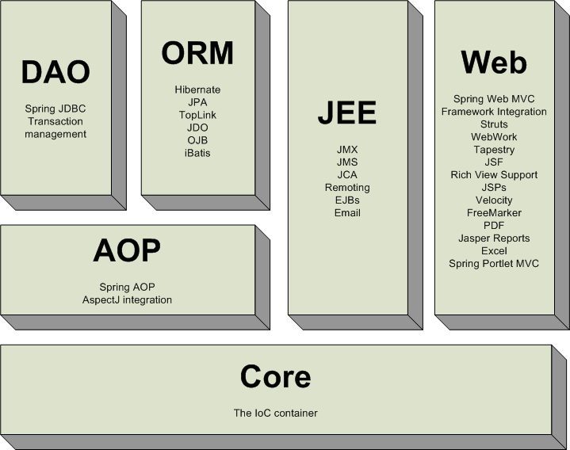
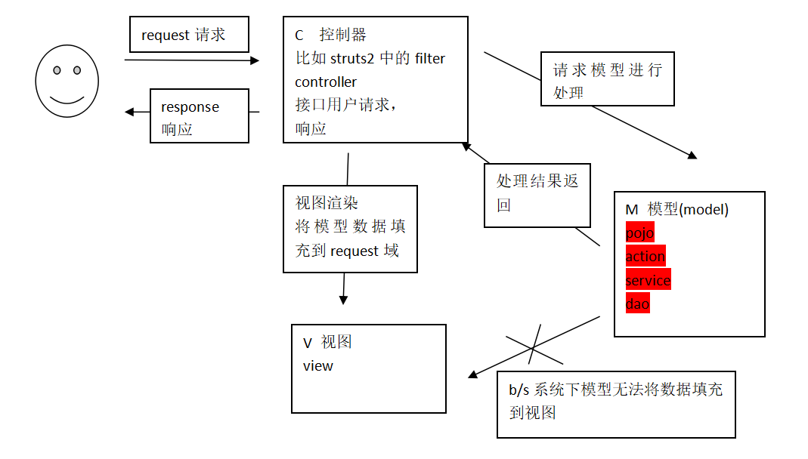
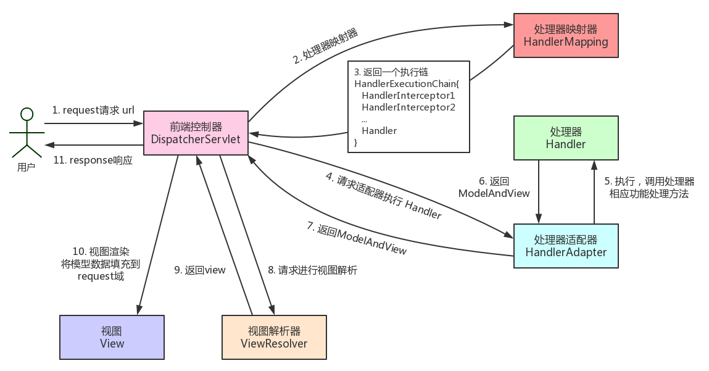

# SpringMVC

## 框架原理和入门配置

本文主要介绍springmvc的框架原理，并通过一个入门程序展示环境搭建，配置以及部署调试。

### 什么是Spring MVC

springmvc是spring框架的一个模块，springmvc和spring无需通过中间整合层进行整合。（struts2与Spring整合的时候需要借助单独的jar包）

springmvc是一个基于mvc的web框架。

给个官网示意图

<div align="center"> </div><br/>

### MVC在b/s系统 下的应用

mvc是一个设计模式，mvc在b/s系统下的应用：



### SpringMVC框架原理




**步骤**

1. 发起请求到前端控制器 (DispatcherServlet)

2. 前端控制器请求处理器映射器 (HandlerMapping) 查找 Handler (可根据 xml 配置、注解进行查找)

3. 处理器映射器 (HandlerMapping) 向前端控制器返回 Handler

4. 前端控制器调用处理器适配器 (HandlerAdapter) 执行 Handler

5. 处理器适配器 (HandlerAdapter) 去执行 Handler

6. Handler 执行完，给适配器返回 ModelAndView (SpringMVC 框架的一个底层对象)

7. 处理器适配器 (HandlerAdapter) 向前端控制器返回 ModelAndView

8. 前端控制器 (DispatcherServlet) 请求视图解析器 (ViewResolver) 进行视图解析，根据逻辑视图名解析成真正的视图 (jsp)

9. 视图解析器 (ViewResolver) 向前端控制器 (DispatcherServlet) 返回 View

10. 前端控制器进行视图渲染，即将模型数据 (在 ModelAndView 对象中)填充到 request 域

11. 前端控制器向用户响应结果

**组件及其作用**

1. 前端控制器 (DispatcherServlet)

   接收请求，响应结果，相当于转发器，中央处理器。

   有了DispatcherServlet减少了其他组件之间的耦合度

2. 处理器映射器 (HandlerMapping)

   作用：根据请求的 url 查找 Handler

3. **处理器 (Handler)**

   注意：编写Handler时按照HandlerAdapter的要求去做，这样适配器才可以去正确执行Handler

4. 处理器适配器 (HandlerAdapter)

   作用：按照特定规则（HandlerAdapter要求的规则）执行Handler。

5. 视图解析器 (ViewResolver)

   作用：进行视图解析，根据逻辑视图解析成真正的视图 (View)

6. **视图 (View)**

   View 是一个接口实现类支持不同的 View 类型（jsp,pdf等等）


注意：只需要程序员开发，处理器和视图。


### springmvc入门程序

一个展示商品列表的小页面

#### 环境搭建

intellij IDEA 15.0.2

- A方法(有待商榷)

`new->project->maven->勾选create from archetype->选中webapp` 

在`src/main`下新建`java`文件夹，标记为`Sources Root`

这样建出来的工程感觉有问题，点开一些xml文件一片红，心里不是很踏实，所以放弃这个方法了


- B方法

`new->project->maven`，建一个裸的maven工程，手动建webapp的目录

在`src/main`下新建文件夹`webapp`

pom.xml文件

添加依赖

```xml
<dependency>
    <groupId>org.springframework</groupId>
    <artifactId>spring-webmvc</artifactId>
    <version>4.2.4.RELEASE</version>
</dependency>
```

加上下面的标签会生成Artifacts

```xml
<packaging>war</packaging>
```

build标签的finalName要和Artifacts的output directory一致

```xml
<build>
    <finalName>springmvc-2nd-1.0-SNAPSHOT</finalName>
</build>
```


#### 配置文件

- 配置前端控制器

web.xml

```xml
<servlet>
    <servlet-name>springmvc</servlet-name>
    <servlet-class>org.springframework.web.servlet.DispatcherServlet</servlet-class>
    <!-- contextConfigLocation配置springmvc加载的配置文件(配置处理器映射器、适配器等等)
      若不配置，默认加载WEB-INF/servlet名称-servlet(springmvc-servlet.xml)
    -->
    <init-param>
        <param-name>contextConfigLocation</param-name>
        <param-value>classpath:springmvc.xml</param-value>
    </init-param>
</servlet>
```

```xml
<servlet-mapping>
    <servlet-name>springmvc</servlet-name>
    <!--
    第一种:*.action,访问以.action结尾，由DispatcherServlet进行解析
    第二种:/,所有访问的地址由DispatcherServlet进行解析，对静态文件的解析需要配置不让DispatcherServlet进行解析，
            使用此种方式和实现RESTful风格的url
    第三种:/*,这样配置不对，使用这种配置，最终要转发到一个jsp页面时，仍然会由DispatcherServlet解析jsp地址，
            不能根据jsp页面找到handler，会报错
    -->
    <url-pattern>*.action</url-pattern>
</servlet-mapping>
```

- 配置Handler

将编写Handler在spring容器加载

```xml
<!-- 配置Handler -->
<bean name="/queryItems.action" class="com.iot.ssm.controller.ItemsController"/>

```

- 配置处理器映射器

在classpath下的springmvc.xml中配置处理器映射器

```xml
<!-- 处理器映射器
    将bean的name作为url进行查找，需要在配置Handler时指定beanname(就是url)
-->
<bean class="org.springframework.web.servlet.handler.BeanNameUrlHandlerMapping"/>
```


- 配置处理器适配器

所有处理器适配器都实现了`HandlerAdapter`接口

`<bean class="org.springframework.web.servlet.mvc.SimpleControllerHandlerAdapter">`


源码

```java
public boolean supports(Object handler) {
        return handler instanceof Controller;
}
```

此适配器能执行实现`Controller`接口的Handler


- 配置视图解析器

需要配置解析jsp的视图解析器

```xml
 <!-- 视图解析器
    解析jsp,默认使用jstl,classpath下要有jstl的包
    -->
    <bean class="org.springframework.web.servlet.view.InternalResourceViewResolver"/>

```


在springmvc.xml中视图解析器配置前缀和后缀：

```xml
<bean class="org.springframework.web.servlet.view.InternalResourceViewResolver">
        <!-- 配置jsp路径的前缀 -->
        <property name="prefix" value="/WEB-INF/jsp/"/>
        <!-- 配置jsp路径的后缀 -->
        <property name="suffix" value=".jsp"/>
</bean>

```

程序中不用指定前缀和后缀：

```java
//指定视图
//下边的路径，如果在视图解析器中配置jsp的路径前缀和后缀，修改为items/itemsList
//modelAndView.setViewName("/WEB-INF/jsp/items/itemsList.jsp");

//下边的路径配置就可以不在程序中指定jsp路径的前缀和后缀
modelAndView.setViewName("items/itemsList");

```


#### 部署调试

`HTTP Status 404 -`
处理器映射器根据url找不到Handler,说明url错误

`HTTP Status 404 -/springmvc/WEB-INF/jsp/items/itemsLists.jsp`
处理器映射器根据url找到了Handler，转发的jsp页面找不到

`Maven Repository: org.springframework » spring-webmvc » 5.0.8.RELEASE`


### 参考链接

>* [第二章 Spring MVC入门 —— 跟开涛学SpringMVC](http://sishuok.com/forum/blogPost/list/5160.html)
>* [Spring MVC Framework Tutorial - TutorialsPoint](http://www.tutorialspoint.com/spring/spring_web_mvc_framework.htm)
>* [Web MVC framework](http://docs.spring.io/spring/docs/current/spring-framework-reference/html/mvc.html)
>* [IntelliJ idea创建Spring MVC的Maven项目 - winner_0715 - 博客园](https://www.cnblogs.com/winner-0715/p/5294917.html)

## 非注解的处理器映射器和适配器

本文主要介绍非注解的处理器映射器和适配器配置


### 非注解的处理器映射器

```xml
 <!-- 配置Handler -->
<bean id="itemsController" name="/queryItems.action" class="com.iot.ssm.controller.ItemsController"/>

<!-- 处理器映射器
将bean的name作为url进行查找，需要在配置Handler时指定beanname(就是url)
 -->
<bean class="org.springframework.web.servlet.handler.BeanNameUrlHandlerMapping"/>

<!-- 简单url映射-->
<bean class="org.springframework.web.servlet.handler.SimpleUrlHandlerMapping">
    <property name="mappings">
        <props>
            <!-- 对 itemsController进行url映射-->
            <prop key="/queryItems1.action">itemsController</prop>
            <prop key="/queryItems2.action">itemsController</prop>
        </props>
    </property>
</bean>
```

多个映射器可并存，前端控制器判断url能让哪些映射器处理就让正确的映射器处理


### 非注解的处理器适配器

```
 <!-- 处理器适配器
     所有处理器适配器都实现了HandlerAdapter接口
     -->
    <bean class="org.springframework.web.servlet.mvc.SimpleControllerHandlerAdapter"/>
```

要求编写的Handler实现`Controller`接口

`<bean class="org.springframework.web.servlet.mvc.HttpRequestHandlerAdapter"/>`

要求编写的Handler实现`HttpRequestHandler`接口

```java
package com.iot.ssm.controller;

import com.iot.ssm.po.Items;
import org.springframework.web.HttpRequestHandler;

import javax.servlet.ServletException;
import javax.servlet.http.HttpServletRequest;
import javax.servlet.http.HttpServletResponse;
import java.io.IOException;
import java.util.ArrayList;
import java.util.List;

/**
 * Created by brian on 2016/2/19.
 */
public class ItemsController2 implements HttpRequestHandler{
    public void handleRequest(HttpServletRequest httpServletRequest, HttpServletResponse httpServletResponse) throws ServletException, IOException {
        //调用service查找数据库，查询商品列表，这里使用静态数据模拟
        List<Items> itemsList = new ArrayList<Items>();

        //向list中填充静态数据
        Items items_1 = new Items();
        items_1.setName("联想笔记本");
        items_1.setPrice(6000f);
        items_1.setDetail("ThinkPad T430 联想笔记本电脑！");

        Items items_2 = new Items();
        items_2.setName("苹果手机");
        items_2.setPrice(5000f);
        items_2.setDetail("iphone6苹果手机！");

        itemsList.add(items_1);
        itemsList.add(items_2);

        //设置模型数据
        httpServletRequest.setAttribute("itemsList",itemsList);

        //设置转发的视图
        httpServletRequest.getRequestDispatcher("/WEB-INF/jsp/items/itemsList.jsp").forward(httpServletRequest,httpServletResponse);

    }
}
```


`HttpRequestHandler`适配器的`handleRequest`方法返回为`void`,没有返回`ModelAndView`，可通过response修改响应内容,比如返回json数据：

```java
response.setCharacterEncoding("utf-8");
response.setContentType("application/json;charset=utf-8");
response.getWriter().write("json串");
```

## 注解的处理器映射器和适配器


本文主要介绍注解的处理器映射器和适配器相关配置


### 默认加载

前端控制器从`\org\springframework\web\servlet\DispatcherServlet.properties`件中加载处理器映射器、适配器、视图解析器等组件，如果不在springmvc.xml中配置，则使用默认加载的

注解的处理器映射器和适配器

- 在spring3.1之前使用`org.springframework.web.servlet.mvc.annotation.DefaultAnnotationHandlerMapping`注解映射器。
- 在spring3.1之后使用`org.springframework.web.servlet.mvc.method.annotation.RequestMappingHandlerMapping`注解映射器。
- 在spring3.1之前使用`org.springframework.web.servlet.mvc.annotation.AnnotationMethodHandlerAdapter`注解适配器。
- 在spring3.1之后使用`org.springframework.web.servlet.mvc.method.annotation.RequestMappingHandlerAdapter`注解适配器


### 注解的处理器映射器和适配器

```xml
<!-- 注解的映射器 -->
    <bean class="org.springframework.web.servlet.mvc.method.annotation.RequestMappingHandlerMapping"/>

<!-- 注解的适配器 -->
    <bean class="org.springframework.web.servlet.mvc.method.annotation.RequestMappingHandlerAdapter"/>
    
```

或者

```xml
    <!-- 使用mvc:annotation-driven代替上面两个注解映射器和注解适配的配置
     mvc:annotation-driven默认加载很多的参数绑定方法，
     比如json转换解析器默认加载了，如果使用mvc:annotation-driven则不用配置上面的RequestMappingHandlerMapping和RequestMappingHandlerAdapter
     实际开发时使用mvc:annotation-driven
     -->
    <mvc:annotation-driven></mvc:annotation-driven>

```

### 开发注解Handler

使用注解的映射器和注解的适配器。(使用注解的映射器和注解的适配器必须配对使用)

```java
//使用@Controller来标识它是一个控制器
@Controller
public class ItemsController3 {

    //商品查询列表
    @RequestMapping("/queryItems")
    //实现 对queryItems方法和url进行映射，一个方法对应一个url
    //一般建议将url和方法写成一样
    public ModelAndView queryItems() throws Exception{
        //调用service查找数据库，查询商品列表，这里使用静态数据模拟
        List<Items> itemsList = new ArrayList<Items>();

        //向list中填充静态数据
        Items items_1 = new Items();
        items_1.setName("联想笔记本");
        items_1.setPrice(6000f);
        items_1.setDetail("ThinkPad T430 c3 联想笔记本电脑！");

        Items items_2 = new Items();
        items_2.setName("苹果手机");
        items_2.setPrice(5000f);
        items_2.setDetail("iphone6苹果手机！");

        itemsList.add(items_1);
        itemsList.add(items_2);

        //返回ModelAndView
        ModelAndView modelAndView = new ModelAndView();
        //相当于request的setAttribute方法,在jsp页面中通过itemsList取数据
        modelAndView.addObject("itemsList",itemsList);

        //指定视图
        modelAndView.setViewName("/WEB-INF/jsp/items/itemsList.jsp");
        return modelAndView;
    }
}
```

### 在spring容器中加载Handler

```xml
<!-- 对于注解的Handler 可以单个配置
    实际开发中加你使用组件扫描
    -->
    <!--  <bean  class="com.iot.ssm.controller.ItemsController3"/> -->
    <!-- 可以扫描controller、service、...
	这里让扫描controller，指定controller的包
	 -->
    <context:component-scan base-package="com.iot.ssm.controller"></context:component-scan>
```

### 参考资料

>* [SpringMVC框架】注解的处理器映射器和适配器配置](http://blog.csdn.net/acmman/article/details/46980427)

## 前端控制器


通过前端控制器源码分析springmvc执行过程

1. 前端控制器接收请求

调用`doDispatch`方法

```java
protected void doDispatch(HttpServletRequest request, HttpServletResponse response) throws Exception {
		HttpServletRequest processedRequest = request;
		HandlerExecutionChain mappedHandler = null;
		boolean multipartRequestParsed = false;
    
         。。。。。
}
```

2. 前端控制器调用`HandlerMapping`（处理器映射器）根据url查找Handler


```java
// Determine handler for the current request.
mappedHandler = getHandler(processedRequest);
```

```java
/**
	 * Return the HandlerExecutionChain for this request.
	 * <p>Tries all handler mappings in order.
	 * @param request current HTTP request
	 * @return the HandlerExecutionChain, or {@code null} if no handler could be found
	 */
	protected HandlerExecutionChain getHandler(HttpServletRequest request) throws Exception {
		for (HandlerMapping hm : this.handlerMappings) {
			if (logger.isTraceEnabled()) {
				logger.trace(
						"Testing handler map [" + hm + "] in DispatcherServlet with name '" + getServletName() + "'");
			}
			HandlerExecutionChain handler = hm.getHandler(request);
			if (handler != null) {
				return handler;
			}
		}
		return null;
	}
```

3. 调用处理器适配器执行Handler,得到执行的结果`ModelAndView mv`

在`doDispatch`方法中

```java
// Actually invoke the handler.
mv = ha.handle(processedRequest, response, mappedHandler.getHandler());
```

4. 视图渲染，将model数据填充到request域

`doDispatch`->`processDispatchResult`->`render`

在`render`方法中,视图解析得到view

```java
// We need to resolve the view name.
view = resolveViewName(mv.getViewName(), mv.getModelInternal(), locale, request);
		
```

调用view的渲染方法，将model数据填充到request域

在`render`方法中,调用`View`接口的`render`方法

```java
view.render(mv.getModelInternal(), request, response);
```


程序我也没细读，感觉分析比较浅，很多还没弄懂，等我系统阅读源码后会整理一篇好点的。

## 入门程序小结


通过入门程序理解springmvc前端控制器、处理器映射器、处理器适配器、视图解析器用法。并附上入门程序的非注解的完整的配置文件，注解的完整配置文件。

### 入门程序配置小结

前端控制器配置：

- 第一种：`*.action`，访问以`.action`结尾 由`DispatcherServlet`进行解析
- 第二种：`/`，所以访问的地址都由`DispatcherServlet`进行解析，对于静态文件的解析需要配置不让`DispatcherServlet`进行解析,使用此种方式可以实现RESTful风格的url

处理器映射器：

- 非注解处理器映射器（了解）
- 注解的处理器映射器（掌握）
  - 对标记 `@Controller` 类中标识有 `@RequestMapping` 的方法进行映射。在 `@RequestMapping` 里边定义映射的 url 。使用注解的映射器不用在 xml 中配置 url 和 Handler 的映射关系。

处理器适配器：

- 非注解处理器适配器（了解）
- 注解的处理器适配器（掌握）
  - 注解处理器适配器和注解的处理器映射器是**配对使用**。理解为不能使用非注解映射器进行映射。

```xml
<mvc:annotation-driven></mvc:annotation-driven> 
```

可以代替下边的配置：

```xml
<!--注解映射器 -->  
    <bean class="org.springframework.web.servlet.mvc.method.annotation.RequestMappingHandlerMapping"/>  
    <!--注解适配器 -->  
    <bean class="org.springframework.web.servlet.mvc.method.annotation.RequestMappingHandlerAdapter"/>  
```

### 非注解的完整的配置文件

`src/main/resources/springmvc.xml`

```xml
<beans xmlns="http://www.springframework.org/schema/beans"
       xmlns:context="http://www.springframework.org/schema/context"
       xmlns:mvc="http://www.springframework.org/schema/mvc"
       xmlns:xsi="http://www.w3.org/2001/XMLSchema-instance"
       xsi:schemaLocation="http://www.springframework.org/schema/beans http://www.springframework.org/schema/beans/spring-beans-4.0.xsd
    http://www.springframework.org/schema/mvc http://www.springframework.org/schema/mvc/spring-mvc-4.0.xsd
    http://www.springframework.org/schema/context http://www.springframework.org/schema/context/spring-context-4.0.xsd">

    <!-- 配置Handler -->
    <bean name="/queryItems.action" class="com.iot.ssm.controller.ItemsController"/>

    <!-- 处理器映射器
    将bean的name作为url进行查找，需要在配置Handler时指定beanname(就是url)
     -->
    <bean class="org.springframework.web.servlet.handler.BeanNameUrlHandlerMapping"/>

    <!-- 处理器适配器
     所有处理器适配器都实现了HandlerAdapter接口
     -->
    <bean class="org.springframework.web.servlet.mvc.SimpleControllerHandlerAdapter"/>

    <!-- 视图解析器
    解析jsp,默认使用jstl,classpath下要有jstl的包
    -->
    <bean class="org.springframework.web.servlet.view.InternalResourceViewResolver"/>

</beans>
```

### 注解的完整配置文件

```xml
<beans xmlns="http://www.springframework.org/schema/beans"
       xmlns:context="http://www.springframework.org/schema/context"
       xmlns:mvc="http://www.springframework.org/schema/mvc"
       xmlns:xsi="http://www.w3.org/2001/XMLSchema-instance"
       xsi:schemaLocation="http://www.springframework.org/schema/beans http://www.springframework.org/schema/beans/spring-beans-4.0.xsd
    http://www.springframework.org/schema/mvc http://www.springframework.org/schema/mvc/spring-mvc-4.0.xsd
    http://www.springframework.org/schema/context http://www.springframework.org/schema/context/spring-context-4.0.xsd">

   <!-- 对于注解的Handler 可以单个配置
    实际开发中加你使用组件扫描
    -->
    <!--  <bean  class="com.iot.ssm.controller.ItemsController3"/> -->
    <!-- 可以扫描controller、service、...
	这里让扫描controller，指定controller的包
	 -->
    <context:component-scan base-package="com.iot.ssm.controller"></context:component-scan>


    <!-- 注解的映射器 -->
    <bean class="org.springframework.web.servlet.mvc.method.annotation.RequestMappingHandlerMapping"/>

    <!-- 注解的适配器 -->
    <bean class="org.springframework.web.servlet.mvc.method.annotation.RequestMappingHandlerAdapter"/>

    <!-- 使用mvc:annotation-driven代替上面两个注解映射器和注解适配的配置
     mvc:annotation-driven默认加载很多的参数绑定方法，
     比如json转换解析器默认加载了，如果使用mvc:annotation-driven则不用配置上面的RequestMappingHandlerMapping和RequestMappingHandlerAdapter
     实际开发时使用mvc:annotation-driven
     -->
    <mvc:annotation-driven></mvc:annotation-driven>

    <!-- 视图解析器
    解析jsp,默认使用jstl,classpath下要有jstl的包
    -->
    <bean class="org.springframework.web.servlet.view.InternalResourceViewResolver">
        <!-- 配置jsp路径的前缀 -->
        <property name="prefix" value="/WEB-INF/jsp/"/>
        <!-- 配置jsp路径的后缀 -->
        <property name="suffix" value=".jsp"/>
    </bean>

</beans>
```

## springmvc整合mybatis


本文主要展示如何在intellij IDEA中通过maven构建springmvc+mybatis框架的开发环境。

需求：使用springmvc和mybatis完成商品列表查询

### 整合思路

> springmvc_整合mybatis思路图待补充


- 第一步：整合dao层
  - mybatis和spring整合，通过spring管理mapper接口。
  - 使用mapper的扫描器自动扫描mapper接口在spring中进行注册。

- 第二步：整合service层
  - 通过spring管理service接口。
  - 使用配置方式将service接口配置在spring配置文件中。
  - 实现事务控制。

- 第三步：整合springmvc
  - 由于springmvc是spring的模块，不需要整合。

### 工程结构

不同于[《mybatis学习笔记(17)-spring和mybatis整合》](http://blog.csdn.net/h3243212/article/details/50778934)中的示例demo,**本文的整合采用maven构建**。

如何创建使用maven构建的web应用可以参考前面的一篇[《springmvc学习笔记(1)-框架原理和入门配置》](http://blog.csdn.net/h3243212/article/details/50828141#环境搭建)

`new->project->maven`，建一个裸的maven工程，手动建webapp的目录

在`src/main`下新建文件夹`webapp`

#### 添加依赖

pom.xml文件

```xml
<?xml version="1.0" encoding="UTF-8"?>
<project xmlns="http://maven.apache.org/POM/4.0.0"
         xmlns:xsi="http://www.w3.org/2001/XMLSchema-instance"
         xsi:schemaLocation="http://maven.apache.org/POM/4.0.0 http://maven.apache.org/xsd/maven-4.0.0.xsd">
    <modelVersion>4.0.0</modelVersion>

    <groupId>com.iot.learnssm</groupId>
    <artifactId>learnssm-firstssm</artifactId>
    <version>1.0-SNAPSHOT</version>
    <packaging>war</packaging>
    
    <properties>
        <project.build.sourceEncoding>UTF-8</project.build.sourceEncoding>
        <!-- jar 版本设置 -->
        <spring.version>4.2.4.RELEASE</spring.version>
    </properties>


    <dependencies>

        <!-- spring框架-->
        <dependency>
            <groupId>org.springframework</groupId>
            <artifactId>spring-webmvc</artifactId>
            <version>${spring.version}</version>
        </dependency>

        <dependency>
            <groupId>org.springframework</groupId>
            <artifactId>spring-core</artifactId>
            <version>${spring.version}</version>
        </dependency>

        <dependency>
            <groupId>org.springframework</groupId>
            <artifactId>spring-orm</artifactId>
            <version>${spring.version}</version>
        </dependency>

        <dependency>
            <groupId>org.springframework</groupId>
            <artifactId>spring-aspects</artifactId>
            <version>${spring.version}</version>
        </dependency>

        <dependency>
            <groupId>org.springframework</groupId>
            <artifactId>spring-test</artifactId>
            <version>${spring.version}</version>
        </dependency>

        <dependency>
            <groupId>org.springframework</groupId>
            <artifactId>spring-jdbc</artifactId>
            <version>${spring.version}</version>
        </dependency>


        <dependency>
            <groupId>mysql</groupId>
            <artifactId>mysql-connector-java</artifactId>
            <version>5.1.38</version>
        </dependency>
        <dependency>
            <groupId>org.mybatis</groupId>
            <artifactId>mybatis</artifactId>
            <version>3.3.1</version>
        </dependency>
        <dependency>
            <groupId>org.mybatis</groupId>
            <artifactId>mybatis-spring</artifactId>
            <version>1.2.4</version>
        </dependency>
        <dependency>
            <groupId>log4j</groupId>
            <artifactId>log4j</artifactId>
            <version>1.2.17</version>
        </dependency>
        
        <dependency>
            <groupId>org.slf4j</groupId>
            <artifactId>slf4j-api</artifactId>
            <version>1.7.18</version>
        </dependency>

        <dependency>
            <groupId>commons-dbcp</groupId>
            <artifactId>commons-dbcp</artifactId>
            <version>1.4</version>
        </dependency>

        <!-- JSP tag -->
        <dependency>
            <groupId>javax.servlet</groupId>
            <artifactId>jstl</artifactId>
            <version>1.2</version>
        </dependency>
        <dependency>
            <groupId>taglibs</groupId>
            <artifactId>standard</artifactId>
            <version>1.1.2</version>
        </dependency>
    </dependencies>
    
</project>
```

这里添加的依赖可能有多的,但总比少包好，我开始就是引少了依赖(springframework的依赖只引用了spring-mvc,连spring-core都没引)，导致报错,以后会出一篇博客专门讲这个系列笔记中debug相关问题。


#### 建包

在java目录下建各个package,按照maven的命名习惯:

`com.公司名.项目名.模块名`

这里我的包为：

`com.iot.learnssm.firstssm`

包含几个子包：

- controller
- mapper
- po
- service
  - impl 

项目结构如图：

> 图待补充

后面几篇笔记会依次记录mapper,service,controller各个部分的整合

## 整合mybatis之mapper

本文记录springmvc整合dao的配置

### 整合dao

首先在resource文件夹下添加两个文件：数据库配置文件和日志配置文件

- 数据库配置文件db.properties

```
jdbc.driver=com.mysql.jdbc.Driver
jdbc.url=jdbc:mysql://120.25.162.238:3306/mybatis001?characterEncoding=utf-8
jdbc.username=root
jdbc.password=123
```

- 日志配置文件log4j.properties

```
# Global logging configuration
log4j.rootLogger=DEBUG, stdout
# Console output...
log4j.appender.stdout=org.apache.log4j.ConsoleAppender
log4j.appender.stdout.layout=org.apache.log4j.PatternLayout
log4j.appender.stdout.layout.ConversionPattern=%5p [%t] - %m%n
```

#### sqlMapConfig.xml

mybatis自己的配置文件

在resources目录下新建mybatis文件夹，并新建sqlMapConfig.xml文件

```xml
<?xml version="1.0" encoding="UTF-8" ?>
<!DOCTYPE configuration
        PUBLIC "-//mybatis.org//DTD Config 3.0//EN"
        "http://mybatis.org/dtd/mybatis-3-config.dtd">
<configuration>

    <!-- 全局setting配置，根据需要添加 -->

    <!-- 配置别名 -->
    <typeAliases>
        <!-- 批量扫描别名 -->
        <package name="com.iot.learnssm.firstssm.po"/>
    </typeAliases>

    <!-- 配置mapper
    由于使用spring和mybatis的整合包进行mapper扫描，这里不需要配置了。
    必须遵循：mapper.xml和mapper.java文件同名且在一个目录
     -->

    <!-- <mappers>

    </mappers> -->
</configuration>
```


#### applicationContext-dao.xml

在resources目录下新建spring文件夹，并新建applicationContext-dao.xml文件

配置：

- 数据源
- SqlSessionFactory
- mapper扫描器

```xml
<beans xmlns="http://www.springframework.org/schema/beans"
       xmlns:context="http://www.springframework.org/schema/context"
       xmlns:mvc="http://www.springframework.org/schema/mvc"
       xmlns:xsi="http://www.w3.org/2001/XMLSchema-instance"
       xsi:schemaLocation="http://www.springframework.org/schema/beans http://www.springframework.org/schema/beans/spring-beans-4.0.xsd
    http://www.springframework.org/schema/mvc http://www.springframework.org/schema/mvc/spring-mvc-4.0.xsd
    http://www.springframework.org/schema/context http://www.springframework.org/schema/context/spring-context-4.0.xsd">

    <!-- 加载db.properties文件中的内容，db.properties文件中key命名要有一定的特殊规则 -->
    <context:property-placeholder location="classpath:db.properties" />
    <!-- 配置数据源 ，dbcp -->

    <bean id="dataSource" class="org.apache.commons.dbcp.BasicDataSource" destroy-method="close">
        <property name="driverClassName" value="${jdbc.driver}"/>
        <property name="url" value="${jdbc.url}"/>
        <property name="username" value="${jdbc.username}" />
        <property name="password" value="${jdbc.password}" />
        <property name="maxActive" value="30" />
        <property name="maxIdle" value="5" />
    </bean>

    <!-- 从整合包里找，org.mybatis:mybatis-spring:1.2.4 -->
    <!-- sqlSessionFactory -->
    <bean id="sqlSessionFactory" class="org.mybatis.spring.SqlSessionFactoryBean">
        <!-- 数据库连接池 -->
        <property name="dataSource" ref="dataSource" />
        <!-- 加载mybatis的全局配置文件 -->
        <property name="configLocation" value="classpath:mybatis/sqlMapConfig.xml" />
    </bean>
    <!-- mapper扫描器 -->
    <bean class="org.mybatis.spring.mapper.MapperScannerConfigurer">
        <!-- 扫描包路径，如果需要扫描多个包，中间使用半角逗号隔开 -->
        <property name="basePackage" value="com.iot.learnssm.firstssm.mapper"/>
        <property name="sqlSessionFactoryBeanName" value="sqlSessionFactory" />
       <!-- <property name="sqlSessionFactory" ref="sqlSessionFactory" />
       会导致数据源配置不管用，数据库连接不上。
       且spring 4弃用
       -->
    </bean>

</beans>

```


#### 逆向工程生成po类及mapper(单表增删改查)

方法参见[《mybatis学习笔记(18)-mybatis逆向工程》](http://blog.csdn.net/h3243212/article/details/50778937)


#### 手动定义商品查询mapper

针对综合查询mapper，一般情况会有关联查询，建议自定义mapper

- ItemsMapperCustom.xml

```xml
<?xml version="1.0" encoding="UTF-8" ?>
<!DOCTYPE mapper PUBLIC "-//mybatis.org//DTD Mapper 3.0//EN" "http://mybatis.org/dtd/mybatis-3-mapper.dtd" >
<mapper namespace="com.iot.learnssm.firstssm.mapper.ItemsMapperCustom" >

   <!-- 定义商品查询的sql片段，就是商品查询条件 -->
   <sql id="query_items_where">
   	<!-- 使用动态sql，通过if判断，满足条件进行sql拼接 -->
   	<!-- 商品查询条件通过ItemsQueryVo包装对象 中itemsCustom属性传递 -->
   		<if test="itemsCustom!=null">
   			<if test="itemsCustom.name!=null and itemsCustom.name!=''">
   				items.name LIKE '%${itemsCustom.name}%'
   			</if>
   		</if>
	
   </sql>
  	
  	<!-- 商品列表查询 -->
  	<!-- parameterType传入包装对象(包装了查询条件)
  		resultType建议使用扩展对象
  	 -->
  	<select id="findItemsList" parameterType="com.iot.learnssm.firstssm.po.ItemsQueryVo"
  		 resultType="com.iot.learnssm.firstssm.po.ItemsCustom">
  		SELECT items.* FROM items  
  		<where>
  			<include refid="query_items_where"></include>
  		</where>
  	</select>
  	
</mapper>
```

- ItemsMapperCustom.java

```java
public interface ItemsMapperCustom {
    //商品查询列表
    List<ItemsCustom> findItemsList(ItemsQueryVo itemsQueryVo)throws Exception;
}
```

- po类`ItemsCustom`

```java
package com.iot.learnssm.firstssm.po;

/**
 * Created by Brian on 2016/3/2.
 * 商品信息的扩展类
 */
public class ItemsCustom extends Items{
    //添加商品信息的扩展属性
}
```

- 输入pojo的包装类

```java
package com.iot.learnssm.firstssm.po;

/**
 * Created by Brian on 2016/3/2.
 */
public class ItemsQueryVo {

    //商品信息
    private Items items;

    //为了系统 可扩展性，对原始生成的po进行扩展
    private ItemsCustom itemsCustom;

    public Items getItems() {
        return items;
    }

    public void setItems(Items items) {
        this.items = items;
    }

    public ItemsCustom getItemsCustom() {
        return itemsCustom;
    }

    public void setItemsCustom(ItemsCustom itemsCustom) {
        this.itemsCustom = itemsCustom;
    }
}
```


整合好dao后的工程目录如图

> springmvc_整合工程-2图待补充

## 整合mybatis之service


本文记录如何整合service,包括定义spring接口，在spring容器配置service以及事务控制。让spring管理service接口。


### 定义service接口

```java
public interface ItemsService {
    //商品查询列表
    List<ItemsCustom> findItemsList(ItemsQueryVo itemsQueryVo) throws Exception;

}
```

```java
public class ItemsServiceImpl implements ItemsService {

    @Autowired
    private ItemsMapperCustom itemsMapperCustom;

    public List<ItemsCustom> findItemsList(ItemsQueryVo itemsQueryVo) throws Exception {
        return itemsMapperCustom.findItemsList(itemsQueryVo);
    }
}
```

### 在spring容器配置service


在`resources/spring`下创建applicationContext-service.xml，文件中配置service。

```xml
<beans xmlns="http://www.springframework.org/schema/beans"
       xmlns:xsi="http://www.w3.org/2001/XMLSchema-instance"
       xsi:schemaLocation="http://www.springframework.org/schema/beans http://www.springframework.org/schema/beans/spring-beans-4.0.xsd">

    <!-- 商品管理的service -->
    <bean id="itemsService" class="com.iot.learnssm.firstssm.service.impl.ItemsServiceImpl"/>

</beans>
```

### 事务控制

在`resources/spring`下创建applicationContext-transaction.xml，在applicationContext-transaction.xml中使用spring声明式事务控制方法。

```xml
<?xml version="1.0" encoding="UTF-8"?>
<beans xmlns="http://www.springframework.org/schema/beans"
       xmlns:xsi="http://www.w3.org/2001/XMLSchema-instance"
       xmlns:tx="http://www.springframework.org/schema/tx"
       xmlns:aop="http://www.springframework.org/schema/aop"
       xsi:schemaLocation="http://www.springframework.org/schema/beans http://www.springframework.org/schema/beans/spring-beans.xsd
        http://www.springframework.org/schema/tx http://www.springframework.org/schema/tx/spring-tx-4.0.xsd
        http://www.springframework.org/schema/aop http://www.springframework.org/schema/aop/spring-aop.xsd">


<!-- 事务管理器
        对mybatis操作数据库事务控制，spring使用jdbc的事务控制类
    -->
    <bean id="transactionManager" class="org.springframework.jdbc.datasource.DataSourceTransactionManager">
        <!-- 数据源
        dataSource在applicationContext-dao.xml中配置了
         -->
        <property name="dataSource" ref="dataSource"/>
    </bean>

    <!-- 通知 -->
    <tx:advice id="txAdvice" transaction-manager="transactionManager">
        <tx:attributes>
            <!-- 传播行为 -->
            <tx:method name="save*" propagation="REQUIRED"/>
            <tx:method name="delete*" propagation="REQUIRED"/>
            <tx:method name="insert*" propagation="REQUIRED"/>
            <tx:method name="update*" propagation="REQUIRED"/>
            <tx:method name="find*" propagation="SUPPORTS" read-only="true"/>
            <tx:method name="get*" propagation="SUPPORTS" read-only="true"/>
            <tx:method name="select*" propagation="SUPPORTS" read-only="true"/>
        </tx:attributes>
    </tx:advice>
    <!-- aop -->
    <aop:config>
        <aop:advisor advice-ref="txAdvice" pointcut="execution(* com.iot.learnssm.firstssm.service.impl.*.*(..))"/>
    </aop:config>
</beans>
```

## 整合mybatis之controller

本文介绍如何配置springmvc配置文件和web.xml，以及如何编写controller,jsp


### springmvc.xml

在`resources/spring`文件下下创建springmvc.xml文件，配置处理器映射器、适配器、视图解析器。

```xml
<beans xmlns="http://www.springframework.org/schema/beans"
       xmlns:context="http://www.springframework.org/schema/context"
       xmlns:mvc="http://www.springframework.org/schema/mvc"
       xmlns:xsi="http://www.w3.org/2001/XMLSchema-instance"
       xsi:schemaLocation="http://www.springframework.org/schema/beans http://www.springframework.org/schema/beans/spring-beans-4.0.xsd
    http://www.springframework.org/schema/mvc http://www.springframework.org/schema/mvc/spring-mvc-4.0.xsd
    http://www.springframework.org/schema/context http://www.springframework.org/schema/context/spring-context-4.0.xsd">

   <!-- 对于注解的Handler 可以单个配置
    实际开发中加你使用组件扫描
    -->
    <!-- 可以扫描controller、service、...
	这里让扫描controller，指定controller的包
	 -->
    <context:component-scan base-package="com.iot.learnssm.firstssm.controller"></context:component-scan>


    <!-- 使用mvc:annotation-driven代替上面两个注解映射器和注解适配的配置
     mvc:annotation-driven默认加载很多的参数绑定方法，
     比如json转换解析器默认加载了，如果使用mvc:annotation-driven则不用配置上面的RequestMappingHandlerMapping和RequestMappingHandlerAdapter
     实际开发时使用mvc:annotation-driven
     -->
    <mvc:annotation-driven></mvc:annotation-driven>

    <!-- 视图解析器
    解析jsp,默认使用jstl,classpath下要有jstl的包
    -->
    <bean class="org.springframework.web.servlet.view.InternalResourceViewResolver">
        <!-- 配置jsp路径的前缀 -->
        <property name="prefix" value="/WEB-INF/jsp/"/>
        <!-- 配置jsp路径的后缀 -->
        <property name="suffix" value=".jsp"/>
    </bean>

</beans>
```

### 配置web.xml


参考入门程序，web.xml

```xml
<?xml version="1.0" encoding="utf-8" ?>
<web-app xmlns:xsi="http://www.w3.org/2001/XMLSchema-instance" xmlns="http://java.sun.com/xml/ns/javaee"
         xsi:schemaLocation="http://java.sun.com/xml/ns/javaee http://java.sun.com/xml/ns/javaee/web-app_3_0.xsd"
         id="WebApp_ID" version="3.0">
    <display-name>firstssm</display-name>

    <!-- 加载spring容器 -->
    <context-param>
        <param-name>contextConfigLocation</param-name>
        <param-value>WEB-INF/classes/spring/applicationContext-*.xml</param-value>
        <!--  <param-value>classpath:spring/applicationContext-*.xml</param-value>-->
      </context-param>
    <listener>
      <listener-class>org.springframework.web.context.ContextLoaderListener</listener-class>
    </listener>


<!-- springmvc 前端控制器  -->
    <servlet>
        <servlet-name>springmvc</servlet-name>
        <servlet-class>org.springframework.web.servlet.DispatcherServlet</servlet-class>
        <!-- contextConfigLocation配置springmvc加载的配置文件(配置处理器映射器、适配器等等)
          若不配置，默认加载WEB-INF/servlet名称-servlet(springmvc-servlet.xml)
        -->
        <init-param>
            <param-name>contextConfigLocation</param-name>
            <param-value>classpath:spring/springmvc.xml</param-value>
        </init-param>
    </servlet>
    
    <servlet-mapping>
        <servlet-name>springmvc</servlet-name>
        <!--
        第一种:*.action,访问以.action三结尾，由DispatcherServlet进行解析
        第二种:/,所有访问的地址由DispatcherServlet进行解析，对静态文件的解析需要配置不让DispatcherServlet进行解析，
                使用此种方式和实现RESTful风格的url
        第三种:/*,这样配置不对，使用这种配置，最终要转发到一个jsp页面时，仍然会由DispatcherServlet解析jsp地址，
                不能根据jsp页面找到handler，会报错
        -->
        <url-pattern>*.action</url-pattern>
    </servlet-mapping>


    <welcome-file-list>
        <welcome-file>index.html</welcome-file>
        <welcome-file>index.htm</welcome-file>
        <welcome-file>index.jsp</welcome-file>
        <welcome-file>default.html</welcome-file>
        <welcome-file>default.htm</welcome-file>
        <welcome-file>default.jsp</welcome-file>
    </welcome-file-list>
</web-app>
```

这个文件有两个作用：

- 配置前端控制器(`DispatcherServlet`)
- 加载spring容器：添加spring容器监听器，加载spring容器，使用通配符加载`spring/`下的配置文件
  - applicationContext-dao.xml
  - applicationContext-service.xml
  - applicationContext-transaction.xml

### 编写Controller


```java
package com.iot.learnssm.firstssm.controller;


import com.iot.learnssm.firstssm.po.Items;
import com.iot.learnssm.firstssm.po.ItemsCustom;
import com.iot.learnssm.firstssm.service.ItemsService;
import org.springframework.beans.factory.annotation.Autowired;
import org.springframework.stereotype.Controller;
import org.springframework.web.bind.annotation.RequestMapping;
import org.springframework.web.servlet.ModelAndView;

import java.util.ArrayList;
import java.util.List;

/**
 * Created by brian on 2016/3/2.
 */

//使用@Controller来标识它是一个控制器
@Controller
//为了对url进行分类管理 ，可以在这里定义根路径，最终访问url是根路径+子路径
//比如：商品列表：/items/queryItems.action
public class ItemsController {

    @Autowired
    private ItemsService itemsService;

    //商品查询列表
    @RequestMapping("/queryItems")
    //实现 对queryItems方法和url进行映射，一个方法对应一个url
    //一般建议将url和方法写成一样
    public ModelAndView queryItems() throws Exception{
        //调用service查找数据库，查询商品列表
        List<ItemsCustom> itemsList = itemsService.findItemsList(null);

        //返回ModelAndView
        ModelAndView modelAndView = new ModelAndView();
        //相当于request的setAttribute方法,在jsp页面中通过itemsList取数据
        modelAndView.addObject("itemsList",itemsList);

        //指定视图
        //下边的路径，如果在视图解析器中配置jsp的路径前缀和后缀，修改为items/itemsList
        //modelAndView.setViewName("/WEB-INF/jsp/items/itemsList.jsp");
        //下边的路径配置就可以不在程序中指定jsp路径的前缀和后缀
        modelAndView.setViewName("items/itemsList");

        return modelAndView;
    }


}
```

### 编写jsp

服务器路径为`WEB-INF/jsp/items/itemsList.jsp`

```jsp
<%@ page language="java" contentType="text/html; charset=UTF-8"
    pageEncoding="UTF-8"%>
<%@ taglib uri="http://java.sun.com/jsp/jstl/core" prefix="c" %>
<%@ taglib uri="http://java.sun.com/jsp/jstl/fmt"  prefix="fmt"%>
<!DOCTYPE html PUBLIC "-//W3C//DTD HTML 4.01 Transitional//EN" "http://www.w3.org/TR/html4/loose.dtd">
<html>
<head>
<meta http-equiv="Content-Type" content="text/html; charset=UTF-8">
<title>查询商品列表</title>
</head>
<body> 
<form action="${pageContext.request.contextPath }/item/queryItem.action" method="post">
查询条件：
<table width="100%" border=1>
<tr>
<td><input type="submit" value="查询"/></td>
</tr>
</table>
商品列表：
<table width="100%" border=1>
<tr>
	<td>商品名称</td>
	<td>商品价格</td>
	<td>生产日期</td>
	<td>商品描述</td>
	<td>操作</td>
</tr>
<c:forEach items="${itemsList }" var="item">
<tr>
	<td>${item.name }</td>
	<td>${item.price }</td>
	<td><fmt:formatDate value="${item.createtime}" pattern="yyyy-MM-dd HH:mm:ss"/></td>
	<td>${item.detail }</td>
	
	<td><a href="${pageContext.request.contextPath }/item/editItem.action?id=${item.id}">修改</a></td>

</tr>
</c:forEach>

</table>
</form>
</body>

</html>
```

## 注解开发之商品修改功能

本文以商品修改为例，记录springmvc的注解开发，包括mapper,service,controller,@RequestMapping,controller方法的返回值等

### 需求

操作流程： 

- 1.进入商品查询列表页面
- 2.点击修改，进入商品修改页面，页面中显示了要修改的商品。要修改的商品从数据库查询，根据商品id(主键)查询商品信息
- 3.在商品修改页面，修改商品信息，修改后，点击提交

### 开发mapper

mapper：

- 根据id查询商品信息
- 根据id更新Items表的数据

不用开发了，使用逆向工程生成的代码。

### 开发service

在`com.iot.learnssm.firstssm.service.ItemsService`中添加两个接口

```java
  //根据id查询商品信息
    /**
     *
     * <p>Title: findItemsById</p>
     * <p>Description: </p>
     * @param id 查询商品的id
     * @return
     * @throws Exception
     */
     ItemsCustom findItemsById(Integer id) throws Exception;

    //修改商品信息
    /**
     *
     * <p>Title: updateItems</p>
     * <p>Description: </p>
     * @param id 修改商品的id
     * @param itemsCustom 修改的商品信息
     * @throws Exception
     */
     void updateItems(Integer id,ItemsCustom itemsCustom) throws Exception;

```

在`com.iot.learnssm.firstssm.service.impl.ItemsServiceImpl`中实现接口，增加`itemsMapper`属性


```java
@Autowired
private ItemsMapper itemsMapper;

public ItemsCustom findItemsById(Integer id) throws Exception {
    Items items = itemsMapper.selectByPrimaryKey(id);
    //中间对商品信息进行业务处理
    //....
    //返回ItemsCustom
    ItemsCustom itemsCustom = new ItemsCustom();
    //将items的属性值拷贝到itemsCustom
    BeanUtils.copyProperties(items, itemsCustom);

    return itemsCustom;
}

public void updateItems(Integer id, ItemsCustom itemsCustom) throws Exception {
    //添加业务校验，通常在service接口对关键参数进行校验
    //校验 id是否为空，如果为空抛出异常

    //更新商品信息使用updateByPrimaryKeyWithBLOBs根据id更新items表中所有字段，包括 大文本类型字段
    //updateByPrimaryKeyWithBLOBs要求必须转入id
    itemsCustom.setId(id);
    itemsMapper.updateByPrimaryKeyWithBLOBs(itemsCustom);
}
```

### 开发controller

方法：

- 商品信息修改页面显示
- 商品信息修改提交

```java
//使用@Controller来标识它是一个控制器
@Controller
//为了对url进行分类管理 ，可以在这里定义根路径，最终访问url是根路径+子路径
//比如：商品列表：/items/queryItems.action
//@RequestMapping("/items")
public class ItemsController {

    @Autowired
    private ItemsService itemsService;

    //商品查询列表
    @RequestMapping("/queryItems")
    //实现 对queryItems方法和url进行映射，一个方法对应一个url
    //一般建议将url和方法写成一样
    public ModelAndView queryItems() throws Exception{
        //调用service查找数据库，查询商品列表
        List<ItemsCustom> itemsList = itemsService.findItemsList(null);

        //返回ModelAndView
        ModelAndView modelAndView = new ModelAndView();
        //相当于request的setAttribute方法,在jsp页面中通过itemsList取数据
        modelAndView.addObject("itemsList",itemsList);

        //指定视图
        //下边的路径，如果在视图解析器中配置jsp的路径前缀和后缀，修改为items/itemsList
        //modelAndView.setViewName("/WEB-INF/jsp/items/itemsList.jsp");
        //下边的路径配置就可以不在程序中指定jsp路径的前缀和后缀
        modelAndView.setViewName("items/itemsList");

        return modelAndView;
    }


    //商品信息修改页面显示
    @RequestMapping("/editItems")
    //限制http请求方法，可以post和get
	//@RequestMapping(value="/editItems",method={RequestMethod.POST, RequestMethod.GET})
	public ModelAndView editItems()throws Exception {

		//调用service根据商品id查询商品信息
		ItemsCustom itemsCustom = itemsService.findItemsById(1);

		// 返回ModelAndView
		ModelAndView modelAndView = new ModelAndView();

		//将商品信息放到model
		modelAndView.addObject("itemsCustom", itemsCustom);

		//商品修改页面
		modelAndView.setViewName("items/editItems");

		return modelAndView;
	}

    //商品信息修改提交
    @RequestMapping("/editItemsSubmit")
    public ModelAndView editItemsSubmit(HttpServletRequest request, Integer id, ItemsCustom itemsCustom)throws Exception {

        //调用service更新商品信息，页面需要将商品信息传到此方法
        itemsService.updateItems(id, itemsCustom);

        //返回ModelAndView
        ModelAndView modelAndView = new ModelAndView();
        //返回一个成功页面
        modelAndView.setViewName("success");
        return modelAndView;
    }

}

```

### `@RequestMapping`

- url映射

定义controller方法对应的url，进行处理器映射使用。


- 窄化请求映射

```java
//使用@Controller来标识它是一个控制器
@Controller
//为了对url进行分类管理 ，可以在这里定义根路径，最终访问url是根路径+子路径
//比如：商品列表：/items/queryItems.action
@RequestMapping("/items")
public class ItemsController {
```


- 限制http请求方法

出于安全性考虑，对http的链接进行方法限制。

```java
//商品信息修改页面显示
    //@RequestMapping("/editItems")
    //限制http请求方法，可以post和get
	@RequestMapping(value="/editItems",method={RequestMethod.POST, RequestMethod.GET})
	public ModelAndView editItems()throws Exception {
```

如果限制请求为post方法，进行get请求，即将上面代码的注解改为`@RequestMapping(value="/editItems",method={RequestMethod.POST})`

报错，状态码405：

> GET拒绝405图待补充


### controller方法的返回值

- 返回`ModelAndView`

需要方法结束时，定义ModelAndView，将model和view分别进行设置。


- 返回string

如果controller方法返回string

1.表示返回逻辑视图名。

真正视图(jsp路径)=前缀+逻辑视图名+后缀

```java
@RequestMapping(value="/editItems",method={RequestMethod.POST,RequestMethod.GET})
//@RequestParam里边指定request传入参数名称和形参进行绑定。
//通过required属性指定参数是否必须要传入
//通过defaultValue可以设置默认值，如果id参数没有传入，将默认值和形参绑定。
//public String editItems(Model model, @RequestParam(value="id",required=true) Integer items_id)throws Exception {
public String editItems(Model model)throws Exception {

    //调用service根据商品id查询商品信息
    ItemsCustom itemsCustom = itemsService.findItemsById(1);

    //通过形参中的model将model数据传到页面
    //相当于modelAndView.addObject方法
    model.addAttribute("itemsCustom", itemsCustom);

    return "items/editItems";
}
```

2.redirect重定向

商品修改提交后，重定向到商品查询列表。

redirect重定向特点：浏览器地址栏中的url会变化。修改提交的request数据无法传到重定向的地址。因为重定向后重新进行request（request无法共享）

```java
//重定向到商品查询列表
//return "redirect:queryItems.action";
```

3.forward页面转发

通过forward进行页面转发，浏览器地址栏url不变，request可以共享。

```java
//页面转发
return "forward:queryItems.action";
```

- 返回void

在controller方法形参上可以定义request和response，使用request或response指定响应结果：

1.使用request转向页面，如下：

`request.getRequestDispatcher("页面路径").forward(request, response);`

2.也可以通过response页面重定向：

`response.sendRedirect("url")`

3.也可以通过response指定响应结果，例如响应json数据如下：

```java
response.setCharacterEncoding("utf-8");
response.setContentType("application/json;charset=utf-8");
response.getWriter().write("json串");
```

## 注解开发之简单参数绑定


本文主要介绍注解开发的简单参数绑定，包括简单类型、简单pojo以及自定义绑定实现类型转换

### spring参数绑定过程

从客户端请求key/value数据，经过参数绑定，将key/value数据绑定到controller方法的形参上。

springmvc中，接收页面提交的数据是通过方法形参来接收。而不是在controller类定义成员变更接收！！！！

> 参数绑定过程图待补充


### 默认支持的类型

直接在controller方法形参上定义下边类型的对象，就可以使用这些对象。在参数绑定过程中，如果遇到下边类型直接进行绑定。

- `HttpServletRequest`：通过request对象获取请求信息
- `HttpServletResponse`：通过response处理响应信息
- `HttpSession`：通过session对象得到session中存放的对象
- `Model/ModelMap`：model是一个接口，modelMap是一个接口实现。作用：将model数据填充到request域。


### 简单类型

通过`@RequestParam`对简单类型的参数进行绑定。如果不使用`@RequestParam`，要求request传入参数名称和controller方法的形参名称一致，方可绑定成功。

如果使用`@RequestParam`，不用限制request传入参数名称和controller方法的形参名称一致。

通过required属性指定参数是否必须要传入，如果设置为true，没有传入参数，报下边错误：

> 指定传入参数未传入报错待补充


```java
@RequestMapping(value="/editItems",method={RequestMethod.POST,RequestMethod.GET})
//@RequestParam里边指定request传入参数名称和形参进行绑定。
//通过required属性指定参数是否必须要传入
//通过defaultValue可以设置默认值，如果id参数没有传入，将默认值和形参绑定。
public String editItems(Model model,@RequestParam(value="id",required=true) Integer items_id)throws Exception {

```


### pojo绑定

页面中input的name和controller的pojo形参中的属性名称一致，将页面中数据绑定到pojo。

注意:这里只是要求name和形参的**属性名**一致，而不是要求和形参的**名称**一致，这点不要混淆了，框架会进入形参内部自动匹配pojo类的属性名。(我没看源码，但应该是用反射实现的)

页面定义：

```jsp
<table width="100%" border=1>
<tr>
	<td>商品名称</td>
	<td><input type="text" name="name" value="${itemsCustom.name }"/></td>
</tr>
<tr>
	<td>商品价格</td>
	<td><input type="text" name="price" value="${itemsCustom.price }"/></td>
</tr>
```

controller的pojo形参的定义：

```java
public class Items {
    private Integer id;

    private String name;

    private Float price;

    private String pic;

    private Date createtime;

    private String detail;
```


### 自定义参数绑定实现日期类型绑定

对于controller形参中pojo对象，如果属性中有日期类型，需要自定义参数绑定。

将请求日期数据串传成日期类型，要转换的日期类型和pojo中日期属性的类型保持一致。本文示例中，自定义参数绑定将日期串转成java.util.Date类型。

需要向处理器适配器中注入自定义的参数绑定组件。


- 自定义日期类型绑定

```java
public class CustomDateConverter implements Converter<String,Date>{
    public Date convert(String s) {
        //实现 将日期串转成日期类型(格式是yyyy-MM-dd HH:mm:ss)

        SimpleDateFormat simpleDateFormat = new SimpleDateFormat("yyyy-MM-dd HH:mm:ss");

        try {
            //转成直接返回
            return simpleDateFormat.parse(s);
        } catch (ParseException e) {
            // TODO Auto-generated catch block
            e.printStackTrace();
        }
        //如果参数绑定失败返回null
        return null;

    }
}
```


- 配置方式

```xml
<mvc:annotation-driven conversion-service="conversionService"></mvc:annotation-driven>
```

```xml
<!-- 自定义参数绑定 -->
    <bean id="conversionService" class="org.springframework.format.support.FormattingConversionServiceFactoryBean">
        <!-- 转换器 -->
        <property name="converters">
            <list>
                <!-- 日期类型转换 -->
                <bean class="com.iot.learnssm.firstssm.controller.converter.CustomDateConverter"/>
           </list>
        </property>
    </bean>
```


### springmvc和struts2的区别 

- 1.springmvc基于方法开发的，struts2基于类开发的。

springmvc将url和controller方法映射。映射成功后springmvc生成一个Handler对象，对象中只包括了一个method。方法执行结束，形参数据销毁。springmvc的controller开发类似service开发。

- 2.springmvc可以进行单例开发，并且建议使用单例开发，struts2通过类的成员变量接收参数，无法使用单例，只能使用多例。

- 3.经过实际测试，struts2速度慢，在于使用struts标签，如果使用struts建议使用jstl。

## 注解开发之包装类型参数绑定

本文主要介绍注解开发的介绍包装类型的参数绑定


### 需求

商品查询controller方法中实现商品查询条件传入。

### 实现方法

- 第一种方法：在形参中添加`HttpServletRequest request`参数，通过request接收查询条件参数。
- 第二种方法：在形参中让包装类型的pojo接收查询条件参数。

分析：

页面传参数的特点：复杂，多样性。条件包括：用户账号、商品编号、订单信息。。。

如果将用户账号、商品编号、订单信息等放在简单pojo（属性是简单类型）中，pojo类属性比较多，比较乱。建议使用包装类型的pojo，pojo中属性是pojo。

### 页面参数和controller方法形参定义

- 页面参数：

商品名称：`<input name="itemsCustom.name" />`

**注意：itemsCustom和包装pojo中的属性名一致即可。**


- controller方法形参：

`public ModelAndView queryItems(HttpServletRequest request, ItemsQueryVo itemsQueryVo) throws Exception`

- 包装类ItemsQueryVo中部分属性：

```java
public class ItemsQueryVo {

    //商品信息
    private Items items;

    //为了系统 可扩展性，对原始生成的po进行扩展
    private ItemsCustom itemsCustom;
```

可见，`ItemsQueryVo`中属性`itemsCustom`和页面参数中一致

## 注解开发之集合类型参数绑定


本文主要介绍注解开发的集合类型参数绑定，包括数组绑定，list绑定以及map绑定

### 数组绑定

#### 需求

商品批量删除，用户在页面选择多个商品，批量删除。

#### 表现层实现

关键：将页面选择(多选)的商品id，传到controller方法的形参，方法形参使用数组接收页面请求的多个商品id。

- controller方法定义：

```java
// 批量删除 商品信息
@RequestMapping("/deleteItems")
public String deleteItems(Integer[] items_id) throws Exception
```

- 页面定义：

```jsp
<c:forEach items="${itemsList }" var="item">
<tr>
    <td><input type="checkbox" name="items_id" value="${item.id}"/></td>
	<td>${item.name }</td>
	<td>${item.price }</td>
	<td><fmt:formatDate value="${item.createtime}" pattern="yyyy-MM-dd HH:mm:ss"/></td>
	<td>${item.detail }</td>
	
	<td><a href="${pageContext.request.contextPath }/items/editItems.action?id=${item.id}">修改</a></td>

</tr>
</c:forEach>
```

### list绑定

#### 需求

通常在需要批量提交数据时，将提交的数据绑定到`list<pojo>`中，比如：成绩录入（录入多门课成绩，批量提交），

本例子需求：批量商品修改，在页面输入多个商品信息，将多个商品信息提交到controller方法中。

#### 表现层实现

- controller方法定义：
  - 1、进入批量商品修改页面(页面样式参考商品列表实现)
  - 2、批量修改商品提交

使用List接收页面提交的批量数据，通过包装pojo接收，在包装pojo中定义`list<pojo>`属性

```java
public class ItemsQueryVo {

    //商品信息
    private Items items;

    //为了系统 可扩展性，对原始生成的po进行扩展
    private ItemsCustom itemsCustom;

    //批量商品信息
    private List<ItemsCustom> itemsList;
```


```java
// 批量修改商品提交
// 通过ItemsQueryVo接收批量提交的商品信息，将商品信息存储到itemsQueryVo中itemsList属性中。
@RequestMapping("/editItemsAllSubmit")
public String editItemsAllSubmit(ItemsQueryVo itemsQueryVo) throws Exception {

    return "success";
}
```

- 页面定义：

```jsp
<c:forEach items="${itemsList }" var="item" varStatus="status">
    <tr>

        <td><input name="itemsList[${status.index }].name" value="${item.name }"/></td>
        <td><input name="itemsList[${status.index }].price" value="${item.price }"/></td>
        <td><input name="itemsList[${status.index }].createtime" value="<fmt:formatDate value="${item.createtime}" pattern="yyyy-MM-dd HH:mm:ss"/>"/></td>
        <td><input name="itemsList[${status.index }].detail" value="${item.detail }"/></td>

    </tr>
</c:forEach>
```

name的格式：

**`对应包装pojo中的list类型属性名`[`下标(从0开始)`].`包装pojo中List类型的属性中pojo的属性名`**

例子：

`"name="itemsList[${status.index }].price"`


*可以和包装类型的参数绑定归纳对比一下，其实就是在包装类的pojo基础上多了个下标。只不过包装类参数绑定时，要和包装pojo中的pojo类性的属性名一致，而list参数绑定时，要和包装pojo中的list类型的属性名一致。*


### map绑定

也通过在包装pojo中定义map类型属性。

在包装类中定义Map对象，并添加get/set方法，action使用包装对象接收。

- 包装类中定义Map对象如下：

```java
Public class QueryVo {
private Map<String, Object> itemInfo = new HashMap<String, Object>();
  //get/set方法..
}
```

- 页面定义如下：

```java
<tr>
<td>学生信息：</td>
<td>
姓名：<inputtype="text"name="itemInfo['name']"/>
年龄：<inputtype="text"name="itemInfo['price']"/>
.. .. ..
</td>
</tr>
```

- Contrller方法定义如下：

```java
public String useraddsubmit(Model model,QueryVo queryVo)throws Exception{
System.out.println(queryVo.getStudentinfo());
}
```

## springmvc校验


本文主要介绍springmvc校验，包括环境准备，校验器配置，pojo张添加校验规则，捕获和显示检验错误信息以及分组校验简单示例。


### 校验理解

项目中，通常使用较多是前端的校验，比如页面中js校验。对于安全要求较高点建议在服务端进行校验。

服务端校验：

- 控制层conroller：校验页面请求的参数的合法性。在服务端控制层conroller校验，不区分客户端类型（浏览器、手机客户端、远程调用）
- 业务层service（使用较多）：主要校验关键业务参数，仅限于service接口中使用的参数。
- 持久层dao：一般是不校验的。

### springmvc校验需求

springmvc使用hibernate的校验框架validation(和hibernate没有任何关系)。

校验思路：

页面提交请求的参数，请求到controller方法中，使用validation进行校验。如果校验出错，将错误信息展示到页面。

具体需求：

商品修改，添加校验（校验商品名称长度，生产日期的非空校验），如果校验出错，在商品修改页面显示错误信息。


### 环境准备

我们需要三个jar包：

- hibernate-validator.jar
- jboss-logging.jar
- validation-api.jar

这里我们添加maven依赖

```xml
<!-- hibernate 校验 -->
<dependency>
    <groupId>org.hibernate</groupId>
    <artifactId>hibernate-validator</artifactId>
    <version>5.2.4.Final</version>
</dependency>
```

查看maven依赖树

```
[INFO] \- org.hibernate:hibernate-validator:jar:5.2.4.Final:compile
[INFO]    +- javax.validation:validation-api:jar:1.1.0.Final:compile
[INFO]    +- org.jboss.logging:jboss-logging:jar:3.2.1.Final:compile
[INFO]    \- com.fasterxml:classmate:jar:1.1.0:compile
```

可以看到，另外两个jar包被`hibernate-validator`依赖，所以不用再额外添加了。


### 配置校验器


- 在springmvc.xml中添加

```xml
<!-- 校验器 -->
<bean id="validator"
      class="org.springframework.validation.beanvalidation.LocalValidatorFactoryBean">
    <!-- hibernate校验器-->
    <property name="providerClass" value="org.hibernate.validator.HibernateValidator" />
    <!-- 指定校验使用的资源文件，在文件中配置校验错误信息，如果不指定则默认使用classpath下的ValidationMessages.properties -->
    <property name="validationMessageSource" ref="messageSource" />
</bean>
<!-- 校验错误信息配置文件 -->
<bean id="messageSource"
      class="org.springframework.context.support.ReloadableResourceBundleMessageSource">
    <!-- 资源文件名-->
    <property name="basenames">
        <list>
            <value>classpath:CustomValidationMessages</value>
        </list>
    </property>
    <!-- 资源文件编码格式 -->
    <property name="fileEncodings" value="utf-8" />
    <!-- 对资源文件内容缓存时间，单位秒 -->
    <property name="cacheSeconds" value="120" />
</bean>
```

- 校验器注入到处理器适配器中

```xml
<mvc:annotation-driven conversion-service="conversionService"
                       validator="validator">
</mvc:annotation-driven>
```

- 在CustomValidationMessages.properties配置校验错误信息：

```
#添加校验的错误提示信息
items.name.length.error=请输入1到30个字符的商品名称
items.createtime.isNUll=请输入商品的生产日期
```


### 在pojo中添加校验规则

在ItemsCustom.java中添加校验规则：


```java
public class Items {
    private Integer id;
    //校验名称在1到30字符中间
    //message是提示校验出错显示的信息
    //groups：此校验属于哪个分组，groups可以定义多个分组
    @Size(min=1,max=30,message="{items.name.length.error}")
    private String name;

    private Float price;

    private String pic;

    //非空校验
    @NotNull(message="{items.createtime.isNUll}")
    private Date createtime;
```


### 捕获和显示校验错误信息

```java
@RequestMapping("/editItemsSubmit")
public String editItemsSubmit(
        Model model,
        HttpServletRequest request,
        Integer id,
        @Validated ItemsCustom itemsCustom,
        BindingResult bindingResult)throws Exception {
```

- 在controller中将错误信息传到页面即可

```
//获取校验错误信息
if(bindingResult.hasErrors()){
    // 输出错误信息
    List<ObjectError> allErrors = bindingResult.getAllErrors();

    for (ObjectError objectError :allErrors){
        // 输出错误信息
        System.out.println(objectError.getDefaultMessage());
    }
    // 将错误信息传到页面
    model.addAttribute("allErrors", allErrors);

    //可以直接使用model将提交pojo回显到页面
    model.addAttribute("items", itemsCustom);

    // 出错重新到商品修改页面
    return "items/editItems";
}
```

- 页面显示错误信息：

```jsp
<!-- 显示错误信息 -->
<c:if test="${allErrors!=null }">
	<c:forEach items="${allErrors }" var="error">
		${ error.defaultMessage}<br/>
	</c:forEach>
</c:if>

```

### 分组校验

- 需求：
  - 在pojo中定义校验规则，而pojo是被多个controller所共用，当不同的controller方法对同一个pojo进行校验，但是每个controller方法需要不同的校验
- 解决方法：
  - 定义多个校验分组（其实是一个java接口），分组中定义有哪些规则
  - 每个controller方法使用不同的校验分组


1.校验分组

```java
public interface ValidGroup1 {
	//接口中不需要定义任何方法，仅是对不同的校验规则进行分组
	//此分组只校验商品名称长度

}

```


2.在校验规则中添加分组

```java
//校验名称在1到30字符中间
//message是提示校验出错显示的信息
//groups：此校验属于哪个分组，groups可以定义多个分组
@Size(min=1,max=30,message="{items.name.length.error}",groups = {ValidGroup1.class})
private String name;

```

3.在controller方法使用指定分组的校验

```java
// value={ValidGroup1.class}指定使用ValidGroup1分组的校验
@RequestMapping("/editItemsSubmit")
public String editItemsSubmit(
        Model model,
        HttpServletRequest request,
        Integer id,
        @Validated(value = ValidGroup1.class)ItemsCustom itemsCustom,
        BindingResult bindingResult)throws Exception {

```

## 数据回显

本文介绍springmvc中数据回显的几种实现方法


数据回显：提交后，如果出现错误，将刚才提交的数据回显到刚才的提交页面。


### pojo数据回显方法

1.springmvc默认对pojo数据进行回显。

**pojo数据传入controller方法后，springmvc自动将pojo数据放到request域，key等于pojo类型（首字母小写）**

使用`@ModelAttribute`指定pojo回显到页面在request中的key

2.`@ModelAttribute`还可以将方法的返回值传到页面

在商品查询列表页面，通过商品类型查询商品信息。在controller中定义商品类型查询方法，最终将商品类型传到页面。

```java
 // 商品分类
//itemtypes表示最终将方法返回值放在request中的key
@ModelAttribute("itemtypes")
public Map<String, String> getItemTypes() {

    Map<String, String> itemTypes = new HashMap<String, String>();
    itemTypes.put("101", "数码");
    itemTypes.put("102", "母婴");

    return itemTypes;
}
```

页面上可以得到itemTypes数据。


```jsp
<td>
    商品名称：<input name="itemsCustom.name" />
    商品类型：
    <select name="itemtype">
        <c:forEach items="${itemtypes}" var="itemtype">
            <option value="${itemtype.key }">${itemtype.value }</option>
        </c:forEach>
    </select>
</td>
```

3.使用最简单方法使用model，可以不用`@ModelAttribute`

```java
//可以直接使用model将提交pojo回显到页面
//model.addAttribute("items", itemsCustom);
```


### 简单类型数据回显

使用最简单方法使用model

`model.addAttribute("id", id);`

## 异常处理器


本文主要介绍springmvc中异常处理的思路，并展示如何自定义异常处理类以及全局异常处理器的配置


### 异常处理思路

系统中异常包括两类：

- 预期异常
- 运行时异常RuntimeException

前者通过捕获异常从而获取异常信息，后者主要通过规范代码开发、测试通过手段减少运行时异常的发生。

系统的dao、service、controller出现都通过throws Exception向上抛出，最后由springmvc前端控制器交由异常处理器进行异常处理，如下图：

> springmvc异常处理图待补充

springmvc提供全局异常处理器（一个系统只有一个异常处理器）进行统一异常处理。


### 自定义异常类

对不同的异常类型定义异常类，继承Exception。

```java
package com.iot.learnssm.firstssm.exception;

/**
 * Created by brian on 2016/3/7.
 *
 * 系统 自定义异常类，针对预期的异常，需要在程序中抛出此类的异常
 */
public class CustomException  extends  Exception{
    //异常信息
    public String message;

    public CustomException(String message){
        super(message);
        this.message = message;
    }

    public String getMessage() {
        return message;
    }

    public void setMessage(String message) {
        this.message = message;
    }
}
```

### 全局异常处理器

思路：

系统遇到异常，在程序中手动抛出，dao抛给service、service给controller、controller抛给前端控制器，前端控制器调用全局异常处理器。

全局异常处理器处理思路：

解析出异常类型

- 如果该异常类型是系统自定义的异常，直接取出异常信息，在错误页面展示
- 如果该异常类型不是系统自定义的异常，构造一个自定义的异常类型（信息为“未知错误”）

springmvc提供一个`HandlerExceptionResolver`接口


```java
   public ModelAndView resolveException(HttpServletRequest request, HttpServletResponse response, Object handler, Exception ex) {
        //handler就是处理器适配器要执行Handler对象（只有method）
        //解析出异常类型
        //如果该 异常类型是系统 自定义的异常，直接取出异常信息，在错误页面展示
        //String message = null;
        //if(ex instanceof CustomException){
			//message = ((CustomException)ex).getMessage();
        //}else{
			////如果该 异常类型不是系统 自定义的异常，构造一个自定义的异常类型（信息为“未知错误”）
			//message="未知错误";
        //}

        //上边代码变为
        CustomException customException;
        if(ex instanceof CustomException){
            customException = (CustomException)ex;
        }else{
            customException = new CustomException("未知错误");
        }

        //错误信息
        String message = customException.getMessage();

        ModelAndView modelAndView = new ModelAndView();

        //将错误信息传到页面
        modelAndView.addObject("message", message);

        //指向错误页面
        modelAndView.setViewName("error");

        return modelAndView;

    }
}
```

### 错误页面

```jsp
<%--
  Created by IntelliJ IDEA.
  User: Brian
  Date: 2016/3/4
  Time: 10:51
  To change this template use File | Settings | File Templates.
--%>
<%@ page contentType="text/html;charset=UTF-8" language="java" %>
<html>
<head>
    <title>错误提示</title>
</head>
<body>
${message}
</body>
</html>
```

### 在springmvc.xml配置全局异常处理器

```xml
<!-- 全局异常处理器
只要实现HandlerExceptionResolver接口就是全局异常处理器
-->
<bean class="com.iot.learnssm.firstssm.exception.CustomExceptionResolver"></bean>
```

全局异常处理器只有一个，配置多个也没用。

### 异常测试

在controller、service、dao中任意一处需要手动抛出异常。如果是程序中手动抛出的异常，在错误页面中显示自定义的异常信息，如果不是手动抛出异常说明是一个运行时异常，在错误页面只显示“未知错误”。

- 在商品修改的controller方法中抛出异常 .

```java
public String editItems(Model model,@RequestParam(value="id",required=true) Integer items_id)throws Exception {

    //调用service根据商品id查询商品信息
    ItemsCustom itemsCustom = itemsService.findItemsById(items_id);

    //判断商品是否为空，根据id没有查询到商品，抛出异常，提示用户商品信息不存在
    if(itemsCustom == null){
		throw new CustomException("修改的商品信息不存在!");
    }

    //通过形参中的model将model数据传到页面
    //相当于modelAndView.addObject方法
    model.addAttribute("items", itemsCustom);

    return "items/editItems";
}
```

- 在service接口中抛出异常：

```java
public ItemsCustom findItemsById(Integer id) throws Exception {
    Items items = itemsMapper.selectByPrimaryKey(id);
    if(items==null){
        throw new CustomException("修改的商品信息不存在!");
    }
    //中间对商品信息进行业务处理
    //....
    //返回ItemsCustom
    ItemsCustom itemsCustom = null;
    //将items的属性值拷贝到itemsCustom
    if(items!=null){
        itemsCustom = new ItemsCustom();
        BeanUtils.copyProperties(items, itemsCustom);
    }

    return itemsCustom;
}
```


- 如果与业务功能相关的异常，建议在service中抛出异常。
- 与业务功能没有关系的异常，建议在controller中抛出。

上边的功能，建议在service中抛出异常。

## 上传图片


本文展示如何在springmvc中上传图片


### springmvc中对多部件类型解析

在修改商品页面，添加上传商品图片功能。

在页面form中提交`enctype="multipart/form-data"`的数据时，需要springmvc对multipart类型的数据进行解析。

在springmvc.xml中配置multipart类型解析器。

```xml
<!-- 文件上传 -->
<bean id="multipartResolver"
      class="org.springframework.web.multipart.commons.CommonsMultipartResolver">
    <!-- 设置上传文件的最大尺寸为5MB -->
    <property name="maxUploadSize">
        <value>5242880</value>
    </property>
</bean>
```

### 加入上传图片的jar

添加依赖

```xml
<!-- 文件上传 -->
<dependency>
    <groupId>commons-fileupload</groupId>
    <artifactId>commons-fileupload</artifactId>
    <version>1.3.1</version>
</dependency>
```

依赖树

```
[INFO] \- commons-fileupload:commons-fileupload:jar:1.3.1:compile
[INFO]    \- commons-io:commons-io:jar:2.2:compile
```

可以看到，其实还间接依赖了`commons-io:commons-io:jar`


### 创建图片虚拟目录存储图片

参考我之前的博文

> [在intellij IDEA中为web应用创建图片虚拟目录(详细截图)](http://blog.csdn.net/h3243212/article/details/50819218)


也可以直接修改tomcat的配置,在conf/server.xml文件，添加虚拟目录.

注意：在图片虚拟目录中，一定将图片目录分级创建（提高i/o性能），一般我们采用按日期(年、月、日)进行分级创建。

### 上传图片代码

- 页面

```jsp
<tr>
	<td>商品图片</td>
	<td>
		<c:if test="${items.pic !=null}">
			
			<br/>
		</c:if>
		<input type="file"  name="items_pic"/>
	</td>
</tr>
```

- controller方法

修改：商品修改controller方法：

```java
@RequestMapping("/editItemsSubmit")
    public String editItemsSubmit(
            Model model,
            HttpServletRequest request,
            Integer id,
            @ModelAttribute("items")
            @Validated(value = ValidGroup1.class)ItemsCustom itemsCustom,
            BindingResult bindingResult,
            MultipartFile items_pic
    )throws Exception {
```

```java
 //原始名称
String originalFilename = items_pic.getOriginalFilename();
//上传图片
if(items_pic!=null && originalFilename!=null && originalFilename.length()>0){

    //存储图片的物理路径
    String pic_path = "D:\\tmp\\";


    //新的图片名称
    String newFileName = UUID.randomUUID() + originalFilename.substring(originalFilename.lastIndexOf("."));
    //新图片
    File newFile = new File(pic_path+newFileName);

    //将内存中的数据写入磁盘
    items_pic.transferTo(newFile);

    //将新图片名称写到itemsCustom中
    itemsCustom.setPic(newFileName);

}
```

## json数据交互

本文主要介绍如何在springmvc中进行json数据的交互，先是环境准备和配置，然后分别展示了“输入json串，输出是json串”和“输入key/value，输出是json串”两种情况下的交互


### springmvc进行json交互

json数据格式在接口调用中、html页面中较常用，json格式比较简单，解析还比较方便。

比如：webservice接口，传输json数据.

> json交互图待补充

- 请求json、输出json，要求请求的是json串，所以在前端页面中需要将请求的内容转成json，不太方便。
- 请求key/value、输出json。此方法比较常用。

### 环境准备

#### 添加json转换的依赖

最开始我少了`jackson-databind`依赖，程序各种报错。

```xml
<!-- json 转换-->
<dependency>
    <groupId>com.fasterxml.jackson.core</groupId>
    <artifactId>jackson-databind</artifactId>
    <version>2.7.2</version>
</dependency>

<dependency>
    <groupId>org.codehaus.jackson</groupId>
    <artifactId>jackson-mapper-asl</artifactId>
    <version>1.9.13</version>
</dependency>
```

查看依赖树

```
[INFO] +- com.fasterxml.jackson.core:jackson-databind:jar:2.7.2:compile
[INFO] |  +- com.fasterxml.jackson.core:jackson-annotations:jar:2.7.0:compile
[INFO] |  \- com.fasterxml.jackson.core:jackson-core:jar:2.7.2:compile
[INFO] \- org.codehaus.jackson:jackson-mapper-asl:jar:1.9.13:compile
[INFO]    \- org.codehaus.jackson:jackson-core-asl:jar:1.9.13:compile
```


#### 配置json转换器

在注解适配器中加入`messageConverters`

```xml
<!--注解适配器 -->
<bean class="org.springframework.web.servlet.mvc.method.annotation.RequestMappingHandlerAdapter">
	<property name="messageConverters">
	<list>
	<bean class="org.springframework.http.converter.json.MappingJacksonHttpMessageConverter"></bean>
	</list>
	</property>
</bean>
```

**注意：如果使用`<mvc:annotation-driven />`则不用定义上边的内容。**

### json交互测试

显示两个按钮分别测试

- jsp页面

```jsp
<%--
  Created by IntelliJ IDEA.
  User: brian
  Date: 2016/3/7
  Time: 20:49
  To change this template use File | Settings | File Templates.
--%>
<%@ page contentType="text/html;charset=UTF-8" language="java" %>
<html>
<head>
    <meta http-equiv="Content-Type" content="text/html; charset=UTF-8">
    <title>json交互测试</title>
    <script type="text/javascript" src="${pageContext.request.contextPath }/js/jquery-1.4.4.min.js"></script>
    <script type="text/javascript">
        //请求json，输出是json
        function requestJson(){     省略    }
        //请求key/value，输出是json
        function responseJson(){    省略    }
    </script>
</head>
<body>
<input type="button" onclick="requestJson()" value="请求json，输出是json"/>
<input type="button" onclick="responseJson()" value="请求key/value，输出是json"/>
</body>

```

- controller


```java
@Controller
public class JsonTest {
    省略
}
```

- 测试结果


#### 输入json串，输出是json串

使用jquery的ajax提交json串，对输出的json结果进行解析。

- jsp页面

```jsp
//请求json，输出是json
function requestJson(){

    $.ajax({
        type:'post',
        url:'${pageContext.request.contextPath }/requestJson.action',
        contentType:'application/json;charset=utf-8',
        //数据格式是json串，商品信息
        data:'{"name":"手机","price":999}',
        success:function(data){//返回json结果
            alert(data);
        }

    });

}
```

- controller

```java
 //请求json串(商品信息)，输出json(商品信息)
//@RequestBody将请求的商品信息的json串转成itemsCustom对象
//@ResponseBody将itemsCustom转成json输出
@RequestMapping("/requestJson")
public @ResponseBody ItemsCustom requestJson(@RequestBody ItemsCustom itemsCustom){

    //@ResponseBody将itemsCustom转成json输出
    return itemsCustom;
}
```

- 测试结果

> 请求json，返回json图待补充

可以看到，request和response的HTTP头的Content-Type都是`application/json;charset=utf-8`

> 请求json，返回json,response的body图待补充


#### 输入key/value，输出是json串

使用jquery的ajax提交key/value串，对输出的json结果进行解析

- jsp页面

```jsp
//请求key/value，输出是json
function responseJson(){

    $.ajax({
        type:'post',
        url:'${pageContext.request.contextPath }/responseJson.action',
        //请求是key/value这里不需要指定contentType，因为默认就 是key/value类型
        //contentType:'application/json;charset=utf-8',
        //数据格式是json串，商品信息
        data:'name=手机&price=999',
        success:function(data){//返回json结果
            alert(data.name);
        }

    });
}
```

- controller


```java
 //请求key/value，输出json
@RequestMapping("/responseJson")
public @ResponseBody ItemsCustom responseJson(ItemsCustom itemsCustom){

    //@ResponseBody将itemsCustom转成json输出
    return itemsCustom;
}

```

- 测试结果

> 请求key/value,返回json图待补充


可以看到，key/value键值对的默认Content-Type是`application/x-www-form-urlencoded`,同时，我们收到了响应“手机”

## RESTful支持


本文介绍RESTful的概念，并通过一个小例子展示如何编写RESTful风格的controller和配置前端控制器，最后展示静态资源的解析


### 概念

首先附上两篇博客链接

>* [理解RESTful架构 - 阮一峰的网络日志](http://zqpythonic.qiniucdn.com/data/20110912210739/index.html)
>* [RESTful API 设计指南- 阮一峰的网络日志](http://www.ruanyifeng.com/blog/2014/05/restful_api.html)


RESTful架构，就是目前最流行的一种互联网软件架构。它结构清晰、符合标准、易于理解、扩展方便，所以正得到越来越多网站的采用。

RESTful（即Representational State Transfer的缩写）其实是一个开发理念，是对http的很好的诠释。

1.对url进行规范，写RESTful格式的url

- 非REST的url：`http://...../queryItems.action?id=001&type=T01`
- REST的url风格：`http://..../items/001`

特点：url简洁，将参数通过url传到服务端

2.http的方法规范

不管是删除、添加、更新，等等。使用url是一致的，如果进行删除，需要设置http的方法为delete，其他同理。

后台controller方法：判断http方法，如果是delete执行删除，如果是post执行添加。

3.对http的contentType规范

请求时指定contentType，要json数据，设置成json格式的type。


### REST的例子

查询商品信息，返回json数据。

#### controller

定义方法，进行url映射使用REST风格的url，将查询商品信息的id传入controller .

输出json使用`@ResponseBody`将java对象输出json。

```java
//查询商品信息，输出json
//itemsView/{id}里边的{id}表示占位符，通过@PathVariable获取占位符中的参数，
//@PathVariable中名称要和占位符一致，形参名无需和其一致
//如果占位符中的名称和形参名一致，在@PathVariable可以不指定名称
@RequestMapping("/itemsView/{id}")
public @ResponseBody ItemsCustom itemsView(@PathVariable("id") Integer items_id)throws Exception{

    //调用service查询商品信息
    ItemsCustom itemsCustom = itemsService.findItemsById(items_id);

    return itemsCustom;
}
```

`@RequestMapping(value="/ itemsView/{id}")`：`{×××}`占位符，请求的URL可以是`/viewItems/1`或`/viewItems/2`，通过在方法中使用`@PathVariable`获取{×××}中的×××变量。`@PathVariable`用于将请求URL中的模板变量映射到功能处理方法的参数上。

如果`@RequestMapping`中表示为`/itemsView/{id}`，id和形参名称一致，`@PathVariable`不用指定名称。


#### REST方法的前端控制器配置

```xml
<!-- springmvc前端控制器，rest配置 -->
<servlet>
    <servlet-name>springmvc_rest</servlet-name>
    <servlet-class>org.springframework.web.servlet.DispatcherServlet</servlet-class>
    <!-- contextConfigLocation配置springmvc加载的配置文件（配置处理器映射器、适配器等等） 如果不配置contextConfigLocation，默认加载的是/WEB-INF/servlet名称-serlvet.xml（springmvc-servlet.xml） -->
    <init-param>
        <param-name>contextConfigLocation</param-name>
        <param-value>classpath:spring/springmvc.xml</param-value>
    </init-param>
</servlet>

<servlet-mapping>
    <servlet-name>springmvc_rest</servlet-name>
    <url-pattern>/</url-pattern>
</servlet-mapping>
```


访问结果如图：

> RESTful格式访问图待补充


### 对静态资源的解析

配置前端控制器的url-parttern中指定`/`，对静态资源的解析会出现问题，报404错误。


在springmvc.xml中添加静态资源解析方法。

```xml
<!-- 静态资源解析
    包括 ：js、css、img、..
     -->
<mvc:resources location="/js/" mapping="/js/**"/>
```

这时访问`http://localhost:8080/ssm1/js/jquery-1.4.4.min.js`，可以在浏览器中看到js的内容

## 拦截器


本文主要介绍springmvc中的拦截器，包括拦截器定义和的配置，然后演示了一个链式拦截的测试示例，最后通过一个登录认证的例子展示了拦截器的应用


### 拦截定义

定义拦截器，实现`HandlerInterceptor`接口。接口中提供三个方法。


```java
public class HandlerInterceptor1 implements HandlerInterceptor{
    //进入 Handler方法之前执行
    //用于身份认证、身份授权
    //比如身份认证，如果认证通过表示当前用户没有登陆，需要此方法拦截不再向下执行
    public boolean preHandle(HttpServletRequest request, HttpServletResponse response, Object handler) throws Exception {

        //return false表示拦截，不向下执行
        //return true表示放行
        return false;
    }

    //进入Handler方法之后，返回modelAndView之前执行
    //应用场景从modelAndView出发：将公用的模型数据(比如菜单导航)在这里传到视图，也可以在这里统一指定视图
    public void postHandle(HttpServletRequest request, HttpServletResponse response, Object handler, ModelAndView modelAndView) throws Exception {

    }

    //执行Handler完成执行此方法
    //应用场景：统一异常处理，统一日志处理
    public void afterCompletion(HttpServletRequest request, HttpServletResponse response, Object handler, Exception ex) throws Exception {

    }
}
```

可以从名称和参数看出各个接口的顺序和作用:

- `public boolean preHandle(HttpServletRequest request, HttpServletResponse response, Object handler) throws Exception`
  - 参数最少，只有三个
  - 进入 Handler方法之前执行
  - 用于身份认证、身份授权。比如身份认证，如果认证通过表示当前用户没有登陆，需要此方法拦截不再向下执行
- `public void postHandle(HttpServletRequest request, HttpServletResponse response, Object handler, ModelAndView modelAndView) throws Exception`
  - 多了一个modelAndView参数
  - 进入Handler方法之后，返回modelAndView之前执行 
  - 应用场景从modelAndView出发：将公用的模型数据(比如菜单导航)在这里传到视图，也可以在这里统一指定视图
- `public void afterCompletion(HttpServletRequest request, HttpServletResponse response, Object handler, Exception ex) throws Exception`
  - 多了一个Exception的类型的参数
  - 执行Handler完成执行此方法
  - 应用场景：统一异常处理，统一日志处理

### 拦截器配置

#### 针对HandlerMapping配置

springmvc拦截器针对HandlerMapping进行拦截设置，如果在某个HandlerMapping中配置拦截，经过该HandlerMapping映射成功的handler最终使用该拦截器。

```xml
<bean
	class="org.springframework.web.servlet.handler.BeanNameUrlHandlerMapping">
	<property name="interceptors">
		<list>
			<ref bean="handlerInterceptor1"/>
			<ref bean="handlerInterceptor2"/>
		</list>
	</property>
</bean>
	<bean id="handlerInterceptor1" class="springmvc.intercapter.HandlerInterceptor1"/>
	<bean id="handlerInterceptor2" class="springmvc.intercapter.HandlerInterceptor2"/>
```

一般不推荐使用。

#### 类似全局的拦截器

springmvc配置类似全局的拦截器，springmvc框架将配置的类似全局的拦截器注入到每个HandlerMapping中。

```xml
 <!--拦截器 -->
<mvc:interceptors>
    <!--多个拦截器,顺序执行 -->
    <mvc:interceptor>
        <!-- /**表示所有url包括子url路径 -->
        <mvc:mapping path="/**"/>
        <bean class="com.iot.learnssm.firstssm.interceptor.HandlerInterceptor1"></bean>
    </mvc:interceptor>
    <mvc:interceptor>
        <mvc:mapping path="/**"/>
        <bean class="com.iot.learnssm.firstssm.interceptor.HandlerInterceptor2"></bean>
    </mvc:interceptor>
</mvc:interceptors>
```

### 拦截测试

测试多个拦截器各个方法执行时机

访问`/items/queryItems.action`

- 1.两个拦截器都放行

```
DEBUG [http-apr-8080-exec-1] - DispatcherServlet with name 'springmvc' processing GET request for [/ssm1/items/queryItems.action]
DEBUG [http-apr-8080-exec-1] - Looking up handler method for path /items/queryItems.action
DEBUG [http-apr-8080-exec-1] - Returning handler method [public org.springframework.web.servlet.ModelAndView com.iot.learnssm.firstssm.controller.ItemsController.queryItems(javax.servlet.http.HttpServletRequest,com.iot.learnssm.firstssm.po.ItemsQueryVo) throws java.lang.Exception]
DEBUG [http-apr-8080-exec-1] - Returning cached instance of singleton bean 'itemsController'
DEBUG [http-apr-8080-exec-1] - Last-Modified value for [/ssm1/items/queryItems.action] is: -1
HandlerInterceptor1...preHandle
HandlerInterceptor2...preHandle
DEBUG [http-apr-8080-exec-1] - Fetching JDBC Connection from DataSource
DEBUG [http-apr-8080-exec-1] - Registering transaction synchronization for JDBC Connection
DEBUG [http-apr-8080-exec-1] - Returning JDBC Connection to DataSource
HandlerInterceptor2...postHandle
HandlerInterceptor1...postHandle
DEBUG [http-apr-8080-exec-1] - Rendering view [org.springframework.web.servlet.view.JstlView: name 'items/itemsList'; URL [/WEB-INF/jsp/items/itemsList.jsp]] in DispatcherServlet with name 'springmvc'
DEBUG [http-apr-8080-exec-1] - Added model object 'itemtypes' of type [java.util.HashMap] to request in view with name 'items/itemsList'
DEBUG [http-apr-8080-exec-1] - Added model object 'itemsQueryVo' of type [com.iot.learnssm.firstssm.po.ItemsQueryVo] to request in view with name 'items/itemsList'
DEBUG [http-apr-8080-exec-1] - Added model object 'org.springframework.validation.BindingResult.itemsQueryVo' of type [org.springframework.validation.BeanPropertyBindingResult] to request in view with name 'items/itemsList'
DEBUG [http-apr-8080-exec-1] - Added model object 'itemsList' of type [java.util.ArrayList] to request in view with name 'items/itemsList'
DEBUG [http-apr-8080-exec-1] - Forwarding to resource [/WEB-INF/jsp/items/itemsList.jsp] in InternalResourceView 'items/itemsList'
HandlerInterceptor2...afterCompletion
HandlerInterceptor1...afterCompletion
DEBUG [http-apr-8080-exec-1] - Successfully completed request

```

总结：preHandle方法按顺序执行，postHandle和afterCompletion按拦截器配置的逆向顺序执行。


2.拦截器1放行，拦截器2不放行

```
DEBUG [http-apr-8080-exec-8] - DispatcherServlet with name 'springmvc' processing GET request for [/ssm1/items/queryItems.action]
DEBUG [http-apr-8080-exec-8] - Looking up handler method for path /items/queryItems.action
DEBUG [http-apr-8080-exec-8] - Returning handler method [public org.springframework.web.servlet.ModelAndView com.iot.learnssm.firstssm.controller.ItemsController.queryItems(javax.servlet.http.HttpServletRequest,com.iot.learnssm.firstssm.po.ItemsQueryVo) throws java.lang.Exception]
DEBUG [http-apr-8080-exec-8] - Returning cached instance of singleton bean 'itemsController'
DEBUG [http-apr-8080-exec-8] - Last-Modified value for [/ssm1/items/queryItems.action] is: -1
HandlerInterceptor1...preHandle
HandlerInterceptor2...preHandle
HandlerInterceptor1...afterCompletion
DEBUG [http-apr-8080-exec-8] - Successfully completed request
```

总结：

- 拦截器1放行，拦截器2 preHandle才会执行。
- 拦截器2 preHandle不放行，拦截器2 postHandle和afterCompletion不会执行。
- 只要有一个拦截器不放行，postHandle不会执行。

3.两个拦截器都不放

```
DEBUG [http-apr-8080-exec-9] - DispatcherServlet with name 'springmvc' processing GET request for [/ssm1/items/queryItems.action]
DEBUG [http-apr-8080-exec-9] - Looking up handler method for path /items/queryItems.action
DEBUG [http-apr-8080-exec-9] - Returning handler method [public org.springframework.web.servlet.ModelAndView com.iot.learnssm.firstssm.controller.ItemsController.queryItems(javax.servlet.http.HttpServletRequest,com.iot.learnssm.firstssm.po.ItemsQueryVo) throws java.lang.Exception]
DEBUG [http-apr-8080-exec-9] - Returning cached instance of singleton bean 'itemsController'
DEBUG [http-apr-8080-exec-9] - Last-Modified value for [/ssm1/items/queryItems.action] is: -1
HandlerInterceptor1...preHandle
DEBUG [http-apr-8080-exec-9] - Successfully completed request
```

总结：

- 拦截器1 preHandle不放行，postHandle和afterCompletion不会执行。
- 拦截器1 preHandle不放行，拦截器2不执行。


4.拦截器1不放行，拦截器2放行

```
DEBUG [http-apr-8080-exec-8] - DispatcherServlet with name 'springmvc' processing GET request for [/ssm1/items/queryItems.action]
DEBUG [http-apr-8080-exec-8] - Looking up handler method for path /items/queryItems.action
DEBUG [http-apr-8080-exec-8] - Returning handler method [public org.springframework.web.servlet.ModelAndView com.iot.learnssm.firstssm.controller.ItemsController.queryItems(javax.servlet.http.HttpServletRequest,com.iot.learnssm.firstssm.po.ItemsQueryVo) throws java.lang.Exception]
DEBUG [http-apr-8080-exec-8] - Returning cached instance of singleton bean 'itemsController'
DEBUG [http-apr-8080-exec-8] - Last-Modified value for [/ssm1/items/queryItems.action] is: -1
HandlerInterceptor1...preHandle
DEBUG [http-apr-8080-exec-8] - Successfully completed request
```

和两个拦截器都不行的结果一致，因为拦截器1先执行，没放行


- 小结

根据测试结果，对拦截器应用。

比如：统一日志处理拦截器，需要该拦截器preHandle一定要放行，且将它放在拦截器链接中第一个位置。

比如：登陆认证拦截器，放在拦截器链接中第一个位置。权限校验拦截器，放在登陆认证拦截器之后。（因为登陆通过后才校验权限，当然登录认证拦截器要放在统一日志处理拦截器后面）


### 拦截器应用(实现登陆认证)

#### 需求

- 1.用户请求url
- 2.拦截器进行拦截校验
  - 如果请求的url是公开地址（无需登陆即可访问的url），让放行
  - 如果用户session 不存在跳转到登陆页面
  - 如果用户session存在放行，继续操作。


#### 登陆controller方法

```java
@Controller
public class LoginController {
    // 登陆
    @RequestMapping("/login")
    public String login(HttpSession session, String username, String password)
            throws Exception {

        // 调用service进行用户身份验证
        // ...

        // 在session中保存用户身份信息
        session.setAttribute("username", username);
        // 重定向到商品列表页面
        return "redirect:/items/queryItems.action";
    }

    // 退出
    @RequestMapping("/logout")
    public String logout(HttpSession session) throws Exception {

        // 清除session
        session.invalidate();

        // 重定向到商品列表页面
        return "redirect:/items/queryItems.action";
    }
}
```


####	登陆认证拦截实现

- 代码实现

```java
/**
 * Created by brian on 2016/3/8.
 * 登陆认证拦截器
 */

public class LoginInterceptor implements HandlerInterceptor {


    //进入 Handler方法之前执行
    //用于身份认证、身份授权
    //比如身份认证，如果认证通过表示当前用户没有登陆，需要此方法拦截不再向下执行
    public boolean preHandle(HttpServletRequest request,
                             HttpServletResponse response, Object handler) throws Exception {

        //获取请求的url
        String url = request.getRequestURI();
        //判断url是否是公开 地址（实际使用时将公开 地址配置配置文件中）
        //这里公开地址是登陆提交的地址
        if(url.indexOf("login.action")>=0){
            //如果进行登陆提交，放行
            return true;
        }

        //判断session
        HttpSession session  = request.getSession();
        //从session中取出用户身份信息
        String username = (String) session.getAttribute("username");

        if(username != null){
            //身份存在，放行
            return true;
        }

        //执行这里表示用户身份需要认证，跳转登陆页面
        request.getRequestDispatcher("/WEB-INF/jsp/login.jsp").forward(request, response);

        //return false表示拦截，不向下执行
        //return true表示放行
        return false;
    }

    //进入Handler方法之后，返回modelAndView之前执行
    //应用场景从modelAndView出发：将公用的模型数据(比如菜单导航)在这里传到视图，也可以在这里统一指定视图
    public void postHandle(HttpServletRequest request,
                           HttpServletResponse response, Object handler,
                           ModelAndView modelAndView) throws Exception {

        System.out.println("LoginInterceptor...postHandle");

    }

    //执行Handler完成执行此方法
    //应用场景：统一异常处理，统一日志处理
    public void afterCompletion(HttpServletRequest request,
                                HttpServletResponse response, Object handler, Exception ex)
            throws Exception {

        System.out.println("LoginInterceptor...afterCompletion");
    }

}

```

- 拦截器配置

```xml
<!--拦截器 -->
<mvc:interceptors>
    <!--多个拦截器,顺序执行 -->
    <!-- 登陆认证拦截器 -->
    <mvc:interceptor>
        <mvc:mapping path="/**"/>
        <bean class="com.iot.learnssm.firstssm.interceptor.LoginInterceptor"></bean>
    </mvc:interceptor>
    
    ...省略

```

## 整合mybatis遇到的问题及解决小结

本文主要记录springmvc整合mybatis整合过程中遇到的各种问题和解决方法


### 遇到的问题

#### 在web.xml中`<listener-class>`标签报红


参考：

> [web.xml listener-class is not allowed here](http://q.cnblogs.com/q/74982/)

解决：改用2.5的版本

答案节选：

> Servlet3.0是J2EE6.0规范的一部分，跟随J2EE6.0一起发布，并且Tomcat7.0已经完全支持Servlet3.0 ；
> 平时，我们一般使用tomcat6.0，是不能够使用servelt3.0的，tomcat6.0还不能支持那些规范；
> 至于说，为毛线不能使用lintener-class，是因为在web-app_3_0.xsd结构定义文件中，根本就不提倡这些配置，因为Servlet3.0已经支持注解形式；

当时解决了报红的问题。但后来我其他部分调试好了后，改回3.0也没报错。


#### BeanCreationException

```
org.springframework.beans.factory.BeanCreationException: Error creating bean with name 'dataSource' defined in file [D:\intellij\workspace\learnssm-firstssm\target\learnssm-firstssm-1.0-SNAPSHOT\WEB-INF\classes\spring\applicationContext-dao.xml]: BeanPostProcessor before instantiation of bean failed; nested exception is org.springframework.beans.factory.BeanCreationException: Error creating bean with name 'org.springframework.aop.support.DefaultBeanFactoryPointcutAdvisor#0': Initialization of bean failed; nested exception is java.lang.NoClassDefFoundError: org/aspectj/weaver/reflect/ReflectionWorld$ReflectionWorldException
	at org.springframework.beans.factory.support.AbstractAutowireCapableBeanFactory.createBean(AbstractAutowireCapableBeanFactory.java:478)
	at org.springframework.beans.factory.support.AbstractBeanFactory$1.getObject(AbstractBeanFactory.java:306)
	at org.springframework.beans.factory.support.DefaultSingletonBeanRegistry.getSingleton(DefaultSingletonBeanRegistry.java:230)
	at org.springframework.beans.factory.support.AbstractBeanFactory.doGetBean(AbstractBeanFactory.java:302)
    ....省略
Caused by: org.springframework.beans.factory.BeanCreationException: Error creating bean with name 'org.springframework.aop.support.DefaultBeanFactoryPointcutAdvisor#0': Initialization of bean failed; nested exception is java.lang.NoClassDefFoundError: org/aspectj/weaver/reflect/ReflectionWorld$ReflectionWorldException
	at org.springframework.beans.factory.support.AbstractAutowireCapableBeanFactory.doCreateBean(AbstractAutowireCapableBeanFactory.java:553)
	at org.springframework.beans.factory.support.AbstractAutowireCapableBeanFactory.createBean(AbstractAutowireCapableBeanFactory.java:482)
	at org.springframework.beans.factory.support.AbstractBeanFactory$1.getObject(AbstractBeanFactory.java:306)
	at org.springframework.beans.factory.support.DefaultSingletonBeanRegistry.getSingleton(DefaultSingletonBeanRegistry.java:230)
	  ....省略
```

是少依赖的问题，输入`mvn dependency:tree`打依赖树：

```
D:\intellij\workspace\learnssm-firstssm>mvn dependency:tree
[INFO] Scanning for projects...
[INFO]
[INFO] ------------------------------------------------------------------------
[INFO] Building learnssm-firstssm 1.0-SNAPSHOT
[INFO] ------------------------------------------------------------------------
[INFO]
[INFO] --- maven-dependency-plugin:2.8:tree (default-cli) @ learnssm-firstssm ---
[INFO] com.iot.learnssm:learnssm-firstssm:war:1.0-SNAPSHOT
[INFO] +- org.springframework:spring-core:jar:4.2.4.RELEASE:compile
[INFO] |  \- commons-logging:commons-logging:jar:1.2:compile
[INFO] +- org.springframework:spring-webmvc:jar:4.2.4.RELEASE:compile
[INFO] |  +- org.springframework:spring-beans:jar:4.2.4.RELEASE:compile
[INFO] |  +- org.springframework:spring-context:jar:4.2.4.RELEASE:compile
[INFO] |  |  \- org.springframework:spring-aop:jar:4.2.4.RELEASE:compile
[INFO] |  |     \- aopalliance:aopalliance:jar:1.0:compile
[INFO] |  +- org.springframework:spring-expression:jar:4.2.4.RELEASE:compile
[INFO] |  \- org.springframework:spring-web:jar:4.2.4.RELEASE:compile
[INFO] +- org.springframework:spring-jdbc:jar:4.2.4.RELEASE:compile
[INFO] |  \- org.springframework:spring-tx:jar:4.2.4.RELEASE:compile
[INFO] +- mysql:mysql-connector-java:jar:5.1.38:compile
[INFO] +- org.mybatis:mybatis:jar:3.3.1:compile
[INFO] +- org.mybatis:mybatis-spring:jar:1.2.4:compile
[INFO] +- log4j:log4j:jar:1.2.17:compile
[INFO] +- org.slf4j:slf4j-api:jar:1.7.18:compile
[INFO] +- commons-dbcp:commons-dbcp:jar:1.4:compile
[INFO] |  \- commons-pool:commons-pool:jar:1.5.4:compile
[INFO] +- javax.servlet:jstl:jar:1.2:compile
[INFO] \- taglibs:standard:jar:1.1.2:compile
[INFO] ------------------------------------------------------------------------
[INFO] BUILD SUCCESS
[INFO] ------------------------------------------------------------------------
[INFO] Total time: 7.956 s
[INFO] Finished at: 2016-03-03T20:06:00+08:00
[INFO] Final Memory: 11M/126M
[INFO] ------------------------------------------------------------------------
```

少了spring-aspects,spring-core等依赖，加上


```xml
<dependency>
    <groupId>org.springframework</groupId>
    <artifactId>spring-core</artifactId>
    <version>${spring.version}</version>
</dependency>

<dependency>
    <groupId>org.springframework</groupId>
    <artifactId>spring-orm</artifactId>
    <version>${spring.version}</version>
</dependency>

<dependency>
    <groupId>org.springframework</groupId>
    <artifactId>spring-aspects</artifactId>
    <version>${spring.version}</version>
</dependency>

 <dependency>
    <groupId>org.springframework</groupId>
    <artifactId>spring-test</artifactId>
    <version>${spring.version}</version>
</dependency>
```

spring版本统一设置

```xml
<properties>
    <!-- jar 版本设置 -->
    <spring.version>4.2.4.RELEASE</spring.version>
</properties>
```


#### mybatis绑定错误

错误：`org.apache.ibatis.binding.BindingException: Invalid bound statement`

使用了下面的方法检查，都没有解决。排除了包名不同等低级错误。

>* [mybatis绑定错误- softwarehe的专栏- 博客频道- CSDN.NET](http://blog.csdn.net/softwarehe/article/details/8889206)
>* [Mybatis绑定错误的原因](http://ljhzzyx.blog.163.com/blog/static/38380312201412453629988/)

又找到了oschina一个人的帖子，有个回答感觉靠谱

>* [java spring4+mybatis整合报错BindingException Invalid bound statement](http://www.oschina.net/question/113302_228910)

> 是的，是没有在pom.xml配置build包含 xml，导致target目录下没有userMapper.xml
>       -by 唐小明生

我一看自己的target目录,发现还真是少mapper.xml文件

> target少mapper的xml文件图待补充


我想到了两种解决方案：

- 方案一：自定义一个插件，绑定某个生命周期，比如compile，然后插件目标的功能是将源码包下的xml文件copy到相应的输出目录。(现有插件是否有已有这个功能，通过简单的配置就能完成？我还不清楚)
- 方案二：在maven工程的`src/main/resource`目录下建和mapper接口类相应的包，将每个mapper.xml存在这里

这里我插件玩的不熟，所以没办法，只能手动在resources目录下建包，把每个mapper.xml手动粘贴进去

解决后如图：

> mapper.xml存在resources下面图片待补充

#### 请求参数乱码问题

> springmcv_post请求参数乱码图待补充


在web.xml添加post乱码filter

```xml
<!-- post乱码过虑器 -->
<filter>
    <filter-name>CharacterEncodingFilter</filter-name>
    <filter-class>org.springframework.web.filter.CharacterEncodingFilter</filter-class>
    <init-param>
        <param-name>encoding</param-name>
        <param-value>utf-8</param-value>
    </init-param>
</filter>
<filter-mapping>
    <filter-name>CharacterEncodingFilter</filter-name>
    <url-pattern>/*</url-pattern>
</filter-mapping>
```

以上可以解决post请求乱码问题。解决后调试如图

> springmcv_post请求参数乱码解决待补充

对于get请求中文参数出现乱码解决方法有两个：

修改tomcat配置文件添加编码与工程编码一致，如下：

`<Connector URIEncoding="utf-8" connectionTimeout="20000" port="8080" protocol="HTTP/1.1" redirectPort="8443"/>`

另外一种方法对参数进行重新编码：

```java
String userName = new 
String(request.getParamter("userName").getBytes("ISO8859-1"),"utf-8")
```

ISO8859-1是tomcat默认编码，需要将tomcat编码后的内容按utf-8编码


#### 请求参数类型转换问题

编写对应的转换类才行,具体参考前面参数绑定的博文[《 springmvc学习笔记(11)-springmvc注解开发之简单参数绑定》](http://blog.csdn.net/h3243212/article/details/50854748#自定义参数绑定实现日期类型绑定)


#### maven平台编码问题

`[WARNING] Using platform encoding (GBK actually) to copy filtered resources, i.e. build is platform dependent!`

参考: 

>* [CSDN博客](http://blog.csdn.net/jinguangliu/article/details/43373203) 
>* [Maven官网在FAQ](http://maven.apache.org/general.html#encoding-warning)

解决:

在pom.xml文件的设置编码即可

```
<properties>  
    <project.build.sourceEncoding>UTF-8</project.build.sourceEncoding>  
</properties>  
```


#### json格式数据问题

- 1.请求是json格式

debug窗里报下面的错误：

`org.springframework.web.HttpMediaTypeNotSupportedException: Content type 'application/json;charset=UTF-8' not supported`

浏览器报下面的错误：

`HTTP Status 415 -`and`description The server refused this request because the request entity is in a format not supported by the requested resource for the requested method.`


2.请求是key/value格式

debug窗里报下面的错误：

`java.lang.IllegalArgumentException: No converter found for return value of type: class com.iot.learnssm.firstssm.po.ItemsCustom`

参考stackoverflow的这个链接:

> [How to return JSON data from spring Controller using @ResponseBody](http://stackoverflow.com/questions/32905917/how-to-return-json-data-from-spring-controller-using-responsebody)

多加一个依赖`jackson-databind`（之前只加了`jackson-mapper-asl`的依赖， 间接依赖`jackson-core-asl`，但还不够。

```xml
<dependency>
    <groupId>com.fasterxml.jackson.core</groupId>
    <artifactId>jackson-databind</artifactId>
    <version>2.7.2</version>
</dependency>
```


### 还没弄懂但不影响运行的问题

#### 加载spring容器报红

- web.xml节选

```xml
 <!-- 加载spring容器 -->
<context-param>
    <param-name>contextConfigLocation</param-name>
    <param-value>WEB-INF/classes/spring/applicationContext-*.xml</param-value>
    <!--  <param-value>classpath:spring/applicationContext-*.xml</param-value>-->
 </context-param>

```

> 加载spring容器报红待补充


`/classes/spring/applicationContext-*.xml`这部分字会报红，但运行起来没问题。我使用下面的那句` <param-value>classpath:spring/applicationContext-*.xml</param-value>`不报红.原因不清楚。

这里两种方式都能跑通，但是引用的路径不同:一个是引用的的输出的target目录的classes下的，一个是引用输出的`target/learnssm-firstssm-1.0-SNAPSHOT`目录(相当于部署的WEBROOT或者叫做webapp)，所以我觉得还是用WEB-INF下面那个更好

> 容器加载文件的选用图待补充


#### 参数绑定配置问题

在自定义参数绑定时，spring.xml的配置如下：

```xml
<!-- 自定义参数绑定 -->
    <bean id="conversionService" class="org.springframework.format.support.FormattingConversionServiceFactoryBean">
        <!-- 转换器 -->
        <property name="converters">
            <list>
                <!-- 日期类型转换 -->
                <bean class="com.iot.learnssm.firstssm.controller.converter.CustomDateConverter"/>
           </list>
        </property>
    </bean>

```

其中`<list>`标签会报红，但不影响运行。去掉`<list>`标签，也可以运行成功。原因我还不知道，以后阅读源码会研究下这个问题。

> 转换器list报红图待补充

#### maven依赖分析问题

输入`mvn  dependency:analyze`进行依赖分析

```
[INFO]
[INFO] --- maven-dependency-plugin:2.8:analyze (default-cli) @ learnssm-firstssm ---
[WARNING] Used undeclared dependencies found:
[WARNING]    org.springframework:spring-context:jar:4.2.4.RELEASE:compile
[WARNING]    org.springframework:spring-web:jar:4.2.4.RELEASE:compile
[WARNING]    org.springframework:spring-beans:jar:4.2.4.RELEASE:compile
[WARNING] Unused declared dependencies found:
[WARNING]    org.springframework:spring-orm:jar:4.2.4.RELEASE:compile
[WARNING]    org.springframework:spring-aspects:jar:4.2.4.RELEASE:compile
[WARNING]    org.springframework:spring-test:jar:4.2.4.RELEASE:compile
[WARNING]    org.springframework:spring-jdbc:jar:4.2.4.RELEASE:compile
[WARNING]    mysql:mysql-connector-java:jar:5.1.38:compile
[WARNING]    org.mybatis:mybatis-spring:jar:1.2.4:compile
[WARNING]    log4j:log4j:jar:1.2.17:compile
[WARNING]    org.slf4j:slf4j-api:jar:1.7.18:compile
[WARNING]    commons-dbcp:commons-dbcp:jar:1.4:compile
[WARNING]    javax.servlet:jstl:jar:1.2:compile
[WARNING]    taglibs:standard:jar:1.1.2:compile
[WARNING]    org.hibernate:hibernate-validator:jar:5.2.4.Final:compile
[INFO] ------------------------------------------------------------------------
[INFO] BUILD SUCCESS
[INFO] ------------------------------------------------------------------------
[INFO] Total time: 3.294 s
[INFO] Finished at: 2016-03-06T16:35:23+08:00
[INFO] Final Memory: 16M/164M
[INFO] ------------------------------------------------------------------------


```

可以看到里面有:

- `Used undeclared dependencies found:`
- `Unused declared dependencies found:`

当时为了解决缺包的问题，看到相关的spring-xxx包就加进去了，具体相互之间的依赖关系也没搞清楚，等我以后阅读spring源码再慢慢改好了。反正多引比少引好点，起码不会报错，顶多工程冗余点。


至于说使用了未声明的包就不知道为啥了，比如

```
[WARNING]    org.springframework:spring-context:jar:4.2.4.RELEASE:compile
[WARNING]    org.springframework:spring-web:jar:4.2.4.RELEASE:compile
[WARNING]    org.springframework:spring-beans:jar:4.2.4.RELEASE:compile

```

都被`org.springframework:spring-webmvc:jar:4.2.4.RELEASE:compile`依赖，这点可以从依赖树看到

```
[INFO] --- maven-dependency-plugin:2.8:tree (default-cli) @ learnssm-firstssm ---
[INFO] com.iot.learnssm:learnssm-firstssm:war:1.0-SNAPSHOT
[INFO] +- org.springframework:spring-webmvc:jar:4.2.4.RELEASE:compile
[INFO] |  +- org.springframework:spring-beans:jar:4.2.4.RELEASE:compile
[INFO] |  +- org.springframework:spring-context:jar:4.2.4.RELEASE:compile
[INFO] |  |  \- org.springframework:spring-aop:jar:4.2.4.RELEASE:compile
[INFO] |  |     \- aopalliance:aopalliance:jar:1.0:compile
[INFO] |  +- org.springframework:spring-expression:jar:4.2.4.RELEASE:compile
[INFO] |  \- org.springframework:spring-web:jar:4.2.4.RELEASE:compile

```

总之，上面未解决的问题，我会留意，如果有大神指导原因，请不吝赐教。

## springmvc开发小结

本文对springmvc系列博文进行小结


### springmvc框架

> springmvc_核心架构图待补充

- `DispatcherServlet`前端控制器：接收request，进行response
- **`HandlerMapping`处理器映射器**：根据url查找Handler。（可以通过xml配置方式，注解方式）
- **`HandlerAdapter`处理器适配器**：根据特定规则去执行Handler，编写Handler时需要按照HandlerAdapter的要求去编写。
- **`Handler`处理器**（后端控制器）：需要程序员去编写，**常用注解开发方式**。
  - Handler处理器执行后结果是`ModelAndView`，具体开发时`Handler`返回方法值类型包括：`ModelAndView`、`String`（逻辑视图名）、`void`（通过在Handler形参中添加request和response，类似原始 servlet开发方式，注意：可以通过指定response响应的结果类型实现json数据输出）
- `View Resolver`视图解析器：根据逻辑视图名生成真正的视图（在springmvc中使用View对象表示）
- `View`视图：jsp页面，仅是数据展示，没有业务逻辑。

### 注解开发

#### 使用注解方式的处理器映射器和适配器

```xml
<!--注解映射器 -->
<bean class="org.springframework.web.servlet.mvc.method.annotation.RequestMappingHandlerMapping"/>
<!--注解适配器 -->
<bean class="org.springframework.web.servlet.mvc.method.annotation.RequestMappingHandlerAdapter"/>
```

在实际开发，使用`<mvc:annotation-driven>`代替上边处理器映射器和适配器配置。

- `@controller`注解必须要加，作用标识类是一个Handler处理器。
- `@requestMapping`注解必须要加，作用：
  - 1、对url和Handler的**方法**进行映射。
  - 2、可以窄化请求映射，设置Handler的根路径，url就是根路径+子路径请求方式
  - 3、可以限制http请求的方法

映射成功后，springmvc框架生成一个Handler对象，对象中只包括 一个映射成功的method。

#### 注解开发中参数绑定

将request请求过来的key/value的数据（理解一个串），通过转换（参数绑定的一部分），将key/value串转成形参，将转换后的结果传给形参（整个参数绑定过程）。

springmvc所支持参数绑定：

- 1、默认支持很多类型：`HttpServletRequest`、`response`、`session`、`model/modelMap`(将模型数据填充到request域)
- 2、支持简单数据类型，整型、字符串、日期..等
  - 只要保证request请求的参数名和形参名称一致，自动绑定成功
  - 如果request请求的参数名和形参名称不一致，可以使用`@RequestParam`（指定request请求的参数名），`@RequestParam`加在形参的前边。
- 3、支持pojo类型
  - 只要保证request请求的参数名称和pojo中的属性名一致，自动将request请求的参数设置到pojo的属性中。
- 4、包装类型pojo参数绑定
  - 第一种方法：在形参中添加`HttpServletRequest request`参数，通过request接收查询条件参数。
  - 第二种方法：在形参中让包装类型的pojo接收查询条件参数。
- 5、集合类型参数绑定
  - 数组绑定：方法形参使用数组接收页面请求的多个参数
  - list绑定：使用List接收页面提交的批量数据，通过包装pojo接收，在包装pojo中定义`list<pojo>`属性
  - map绑定：在包装类中定义Map对象，并添加`get/set`方法，action使用包装对象接收

*注意：形参中即有pojo类型又有简单类型，参数绑定互不影响。*


自定义参数绑定

- 日期类型绑定自定义：

定义的`Converter<源类型，目标类型>`接口实现类，比如：`Converter<String,Date>`,表示：将请求的日期数据串转成java中的日期类型。

*注意：要转换的目标类型一定和接收的pojo中的属性类型一致。*

将定义的Converter实现类注入到处理器适配器中。

```xml
<mvc:annotation-driven conversion-service="conversionService"></mvc:annotation-driven>

<!-- conversionService -->
<bean id="conversionService"
	class="org.springframework.format.support.FormattingConversionServiceFactoryBean">
	<!-- 转换器 -->
	<property name="converters">
		<list>
			<bean class="cn.itcast.ssm.controller.converter.CustomDateConverter"/>
		</list>
	</property>
</bean>
```


#### springmvc和struts2区别

springmvc面向方法开发的（更接近service接口的开发方式），struts2面向类开发。

springmvc可以单例开发，struts2只能是多例开发。


### 校验

服务端校验：

- 控制层conroller：校验页面请求的参数的合法性。在服务端控制层conroller校验，不区分客户端类型（浏览器、手机客户端、远程调用）
- 业务层service（使用较多）：主要校验关键业务参数，仅限于service接口中使用的参数。
- 持久层dao：一般是不校验的。

一般使用hibernate的校验框架，依赖`hibernate-validator.jar`,`jboss-logging.jar`,`validation-api.jar`这几个jar包

开发步骤

- 在springmvc.xml中添加校验器
- 校验器注入到处理器适配器中
- 在CustomValidationMessages.properties配置校验错误信息
- 在pojo中添加校验规则
- 在控制器中对参数注解`@Validated`来捕获和显示校验错误信息

分组校验

- 定义校验分组
- 在校验规则中添加分组
- 在controller方法使用指定分组的校验

### 数据回显

数据回显有三种方法

- 1.springmvc默认对pojo数据进行回显。
  - pojo数据传入controller方法后，springmvc自动将pojo数据放到request域，key等于pojo类型（首字母小写）
  - 使用`@ModelAttribute`指定pojo回显到页面在request中的key
- 2.`@ModelAttribute`还可以将方法的返回值传到页面
- 3.使用最简单方法使用model，可以不用`@ModelAttribute`


### 异常处理

系统的dao、service、controller出现都通过throws Exception向上抛出，最后由springmvc前端控制器交由异常处理器进行异常处理。

springmvc提供全局异常处理器（一个系统只有一个异常处理器）进行统一异常处理。


全局异常处理器处理思路：

解析出异常类型

- 如果该异常类型是系统自定义的异常，直接取出异常信息，在错误页面展示
- 如果该异常类型不是系统自定义的异常，构造一个自定义的异常类型（信息为“未知错误”）

抛出异常的位置

- 如果与业务功能相关的异常，建议在service中抛出异常。
- 与业务功能没有关系的异常，建议在controller中抛出。

### 上传图片

开发步骤

- 在页面form中提交enctype="multipart/form-data"的数据时，需要springmvc对multipart类型的数据进行解析。
- 在springmvc.xml中配置multipart类型解析器
- 加入上传图片的jar：`commons-fileupload`
- 创建图片虚拟目录存储图片

### json数据交互

两种json数据交互的形式：

- 请求json、输出json，要求请求的是json串，所以在前端页面中需要将请求的内容转成json，不太方便。
- 请求key/value、输出json。此方法比较常用。

需要的依赖：

- `jackson-databind`
- `jackson-mapper-asl`

在注解适配器中加入`messageConverters`

```xml
<!--注解适配器 -->
<bean class="org.springframework.web.servlet.mvc.method.annotation.RequestMappingHandlerAdapter">
	<property name="messageConverters">
	<list>
	<bean class="org.springframework.http.converter.json.MappingJacksonHttpMessageConverter"></bean>
	</list>
	</property>
</bean>
```

**注意：如果使用`<mvc:annotation-driven />`则不用定义上边的内容。**

在controller的返回值上加注解`@ResponseBody`来将java对象输出json，返回json格式数据


### RESTful支持

`@RequestMapping(value="/ itemsView/{id}")`：`{×××}`占位符，请求的URL可以是`/viewItems/1`或`/viewItems/2`，通过在方法中使用`@PathVariable`获取{×××}中的×××变量。`@PathVariable`用于将请求URL中的模板变量映射到功能处理方法的参数上。

如果`@RequestMapping`中表示为`/itemsView/{id}`，id和形参名称一致，`@PathVariable`不用指定名称。

同时需要配置前端控制器。若要访问静态资源，还需在springmvc.xml中添加静态资源解析方法,如`<mvc:resources location="/js/" mapping="/js/**"/>`

### 拦截器

#### 拦截器定义

定义拦截器，实现`HandlerInterceptor`接口。接口中提供三个方法。可以从名称和参数看出各个接口的顺序和作用

- `public boolean preHandle(HttpServletRequest request, HttpServletResponse response, Object handler) throws Exception`
  - 参数最少，只有三个
  - 进入 Handler方法之前执行
  - 用于身份认证、身份授权。比如身份认证，如果认证通过表示当前用户没有登陆，需要此方法拦截不再向下执行
- `public void postHandle(HttpServletRequest request, HttpServletResponse response, Object handler, ModelAndView modelAndView) throws Exception`
  - 多了一个modelAndView参数
  - 进入Handler方法之后，返回modelAndView之前执行 
  - 应用场景从modelAndView出发：将公用的模型数据(比如菜单导航)在这里传到视图，也可以在这里统一指定视图
- `public void afterCompletion(HttpServletRequest request, HttpServletResponse response, Object handler, Exception ex) throws Exception`
  - 多了一个Exception的类型的参数
  - 执行Handler完成执行此方法
  - 应用场景：统一异常处理，统一日志处理

#### 拦截器的配置

- 针对HandlerMapping配置(一般不推荐)
  - springmvc拦截器针对HandlerMapping进行拦截设置，如果在某个HandlerMapping中配置拦截，经过该HandlerMapping映射成功的handler最终使用该拦截器 
- 类似全局的拦截器
  - springmvc配置类似全局的拦截器，springmvc框架将配置的类似全局的拦截器注入到每个HandlerMapping中。 


#### 拦截器测试及其应用

链式执行测试

- 两个拦截器都放行
  - preHandle方法按顺序执行，postHandle和afterCompletion按拦截器配置的逆向顺序执行
- 拦截器1放行，拦截器2不放行
  - 拦截器1放行，拦截器2 preHandle才会执行。
  - 拦截器2 preHandle不放行，拦截器2 postHandle和afterCompletion不会执行。
  - 只要有一个拦截器不放行，postHandle不会执行。
- 两个拦截器都不放 
  - 拦截器1 preHandle不放行，postHandle和afterCompletion不会执行。
  - 拦截器1 preHandle不放行，拦截器2不执行。

应用

- 统一日志处理拦截器，需要该拦截器preHandle一定要放行，且将它放在拦截器链接中第一个位置。
- 登陆认证拦截器，放在拦截器链接中第一个位置。权限校验拦截器，放在登陆认证拦截器之后。（因为登陆通过后才校验权限，当然登录认证拦截器要放在统一日志处理拦截器后面）

### Spring MVC 从4.2版本开始增加了对CORS的支持

在Spring MVC 中增加CORS支持非常简单，可以配置全局的规则，也可以使用`@CrossOrigin`注解进行细粒度的配置

#### 在Controller上使用@CrossOrigin注解

- domain

```java
public class User {
	private Integer id;
	private String username;
	private int age;
	private String email;
	private String address;
	public Integer getId() {
		return id;
	}
	public void setId(Integer id) {
		this.id = id;
	}
	public String getUsername() {
		return username;
	}
	public void setUsername(String username) {
		this.username = username;
	}
	public int getAge() {
		return age;
	}
	public void setAge(int age) {
		this.age = age;
	}
	public String getEmail() {
		return email;
	}
	public void setEmail(String email) {
		this.email = email;
	}
	public String getAddress() {
		return address;
	}
	public void setAddress(String address) {
		this.address = address;
	}
	@Override
	public String toString() {
		return "User [id=" + id + ", username=" + username + ", age=" + age + ", email=" + email + ", address="
				+ address + "]";
	}
	
}
```

- controller

```java
@Controller
@CrossOrigin(origins = "http://127.0.0.1:8848", maxAge = 3600)
public class CrossController {
	
	@RequestMapping("/test")
	@ResponseBody
	public User crossTest() {
		User user = new User();
		user.setId(1);
		user.setUsername("张三");
		user.setAge(20);
		user.setEmail("1234565@qq.com");
		user.setAddress("大理大学古城校区学生活动中心");
		
		return user;
	}
}
```

如上所示在类上使用`@CrossOrigin`注解可以处理跨域请求,所有以http://127.0.0.1:8848开头的请求都会被允许

- 客户端

```html
<!DOCTYPE html>
<html>
	<head>
		<meta charset="utf-8" />
		<title>springMVC跨域请求测试</title>
	</head>
	<body>
		<script src="js/jquery.min.js" type="text/javascript" charset="utf-8"></script>
		<script type="text/javascript">
			$.ajax({
				url:'http://localhost:8080/springmvc_cross_test/cross/test',
				dataType:'json',//服务器返回json格式数据
				type:'Get',//HTTP请求类型
				timeout:10000,//超时时间设置为10秒；
				success:function(data){
					console.log(data)
				},
				error:function(xhr,type,errorThrown){
					
				}
			});
		</script>
	</body>
</html>

```

#### CROSS全局配置

除了细粒度基于注解的配置，你可能会想定义一些全局CORS的配置。这类似于使用过滤器，但可以在Spring MVC中声明，并结合细粒度@CrossOrigin配置。默认情况下所有的域名和GET、HEAD和POST方法都是允许的。

##### 基于SpringBoot的配置

```java
@Configuration
@EnableWebMvc
public class WebConfig extends WebMvcConfigurerAdapter {

    @Override
    public void addCorsMappings(CorsRegistry registry) {
        registry.addMapping("/**");
    }
}
```

您可以轻松地更改任何属性，以及配置适用于特定的路径模式的CROSS:

```java
@Configuration
@EnableWebMvc
public class WebConfig extends WebMvcConfigurerAdapter {

    @Override
    public void addCorsMappings(CorsRegistry registry) {
        registry.addMapping("/api/**")
            .allowedOrigins("http://domain2.com")
            .allowedMethods("PUT", "DELETE")
            .allowedHeaders("header1", "header2", "header3")
            .exposedHeaders("header1", "header2")
            .allowCredentials(false).maxAge(3600);
    }
}
```

##### 基于XML的配置

```xml
<mvc:cors>
    <mvc:mapping path="/**" />
</mvc:cors>
```

这个配置和上面JAVA方式的第一种作用一样。

同样，你可以做更复杂的配置

```xml
<mvc:cors>
    <mvc:mapping path="/api/**"
        allowed-origins="http://domain1.com, http://domain2.com"
        allowed-methods="GET, PUT"
        allowed-headers="header1, header2, header3"
        exposed-headers="header1, header2" allow-credentials="false"
        max-age="123" />

    <mvc:mapping path="/resources/**"
        allowed-origins="http://domain1.com" />
</mvc:cors>
```

[以上内容来源](https://github.com/frank-lam)

哔哩哔哩在线：[SpringMvc+Mybatis由浅入深全套视频教程（完整版）](https://www.bilibili.com/video/av21901888)
