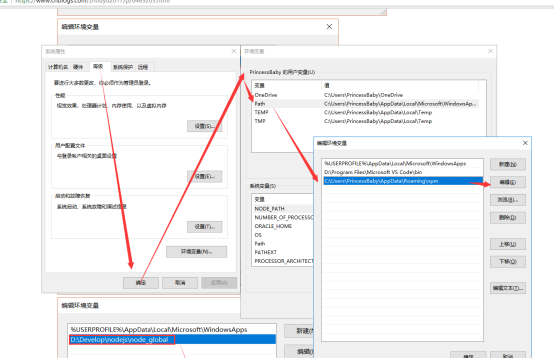

# Vue
## 1.起步

创建一个html，然后通过如下方式引入 Vue：

```javascript
<!-- 开发环境版本，包含了有帮助的命令行警告 -->
<script src="https://cdn.jsdelivr.net/npm/vue/dist/vue.js"></script>
```

或者

```javascript
<!-- 生产环境版本，优化了尺寸和速度 -->
<script src="https://cdn.jsdelivr.net/npm/vue"></script>
```

#### 1.1HelloWorld：

```html
<div id="app">
  <p>{{ msg }}</p><!-- {{}}插值表达式-->
</div>
<script>
	var vm = new Vue({
		el:'#app',
		data:{
			msg:'Hello Vue!'
		}
	})
</script>
```

以上就成功创建了第一个Vue应用！Vue将数据和DOM之间建立了关联，所有东西都是**响应式的**。打开控制台修改msg的值，你将看到上例相应地更新。

除了文本插值，我们还可以像这样来绑定元素特性：

```html
<div id="app-2">
	<span v-bind:title="message">
		鼠标悬停几秒钟查看此处动态绑定的提示信息！
	</span>
</div>
<script type="text/javascript">
	var app2 = new Vue({
		el: '#app-2',
		data: {
			message: '页面加载于 ' + new Date().toLocaleString()
		}
	})
</script>
```

v-bind特性被称为**指令**。指令带有前缀 `v-`以表示它们是 Vue 提供的特殊特性。该指令的意思是：“将这个元素节点的 `title` 特性和 Vue 实例的 `message`属性保持一致”。

**v-text与v-cloak:**

```css
<style>
  [v-cloak]{
      display: none;
  }
</style>
```

```html
<div id="app">
    <p v-cloak>{{ msg }}</p>
</div>
<script>
var vm = new Vue({
    el:'#app',
    data:{
        msg:'Hello World'
    }
})
</script>
```

使用`v-cloak`时当网速较慢时不会将插值表达式`{{ msg }}`显示出来,只有当加载完毕时才会渲染到页面上，且使用v-cloak时可以在插值表达式两侧写其他内容并且会显示到页面上

```html
<div id="app">
    <p v-cloak></p>
</div>
```

结果为：

```
左边-------- Hello World 右边+++++++++++
```

但是如果使用`v-text`则不需要写样式，直接绑定即可解决问题，但是标签中不能写任何内容，否则会被覆盖

```html
<div id="app">
    <p v-text="msg"></p>
    <p v-text="msg">Hello World</p>
</div>
<script>
var vm = new Vue({
  el:'#app',
  data:{
    msg:'<h1>这是一个大大的H1</h1>'
  }
})
</script>
```

如上其中第一个p标签和第二个p标签显示的内容是一样的`Hello World`并不会被显示出来

`v-text`和`插值表达式`共同点是：

其内容都会被当做文本来解析，即使内容是html格式

如果想把内容当作html来解析则使用`v-html`,同样`v-html`标签体中的内容也不会显示

```html
<div id="app">
	<div v-html="msg">哈哈哈哈哈哈</div>
</div>
<script>
var vm = new Vue({
  el:'#app',
  data:{
    msg:'<h1>这是一个大大的H1</h1>'
  }
})
</script>
```

### 1.2条件循环v-if与v-for：

#### 条件：

控制元素是否显示：

```html
<div id="app-3">
	<p v-if="seen">现在你看到我了</p>
</div>

<script type="text/javascript">
	var app3 = new Vue({
		el: '#app-3',
		data: {
			seen: true
		}
	})
</script>
```

当`seen`为`true`时会将p标签显示出来，为`false`时之前显示的消息消失了。

**v-show**与`v-if`功能一样可以控制隐藏与显示，但是不同点是`v-if`每次都会重新删除或者创建元素，而`v-show`则不会每次都进行DOM的删除和创建操作只是添加了`display:none`样式

- `v-if`有较高的切换性能消耗

- `v-show`有较高的初始化渲染消耗

如果元素涉及到频繁的切换，最好不要使用`v-if`,如果元素可能永远也不会被显示出来被用户看到则推荐使用`v-if`

#### 循环：

`v-for` 指令可以绑定**数组**的数据来渲染一个项目列表：

```html
<div id="app-4">
  <ol>
    <li v-for="todo in todos">
      {{ todo.text }}
    </li>
      <!-- 也可以获得序号-->
       <li v-for="(todo,i) in todos">
      	索引值：{{i}}--->元素：{{ todo.text }}
    </li>
  </ol>
</div>
```

```javascript
var app4 = new Vue({
  el: '#app-4',
  data: {
    todos: [
      { text: '学习 JavaScript' },
      { text: '学习 Vue' },
      { text: '整个牛项目' }
    ]
  }
})
```

可以看到：

```
1. 学习 JavaScript
2. 学习 Vue
3. 整个牛项目
```

在控制台里，输入 `app4.todos.push({ text: '新项目' })`，你会发现列表最后添加了一个新项目。

**v-for遍历对象**

```html
<div id="app-4">
    <p v-for="(value,key) in user">
        {{key}}:{{value}}
    </p>
</div>
<script type="text/javascript">
    var app4 = new Vue({
        el: '#app-4',
        data: {
            user:{
                id:'1',
                name:'zhangsan',
                sex:'男',
                age:'18'
            }
        }
    })
</script>
```

运行结果：

```
id:1

name:zhangsan

sex:男

age:18
```

在遍历对象的键值对时除了 value ,key在第三个位置还有一个索引

`v-for="(value,key,index) in user"`

**v-for迭代数字**

```html
<div id="app-4">
    <p v-for="count in 10">
        这是第 {{count}} 次循环
    </p>
</div>
```

count迭代从1开始

**v-for中key的使用**

使用key来强制数据关联

```html
<div id="app-4">
    <label>id:<input type="text" v-model="id"/></label>
    <label>name:<input type="text"v-model="name"/></label>
    <button type="button" @click="add">添加</button>

    <!-- 注意：v-for循环的时候，key属性只能使用number获取string-->
    <!-- 注意：key在使用的时候，必须使用v-bind属性绑定的形式指定key的值 -->
    <p v-for="item in list" :key="item.id">
        <input type="checkbox"/>{{item.id}}-{{item.name}}
    </p>
</div>
		
<script type="text/javascript">
  var app4 = new Vue({
    el: '#app-4',
    data: {
      list:[
        {id:1, name:'赵高'},
        {id:2, name:'嬴政'},
        {id:3, name:'李斯'},
        {id:4, name:'荀子'}
      ]
    },
    methods:{
      add: function(){//添加方法
          this.list.push({id:this.id, name: this.name});
      }
    }
  })
</script>
```


### 1.3数据绑定v-bind

```html
<div id="app-2">
    <span v-bind:title="message">
        鼠标悬停几秒钟查看此处动态绑定的提示信息！
    </span>
</div>
```

```javascript
var app2 = new Vue({
	el: '#app-2',
    data: {
		message: '页面加载于 ' + new Date().toLocaleString()
	}
})
```

`v-bind`是vue中提供的用于绑定属性的指令，`v-bind`可以简写为`:要绑定的属性`，`v-bind`中还可以写合法`js`表达式如：

```javascript
<div id="app-2">
    <span v-bind:title="message + 'hellod world'">
        鼠标悬停几秒钟查看此处动态绑定的提示信息！
    </span>
</div>
```

### 1.4事件绑定v-on

为了让用户和你的应用进行交互，我们可以用 `v-on` 指令添加一个事件监听器，通过它调用在 Vue 实例中定义的方法：

```html
<div id="app-5">
  <p>{{ message }}</p>
  <button v-on:click="reverseMessage">逆转消息</button>
</div>
```

```javascript
var app5 = new Vue({
  el: '#app-5',
  data: {
    message: 'Hello Vue.js!'
  },
  methods: {
    reverseMessage: function () {
      this.message = this.message.split('').reverse().join('')
    }
  }
})
```

注意`reverseMessage`方法中，我们不用直接操作DOM即可更新状态

除了v-on:click,`v-on`事件可以绑定：

`mouseenter`

`mouseleave`

等事件

`v-on`事件缩写：@事件名

事件修饰符：

- .stop阻止冒泡
- .prevent阻止默认事件
- .capture添加事件侦听器使用事件捕获模式
- .self只当事件在该事件本身（比如不是子元素）触发时触发回调
- .once事件只触发一次

### 1.5事件修饰符案例：

```html
<div id="app">
    <div class="innder" @click="divhandler">
        <button type="button" @click="btnhandler">戳他</button>
    </div>
</div>
```

```javascript
//创建vue实例得到ViewModel
var vm = new Vue({
    el:'#app',
    data:{

    },
    methods:{
        divhandler:function(){
            console.log('这是触发了inner div的点击事件')
    	 },
        btnhandler:function(){
            console.log('这是触发了 btn 按钮的点击事件')
        }
    }
})
```

运行结果：(冒泡机制限制性当前的事件再往外冒)

```
这是触发了 btn 按钮的点击事件
事件修饰符.html:29 这是触发了inner div的点击事件
```

如果想要阻止冒泡则在@click上加`.stop`：

```
<div id="app">
    <div class="innder" @click="divhandler">
        <button type="button" @click.stop="btnhandler">戳他</button>
    </div>
</div>
```

执行结果(阻止了事件向外冒泡)：

```
这是触发了 btn 按钮的点击事件
```

#### 阻止默认行为.prevent
如下点击会跳转到百度，如果想阻止a标签的默认跳转事件则：
```html
<template>
  <div id="app">
    <div id="app-2">
      <a href="www.baidu.com" @click="linkClick">点我到百度</a>
    </div>

    <div id="app-2">
      <a href="www.baidu.com" @click="linkClick">点我到百度</a>
    </div>
  </div>
</template>
<script>
//创建vue实例得到ViewModel
var vm = new Vue({
	el:'#app',
	data:{

	},
	methods:{
		linkClick:function(){
			alert("弹出");
		}
	}
})
</script>
```
#### capture

`.capture`机制即捕获机制，与冒泡机制相反，事件从往里执行

#### self

`.self`机制只触发本身的事件，既不事件冒泡也不捕获，只会阻止自己身上冒泡行为的触发而不会影响其他元素的事件

#### once

使用`.once`，事件只触发一次

### 1.6简单案例：跑马灯效果

```javascript
<div id="app">
	<input type="button" value="浪起来" @click="lang"/>
	<input type="button" value="低调"@click="stop"/>
		
	<h4>{{ message }}</h4>
</div>
	
<script type="text/javascript">
	var vm = new Vue({
		el:'#app',
		data:{
			message:'猥琐发育，别浪！',
			intervalId:null//在data上定义定时器id
		},
		methods:{
			lang: function() {
				//注意在vm实例中想要获取data上的数据,或者想要调用methods中的方法
				//必须要使用this来进行访问
				var that = this;//解决内部访问问题
				
				//在开启之前先将之前开启的定时器关闭,避免重复开启
				clearInterval(this.intervalId)
				that.intervalId = setInterval(function(){
					//截取第一个字符串
					var start = that.message.substring(0,1);
					//截取剩下的字符串
					var end = that.message.substring(1);
					//拼接剩下的字符串
					that.message = end + start;
				},400)
				//vue会监听自己身上data中所有数据的改变,只要数据发生变化,就会自动更新DOM
			},
			stop:function() {
				clearInterval(this.intervalId)
			}
		}
	})
	/*
		分析:
		1.给【浪起来按钮】绑定一个点击事件：v-on
		2.在按钮的事件处理函数中，写相关的业务逻辑代码：拿到message字符，然后
		调用字符串的substring来进行字符串截取操作，把第一个字符截取出来，放到最后
		一个位置即可
		3.为了实现点击一下按钮自动截取的功能需要2步骤中的代码，放到一个定时器中
	*/
		
</script>
```

### 1.7v-model指令：

v-bind只能实现数据的单项绑定，从M自动绑定到V，无法实现数据的双向绑定

`v-model`它能轻松实现表单输入和应用状态之间的双向绑定。

```html
<div id="app-6">
  <p>{{ message }}</p>
  <input v-model="message">
</div>
```

```javascript
var app6 = new Vue({
  el: '#app-6',
  data: {
    message: 'Hello Vue!'
  }
})
```

注意v-model只能运用在表单元素中

input(radio,text,address,email...) 

select

checkbox

textarea

### 1.8v-model简易计算器	

```html
<div id="app">
    <input type="text" v-model="n1" />

    <select v-model="opration">
        <option value ="+">+</option>
        <option value ="-">-</option>
        <option value ="*">*</option>
        <option value ="/">/</option>
    </select>

    <input type="text" v-model="n2" />

    <input type="button" value="=" @click="sulotion"/>

    <input type="text" v-model="result" />
</div>
<script type="text/javascript">
    var vm = new Vue({
        el:'#app',
        data:{
            n1:0,
            n2:0,
            result:0,
            opration:'+'
        },
        methods:{
            sulotion:function(){//计算器计算方法
                //逻辑
               sulotion:function(){//计算器计算方法
					var codeStr = 'parseInt(this.n1)'+ this.opration +'parseInt(this.n2)'
					this.result = eval(codeStr);
				}
            }
        }
    })
</script>
```

### 1.9在Vue中使用样式

**1.数组方式**`:class="['thin','red','i']"`

```html
<style type="text/css">
    .red{
        color: red;
    }
    .thin{
        font-weight: 200;
    }
    .i{
        font-style: italic;
    }
    .active{
        letter-spacing: 0.5em;
    }
</style>

<div id="app">
	<h1 :class="['thin','red','i']">这是一个h1，测试vue中使用样式</h1>
</div>
<script type="text/javascript">
	var vm = new Vue({
		el:'#app',
		data:{

		},
		method:{

		}
	})
</script>
```

**2.在数组中使用三元表达式**：`:class="['thin','red',flag?'active':'']"`

```html
<div id="app">
	<h1 :class="['thin','red',flag?'active':'']">这是一个h1，测试vue中使用样式</h1>
</div>
```

其中flag是data中定义的变量

**3.在数组中使用对象代替三元表达式提高可读性**`{'active':flag}`

```html
<h1 :class="['thin','red',{'active':flag}]">这是一个h1，测试vue中使用样式</h1>
```

**4.直接使用对象：**

`:class="{'thin':true,'red':true,'active':true}"`

```html
<h1 :class="{'thin':true,'red':true,'active':true}">这是一个h1，测试vue中使用样式</h1>
```

**5.间接绑定：**

```html
<div id="app">
	<h1 :class="classObj">这是一个h1，测试vue中使用样式</h1>
</div>
```

```javascript
var vm = new Vue({
    el:'#app',
    data:{
        classObj:{'thin':true,'red':true,'active':true}
    }
})
```

**6.使用style**

也可以间接绑定

```html
<div id="app">
	<h1 :style="{color:'red', font-weight:'200' }">这是一个h1，测试vue中使用样式</h1>
</div>
```

## 2. Vue在chrome浏览器的调试工具Vue-Devtools

**作用**

vue-devtools是一款基于chrome游览器的插件，用于调试vue应用，这可以极大地提高我们的调试效率。接下来我们就介绍一下vue-devtools的安装。

**安装地址：**

```
https://github.com/vuejs/vue-devtools
```

或者

```
https://chrome.google.com/webstore/detail/vuejs-devtools/nhdogjmejiglipccpnnnanhbledajbpd
```

### 2.1 vue过滤器

#### 2.1.1 系统过滤器

- 关于系统过滤器的使用请参考文档：`https://v1.vuejs.org/api/#Filters`

- 注意：系统过滤器是Vue1.0中存在的，在vue2.0中已经删除了

#### 2.1.2 自定义过滤器

##### 2.1.2.1 私有过滤器

```css
table {
    border-collapse: collapse;
    color: black;
}
th{
    color: white;
    background-color: #42B983;
}
table,
tr,
td,
th {
    border: 1px solid #FF0000;
}
```

```html
<div id="app">
    <table>
        <thead>
            <tr>
                <th>ID</th>
                <th>username</th>
                <th>password</th>
                <th>date</th>
            </tr>
        </thead>
        <tr v-for="user in list">
            <td>{{ user.id }}</td>
            <td>{{ user.username }}</td>
            <td>{{ user.password }}</td>
            <td>{{ user.date | dateFormate}}</td>
        </tr>
    </table>
</div>
```

```javascript
var vm = new Vue({
    el: '#app',
    data: {
        list: [{
            id: 1,
            username: 'guqing',
            password: '12345',
            date: new Date()
        }]
    },
    //在某一个vue对象内部定义的过滤器称为私有过滤器
    //这种过滤器旨在当前vue对象el指定的监管的区域内游泳
    filters: {
        //input是自定义过滤器的默认参数,input的值永远都是取决于 | 左边的内容
        dateFormate: function(input) {
            console.log(input)
            //过滤器的逻辑,将input的值格式化成yyyy-MM-dd字符输出
            var year = input.getFullYear();
            var month = input.getMonth() + 1;
            var day = input.getDay();
            input = year + '-' + month + '-' + day
            return input;
        }
    }
})
```

以上为创建一个私有日期格式化过滤器，使用方式与系统过滤器一样

##### 2.1.2.2 全局过滤器

html代码同私有过滤器

js如下：

```javascript
//定义一个名称为dateFormate的全局过滤器,两个参数,一个参数为过滤器名称,第二个参数为逻辑代码
Vue.filter('dateFormate',function(input) {
    //将input的值格式化成yyyy-MM-dd字符输出
    var year = input.getFullYear();
    var month = input.getMonth() + 1;
    var day = input.getDay();
    input = year + '-' + month + '-' + day
    return input;
})

var vm = new Vue({
    el: '#app',
    data: {
        list: [{
            id: 1,
            username: 'guqing',
            password: '12345',
            date: new Date()
        }]
    }
})
```

全局过滤器在全局共有，在不能的Vue对象中都可以使用

## 3. v-on按键修饰符

### 3.1 作用说明

```markdown
文档地址：https://cn.vuejs.org/v2/guide/events.html

在监听键盘事件时，我们经常需要监听常见的键值，vue允许v-on在监听键盘事件时添加按键修饰符：
- enter
- table
- delete (捕获‘删除’和‘退格’键)
- esc
- space
- up
- down
- left
- right
1.0.8+支持单字母按键别名
```

### 3.2 案例：

```css
#app-4{
    width: 600px;
    margin: 0 auto;
}
table {
    width:100%;
    border-collapse: collapse;
    color: black;
    margin-top: 15px;
}

th {
    color: white;
    background-color: dodgerblue;
}

table,
tr,
td,
th {
    text-align: center;
    border: 1px solid #FF0000;
}
```

```html
<div id="app-4">
    <label>id:<input type="text" v-model="id" /></label>
    <!-- #### 重点看这里：-->
    <!-- 注册keydown事件，不加修饰符时只要按键改变就会触发，所以要加按键修饰符 -->
    <label>姓名:<input type="text" v-model="name" @keydown.enter="add"/></label>
    <button type="button" @click="add">添加</button>

    <table>
        <thead>
            <tr>
                <th>选择</th>
                <th>ID</th>
                <th>姓名</th>
                <th>操作</th>
            </tr>
        </thead>
        <tr v-show="list.length ==0">
            <td colspan="4">当前列表没有任何数据</td>
        </tr>
        <tr v-for="user in list" :key="user.id">
            <td><input type="checkbox" /></td>
            <td>{{ user.id }}</td>
            <td>{{ user.name }}</td>
            <td><a href="#" @click="deleteEle">删除</a></td>
        </tr>
    </table>
</div>
```

```javascript
var app4 = new Vue({
    el: '#app-4',
    data: {
        list: [{
            id: 1,
            name: '赵高'
        },
               {
                   id: 2,
                   name: '嬴政'
               },
               {
                   id: 3,
                   name: '李斯'
               },
               {
                   id: 4,
                   name: '荀子'
               }
              ],
        id: 0,
        name: null
    },
    methods: {
        add: function() { //添加方法
            this.list.push({
                id: this.id,
                name: this.name
            });
        },
        deleteEle: function(id) {
            var index = this.list.findIndex(function(item) {
                //根据item中的id属性来判断这个item是否是上面id中
                //对应的数据，如果是返回一个true ,否返回false,继续下面的一条数据的遍历，以此类推
                return item.id == id; //如果返回true，那么findIndex方法会将这个item对应的id返回到外面接受
            });
            //删除
            this.list.splice(index, 1);
        }
    }
})
```

### 3.3 可以自定义按键别名

```javascript
Vue.config.keyCodes.f2 = 113;//f2自定义按键名称,113对应的键盘码
console.log(Vue.config.keyCodes)
```

### 3.4 自定义指令

在vue2.0中，代码复用和抽象的主要形式是组件。然而，有的情况下，你仍然需要对普通DOM元素进行底层操作，这时候就会用到自定义指令。

自定义指令最重要的两个部分就是钩子函数和钩子函数对应的参数。

#### 3.4.1 钩子函数

一个指令定义对象可以提供如下几个钩子函数 (均为可选)：

**bind：**只调用一次，指令第一次绑定到元素时调用，在这里可以进行一次性的初始化设置。

**inserted：**被绑定元素插入父节点时调用（仅保证父节点存在，但不一定已被插入文档中）。

**update：**所在组件的 VNode 更新时调用，但是可能发生在其子 VNode 更新之前。指令的值可能发生了改变，也可能没有。但是你可以通过比较更新前后的值来忽略不必要的模板更新 (详细的钩子函数参数见下)。

**componentUpdated：**指令所在组件的 VNode 及其子 VNode 全部更新后调用。

**unbind：**只调用一次，指令与元素解绑时调用。

#### 3.4.2钩子函数参数

指令钩子函数会被传入以下参数：

- `el`：指令所绑定的元素，可以用来直接操作 DOM 。
- binding：一个对象，包含以下属性：
  - `name`：指令名，不包括 `v-` 前缀。
  - `value`：指令的绑定值，例如：`v-my-directive="1 + 1"` 中，绑定值为 `2`。
  - `oldValue`：指令绑定的前一个值，仅在 `update` 和 `componentUpdated` 钩子中可用。无论值是否改变都可用。
  - `expression`：字符串形式的指令表达式。例如 `v-my-directive="1 + 1"`中，表达式为 `"1 + 1"`。
  - `arg`：传给指令的参数，可选。例如 `v-my-directive:foo` 中，参数为 `"foo"`。
  - `modifiers`：一个包含修饰符的对象。例如：`v-my-directive.foo.bar` 中，修饰符对象为 `{ foo: true, bar: true }`。
- `vnode`：Vue 编译生成的虚拟节点。移步 [VNode API](https://cn.vuejs.org/v2/api/#VNode-%E6%8E%A5%E5%8F%A3) 来了解更多详情。
- `oldVnode`：上一个虚拟节点，仅在 `update` 和 `componentUpdated` 钩子中可用。

除了 `el` 之外，其它参数都应该是只读的，切勿进行修改。如果需要在钩子之间共享数据，建议通过元素的 [`dataset`](https://developer.mozilla.org/zh-CN/docs/Web/API/HTMLElement/dataset) 来进行。

#### 3.4.3 自定义全局属性指令用法

```javascript
//vue1.0中提供了一个Vue.directive(自定义指令名称，回调函数)来供程序员自定义指令
//注意:在定义指令时不需要加v-前缀但是使用时必须加v-前缀
// 注册一个全局自定义指令 `v-focus`
Vue.directive('focus', {
    // 当被绑定的元素插入到 DOM 中时……
    inserted: function(el) {
        // 聚焦元素
        el.focus()
    }
})

//定义一个v-color指令
Vue.directive('color', {
    // 当被绑定的元素被绑定时
    bind: function(el,binding) {
        el.style.color = binding.value;
    }
})
```

**使用自定义指令**

```html
<input type="text" v-focus v-color="customColor" placeholder="请输入筛选条件" v-model="searchtext" />
```

#### 3.4.4 自定义私有指令

```javascript
var app4 = new Vue({
    el: '#app-4',
    data: {},
	directives: {
        focus: {
            // 指令的定义
            inserted: function(el) {
                el.focus()
         }
     }
}
```

使用自定义元素

```html
<input type="text" v-focus placeholder="请输入筛选条件" v-model="searchtext" />
```

#### 3.4.5 函数简写

在很多时候，你可能想在 `bind` 和 `update` 时触发相同行为，而不关心其它的钩子。比如这样写:

```javascript
Vue.directive('color-swatch', function (el, binding) {
  el.style.backgroundColor = binding.value
})
```

使用同上

#### 3.4.6 对象字面量

如果指令需要多个值，可以传入一个 JavaScript 对象字面量。记住，指令函数能够接受所有合法的 JavaScript 表达式。

```html
<div v-demo="{ color: 'white', text: 'hello!' }"></div>
```

```javascript
Vue.directive('demo', function (el, binding) {
  console.log(binding.value.color) // => "white"
  console.log(binding.value.text)  // => "hello!"
})
```

## 4. Vue的Ajax请求

### 4.1 Vue-resource插件介绍

**下载地址：**

```
https://github.com/pagekit/vue-resource/blob/develop/docs/http.md
```

$.ajax能做的事情，vue-resource插件一样也能做到，而且vue-resource的API更为简洁。另外，vue-resource还提供了非常有用的inteceptor功能，使用inteceptor可以在请求前和请求后附加一些行为，比如使用inteceptor在ajax请求时显示loading界面。

**vue-resource的特点：**

**1. 体积小**

vue-resource非常小巧，在压缩以后只有大约12KB，服务端启用gzip压缩后只有4.5KB大小，这远比jQuery的体积要小得多。

**2. 支持主流的浏览器**

和Vue.js一样，vue-resource除了不支持IE 9以下的浏览器，其他主流的浏览器都支持。

**3. 支持Promise API和URI Templates**

Promise是ES6的特性，Promise的中文含义为“先知”，Promise对象用于异步计算。
URI Templates表示URI模板，有些类似于ASP.NET MVC的路由模板。

**4. 支持拦截器**

拦截器是全局的，拦截器可以在请求发送前和发送请求后做一些处理。
拦截器在一些场景下会非常有用，比如请求发送前在headers中设置access_token，或者在请求失败时，提供共通的处理方式。

#### 4.1.1 Methods

- `get(url, [config])`
- `head(url, [config])`
- `delete(url, [config])`
- `jsonp(url, [config])`
- `post(url, [body], [config])`
- `put(url, [body], [config])`
- `patch(url, [body], [config])`

#### 4.1.2 Config

| Parameter        | Type                           | Description                                                  |
| ---------------- | ------------------------------ | ------------------------------------------------------------ |
| url              | `string`                       | URL to which the request is sent                             |
| body             | `Object`, `FormData`, `string` | Data to be sent as the request body                          |
| headers          | `Object`                       | Headers object to be sent as HTTP request headers            |
| params           | `Object`                       | Parameters object to be sent as URL parameters               |
| method           | `string`                       | HTTP method (e.g. GET, POST, ...)                            |
| responseType     | `string`                       | Type of the response body (e.g. text, blob, json, ...)       |
| timeout          | `number`                       | Request timeout in milliseconds (`0` means no timeout)       |
| credentials      | `boolean`                      | Indicates whether or not cross-site Access-Control requests should be made using credentials |
| emulateHTTP      | `boolean`                      | Send PUT, PATCH and DELETE requests with a HTTP POST and set the `X-HTTP-Method-Override` header |
| emulateJSON      | `boolean`                      | Send request body as `application/x-www-form-urlencoded` content type |
| before           | `function(request)`            | Callback function to modify the request object before it is sent |
| uploadProgress   | `function(event)`              | Callback function to handle the [ProgressEvent](https://developer.mozilla.org/en-US/docs/Web/API/ProgressEvent) of uploads |
| downloadProgress | `function(event)`              | Callback function to handle the [ProgressEvent](https://developer.mozilla.org/en-US/docs/Web/API/ProgressEvent) of downloads |

#### 4.1.3 Response

A request resolves to a response object with the following properties and methods:

| Property   | Type                       | Description                             |
| ---------- | -------------------------- | --------------------------------------- |
| url        | `string`                   | Response URL origin                     |
| body       | `Object`, `Blob`, `string` | Response body                           |
| headers    | `Header`                   | Response Headers object                 |
| ok         | `boolean`                  | HTTP status code between 200 and 299    |
| status     | `number`                   | HTTP status code of the response        |
| statusText | `string`                   | HTTP status text of the response        |
| **Method** | **Type**                   | **Description**                         |
| text()     | `Promise`                  | Resolves the body as string             |
| json()     | `Promise`                  | Resolves the body as parsed JSON object |
| blob()     | `Promise`                  | Resolves the body as Blob object        |

#### 4.1.4 实例

**get请求**

```html
<!-- 导入vue.js和vue-resource.js,且按顺序导入 -->
<script src="../js/vue2.5.22.js" type="text/javascript" charset="utf-8"></script>
<script src="../js/vue-resource1.5.1.js" type="text/javascript" charset="utf-8"></script>
```

```html
<div id="app">
    {{ userList }}
    <button type="button" @click="getdata">get请求</button>
</div>
```

```javascript
new Vue({
    el:'#app',
    data:{
        userList:null
    },
    methods:{
        getdata:function(){
            //请求的url
            var url = 'https://www.layui.com/demo/table/user/';
            //利用vue-resource发出Ajax请求
            this.$http.get(url)//发出请求
                .then(function(response){//获取服务器返回的数据
                this.userList = response.body;//获取当前url响应回来的数据
            });
        }
    }
})
```

**post请求**

```javascript
new Vue({
    el:'#app',
    methods:{
        postdata:function(){
            //请求的url
            var url = 'https://www.layui.com/demo/table/user/';
            //利用vue-resource发出Ajax请求
            //post有三个参数:post(url,传入服务器的请求报文体数据,{emulateJson:true})
            this.$http.post(url,{name:'张三'},{emulateJson:true})//发出post请求
                .then(function(response){//获取服务器返回的数据
                console.log(response.body);//获取当前url响应回来的数据
            });
        }
    }
})
```

**jsonp请求**

```javascript
new Vue({
    el:'#app',
    methods:{
        jsonpdata:function(){
            //请求的url
            var url = 'https://www.layui.com/demo/table/user/';
            //利用vue-resource发出Ajax请求
            //url后不需要跟callback参数
            this.$http.jsonp(url)
                .then(function(response){//获取服务器返回的数据
                console.log(response.body);//获取当前url响应回来的数据
            });
        }
    }
})
```

## 5. Vue生命周期

所有的生命周期钩子自动绑定 `this` 上下文到实例中，因此你可以访问数据，对属性和方法进行运算。这意味着**你不能使用箭头函数来定义一个生命周期方法** (例如 `created: () => this.fetchTodos()`)。这是因为箭头函数绑定了父上下文，因此 `this` 与你期待的 Vue 实例不同，`this.fetchTodos` 的行为未定义。

### 5.1 生命周期图示


### 5.2 生命周期方法

#### beforeCreate

- **类型**：`Function`

- **详细**：

  在实例初始化之后，数据观测 (data observer) 和 event/watcher 事件配置之前被调用。

#### created

- **类型**：`Function`

- **详细**：

  在实例创建完成后被立即调用。在这一步，实例已完成以下的配置：数据观测 (data observer)，属性和方法的运算，watch/event 事件回调。然而，挂载阶段还没开始，`$el` 属性目前不可见。

#### beforeMount

- **类型**：`Function`

- **详细**：

  在挂载开始之前被调用：相关的 `render` 函数首次被调用。

  **该钩子在服务器端渲染期间不被调用。**

#### mounted

- **类型**：`Function`

- **详细**：

  `el` 被新创建的 `vm.$el` 替换，并挂载到实例上去之后调用该钩子。如果 root 实例挂载了一个文档内元素，当 `mounted` 被调用时 `vm.$el` 也在文档内。

  注意 `mounted` **不会**承诺所有的子组件也都一起被挂载。如果你希望等到整个视图都渲染完毕，可以用 [vm.$nextTick](https://cn.vuejs.org/v2/api/#vm-nextTick) 替换掉 `mounted`：

```javascript
mounted: function () {
  this.$nextTick(function () {
    // Code that will run only after the
    // entire view has been rendered
  })
}
```

**该钩子在服务器端渲染期间不被调用。**

#### beforeUpdate

- **类型**：`Function`

- **详细**：

  数据更新时调用，发生在虚拟 DOM 打补丁之前。这里适合在更新之前访问现有的 DOM，比如手动移除已添加的事件监听器。

  **该钩子在服务器端渲染期间不被调用，因为只有初次渲染会在服务端进行。**

#### updated

- **类型**：`Function`

- **详细**：

  由于数据更改导致的虚拟 DOM 重新渲染和打补丁，在这之后会调用该钩子。

  当这个钩子被调用时，组件 DOM 已经更新，所以你现在可以执行依赖于 DOM 的操作。然而在大多数情况下，你应该避免在此期间更改状态。如果要相应状态改变，通常最好使用[计算属性](https://cn.vuejs.org/v2/api/#computed)或 [watcher](https://cn.vuejs.org/v2/api/#watch) 取而代之。

  注意 `updated` **不会**承诺所有的子组件也都一起被重绘。如果你希望等到整个视图都重绘完毕，可以用 [vm.$nextTick](https://cn.vuejs.org/v2/api/#vm-nextTick) 替换掉 `updated`：

```javascript
updated: function () {
  this.$nextTick(function () {
    // Code that will run only after the
    // entire view has been re-rendered
  })
}
```

#### activated

- **类型**：`Function`

- **详细**：

  keep-alive 组件激活时调用。

  **该钩子在服务器端渲染期间不被调用。**

- **参考**：

  - [构建组件 - keep-alive](https://cn.vuejs.org/v2/api/#keep-alive)
  - [动态组件 - keep-alive](https://cn.vuejs.org/v2/guide/components.html#keep-alive)

#### beforeDestroy

- **类型**：`Function`

- **详细**：

  实例销毁之前调用。在这一步，实例仍然完全可用。

  **该钩子在服务器端渲染期间不被调用。**

#### destroyed

- **类型**：`Function`

- **详细**：

  Vue 实例销毁后调用。调用后，Vue 实例指示的所有东西都会解绑定，所有的事件监听器会被移除，所有的子实例也会被销毁。

  **该钩子在服务器端渲染期间不被调用。**

#### errorCaptured

> 2.5.0+ 新增

- **类型**：`(err: Error, vm: Component, info: string) => ?boolean`

- **详细**：

  当捕获一个来自子孙组件的错误时被调用。此钩子会收到三个参数：错误对象、发生错误的组件实例以及一个包含错误来源信息的字符串。此钩子可以返回 `false`以阻止该错误继续向上传播。

  ```
  你可以在此钩子中修改组件的状态。因此在模板或渲染函数中设置其它内容的短路条件非常重要，它可以防止当一个错误被捕获时该组件进入一个无限的渲染循环。
  ```

**错误传播规则**

- 默认情况下，如果全局的 `config.errorHandler` 被定义，所有的错误仍会发送它，因此这些错误仍然会向单一的分析服务的地方进行汇报。
- 如果一个组件的继承或父级从属链路中存在多个 `errorCaptured` 钩子，则它们将会被相同的错误逐个唤起。
- 如果此 `errorCaptured` 钩子自身抛出了一个错误，则这个新错误和原本被捕获的错误都会发送给全局的 `config.errorHandler`。
- 一个 `errorCaptured` 钩子能够返回 `false` 以阻止错误继续向上传播。本质上是说“这个错误已经被搞定了且应该被忽略”。它会阻止其它任何会被这个错误唤起的 `errorCaptured` 钩子和全局的 `config.errorHandler`。

### 5.3 如何使用声明周期方法

```javascript
new Vue({
    el:'#app',
    data:{
        userList:null
    },
    //Vue对象实例创建成功以后就会自定调用这个方法
    created:function(){
        this.getdata();
    },
    methods:{
        getdata:function(){
            //请求的url
            var url = 'https://www.layui.com/demo/table/user/';
            //利用vue-resource发出Ajax请求
            this.$http.get(url)//发出请求
                .then(function(response){//获取服务器返回的数据
                this.userList = response.body;//获取当前url响应回来的数据
            });
        }
    }
})

```

**注意：data中定义的变量只有在created及以后方法才能获取到。**

## 6 进入/离开 & 列表过渡

### 6.1 概述

Vue 在插入、更新或者移除 DOM 时，提供多种不同方式的应用过渡效果。
包括以下工具：

- 在 CSS 过渡和动画中自动应用 class
- 可以配合使用第三方 CSS 动画库，如 Animate.css
- 在过渡钩子函数中使用 JavaScript 直接操作 DOM
- 可以配合使用第三方 JavaScript 动画库，如 Velocity.js

### 6.2 transition过渡

Vue 提供了 `transition` 的封装组件，在下列情形中，可以给任何元素和组件添加进入/离开过渡

- 条件渲染 (使用 `v-if`)
- 条件展示 (使用 `v-show`)
- 动态组件
- 组件根节点

```css
.fade-enter-active,
.fade-leave-active {
    transition: opacity .5s;
}

.fade-enter,
.fade-leave-to
/* .fade-leave-active below version 2.1.8 */
{
    opacity: 0;
}
```

```html
<div id="demo">
    <button v-on:click="show = !show">
        Toggle
    </button>
    <transition name="fade">
        <p v-if="show">hello</p>
    </transition>
</div>
```

```javascript
new Vue({
    el: '#demo',
    data: {
        show: true
    }
})
```

当插入或删除包含在 `transition` 组件中的元素时，Vue 将会做以下处理：

1. 自动嗅探目标元素是否应用了 CSS 过渡或动画，如果是，在恰当的时机添加/删除 CSS 类名。
2. 如果过渡组件提供了 [JavaScript 钩子函数](https://cn.vuejs.org/v2/guide/transitions.html#JavaScript-%E9%92%A9%E5%AD%90)，这些钩子函数将在恰当的时机被调用。
3. 如果没有找到 JavaScript 钩子并且也没有检测到 CSS 过渡/动画，DOM 操作 (插入/删除) 在下一帧中立即执行。(注意：此指浏览器逐帧动画机制，和 Vue 的 `nextTick` 概念不同)

#### 过渡的类名

**对需要进行动画控制的元素使用transition标签包裹有一个name属性值自定义如name="fade"，但是使用css控制时的前缀必须与name值一致如fade-enter 。**

在进入/离开的过渡中，会有 6 个 class 切换,以下v表示name值。

1. `v-enter`：定义进入过渡的开始状态。在元素被插入之前生效，在元素被插入之后的下一帧移除。
2. `v-enter-active`：定义进入过渡生效时的状态。在整个进入过渡的阶段中应用，在元素被插入之前生效，在过渡/动画完成之后移除。这个类可以被用来定义进入过渡的过程时间，延迟和曲线函数。
3. `v-enter-to`: **2.1.8版及以上** 定义进入过渡的结束状态。在元素被插入之后下一帧生效 (与此同时 `v-enter` 被移除)，在过渡/动画完成之后移除。
4. `v-leave`: 定义离开过渡的开始状态。在离开过渡被触发时立刻生效，下一帧被移除。
5. `v-leave-active`：定义离开过渡生效时的状态。在整个离开过渡的阶段中应用，在离开过渡被触发时立刻生效，在过渡/动画完成之后移除。这个类可以被用来定义离开过渡的过程时间，延迟和曲线函数。
6. `v-leave-to`: **2.1.8版及以上** 定义离开过渡的结束状态。在离开过渡被触发之后下一帧生效 (与此同时 `v-leave` 被删除)，在过渡/动画完成之后移除。


对于这些在过渡中切换的类名来说，如果你使用一个没有名字的 `<transition>`，则 `v-` 是这些类名的默认前缀。如果你使用了 `<transition name="my-transition">`，那么 `v-enter` 会替换为 `my-transition-enter`。

`v-enter-active` 和 `v-leave-active` 可以控制进入/离开过渡的不同的缓和曲线。

### 6.3 使用animate.css实现动画过渡

**下载地址：**

```
https://daneden.github.io/animate.css/
```

```html
<div id="app">
    <button type="button" @click="show = !show">隐藏/显示</button>

    <transition enter-active-class='fadeInRight' leave-active-class='fadeOutRight'>
        <p v-if="show" class="animated">Hello Animate css</p>
    </transition>
</div>
```

```javascript
new Vue({
    el:'#app',
    data:{
        show:true
    }
})
```

**enter-active-class和leave-active-class是animate.css中定义好的动画类**

### 6.4 利用钩子函数进行一半动画的控制

```css
.show{
    transition: all 0.4s ease;
}
```

```html
<div id="app">
    <button type="button" @click="show = !show">隐藏/显示</button>

    <transition @before-enter="beforeEnter" @enter="enter" @after-enter="afterEnter">
        <p v-if="show" class="show">Hello Animate css</p>
    </transition>
</div>
```

```javascript
new Vue({
    el:'#app',
    data:{
        show:true
    },
    methods:{
        //这里主要通过js定义当前实现动画的初始位置，el表示当前操作的元素
        beforeEnter:function(el){
            el.style.transform = "translate(100px,0)";
        },
        //通过js定义动画的结束位置
        enter:function(el,done){
            //设置刷新状态
            el.offsetWidth;
			
            //设置动画的结束位置
            el.style.transform = "translate(0px,0)";

            //手动调用done,保证动画即时结束
            done();
        },
        //动画的状态复原设置
        afterEnter:function(el){
            this.show = !this.show;
        }
    }
})
```

## 7 组件注册

**组件名**

在注册一个组件的时候，我们始终需要给它一个名字。比如在全局注册的时候我们已经看到了：

```javascript
Vue.component('my-component-name', { /* ... */ })
```

该组件名就是 `Vue.component` 的第一个参数

你给予组件的名字可能依赖于你打算拿它来做什么。当直接在 DOM 中使用一个组件 (而不是在字符串模板或[单文件组件](https://cn.vuejs.org/v2/guide/single-file-components.html)) 的时候，我们强烈推荐遵循 [W3C 规范](https://html.spec.whatwg.org/multipage/custom-elements.html#valid-custom-element-name)中的自定义组件名 (字母全小写且必须包含一个连字符)。这会帮助你避免和当前以及未来的 HTML 元素相冲突

**组件名大小写**

定义组件名的方式有两种：

**使用 kebab-case**

```javascript
Vue.component('my-component-name', { /* ... */ })
```

当使用 kebab-case (短横线分隔命名) 定义一个组件时，你也必须在引用这个自定义元素时使用 kebab-case，例如 `<my-component-name>`。

**使用 PascalCase**

```javascript
Vue.component('MyComponentName', { /* ... */ })
```

当使用 PascalCase (首字母大写命名) 定义一个组件时，你在引用这个自定义元素时两种命名法都可以使用。也就是说 `<my-component-name>` 和 `<MyComponentName>` 都是可接受的。注意，尽管如此，直接在 DOM (即非字符串的模板) 中使用时只有 kebab-case 是有效的。

### 7.1 注册全局组件

到目前为止，我们只用过 `Vue.component` 来创建组件：

```javascript
Vue.component('my-component-name', {
  // ... 选项 ...
})
```

这些组件是**全局注册的**。也就是说它们在注册之后可以用在任何新创建的 Vue 根实例 (`new Vue`) 的模板中。比如：

```javascript
Vue.component('component-a', { /* ... */ })
Vue.component('component-b', { /* ... */ })
Vue.component('component-c', { /* ... */ })

new Vue({ el: '#app' })
```

**使用组件**

```html
<div id="app">
  <component-a></component-a>
  <component-b></component-b>
  <component-c></component-c>
</div>
```

在所有子组件中也是如此，也就是说这三个组件*在各自内部*也都可以相互使用。

### 7.2 定义和组件的三种方式

**第一种方式：**

```javascript
//方法1：定义组件
var login = Vue.extend({
    template:'<h1>登陆页面</h1>'
})
//注册组件
Vue.component('login',login);
```

```javascript
<div id="app">
	<login></login>
</div>
```

**第二种方式：**

```javascript
//方法2：定义一个全局组件
Vue.component('register',{
    template:'<h1>注册页面</h1>'
})
```

使用

```javascript
<div id="app">
    <register></register>
</div>
```

**第三种方式：**

```javascript
//方法3：定义一个账号组件,建议使用方法三
Vue.component('account',{
    template:'#account',
    data:function(){
        //与vue对象不同的是组件中的data是一个function,
        //所以要这么写
        return {
            message:'账户组件'
        }
    },
    methods:{
        login:function(){
            alert("Hello VueJs")
        }
    }
})
```

模板的事件写在对应的模板中

全局组件引用了一个在html中定义的组件模板account

```html
<!--组件模板的定义 template和script定义都可以但是建议使用template-->
<template id="account">
    <div>
        {{message}}
        <a href="#" @click.prevent="login">登陆</a> |
        <a href="#">注册</a>
    </div>
</template>
```

也可以使用`script`定义但是建议使用`template`标签

```javascript
 <script type="x-template" id="account">
     <div>
    	<a href="#">登陆</a> |
		<a href="#">注册</a>
	</div>
</script>
```

值得注意的是，所有子元素必须使用一个共同的根标签包围，如div

### 7.3 局部注册

全局注册往往是不够理想的。比如，如果你使用一个像 webpack 这样的构建系统，全局注册所有的组件意味着即便你已经不再使用一个组件了，它仍然会被包含在你最终的构建结果中。这造成了用户下载的 JavaScript 的无谓的增加。

在这些情况下，你可以通过一个普通的 JavaScript 对象来定义组件：

```javascript
var ComponentA = { /* ... */ }
var ComponentB = { /* ... */ }
var ComponentC = { /* ... */ }
```

然后在 `components` 选项中定义你想要使用的组件：

```javascript
new Vue({
  el: '#app',
  components: {
    'component-a': ComponentA,
    'component-b': ComponentB
  }
})
```

或者是在组件中定义子组件

```javascript
//定义一个账号组件
Vue.component('account',{
    template:'<div><h1>账号组件</h1><login></login></div>',
    //在账号组件中定义一个登陆子组件
    components:{
        'login':{
            template:'<h2>登陆子组件</h2>'
        }
    }
})
```

在组件中定义的子组件必须在父组件中使用如上面的

```html
<div><h1>账号组件</h1><login></login></div>
```

对于 `components` 对象中的每个属性来说，其属性名就是自定义元素的名字，其属性值就是这个组件的选项对象。

### 7.4 组件的动态切换

首先注册两个组件，login和regist

```javascript
Vue.component('login',{
    template:'<h1>登陆页面</h1>'
})
```

```javascript
Vue.component('regist',{
    template:'<h1>注册页面</h1>'
})		
```

```html
<div id="app">
    <a href="#" @click.prevent="cname = 'login'">登陆</a> |
    <a href="#" @click.prevent="cname = 'regist'">注册</a>
    <!-- 利用component标签中的：is参数来进行组件的切换 -->
    <component :is="cname"></component>
</div>
```

组件的切换使用`component`标签的`is`属性

```javascript
new Vue({
    el:'#app',
    data:{
        cname:'login'
    }
})
```

只要控制is的值即可控制组件的显示，如上通过点击事件改变`cname`的值来切换组件

### 7.5 父组件与子组件传值

**父组件向子组件传值**

- 定义组件

```html
<template id="subEle">
    <div>
        {{name}}
    </div>
</template>
```

```javascript
new Vue({
    el:'#app',
    data:{
        name:'张三'
    },
    components:{
        'subelement':{
            template:'#subEle',
            props:['name']//负责接收父组件传入的值
        }
    }
})
```

在组件中有一个props属性在其中定义变量负责接收父组件传递过来的值

然后在组件模板中使用插值表达式接收`{{name}}`

- 父组件如何向子组件传递值?

通过将子组件中负责接收父组件传入值得变量`name`绑定到组件上传入值即可

```html
<div id="app">
	<subelement :name="name"></subelement>
</div>
```

**子组件向父组件传值**

```javascript
new Vue({
    el:'#app',
    data:{
        name:'张三'
    },
    methods:{
        getdata:function(data){
            alert(data)
        }
    },
    components:{
        'subelement':{
            template:'#subEle',
            //props:['name']//负责接收父组件传入的值
            methods:{
                sendData:function(){
                    //将hello传值给父组件
                    this.$emit('send','Hello VueJs')
                }
            }
        }
    }
})
```

如上所示：在子组件中写一个方法`sendData`用于向父组件发送值，内部使用`this.$emit`方法向父组件发送一个事件用于传递值，key是事件名称，值就是呀发送的数据。

当点击子组件中定义的按钮时触发`sendData`事件向父组件传值

```javascript
<template id="subEle">
    <button type="button" @click="sendData">点击传值</button>
</template>
```

而这个父组件我们可以将Vue对象的实例视为一个根组件，将数据传递给Vue实例。

**使用组件并传递值**

```html
<div id="app">
    <subelement v-on:send="getdata"></subelement>
</div>
```

当点击子组件的按钮时调用子组件中定义的方法`sendData`触发一个方法向父组件发送一个`send`事件,而send事件绑定了一个`getdata`方法用于获取子组件传递过来的值

```javascript
methods:{
    getdata:function(data){
        alert(data)
    }
}
```

## 8 获取dom对象和组件的对象

`ref` 被用来给元素或子组件注册引用信息。引用信息将会注册在父组件的 `$refs`对象上。如果在普通的 DOM 元素上使用，引用指向的就是 DOM 元素；如果用在子组件上，引用就指向组件实例：

```html
<!-- `vm.$refs.p` will be the DOM node -->
<p ref="p">hello</p>

<!-- `vm.$refs.child` will be the child component instance -->
<child-component ref="child"></child-component>
```

关于 ref 注册时间的重要说明：因为 ref 本身是作为渲染结果被创建的，在初始渲染的时候你不能访问它们 - 它们还不存在！`$refs` 也不是响应式的，因此你不应该试图用它在模板中做数据绑定。

使用ref属性用于对象或组建获取

```html
<div id="app">
    <button type="button" @click="getdom">获取dom对象</button>
    <div id="div1" ref="myDiv">Hello VueJs</div>

    <button type="button" @click="getComponents">获取组件对象</button>
    <login ref="mycomponents"></login>
</div>
```

```javascript
new Vue({
    el:'#app',
    methods:{
        getdom:function(){
            //获取到id="div1"的div对象
            //有两种方式可以完成
            //1.通过传统的document方式
            console.log(document.getElementById("div1").innerHTML)

            //2.vuejs的写法,在元素上添加v-el
            console.log(this.$refs.myDiv)
        },
        getComponents:function(){
            //获取组件对象
            console.log(this.$refs.mycomponents)
            //获取组件中的值
            console.log(this.$refs.mycomponents.subname)
        }
    },
    //定义私有组件(子组件)
    components:{
        'login':{
            data:function(){
                return {subname:'这是一个组件名称'}
            },
            template:'<h1>这是一个子组件</h1>'
        }
    }
})
```

## 9 vue-router路由

Vue Router 是 [Vue.js](http://cn.vuejs.org/) 官方的路由管理器。它和 Vue.js 的核心深度集成，让构建单页面应用变得易如反掌。包含的功能有：

- 嵌套的路由/视图表
- 模块化的、基于组件的路由配置
- 路由参数、查询、通配符
- 基于 Vue.js 过渡系统的视图过渡效果
- 细粒度的导航控制
- 带有自动激活的 CSS class 的链接
- HTML5 历史模式或 hash 模式，在 IE9 中自动降级
- 自定义的滚动条行为

### 9.1 路由写法和传参

引入vuejs和vue-router

```html
<script src="https://unpkg.com/vue/dist/vue.js"></script>
<script src="https://unpkg.com/vue-router/dist/vue-router.js"></script>
```

```javascript
//准备组件
var Ap = Vue.extend({});

var login = Vue.extend({
    template:'<div><h1>登陆</h1></div>'
})

var regist = Vue.extend({
    template:'<div><h1>注册{{name}}</h1></div>',
    data:function(){
        return {
            name:''
        }
    },
    created:function() {//在页面渲染是将参数赋值给name
        this.name = this.$route.params.name
    }
})

//实例化路由规则对象
var router = new VueRouter({
    routes:[
        {path:'/',redirect:'/login'},//如果是/则自动重定向到login
        {path:'/login',component:login},
        {path:'/regist/:name',component:regist}//获取参数
    ]
});

//开启路由对象
new Vue({
    el:'#app',
    router:router//开启路由对象
})
```

```html
<div id="app">
    <!-- 使用 router-link 组件来导航. -->
    <!-- 通过传入 `to` 属性指定链接. -->
    <!-- <router-link> 默认会被渲染成一个 `<a>` 标签 -->
    <router-link to="/login">登陆</router-link>
    
    <!--通过router-link指定参数 -->
    <router-link to="/regist/zhangsan">注册</router-link>

    <!-- 路由出口 -->
 	<!-- 路由匹配到的组件将渲染在这里 -->
    <router-view></router-view>
</div>
```

### 9.2 嵌套路由

```javascript
//准备组件
//准备组件
var App = Vue.extend({});

var account = Vue.extend({
    template:'<div><h1>账号组件</h1></div>'
})

var login = Vue.extend({
    template:'<div><h1>登陆</h1></div>'
})

var regist = Vue.extend({
    template:'<div><h1>注册</h1></div>'
})

//实例化路由规则对象
var router = new VueRouter({
    routes:[
        {
            path:'/account',
            component:account,
            children:[
                {
                    path:'login',
                    component:login
                },
                {
                    path:'regist',
                    component:regist
                }
            ]
        }
    ]
});

//开启路由对象
new Vue({
    el:'#app',
    router:router//开启路由对象
})
```

## 10 watch和computed

**computed计算属性**

我们可以将同一函数定义为一个方法而不是一个计算属性。两种方式的最终结果确实是完全相同的。然而，不同的是**计算属性是基于它们的依赖进行缓存的**。只在相关依赖发生改变时它们才会重新求值。这就意味着只要 `message` 还没有发生改变，多次访问 `reversedMessage` 计算属性会立即返回之前的计算结果，而不必再次执行函数。

我们为什么需要缓存？假设我们有一个性能开销比较大的计算属性 **A**，它需要遍历一个巨大的数组并做大量的计算。然后我们可能有其他的计算属性依赖于 **A** 。如果没有缓存，我们将不可避免的多次执行 **A** 的 getter！如果你不希望有缓存，请用方法来替代。

```javascript
computed: {
  now: function () {
    return Date.now()
  }
}
```

**侦听属性**

Vue 提供了一种更通用的方式来观察和响应 Vue 实例上的数据变动：**侦听属性**。当你有一些数据需要随着其它数据变动而变动时，你很容易滥用 `watch`——特别是如果你之前使用过 AngularJS。然而，通常更好的做法是使用计算属性而不是命令式的 `watch` 回调。细想一下这个例子：

```html
<div id="demo">{{ fullName }}</div>
```

```javascript
var vm = new Vue({
  el: '#demo',
  data: {
    firstName: 'Foo',
    lastName: 'Bar',
    fullName: 'Foo Bar'
  },
  watch: {
    firstName: function (val) {
      this.fullName = val + ' ' + this.lastName
    },
    lastName: function (val) {
      this.fullName = this.firstName + ' ' + val
    }
  }
})
```

上面代码是命令式且重复的。将它与计算属性的版本进行比较：

```javascript
var vm = new Vue({
  el: '#demo',
  data: {
    firstName: 'Foo',
    lastName: 'Bar'
  },
  computed: {
    fullName: function () {
      return this.firstName + ' ' + this.lastName
    }
  }
})
```

好得多了，不是吗？

计算属性默认只有 getter ，不过在需要时你也可以提供一个 setter ：

```javascript
computed: {
  fullName: {
    // getter
    get: function () {
      return this.firstName + ' ' + this.lastName
    },
    // setter
    set: function (newValue) {
      var names = newValue.split(' ')
      this.firstName = names[0]
      this.lastName = names[names.length - 1]
    }
  }
}
```

现在再运行 `vm.fullName = 'John Doe'` 时，setter 会被调用，`vm.firstName` 和 `vm.lastName` 也会相应地被更新。

## 11 安装webpack

安装webpack首先需要nodjs的环境

**安装nodejs**

1.下载地址

```
https://nodejs.org/en/
```

2.运行安装包，选择相关的路径，主要注意点如下选择add to path,因为这样会自动给你配置对应的环境变量，其余的都是直接下一步下一步然后install


3.检验是否安装成功，执行两个命令`node -v` 和`npm -v`(这个主要高版本的`nodejs`会在安装的过程中自动帮你安装的，主要的作用是对`Node.js`依赖的包进行管理，也可以理解为用来安装/卸载`Node.js`需要装的东西) 分别查看版本信息


**Nodejs使用前的准备工作**

1.在安装目录`D:\Program Files\nodejs`下创建两个文件夹`node_global`和`node_cache`，主要防止执行其他安装命令时候将东西安装在`C`盘里面，希望将全模块所在路径和缓存路径放在我`node.js`安装的文件夹中。


2.新建文件后在执行命令行`cmd`，然后执行下面两个语句

```shell
npm config set prefix "D:\Program Files\nodejs\node_global"

npm config set cache "D:\Program Files\nodejs\node_cache"
```


 3.接下来设置环境变量，关闭`cmd`窗口，“我的电脑”-右键-“属性”-“高级系统设置”-“高级”-“环境变量”，系统变量下新建`NODE_PATH`，填写好对应的路径


修改默认的用户变量`D:\Program Files\nodejs\node_global`



测试一下

配置完后，安装个`module`测试下，我们就安装最常用的`express`模块，打开`cmd`窗口，
输入如下命令进行模块的全局安装：

```shell
npm install express -g     # -g是全局安装的意思
```

**安装**`nrm`**命令**

```shell
npm install nrm -g  
```

设置镜像地址为`taobao`镜像

```shell
nrm ls #查看镜像地址
nrm use taobao  #切换到淘宝镜像
```

**安装webpack1.14.0版本**

```shell
npm install webpack@1.14.0 -g
```

**Webpack常用指令和wabpack.config.js配置文件**

- webpack常用指令

```javascript
webpack 入口文件.js 输出文件.js
webpack //最基本的启动webpack的方法，默认查找名为webpack.config.js文件
webpack --config webpack.config.js //指定配置文件

webpack -p //对打包后的文件进行压缩
webpack -d //提供source.map，方便调试代码
```

- webpack配置文件


webpack配置文件打包方式需要新建一个dist目录用于存放打包后的配置文件

src中存放需要打包的文件及入口js文件`main.js`，在入口文件中使用的文件会被打包

webpack.config.js文件

```javascript
module.exports={
	entry:'./src/main.js',//指定打包的入口文件
	output:{//配置输出
		path:__dirname + '/dist',//注意：webpack1.14.0要求这个路径是一个绝对路径
		filename:'build.js'
	}
}
```

### 11.1 webpack相关配置

在使用loader之前需要在当前目录下打开cmd命令面板，输入：

```shell
nmp init
```

初始化一个package.json文件在存放相关的文件

#### 11.1.1 打包css资源演示

wabpack中使用css-loader和style-loader这两个loader来处理css资源的打包工作，所以使用前必须在项目中安装这两个包：

```shell
npm i css-loader style-loader --save-dev
```

- 在webpack.config.js中配置这两个loader

css-loader:只负责加载css模块,不会将加载的css样式应用到html
style-loader:负责将css-loader加载到的css样式动态的添加到html-head-style标签中

在webpack.config.js中添加处理css文件的loader配置:

```javascript
module.exports={
	entry:'./src/main.js',//指定打包的入口文件
	output:{//配置输出
		path:__dirname + '/dist',//注意：webpack1.14.0要求这个路径是一个绝对路径
		filename:'build.js'
	},
	module:{
		loaders:[
			{
				test:/\.css$/,//以css结尾的文件
				loader:'style-loader!css-loader'//使用!作为分隔符
			}
		]
	}
}
```

在执行webpack命令,重新打包输出文件，打包好以后css就被打包到了`build.js`文件中，只要引入`build.js`文件`css`样式就会生效

### 11.2 打包less文件

安装`less`和`less-loader`

```shell
cnpm install less less-loader style-loader css-loader --save-dev
```

在`./statics/css/`目录下新建一个less文件:`site2.less`

```less
@color:green;
#res{
	border: 3px solid @color;
}
```

在入口文件main.js中导入less文件：

```javascript
//导入less文件
require('../statics/css/site2.less')
```

使用`webpack`打包即可预览到效果

### 11.3webpack打包url()请求的资源

- 需要安装的node包有：

```
url-loader:打包通过url方式请求的资源

file-loader:url-loader的依赖loader
在项目根目录下打开cmd输入：
npm install url-loader file-loader --save-dev
```

- 在webpack.config.js文件中配置这两个loader

```javascript
{
    test: /\.(png|jpe?g|gif|svg|ttf|bmp)(\?.*)?$/,
        loader: 'url-loader',
            options: {
                limit: 1000,
                    name: 'img/[name].[hash:7].[ext]'
            }
}
```

在css文件中使用图片资源

```css
#bg{
	width: 300px;
	height: 300px;
	background: url(../img/AIMP.png);
}
```

在webpack打包即可

### 11.4 利用webpack-dev-server实现热刷新配置

我们在修改了代码以后需要不断的重新执行webpack命令重新打包然后回到浏览器刷新页面查看，这种开发效率低下，所以这里使用weboack-dev-server当代码更新的时候自动刷新浏览器。

**需要安装的node包有：**

- webpack@1.14.0:webpack-dev-server依赖与webpack
- webpack-dev-server@1.16.0 ：webpack开发服务器
- html-webpack-plugin : 结果webpack在内存中自动生成index.html的入口文件

**安装(前提有node环境)：**

```shell
cnpm install webpack@1.14.0 webpack-dev-server@1.16.0 html-webpack-plugin --save-dev
```

**在package.json文件中配置webpack-dev-server命令**

```javascript
"script": {
    "dev":"webpack-dev-server --inline --hot --open --port 4009"
}
```

参数说明：

- --inline:自动刷新
- --hot ：热加载
- --port : 指定监听端口号为4009
- --open ： 指定在默认浏览器中打开
- --host : 可以指定服务器的ip，不指定默认为127.0.0.1(localhost)

**配置html-wabpack-plugin组件**

webpack-dev-server要实现浏览器自动刷新，必须要利用html-webpack-plugin在内存中生成index.html页面才能实现，html-webpack-plugin配置步骤：

- 1.在webpack.config.js文件中加入如下代码:

```javascript
//导入html-webpack-plugin包获取到插件对象
var htmlwp = require('html-webpack-plugin');

plugins:[
    new htmlwp({
        title:'首页',//生成的页面标题
        filename:'index.html',//webpack-dev-server在内存中生成的文件名称，自动将build.js注入到这个页面底部
        template:'index1.html'//更具index1.html这个模板生成（这个文件由程序员自己定义）
    })
]
```

**运行**

在控制台执行：

```
npm run dev
```

就会开启webpack-dev-server服务器来运行vue项目，这时候随便修改一个css样式，就会自动刷新看到效果。

**webpack.config.js完整示例配置：**

```javascript
var htmlwp = require('html-webpack-plugin');

module.exports={
	entry:'./src/main.js',//指定打包的入口文件
	output:{//配置输出
		path:__dirname + '/dist',//注意：webpack1.14.0要求这个路径是一个绝对路径
		filename:'build.js'
	},
	module:{
		loaders:[
			{
				test:/\.css$/,//以css结尾的文件
				loader:'style-loader!css-loader'//使用!作为分隔符
			},
			{
				test:/\.less$/,//以less结尾的文件
				loader:'style-loader!css-loader!less-loader'
			},
			{
                test: /\.(png|jpe?g|gif|svg|ttf|bmp)(\?.*)?$/,
                loader: 'url-loader',
                options: {
                    limit: 1000,
                    name: 'img/[name].[hash:7].[ext]'
                }
            }
		]
	},
	plugins:[
		new htmlwp({
			title:'首页',//生成的页面标题
			filename:'index.html',//webpack-dev-server在内存中生成的文件名称，自动将build.js注入到这个页面底部
			template:'index1.html'//更具index1.html这个模板生成（这个文件由程序员自己定义）
		})
	]
}
```

### 11.5ECMAScript6语法转ECMAScript5语法

需要安装的node包有：

- babel-core
- babel-loader
- babek-plugin-trabsform-runtime:这个包主要是打包.vue组件页面中的es6语法需要

在项目目录下打开cmd命令面板输入：

```shell
npm install babel-core babel-loader@6.4.1 babel-preset-es2015 babel-plugin-transform-runtime --save-dev
```

- 在webpack-config.js中配置这两个loader

```javascript
loaders:[{
    //将当前项目中所有的.js文件都要进行es6转es5操作，node_moudels除外
    test:/\.js$/,//表示当前打包的文件后缀的正则表达式
    //loader:'babel-loader?presets[]=es2015',//如果写到这里将来在打包.vue文件的时候会报错，表示先利用css-loader解析.css文件，在调用style-loader打包
    loader:'babel-loader',
    exclude:/node_modules/  //node_modules中的所有.js文件不去转换，提高打包性能
}],
babel:{
   presets:['es2015'],
   plugins:['transform-runtime']//这句代码就是为了解决打包.vue文件不报错
}
```

完整的配置为：

```javascript
module.exports = {
	entry: './src/main.js', //指定打包的入口文件
	output: { //配置输出
		path: __dirname + '/dist', //注意：webpack1.14.0要求这个路径是一个绝对路径
		filename: 'build.js'
	},
	module: {
		loaders: [{
				test: /\.css$/, //以css结尾的文件
				loader: 'style-loader!css-loader' //使用!作为分隔符
			},
			{
				test: /\.less$/, //以less结尾的文件
				loader: 'style-loader!css-loader!less-loader'
			},
			{
				test: /\.(png|jpe?g|gif|svg|ttf|bmp)(\?.*)?$/,
				loader: 'url-loader',
				options: {
					limit: 1000,
					name: 'img/[name].[hash:7].[ext]'
				}
			},
			{
				//将当前项目中所有的.js文件都要进行es6转es5操作，node_moudels除外
				test: /\.js$/, //表示当前打包的文件后缀的正则表达式
				//loader:'babel-loader?presets[]=es2015',//如果写到这里将来在打包.vue文件的时候会报错，表示先利用css-loader解析.css文件，在调用style-loader打包
				loader: 'babel-loader',
				exclude: /node_modules/ //node_modules中的所有.js文件不去转换就是排除，提高打包性能
			}
		]
	},
	babel: {
		presets: ['es2015'],
		plugins: ['transform-runtime'] //这句代码就是为了解决打包.vue文件不报错
	},
	plugins: [
		new htmlwp({
			title: '首页', //生成的页面标题
			filename: 'index.html', //webpack-dev-server在内存中生成的文件名称，自动将build.js注入到这个页面底部
			template: 'index1.html' //更具index1.html这个模板生成（这个文件由程序员自己定义）
		})
	]
}
```

- 在main.js中使用es6语法导入site.css

```javascript
import '../statics/css/site.css'
```

**各依赖版本:**

```javascript
"devDependencies": {
    "babel-core": "^6.26.3",
    "babel-loader": "^6.4.1",
    "babel-plugin-transform-runtime": "^6.23.0",
    "babel-preset-es2015": "^6.24.1",
    "css-loader": "^0.28.11",
    "file-loader": "^1.1.11",
    "html-webpack-plugin": "^3.2.0",
    "less": "^3.0.4",
    "less-loader": "^4.1.0",
    "style-loader": "^0.23.1",
    "url-loader": "^1.1.2",
    "webpack": "^1.14.0",
    "webpack-dev-server": "^1.16.0"
  }
```

### 11.6利用webpack解析和打包.vue组件页面

Vue项目中的每个页面其实都是一个.vue的文件，这种文件，Vue称之为组件页面，必须借助于webpack的vue-loader才能使用

所以必须安装相关包：

vue : vuejs核心包

vue-loader : .vue文件编译loader

babel-plugin-transform-runtime : es6实时转成es5语法

1.在项目根目录下打开cmd命令面板，输入：

```shell
npm install vue-loader vue-template-compiler babel-plugin-transform-runtime --save-dev

npm install vue --save
```

2.在webpack.config.js中添加如下配置（只能在webpack1.0中使用）：

```javascript
babel:{
    presets:['es2015'],
    plugins:['transform-runtime']//这句话就是为了解决打包.vue文件不报错
}
```

在webpack2.0中在webpack.config.js文件中添加babel:{}是不认识的要改写如下方式：

在项目根目录下新建.babelrc文件，内容填写如下：

```javascript
{
    presets:['es2015'],
    plugins:['transform-runtime']//这句话就是为了解决打包.vue文件不报错
}
```

3.在webpack.config.js的loader中增加

```javascript
{
    //打包
    test:/\.vue$/,
    loader:'vue-loader'
}
```

## 12 搭建webpack1.14.0+Vue2.6.0的HelloWorld

**App.vue文件**

```vue
<!-- 以后项目的根组件 -->
<template>
	<!-- 主要放html页面结构 -->
	<div>
		<span v-text="message" class="red"></span>
	</div>
</template>

<script>
	// 负责到处.vue这个组件对象(它的本质是一个vue对象，所以vue中该定义的元素都可以使用)
	export default{
		data(){//等价于es5的data:function(){}c
			return {
				message:'Hello VueJs!!'
			}
		},
		methods: {
			
		},
		created(){
			
		}
	}
</script>

<style scoped>
	/* 当前页面的css样式写到这里,其中scoped表示这个里面的css代码只是在当前组件页面有效,不会去影响到其他组件页面 */
	.red{
		color:red;
	}
</style>
```

**main.js文件**

```javascript
//导入vue核心包
import Vue from 'vue';

//导入App.vue的vue对象
import App from './App.vue';

//利用vue对象进行渲染
new Vue({
	el:'#app',
// 	render:function(create){
// 		create(App)
// 	}es5写法
	render:create=>create(App) //es6箭头函数写法也称goes to 语法，左边参数右边方法体
});
```

**index.html模板index1.html**

```html
<!DOCTYPE html>
<html>
	<head>
		<meta charset="utf-8">
		<meta name="viewport" content="width=device-width,initial-scale=1,minimum-scale=1,maximum-scale=1,user-scalable=no" />
		<title>首页</title>
	</head>
	<body>
		<div id="app">
			
		</div>
	</body>
</html>
```

**web.config.js文件**

```javascript
var htmlwp = require('html-webpack-plugin');

module.exports = {
	entry: './src/main.js', //指定打包的入口文件
	output: { //配置输出
		path: __dirname + '/dist', //注意：webpack1.14.0要求这个路径是一个绝对路径
		filename: 'build.js'
	},
	module: {
		loaders: [{
				test: /\.css$/, //以css结尾的文件
				loader: 'style-loader!css-loader' //使用!作为分隔符
			},
			{
				test: /\.less$/, //以less结尾的文件
				loader: 'style-loader!css-loader!less-loader'
			},
			{
				test: /\.(png|jpe?g|gif|svg|ttf|bmp)(\?.*)?$/,
				loader: 'url-loader',
				options: {
					limit: 1000,
					name: 'img/[name].[hash:7].[ext]'
				}
			},
			{
				//将当前项目中所有的.js文件都要进行es6转es5操作，node_moudels除外
				test: /\.js$/, //表示当前打包的文件后缀的正则表达式
				//loader:'babel-loader?presets[]=es2015',//如果写到这里将来在打包.vue文件的时候会报错，表示先利用css-loader解析.css文件，在调用style-loader打包
				loader: 'babel-loader',
				exclude: /node_modules/ //node_modules中的所有.js文件不去转换就是排除，提高打包性能
			},
			{
				//打包
				test: /\.vue$/,
				loader: 'vue-loader'
			}
		]
	},
	babel: {
		presets: ['es2015'],
		plugins: ['transform-runtime'] //这句代码就是为了解决打包.vue文件不报错
	},
	plugins: [
		new htmlwp({
			title: '首页', //生成的页面标题
			filename: 'index.html', //webpack-dev-server在内存中生成的文件名称，自动将build.js注入到这个页面底部
			template: 'index1.html' //更具index1.html这个模板生成（这个文件由程序员自己定义）
		})
	]
}
```

**package.json文件**

```json
{
  "name": "package",
  "version": "1.0.0",
  "description": "",
  "main": "webpack.config.js",
  "scripts": {
    "dev": "webpack-dev-server --inline --hot --open --port 4009"
  },
  "author": "guqing",
  "license": "ISC",
  "dependencies": {
    "vue": "^2.6.4"
  },
  "devDependencies": {
    "babel-core": "^6.26.3",
    "babel-loader": "^6.4.1",
    "babel-plugin-transform-runtime": "^6.23.0",
    "babel-preset-es2015": "^6.24.1",
    "css-loader": "^0.28.11",
    "file-loader": "^1.1.11",
    "html-webpack-plugin": "^3.2.0",
    "less": "^3.0.4",
    "less-loader": "^4.1.0",
    "style-loader": "^0.23.1",
    "url-loader": "^1.1.2",
    "vue-loader": "^10.0.2",
    "vue-template-compiler": "^2.6.4",
    "webpack": "^1.14.0",
    "webpack-dev-server": "^1.16.0"
  }
}
```

## 13 项目中使用的ECMAScript6语法

- 1.对象的写法

```javascript
es5中对象：
{
    add:add,
    substrict:substrict
}

es6中对象：
{
    add,
    substrict
}
注意这种写法的属性名和值变量是同一个名称才可以简写，否则要写成es5那样
```

- 2.在对象中的方法写法

```javascript
es5中对象：
{
    add:function(){},
    substrict:function(){}
}

es6中对象：
{
    add(){},
    substrict(){}
}
```

3.对象的到出写法

```javascript
es5两种形式：
module.exports = function(){}
exports.add = function(){}

es6中写法：
1.export defaut{
	add(){}
}
2.export function add(){}//相当于将add方法当作一个属性挂载到exports对象
```

4.对象的导入

```javascript
es5:
var add = require('./calc.js');
es6:
如果导出的是：
export default{
    add(){}
}
那么可以通过
import obj from './calc.js'导入

如果到处的是：
export function add(){}
export function substrict(){}
export const PI=3.14
那么可以通过按需加载
import {add,substrict,PI} from './calc.js'
```

5.es6中的箭头函数的写法

```javascript
箭头的演变过程：
[2,1,3].sort(function(x,y){return y-x;})

用箭头函数实现=>读 goes to
[2,1,3].sort((x,y)=>{return y-x});
[2,1,3].sort((x,y)=>{return x++;y++;y-x});
[2,1,3].forEach(x=>{console.log(x)});
```

## 14 webpack项目中集成vue-router步骤

1.安装vue-router:

```shell
npm install vue-router --save
```

2.在webpack打包入口js文件中（entry指定的哪个文件main.js）配置如下：

```javascript
//1.导入vue核心包
import Vue from 'vue';

//2.导入App.vue的vue对象
import App from './App.vue';

//3.导入路由vue-router
import VueRouter from 'vue-router';

//4.将VueRouter绑定到Vue对象上
Vue.use(VueRouter);

//6.导入路由规则需要的组件对象
import login from './components/account/login.vue';
import regist from './components/account/regist.vue';

//5.定义路由规则
var router = new VueRouter({
	routes:[//重点在这里是routes而不是routers没有r,否则<router-view>标签是真的不会显示的
		{path:'/login',component:login},
		{path:'/regist',component:regist}
	]
})

//利用vue对象进行渲染
new Vue({
	el:'#app',
	//使用路由对象实例
	router,
// 	render:function(create){
// 		create(App)
// 	}es5写法
	render:create=>create(App) //es6箭头函数写法也称goes to 语法，左边参数右边方法体
});
```

**App.vue文件**

```vue
<!-- 以后项目的根组件 -->
<template>
	<!-- 主要放html页面结构 -->
	<div>
		<!-- <span v-text="message" class="red"></span> -->
		<router-link to="/login">登陆</router-link>
		<span>|</span>
		<router-link to="/regist">|注册</router-link>
		
		<!-- 路由占位符 -->
		<router-view></router-view>
	</div>
</template>

<script>
	// 负责到处.vue这个组件对象(它的本质是一个vue对象，所以vue中该定义的元素都可以使用)
	export default{
		data(){//等价于es5的data:function(){}c
			return {
				message:'Hello VueJs!!'
			}
		},
		methods: {
			show
		},
		created(){
			
		}
	}
	function show(){
		alert("你看见我了");
	}
</script>

<style scoped>
	/* 当前页面的css样式写到这里,其中scoped表示这个里面的css代码只是在当前组件页面有效,不会去影响到其他组件页面 */
	.red{
		color:red;
	}
</style>
```

**在component/account/下写login.vue文件**

```vue
<template>
	<div>
		<h1>登陆组件页面</h1>
	</div>
</template>

<script>
	export default{
		
	}
</script>

<style scoped>
	
</style>
```

**在component/account/下写regist.vue文件**

```vue
<template>
	<div>
		<h1>注册组件页面</h1>
	</div>
</template>

<script>
	export default{
		
	}
</script>

<style scoped="scoped">
	
</style>
```

## 15Vue移动组件mint-ui使用

vue拥有很多的第三方开发的PC端或者移动端UI组件，此项目中主要用到了Vue移动端组件：mint-ui

类似的移动端组件还有：

- 1.vux

- 2.淘宝团队开发的：SUI

- 3.muse-ui

**PC端组件：**

- 1.饿了么团队开发的：element

```
http://element-cn.eleme.io/#/zh-CN/component/collapse
```

- 2.iView是一套基于Vue.js的开源UI组件库，主要用于服务PC界面中的后台产品

### mint-ui资源介绍

下载地址：

```
https://github.com/ElemeFE/mint-ui
```

2.官网：

```
http://mint-ui.github.io/#!/zh-cn
```

3.文档地址：

```
http://mint-ui.github.io/docs/#/
```

### 安装mint-ui集成到项目中

1.安装：

```shell
cnpm install mint-ui --save #命令将mint-ui安装到项目中
```

2.在main.js中全局导入mint-ui和它的css后即可在任何组件中使用mint-ui组件了

```javascript
//6导入mint-ui的css文件
import 'mint-ui/lib/style.min.css'

//7.导入mint-ui组件对象
import Mint from 'mint-ui'

//8在Vue中使用Mint
Vue.use(Mint)
```

## 16.MUI介绍

官网

```
http://dev.dcloud.net.cn/mui/
```

文档地址

```
http://dev.dcloud.net.cn/mui/ui/
```

github地址

```
https://github.com/dcloudio/mui
```

直接使用git克隆项目到本地然后查看

```
mui/examples/hello-mui
```

目录中的实例，复制代码使用，dist目录中是需要的js和css

使用时在入口文件中导入

```javascript
import '../statics/mui/css/mui.css';
```

使用：例如使用mui的九宫格样式

```html
<ul class="mui-table-view mui-grid-view mui-grid-9">
    <li class="mui-table-view-cell mui-media mui-col-xs-4 mui-col-sm-3"><a href="#">
        <span class="mui-icon mui-icon-home"></span>
        <div class="mui-media-body">Home</div></a></li>
    <li class="mui-table-view-cell mui-media mui-col-xs-4 mui-col-sm-3"><a href="#">
        <span class="mui-icon mui-icon-email"><span class="mui-badge">5</span></span>
        <div class="mui-media-body">Email</div></a></li>
    <li class="mui-table-view-cell mui-media mui-col-xs-4 mui-col-sm-3"><a href="#">
        <span class="mui-icon mui-icon-chatbubble"></span>
        <div class="mui-media-body">Chat</div></a></li>
    <li class="mui-table-view-cell mui-media mui-col-xs-4 mui-col-sm-3"><a href="#">
        <span class="mui-icon mui-icon-location"></span>
        <div class="mui-media-body">location</div></a></li>
    <li class="mui-table-view-cell mui-media mui-col-xs-4 mui-col-sm-3"><a href="#">
        <span class="mui-icon mui-icon-search"></span>
        <div class="mui-media-body">Search</div></a></li>
    <li class="mui-table-view-cell mui-media mui-col-xs-4 mui-col-sm-3"><a href="#">
        <span class="mui-icon mui-icon-phone"></span>
        <div class="mui-media-body">Phone</div></a></li>
    <li class="mui-table-view-cell mui-media mui-col-xs-4 mui-col-sm-3"><a href="#">
        <span class="mui-icon mui-icon-gear"></span>
        <div class="mui-media-body">Setting</div></a></li>
    <li class="mui-table-view-cell mui-media mui-col-xs-4 mui-col-sm-3"><a href="#">
        <span class="mui-icon mui-icon-info"></span>
        <div class="mui-media-body">about</div></a></li>
    <li class="mui-table-view-cell mui-media mui-col-xs-4 mui-col-sm-3"><a href="#">
        <span class="mui-icon mui-icon-more"></span>
        <div class="mui-media-body">more</div></a></li>
</ul> 
```
